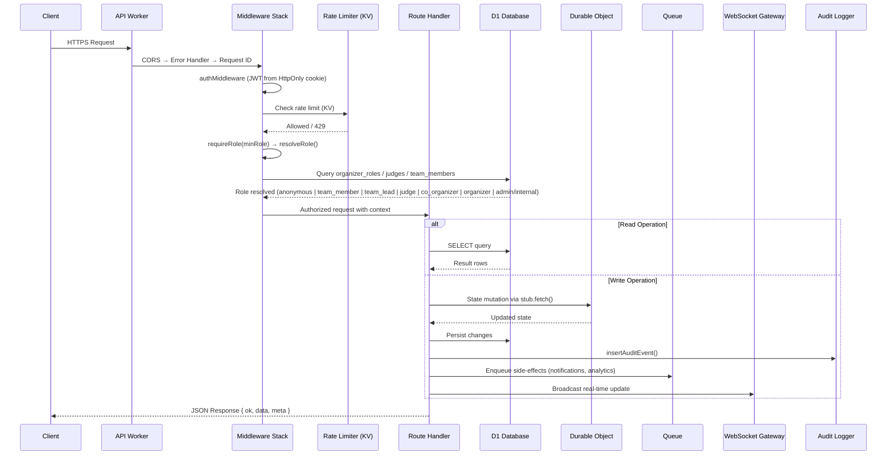
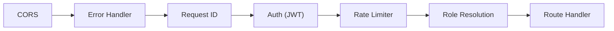
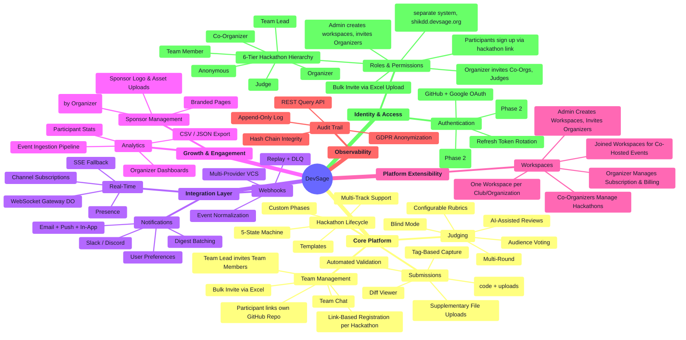
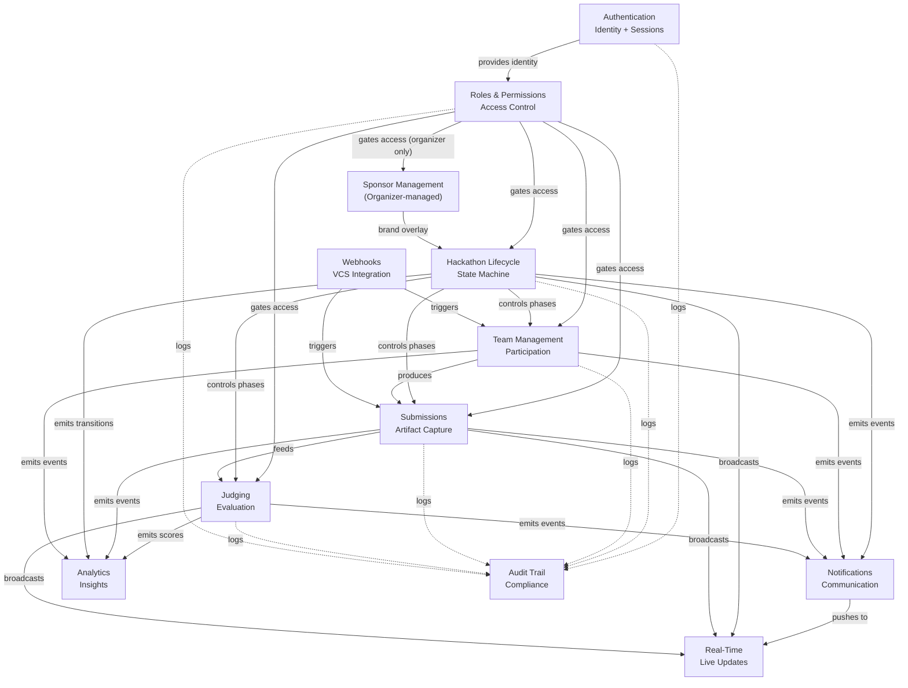
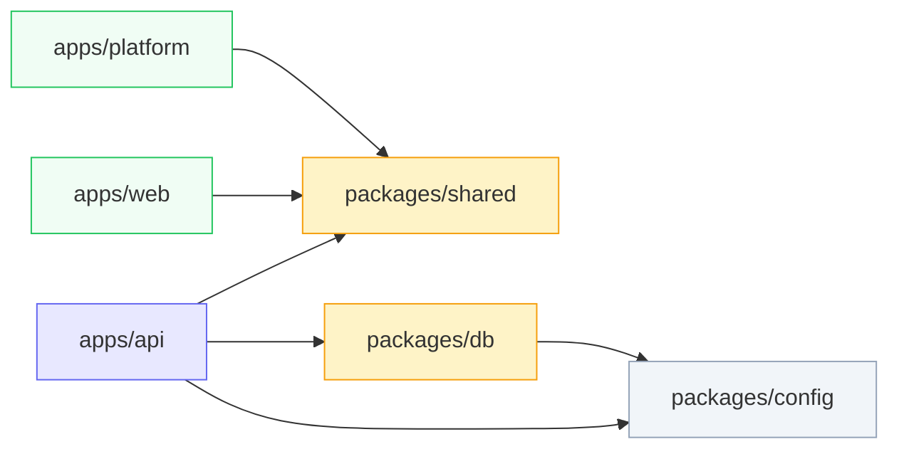
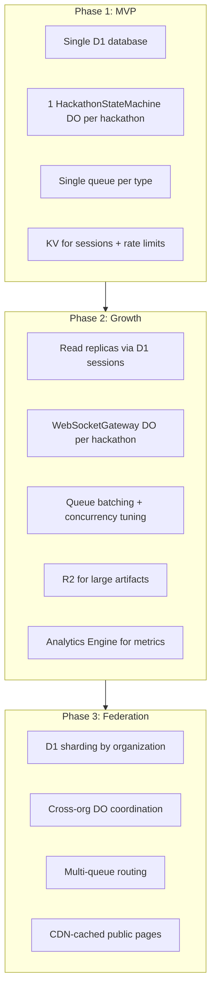
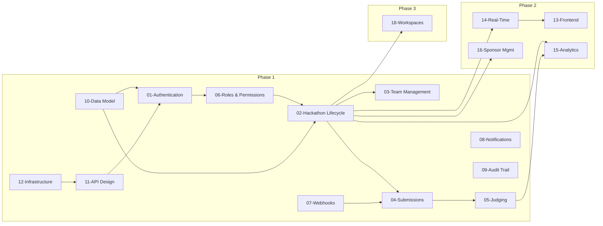

# 00 — System Overview

> DevSage is a GitHub-native hackathon management platform built on Cloudflare's edge infrastructure. Organizers configure hackathons declaratively. Participants connect GitHub repos. A GitHub App tracks commits, detects force pushes, captures tag-based submissions, and enforces deadlines — all without manual intervention. The platform scales from a single weekend hack to federated multi-organization programs with thousands of participants.

---

## Table of Contents

- [Design Goals](#design-goals)
- [Architecture Principles](#architecture-principles)
- [High-Level Architecture](#high-level-architecture)
- [Request Lifecycle](#request-lifecycle)
- [Business Domains](#business-domains)
- [Domain Interaction Map](#domain-interaction-map)
- [Monorepo Structure](#monorepo-structure)
- [Technology Stack](#technology-stack)
- [Scale Targets](#scale-targets)
- [Implementation Roadmap](#implementation-roadmap)
- [Document Index](#document-index)
- [Decision Log](#decision-log)

---

## Design Goals

| Goal | Description |
|------|-------------|
| **Zero-infrastructure hackathons** | DevSage admins (shikdd) create workspaces and invite organizers. Organizers then create hackathons within their workspace, set dates, invite judges, and configure everything — team formation, submission capture, judging — happens automatically. Each hackathon has a unique registration link; participants sign up via that link on `{slug}.devsage.org`. There is no public discovery or open self-registration — you need the hackathon link |
| **GitHub-native workflow** | Primary submissions are git tags captured via webhooks — participants stay in their git workflow for code. Participants link their own GitHub repos after signing up. The web UI provides team info, deadlines, and scores, and allows supplementary uploads (pitch decks, demo videos, design files) alongside the code submission |
| **Edge-first performance** | Every request served from the nearest Cloudflare PoP. Sub-50ms p95 latency for reads. No cold-start penalty for API requests |
| **Deterministic state management** | All lifecycle mutations go through Durable Objects — single-writer concurrency, no race conditions, exactly-once semantics |
| **Multi-tenant by default** | A single deployment serves unlimited organizations and hackathons. Tenant isolation is enforced at the data layer and role resolution, not infrastructure |
| **Progressive complexity** | Simple hackathons require zero configuration beyond dates. Advanced features (multi-track, custom rubrics, sponsor portals, mentorship) are opt-in |
| **Collaborative workspaces** | DevSage admins create workspaces (typically one per club/organization) and invite organizers into them. Co-organizers manage hackathons within the workspace. Multiple workspaces can form "joined workspaces" to co-host events across clubs |


---

## Architecture Principles

| ID | Principle | Implication |
|----|-----------|-------------|
| P1 | **Deterministic State Transitions** | All lifecycle mutations (phase transitions, submission acceptance, score finalization) go through Durable Objects — single-writer, no race conditions |
| P2 | **Bounded Execution** | Every Worker invocation completes within CPU/wall-clock limits. No unbounded loops. Pagination enforces depth limits |
| P3 | **Idempotent Operations** | Webhook handlers and state mutations are keyed by delivery ID / commit SHA / tag name. Safe to retry at any point |
| P4 | **Explicit Failure Modes** | Every external dependency has defined fail-open or fail-closed behavior. No silent failures. All errors produce audit events |
| P5 | **Auditability** | Every state-changing operation produces an append-only audit event with actor, action, target, diff, and timestamp |
| P6 | **Graceful Degradation** | Non-critical features (AI reviews, email notifications, analytics, sponsor dashboards) degrade without blocking core submission and judging paths |
| P7 | **Edge-Native Only** | Only Cloudflare first-party primitives (Workers, D1, DO, KV, R2, Queues, Analytics Engine) plus external APIs (GitHub, SMTP, AI providers). No VMs, no containers, no origin servers |
| P8 | **Tenant Isolation** | Every data query is scoped to a hackathon ID. Roles are resolved per-request per-hackathon. No ambient authority leaks across tenants |
| P9 | **Forward-Only Migrations** | Database schema changes are always additive. Columns are never renamed or removed in the same migration that adds them. Rollback = deploy previous Worker version (D1 schema is append-only) |

---

## High-Level Architecture

```mermaid
graph TD
    subgraph Clients
        ADMIN["shikdd.devsage.org<br/>Admin Panel<br/>(React + Vite)"]
        PLATFORM["platform.devsage.org<br/>Organizer Dashboard<br/>(React + Vite + Tailwind v4 + shadcn/ui)"]
        PARTICIPANT["{slug}.devsage.org<br/>Participant Sites<br/>(separate repos)"]
        SDK["Client SDK<br/>(TypeScript)"]

    end

    ADMIN -->|"HTTPS REST"| API
    PLATFORM -->|"HTTPS REST + SSE"| API
    PARTICIPANT -->|"HTTPS REST + SSE"| API
    SDK -->|"HTTPS REST"| API


    subgraph CF["Cloudflare Edge"]
        API["API Worker<br/>(Hono)"]

        subgraph DOs["Durable Objects"]
            HSM["HackathonStateMachine<br/>(lifecycle + submissions)"]
            WSG["WebSocketGateway<br/>(real-time channels)"]

        end

        subgraph Queues
            Q_WH["WEBHOOK_QUEUE<br/>(inbound webhooks)"]
            Q_NF["NOTIFICATION_QUEUE<br/>(email + push + in-app)"]
            Q_AN["ANALYTICS_QUEUE<br/>(event ingestion)"]

        end

        CRON["Cron Triggers<br/>(hourly + daily)"]
    end

    API -->|"stub.fetch()"| HSM
    API -->|"stub.fetch()"| WSG

    API -->|"enqueue"| Q_WH
    API -->|"enqueue"| Q_NF
    API -->|"enqueue"| Q_AN

    CRON -->|"scheduled()"| API

    subgraph Storage
        D1[("D1 / SQLite<br/>~31 tables")]
        KV["KV<br/>OAuth state · rate limits<br/>session cache · feature flags"]
        R2["R2<br/>Sponsor assets · avatars<br/>submission artifacts · exports"]
        AE["Analytics Engine<br/>Event time-series"]
    end

    API --> D1
    API --> KV
    API --> R2
    API --> AE
    HSM -->|"reads via Worker"| D1
    WSG -->|"reads via Worker"| D1

    subgraph External["External Services"]
        GH["GitHub API<br/>OAuth + Webhooks + Bot"]
        GL["GitLab API<br/>(future)"]
        GOOGLE["Google OAuth"]
        SMTP["SMTP Relay<br/>Transactional email"]
        PUSH["Web Push<br/>Push notifications"]
        AI["AI Provider<br/>Code reviews + summaries"]
        SLACK["Slack / Discord<br/>Channel notifications"]
    end

    Q_WH -->|"consume"| API
    Q_NF -->|"consume"| API
    Q_AN -->|"consume"| API

    API --> GH
    API --> GOOGLE
    API --> SMTP
    API --> PUSH
    API --> AI
    API --> SLACK
```



---

## Request Lifecycle

Every inbound request follows this path through the system:



### Middleware Stack Order



| Middleware | Behavior on Failure | Applied To |
|-----------|---------------------|------------|
| CORS | Reject with 403 (wrong origin) | All routes |
| Error Handler | Catch unhandled errors → 500 envelope | All routes |
| Request ID | Generate `X-Request-Id` header | All routes |
| Auth (JWT) | Extract JWT from `devsage_session` cookie. Missing = anonymous | All routes (optional auth variant available) |
| Rate Limiter | 429 Too Many Requests with `Retry-After` header | All routes |
| Role Resolution | Resolve per-hackathon role. Insufficient = 403 | Routes with `requireRole()` |

---

## Business Domains

DevSage is organized around 11 business domains, each with a dedicated planning document:



---

## Domain Interaction Map

How the 11 domains interact with each other at runtime:



---

## Monorepo Structure

```
DevSage/
├── apps/
│   ├── api/                    # Cloudflare Worker — Hono API + DOs + Queues + Cron
│   │   ├── src/
│   │   │   ├── routes/         # REST route handlers (one file per domain)
│   │   │   ├── middleware/     # Auth, roles, rate limiting, CORS
│   │   │   ├── durable-objects/# HackathonStateMachine, WebSocketGateway
│   │   │   ├── queue/          # Queue consumers (webhook, notification, analytics, plugin)
│   │   │   ├── services/       # External service clients (GitHub, SMTP, AI, push)
│   │   │   ├── lib/            # Shared utilities (JWT, audit, response envelope)
│   │   │   └── types/          # Worker binding types (Env)
│   │   ├── wrangler.jsonc      # Worker config, bindings, DO declarations
│   │   └── vitest.config.ts    # Cloudflare Workers test pool
│   ├── admin/                  # shikdd.devsage.org — Admin panel (React + Vite)
│   │   └── src/                # Workspace management, organizer invites, platform config
│   ├── platform/               # platform.devsage.org — Organizer dashboard (React + Vite + Tailwind v4)
│   │   ├── src/
│   │   │   ├── pages/          # Route-level page components
│   │   │   ├── components/     # Shared + shadcn/ui components
│   │   │   │   ├── ui/         # shadcn/ui primitives
│   │   │   ├── contexts/       # React contexts (auth, theme, real-time)
│   │   │   ├── hooks/          # Custom hooks (useWebSocket, useAuth, useApi)
│   │   │   ├── lib/            # API client, utilities
│   │   │   └── types/          # Frontend-specific types
│   │   └── vite.config.ts      # Dev proxy, build config
│   └── web/                    # devsage.org — Main website (React + Vite)
│       └── src/
│   # NOTE: Participant sites ({slug}.devsage.org) live in separate repos
├── packages/
│   ├── config/                 # Shared tsconfig variants + ESLint flat config
│   ├── db/                     # Drizzle ORM schemas (~31 tables) + D1 migrations
│   │   ├── src/schema/         # Table definitions (one file per domain)
│   │   └── migrations/         # SQL migration files
│   └── shared/                 # Zod schemas, types, constants (only dep: zod)
│       └── src/schemas/        # Validation schemas shared between API + frontend
├── docs/
│   ├── v2/                     # Current production documentation
│   └── v3/planned/             # Future planning documentation (this directory)
└── turbo.json                  # Turborepo pipeline config
```

### Dependency Graph



**Dependency rules:**
- `apps/api` may import from `packages/shared`, `packages/db`, and `packages/config`
- `apps/platform` may import from `packages/shared` only (never from `db` or `api`)
- `apps/web` may import from `packages/shared` only (never from `db` or `api`)
- `apps/admin` may import from `packages/shared` only (never from `db` or `api`)
- `packages/shared` has zero internal dependencies (only `zod`)
- `packages/db` may import from `packages/config` (for tsconfig)
- No circular dependencies. No cross-app imports
- Participant sites (`{slug}.devsage.org`) are maintained in separate repositories

---

## Technology Stack

| Layer | Technology | Why |
|-------|-----------|-----|
| **Runtime** | Cloudflare Workers | Edge compute, no cold starts, global deployment, pay-per-request |
| **Framework** | Hono | Lightweight, Workers-native, middleware-first, TypeScript-first |
| **Database** | Cloudflare D1 (SQLite) | Zero-latency from Workers, automatic replication, SQL-native |
| **ORM** | Drizzle | Type-safe, SQL-first, SQLite-compatible, no runtime overhead |
| **State Machine** | Durable Objects (SQLite-backed) | Single-writer concurrency, exactly-once semantics, transactional state |
| **Queues** | Cloudflare Queues | At-least-once delivery, batching, retry policies, same-Worker consumer |
| **Object Storage** | Cloudflare R2 | S3-compatible, no egress fees, edge-accessible |
| **Cache / KV** | Cloudflare KV | Global key-value, TTL support, eventual consistency (acceptable for sessions, rate limits) |
| **Analytics** | Cloudflare Analytics Engine | Time-series ingestion, SQL-queryable, no cardinality limits |
| **Frontend** | React 18 + Vite | Component-based, fast dev server, optimized builds |
| **Styling** | Tailwind CSS v4 + shadcn/ui | Utility-first, accessible component primitives, dark mode |
| **Routing** | React Router v7 | File-convention routing, nested layouts, data loading |
| **Validation** | Zod | Runtime + compile-time type safety, shared between API and frontend |
| **Auth** | Manual OAuth 2.0 + JWT | Full control over flow, no broken third-party adapters on Workers |
| **Monorepo** | Turborepo + pnpm workspaces | Incremental builds, dependency-aware task scheduling |
| **Testing** | Vitest + @cloudflare/vitest-pool-workers + Testing Library | Workers-native test execution with real bindings |
| **Real-time** | WebSocket (Durable Objects) + SSE fallback | Native DO WebSocket support, SSE for restricted environments |

---

## Scale Targets

| Metric | Phase 1 (MVP) | Phase 2 (Growth) | Phase 3 (Workspaces) |
|--------|---------------|-------------------|----------------------|
| **Concurrent hackathons** | 3 | 50 | 500+ |
| **Total users** | 500 | 10,000 | 100,000+ |
| **Teams per hackathon** | 50 | 200 | 500 |
| **Submissions per hackathon** | 50 | 200 | 500 |
| **Webhooks per hour** | 1,000 | 50,000 | 500,000 |
| **WebSocket connections** | 100 | 5,000 | 50,000 |
| **API p95 latency (reads)** | < 50ms | < 50ms | < 100ms |
| **API p95 latency (writes)** | < 200ms | < 200ms | < 300ms |
| **D1 storage** | ~20 MB | ~2 GB | ~50 GB (sharded) |
| **R2 storage** | ~100 MB | ~10 GB | ~500 GB |
| **Monthly cost** | $0 (free tier) | ~$50 | ~$500 |
| **Uptime target** | 99.5% | 99.9% | 99.95% |

### Scaling Strategy



---

## Implementation Roadmap

| Phase | Features | Target | Dependencies |
|-------|----------|--------|-------------|
| **Phase 1: Core Platform** | Authentication, Hackathon Lifecycle, Team Management, Submissions, Judging, Roles & Permissions, Webhooks (GitHub only), Notifications (email only), Audit Trail, Data Model, API Design, Infrastructure | MVP launch | None |
| **Phase 2: Engagement** | Real-Time System, Frontend Architecture (polish), Analytics & Insights, Sponsor Portal | Post-MVP | Phase 1 complete |
| **Phase 3: Platform** | Collaborative Workspaces, Notifications (push + Slack/Discord), Webhooks (GitLab + Bitbucket) | Scale-up | Phase 2 stable |

### Phase Dependency Graph



---

## Document Index

### Architecture Docs

| # | Document | Domain | Phase |
|---|----------|--------|-------|
| [00](./00-overview.md) | System Overview | Architecture | — |
| [01](./authentication.md) | Authentication & Sessions | Identity & Access | 1 |
| [02](./hackathon-lifecycle.md) | Hackathon Lifecycle | Core Platform | 1 |
| [03](./team-management.md) | Team Management | Core Platform | 1 |
| [04](./submissions.md) | Submissions & Locking | Core Platform | 1 |
| [05](./judging.md) | Judging & Scoring | Core Platform | 1 |
| [06](./roles-permissions.md) | Roles & Permissions | Identity & Access | 1 |
| [07](./webhooks-integrations.md) | Webhooks & VCS Integration | Integration Layer | 1 |
| [08](./notifications.md) | Notification System | Integration Layer | 1 |
| [09](./audit-trail.md) | Audit Trail | Observability | 1 |
| [10](./data-model.md) | Data Model & Schema | Storage | 1 |
| [11](./api-design.md) | API Design & Conventions | Interface | 1 |
| [12](./infrastructure.md) | Infrastructure & Deployment | Operations | 1 |
| [13](./frontend.md) | Frontend Architecture | Core Platform | 2 |
| [14](./real-time.md) | Real-Time System | Integration Layer | 2 |
| [15](./analytics.md) | Analytics & Insights | Observability | 2 |
| [16](./sponsor-portal.md) | Sponsor Management (Organizer-managed) | Growth & Engagement | 2 |
| [18](./federation.md) | Collaborative Workspaces | Platform Extensibility | 3 |

### Guide Docs

| Document | Purpose |
|----------|---------|
| [Developer Setup](./setup.md) | Local environment, Docker Compose, seed data, VS Code config |
| [Deployment](./deployment.md) | CI/CD pipeline, staging environments, preview deploys, rollback procedures |
| [Secrets Management](./secrets.md) | Rotation automation, environment separation, incident response |
| [Contributing](./contributing.md) | PR workflow, code review, testing standards, release process |

---

## Decision Log

| # | Decision | Choice | Why | Alternatives Considered |
|---|----------|--------|-----|------------------------|
| D1 | Runtime platform | Cloudflare Workers | Edge-native, no cold starts, pay-per-request, integrated primitives (D1, DO, KV, R2, Queues) | AWS Lambda (cold starts, separate services), Vercel Edge (limited DO equivalent), Fly.io (container overhead) |
| D2 | State management | Durable Objects (SQLite-backed) | Single-writer concurrency for hackathon lifecycle, exactly-once submission locking, transactional alarm scheduling | Redis (external dependency, not edge-native), PostgreSQL advisory locks (no Workers support), application-level locking (race conditions) |
| D3 | Database | D1 (SQLite) via Drizzle ORM | Zero-latency from Workers, SQL-native, automatic read replication, Drizzle provides type safety without runtime cost | PlanetScale (external, latency), Turso (similar but less integrated), raw D1 (no type safety) |
| D4 | Auth strategy | Manual OAuth 2.0 + custom JWT | Full control, no broken third-party adapters on Workers, HMAC SHA-256 via crypto.subtle | `@hono/oauth-providers` (broken on Workers), Auth.js (heavy, session-store dependency), Clerk/Auth0 (external dependency, cost) |
| D5 | Real-time transport | WebSocket via Durable Objects + SSE fallback | Native DO WebSocket support, per-hackathon isolation, SSE for environments that block WebSocket | Polling (wasteful, high latency), third-party (Pusher/Ably — external dependency, cost), Server-Sent Events only (no bidirectional) |
| D6 | Monorepo tooling | Turborepo + pnpm workspaces | Incremental builds, dependency-aware scheduling, native pnpm workspace support | Nx (heavier, more config), Lerna (deprecated patterns), Rush (Microsoft-specific), yarn workspaces (slower) |
| D7 | Frontend framework | React 18 + Vite + Tailwind v4 + shadcn/ui | Mature ecosystem, fast dev server, utility-first CSS, accessible component primitives, dark mode built-in | Next.js (SSR unnecessary for SPA), SvelteKit (smaller ecosystem), Vue (team familiarity), Remix (overlap with React Router v7) |
| D8 | API framework | Hono | Lightweight, Workers-native, middleware-first, TypeScript-first, excellent DX | Express (not Workers-compatible), Fastify (not Workers-compatible), itty-router (too minimal, no middleware) |
| D9 | Validation | Zod (shared package) | Single source of truth for types + runtime validation, shared between API and frontend | io-ts (more complex API), Yup (less TypeScript-native), AJV (JSON Schema — separate type definitions) |
| D10 | Queue architecture | Single Worker as producer + consumer | Simpler deployment, shared code, Cloudflare Queues require same-Worker binding | Separate consumer Worker (deployment complexity), external queue (Kafka/RabbitMQ — not edge-native) |
| D11 | Multi-tenancy model | Shared database with hackathon_id scoping | Simpler operations, lower cost, per-request role resolution provides isolation | Database-per-tenant (operational overhead at scale), schema-per-tenant (D1 doesn't support), row-level security (D1 doesn't support natively) |
| D12 | Workspace collaboration | Admin-created workspaces (one per club), joined workspaces for co-hosting | Admin creates workspaces and invites organizers. Organizers own subscription/billing. Co-organizers manage hackathons. Joined workspaces enable cross-club co-hosted events | Full federation protocol (over-engineered), org-level merging (complex permissions), self-service workspace creation (contradicts admin-controlled model) |
