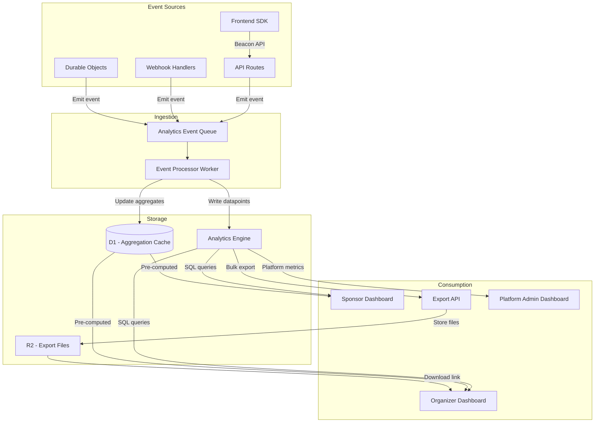
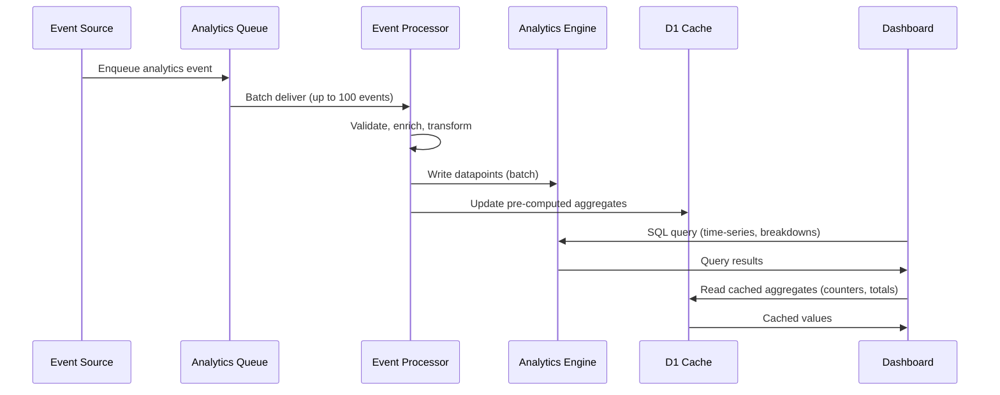
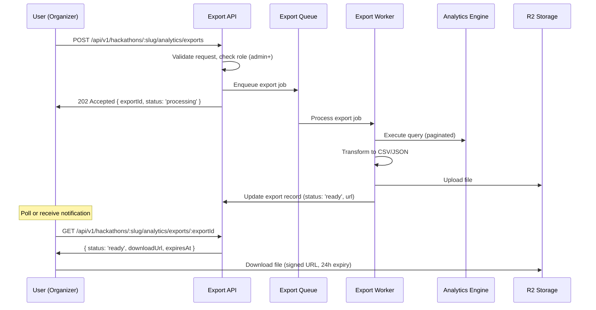

# 15 — Analytics & Insights

> Event ingestion pipeline powered by Cloudflare Analytics Engine, pre-computed dashboards for organizers and sponsors, real-time metrics, and self-service CSV/JSON export — giving hackathon stakeholders full visibility into engagement, participation, and outcomes.

---

## Table of Contents

1. [Design Goals](#design-goals)
2. [Architecture Overview](#architecture-overview)
3. [Event Ingestion](#event-ingestion)
4. [Event Taxonomy](#event-taxonomy)
5. [Analytics Engine Schema](#analytics-engine-schema)
6. [Pre-computed Aggregations](#pre-computed-aggregations)
7. [Dashboards](#dashboards)
8. [Export System](#export-system)
9. [Privacy & Data Governance](#privacy--data-governance)
10. [API Endpoints](#api-endpoints)
11. [Edge Cases](#edge-cases)
12. [Error Codes](#error-codes)
13. [Database Tables](#database-tables)
14. [Decision Log](#decision-log)

---

## Design Goals

| Goal | Target | Rationale |
|------|--------|-----------|
| Ingestion latency | < 100ms from event to Analytics Engine | Organizers monitoring real-time dashboards during events |
| Dashboard load time | < 2s for any dashboard view | Stakeholders need instant answers, not loading spinners |
| Query time range | 1 minute to 365 days | From real-time monitoring to yearly organizational reports |
| Export size | Up to 1M rows | Sponsors and researchers need full datasets |
| Data retention | 2 years | Organizational reporting across multiple hackathon cycles |
| Sampling rate | 100% for hackathon events | Every event matters at hackathon scale (not billions of pageviews) |
| Zero PII in analytics | No emails, IPs, or names in raw events | GDPR/CCPA compliance by design |
| Cost per hackathon | < $0.10/month analytics overhead | Cloudflare Analytics Engine has generous free tier |

---

## Architecture Overview



### Data Flow



---

## Event Ingestion

### Ingestion Pipeline

Events flow through a Cloudflare Queue for reliable, ordered processing:

```typescript
// Event emitted at source (API route, webhook handler, etc.)
interface AnalyticsEvent {
  // Required fields
  hackathonId: string;
  category: EventCategory;
  action: string;
  timestamp: string;         // ISO-8601, always server-generated
  
  // Context (auto-populated by middleware)
  actorId?: string;          // Pseudonymized user ID (not raw user ID)
  actorRole?: string;        // Role at time of event
  sessionId?: string;        // Browser session ID (frontend events only)
  
  // Dimensions (filterable)
  dimensions: Record<string, string>;  // Max 20 dimensions
  
  // Metrics (aggregatable)
  metrics: Record<string, number>;     // Max 20 metrics
}

type EventCategory = 
  | 'registration'
  | 'team'
  | 'submission'
  | 'judging'
  | 'engagement'
  | 'webhook'
  | 'notification'
  | 'sponsor'
  | 'mentor'
  | 'platform';
```

### Ingestion Middleware

A reusable middleware/utility function that any route handler can call:

```typescript
interface AnalyticsEmitter {
  // Fire-and-forget: enqueue event for async processing
  track(event: AnalyticsEvent): void;
  
  // Batch multiple events (e.g., from queue consumer processing)
  trackBatch(events: AnalyticsEvent[]): void;
  
  // Convenience methods for common events
  trackRegistration(hackathonId: string, actorId: string, method: 'form' | 'invite'): void;
  trackSubmission(hackathonId: string, teamId: string, tag: string, status: string): void;
  trackPageView(hackathonId: string, page: string, sessionId: string): void;
}
```

### Event Enrichment

The Event Processor enriches raw events before writing to Analytics Engine:

| Enrichment | Source | Purpose |
|------------|--------|---------|
| `hackathon_slug` | D1 lookup (cached) | Human-readable hackathon identifier in queries |
| `hackathon_phase` | Hackathon state machine | Know which phase the event occurred during |
| `day_of_week` | Timestamp | Day-of-week analysis |
| `hour_of_day` | Timestamp | Time-of-day patterns |
| `time_since_start` | Hackathon start date | Relative timing (hour 1, hour 24, etc.) |
| `actor_pseudonym` | SHA-256(actorId + salt) | Privacy-safe actor tracking |

---

## Event Taxonomy

### Registration Events

| Action | Dimensions | Metrics | Trigger |
|--------|-----------|---------|---------|
| `registration.started` | `method`, `source`, `referrer` | — | User begins registration flow |
| `registration.completed` | `method`, `source`, `referrer`, `track` | `duration_ms` | User completes registration |
| `registration.abandoned` | `method`, `source`, `step` | `duration_ms` | User exits registration without completing |
| `registration.waitlisted` | `source` | — | Registration when capacity full |
| `registration.promoted` | — | — | Waitlisted user promoted to participant |

### Team Events

| Action | Dimensions | Metrics | Trigger |
|--------|-----------|---------|---------|
| `team.created` | `size_limit`, `track` | — | New team formed |
| `team.member_joined` | `join_method` | `team_size` | Member added to team |
| `team.member_left` | `reason` | `team_size` | Member leaves team |
| `team.repo_linked` | `provider` | — | Repository connected |
| `team.dissolved` | `reason` | `member_count` | Team removed |

### Submission Events

| Action | Dimensions | Metrics | Trigger |
|--------|-----------|---------|---------|
| `submission.created` | `track`, `tag_pattern` | `file_count`, `total_size_bytes` | Tag pushed, submission captured |
| `submission.validated` | `track`, `validation_result` | `validation_duration_ms` | Automated validation complete |
| `submission.rejected` | `track`, `rejection_reason` | — | Submission failed validation |
| `submission.updated` | `track`, `version` | `changes_count` | Updated submission (new tag) |

### Judging Events

| Action | Dimensions | Metrics | Trigger |
|--------|-----------|---------|---------|
| `judging.score_submitted` | `round`, `track`, `rubric_category` | `score`, `duration_ms` | Judge submits a score |
| `judging.assignment_accepted` | `round` | — | Judge accepts assignment |
| `judging.round_completed` | `round` | `submissions_scored`, `avg_score` | All scores in for a round |
| `judging.audience_vote` | `track` | — | Audience member casts vote |
| `judging.ai_review_completed` | `track`, `model` | `duration_ms`, `token_count` | AI review generated |

### Engagement Events

| Action | Dimensions | Metrics | Trigger |
|--------|-----------|---------|---------|
| `engagement.page_view` | `page`, `referrer` | `session_duration_ms` | Page loaded (frontend beacon) |
| `engagement.announcement_viewed` | `announcement_id`, `priority` | — | User sees announcement |
| `engagement.leaderboard_viewed` | — | — | User views leaderboard |
| `engagement.mentor_requested` | `topic` | — | Participant requests mentor |
| `engagement.sponsor_clicked` | `sponsor_id`, `placement` | — | User interacts with sponsor content |
| `engagement.export_downloaded` | `format`, `dataset` | `row_count` | User downloads export file |

### Webhook Events

| Action | Dimensions | Metrics | Trigger |
|--------|-----------|---------|---------|
| `webhook.received` | `provider`, `event_type` | `payload_size_bytes` | Webhook delivered |
| `webhook.processed` | `provider`, `event_type`, `result` | `processing_duration_ms` | Webhook processing complete |
| `webhook.failed` | `provider`, `event_type`, `error` | `retry_count` | Webhook processing failed |

### Platform Events (admin visibility only)

| Action | Dimensions | Metrics | Trigger |
|--------|-----------|---------|---------|
| `platform.hackathon_created` | `template` | — | New hackathon created |
| `platform.user_signup` | `provider` | — | New user registration |
| `platform.api_request` | `method`, `path`, `status` | `duration_ms` | API request completed |
| `platform.error` | `type`, `path` | — | Server error occurred |

---

## Analytics Engine Schema

Cloudflare Analytics Engine uses a structured datapoint format with blobs (strings) and doubles (numbers).

### Datapoint Schema

```typescript
interface AnalyticsDatapoint {
  // Indexes (filterable, up to 20)
  indexes: [
    string,  // index1: hackathon_id
  ];
  
  // Blobs (string dimensions, up to 20)
  blobs: [
    string,  // blob1: category (e.g., 'submission')
    string,  // blob2: action (e.g., 'submission.created')
    string,  // blob3: hackathon_slug
    string,  // blob4: hackathon_phase
    string,  // blob5: actor_pseudonym
    string,  // blob6: actor_role
    string,  // blob7: dimension_1_key
    string,  // blob8: dimension_1_value
    string,  // blob9: dimension_2_key
    string,  // blob10: dimension_2_value
    string,  // blob11: dimension_3_key
    string,  // blob12: dimension_3_value
    string,  // blob13: dimension_4_key
    string,  // blob14: dimension_4_value
    string,  // blob15: session_id (frontend events)
    string,  // blob16: day_of_week
    string,  // blob17: hour_of_day
    string,  // blob18-20: reserved for future use
  ];
  
  // Doubles (numeric metrics, up to 20)
  doubles: [
    number,  // double1: metric_1 (e.g., duration_ms)
    number,  // double2: metric_2 (e.g., score)
    number,  // double3: metric_3 (e.g., file_count)
    number,  // double4: metric_4 (e.g., total_size_bytes)
    number,  // double5: time_since_hackathon_start_hours
    number,  // double6-20: reserved for future use
  ];
}
```

### Query Examples

```sql
-- Registrations per day for a hackathon
SELECT
  toDate(timestamp) AS date,
  count() AS registrations
FROM analytics_events
WHERE index1 = 'hack_abc123'
  AND blob1 = 'registration'
  AND blob2 = 'registration.completed'
  AND timestamp >= '2026-01-01'
GROUP BY date
ORDER BY date

-- Submission count by track
SELECT
  blob8 AS track,  -- dimension_1_value where dimension_1_key = 'track'
  count() AS submissions
FROM analytics_events
WHERE index1 = 'hack_abc123'
  AND blob2 = 'submission.created'
  AND blob7 = 'track'
GROUP BY track

-- Average judging time per round
SELECT
  blob8 AS round,
  avg(double1) AS avg_duration_ms
FROM analytics_events
WHERE index1 = 'hack_abc123'
  AND blob2 = 'judging.score_submitted'
  AND blob7 = 'round'
GROUP BY round

-- Hourly activity heatmap
SELECT
  blob16 AS day_of_week,
  blob17 AS hour_of_day,
  count() AS events
FROM analytics_events
WHERE index1 = 'hack_abc123'
  AND blob1 = 'engagement'
GROUP BY day_of_week, hour_of_day

-- Sponsor click-through rates
SELECT
  blob8 AS sponsor_id,
  blob10 AS placement,
  count() AS clicks,
  uniq(blob5) AS unique_users
FROM analytics_events
WHERE index1 = 'hack_abc123'
  AND blob2 = 'engagement.sponsor_clicked'
GROUP BY sponsor_id, placement
```

---

## Pre-computed Aggregations

For counters and totals that are queried frequently and updated on every event, we maintain pre-computed aggregates in D1. This avoids hitting Analytics Engine for simple counts.

### Aggregate Types

```typescript
interface AggregateEntry {
  hackathonId: string;
  metric: string;
  dimension?: string;       // Optional grouping (e.g., track name)
  value: number;
  lastUpdatedAt: string;
}
```

### Maintained Aggregates

| Metric | Dimension | Update Trigger |
|--------|-----------|---------------|
| `total_registrations` | — | `registration.completed` |
| `total_registrations_by_track` | `track` | `registration.completed` |
| `total_teams` | — | `team.created` |
| `total_submissions` | — | `submission.created` |
| `total_submissions_by_track` | `track` | `submission.created` |
| `total_scores_submitted` | — | `judging.score_submitted` |
| `total_audience_votes` | — | `judging.audience_vote` |
| `total_page_views` | — | `engagement.page_view` |
| `unique_visitors` | — | `engagement.page_view` (HyperLogLog via session) |
| `total_commits` | — | `webhook.received` (push events) |
| `total_pull_requests` | — | `webhook.received` (PR events) |
| `total_mentor_sessions` | — | `engagement.mentor_requested` |
| `total_sponsor_clicks` | `sponsor_id` | `engagement.sponsor_clicked` |

### Update Strategy

Aggregates are updated atomically by the Event Processor using D1 transactions:

```sql
-- Atomic increment
INSERT INTO analytics_aggregates (hackathon_id, metric, dimension, value, updated_at)
VALUES (?, ?, ?, 1, ?)
ON CONFLICT (hackathon_id, metric, dimension)
DO UPDATE SET value = value + 1, updated_at = excluded.updated_at;
```

---

## Dashboards

### Organizer Dashboard

Available to `admin+` roles. Shows hackathon health and engagement metrics.

```
┌─────────────────────────────────────────────────────────────┐
│  Hackathon Analytics — Summer Hack 2026                      │
│  Phase: ACTIVE │ Day 2 of 3 │ 23h 14m remaining             │
├──────────┬──────────┬──────────┬──────────┬─────────────────┤
│  Teams   │ Partici- │ Submis-  │ Commits  │  Online Now     │
│  48      │ pants    │ sions    │ 1,247    │  234            │
│  (+3 ↑)  │ 186      │ 12       │ (+89 ↑)  │                 │
│          │ (+12 ↑)  │          │          │                 │
├──────────┴──────────┴──────────┴──────────┴─────────────────┤
│                                                              │
│  Registration Funnel              Activity Over Time         │
│  ┌─────────────────┐             ┌─────────────────────┐    │
│  │ Visited: 2,450  │             │ ~~^~~  ~~~~^~~~~     │    │
│  │ Started: 890    │             │ commits  PRs  subs   │    │
│  │ Completed: 186  │             │                      │    │
│  │ Conv: 7.6%      │             │ [hourly / daily]     │    │
│  └─────────────────┘             └─────────────────────┘    │
│                                                              │
│  Submissions by Track             Team Size Distribution     │
│  ┌─────────────────┐             ┌─────────────────────┐    │
│  │ AI/ML:     5    │             │ ██ 1 member: 4      │    │
│  │ Web:       4    │             │ ████ 2 members: 12  │    │
│  │ Mobile:    2    │             │ ██████ 3 members: 18│    │
│  │ Open:      1    │             │ ████ 4 members: 14  │    │
│  └─────────────────┘             └─────────────────────┘    │
│                                                              │
│  Engagement Heatmap               Top Active Teams           │
│  ┌─────────────────┐             ┌─────────────────────┐    │
│  │ Mon-Sun × 0-23h │             │ 1. Team Alpha (89c) │    │
│  │ [heatmap grid]   │             │ 2. ByteForge (67c)  │    │
│  │                  │             │ 3. NullPtr (52c)    │    │
│  └─────────────────┘             └─────────────────────┘    │
│                                                              │
│  [Export CSV]  [Export JSON]  [Schedule Report]               │
└─────────────────────────────────────────────────────────────┘
```

### Dashboard Widgets

| Widget | Data Source | Refresh |
|--------|-----------|---------|
| Summary counters | D1 aggregates | Real-time (WebSocket) |
| Registration funnel | Analytics Engine query | 1 minute |
| Activity over time | Analytics Engine query | 1 minute |
| Submissions by track | D1 aggregates | Real-time |
| Team size distribution | Analytics Engine query | 5 minutes |
| Engagement heatmap | Analytics Engine query | 5 minutes |
| Top active teams | Analytics Engine query | 1 minute |
| Online now | KV presence snapshot | 10 seconds |

### Sponsor Dashboard

Available to users with `sponsor` permission flag. Shows sponsor-specific metrics.

| Widget | Description |
|--------|-------------|
| Impressions | How many times sponsor content was viewed |
| Click-through rate | Clicks on sponsor links / total impressions |
| Unique visitors | Distinct users who saw sponsor content |
| Lead captures | Form submissions from sponsor-branded pages |
| Placement performance | Breakdown by placement location (banner, sidebar, page) |
| Comparison | Performance vs. other sponsors at same tier (anonymized) |

### Platform Admin Dashboard

Available to platform `owner` role only. Cross-hackathon platform metrics.

| Widget | Description |
|--------|-------------|
| Total hackathons | Active, completed, draft counts |
| User growth | New signups over time |
| API health | Request count, error rate, p50/p95 latency |
| Queue depth | Messages pending in each queue |
| Top hackathons | By registration count, engagement, submissions |
| Error log | Recent 5xx errors with stack traces |

---

## Export System

### Export Flow



### Export Formats

| Format | Content-Type | Use Case |
|--------|-------------|----------|
| CSV | `text/csv` | Spreadsheet analysis, importing into other tools |
| JSON | `application/json` | Programmatic consumption, API integration |
| JSON Lines | `application/x-ndjson` | Streaming processing, large datasets |

### Export Datasets

| Dataset | Description | Max Rows | Available To |
|---------|-------------|----------|-------------|
| `registrations` | All registration events with metadata | 100K | admin+ |
| `submissions` | Submission events with validation results | 50K | admin+ |
| `judging_scores` | All scores with rubric breakdowns | 50K | admin+ |
| `activity` | Git activity (commits, PRs, issues) | 500K | admin+ |
| `engagement` | Page views, interactions | 1M | admin+ |
| `sponsor_metrics` | Sponsor impressions, clicks, leads | 100K | admin+, sponsor |
| `full_export` | All events combined | 1M | owner only |

### Export Request

```typescript
interface ExportRequest {
  dataset: string;            // Which dataset to export
  format: 'csv' | 'json' | 'jsonl';
  timeRange: {
    from: string;             // ISO-8601 start
    to: string;               // ISO-8601 end
  };
  filters?: {
    track?: string;
    phase?: string;
    category?: string;
  };
  columns?: string[];         // Subset of columns (default: all)
}

interface ExportResponse {
  id: string;                 // Export job ID
  status: 'queued' | 'processing' | 'ready' | 'failed' | 'expired';
  dataset: string;
  format: string;
  rowCount?: number;          // Populated when ready
  fileSizeBytes?: number;     // Populated when ready
  downloadUrl?: string;       // Signed R2 URL, 24h expiry
  expiresAt?: string;         // When the download link expires
  createdAt: string;
  completedAt?: string;
  error?: string;             // Error message if failed
}
```

### Export Limits

| Limit | Value | Rationale |
|-------|-------|-----------|
| Max rows per export | 1M | R2 upload size + processing time |
| Max file size | 100 MB | Reasonable download size |
| Max concurrent exports per hackathon | 3 | Prevent resource abuse |
| Export file retention | 7 days | Storage cost management |
| Rate limit | 10 exports per hour per hackathon | Prevent runaway export jobs |
| Processing timeout | 5 minutes | Kill hung export jobs |

### Scheduled Reports

Organizers can schedule recurring export jobs:

```typescript
interface ScheduledReport {
  id: string;
  hackathonId: string;
  dataset: string;
  format: 'csv' | 'json';
  schedule: 'daily' | 'weekly';   // Cron-triggered
  recipients: string[];            // Email addresses
  filters?: Record<string, string>;
  enabled: boolean;
  lastRunAt?: string;
  nextRunAt: string;
}
```

Scheduled reports are processed by the hourly cron trigger. The report is generated, uploaded to R2, and a notification email is sent with the download link.

---

## Privacy & Data Governance

### PII Handling

| Data Type | Handling | Storage |
|-----------|---------|---------|
| User ID | Pseudonymized (SHA-256 hash with rotating salt) | Analytics Engine |
| Email | Never stored in analytics | — |
| IP address | Never stored in analytics | — |
| Display name | Never stored in analytics | — |
| Session ID | Random UUID, no user linkage | Analytics Engine |
| Hackathon role | Stored (not PII) | Analytics Engine |

### Pseudonymization

```typescript
// Actor IDs are pseudonymized before ingestion
function pseudonymize(userId: string, salt: string): string {
  // SHA-256(userId + daily rotating salt)
  // Same user gets same pseudonym within a day (for unique counts)
  // Different pseudonym across days (prevents long-term tracking)
  return sha256(`${userId}:${salt}`).substring(0, 16);
}
```

### Data Retention

| Data Type | Retention | Deletion Method |
|-----------|-----------|----------------|
| Analytics Engine datapoints | 2 years | Automatic (Cloudflare retention policy) |
| D1 aggregate cache | Lifetime of hackathon + 1 year | Cron cleanup job |
| R2 export files | 7 days | R2 lifecycle rule |
| Scheduled reports | Until disabled or hackathon archived | Manual or archival cleanup |

### GDPR Compliance

| Right | Implementation |
|-------|---------------|
| Right to access | Export API provides all analytics data for a hackathon |
| Right to erasure | Pseudonymized data cannot be linked back to user. Salt rotation ensures eventual de-linkage |
| Right to restrict | Users can opt out of engagement tracking (page views) via account settings |
| Data portability | CSV/JSON export in standard formats |

### Opt-out Mechanism

Users can opt out of frontend engagement tracking:

```typescript
interface AnalyticsPreferences {
  trackPageViews: boolean;      // Default: true
  trackInteractions: boolean;   // Default: true
  // Note: server-side events (submissions, scores) are always tracked
  // because they are operational data, not behavioral tracking
}
```

When opted out, the frontend SDK does not emit `engagement.*` events. Server-side events (registrations, submissions, scores) are always recorded because they are operational, not behavioral.

---

## API Endpoints

### Dashboard Data

| Method | Path | Auth | Min Role | Description |
|--------|------|------|----------|-------------|
| GET | `/api/v1/hackathons/:slug/analytics/summary` | JWT | admin | Summary counters (from D1 aggregates) |
| GET | `/api/v1/hackathons/:slug/analytics/registrations` | JWT | admin | Registration funnel data |
| GET | `/api/v1/hackathons/:slug/analytics/activity` | JWT | admin | Activity timeline (commits, PRs, submissions) |
| GET | `/api/v1/hackathons/:slug/analytics/engagement` | JWT | admin | Engagement metrics (page views, heatmap) |
| GET | `/api/v1/hackathons/:slug/analytics/teams` | JWT | admin | Team statistics (size distribution, activity ranking) |
| GET | `/api/v1/hackathons/:slug/analytics/submissions` | JWT | admin | Submission metrics by track, validation results |
| GET | `/api/v1/hackathons/:slug/analytics/judging` | JWT | admin | Judging progress, score distributions |
| GET | `/api/v1/hackathons/:slug/analytics/sponsors` | JWT | admin | Sponsor performance metrics |

### Query Parameters (common to all dashboard endpoints)

| Parameter | Type | Default | Description |
|-----------|------|---------|-------------|
| `from` | ISO-8601 | Hackathon start date | Start of time range |
| `to` | ISO-8601 | Now | End of time range |
| `granularity` | `minute` \| `hour` \| `day` | Auto-detected from range | Time bucket size |
| `track` | string | All tracks | Filter by track |
| `phase` | string | All phases | Filter by hackathon phase |

### Export Endpoints

| Method | Path | Auth | Min Role | Description |
|--------|------|------|----------|-------------|
| POST | `/api/v1/hackathons/:slug/analytics/exports` | JWT | admin | Create export job |
| GET | `/api/v1/hackathons/:slug/analytics/exports` | JWT | admin | List export jobs |
| GET | `/api/v1/hackathons/:slug/analytics/exports/:exportId` | JWT | admin | Get export job status + download URL |
| DELETE | `/api/v1/hackathons/:slug/analytics/exports/:exportId` | JWT | admin | Cancel/delete export job |

### Scheduled Report Endpoints

| Method | Path | Auth | Min Role | Description |
|--------|------|------|----------|-------------|
| POST | `/api/v1/hackathons/:slug/analytics/reports` | JWT | admin | Create scheduled report |
| GET | `/api/v1/hackathons/:slug/analytics/reports` | JWT | admin | List scheduled reports |
| PATCH | `/api/v1/hackathons/:slug/analytics/reports/:reportId` | JWT | admin | Update scheduled report |
| DELETE | `/api/v1/hackathons/:slug/analytics/reports/:reportId` | JWT | admin | Delete scheduled report |

### Sponsor-Specific Endpoints

| Method | Path | Auth | Min Role | Description |
|--------|------|------|----------|-------------|
| GET | `/api/v1/hackathons/:slug/analytics/sponsors/:sponsorId` | JWT | sponsor | Sponsor's own metrics |
| POST | `/api/v1/hackathons/:slug/analytics/sponsors/:sponsorId/export` | JWT | sponsor | Export sponsor's own data |

### Platform Admin Endpoints

| Method | Path | Auth | Min Role | Description |
|--------|------|------|----------|-------------|
| GET | `/api/v1/admin/analytics/platform` | JWT | platform_owner | Platform-wide metrics |
| GET | `/api/v1/admin/analytics/hackathons` | JWT | platform_owner | Cross-hackathon comparison |
| GET | `/api/v1/admin/analytics/api-health` | JWT | platform_owner | API request metrics |

### Ingestion Endpoint (Frontend SDK)

| Method | Path | Auth | Min Role | Description |
|--------|------|------|----------|-------------|
| POST | `/api/v1/analytics/events` | JWT | participant | Batch ingest frontend events |

```typescript
// Frontend event batch (max 50 events per request)
interface EventBatchRequest {
  events: Array<{
    action: string;
    dimensions?: Record<string, string>;
    metrics?: Record<string, number>;
    timestamp: string;
  }>;
}
```

The frontend SDK batches events and sends them every 10 seconds or when the batch reaches 50 events, whichever comes first. Uses `navigator.sendBeacon()` on page unload for reliability.

---

## Edge Cases

| Scenario | Behavior |
|----------|----------|
| Analytics Engine is down | Events queued in Cloudflare Queue (7-day retention). Replayed when AE recovers |
| Export job exceeds 5-minute timeout | Job marked as `failed` with error message. User can retry with narrower time range or filters |
| Hackathon has zero events | Dashboard shows empty states with helpful messages ("No submissions yet") |
| Two export jobs request overlapping data | Both run independently — no deduplication (simple, correct) |
| Export file exceeds 100MB | Processing truncates at 100MB with warning in export metadata |
| User opts out of tracking mid-hackathon | Future `engagement.*` events stop. Historical data remains (pseudonymized, cannot be linked) |
| Salt rotation occurs during active hackathon | Same user gets new pseudonym. Unique user counts may slightly overcount during rotation window (acceptable) |
| Hackathon spans timezone boundary | All timestamps UTC. Dashboard displays in organizer's configured timezone |
| Sponsor views analytics for wrong hackathon | Sponsor permission is per-hackathon. Role check prevents cross-hackathon access |
| Cron job generates scheduled report but hackathon is archived | Report generated with final data. Schedule automatically disabled on next run |
| Frontend SDK fails to send events (ad blocker, network) | Events silently dropped. Server-side events (the important ones) are unaffected |
| Analytics query returns too many rows | Queries capped at 10,000 rows. Dashboard uses `LIMIT` and aggregation. Export API handles large results via pagination |
| Concurrent aggregate updates (race condition) | D1 `ON CONFLICT ... SET value = value + 1` is atomic. Queue consumer processes events sequentially per hackathon |

---

## Error Codes

| Code | HTTP Status | Condition |
|------|-------------|-----------|
| `ANALYTICS_FORBIDDEN` | 403 | User lacks admin+ role for analytics access |
| `ANALYTICS_HACKATHON_NOT_FOUND` | 404 | Hackathon slug doesn't exist |
| `ANALYTICS_INVALID_TIME_RANGE` | 400 | `from` is after `to`, or range exceeds 365 days |
| `ANALYTICS_INVALID_GRANULARITY` | 400 | Requested granularity too fine for time range (e.g., minute for 30 days) |
| `ANALYTICS_QUERY_TIMEOUT` | 504 | Analytics Engine query exceeded 10s timeout |
| `EXPORT_LIMIT_EXCEEDED` | 429 | Too many concurrent exports or rate limit exceeded |
| `EXPORT_NOT_FOUND` | 404 | Export job ID doesn't exist |
| `EXPORT_EXPIRED` | 410 | Export file has been deleted (past 7-day retention) |
| `EXPORT_FAILED` | 500 | Export processing failed (check error message) |
| `EXPORT_TOO_LARGE` | 413 | Requested export exceeds 1M row limit |
| `REPORT_NOT_FOUND` | 404 | Scheduled report ID doesn't exist |
| `REPORT_INVALID_SCHEDULE` | 400 | Invalid schedule configuration |
| `EVENT_BATCH_TOO_LARGE` | 400 | Frontend event batch exceeds 50 events |
| `EVENT_INVALID_FORMAT` | 400 | Event missing required fields or invalid dimension/metric types |
| `SPONSOR_ANALYTICS_FORBIDDEN` | 403 | User is not a sponsor for this hackathon |

---

## Database Tables

### analytics_aggregates

Pre-computed counters stored in D1 for fast dashboard reads.

| Column | Type | Constraints | Description |
|--------|------|-------------|-------------|
| `hackathon_id` | TEXT | NOT NULL, FK → hackathons.id | Hackathon this aggregate belongs to |
| `metric` | TEXT | NOT NULL | Metric name (e.g., `total_registrations`) |
| `dimension` | TEXT | NOT NULL, DEFAULT '' | Grouping dimension (e.g., track name, empty for totals) |
| `value` | REAL | NOT NULL, DEFAULT 0 | Current aggregate value |
| `updated_at` | TEXT | NOT NULL | Last update timestamp |

**Primary Key:** `(hackathon_id, metric, dimension)`

**Indexes:**
- `idx_agg_hackathon` → `(hackathon_id)` — fetch all aggregates for a dashboard

### analytics_exports

Tracks export job status and download URLs.

| Column | Type | Constraints | Description |
|--------|------|-------------|-------------|
| `id` | TEXT | PRIMARY KEY | Export job ID (`exp_` prefix + UUID) |
| `hackathon_id` | TEXT | NOT NULL, FK → hackathons.id | Hackathon context |
| `requested_by` | TEXT | NOT NULL, FK → users.id | User who requested the export |
| `dataset` | TEXT | NOT NULL | Dataset name (e.g., `registrations`) |
| `format` | TEXT | NOT NULL | `csv`, `json`, or `jsonl` |
| `status` | TEXT | NOT NULL, DEFAULT 'queued' | `queued`, `processing`, `ready`, `failed`, `expired` |
| `time_range_from` | TEXT | NOT NULL | Start of exported time range |
| `time_range_to` | TEXT | NOT NULL | End of exported time range |
| `filters` | TEXT | NULL | JSON-encoded filter criteria |
| `row_count` | INTEGER | NULL | Number of rows in export (when ready) |
| `file_size_bytes` | INTEGER | NULL | File size (when ready) |
| `r2_key` | TEXT | NULL | R2 object key for the export file |
| `download_url` | TEXT | NULL | Signed download URL (24h expiry) |
| `error_message` | TEXT | NULL | Error details (when failed) |
| `expires_at` | TEXT | NULL | When the file will be deleted |
| `created_at` | TEXT | NOT NULL, DEFAULT CURRENT_TIMESTAMP | Job creation time |
| `completed_at` | TEXT | NULL | Job completion time |

**Indexes:**
- `idx_exports_hackathon_status` → `(hackathon_id, status)` — list active exports
- `idx_exports_expires` → `(expires_at)` — cleanup expired exports

### analytics_scheduled_reports

Configuration for recurring export jobs.

| Column | Type | Constraints | Description |
|--------|------|-------------|-------------|
| `id` | TEXT | PRIMARY KEY | Report config ID (`rpt_` prefix + UUID) |
| `hackathon_id` | TEXT | NOT NULL, FK → hackathons.id | Hackathon context |
| `created_by` | TEXT | NOT NULL, FK → users.id | Report creator |
| `dataset` | TEXT | NOT NULL | Dataset to export |
| `format` | TEXT | NOT NULL | `csv` or `json` |
| `schedule` | TEXT | NOT NULL | `daily` or `weekly` |
| `recipients` | TEXT | NOT NULL | JSON array of email addresses |
| `filters` | TEXT | NULL | JSON-encoded filter criteria |
| `enabled` | INTEGER | NOT NULL, DEFAULT 1 | 1 = active, 0 = paused |
| `last_run_at` | TEXT | NULL | Last successful execution |
| `next_run_at` | TEXT | NOT NULL | Next scheduled execution |
| `created_at` | TEXT | NOT NULL, DEFAULT CURRENT_TIMESTAMP | Config creation time |
| `updated_at` | TEXT | NOT NULL, DEFAULT CURRENT_TIMESTAMP | Last modification time |

**Indexes:**
- `idx_reports_hackathon` → `(hackathon_id)` — list reports for a hackathon
- `idx_reports_next_run` → `(enabled, next_run_at)` — cron job picks up due reports

### analytics_user_preferences

User opt-out preferences for engagement tracking.

| Column | Type | Constraints | Description |
|--------|------|-------------|-------------|
| `user_id` | TEXT | PRIMARY KEY, FK → users.id | User ID |
| `track_page_views` | INTEGER | NOT NULL, DEFAULT 1 | 1 = allow, 0 = opted out |
| `track_interactions` | INTEGER | NOT NULL, DEFAULT 1 | 1 = allow, 0 = opted out |
| `updated_at` | TEXT | NOT NULL, DEFAULT CURRENT_TIMESTAMP | Last preference change |

---

## Decision Log

| Decision | Choice | Why | Alternatives Considered |
|----------|--------|-----|------------------------|
| Analytics storage | Cloudflare Analytics Engine | Purpose-built for event analytics on Workers. No cold starts, SQL query interface, 2-year retention, generous free tier | D1 (not designed for analytics workloads), ClickHouse (external service, latency), PostHog (too heavy for embedded use) |
| Ingestion path | Cloudflare Queue → Event Processor | Decouples event sources from analytics. Queue provides backpressure and retry. Processor can batch writes to AE | Direct write from routes (coupling, latency impact), Log-based (unreliable) |
| Pre-computed aggregates | D1 counter table | Simple counters need sub-100ms reads. AE queries have ~500ms latency. D1 reads are < 5ms | AE only (too slow for real-time counters), KV (no atomic increment) |
| Frontend tracking | Beacon API with batching | Reliable even on page unload. Batching reduces request count. Silent failure is acceptable for engagement data | Pixel tracking (limited data), WebSocket events (overkill), Third-party SDK (privacy) |
| Pseudonymization | SHA-256 with daily rotating salt | Enables unique user counts within a day while preventing long-term tracking. GDPR-friendly by design | No pseudonymization (PII in analytics), Static salt (permanent tracking), No user tracking (lose insights) |
| Export processing | Async via queue + R2 | Large exports can take minutes. Async prevents request timeouts. R2 provides cheap, fast downloads | Synchronous streaming (timeout risk), External storage (complexity) |
| Dashboard data | Hybrid (AE queries + D1 aggregates) | AE for time-series and breakdowns (powerful SQL). D1 for real-time counters (fast reads). Best of both | AE only (slow counters), D1 only (no time-series), External OLAP (overkill) |
| Scheduled reports | Cron-triggered with email delivery | Organizers want recurring reports without manual work. Existing cron infrastructure. Email is universal delivery | Webhook delivery (not all users have endpoints), Dashboard-only (inconvenient), Third-party scheduler (dependency) |
| Sponsor analytics | Scoped access via role check | Sponsors need self-service metrics but only for their own data. Per-hackathon role check is existing pattern | Separate sponsor portal API (duplication), Shared dashboard with filter (data leakage risk) |
| Event taxonomy | Category + action naming | Hierarchical naming (e.g., `submission.created`) enables both broad and narrow queries. Matches audit trail pattern | Flat event names (hard to filter), Numeric event codes (unreadable) |
| Granularity auto-detection | Based on time range width | Prevents accidentally requesting minute-level data for a year (billions of buckets). Sensible defaults reduce API complexity | Always user-specified (error-prone), Fixed granularity (inflexible) |
