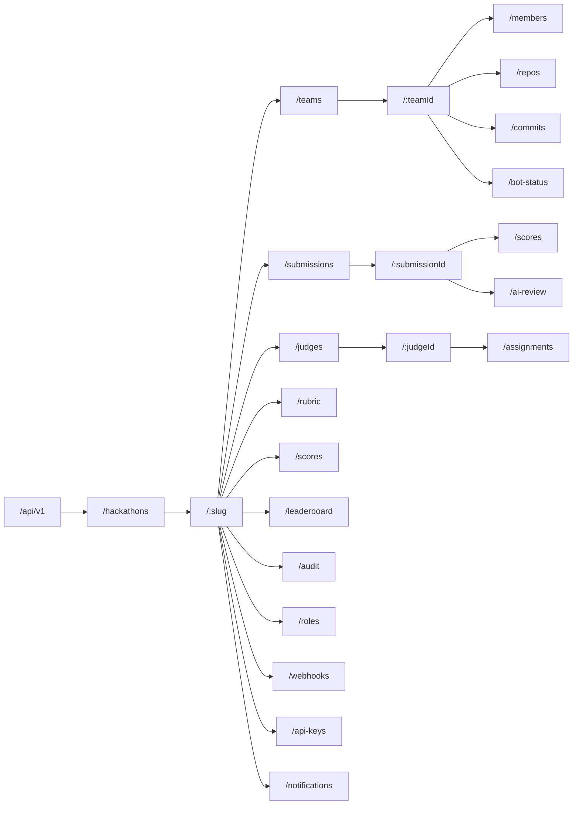
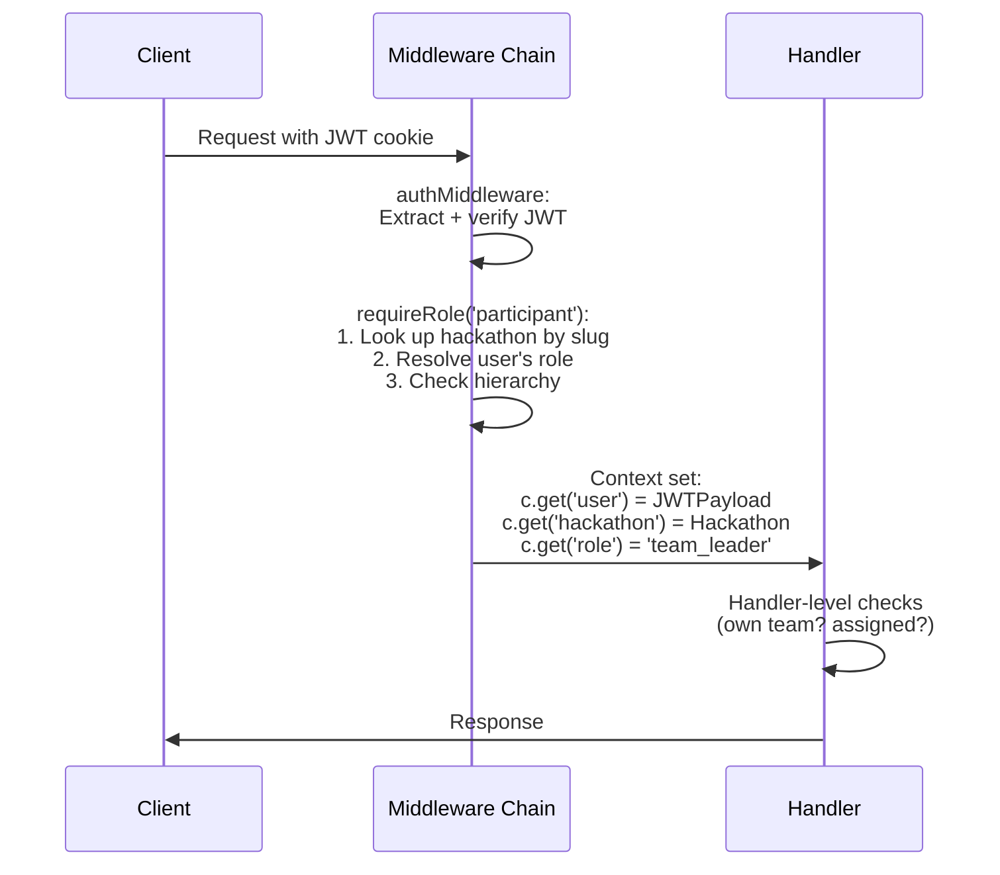
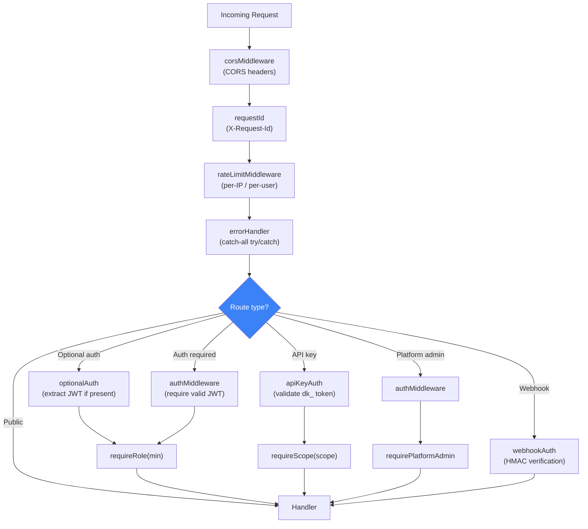
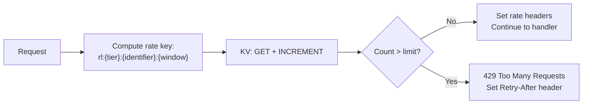
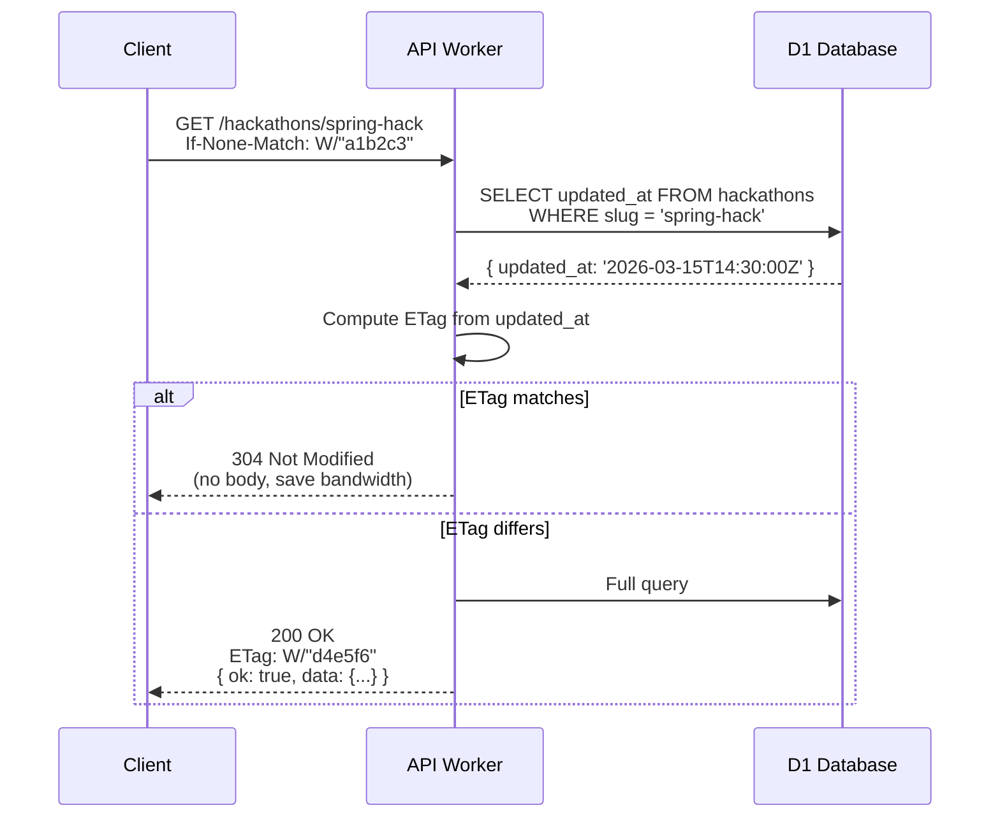
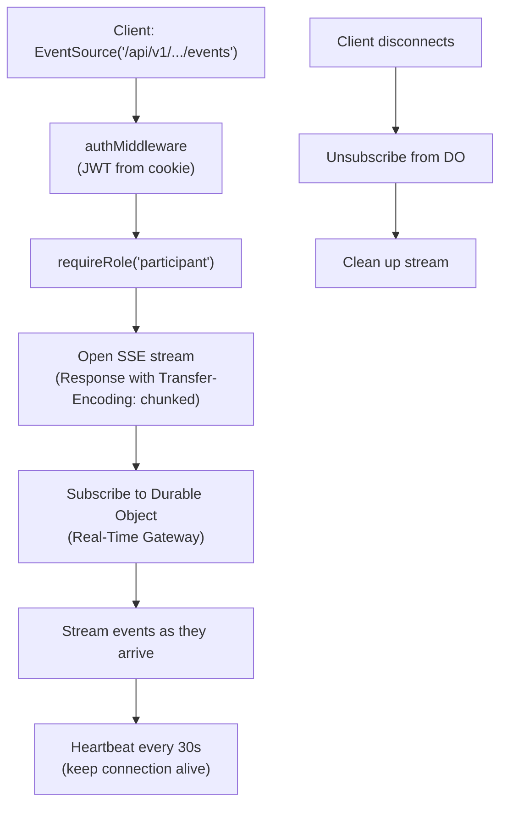
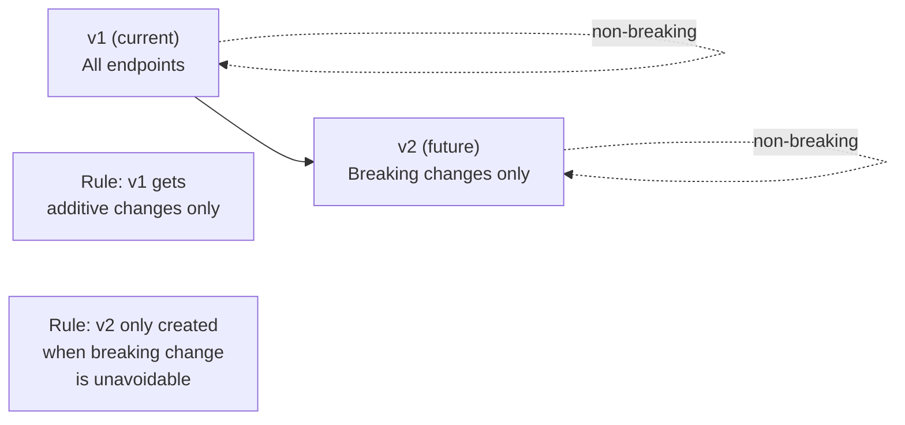
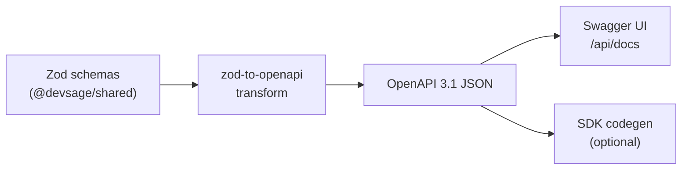

# API Design & Conventions

> REST API on Cloudflare Workers via Hono with slug-based resource addressing, standard JSON response envelope, Zod request validation, per-request role resolution, cursor and offset pagination, ETag caching, rate limiting, SSE streaming, versioned endpoint evolution, and a typed SDK for frontend consumption — providing a consistent, predictable, and self-documenting surface for all clients.

---

## Table of Contents

- [Design Goals](#design-goals)
- [1. URL Structure](#1-url-structure)
- [2. Response Envelope](#2-response-envelope)
- [3. Pagination](#3-pagination)
- [4. Request Validation](#4-request-validation)
- [5. Authentication & Authorization](#5-authentication--authorization)
- [6. Middleware Chain](#6-middleware-chain)
- [7. Rate Limiting](#7-rate-limiting)
- [8. Caching & ETags](#8-caching--etags)
- [9. Server-Sent Events (SSE)](#9-server-sent-events-sse)
- [10. CORS Configuration](#10-cors-configuration)
- [11. Complete Route Table](#11-complete-route-table)
- [12. Error Code Catalog](#12-error-code-catalog)
- [13. API Versioning](#13-api-versioning)
- [14. Client SDK](#14-client-sdk)
- [15. OpenAPI Specification](#15-openapi-specification)
- [16. Edge Cases](#16-edge-cases)
- [17. Decision Log](#17-decision-log)

---

## Design Goals

| Goal | Description |
|------|-------------|
| Slug-based addressing | All hackathon resources addressed by slug, not UUID. Human-readable URLs |
| Consistent envelope | Every response uses `{ ok, data/error, meta }`. No exceptions |
| Typed validation | Every request body, query param, and path param validated via Zod before handler execution |
| Per-request auth | Roles resolved from database on every request. No stale token data |
| Predictable errors | Every error has a machine-readable code, human message, and optional details object |
| Pagination standard | All list endpoints support pagination with total count in meta |
| Cache-friendly | ETag support for conditional requests. Cache-Control headers for CDN |
| Rate-limited | Per-IP and per-user limits with clear 429 responses |
| Streaming support | SSE endpoints for real-time data (activity feeds, notifications) |
| Versionable | `/api/v1/` prefix with documented evolution strategy |
| Self-documenting | OpenAPI spec auto-generated from Zod schemas |

---

## 1. URL Structure

### Base URL

```
Production:  https://api.devsage.org
Development: http://localhost:8787
```

### Route Hierarchy

```
/auth/*                                    # Authentication (no version prefix)
/webhooks/*                                # Webhook ingestion (no version prefix)
/api/v1/hackathons/*                       # Hackathon-scoped resources
/api/v1/orgs/*                             # Organization resources
/api/v1/admin/*                            # Platform administration
/api/v1/notifications/*                    # User notifications
/api/v1/push/*                             # Push subscription management
/api/v1/invites/*                          # Organizer invite acceptance
/api/v1/integrations/*                     # Integration marketplace
```

### Resource Addressing



### Naming Conventions

| Convention | Example | Description |
|-----------|---------|-------------|
| Plural nouns for collections | `/teams`, `/submissions` | Consistent pluralization |
| Slug for hackathon addressing | `/hackathons/spring-hack-2026` | Human-readable, URL-safe |
| UUID for nested resource IDs | `/teams/f47ac10b-...` | Precise, unique |
| Verbs for actions | `/teams/:id/join`, `/submissions/finalize` | Explicit action endpoints |
| Kebab-case for multi-word | `/api-keys`, `/bot-status` | URL convention |
| Query params for filtering | `?status=active&limit=20` | Not in path |

---

## 2. Response Envelope

Every API response uses the same envelope structure. No exceptions.

### Success (single resource)

```json
{
  "ok": true,
  "data": {
    "id": "h_abc123",
    "slug": "spring-hack-2026",
    "title": "Spring Hack 2026",
    "status": "active"
  },
  "meta": {
    "etag": "W/\"a1b2c3\"",
    "cached": false,
    "timestamp": "2026-03-15T14:30:00Z"
  }
}
```

### Success (collection)

```json
{
  "ok": true,
  "data": [
    { "id": "t_001", "name": "Team Alpha" },
    { "id": "t_002", "name": "Team Beta" }
  ],
  "meta": {
    "total": 42,
    "limit": 10,
    "offset": 0,
    "has_more": true
  }
}
```

### Success (empty action)

```json
{
  "ok": true,
  "data": null,
  "meta": {}
}
```

### Error

```json
{
  "ok": false,
  "error": {
    "code": "SUBMISSION_DEADLINE_PASSED",
    "message": "The submission deadline was 2026-03-15T23:59:59Z. Late submissions are not allowed for this hackathon.",
    "details": {
      "deadline": "2026-03-15T23:59:59Z",
      "allow_late": false,
      "submitted_at": "2026-03-16T00:05:00Z"
    }
  }
}
```

### Validation Error

```json
{
  "ok": false,
  "error": {
    "code": "VALIDATION_ERROR",
    "message": "Request body validation failed",
    "details": {
      "issues": [
        {
          "path": ["name"],
          "code": "too_small",
          "message": "Team name must be at least 2 characters"
        },
        {
          "path": ["max_team_size"],
          "code": "too_big",
          "message": "Maximum team size is 10"
        }
      ]
    }
  }
}
```

### TypeScript Types

```typescript
interface ApiResponse<T> {
  ok: true;
  data: T;
  meta: ResponseMeta;
}

interface ApiError {
  ok: false;
  error: {
    code: string;           // Machine-readable error code (SCREAMING_SNAKE)
    message: string;        // Human-readable description
    details?: unknown;      // Additional context (validation issues, IDs, etc.)
  };
}

interface ResponseMeta {
  etag?: string;
  cached?: boolean;
  timestamp?: string;
}

interface PaginationMeta extends ResponseMeta {
  total: number;
  limit: number;
  offset: number;
  has_more: boolean;
}

interface CursorPaginationMeta extends ResponseMeta {
  next_cursor: string | null;
  has_more: boolean;
  limit: number;
}
```

### Response Helper Functions

```typescript
function successResponse<T>(c: Context, data: T, meta?: Partial<ResponseMeta>): Response;
function paginatedResponse<T>(c: Context, data: T[], meta: PaginationMeta): Response;
function errorResponse(c: Context, status: number, code: string, message: string, details?: unknown): Response;
function noContentResponse(c: Context): Response;  // 204
```

---

## 3. Pagination

### Offset Pagination (Default)

Used for most list endpoints where total count matters.

| Parameter | Type | Default | Range | Description |
|-----------|------|---------|-------|-------------|
| `limit` | integer | 20 | 1–100 | Items per page |
| `offset` | integer | 0 | 0+ | Starting position |

```
GET /api/v1/hackathons/spring-hack/teams?limit=20&offset=40
```

Response meta:
```json
{
  "total": 142,
  "limit": 20,
  "offset": 40,
  "has_more": true
}
```

### Cursor Pagination

Used for append-only, high-volume endpoints (commit log, audit events, notifications) where offset pagination is inefficient on large datasets.

| Parameter | Type | Default | Description |
|-----------|------|---------|-------------|
| `limit` | integer | 20 (1–100) | Items per page |
| `cursor` | string | null | Opaque cursor from previous response |
| `direction` | string | `desc` | `asc` or `desc` |

```
GET /api/v1/hackathons/spring-hack/teams/t_abc/commits?limit=50&cursor=eyJpZCI6ImNfMTIzIn0
```

Response meta:
```json
{
  "next_cursor": "eyJpZCI6ImNfMTczIn0",
  "has_more": true,
  "limit": 50
}
```

Cursors are base64url-encoded JSON containing the sort key(s) of the last item. They are opaque to clients.

### Which Endpoints Use Which

| Endpoint | Pagination Type | Reason |
|----------|----------------|--------|
| `/hackathons` | Offset | Small dataset, total count useful |
| `/teams` | Offset | Bounded per hackathon, total count useful |
| `/submissions` | Offset | Bounded per hackathon, total count useful |
| `/judges` | Offset | Small dataset |
| `/commits` | Cursor | Append-only, potentially thousands of rows |
| `/audit` | Cursor | Append-only, potentially hundreds of thousands |
| `/notifications` | Cursor | Append-only, time-ordered |
| `/webhook-deliveries` | Cursor | High volume, time-ordered |
| `/leaderboard` | Offset | Ranked list, page-based |
| `/force-pushes` | Offset | Low volume |

---

## 4. Request Validation

All incoming data is validated before reaching handlers using Zod schemas from `@devsage/shared`.

### Body Validation

```typescript
import { zValidator } from '@hono/zod-validator';
import { CreateTeamRequestSchema } from '@devsage/shared';

app.post(
  '/teams',
  authMiddleware,
  requireRole('participant'),
  zValidator('json', CreateTeamRequestSchema),
  async (c) => {
    const body = c.req.valid('json');  // Fully typed, validated
    // ...
  }
);
```

### Query Parameter Validation

```typescript
import { PaginationQuerySchema } from '@devsage/shared';

app.get(
  '/teams',
  optionalAuth,
  requireRole('anonymous'),
  zValidator('query', PaginationQuerySchema.extend({
    status: z.enum(['looking', 'full', 'all']).optional().default('all'),
  })),
  async (c) => {
    const { limit, offset, status } = c.req.valid('query');
    // ...
  }
);
```

### Path Parameter Validation

```typescript
app.get(
  '/teams/:teamId',
  authMiddleware,
  requireRole('participant'),
  zValidator('param', z.object({
    teamId: z.string().uuid(),
  })),
  async (c) => {
    const { teamId } = c.req.valid('param');
    // ...
  }
);
```

### Validation Error Format

When Zod validation fails, the API returns a 400 with structured issues:

```json
{
  "ok": false,
  "error": {
    "code": "VALIDATION_ERROR",
    "message": "Request body validation failed",
    "details": {
      "issues": [
        {
          "path": ["name"],
          "code": "too_small",
          "minimum": 2,
          "message": "Team name must be at least 2 characters"
        }
      ]
    }
  }
}
```

---

## 5. Authentication & Authorization

### Authentication Methods

| Method | Header/Cookie | Used For |
|--------|--------------|----------|
| JWT (access token) | HttpOnly cookie `access_token` | Browser SPA requests |
| JWT (refresh) | HttpOnly cookie `refresh_token` | Token refresh endpoint |
| API key | `Authorization: Bearer dk_...` | Programmatic access |
| HMAC signature | `X-Hub-Signature-256` etc. | VCS webhook ingestion |

### Authorization Flow



### Context Values Set by Middleware

| Key | Type | Set By | Description |
|-----|------|--------|-------------|
| `user` | `JWTPayload` | `authMiddleware` | Authenticated user identity |
| `hackathon` | `Hackathon` | `requireRole` | Resolved hackathon entity |
| `role` | `Role` | `requireRole` | User's resolved role |
| `apiKey` | `APIKey` | `apiKeyAuth` | API key metadata (if API key auth) |
| `platformRole` | `string` | `requirePlatformAdmin` | Platform admin role |

---

## 6. Middleware Chain



### Error Handler

The global error handler catches any unhandled exceptions and returns a consistent error response:

```typescript
async function errorHandler(c: Context, next: Next) {
  try {
    await next();
  } catch (error) {
    if (error instanceof HTTPException) {
      return errorResponse(c, error.status, error.message, error.message);
    }
    console.error('Unhandled error:', error);
    return errorResponse(c, 500, 'INTERNAL_ERROR', 'An unexpected error occurred');
  }
}
```

### Request ID

Every request gets a unique ID via `X-Request-Id` header (passed through from CDN or generated). This ID appears in error responses, logs, and audit events for traceability.

---

## 7. Rate Limiting

### Rate Limit Tiers

| Tier | Applies To | Limit | Window | Key |
|------|-----------|-------|--------|-----|
| Anonymous | Unauthenticated requests | 60/min | Sliding window | IP address |
| Authenticated | JWT-authenticated | 300/min | Sliding window | User ID |
| API key | `dk_` bearer token | Per-key config (default 60/min) | Sliding window | Key prefix |
| Webhook | VCS providers | 1000/min | Sliding window | IP + provider |
| Auth endpoints | `/auth/*` | 10/min | Sliding window | IP address |
| Admin endpoints | `/admin/*` | 100/min | Sliding window | User ID |

### Rate Limit Headers

```
X-RateLimit-Limit: 300
X-RateLimit-Remaining: 247
X-RateLimit-Reset: 1710512400
Retry-After: 23          # Only on 429 responses
```

### 429 Response

```json
{
  "ok": false,
  "error": {
    "code": "RATE_LIMITED",
    "message": "Too many requests. Please retry after 23 seconds.",
    "details": {
      "limit": 300,
      "remaining": 0,
      "reset_at": "2026-03-15T14:30:00Z",
      "retry_after": 23
    }
  }
}
```

### Implementation

Rate limiting uses Cloudflare Workers KV with atomic increments:



---

## 8. Caching & ETags

### ETag Strategy

ETags enable conditional requests (304 Not Modified) to reduce bandwidth and D1 load.

| Resource | ETag Source | Cache-Control |
|----------|-----------|---------------|
| Hackathon details | `updated_at` hash | `private, max-age=60` |
| Team list | Latest `updated_at` in set | `private, max-age=30` |
| Leaderboard | Computation timestamp hash | `private, max-age=300` |
| Rubric | `updated_at` hash | `private, max-age=120` |
| Public hackathon list | Latest `updated_at` in set | `public, max-age=300, s-maxage=60` |
| Static config (rubric, rules) | Content hash | `public, max-age=3600` |

### Conditional Request Flow



### Cache Invalidation

- ETags change automatically when `updated_at` changes.
- Mutation endpoints (POST, PUT, DELETE) do NOT return cache headers.
- Clients should re-fetch after mutations.

---

## 9. Server-Sent Events (SSE)

SSE endpoints provide real-time data streaming for activity feeds, notifications, and live updates.

### SSE Endpoints

```
GET /api/v1/hackathons/:slug/events          # Hackathon activity stream (participant+)
GET /api/v1/notifications/stream              # User notification stream (authenticated)
GET /api/v1/hackathons/:slug/leaderboard/live # Live leaderboard updates (during judging)
```

### SSE Event Format

```
event: submission.received
id: evt_abc123
data: {"team":"Team Alpha","tag":"submission_v1","sha":"abc123","timestamp":"2026-03-15T14:30:00Z"}

event: phase.changed
id: evt_def456
data: {"from":"ACTIVE","to":"JUDGING","timestamp":"2026-03-15T18:00:00Z"}

event: heartbeat
data: {"timestamp":"2026-03-15T14:31:00Z"}
```

### SSE Connection Management



### SSE Implementation Constraints

| Constraint | Value |
|-----------|-------|
| Max connection duration | 5 minutes (reconnect via `Last-Event-ID`) |
| Heartbeat interval | 30 seconds |
| Max concurrent SSE connections per user | 3 |
| Event buffer | Last 100 events per channel (for reconnection catchup) |
| Auth | JWT validated on connect. Connection dropped if token expires |

### Reconnection

Clients use `Last-Event-ID` header on reconnection. The server replays missed events from the buffer:

```
GET /api/v1/hackathons/spring-hack/events
Last-Event-ID: evt_abc123
```

Server replays all events after `evt_abc123` from the buffer, then continues streaming.

---

## 10. CORS Configuration

```typescript
const corsConfig = {
  origin: (origin: string) => {
    const allowed = [
      env.FRONTEND_URL,          // https://devsage.org
      env.PLATFORM_URL,          // https://platform.devsage.org
      env.ADMIN_URL,             // https://admin.devsage.org
      'http://localhost:5173',   // Vite dev (web)
      'http://localhost:5174',   // Vite dev (admin)
      'http://localhost:5175',   // Vite dev (docs)
    ];
    return allowed.includes(origin) ? origin : null;
  },
  credentials: true,             // Required for HttpOnly cookies
  allowMethods: ['GET', 'POST', 'PUT', 'PATCH', 'DELETE', 'OPTIONS'],
  allowHeaders: ['Content-Type', 'Authorization', 'X-Request-Id', 'Last-Event-ID'],
  exposeHeaders: [
    'X-RateLimit-Limit',
    'X-RateLimit-Remaining',
    'X-RateLimit-Reset',
    'X-Request-Id',
    'ETag',
  ],
  maxAge: 86400,                 // Preflight cache: 24 hours
};
```

---

## 11. Complete Route Table

### Authentication (`/auth/*`)

| Method | Path | Auth | Description |
|--------|------|------|-------------|
| GET | `/auth/github` | – | Initiate GitHub OAuth |
| GET | `/auth/callback/github` | – | GitHub OAuth callback |
| GET | `/auth/google` | – | Initiate Google OAuth |
| GET | `/auth/callback/google` | – | Google OAuth callback |
| GET | `/auth/me` | JWT | Current user profile + roles |
| POST | `/auth/logout` | JWT | Clear session, revoke refresh token |
| POST | `/auth/refresh` | Refresh cookie | Rotate access + refresh tokens |
| POST | `/auth/passkey/register/begin` | JWT | Start passkey registration |
| POST | `/auth/passkey/register/complete` | JWT | Complete passkey registration |
| POST | `/auth/passkey/authenticate/begin` | – | Start passkey authentication |
| POST | `/auth/passkey/authenticate/complete` | – | Complete passkey authentication |
| POST | `/auth/mfa/totp/setup` | JWT | Generate TOTP secret + QR |
| POST | `/auth/mfa/totp/verify` | JWT | Verify TOTP code + enable |
| DELETE | `/auth/mfa/totp` | JWT | Disable TOTP |
| DELETE | `/auth/account` | JWT | Delete account (GDPR) |

### Hackathons (`/api/v1/hackathons/*`)

| Method | Path | Auth | Min Role | Description |
|--------|------|------|----------|-------------|
| GET | `/hackathons` | – | – | List non-draft hackathons |
| POST | `/hackathons` | JWT | organizer | Create hackathon |
| GET | `/hackathons/:slug` | opt | anonymous | Get hackathon details |
| PUT | `/hackathons/:slug` | JWT | admin | Update hackathon |
| PATCH | `/hackathons/:slug/status` | JWT | admin | Transition phase |
| DELETE | `/hackathons/:slug` | JWT | owner | Delete hackathon (draft only) |
| POST | `/hackathons/:slug/clone` | JWT | admin | Clone hackathon |
| POST | `/hackathons/:slug/transfer-ownership` | JWT | owner | Transfer to admin |
| GET | `/hackathons/:slug/my-role` | JWT | anonymous | Get user's role |
| GET | `/hackathons/:slug/events` | JWT | participant | SSE activity stream |

### Teams

| Method | Path | Auth | Min Role | Description |
|--------|------|------|----------|-------------|
| GET | `…/:slug/teams` | opt | anonymous | List teams |
| POST | `…/:slug/teams` | JWT | participant | Create team |
| GET | `…/:slug/teams/:teamId` | JWT | participant | Get team details |
| PUT | `…/:slug/teams/:teamId` | JWT | team_leader | Update team |
| DELETE | `…/:slug/teams/:teamId` | JWT | team_leader | Dissolve team |
| POST | `…/:slug/teams/:teamId/join` | JWT | participant | Join via invite code |
| POST | `…/:slug/teams/:teamId/leave` | JWT | participant | Leave team |
| DELETE | `…/:slug/teams/:teamId/members/:userId` | JWT | team_leader | Remove member |
| POST | `…/:slug/teams/:teamId/transfer-leader` | JWT | team_leader | Transfer leadership |
| GET | `…/:slug/teams/:teamId/repos` | JWT | participant | List linked repos |
| POST | `…/:slug/teams/:teamId/repos` | JWT | team_leader | Link repository |
| DELETE | `…/:slug/teams/:teamId/repos/:repoId` | JWT | team_leader | Unlink repository |
| GET | `…/:slug/teams/:teamId/commits` | JWT | participant | Commit log (cursor) |
| GET | `…/:slug/teams/:teamId/bot-status` | JWT | team_leader | Bot health check |
| GET | `…/:slug/team-directory` | opt | anonymous | Discovery directory |
| POST | `…/:slug/teams/:teamId/join-requests` | JWT | participant | Request to join |
| GET | `…/:slug/teams/:teamId/join-requests` | JWT | team_leader | List join requests |
| PUT | `…/:slug/teams/:teamId/join-requests/:id` | JWT | team_leader | Accept/decline request |

### Submissions

| Method | Path | Auth | Min Role | Description |
|--------|------|------|----------|-------------|
| GET | `…/:slug/submissions` | JWT | participant | List submissions |
| GET | `…/:slug/submissions/:subId` | JWT | participant | Get submission details |
| POST | `…/:slug/submissions/:subId/finalize` | JWT | team_leader | Mark as final |
| GET | `…/:slug/submissions/:subId/diff` | JWT | judge | View submission diff |
| GET | `…/:slug/submissions/:subId/ai-review` | JWT | judge | Get AI review |

### Judging

| Method | Path | Auth | Min Role | Description |
|--------|------|------|----------|-------------|
| POST | `…/:slug/judges` | JWT | admin | Invite judge |
| GET | `…/:slug/judges` | JWT | admin | List judges |
| POST | `…/:slug/judges/:id/respond` | JWT | anonymous | Accept/decline invite |
| DELETE | `…/:slug/judges/:id` | JWT | admin | Remove judge |
| GET | `…/:slug/rubric` | opt | anonymous | Get rubric criteria |
| POST | `…/:slug/rubric` | JWT | admin | Create/update rubric |
| POST | `…/:slug/judges/assign` | JWT | admin | Run auto-assignment |
| GET | `…/:slug/judges/:id/assignments` | JWT | judge | Get judge's assignments |
| POST | `…/:slug/scores` | JWT | judge | Submit scores (batch) |
| GET | `…/:slug/scores` | JWT | admin | List all scores |
| GET | `…/:slug/leaderboard` | opt | anonymous | Weighted leaderboard |
| GET | `…/:slug/leaderboard/live` | JWT | moderator | SSE live leaderboard |
| POST | `…/:slug/results/publish` | JWT | admin | Publish final results |

### Custom Roles

| Method | Path | Auth | Min Role | Description |
|--------|------|------|----------|-------------|
| POST | `…/:slug/roles` | JWT | admin | Create custom role |
| GET | `…/:slug/roles` | JWT | admin | List custom roles |
| GET | `…/:slug/roles/:roleSlug` | JWT | admin | Get role details |
| PUT | `…/:slug/roles/:roleSlug` | JWT | admin | Update role |
| DELETE | `…/:slug/roles/:roleSlug` | JWT | admin | Delete role |
| POST | `…/:slug/roles/:roleSlug/assign` | JWT | admin | Assign user |
| DELETE | `…/:slug/roles/:roleSlug/assign/:userId` | JWT | admin | Unassign user |
| GET | `…/:slug/roles/:roleSlug/members` | JWT | admin | List role members |

### Organizer Management

| Method | Path | Auth | Min Role | Description |
|--------|------|------|----------|-------------|
| GET | `…/:slug/organizers` | JWT | admin | List organizers |
| POST | `…/:slug/organizers` | JWT | owner | Add organizer |
| PUT | `…/:slug/organizers/:userId` | JWT | owner | Update organizer role |
| DELETE | `…/:slug/organizers/:userId` | JWT | owner | Remove organizer |

### API Keys

| Method | Path | Auth | Min Role | Description |
|--------|------|------|----------|-------------|
| POST | `…/:slug/api-keys` | JWT | admin | Create API key |
| GET | `…/:slug/api-keys` | JWT | admin | List API keys |
| GET | `…/:slug/api-keys/:keyId` | JWT | admin | Get key metadata |
| DELETE | `…/:slug/api-keys/:keyId` | JWT | admin | Revoke key |

### Outbound Webhooks

| Method | Path | Auth | Min Role | Description |
|--------|------|------|----------|-------------|
| POST | `…/:slug/webhooks` | JWT | admin | Create outbound webhook |
| GET | `…/:slug/webhooks` | JWT | admin | List webhooks |
| GET | `…/:slug/webhooks/:id` | JWT | admin | Get webhook details |
| PUT | `…/:slug/webhooks/:id` | JWT | admin | Update webhook |
| DELETE | `…/:slug/webhooks/:id` | JWT | admin | Delete webhook |
| POST | `…/:slug/webhooks/:id/test` | JWT | admin | Send test event |
| GET | `…/:slug/webhooks/:id/deliveries` | JWT | admin | Delivery history |

### Webhook Deliveries & Force Pushes

| Method | Path | Auth | Min Role | Description |
|--------|------|------|----------|-------------|
| GET | `…/:slug/webhook-deliveries` | JWT | admin | List webhook deliveries |
| GET | `…/:slug/webhook-deliveries/:id` | JWT | admin | Get delivery details |
| POST | `…/:slug/webhook-deliveries/:id/retry` | JWT | admin | Retry dead-lettered |
| GET | `…/:slug/force-pushes` | JWT | moderator | List force pushes |
| PUT | `…/:slug/force-pushes/:id/resolve` | JWT | admin | Mark as reviewed |

### Hackathon Notifications Config

| Method | Path | Auth | Min Role | Description |
|--------|------|------|----------|-------------|
| GET | `…/:slug/notifications/config` | JWT | admin | Get notification config |
| PUT | `…/:slug/notifications/config` | JWT | admin | Update notification config |
| POST | `…/:slug/notifications/broadcast` | JWT | admin | Send announcement |
| GET | `…/:slug/notifications/deliveries` | JWT | admin | Delivery history |
| GET | `…/:slug/notifications/stats` | JWT | admin | Delivery statistics |

### Audit Trail

| Method | Path | Auth | Min Role | Description |
|--------|------|------|----------|-------------|
| GET | `…/:slug/audit` | JWT | admin | Query audit trail (cursor) |
| GET | `…/:slug/audit/:eventId` | JWT | admin | Get single event |
| GET | `…/:slug/audit/entity/:type/:id` | JWT | admin | Events for entity |
| GET | `…/:slug/audit/actor/:actorId` | JWT | admin | Events by actor |
| GET | `…/:slug/audit/integrity` | JWT | admin | Verify chain integrity |
| GET | `…/:slug/audit/export` | JWT | admin | Export audit data |
| GET | `…/:slug/audit/archives` | JWT | admin | List R2 archives |

### Inbound Webhooks (Public)

| Method | Path | Auth | Description |
|--------|------|------|-------------|
| POST | `/webhooks/github` | HMAC | GitHub App webhook |
| POST | `/webhooks/gitlab` | Token | GitLab webhook |
| POST | `/webhooks/bitbucket` | HMAC | Bitbucket webhook |

### Organizations (`/api/v1/orgs/*`)

| Method | Path | Auth | Description |
|--------|------|------|-------------|
| GET | `/orgs` | JWT | List user's orgs |
| POST | `/orgs` | JWT | Create org (admin or invited) |
| GET | `/orgs/:orgSlug` | JWT | Get org details |
| PUT | `/orgs/:orgSlug` | JWT | Update org (org_admin+) |
| DELETE | `/orgs/:orgSlug` | JWT | Delete org (org_owner) |
| GET | `/orgs/:orgSlug/members` | JWT | List members |
| POST | `/orgs/:orgSlug/members` | JWT | Invite member (org_admin+) |
| PUT | `/orgs/:orgSlug/members/:userId` | JWT | Update member role |
| DELETE | `/orgs/:orgSlug/members/:userId` | JWT | Remove member |
| POST | `/orgs/:orgSlug/transfer` | JWT | Transfer ownership |
| GET | `/orgs/:orgSlug/hackathons` | JWT | List org hackathons |
| POST | `/orgs/:orgSlug/hackathons` | JWT | Create hackathon in org |

### User Notifications (`/api/v1/notifications/*`)

| Method | Path | Auth | Description |
|--------|------|------|-------------|
| GET | `/notifications` | JWT | List in-app notifications |
| GET | `/notifications/unread-count` | JWT | Get unread count |
| GET | `/notifications/stream` | JWT | SSE notification stream |
| PUT | `/notifications/:id/read` | JWT | Mark as read |
| PUT | `/notifications/read-all` | JWT | Mark all read |
| DELETE | `/notifications/:id` | JWT | Dismiss notification |
| GET | `/notifications/preferences` | JWT | Get preferences |
| PUT | `/notifications/preferences` | JWT | Update preferences |
| POST | `/notifications/preferences/reset` | JWT | Reset to defaults |
| GET | `/notifications/unsubscribe` | token | Email one-click unsubscribe |
| POST | `/notifications/unsubscribe` | token | RFC 8058 unsubscribe |

### Push Subscriptions (`/api/v1/push/*`)

| Method | Path | Auth | Description |
|--------|------|------|-------------|
| POST | `/push/subscribe` | JWT | Register push subscription |
| DELETE | `/push/subscribe/:id` | JWT | Remove subscription |
| GET | `/push/subscriptions` | JWT | List subscriptions |
| POST | `/push/test` | JWT | Send test push |

### Organizer Invites (`/api/v1/invites/*`)

| Method | Path | Auth | Description |
|--------|------|------|-------------|
| GET | `/invites/:code` | – | Check invite status |
| POST | `/invites/:code/accept` | JWT | Accept invite |

### Integration Marketplace (`/api/v1/integrations/*`)

| Method | Path | Auth | Description |
|--------|------|------|-------------|
| GET | `/integrations` | – | List available integrations |
| GET | `/integrations/:id` | – | Get integration details |

### Platform Admin (`/api/v1/admin/*`)

| Method | Path | Auth | Description |
|--------|------|------|-------------|
| GET | `/admin/health` | platform_admin | System health |
| GET | `/admin/admins` | platform_admin | List platform admins |
| POST | `/admin/admins` | super_admin | Add platform admin |
| DELETE | `/admin/admins/:userId` | super_admin | Remove admin |
| GET | `/admin/users` | platform_admin | List all users |
| PUT | `/admin/users/:userId/suspend` | platform_admin | Suspend user |
| PUT | `/admin/users/:userId/unsuspend` | platform_admin | Unsuspend user |
| GET | `/admin/invites` | platform_admin | List organizer invites |
| POST | `/admin/invites` | platform_admin | Create invite |
| DELETE | `/admin/invites/:id` | platform_admin | Revoke invite |
| GET | `/admin/orgs` | platform_admin | List all orgs |
| DELETE | `/admin/hackathons/:id` | super_admin | Force-delete hackathon |
| GET | `/admin/audit` | super_admin | Platform-wide audit |
| GET | `/admin/audit/user/:userId` | super_admin | User audit trail |
| GET | `/admin/audit/dashboard/recent` | platform_admin | Recent activity |
| GET | `/admin/audit/dashboard/security` | platform_admin | Security events |
| GET | `/admin/audit/dashboard/stats` | platform_admin | Event stats |

---

## 12. Error Code Catalog

### Authentication (401)

| Code | Description |
|------|-------------|
| `NO_TOKEN` | No JWT cookie or Authorization header present |
| `INVALID_TOKEN` | JWT signature invalid or token expired |
| `TOKEN_EXPIRED` | Access token expired (use refresh endpoint) |
| `REFRESH_TOKEN_INVALID` | Refresh token revoked, expired, or invalid |
| `REFRESH_TOKEN_REUSED` | Refresh token reuse detected — entire family revoked |
| `API_KEY_REVOKED` | API key has been revoked |
| `API_KEY_EXPIRED` | API key has expired |
| `WEBHOOK_INVALID_SIGNATURE` | Webhook HMAC verification failed |

### Authorization (403)

| Code | Description |
|------|-------------|
| `INSUFFICIENT_ROLE` | User's hackathon role is below required minimum |
| `INSUFFICIENT_SCOPE` | API key missing required scope |
| `NOT_PLATFORM_ADMIN` | User is not a platform admin |
| `NOT_ORGANIZER` | User is not an organizer or platform admin |
| `USER_SUSPENDED` | Account is suspended |
| `FORBIDDEN` | Generic forbidden (handler-level check failed) |

### Validation (400)

| Code | Description |
|------|-------------|
| `VALIDATION_ERROR` | Zod schema validation failed (details contain issues array) |
| `BAD_REQUEST` | Malformed request (missing params, bad JSON, etc.) |
| `INVALID_TRANSITION` | State machine transition not allowed from current phase |
| `SCORE_OUT_OF_RANGE` | Score outside `[0, max_score]` range |
| `INVALID_TAG_PATTERN` | Tag does not match hackathon's submission tag pattern |

### Not Found (404)

| Code | Description |
|------|-------------|
| `HACKATHON_NOT_FOUND` | Hackathon slug does not exist |
| `TEAM_NOT_FOUND` | Team ID does not exist in this hackathon |
| `SUBMISSION_NOT_FOUND` | Submission ID does not exist |
| `JUDGE_NOT_FOUND` | Judge record does not exist |
| `CRITERIA_NOT_FOUND` | Rubric criteria ID does not exist |
| `USER_NOT_FOUND` | User ID does not exist |
| `NOT_FOUND` | Generic resource not found |

### Conflict (409)

| Code | Description |
|------|-------------|
| `ALREADY_ON_TEAM` | User is already on a team in this hackathon |
| `TEAM_FULL` | Team has reached `max_team_size` |
| `DUPLICATE_TEAM_NAME` | Team name already taken in this hackathon |
| `REPO_ALREADY_LINKED` | Repo already linked to another team |
| `DUPLICATE_SCORE` | Score already submitted for this judge+criteria+submission |
| `INVITE_ALREADY_ACCEPTED` | Organizer invite already used |
| `SLUG_CONFLICT` | Hackathon or org slug already exists |

### Business Logic (422)

| Code | Description |
|------|-------------|
| `HACKATHON_NOT_ACTIVE` | Operation requires hackathon in ACTIVE phase |
| `REGISTRATION_CLOSED` | Registration period has ended |
| `SUBMISSION_DEADLINE_PASSED` | Submission deadline has passed |
| `NOT_ASSIGNED` | Judge not assigned to this team/submission |
| `RUBRIC_NOT_SET` | Cannot start judging without rubric criteria |
| `NO_FINAL_SUBMISSION` | Team has no finalized submission |

### Rate Limiting (429)

| Code | Description |
|------|-------------|
| `RATE_LIMITED` | Too many requests (details include retry_after) |

### Server Errors (500/502)

| Code | Description |
|------|-------------|
| `INTERNAL_ERROR` | Unexpected server error |
| `D1_ERROR` | Database operation failed |
| `EXTERNAL_SERVICE_ERROR` | External API call failed (GitHub, SMTP, etc.) |

---

## 13. API Versioning

### Current: `/api/v1/`

All routes under `/api/v1/` prefix. Auth and webhook routes have no version prefix (they are protocol-level, not API-level).

### Version Evolution Strategy



### What Counts as Breaking vs. Non-Breaking

| Change Type | Breaking? | Action |
|------------|-----------|--------|
| Add new endpoint | No | Add to v1 |
| Add optional field to response | No | Add to v1 |
| Add optional query parameter | No | Add to v1 |
| Add new error code | No | Add to v1 |
| Remove field from response | **Yes** | New v2 endpoint |
| Change field type | **Yes** | New v2 endpoint |
| Change error code for existing case | **Yes** | New v2 endpoint |
| Remove endpoint | **Yes** | Deprecate in v1, remove in v2 |
| Change authentication method | **Yes** | New v2 endpoint |

### Deprecation Process

1. Mark endpoint as deprecated via `Sunset` header and response `meta.deprecated` field.
2. Log usage of deprecated endpoints for 30 days.
3. Notify active API key owners via email.
4. Remove after 90 days with no usage.

---

## 14. Client SDK

A typed TypeScript SDK for frontend consumption, generated from Zod schemas.

### SDK Interface

```typescript
interface DevSageClient {
  // Auth
  auth: {
    me(): Promise<User>;
    logout(): Promise<void>;
  };

  // Hackathons
  hackathons: {
    list(params?: PaginationParams): Promise<Paginated<HackathonSummary>>;
    get(slug: string): Promise<Hackathon>;
    create(data: CreateHackathonInput): Promise<Hackathon>;
    update(slug: string, data: UpdateHackathonInput): Promise<Hackathon>;
    transitionPhase(slug: string, phase: HackathonPhase): Promise<Hackathon>;
    delete(slug: string): Promise<void>;
    myRole(slug: string): Promise<RoleInfo>;
  };

  // Teams
  teams: {
    list(slug: string, params?: TeamListParams): Promise<Paginated<Team>>;
    get(slug: string, teamId: string): Promise<TeamDetail>;
    create(slug: string, data: CreateTeamInput): Promise<Team>;
    join(slug: string, teamId: string, inviteCode: string): Promise<Team>;
    leave(slug: string, teamId: string): Promise<void>;
    // ... more methods
  };

  // Submissions, Judging, Notifications, etc.
  // ...
}
```

### SDK Implementation

```typescript
function createDevSageClient(baseUrl: string): DevSageClient {
  async function apiRequest<T>(method: string, path: string, body?: unknown): Promise<T> {
    const response = await fetch(`${baseUrl}${path}`, {
      method,
      headers: body ? { 'Content-Type': 'application/json' } : {},
      body: body ? JSON.stringify(body) : undefined,
      credentials: 'include',  // Send HttpOnly cookies
    });

    const json = await response.json();

    if (!json.ok) {
      throw new ApiError(json.error.code, json.error.message, json.error.details, response.status);
    }

    return json.data;
  }

  return {
    hackathons: {
      list: (params) => apiRequest('GET', `/api/v1/hackathons?${qs(params)}`),
      get: (slug) => apiRequest('GET', `/api/v1/hackathons/${slug}`),
      // ...
    },
    // ...
  };
}
```

### Error Handling in SDK

```typescript
class ApiError extends Error {
  constructor(
    public code: string,
    message: string,
    public details: unknown,
    public status: number,
  ) {
    super(message);
  }

  isNotFound(): boolean { return this.status === 404; }
  isUnauthorized(): boolean { return this.status === 401; }
  isForbidden(): boolean { return this.status === 403; }
  isValidation(): boolean { return this.code === 'VALIDATION_ERROR'; }
  isRateLimited(): boolean { return this.status === 429; }
}
```

---

## 15. OpenAPI Specification

An OpenAPI 3.1 spec is auto-generated from Zod schemas and route definitions.

### Generation Pipeline



### OpenAPI Endpoint

```
GET /api/docs        # Swagger UI (dev only, not production)
GET /api/openapi.json  # Raw OpenAPI spec
```

### Spec Generation from Zod

```typescript
import { extendZodWithOpenApi } from '@asteasolutions/zod-to-openapi';
extendZodWithOpenApi(z);

const CreateTeamRequestSchema = z.object({
  name: z.string().min(2).max(50).openapi({ example: 'Team Alpha' }),
  description: z.string().max(500).optional().openapi({ example: 'We build cool stuff' }),
}).openapi('CreateTeamRequest');
```

---

## 16. Edge Cases

| Scenario | Behavior |
|----------|----------|
| Hackathon slug contains URL-unsafe characters | Slugs are validated at creation: `[a-z0-9-]`, 3–50 chars, no leading/trailing hyphens |
| Request body exceeds 1 MB | Cloudflare Workers limit. Returns 413 before reaching handler |
| Concurrent identical POST requests (race condition) | DB unique constraints prevent duplicates. Second request gets 409 CONFLICT |
| API key and JWT both present | API key takes precedence if `Authorization: Bearer dk_` header is present |
| SSE client disconnects without closing properly | Server detects via `signal.aborted`. Connection cleaned up within heartbeat interval |
| ETag generated from deleted resource | 404 returned (no ETag comparison for non-existent resources) |
| Pagination offset exceeds total count | Returns empty `data: []` with correct `total` and `has_more: false` |
| Cursor from a different endpoint | Invalid cursor detected, returns 400 `INVALID_CURSOR` |
| Rate limit hit during SSE stream | SSE is rate-limited at connection time, not per-event |
| Version prefix missing (`/hackathons/` instead of `/api/v1/hackathons/`) | 404 — all routes require version prefix except `/auth/*` and `/webhooks/*` |
| Request with both `limit` and `cursor` | Both are valid — `limit` controls page size, `cursor` controls starting position |
| Large JSON response (>10 MB) | Paginate. No single response exceeds 10 MB. Export endpoints use background jobs |

---

## 17. Decision Log

| Decision | Choice | Why | Alternatives Considered |
|----------|--------|-----|------------------------|
| Slug-based hackathon addressing | `/hackathons/:slug` not `/:id` | Human-readable URLs, shareable links, SEO-friendly. Slugs are unique and immutable after creation | UUID in URL (ugly, not shareable); numeric ID (leaks creation order) |
| Standard JSON envelope | `{ ok, data/error, meta }` on every response | Clients always know the shape. `ok` boolean enables simple branching. `meta` provides pagination/cache info without polluting `data` | Flat responses (inconsistent); HTTP status only (loses error codes); GraphQL-style errors array (over-engineering) |
| Zod for validation | `@hono/zod-validator` middleware | Type-safe at compile time and runtime. Schemas shared between API and frontend via `@devsage/shared`. Error messages are structured | Manual validation (error-prone); joi (no TypeScript inference); class-validator (decorators, heavier) |
| Offset + cursor pagination | Offset for bounded sets, cursor for append-only | Offset gives total counts (useful for UI). Cursor is O(1) for large datasets. Each used where appropriate | Offset everywhere (slow on large tables); cursor everywhere (no total count); page numbers (same as offset, different UX) |
| ETag-based conditional requests | `W/"hash"` weak ETags from `updated_at` | Reduces bandwidth and D1 load for frequently polled resources. Standard HTTP mechanism supported by all clients | Cache-Control only (no conditional requests); no caching (wasteful); custom polling mechanism (non-standard) |
| SSE over WebSocket for activity streams | Server-Sent Events via chunked response | SSE is simpler to implement on Workers (no DO needed for basic streams). Auto-reconnection built into EventSource. Sufficient for one-way data flow | WebSocket DO (expensive for read-only streams); long polling (inefficient); no real-time (poor UX) |
| Rate limiting via KV | Atomic KV increment per window | KV is globally distributed and fast. No external dependencies. Per-IP and per-user granularity | Durable Objects (expensive per-user); external rate limiter (latency); no rate limiting (abuse risk) |
| Versioned API prefix | `/api/v1/` for all endpoints | Clear versioning boundary. Non-breaking changes stay in v1. Only create v2 when absolutely necessary | No versioning (breaking changes break clients); date-based versioning (hard to track); header-based versioning (non-obvious) |
| Auth and webhook routes unversioned | `/auth/*`, `/webhooks/*` without `/api/v1/` prefix | These are protocol-level, not API-level. OAuth callbacks have fixed URLs. Webhook URLs are configured in external systems (changing them is costly) | Version everything (forces webhook URL updates); separate subdomains for auth (DNS complexity) |
| Typed SDK generated from Zod | Same schemas for validation and SDK types | Single source of truth. Schema changes automatically propagate to SDK types. No type drift between API and client | Manual SDK (drift risk); OpenAPI codegen only (loses Zod benefits); no SDK (every consumer reimplements) |
| Request ID on every request | `X-Request-Id` header (pass-through or generated) | Enables end-to-end tracing from client → API → queue → audit. Essential for debugging production issues | No request IDs (can't trace); custom tracing (non-standard); only on errors (incomplete picture) |
