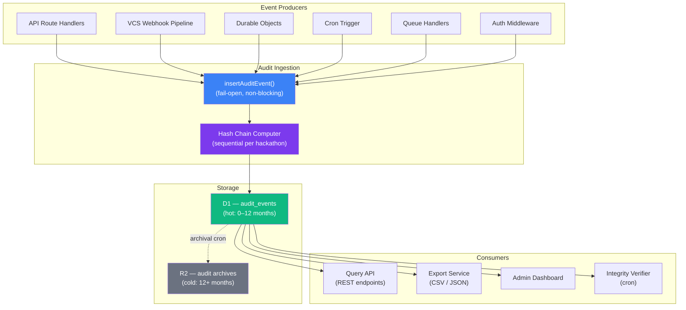
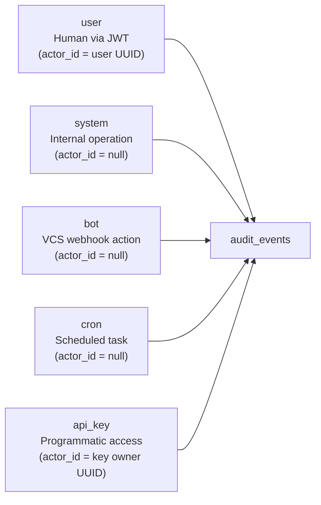
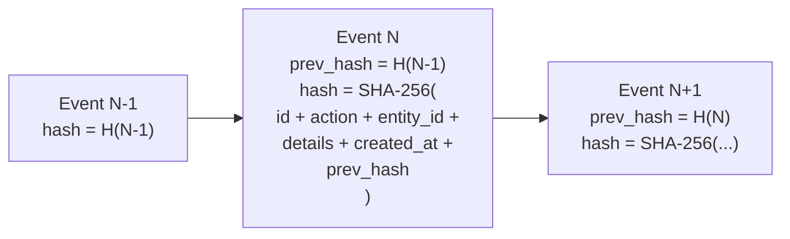
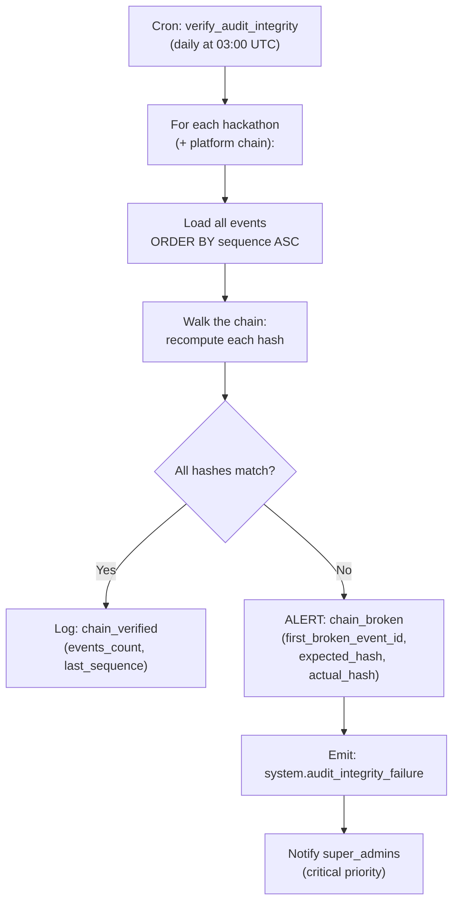
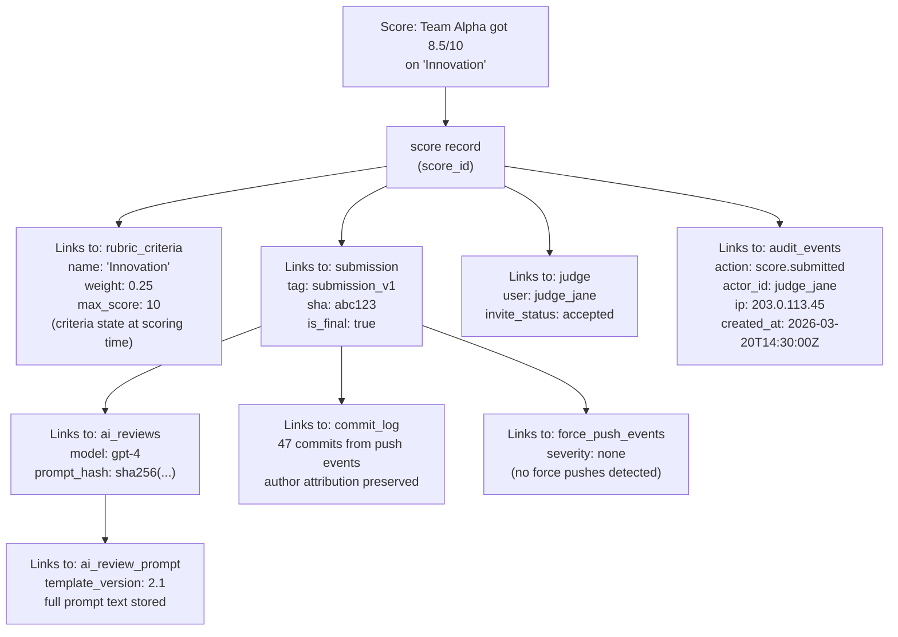
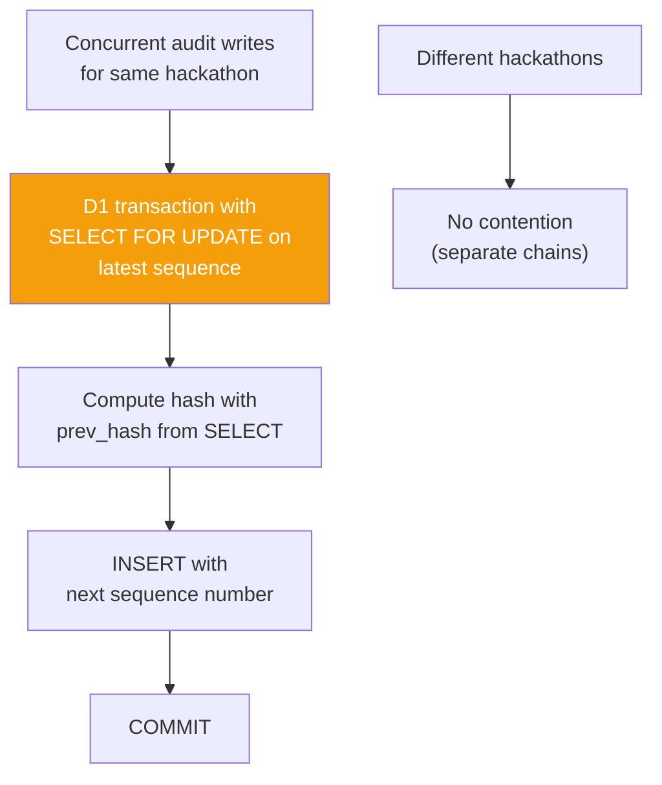
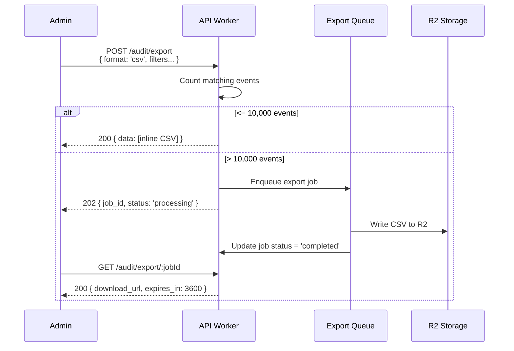
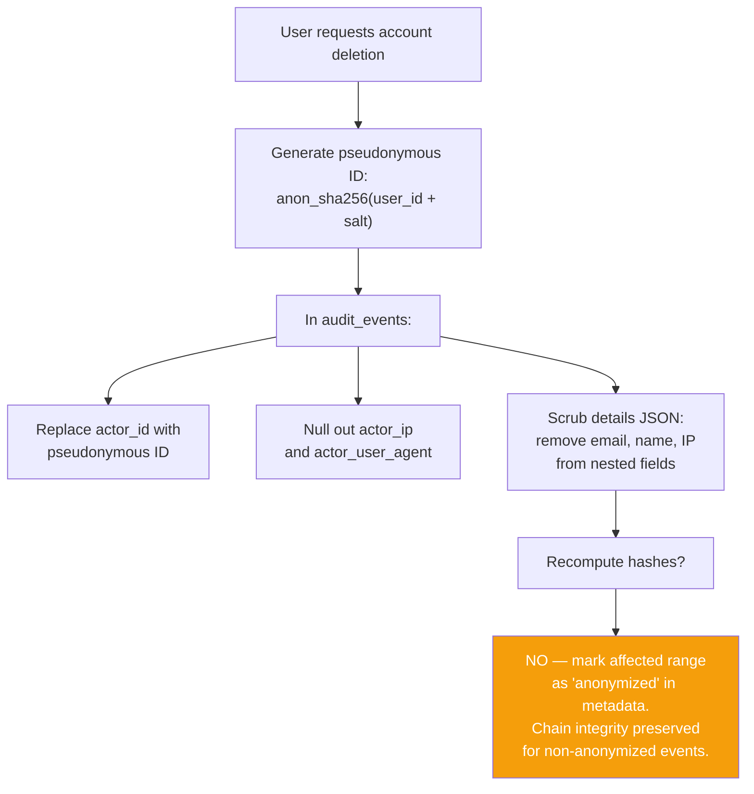
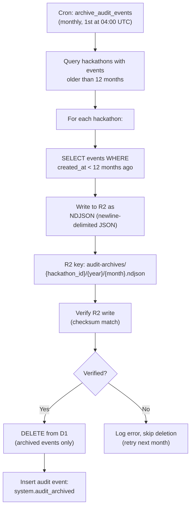

# Audit Trail

> Append-only, tamper-evident audit log that records every state-changing operation across the platform — with cryptographic hash chaining for integrity verification, a queryable REST API, GDPR-compliant anonymization, retention policies, and full decision traceability from score to commit to AI review prompt.

---

## Table of Contents

- [Design Goals](#design-goals)
- [1. Audit Architecture](#1-audit-architecture)
- [2. Audit Event Structure](#2-audit-event-structure)
- [3. Actor Model](#3-actor-model)
- [4. Hash Chain Integrity](#4-hash-chain-integrity)
- [5. Event Catalog](#5-event-catalog)
- [6. Decision Traceability](#6-decision-traceability)
- [7. Audit Event Ingestion](#7-audit-event-ingestion)
- [8. Query API](#8-query-api)
- [9. Export & Reporting](#9-export--reporting)
- [10. GDPR & Data Anonymization](#10-gdpr--data-anonymization)
- [11. Retention & Archival](#11-retention--archival)
- [12. Platform Admin Audit Dashboard](#12-platform-admin-audit-dashboard)
- [13. Edge Cases](#13-edge-cases)
- [14. Error Codes](#14-error-codes)
- [15. Database Tables](#15-database-tables)
- [16. Decision Log](#16-decision-log)

---

## Design Goals

| Goal | Description |
|------|-------------|
| Append-only | No UPDATE or DELETE on audit records. Once written, immutable forever (until retention-based archival) |
| Tamper-evident | Cryptographic hash chain links each event to its predecessor. Any modification or deletion breaks the chain |
| Fail-open | Audit writes never block primary operations. If D1 insert fails, the operation proceeds and the failure is logged |
| Actor attribution | Every event records WHO (actor ID + type), WHAT (action + entity), and contextual details |
| Decision traceability | Full chain from score → rubric → submission → commit → AI review → prompt hash |
| Queryable API | REST endpoints for filtering by hackathon, actor, entity, action, time range |
| Exportable | CSV and JSON export for compliance, analysis, and archival |
| GDPR compliant | Anonymization mechanism replaces PII with pseudonymous identifiers upon user deletion |
| Retention-aware | Configurable retention periods with automated archival to R2 cold storage |

---

## 1. Audit Architecture



### Key Invariant

Every mutation in the system — whether triggered by a user, bot, cron job, or internal system process — produces exactly one audit event. Read operations are not audited unless they access sensitive data (e.g., viewing scores before publication, accessing another user's profile).

---

## 2. Audit Event Structure

```typescript
interface AuditEvent {
  // Identity
  id: string;                        // UUID (crypto.randomUUID())
  sequence: number;                  // Auto-incrementing per-hackathon sequence number

  // Scope
  hackathon_id: string | null;       // Per-hackathon events; null for platform-level events

  // Who
  actor_id: string | null;           // User UUID (null for system/bot/cron actors)
  actor_type: 'user' | 'system' | 'bot' | 'cron' | 'api_key';
  actor_ip: string | null;           // Request IP address (null for non-HTTP actors)
  actor_user_agent: string | null;   // Request User-Agent (truncated to 256 chars)

  // What
  action: string;                    // Dot-notation: "submission.received", "team.created"
  entity_type: string;               // "hackathon", "team", "submission", "judge", etc.
  entity_id: string;                 // UUID of the affected entity

  // Context
  details: Record<string, unknown>;  // Action-specific structured data (JSON)
  changes: ChangeSet | null;         // For updates: what changed (before/after)

  // Integrity
  hash: string;                      // SHA-256 hash of this event (including prev_hash)
  prev_hash: string | null;          // Hash of previous event in this hackathon's chain

  // Timestamps
  created_at: string;                // ISO-8601 UTC
}

interface ChangeSet {
  before: Record<string, unknown>;   // Field values before the change
  after: Record<string, unknown>;    // Field values after the change
  changed_fields: string[];          // List of field names that changed
}
```

### ChangeSet Example

For an update to hackathon settings:

```json
{
  "before": {
    "title": "Spring Hack 2026",
    "submission_deadline": "2026-03-15T23:59:59Z",
    "max_team_size": 4
  },
  "after": {
    "title": "Spring Hack 2026",
    "submission_deadline": "2026-03-16T23:59:59Z",
    "max_team_size": 5
  },
  "changed_fields": ["submission_deadline", "max_team_size"]
}
```

---

## 3. Actor Model

Five actor types cover all possible event sources.



| Actor Type | When | actor_id | actor_ip | Example |
|-----------|------|----------|----------|---------|
| `user` | Human-initiated via browser/API | User UUID from JWT | Request IP | Creating a team, scoring a submission |
| `system` | Internal system operation | null | null | Auto-assigning judges, sending notifications |
| `bot` | VCS webhook-triggered action | null | null | Submission received, force push detected |
| `cron` | Scheduled task | null | null | Deadline reminder, auto-phase-transition |
| `api_key` | Programmatic API access | Key owner's UUID | Request IP | External tool reading submissions |

### Actor Context Enrichment

When the actor is a `user`, the audit event captures additional context from the request:

```typescript
interface UserActorContext {
  actor_id: string;           // User UUID
  actor_ip: string;           // CF-Connecting-IP header
  actor_user_agent: string;   // User-Agent header (truncated)
  actor_role: string;         // Resolved role at time of action (e.g., "admin")
  actor_session_id: string;   // JWT "jti" claim for session correlation
}
```

---

## 4. Hash Chain Integrity

Each audit event includes a SHA-256 hash that chains it to the previous event for the same hackathon. This creates a tamper-evident log — modifying or deleting any event breaks the chain.

### Hash Computation



```typescript
async function computeEventHash(event: AuditEvent, prevHash: string | null): Promise<string> {
  const payload = [
    event.id,
    event.hackathon_id ?? '',
    event.actor_id ?? '',
    event.actor_type,
    event.action,
    event.entity_type,
    event.entity_id,
    JSON.stringify(event.details),
    event.created_at,
    prevHash ?? 'GENESIS',
  ].join('|');

  const encoder = new TextEncoder();
  const data = encoder.encode(payload);
  const hashBuffer = await crypto.subtle.digest('SHA-256', data);
  const hashArray = Array.from(new Uint8Array(hashBuffer));
  return hashArray.map(b => b.toString(16).padStart(2, '0')).join('');
}
```

### Chain Per Hackathon

Each hackathon maintains its own independent hash chain. Platform-level events (where `hackathon_id = null`) have a separate chain.

### Genesis Event

The first event in each chain has `prev_hash = null` and uses `'GENESIS'` as the previous hash input to the hash function.

### Integrity Verification

A cron job runs daily to verify chain integrity:



---

## 5. Event Catalog

### Hackathon Lifecycle Events

| Action | Actor | Entity Type | Details |
|--------|-------|-------------|---------|
| `hackathon.created` | user | hackathon | `{ slug, title, org_id }` |
| `hackathon.updated` | user | hackathon | `{ changes: ChangeSet }` |
| `hackathon.deleted` | user | hackathon | `{ slug, title, team_count, submission_count }` |
| `hackathon.phase_transitioned` | user / cron | hackathon | `{ from, to, trigger: 'manual' \| 'auto' }` |
| `hackathon.cloned` | user | hackathon | `{ source_hackathon_id, source_slug }` |
| `hackathon.ownership_transferred` | user | hackathon | `{ from_user_id, to_user_id }` |

### Team Events

| Action | Actor | Entity Type | Details |
|--------|-------|-------------|---------|
| `team.created` | user | team | `{ name, hackathon_id }` |
| `team.updated` | user | team | `{ changes: ChangeSet }` |
| `team.dissolved` | user | team | `{ name, member_count }` |
| `team.member_joined` | user | team | `{ user_id, method: 'invite_code' \| 'join_request' \| 'direct' }` |
| `team.member_removed` | user | team | `{ removed_user_id, reason }` |
| `team.member_left` | user | team | `{ user_id }` |
| `team.leader_transferred` | user | team | `{ from_user_id, to_user_id }` |
| `team.repo_linked` | user | team | `{ repo_full_name, provider }` |
| `team.repo_unlinked` | user | team | `{ repo_full_name, provider }` |

### Submission Events

| Action | Actor | Entity Type | Details |
|--------|-------|-------------|---------|
| `submission.received` | bot | submission | `{ tag_name, sha, version, provider, repo }` |
| `submission.rejected` | bot | submission | `{ tag_name, reason, provider }` |
| `submission.finalized` | user | submission | `{ tag_name, version, sha }` |
| `submission.validated` | system | submission | `{ checks_passed, checks_failed, details }` |
| `submission.tag_deleted` | bot | submission | `{ tag_name, repo, sender_login }` |

### Force Push Events

| Action | Actor | Entity Type | Details |
|--------|-------|-------------|---------|
| `force_push.detected` | bot | team | `{ before_sha, after_sha, branch, estimated_lost, severity, affected_submissions }` |
| `force_push.resolved` | user | force_push_event | `{ resolution_note, severity }` |

### Judging Events

| Action | Actor | Entity Type | Details |
|--------|-------|-------------|---------|
| `judge.invited` | user | judge | `{ user_id, hackathon_id, email }` |
| `judge.invite_accepted` | user | judge | `{ user_id }` |
| `judge.invite_declined` | user | judge | `{ user_id, reason }` |
| `judge.assigned` | system | judge_assignment | `{ judge_id, team_id, submission_id, round }` |
| `judge.unassigned` | user | judge_assignment | `{ judge_id, team_id, reason }` |
| `score.submitted` | user | score | `{ judge_id, submission_id, criteria_scores, total_score }` |
| `rubric.created` | user | rubric | `{ criteria_count, total_weight }` |
| `rubric.updated` | user | rubric | `{ changes: ChangeSet }` |
| `results.published` | user | hackathon | `{ winner_ids, award_ids }` |

### Role & Permission Events

| Action | Actor | Entity Type | Details |
|--------|-------|-------------|---------|
| `organizer.added` | user | organizer_role | `{ user_id, role }` |
| `organizer.removed` | user | organizer_role | `{ user_id, role }` |
| `organizer.role_changed` | user | organizer_role | `{ user_id, from_role, to_role }` |
| `custom_role.created` | user | custom_role | `{ slug, permissions }` |
| `custom_role.updated` | user | custom_role | `{ slug, changes: ChangeSet }` |
| `custom_role.deleted` | user | custom_role | `{ slug, affected_users_count }` |
| `custom_role.assigned` | user | custom_role_assignment | `{ user_id, role_slug }` |
| `custom_role.unassigned` | user | custom_role_assignment | `{ user_id, role_slug }` |

### Authentication Events

| Action | Actor | Entity Type | Details |
|--------|-------|-------------|---------|
| `auth.login` | user | user | `{ provider: 'github' \| 'google', ip, user_agent }` |
| `auth.logout` | user | user | `{ session_id }` |
| `auth.token_refreshed` | user | user | `{ session_id }` |
| `auth.failed_login` | system | user | `{ provider, reason, ip }` |
| `auth.passkey_registered` | user | user | `{ credential_id }` |
| `auth.mfa_enabled` | user | user | `{ method: 'totp' \| 'passkey' }` |
| `auth.mfa_disabled` | user | user | `{ method }` |
| `auth.account_deleted` | user | user | `{ anonymization_applied }` |

### VCS Integration Events

| Action | Actor | Entity Type | Details |
|--------|-------|-------------|---------|
| `bot.activated` | bot | team | `{ repos, installation_id, provider }` |
| `bot.deactivated` | bot | team | `{ repos, installation_id, provider }` |
| `bot.auth_failed` | bot | team | `{ provider, error }` |
| `tag.deleted` | bot | team | `{ tag_name, repo, sender_login }` |

### Notification Events

| Action | Actor | Entity Type | Details |
|--------|-------|-------------|---------|
| `notification.sent` | system | notification | `{ type, channel, recipient_id }` |
| `notification.failed` | system | notification | `{ type, channel, recipient_id, error }` |
| `notification.dead_lettered` | system | notification | `{ type, delivery_id, attempts }` |

### Webhook Events

| Action | Actor | Entity Type | Details |
|--------|-------|-------------|---------|
| `webhook.received` | bot | webhook_delivery | `{ provider, event_type, delivery_id }` |
| `webhook.processed` | system | webhook_delivery | `{ delivery_id, processing_ms }` |
| `webhook.dead_lettered` | system | webhook_delivery | `{ delivery_id, event_type, attempts, error }` |
| `outbound_webhook.delivered` | system | outbound_webhook | `{ webhook_id, event_type, http_status }` |
| `outbound_webhook.failed` | system | outbound_webhook | `{ webhook_id, event_type, error }` |
| `outbound_webhook.disabled` | system | outbound_webhook | `{ webhook_id, consecutive_failures }` |

### Platform Admin Events

| Action | Actor | Entity Type | Details |
|--------|-------|-------------|---------|
| `platform.admin_added` | user | platform_admin | `{ user_id, role }` |
| `platform.admin_removed` | user | platform_admin | `{ user_id, role }` |
| `platform.user_suspended` | user | user | `{ suspended_user_id, reason }` |
| `platform.user_unsuspended` | user | user | `{ user_id }` |
| `platform.invite_created` | user | organizer_invite | `{ email, org_id }` |
| `platform.invite_revoked` | user | organizer_invite | `{ invite_id, email }` |
| `platform.invite_accepted` | user | organizer_invite | `{ invite_id, user_id }` |

### Organization Events

| Action | Actor | Entity Type | Details |
|--------|-------|-------------|---------|
| `org.created` | user | organization | `{ slug, name }` |
| `org.updated` | user | organization | `{ changes: ChangeSet }` |
| `org.deleted` | user | organization | `{ slug, hackathon_count }` |
| `org.member_added` | user | org_member | `{ user_id, role }` |
| `org.member_removed` | user | org_member | `{ user_id, role }` |
| `org.member_role_changed` | user | org_member | `{ user_id, from_role, to_role }` |
| `org.ownership_transferred` | user | organization | `{ from_user_id, to_user_id }` |

### API Key Events

| Action | Actor | Entity Type | Details |
|--------|-------|-------------|---------|
| `api_key.created` | user | api_key | `{ key_prefix, scopes, hackathon_id }` |
| `api_key.revoked` | user | api_key | `{ key_prefix }` |
| `api_key.used` | api_key | api_key | `{ key_prefix, endpoint, ip }` |

### System Events

| Action | Actor | Entity Type | Details |
|--------|-------|-------------|---------|
| `system.audit_integrity_verified` | cron | system | `{ hackathon_id, events_count, last_sequence }` |
| `system.audit_integrity_failure` | cron | system | `{ hackathon_id, broken_event_id, expected_hash }` |
| `system.audit_archived` | cron | system | `{ hackathon_id, events_archived, archive_key }` |
| `system.cron_executed` | cron | system | `{ job_name, duration_ms, result }` |

---

## 6. Decision Traceability

The audit trail enables full traceability from any evaluation outcome back to its origins.

### Scoring Traceability Chain



### Traceability Queries

This chain answers:

| Question | Source |
|----------|--------|
| What was scored? | `submission.sha` → exact commit, `submission.tag_name` → tag |
| By whom? | `score.judge_id` → `judges` → `users` |
| Against what criteria? | `score.criteria_id` → `rubric_criteria` (weight, max at scoring time) |
| When and from where? | `audit_events.created_at`, `audit_events.actor_ip` |
| Was AI involved? | `ai_reviews` linked to same submission |
| Is the AI prompt reproducible? | `ai_reviews.prompt_hash` + stored prompt template |
| Was the code tampered with? | `force_push_events` for this team during hackathon |
| Complete activity log? | `audit_events WHERE entity_id = submission_id` |

---

## 7. Audit Event Ingestion

### `insertAuditEvent()` — Core Function

The audit ingestion function is fail-open: it never throws and never blocks the primary operation.

```typescript
async function insertAuditEvent(
  db: DbClient,
  input: {
    hackathonId?: string;
    actorId?: string;
    actorType: 'user' | 'system' | 'bot' | 'cron' | 'api_key';
    action: string;
    entityType: string;
    entityId: string;
    details?: Record<string, unknown>;
    changes?: ChangeSet;
    ipAddress?: string;
    userAgent?: string;
  }
): Promise<void> {
  try {
    // 1. Get previous hash for this hackathon's chain
    const prevEvent = await db
      .select({ hash: auditEvents.hash })
      .from(auditEvents)
      .where(eq(auditEvents.hackathon_id, input.hackathonId ?? '__platform__'))
      .orderBy(desc(auditEvents.sequence))
      .limit(1);

    const prevHash = prevEvent[0]?.hash ?? null;

    // 2. Build event
    const event = {
      id: crypto.randomUUID(),
      hackathon_id: input.hackathonId ?? null,
      actor_id: input.actorId ?? null,
      actor_type: input.actorType,
      action: input.action,
      entity_type: input.entityType,
      entity_id: input.entityId,
      details: JSON.stringify(input.details ?? {}),
      changes: input.changes ? JSON.stringify(input.changes) : null,
      ip_address: input.ipAddress ?? null,
      user_agent: input.userAgent?.substring(0, 256) ?? null,
      prev_hash: prevHash,
      created_at: new Date().toISOString(),
    };

    // 3. Compute hash
    event.hash = await computeEventHash(event, prevHash);

    // 4. Insert (sequence auto-increments)
    await db.insert(auditEvents).values(event);
  } catch (error) {
    console.warn('Failed to insert audit event:', {
      action: input.action,
      entityId: input.entityId,
      error: error instanceof Error ? error.message : 'Unknown error',
    });
    // NEVER throw — audit failure must not block primary operation
  }
}
```

### Hash Chain Ordering

Hash chain integrity requires sequential insertion per hackathon. To prevent race conditions with concurrent writes:



If transaction acquisition fails (timeout, contention), the audit event is written WITHOUT hash chain linkage (`prev_hash = null`, `hash = computed without chain`). A repair cron job fills in missing chain links periodically.

---

## 8. Query API

### REST Endpoints

```
GET  /api/v1/hackathons/:slug/audit                    # Query hackathon audit trail (admin+)
GET  /api/v1/hackathons/:slug/audit/:eventId            # Get single event (admin+)
GET  /api/v1/hackathons/:slug/audit/entity/:entityType/:entityId  # Events for entity (admin+)
GET  /api/v1/hackathons/:slug/audit/actor/:actorId      # Events by actor (admin+)
GET  /api/v1/hackathons/:slug/audit/integrity           # Verify chain integrity (admin+)

GET  /api/v1/admin/audit                                # Platform-wide audit (super_admin)
GET  /api/v1/admin/audit/user/:userId                   # All events by user (super_admin)
```

### Query Parameters

| Parameter | Type | Description |
|-----------|------|-------------|
| `action` | string | Filter by action (exact or prefix: `submission.*`) |
| `actor_type` | string | Filter by actor type |
| `actor_id` | string | Filter by specific actor |
| `entity_type` | string | Filter by entity type |
| `entity_id` | string | Filter by specific entity |
| `from` | ISO-8601 | Events after this timestamp |
| `to` | ISO-8601 | Events before this timestamp |
| `limit` | number | Max results (1–100, default 50) |
| `offset` | number | Pagination offset (default 0) |
| `order` | `asc` \| `desc` | Sort by created_at (default `desc`) |

### Response Format

```json
{
  "ok": true,
  "data": [
    {
      "id": "evt_abc123",
      "sequence": 1042,
      "hackathon_id": "h_xyz",
      "actor_id": "u_jane",
      "actor_type": "user",
      "action": "submission.finalized",
      "entity_type": "submission",
      "entity_id": "sub_456",
      "details": {
        "tag_name": "submission_v3",
        "version": 3,
        "sha": "abc123def"
      },
      "changes": null,
      "hash": "a1b2c3d4...",
      "prev_hash": "e5f6g7h8...",
      "created_at": "2026-03-15T14:30:00Z"
    }
  ],
  "meta": {
    "total": 1042,
    "limit": 50,
    "offset": 0
  }
}
```

### Integrity Verification Endpoint

```
GET /api/v1/hackathons/:slug/audit/integrity
```

```json
{
  "ok": true,
  "data": {
    "hackathon_id": "h_xyz",
    "total_events": 1042,
    "chain_valid": true,
    "first_event_id": "evt_genesis",
    "last_event_id": "evt_latest",
    "last_verified_at": "2026-03-16T03:00:00Z",
    "gaps": []
  }
}
```

If integrity is broken:

```json
{
  "ok": true,
  "data": {
    "chain_valid": false,
    "first_broken_event_id": "evt_broken",
    "first_broken_sequence": 847,
    "expected_hash": "a1b2c3...",
    "actual_hash": "x9y8z7...",
    "gap_count": 1,
    "gaps": [
      { "from_sequence": 846, "to_sequence": 848, "missing_count": 1 }
    ]
  }
}
```

---

## 9. Export & Reporting

### Export Formats

```
GET /api/v1/hackathons/:slug/audit/export?format=csv    # CSV export (admin+)
GET /api/v1/hackathons/:slug/audit/export?format=json   # JSON export (admin+)
```

Exports support all the same query parameters as the query API for filtering.

### CSV Format

```csv
id,sequence,hackathon_id,actor_id,actor_type,action,entity_type,entity_id,details,created_at
evt_001,1,h_xyz,u_jane,user,hackathon.created,hackathon,h_xyz,"{""slug"":""spring-hack""}",2026-03-01T10:00:00Z
evt_002,2,h_xyz,u_jane,user,team.created,team,t_abc,"{""name"":""Alpha""}",2026-03-01T10:05:00Z
```

### Export Limits

| Constraint | Value |
|-----------|-------|
| Max rows per export | 10,000 |
| Export timeout | 30 seconds |
| Rate limit | 5 exports per hour per user |
| Sensitive field masking | IP addresses redacted for non-super-admin exports |

### Large Exports

For exports exceeding 10,000 rows, a background export job is created:



---

## 10. GDPR & Data Anonymization

When a user exercises their right to deletion (GDPR Article 17), audit records are anonymized rather than deleted — preserving the audit trail while removing personally identifiable information.

### Anonymization Process



### What Gets Anonymized

| Field | Before | After |
|-------|--------|-------|
| `actor_id` | `u_jane_doe_123` | `anon_a1b2c3d4e5` |
| `actor_ip` | `203.0.113.45` | `null` |
| `actor_user_agent` | `Mozilla/5.0...` | `null` |
| `details.email` | `jane@example.com` | `[redacted]` |
| `details.user_id` (in nested context) | `u_jane_doe_123` | `anon_a1b2c3d4e5` |
| `details.display_name` | `Jane Doe` | `[redacted]` |

### What Is NOT Anonymized

- `action` — the operation type remains (e.g., "score.submitted")
- `entity_type` / `entity_id` — what was affected remains
- `details` fields without PII (e.g., `tag_name`, `sha`, `score`)
- `hash` / `prev_hash` — integrity chain preserved (computed from original data)
- `created_at` — timestamps remain

### Hash Chain and Anonymization

Anonymization changes data but does NOT recompute hashes. The affected events are flagged with `anonymized_at` timestamp. Integrity verification skips hash checks for anonymized events and reports them separately:

```json
{
  "chain_valid": true,
  "anonymized_events": 23,
  "anonymized_ranges": [
    { "from_sequence": 100, "to_sequence": 115, "anonymized_at": "2026-06-01T..." }
  ]
}
```

---

## 11. Retention & Archival

### Retention Tiers

| Tier | Age | Storage | Access |
|------|-----|---------|--------|
| Hot | 0–12 months | D1 (primary) | Full API access, indexed queries |
| Cold | 12–36 months | R2 (archived) | Export/download only, no live queries |
| Purged | 36+ months | Deleted | Gone (unless GDPR retention exemption applies) |

### Archival Process



### Archive File Format

```
// R2: audit-archives/h_xyz/2025/06.ndjson
{"id":"evt_001","sequence":1,"action":"hackathon.created",...}
{"id":"evt_002","sequence":2,"action":"team.created",...}
{"id":"evt_003","sequence":3,"action":"submission.received",...}
```

### Archive Retrieval

```
GET /api/v1/hackathons/:slug/audit/archives              # List archive files (admin+)
GET /api/v1/hackathons/:slug/audit/archives/:archiveId    # Download archive file (admin+)
```

Archive download URLs are pre-signed R2 URLs with 1-hour expiry.

---

## 12. Platform Admin Audit Dashboard

Super admins have access to a platform-wide audit dashboard.

### Dashboard Views

| View | Query | Purpose |
|------|-------|---------|
| Recent activity | Last 100 events across all hackathons | Real-time monitoring |
| User activity | All events by a specific user | Investigate user behavior |
| Security events | `auth.*` actions, sorted by time | Monitor login anomalies |
| Failed operations | Events with error details | Identify system issues |
| Chain integrity | Last verification results per hackathon | Trust verification |
| Anonymization log | All anonymized user records | GDPR compliance tracking |

### Dashboard API

```
GET /api/v1/admin/audit/dashboard/recent                # Recent platform activity
GET /api/v1/admin/audit/dashboard/security              # Security event feed
GET /api/v1/admin/audit/dashboard/integrity             # Chain integrity summary
GET /api/v1/admin/audit/dashboard/anonymizations        # Anonymization log
GET /api/v1/admin/audit/dashboard/stats                 # Event volume statistics
```

### Statistics Response

```json
{
  "ok": true,
  "data": {
    "total_events": 145230,
    "events_today": 342,
    "events_this_week": 2150,
    "by_actor_type": {
      "user": 89000,
      "bot": 34000,
      "system": 18000,
      "cron": 4000,
      "api_key": 230
    },
    "by_action_prefix": {
      "submission": 12000,
      "team": 8500,
      "auth": 45000,
      "hackathon": 3200,
      "score": 6800
    },
    "active_hackathons": 12,
    "chain_integrity": {
      "all_valid": true,
      "last_checked": "2026-03-16T03:00:00Z"
    }
  }
}
```

---

## 13. Edge Cases

| Scenario | Behavior |
|----------|----------|
| D1 insert fails for audit event | Primary operation proceeds. Failure logged via `console.warn`. Audit event is lost (fail-open) |
| Two concurrent writes for same hackathon chain | D1 transaction ensures sequential ordering. If contention, second write retries once then writes without chain link (repair cron fixes later) |
| Hash chain broken by anonymization | Anonymized events are flagged. Integrity verifier reports them separately, not as failures |
| User deletes account mid-hackathon | All future events use anonymized actor ID. Existing events are anonymized in batch |
| Archived events needed for investigation | Admin downloads archive from R2. Archive files include full event data (except anonymized PII) |
| Archival cron fails mid-way | Verify-before-delete ensures no data loss. Partial archives are retried next month |
| Event details contain PII from a different user | Anonymization scrubs known PII patterns (email regex, user ID format) from all details fields |
| Super admin queries audit for a hackathon they don't organize | Allowed — super admins have platform-wide audit access regardless of hackathon role |
| API key used to query audit trail | Requires `audit:read` scope. Actor logged as `api_key` type |
| Thousands of events in a single export | Chunked into background job with R2 output. Maximum 10,000 per inline response |
| Clock skew between Workers instances | `created_at` may have minor ordering anomalies. `sequence` (auto-increment) is the canonical order |
| Hash chain genesis event is anonymized | Genesis event retains its hash. Anonymization applies to content fields only, not integrity fields |
| Audit table grows very large for active hackathon | Archival moves events older than 12 months to R2. Indexes on `hackathon_id + created_at` keep queries fast |

---

## 14. Error Codes

| Code | HTTP | Condition |
|------|------|-----------|
| `AUDIT_EVENT_NOT_FOUND` | 404 | Audit event ID does not exist |
| `AUDIT_QUERY_TOO_BROAD` | 400 | Query would return more than 10,000 results without filters. Add filters or use export |
| `AUDIT_EXPORT_TOO_LARGE` | 400 | Export exceeds 100,000 events. Use time range filters to narrow |
| `AUDIT_EXPORT_RATE_LIMIT` | 429 | Exceeded 5 exports per hour |
| `AUDIT_EXPORT_NOT_FOUND` | 404 | Background export job ID does not exist |
| `AUDIT_EXPORT_NOT_READY` | 202 | Background export is still processing |
| `AUDIT_ARCHIVE_NOT_FOUND` | 404 | Archive file does not exist in R2 |
| `AUDIT_INTEGRITY_RUNNING` | 409 | Integrity verification is already in progress for this hackathon |
| `AUDIT_CHAIN_BROKEN` | 500 | Hash chain integrity verification failed (critical system alert) |
| `AUDIT_ANONYMIZATION_FAILED` | 500 | GDPR anonymization batch failed (requires manual intervention) |

---

## 15. Database Tables

### `audit_events`

The core audit log table. Append-only.

| Column | Type | Constraints | Description |
|--------|------|-------------|-------------|
| `id` | TEXT | PK, UUID | Unique event ID |
| `sequence` | INTEGER | NOT NULL, AUTO-INCREMENT | Per-hackathon sequence number (canonical order) |
| `hackathon_id` | TEXT | FK → hackathons.id, NULL | Hackathon scope (null for platform events) |
| `actor_id` | TEXT | FK → users.id, NULL | Who performed the action (null for system/bot/cron) |
| `actor_type` | TEXT | NOT NULL, CHECK IN ('user','system','bot','cron','api_key') | Actor category |
| `actor_ip` | TEXT | NULL | Request IP address |
| `actor_user_agent` | TEXT | NULL | Request User-Agent (max 256 chars) |
| `action` | TEXT | NOT NULL | Dot-notation action identifier |
| `entity_type` | TEXT | NOT NULL | Type of affected entity |
| `entity_id` | TEXT | NOT NULL | ID of affected entity |
| `details` | TEXT | NOT NULL, DEFAULT '{}' | JSON action-specific data |
| `changes` | TEXT | NULL | JSON ChangeSet (before/after for updates) |
| `hash` | TEXT | NOT NULL | SHA-256 hash of this event |
| `prev_hash` | TEXT | NULL | Hash of previous event in chain (null for genesis) |
| `anonymized_at` | TEXT | NULL | When PII was scrubbed (GDPR) |
| `created_at` | TEXT | NOT NULL, DEFAULT CURRENT_TIMESTAMP | ISO-8601 UTC |

**Indexes:**
- INDEX(`hackathon_id`, `created_at` DESC) — primary query index
- INDEX(`hackathon_id`, `sequence` DESC) — chain ordering
- INDEX(`entity_type`, `entity_id`) — entity lookup
- INDEX(`actor_id`, `created_at` DESC) — user activity lookup
- INDEX(`action`) — action type filtering
- INDEX(`created_at`) — archival queries

**Constraints:**
- No UPDATE triggers allowed
- No DELETE allowed (except by archival cron with verified R2 backup)

---

### `audit_archives`

Tracks archived audit data in R2 cold storage.

| Column | Type | Constraints | Description |
|--------|------|-------------|-------------|
| `id` | TEXT | PK, UUID | Archive record ID |
| `hackathon_id` | TEXT | NOT NULL | Which hackathon's events |
| `r2_key` | TEXT | NOT NULL | R2 object key (path to NDJSON file) |
| `events_count` | INTEGER | NOT NULL | Number of events in this archive |
| `first_event_id` | TEXT | NOT NULL | ID of first event in archive |
| `last_event_id` | TEXT | NOT NULL | ID of last event in archive |
| `first_sequence` | INTEGER | NOT NULL | Sequence of first event |
| `last_sequence` | INTEGER | NOT NULL | Sequence of last event |
| `period_start` | TEXT | NOT NULL | Start of archived time period (ISO-8601) |
| `period_end` | TEXT | NOT NULL | End of archived time period (ISO-8601) |
| `checksum` | TEXT | NOT NULL | SHA-256 of the archive file content |
| `size_bytes` | INTEGER | NOT NULL | Archive file size |
| `archived_at` | TEXT | NOT NULL, DEFAULT CURRENT_TIMESTAMP | When archival was performed |

**Indexes:** INDEX(`hackathon_id`, `period_start`), INDEX(`r2_key`)

---

### `audit_anonymizations`

Tracks GDPR anonymization actions for compliance reporting.

| Column | Type | Constraints | Description |
|--------|------|-------------|-------------|
| `id` | TEXT | PK, UUID | Anonymization record ID |
| `original_user_id` | TEXT | NOT NULL | Original user ID (before anonymization) |
| `pseudonymous_id` | TEXT | NOT NULL | Generated pseudonymous ID |
| `events_anonymized` | INTEGER | NOT NULL | Number of audit events affected |
| `fields_scrubbed` | TEXT | NOT NULL | JSON array of field paths that were scrubbed |
| `requested_at` | TEXT | NOT NULL | When deletion was requested |
| `completed_at` | TEXT | NOT NULL, DEFAULT CURRENT_TIMESTAMP | When anonymization completed |
| `performed_by` | TEXT | NOT NULL | 'user_self' or admin user ID |

**Indexes:** INDEX(`original_user_id`), INDEX(`pseudonymous_id`)

---

## 16. Decision Log

| Decision | Choice | Why | Alternatives Considered |
|----------|--------|-----|------------------------|
| Append-only, no updates or deletes | Hard invariant on audit_events table | Audit logs lose all value if they can be modified. Immutability is a trust requirement for compliance and dispute resolution | Soft delete (still modifiable); allow admin updates (trust violation) |
| Hash chain per hackathon | SHA-256 linking each event to predecessor | Tamper evidence — any modification breaks the chain and is detectable. Per-hackathon chains avoid global contention | Global single chain (contention bottleneck); no hash chain (no tamper detection); Merkle tree (over-engineering) |
| Fail-open audit writes | Never throw, log warning on failure | Audit is important but not critical-path. A score submission must succeed even if audit logging fails. The score itself is the source of truth | Fail-closed (blocks operations); async-only via queue (adds latency, complexity); write-ahead log (overkill) |
| ChangeSet for updates | Before/after snapshots with changed field list | Enables precise "what changed" queries without diffing. Critical for investigating config changes that affected outcomes | Store only "after" (can't see what changed); store full entity snapshots (storage bloat); event sourcing (architecture change) |
| GDPR anonymization over deletion | Replace PII with pseudonymous IDs | Preserves audit chain structure and event sequence while removing personal data. Deletion would create gaps and break integrity | Delete events entirely (breaks chain); keep PII forever (illegal); separate PII storage (complex) |
| IP and User-Agent in audit | Captured for user-type actors | Essential for security investigation (compromised accounts, unauthorized access). Scrubbed during GDPR anonymization | No IP logging (hampers security); hash IPs only (can't investigate); log everything (privacy concern) |
| 12-month hot retention | Events older than 12 months archived to R2 | 12 months covers most hackathon lifecycles plus dispute window. D1 storage is finite. R2 is cheap and durable | 6 months (too short for disputes); unlimited in D1 (storage cost); no archival (D1 growth unbounded) |
| Daily integrity verification cron | Check all chains once per day at 03:00 UTC | Detects tampering within 24 hours. Daily is sufficient — real-time verification would add latency to every write | Per-write verification (latency); weekly (too slow to detect); no verification (defeats purpose of hash chain) |
| Sequence number as canonical order | Auto-increment integer per hackathon | Timestamps can have clock skew across Workers instances. Sequence numbers are deterministic and gap-free within transactions | Timestamp only (clock skew); UUID ordering (random, no sequence); hybrid clock (complexity) |
| Actor type includes api_key | Separate type from user | API key actions need distinct auditing — the key owner is logged as actor_id but the access pattern (programmatic vs. interactive) matters for security analysis | Treat as user (loses access pattern info); no actor attribution for keys (security gap) |
| Export rate limit of 5/hour | Hard limit per user | Prevents abuse of expensive export queries. 5/hour is generous for legitimate use. Background jobs handle large exports | No limit (abuse risk); 1/day (too restrictive); per-hackathon limit (complex) |
