# Authentication & Sessions

> Complete specification for DevSage v3 authentication. DevSage operates across three separate domains with independent login systems: Admin (`shikdd.devsage.org`, Google OAuth), Organizer/Judge platform (`platform.devsage.org`, Google OAuth), and per-hackathon participant sites (`{slug}.devsage.org`, GitHub OAuth primary + Google option). Covers dual-token architecture (short-lived access + rotating refresh), session management, account lifecycle, and GDPR compliance. Built entirely on Web Crypto APIs — no external auth libraries.

---

## Table of Contents

- [Design Goals](#design-goals)
- [Auth Providers](#auth-providers)
- [OAuth 2.0 Flows](#oauth-20-flows)
- [Account Linking](#account-linking)
- [Token Architecture](#token-architecture)
- [Cookie Strategy](#cookie-strategy)
- [Auth Middleware](#auth-middleware)
- [Frontend Auth Flow](#frontend-auth-flow)
- [Logout](#logout)

- [Session Management](#session-management)
- [OAuth Scope Expansion](#oauth-scope-expansion)
- [Rate Limiting](#rate-limiting)
- [Account Deletion & GDPR](#account-deletion--gdpr)
- [Error Code Catalog](#error-code-catalog)
- [Security Threat Model](#security-threat-model)
- [Edge Cases](#edge-cases)
- [Database Tables](#database-tables)
- [Migration from v2](#migration-from-v2)
- [Feature Dependency Graph](#feature-dependency-graph)
- [Decision Log](#decision-log)

---

## Design Goals

| Goal | Description |
|------|-------------|
| **Zero external auth libraries** | All cryptography via `crypto.subtle` (Web Crypto API). No JWT libraries, no passport.js, no `@hono/oauth-providers`. Cloudflare Workers runtime only. |
| **Short-lived access tokens** | Access tokens expire in 15 minutes. Limits blast radius of stolen tokens. |
| **Rotating refresh tokens** | Single-use refresh tokens with family-based replay detection. Compromised refresh tokens trigger full revocation. |
| **OAuth-only authentication** | All authentication via OAuth providers (GitHub for participants, Google for organizers/admins). No passwords, no passkeys, no MFA. OAuth providers handle credential security. |
| **Per-request role resolution** | Roles are never baked into tokens. Resolved from the database on every request, per hackathon. |
| **Multi-device session visibility** | Users can see and revoke all active sessions from a settings page. |
| **GDPR compliance** | Full data export and account deletion with cascading cleanup. |

---

## Platform Architecture (Auth Domains)

DevSage operates as three separate applications, each with its own domain, login system, and user base. There are no shared sessions across domains.

| Domain | App | Users | OAuth Provider | Notes |
|--------|-----|-------|----------------|-------|
| `shikdd.devsage.org` | Admin Panel | Platform admins | Google OAuth only | Internal admin dashboard. Admins invite organizers (clubs or individuals) |
| `platform.devsage.org` | Organizer/Judge Portal | Organizers (clubs + individuals) + Judges | Google OAuth only | Organizers create/manage hackathons. Judges access judging interfaces. Routes: `/clubs/{slug}` for club hackathons, `/{slug}` for individual hackathons |
| `{slug}.devsage.org` | Participant Site | Team Leads + Team Members | GitHub OAuth (primary) + Google OAuth (option) | Per-hackathon site. GitHub account always required. Registration mode is configurable per hackathon (see below) |

### Invite Chain

All invites are sent as emails by DevSage on behalf of the inviting party. Recipients receive an email with a link to their respective platform.

```
Admin (shikdd.devsage.org)
  └─ Invites → Organizer (club or individual) → email with platform.devsage.org link
       ├─ Invites → Judge → email with platform.devsage.org link (scoped to inviting workspace)
       ├─ Invites → Co-organizer → email with platform.devsage.org link
       └─ Invites → Team Lead → email with {slug}.devsage.org link
            └─ Invites → Team Member → email with {slug}.devsage.org link
```

**Judge workspace scoping:** A judge invited by a workspace can only judge hackathons within that workspace. To judge across workspaces, they must be invited separately by each workspace's organizer.

### Organizer Types

| Type | Domain Route | Subscription | Collaboration |
|------|-------------|-------------|---------------|
| **Club** | `platform.devsage.org/clubs/{slug}` | Subscription-based (recurring) | Can collaborate with other clubs on events |
| **Individual** | `platform.devsage.org/{slug}` | One-time payment per hackathon | No collaboration features |

### Participant Registration Modes

Organizers can configure how participants register for each hackathon. DevSage sends all invite emails on behalf of the organizer.

| Mode | Description | Use Case |
|------|-------------|----------|
| **Open Link** | Anyone with the `{slug}.devsage.org` registration link can sign up | Public hackathons, wide reach |
| **Domain-Restricted** | Only users with emails from allowed domains (e.g., `@university.edu`) can register | University-internal or organization-scoped hackathons |
| **Approval-Based** | Anyone can register via the link, but the organizer must approve each registration before the participant gains access | Curated hackathons, limited capacity events |

The registration mode is set per hackathon by the organizer during hackathon configuration. Regardless of mode, all participants must link a GitHub account to use hackathon features.

---

## Auth Providers

Each domain has specific OAuth provider requirements. There is no shared user table across domains — each app maintains its own users.

### Admin Panel (`shikdd.devsage.org`)

| Provider | Role | Required? |
|----------|------|-----------|
| Google OAuth 2.0 | Primary and only identity | Yes |

### Organizer/Judge Platform (`platform.devsage.org`)

| Provider | Role | Required? |
|----------|------|-----------|
| Google OAuth 2.0 | Primary and only identity | Yes |

### Participant Sites (`{slug}.devsage.org`)

| Provider | Role | Required? |
|----------|------|-----------|
| GitHub OAuth 2.0 | Primary identity + code submission | Yes (must be linked) |
| Google OAuth 2.0 | Convenience login option | No — but must link GitHub after |

Participants who sign in with Google must link a GitHub account before they can join teams or submit code. If a participant does not have a GitHub account, they must create one on github.com first.

---

## OAuth 2.0 Flows

### GitHub OAuth (Primary)

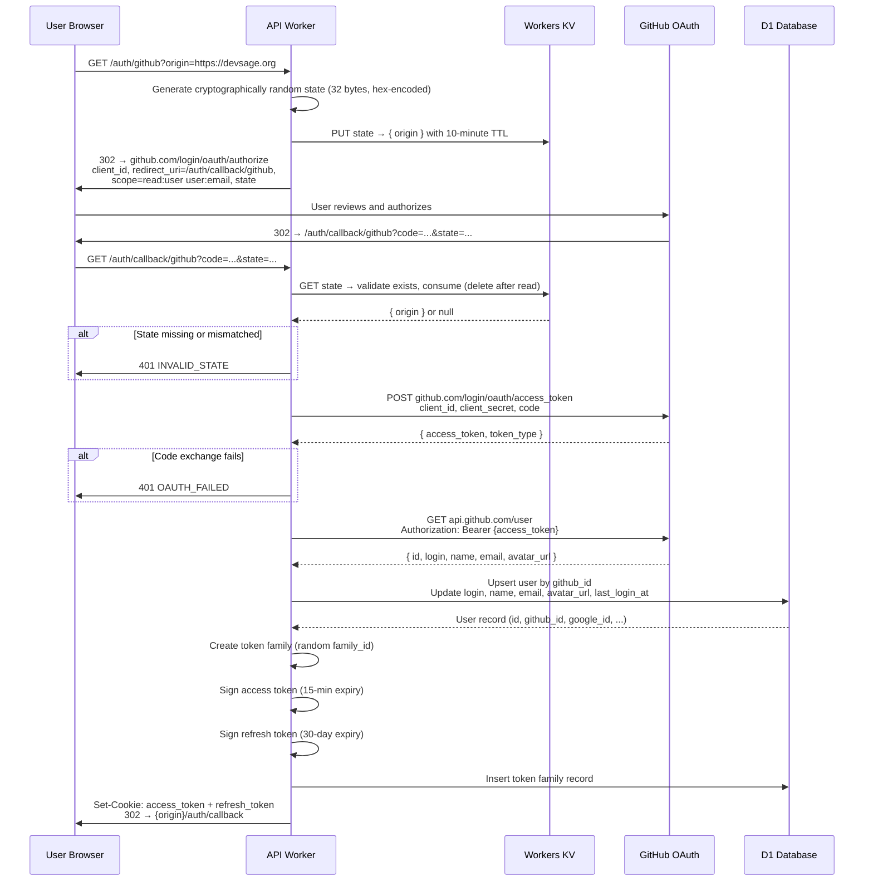

**GitHub OAuth parameters:**

| Parameter | Value |
|-----------|-------|
| Authorization URL | `https://github.com/login/oauth/authorize` |
| Token URL | `https://github.com/login/oauth/access_token` |
| Scopes (login) | `read:user`, `user:email` |
| Scopes (bot, incremental) | `repo`, `admin:repo_hook` (see [OAuth Scope Expansion](#oauth-scope-expansion)) |
| Redirect URI | `/auth/callback/github` |
| State storage | Workers KV, 10-minute TTL, consumed on use |

**Why GitHub is required for participants:** DevSage's core value prop is GitHub-native hackathon management. The bot tracks commits, detects force pushes, captures tag-based submissions, and comments on PRs. All of this requires a linked `github_id`. Participants on `{slug}.devsage.org` must have GitHub linked to use any hackathon features. Organizers and admins (on `platform.devsage.org` and `shikdd.devsage.org`) use Google OAuth only — they don't need GitHub since they don't submit code.

### Google OAuth (Secondary)

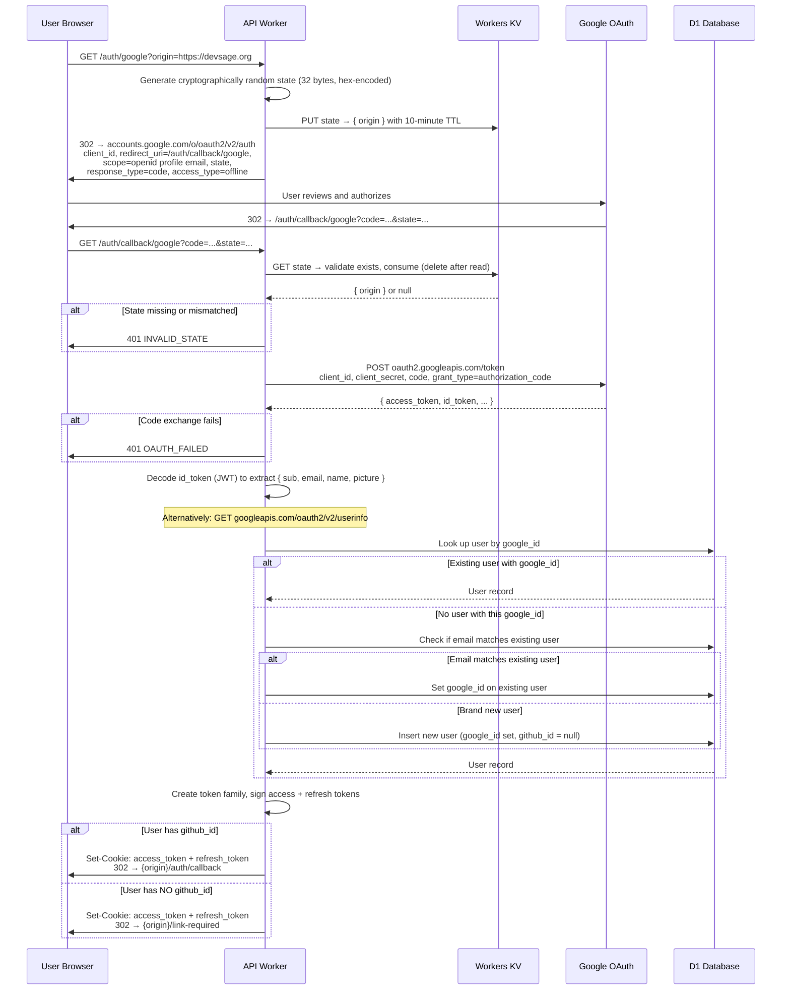

**Google OAuth parameters:**

| Parameter | Value |
|-----------|-------|
| Authorization URL | `https://accounts.google.com/o/oauth2/v2/auth` |
| Token URL | `https://oauth2.googleapis.com/token` |
| Scopes | `openid`, `profile`, `email` |
| Profile extraction | Decode `id_token` JWT payload (preferred) or call `/oauth2/v2/userinfo` |
| Redirect URI | `/auth/callback/google` |
| State storage | Workers KV, 10-minute TTL, consumed on use |

---

## Account Linking

Users who sign in with Google but have no GitHub account linked are redirected to `/link-required`. They have limited access until they link GitHub.

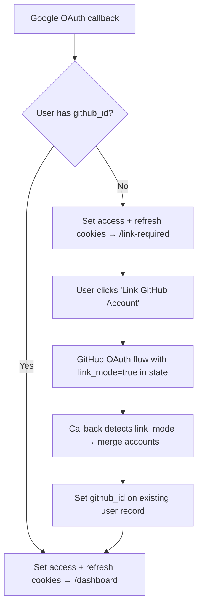

**Merge rules:**
- The existing user record (created via Google) is the canonical record. Its `id` (UUID) is preserved.
- `github_id`, `github_username`, and `avatar_url` are set from the GitHub profile.
- If a different user already exists with that `github_id` (they signed up with GitHub before), the two accounts are merged: the GitHub-only record is deleted, and any team memberships, scores, or audit events are re-pointed to the Google-originated user ID.
- Merge conflicts (both accounts are team leaders in the same hackathon) block the link and surface an error: `ACCOUNT_MERGE_CONFLICT`.

---

## Token Architecture

v3 replaces the single long-lived JWT with a dual-token system: a short-lived access token for API authentication and a rotating refresh token for session continuity.

### Access Token

A stateless JWT used on every API request. Short-lived to limit exposure.

```typescript
interface AccessTokenPayload {
  sub: string;    // user.id (UUID)
  ghid: number;   // github_id (0 if not linked)
  ghu: string;    // github_username ("" if not linked)
  fam: string;    // token family ID (links to refresh token family)
  iat: number;    // issued at (Unix seconds)
  exp: number;    // expiry (Unix seconds) — iat + 900
}
```

| Property | Value |
|----------|-------|
| Algorithm | HMAC-SHA256 via `crypto.subtle` |
| Secret | `JWT_SECRET` environment variable |
| Expiry | 15 minutes (900 seconds) |
| Cookie | `access_token`, HttpOnly, path `/` |
| Server-side state | None — fully stateless |
| Verification cost | ~0.5ms CPU |

### Refresh Token

An opaque token (not a JWT) stored server-side. Single-use — every refresh issues a new pair and invalidates the old one.

```typescript
interface RefreshToken {
  token: string;         // crypto.randomUUID() — opaque, not a JWT
  family_id: string;     // groups all tokens from one login session
  user_id: string;       // owner
  token_hash: string;    // SHA-256 hash of token (stored, not the raw token)
  expires_at: string;    // ISO-8601, 30 days from issuance
  used_at: string | null;    // set when consumed during refresh
  revoked_at: string | null; // set on explicit revocation or replay detection
  created_at: string;    // ISO-8601
}
```

| Property | Value |
|----------|-------|
| Format | Opaque UUID (not a JWT) |
| Storage | Hashed (SHA-256) in `token_families` table in D1 |
| Expiry | 30 days |
| Cookie | `refresh_token`, HttpOnly, path `/auth/refresh` only |
| Rotation | Every use issues a new refresh token |
| Replay detection | Reuse of a consumed token revokes the entire family |

### What is NOT in the Access Token

- **Roles** — resolved per-request per-hackathon via database query (see roles-permissions doc)
- **Email** — may change; always fetched from DB when needed
- **Display name** — may change; always fetched from DB when needed
- **Permissions** — derived from roles at request time


**Why 15-minute access tokens?** Short enough that a stolen token has limited utility (attacker has at most 15 minutes). Long enough that most user sessions (clicking through pages, filling forms) never hit a refresh boundary. The 15-minute window also means a compromised token cannot be used indefinitely even if the refresh token is not compromised.

**Why opaque refresh tokens (not JWTs)?** Refresh tokens must be revocable server-side (for session management, logout, replay detection). Making them stateless JWTs would defeat the purpose — you'd need a revocation list anyway. An opaque token with a server-side hash is simpler and equally secure.

### Token Lifecycle

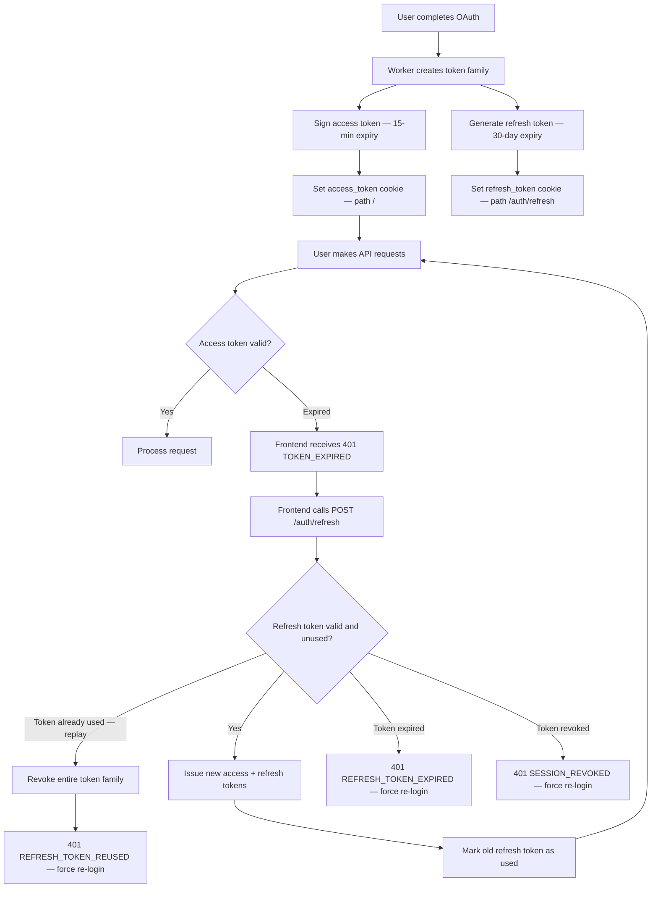

### Refresh Flow

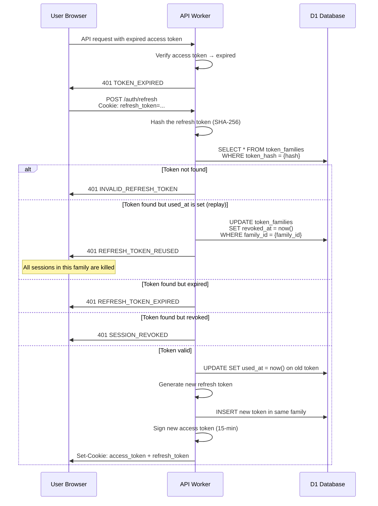

---

## Cookie Strategy

All tokens are stored in HttpOnly cookies. JavaScript never touches tokens directly.

### Production

Cookies are scoped to each app's specific subdomain — NOT to `.devsage.org`. This prevents cookie leakage across domains (e.g., a participant's token being sent to the admin panel).

| Cookie | Value | HttpOnly | Secure | SameSite | Path | MaxAge | Domain |
|--------|-------|----------|--------|----------|------|--------|--------|
| `access_token` | Signed JWT | Yes | Yes | `Strict` | `/` | 900 (15 min) | Per-app subdomain (e.g., `hackathon-a.devsage.org`, `platform.devsage.org`) |
| `refresh_token` | Opaque UUID | Yes | Yes | `Strict` | `/auth/refresh` | 2592000 (30 days) | Per-app subdomain |


**Critical: Never set domain to `.devsage.org`** — that would make cookies available to ALL subdomains including untrusted `{slug}.devsage.org` sites.

### Development

| Cookie | Value | HttpOnly | Secure | SameSite | Path | MaxAge | Domain |
|--------|-------|----------|--------|----------|------|--------|--------|
| `access_token` | Signed JWT | Yes | No | `Lax` | `/` | 900 | *(omitted — defaults to localhost)* |
| `refresh_token` | Opaque UUID | Yes | No | `Lax` | `/auth/refresh` | 2592000 | *(omitted)* |


**Why `SameSite=Strict` in production but `Lax` in development?** In production, each app's frontend and its API share the same subdomain (e.g., `platform.devsage.org` serves both the SPA and API routes) — so OAuth redirects back to the callback are same-site and `Strict` works. In development, GitHub/Google redirects to `localhost`, which is cross-site — `Strict` would block the cookie, so `Lax` is needed.

**Why separate paths for refresh and access cookies?** The refresh token cookie has `path: /auth/refresh`, so it is only sent on refresh requests. This means a compromised endpoint elsewhere in the API cannot extract the refresh token — it is never present in those requests.

---

## Auth Middleware

### `authMiddleware` (strict)

Required on all protected routes. Extracts and validates the access token. Rejects unauthenticated requests.

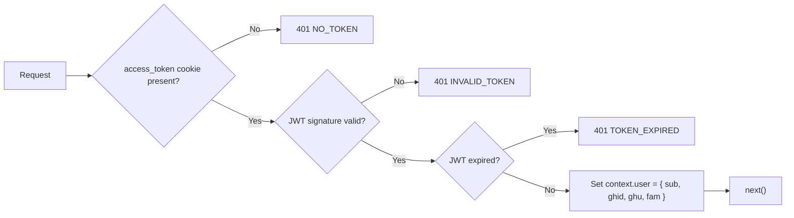

The middleware sets the authenticated user on the request context. Downstream handlers and role-resolution middleware read from this context — they never parse tokens themselves.

### `optionalAuth` (lenient)

Used on routes that may serve both authenticated and unauthenticated contexts (e.g., hackathon registration landing pages, pre-login hackathon info pages). Unauthenticated access is limited to registration/invite link landing pages and the login page itself.

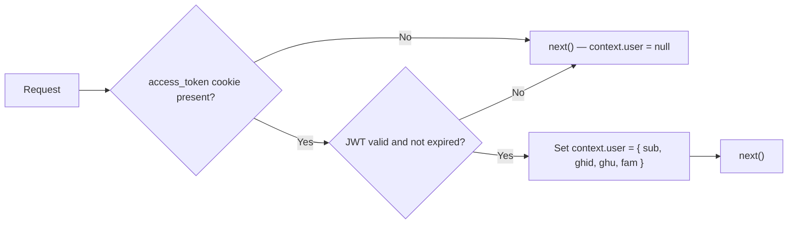

No error is returned for missing or invalid tokens — the request proceeds unauthenticated. This is only used on registration/invite acceptance and login routes, NOT for general public browsing (there are no public pages).

---

## Frontend Auth Flow

### Initial Load

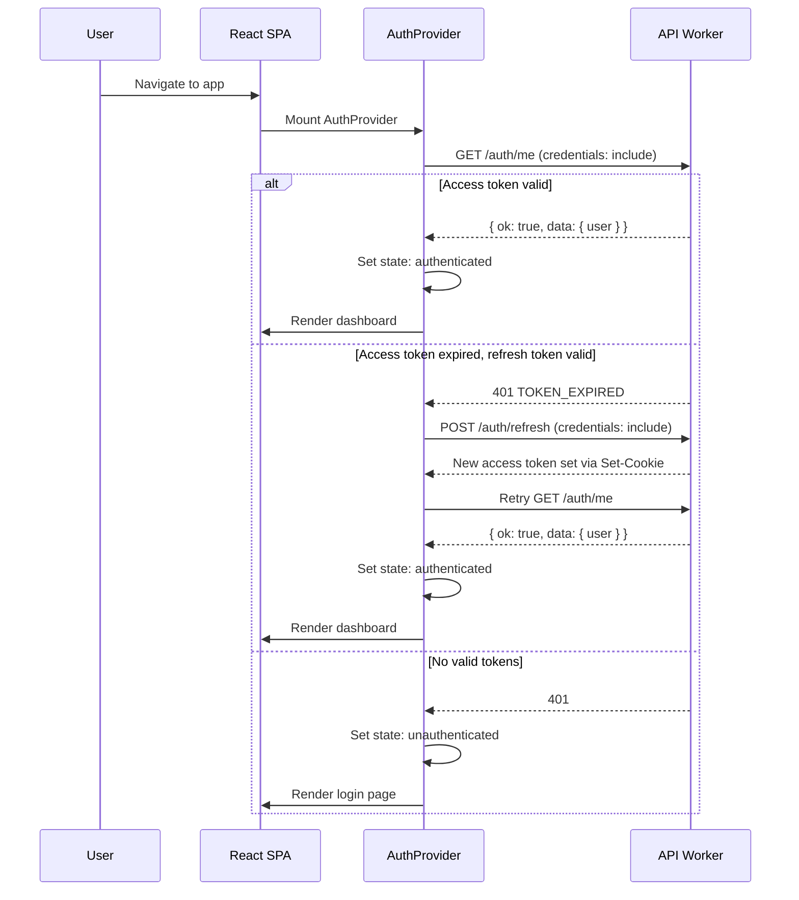

### AuthContext API

The frontend auth context exposes:

```typescript
interface AuthContext {
  user: User | null;
  isAuthenticated: boolean;
  isLoading: boolean;
  logout: () => Promise<void>;
}
```

| Field | Type | Description |
|-------|------|-------------|
| `user` | `User \| null` | Current user: `id`, `github_username`, `display_name`, `avatar_url`, `github_linked` |
| `isAuthenticated` | `boolean` | `true` if user object is present |
| `isLoading` | `boolean` | `true` during initial `/auth/me` check and during token refresh |
| `logout()` | `() => Promise<void>` | Calls `POST /auth/logout`, clears context state, redirects to `/` |

### API Request Wrapper

All API calls from the frontend go through a wrapper function that:

1. Includes `credentials: 'include'` on every request (sends cookies)
2. On 401 `TOKEN_EXPIRED` response: automatically calls `POST /auth/refresh`, then retries the original request exactly once
3. On 401 with any other code (or if refresh fails): clears auth state and redirects to `/login`
4. Queues concurrent requests during refresh — only one refresh call fires at a time (mutex/promise deduplication)

---

## Logout

### Single-Device Logout

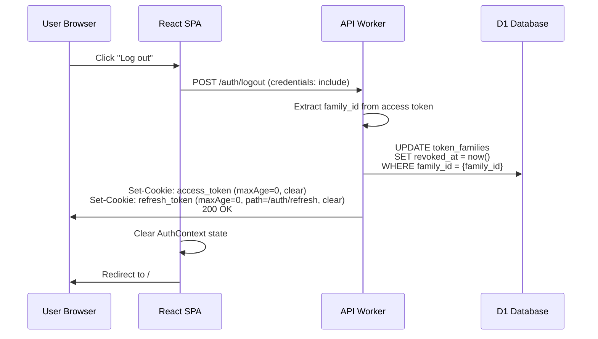

### All-Device Logout

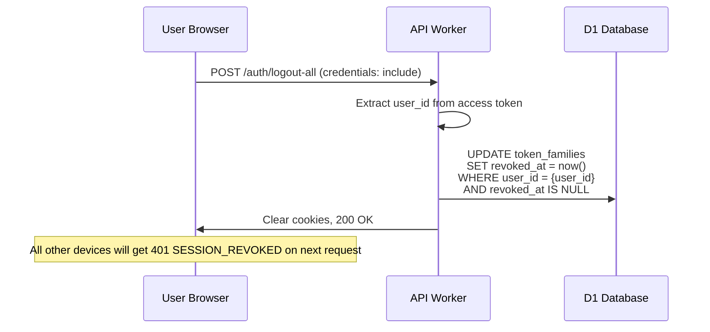

---

---

## Session Management

Every token family represents one login session on one device. The session management page lets users view and revoke sessions.

### GET /auth/sessions

Returns all active (non-revoked, non-expired) sessions for the authenticated user.

```typescript
interface Session {
  family_id: string;
  device: string;          // parsed from User-Agent: "Chrome on macOS", "Firefox on Windows", etc.
  location: string;        // country code from cf-ipcountry header captured at login: "US", "IN", etc.
  created_at: string;      // ISO-8601 — when the session was created (first login)
  last_active_at: string;  // ISO-8601 — most recent refresh token usage
  is_current: boolean;     // true if this is the requesting session's family
}
```

### DELETE /auth/sessions/:familyId

Revokes a specific session. Sets `revoked_at` on all tokens in that family. The affected device receives `401 SESSION_REVOKED` on its next request.

Cannot revoke the current session via this endpoint — use `POST /auth/logout` instead.

### Device and Location Capture

At login and each token refresh, the Worker captures:

- **User-Agent** → parsed into human-readable device string (e.g., "Safari on iPhone", "Chrome on Linux"). Parsing is best-effort — unknown agents show as "Unknown device".
- **`cf-ipcountry` header** → two-letter country code. Cloudflare provides this on every request. Stored on the token family record.

These are metadata for display only — not used for security decisions (IP-based blocking is handled by rate limiting, not session management).

---

## OAuth Scope Expansion

Initial login requests minimal GitHub scopes (`read:user`, `user:email`). When a team leader links a repository and needs bot capabilities, the app triggers incremental authorization for elevated scopes.

### Flow

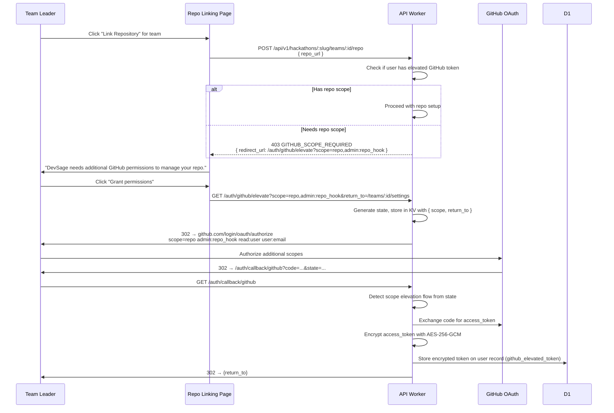

| Scope | When Requested | Purpose |
|-------|---------------|---------|
| `read:user`, `user:email` | Initial login | Profile, identity |
| `repo` | Repo linking (incremental) | Bot: read commits, comment on PRs, create commit statuses |
| `admin:repo_hook` | Repo linking (incremental) | Manage webhooks programmatically (create/delete) |

The elevated token is:
- Encrypted at rest (AES-256-GCM, key: `GITHUB_TOKEN_ENCRYPTION_KEY` env var)
- Used exclusively by the queue consumer for bot operations (never sent to the frontend)
- Scoped to the team's linked repo only by convention (the token technically has broader access, but the bot code only operates on the linked repo)

---

## Rate Limiting

All `/auth/*` endpoints are rate-limited at the Cloudflare edge to prevent credential stuffing, OAuth abuse, and brute-force attacks. Rate limits are enforced before the Worker executes, using the client IP as the key.

| Endpoint Pattern | Limit | Window | Block Duration | Notes |
|-----------------|-------|--------|----------------|-------|
| `GET /auth/github` | 10 | 1 minute | 5 minutes | OAuth initiation |
| `GET /auth/google` | 10 | 1 minute | 5 minutes | OAuth initiation |
| `GET /auth/callback/*` | 20 | 1 minute | 10 minutes | OAuth callbacks |
| `POST /auth/refresh` | 30 | 1 minute | 5 minutes | Token refresh |
| `POST /auth/logout` | 10 | 1 minute | 1 minute | Logout |

| `DELETE /auth/account` | 3 | 1 hour | 1 hour | Account deletion requests |

**Implementation:** Configured via Cloudflare Rate Limiting Rules (dashboard or Terraform). Not enforced in Worker code — edge enforcement means blocked requests never consume Worker CPU.

---

## Account Deletion & GDPR

### Data Export

`GET /auth/account/export` — generates a JSON archive of all user-associated data and returns a signed download URL.

**What's included:**
- User profile (id, usernames, email, display name, avatar, created_at)
- All team memberships across hackathons (team name, role, joined_at)
- All submissions associated with user's teams
- All scores received (as judge or participant)
- All audit events where user is the actor (anonymized event targets)
- OAuth provider metadata (which providers linked, when)

**What's excluded:**
- Other users' data (even within same team)
- Hackathon configuration data (owned by organizer)
- Audit events where user is the target but not the actor

**Delivery:** The Worker generates the JSON, uploads to R2, creates a signed URL with 24-hour expiry, and returns it. For large exports, the generation is enqueued and the user receives an email with the download link when ready.

### Account Deletion

Two-phase deletion to prevent accidental or malicious account removal.

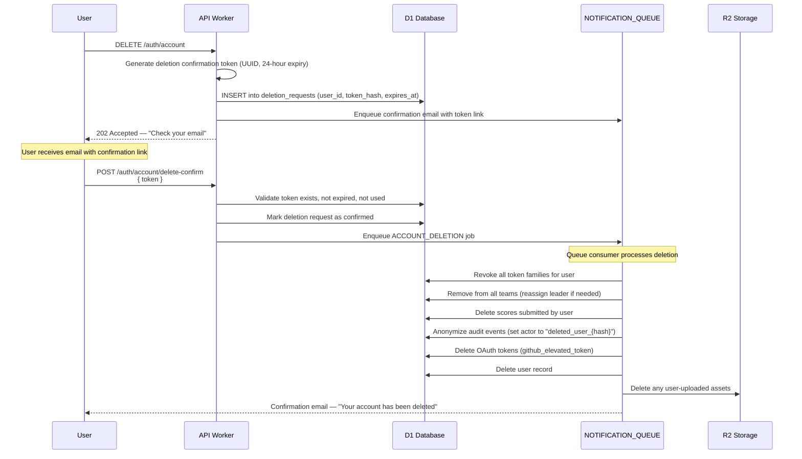

| Phase | Endpoint | Timeline |
|-------|----------|----------|
| Request | `DELETE /auth/account` | Immediate |
| Confirmation email | Sent via notification queue | Within minutes |
| Confirm | `POST /auth/account/delete-confirm` | Token valid for 24 hours |
| Execution | Queue job cascades all deletions | Within 1 hour of confirmation |
| Completion email | Sent after deletion completes | Confirmation of removal |

**Team leader reassignment:** If the deleted user is a team leader, the system auto-promotes the longest-tenured team member to leader. If the user is the only team member, the team is archived (not deleted — the hackathon organizer may need the submission record).

**Audit event anonymization:** Audit events are NOT deleted. They are anonymized: the actor field is replaced with `deleted_user_{first_8_chars_of_user_id}` and all PII fields (email, username) in the event metadata are scrubbed. This preserves the audit trail for organizer accountability without retaining personal data.

---

## Error Code Catalog

Every error response from auth endpoints uses a machine-readable `code` field in the standard error envelope: `{ ok: false, error: { code, message } }`.

| Code | HTTP Status | When | User-Facing Message |
|------|-------------|------|---------------------|
| `NO_TOKEN` | 401 | No `access_token` cookie present | "Authentication required. Please sign in." |
| `INVALID_TOKEN` | 401 | JWT signature verification fails | "Invalid session. Please sign in again." |
| `TOKEN_EXPIRED` | 401 | Access token `exp` < current time | "Session expired." (frontend auto-refreshes) |
| `INVALID_REFRESH_TOKEN` | 401 | Refresh token not found in DB | "Session not found. Please sign in again." |
| `REFRESH_TOKEN_EXPIRED` | 401 | Refresh token past 30-day expiry | "Session expired. Please sign in again." |
| `REFRESH_TOKEN_REUSED` | 401 | Refresh token already consumed (replay) | "Security alert: session was compromised. All sessions revoked. Please sign in again." |
| `SESSION_REVOKED` | 401 | Token family explicitly revoked | "This session has been revoked." |
| `INVALID_STATE` | 401 | OAuth state parameter missing/expired/mismatched | "Login expired. Please try again." |
| `OAUTH_FAILED` | 401 | Code exchange with provider failed | "Authentication with {provider} failed. Please try again." |
| `GITHUB_LINK_REQUIRED` | 403 | User has no github_id, trying to access GitHub-dependent feature | "Please link your GitHub account to use this feature." |
| `GITHUB_SCOPE_REQUIRED` | 403 | Bot action needs elevated GitHub token | "Additional GitHub permissions required." |
| `ACCOUNT_MERGE_CONFLICT` | 409 | Account linking would create conflicting team memberships | "Cannot link accounts — conflicting team memberships exist." |

| `RATE_LIMITED` | 429 | Cloudflare edge rate limit triggered | "Too many requests. Please wait and try again." |
| `ACCOUNT_DELETED` | 410 | User attempts to log in after account deletion | "This account has been deleted." |
| `ACCOUNT_NOT_FOUND` | 404 | User ID in token doesn't match any DB record | "Account not found." |

| `DELETION_TOKEN_INVALID` | 400 | Account deletion confirmation token expired or invalid | "Deletion link expired. Please request again." |

---

## Security Threat Model

| Threat | Mitigation |
|--------|-----------|
| XSS token theft | HttpOnly cookies — JavaScript cannot read tokens. Even if XSS is present, tokens are not extractable. |
| CSRF | `SameSite=Strict` in production. `Origin` header validation on all mutation endpoints. Refresh token scoped to `/auth/refresh` path only. |
| Token replay (access) | 15-minute expiry limits window. No server-side revocation check on access tokens (stateless by design). |
| Token replay (refresh) | Single-use with family-based replay detection. Reuse of a consumed refresh token revokes the entire family, killing all sessions from that login. |
| OAuth state forgery | Cryptographically random state stored in KV with 10-minute TTL. State is consumed (deleted) on first use — cannot be replayed. |

| Account takeover via email | Email is not used for authentication. OAuth provider identity (GitHub ID / Google ID) is the key. Changing email on the provider doesn't affect DevSage auth. |
| Stolen refresh token | Refresh tokens are hashed (SHA-256) in the database. Even if D1 is compromised, raw tokens cannot be extracted. Combined with single-use rotation, a stolen token from network interception is detectable on reuse. |
| Privilege escalation | Roles are resolved per-request from D1, never from the token. Even if an attacker modifies the JWT payload, they cannot escalate roles — `sub` is validated and roles are fetched from the source of truth. |
| Timing attacks on JWT verify | `crypto.subtle.verify()` uses constant-time comparison internally. No custom comparison code. |
| GitHub app deauthorization | DevSage does not store long-lived GitHub access tokens from login (only used transiently during callback). If a user revokes the GitHub App, existing DevSage sessions remain valid until expiry. Bot features stop working when the elevated token is revoked. |

---

## Edge Cases

### Concurrent OAuth from Multiple Tabs

Two tabs start OAuth simultaneously. Each generates a different `state` value stored in KV. Both can complete independently — the second callback's `Set-Cookie` overwrites the first tab's cookies. This is harmless because the user upsert is idempotent (same `github_id` → same user record) and both token families are valid. The first tab's tokens are simply replaced.

### Expired KV State (Slow OAuth)

If a user takes longer than 10 minutes on the provider's consent screen, the state token expires in KV. When the callback arrives, KV returns `null` → `401 INVALID_STATE`. The user must restart the OAuth flow. The 10-minute window is generous — typical OAuth consent takes under 30 seconds.

### JWT Clock Skew

All JWT verification happens on Cloudflare Workers, which use globally synchronized clocks across all edge locations. There is no cross-server clock skew. Client clocks are irrelevant — `exp` is checked server-side only. No clock-skew tolerance is needed or implemented.

### GitHub App Revocation

DevSage does not store the GitHub OAuth access token from login beyond the callback handler. If a user revokes DevSage's GitHub App from their GitHub settings, there is no immediate effect on their DevSage session — the access/refresh tokens remain valid. However:
- Bot features (PR comments, commit status) stop working if the elevated token is also revoked
- The user's next login attempt with GitHub will require re-authorization

### Cookie Domain Mismatch (Local Development)

Production cookies use the app's specific subdomain (e.g., `platform.devsage.org`, `hackathon-a.devsage.org`). They are never set to `.devsage.org` to prevent cross-subdomain leakage. In local development, the `domain` field is omitted entirely, which causes the cookie to default to the exact host (`localhost`). This prevents cookies from being rejected due to domain mismatch.

### Refresh Token Race Condition

Multiple tabs may detect an expired access token simultaneously and all attempt `POST /auth/refresh` with the same refresh token. The first request succeeds and marks the token as `used_at = now()`. Subsequent requests see the token as already used — this looks like replay. To handle this gracefully:
- The refresh endpoint uses a short grace period (5 seconds) after `used_at` is set. If the same token hash is presented within 5 seconds of being consumed, the request receives the same new token pair (idempotent refresh).
- After the grace period, it triggers full family revocation (true replay detection).

### Participant Logged in via Google (No GitHub Linked)

On participant sites (`{slug}.devsage.org`), a user who signs in with Google but has not yet linked GitHub:
- Can see the hackathon landing page and their invite details
- Cannot join teams, submit code, or access any hackathon features
- Is immediately prompted to link a GitHub account (blocking modal, not just a banner)
- If they do not have a GitHub account, they are directed to create one at github.com first
- Their `ghid` field in the access token is `0` and `ghu` is `""`

**Note:** On the organizer/judge platform (`platform.devsage.org`) and admin panel (`shikdd.devsage.org`), Google is the only login method — no GitHub linking is needed since these users don't submit code.

---

## Database Tables

All tables use `TEXT` primary keys (UUIDs generated via `crypto.randomUUID()`). Timestamps are ISO-8601 UTC strings. All tables should be defined with Drizzle ORM for D1/SQLite.

### `users` (modified from v2)

| Column | Type | Notes |
|--------|------|-------|
| `id` | TEXT PK | UUID |
| `github_id` | INTEGER UNIQUE | Nullable — not set for Google-only users |
| `google_id` | TEXT UNIQUE | Nullable — not set for GitHub-only users |
| `github_username` | TEXT | Nullable |
| `email` | TEXT | From OAuth provider |
| `display_name` | TEXT | From OAuth provider, editable |
| `avatar_url` | TEXT | From OAuth provider |
| `github_elevated_token` | TEXT | AES-256-GCM encrypted. Nullable. Only set after scope elevation |

| `last_login_at` | TEXT | ISO-8601 |
| `created_at` | TEXT | ISO-8601 |
| `updated_at` | TEXT | ISO-8601 |

### `token_families` (new)

| Column | Type | Notes |
|--------|------|-------|
| `id` | TEXT PK | UUID — this is the `family_id` |
| `user_id` | TEXT FK → users.id | Owner |
| `token_hash` | TEXT | SHA-256 hash of the current (latest) refresh token |
| `device` | TEXT | Parsed User-Agent string |
| `location` | TEXT | Country code from `cf-ipcountry` |

| `expires_at` | TEXT | ISO-8601. 30 days from most recent refresh |
| `used_at` | TEXT | ISO-8601. Set when this specific token is consumed during refresh |
| `revoked_at` | TEXT | ISO-8601. Set on logout, session revocation, or replay detection |
| `created_at` | TEXT | ISO-8601. When the session was first created |

**Indexes:** `user_id` (for session listing), `token_hash` (for refresh lookup).


### `deletion_requests` (new)

| Column | Type | Notes |
|--------|------|-------|
| `id` | TEXT PK | UUID |
| `user_id` | TEXT FK → users.id | Who requested deletion |
| `token_hash` | TEXT | SHA-256 hash of confirmation token |
| `expires_at` | TEXT | ISO-8601. 24 hours from request |
| `confirmed_at` | TEXT | ISO-8601. Nullable. Set when user confirms |
| `completed_at` | TEXT | ISO-8601. Nullable. Set when deletion job finishes |
| `created_at` | TEXT | ISO-8601 |

**Indexes:** `user_id`, `token_hash`.


---

## Migration from v2

The transition from v2 (single long-lived JWT) to v3 (dual-token with refresh rotation) must not log out existing users.

### Phase 1: Deploy Dual-Token Infrastructure

- Deploy all new tables (`token_families`, `deletion_requests`)
- Deploy the new auth middleware that accepts BOTH formats:
  - Old format: single `session` cookie containing a 7-day JWT → treat as valid access token, no refresh capability
  - New format: `access_token` + `refresh_token` cookies → full v3 flow
- Deploy the `/auth/refresh` endpoint (no-ops for legacy sessions)
- Deploy updated frontend with refresh interceptor logic

**Duration:** 1 deploy. No user impact. Old sessions continue working.

### Phase 2: Issue New Tokens on Login

- All new logins (OAuth callbacks) issue v3 dual tokens instead of the legacy single JWT
- Existing sessions with the old `session` cookie continue working until natural expiry (up to 7 days)
- The old `session` cookie is accepted but never refreshed — when it expires, the user re-authenticates and gets v3 tokens

**Duration:** 7 days (one full JWT expiry cycle).

### Phase 3: Remove Legacy Acceptance

- Remove the code path that accepts the old `session` cookie format
- Clean up: delete any remaining `session` cookies by setting `maxAge=0` on any request that presents one
- All users are now on v3 dual-token auth

**Duration:** 1 deploy. Any user who hasn't logged in for 7+ days simply re-authenticates.


---

## Feature Dependency Graph

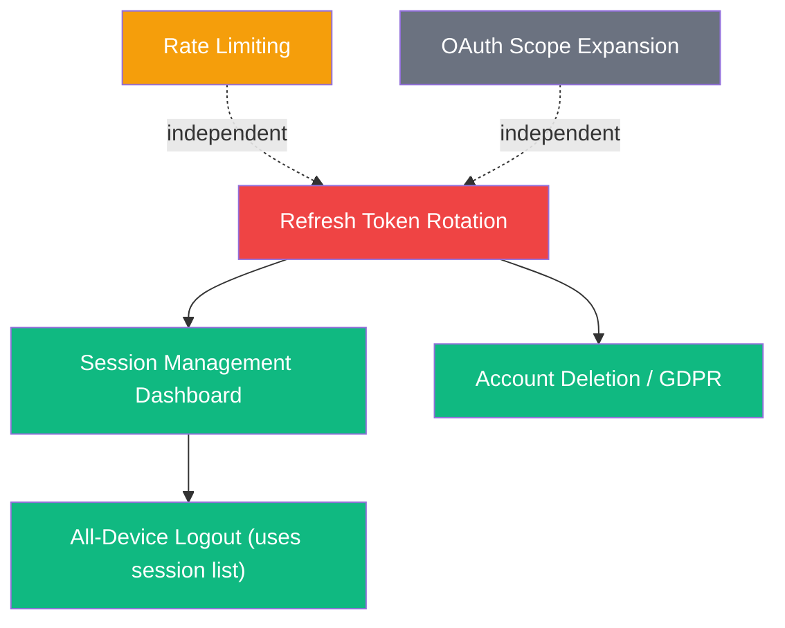

| Feature | Priority | Complexity | Depends On | New Tables |
|---------|----------|------------|------------|------------|
| Refresh token rotation | **High** | Medium | Nothing (first) | `token_families` |
| Rate limiting | **High** | Low | Nothing (Cloudflare config) | None |
| Session management | Medium | Medium | Refresh token rotation | None (uses `token_families`) |
| OAuth scope expansion | Medium | Low | Nothing | Column on `users` |
| Account deletion / GDPR | Medium | High | Refresh token rotation | `deletion_requests` |

**Recommended implementation order:**
1. Refresh token rotation + rate limiting (parallel — no overlap)
2. Session management (needs token families from step 1)
3. OAuth scope expansion (independent, low effort)
4. Account deletion / GDPR (needs token families, high effort, do last)

---

## Decision Log

Key architectural decisions and their rationale.

| Decision | Choice | Why | Alternatives Considered |
|----------|--------|-----|------------------------|
| No external JWT library | `crypto.subtle` only | Workers have Web Crypto built in. External libs add bundle size and may use Node.js APIs unavailable in Workers runtime. | `jose`, `jsonwebtoken` — both have Workers compatibility issues |
| HMAC-SHA256 for JWTs | Symmetric signing | Single service verifies tokens (no cross-service verification needed). Symmetric is simpler and faster than RSA/ECDSA. | RS256, ES256 — unnecessary complexity for single-issuer/single-verifier |
| 15-minute access token expiry | Short-lived stateless | Limits blast radius of stolen tokens. Long enough that typical user sessions rarely hit refresh. | 5 min (too aggressive, constant refreshing), 1 hour (too long exposure), 7 days (v2 — no revocability) |
| 30-day refresh token expiry | Long session continuity | Matches user expectation of staying logged in. Monthly re-auth is acceptable UX. | 7 days (too frequent re-auth), 90 days (too long, increases risk) |
| Opaque refresh tokens (not JWTs) | Must be revocable server-side | Session management requires server-side revocation. JWTs are stateless by design — adding a revocation list defeats the purpose. | JWT refresh tokens with revocation list — more complex, same result |
| `SameSite=Strict` in prod | Maximum CSRF protection | Each app's frontend and API share the same subdomain. OAuth redirects from GitHub/Google back to our callback are same-site. No cross-site cookie sending needed. | `Lax` — weaker CSRF protection, not needed since our setup allows `Strict` |
| `SameSite=Lax` in dev | OAuth redirect compatibility | GitHub/Google redirect to `localhost`, which is cross-site. `Strict` blocks cookies on cross-site navigation. `Lax` allows cookies on top-level navigations (GET redirects). | `None` + `Secure` — requires HTTPS in dev, unnecessary |
| GitHub ID as primary identity | Required for bot features | DevSage's core features (commit tracking, PR comments, tag-based submissions) all require GitHub integration. Google is a convenience login. | Email as primary key — unreliable (users change emails), doesn't map to GitHub API |
| Roles NOT in JWT | Per-request resolution | A user's role varies by hackathon and can change mid-session (promoted to admin, invited as judge). Baking into JWT would require re-issuance on every role change. | Role in JWT with short expiry — still has staleness window, more complex |
| OAuth-only (no MFA/passkeys) | Reduced complexity | OAuth providers (GitHub, Google) already handle credential security including 2FA. Adding MFA/passkeys to DevSage adds significant complexity for minimal security gain in a hackathon platform. | TOTP + WebAuthn — over-engineered for this use case |
| No `@hono/oauth-providers` | Broken on Workers | The library has known issues with Cloudflare Workers runtime (missing Node.js APIs, incorrect fetch behavior). Manual OAuth is ~50 lines of code per provider. | Fix upstream — out of our control, manual impl is trivial |
| No password auth | Reduced attack surface | No password database = no credential stuffing, no password reset flow, no bcrypt at scale. OAuth providers handle credential management. | Email + password as fallback — massive increase in security surface area |
| 5-second refresh grace period | Handles concurrent tabs | Multiple tabs detecting expiry simultaneously is common. Without grace, the second tab triggers false replay detection and revokes the family. | Mutex in frontend only — doesn't handle multiple browser windows. Longer grace — increases replay detection window |
