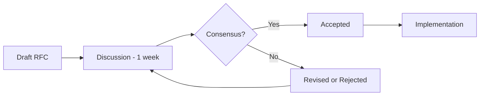

# Contributing Guidelines

> Code style, PR process, ADR conventions, RFC workflow, performance budgets, accessibility CI, and anti-patterns — everything you need to contribute effectively to DevSage.

---

## Table of Contents

1. [Getting Started](#getting-started)
2. [Branch Strategy](#branch-strategy)
3. [Code Style](#code-style)
4. [Project Structure](#project-structure)
5. [Testing Expectations](#testing-expectations)
6. [Performance Budgets](#performance-budgets)
7. [Accessibility Requirements](#accessibility-requirements)
8. [Commit Messages](#commit-messages)
9. [Pull Request Process](#pull-request-process)
10. [Architecture Decision Records](#architecture-decision-records)
11. [RFC Process](#rfc-process)
12. [Anti-Patterns](#anti-patterns)

---

## Getting Started

Set up your local development environment by following the [Developer Setup Guide](./setup.md). Verify everything works:

```bash
pnpm dev        # All services start
pnpm test       # All tests pass
pnpm typecheck  # No type errors
pnpm lint       # No lint errors
```

---

## Branch Strategy

| Branch | Purpose | Deploys To |
|--------|---------|-----------|
| `main` | Production-ready code | Production |
| `staging` | Pre-production validation | Staging environment |
| `feat/*` | Feature work | Preview deploy per PR |
| `fix/*` | Bug fixes | Preview deploy per PR |
| `docs/*` | Documentation | Preview deploy per PR |
| `refactor/*` | Refactoring | Preview deploy per PR |

### Rules

- All work happens on feature branches created from `main`
- Pull requests are required for merging into `main`
- PRs require at least 1 approval
- CI must pass before merge
- Squash merge is the default (clean history)

---

## Code Style

TypeScript strict mode is enforced across the entire monorepo. The following conventions are non-negotiable.

### General Rules

| Rule | Enforcement | Why |
|------|-------------|-----|
| ESM only | Lint error | Cloudflare Workers require ESM |
| Explicit `.js` extensions in barrel exports | Lint error | ESM spec requires explicit extensions |
| No `console.log` | Lint warning | Use `console.warn` or `console.error` for structured logging |
| Unused variables prefixed with `_` | Lint config | `argsIgnorePattern: '^_'` suppresses warnings |
| No type escape hatches | Lint warning | Never use `as any`, `@ts-ignore`, `@ts-expect-error` |
| All timestamps UTC ISO-8601 | Convention | `new Date().toISOString()` everywhere |
| UUIDs via `crypto.randomUUID()` | Convention | Workers-native, no external library |
| Response envelope | Convention | `{ ok, data, meta }` or `{ ok, error: { code, message } }` |

### Naming Conventions

| Entity | Convention | Example |
|--------|-----------|---------|
| Files | kebab-case | `team-management.ts` |
| Components | PascalCase | `TeamCard.tsx` |
| Functions | camelCase | `resolveRole()` |
| Constants | SCREAMING_SNAKE | `MAX_TEAM_SIZE` |
| Types/Interfaces | PascalCase | `HackathonState` |
| Database columns | snake_case | `created_at` |
| API routes | kebab-case | `/api/v1/team-members` |
| Environment variables | SCREAMING_SNAKE | `JWT_SECRET` |
| CSS classes | Tailwind utilities | `className="flex items-center"` |

### Formatting

ESLint flat config (ESLint 9+) is defined in `packages/config/eslint.config.mjs`. Run `pnpm lint` to check and `pnpm lint:fix` to auto-fix.

---

## Project Structure

When adding new code, place it in the correct location:

| What You're Adding | Where It Goes | Notes |
|--------------------|---------------|-------|
| API route | `apps/api/src/routes/` | Hono router; mount in `src/index.ts` via `app.route()` |
| Durable Object | `apps/api/src/durable-objects/` | MUST re-export from `src/index.ts` |
| Queue handler | `apps/api/src/queue/` | Wire in `queue/index.ts` dispatcher |
| External service | `apps/api/src/services/` | Fail-open pattern (10s timeout, never throw) |
| Middleware | `apps/api/src/middleware/` | `MiddlewareHandler<AuthAppEnv>` pattern |
| DB table | `packages/db/src/schema/` | Drizzle SQLite; re-export from `schema/index.ts` |
| Zod schema | `packages/shared/src/schemas/` | Re-export from `src/index.ts` with `.js` extension |
| UI page | `apps/platform/src/pages/` | Add route in `App.tsx`; wrap with `ProtectedRoute` if auth required |
| UI component | `apps/platform/src/components/` | shadcn/ui primitives in `components/ui/` |
| Shared type | `packages/shared/src/types/` | Re-export from `src/index.ts` |

**All new schemas, types, and modules must be re-exported from their package's barrel file (`index.ts`).** Failing to do so breaks downstream imports.

---

## Testing Expectations

### Coverage Targets

| Package | Target | Current |
|---------|--------|---------|
| `@devsage/api` | 70% | — |
| `@devsage/web` | 60% | — |
| `@devsage/shared` | 90% | — |
| `@devsage/db` | N/A | Schema-only, tested via API integration tests |

### API Tests

Location: `apps/api/src/__tests__/`

- Use `@cloudflare/vitest-pool-workers` (real Workers runtime)
- Real D1, KV, and Durable Object bindings
- Prefer integration tests over unit tests
- Minimize mocking — test real behavior

```typescript
// Good: integration test with real D1
it('should create a hackathon', async () => {
  const res = await app.request('/api/v1/hackathons', {
    method: 'POST',
    body: JSON.stringify({ name: 'Test Hack', slug: 'test-hack' }),
    headers: { Cookie: authCookie },
  });
  expect(res.status).toBe(201);
  const body = await res.json();
  expect(body.ok).toBe(true);
  expect(body.data.slug).toBe('test-hack');
});
```

### Web Tests

Location: `apps/platform/src/__tests__/`

- jsdom with `@testing-library/react`
- Test behavior, not implementation
- Include accessibility checks with `axe-core`

```typescript
// Good: behavior-focused test
it('should show team members after loading', async () => {
  render(<TeamCard teamId="t1" />, { wrapper: TestProviders });
  expect(screen.getByRole('progressbar')).toBeInTheDocument();
  await waitFor(() => {
    expect(screen.getByText('Alice Chen')).toBeInTheDocument();
  });
});
```

### Test Commands

```bash
pnpm test                          # All tests
pnpm --filter @devsage/api test    # API only
pnpm --filter @devsage/web test    # Web only
pnpm test -- --coverage            # With coverage report
```

---

## Performance Budgets

### Web Bundle

| Chunk | Max Size (gzip) | Enforcement |
|-------|----------------|-------------|
| Initial JS (vendor + app + query + ui) | 200 KB | CI fails if exceeded |
| Per-route chunk | 50 KB | CI warning |
| Total CSS | 30 KB | CI warning |

### Web Vitals

| Metric | Target | Measurement |
|--------|--------|-------------|
| First Contentful Paint | < 1.2s | Lighthouse (4G throttle) |
| Largest Contentful Paint | < 2.0s | Lighthouse (4G throttle) |
| Time to Interactive | < 2.5s | Lighthouse (4G throttle) |
| Cumulative Layout Shift | < 0.05 | Lighthouse |
| Total Blocking Time | < 200ms | Lighthouse |

### API Latency

| Endpoint Category | P50 Target | P95 Target |
|-------------------|-----------|-----------|
| Read (GET) | < 50ms | < 200ms |
| Write (POST/PUT/PATCH) | < 100ms | < 500ms |
| Search/filter | < 200ms | < 1s |
| Export (async) | N/A | < 5 min processing |

---

## Accessibility Requirements

### Compliance Level

**WCAG 2.1 Level AA** across all interactive surfaces.

### CI Enforcement

Every component test should include an accessibility check:

```typescript
import { axe, toHaveNoViolations } from 'jest-axe';
expect.extend(toHaveNoViolations);

it('should have no accessibility violations', async () => {
  const { container } = render(<TeamCard />, { wrapper: TestProviders });
  const results = await axe(container);
  expect(results).toHaveNoViolations();
});
```

### Required Practices

| Practice | Description |
|----------|-------------|
| Semantic HTML | Use `<button>`, `<nav>`, `<main>`, `<header>` — not `<div onClick>` |
| ARIA labels | All interactive elements have labels. Forms use `htmlFor` |
| Focus management | Visible focus indicators. Logical tab order. Skip-to-main link |
| Color contrast | 4.5:1 minimum for normal text, 3:1 for large text |
| Reduced motion | Respect `prefers-reduced-motion` — disable animations |
| Alt text | All informational images have descriptive alt text |
| Heading hierarchy | Strict h1 → h2 → h3 nesting |

---

## Commit Messages

Use [Conventional Commits](https://www.conventionalcommits.org/) format:

```
feat: add team invitation flow
fix: correct OAuth callback redirect for GitHub
docs: update deployment guide with DNS setup
refactor: extract auth middleware into shared module
test: add integration tests for hackathon state machine
chore: update dependencies
perf: optimize leaderboard query with proper indexing
a11y: add screen reader labels to judging form
```

### Rules

- Keep subject line under 72 characters
- Use imperative mood ("add" not "added")
- Use body for context when the change is non-trivial
- Reference issue/PR numbers when applicable: `fix: handle null team (#123)`

---

## Pull Request Process

### PR Checklist

Before requesting review:

- [ ] `pnpm typecheck` passes with no errors
- [ ] `pnpm lint` passes with no errors
- [ ] `pnpm test` passes with no failures
- [ ] No secrets in committed files
- [ ] New schemas/types re-exported from barrel files
- [ ] Durable Objects re-exported from `apps/api/src/index.ts`
- [ ] Migrations (if any) generated via `drizzle-kit generate`
- [ ] Bundle size within budget
- [ ] Accessibility checks pass (for UI changes)
- [ ] Preview deploy works correctly

### PR Description Template

```markdown
## What

Brief description of what changed and why.

## How

Key implementation decisions and approach.

## Testing

How this was tested. Include screenshots for UI changes.

## Checklist

- [ ] Types pass
- [ ] Lint passes
- [ ] Tests pass
- [ ] No secrets committed
- [ ] Barrel exports updated
```

### Review Process

1. Open PR against `main`
2. CI runs automatically (lint, typecheck, test, secret scan, bundle analysis)
3. Preview deploy is created
4. Request review from at least 1 team member
5. Address review feedback
6. Squash merge when approved + CI green

---

## Architecture Decision Records

For significant architectural decisions, create an ADR:

### ADR Template

Create a file in `docs/adrs/NNNN-title.md`:

```markdown
# ADR-NNNN: Title

## Status

Proposed | Accepted | Deprecated | Superseded by ADR-XXXX

## Context

What is the issue or question being addressed?

## Decision

What is the change being proposed?

## Consequences

### Positive
- Benefit 1
- Benefit 2

### Negative
- Tradeoff 1
- Tradeoff 2

### Neutral
- Observation 1

## Alternatives Considered

### Alternative A
Description and why it was rejected.

### Alternative B
Description and why it was rejected.
```

### When to Write an ADR

| Trigger | Example |
|---------|---------|
| New technology choice | Switching from Zustand to Jotai |
| Architectural pattern change | Moving from REST to GraphQL |
| Security model change | Adding passkey authentication |
| Data model change | Sharding D1 databases |
| Breaking API change | v2 → v3 endpoint migration |

---

## RFC Process

For features that affect multiple systems or require community input:

### RFC Workflow



### When to Write an RFC

- Feature spans 3+ architecture docs
- Feature requires changes to 2+ packages
- Feature has security or privacy implications
- Feature is controversial or has multiple valid approaches

### RFC Location

Create in `docs/rfcs/NNNN-title.md`. RFCs are discussed via GitHub Discussions or PR review.

---

## Anti-Patterns

These patterns are known to cause issues in this project. Do not use them.

### Code Anti-Patterns

| Anti-Pattern | Why | Use Instead |
|-------------|-----|-------------|
| `@hono/oauth-providers` | Broken on Cloudflare Workers | Manual OAuth 2.0 implementation |
| Prisma | Incompatible with Workers and D1 | Drizzle ORM |
| D1 access from inside Durable Objects | Worker must mediate all D1 writes | Pass data through the Worker |
| `wrangler.toml` | Project uses JSONC format | `wrangler.jsonc` |
| `console.log` | Banned by lint config | `console.warn` / `console.error` |
| Secrets in `VITE_*` env vars | Client-visible, never safe for secrets | Worker secrets via `wrangler secret put` |
| `as any` / `@ts-ignore` | Undermines type safety | Proper typing or `unknown` with narrowing |
| External JWT libraries | Unnecessary dependency in Workers | `crypto.subtle` HMAC SHA-256 |
| Storing roles in JWT | Roles are per-hackathon, resolved per-request | `resolveRole()` middleware |
| Backward state transitions | State machine is forward-only | 7-state ordered progression |
| Mutable state in Workers | Workers are stateless per-request | Use D1, KV, or Durable Objects |
| `fetch()` in components | Breaks caching, dedup, error handling | TanStack Query via API client |
| Inline styles | Breaks Tailwind design system | Tailwind utility classes |

### Process Anti-Patterns

| Anti-Pattern | Why | Do Instead |
|-------------|-----|------------|
| Large PRs (> 500 lines) | Hard to review, higher risk | Break into smaller, focused PRs |
| Refactoring during bug fix | Muddies the fix, harder to review/revert | Fix the bug minimally, refactor separately |
| Skipping tests for "simple" changes | "Simple" changes cause regressions too | Always add/update tests |
| Committing generated files | Creates merge conflicts, bloats repo | Add to `.gitignore` |
| Direct database queries in routes | Breaks abstraction, hard to test | Use service/repository layer |
| Catching errors silently | Hides bugs, makes debugging impossible | Log errors, handle appropriately |

---

## Questions

If something is unclear or you're unsure where a change belongs, open an issue or ask in the PR discussion. We'd rather help you get it right than review a large PR that needs rework.
