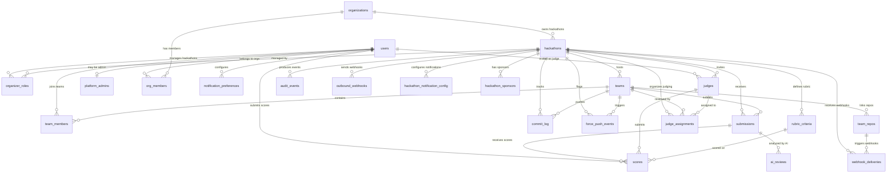
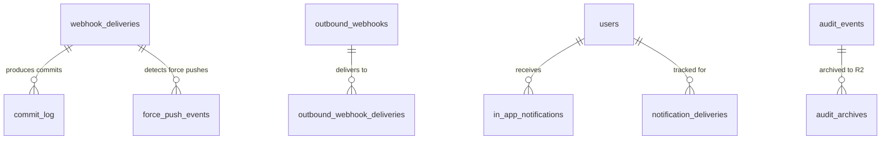
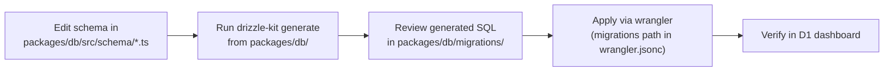
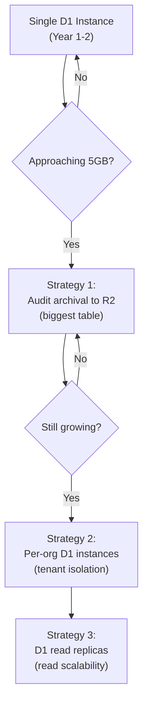

# Data Model & Schema

> Complete relational schema for the DevSage platform — 40+ tables across 10 domains in Cloudflare D1 (SQLite) via Drizzle ORM, with UUID primary keys, ISO-8601 timestamps, full ERD, indexing strategy, storage projections, migration approach, and partitioning plan for multi-tenant scale.

---

## Table of Contents

- [Design Goals](#design-goals)
- [1. Schema Overview](#1-schema-overview)
- [2. Entity Relationship Diagram](#2-entity-relationship-diagram)
- [3. Conventions](#3-conventions)
- [4. Identity & Access Tables](#4-identity--access-tables)
- [5. Organization Tables](#5-organization-tables)
- [6. Hackathon Lifecycle Tables](#6-hackathon-lifecycle-tables)
- [7. Team & Participation Tables](#7-team--participation-tables)
- [8. Submission & Activity Tables](#8-submission--activity-tables)
- [9. Judging Tables](#9-judging-tables)
- [10. Webhook & Integration Tables](#10-webhook--integration-tables)
- [11. Notification Tables](#11-notification-tables)
- [12. Audit & Compliance Tables](#12-audit--compliance-tables)
- [13. Indexing Strategy](#13-indexing-strategy)
- [14. Storage Projections](#14-storage-projections)
- [15. Migration Strategy](#15-migration-strategy)
- [16. Partitioning & Scale](#16-partitioning--scale)
- [17. Decision Log](#17-decision-log)

---

## Design Goals

| Goal | Description |
|------|-------------|
| Single D1 database | All tables in one Cloudflare D1 instance. SQLite engine, accessed via Drizzle ORM |
| Multi-tenant by design | Every hackathon-scoped table includes `hackathon_id`. Queries are always scoped |
| UUID primary keys | All PKs are TEXT UUIDs via `crypto.randomUUID()`. No auto-increment integers for primary keys |
| ISO-8601 timestamps | All temporal columns are TEXT in ISO-8601 UTC format (`new Date().toISOString()`) |
| Referential integrity | Foreign keys with ON DELETE CASCADE on child tables. No orphaned records |
| Append-only where needed | `audit_events`, `commit_log`, `scores`, `ai_reviews` are write-once. No updates allowed |
| JSON for flexibility | Structured but variable data stored as TEXT with JSON serialization |
| Migration-friendly | Drizzle ORM schema definitions generate SQL migrations. Forward-only, no rollbacks |
| Storage-conscious | D1 free tier is 5 GB. Schema designed to stay well under limit at target scale |

---

## 1. Schema Overview

~37 tables organized into 10 domains:

| Domain | Tables | Purpose |
|--------|--------|---------|
| Identity & Access | 4 | Users, platform admins, organizer invites, sessions |
| Organizations | 2 | Orgs, org members |
| Hackathon Lifecycle | 4 | Hackathons, hackathon config, templates, sponsors |
| Teams & Participation | 3 | Teams, team members, team repos |
| Submissions & Activity | 3 | Submissions, commit log, force push events |
| Judging | 5 | Judges, rubric criteria, judge assignments, scores, AI reviews |
| Roles & Permissions | 1 | Organizer roles |
| Webhooks & Integrations | 4 | Webhook deliveries, outbound webhooks, outbound deliveries, pending installations |
| Notifications | 3 | In-app notifications, delivery records, preferences |
| Audit & Compliance | 3 | Audit events, audit archives, audit anonymizations |

**Total: ~37 core tables** (plus 2–3 idempotency/config tables).

---

## 2. Entity Relationship Diagram

### Core Domain Relationships



### Webhook & Notification Relationships



---

## 3. Conventions

| Convention | Rule | Example |
|------------|------|---------|
| Primary keys | TEXT UUID via `crypto.randomUUID()` | `"f47ac10b-58cc-4372-a567-0e02b2c3d479"` |
| Timestamps | TEXT ISO-8601 UTC | `"2026-03-15T14:30:00.000Z"` |
| Column names | `snake_case` in SQL | `hackathon_id`, `created_at` |
| Drizzle refs | `camelCase` in TypeScript | `hackathonId`, `createdAt` |
| Booleans | INTEGER `0`/`1` (SQLite has no native bool) | `is_final INTEGER NOT NULL DEFAULT 0` |
| JSON fields | TEXT with `JSON.stringify()`/`JSON.parse()` | `details TEXT NOT NULL DEFAULT '{}'` |
| Foreign keys | ON DELETE CASCADE on child tables | `FK → hackathons.id ON DELETE CASCADE` |
| Unique constraints | Named, documented | `UNIQUE(hackathon_id, user_id)` |
| Indexes | Explicit, covering common query patterns | `INDEX(hackathon_id, created_at)` |
| Enums | TEXT with CHECK constraints | `CHECK(status IN ('pending','active'))` |
| Null semantics | NULL = absent/unknown, never empty string | `email TEXT` (nullable) vs `name TEXT NOT NULL` |
| Migrations | Forward-only via `drizzle-kit generate` | No rollback migrations |
| Soft deletes | NOT used — hard delete with CASCADE | Exception: audit_events (append-only) |

---

## 4. Identity & Access Tables

### `users`

Core user identity. One row per authenticated person.

| Column | Type | Constraints | Description |
|--------|------|-------------|-------------|
| `id` | TEXT | PK, UUID | Unique user ID |
| `github_id` | INTEGER | UNIQUE, NOT NULL | GitHub user ID (primary identity) |
| `google_id` | TEXT | UNIQUE | Google user ID (for account linking) |
| `github_username` | TEXT | NOT NULL | GitHub login handle |
| `display_name` | TEXT | NOT NULL | Display name from OAuth |
| `email` | TEXT | | Email from OAuth profile |
| `avatar_url` | TEXT | | Avatar URL from OAuth |
| `email_verified` | INTEGER | NOT NULL, DEFAULT 0 | Whether email has been verified |
| `email_bounced` | INTEGER | NOT NULL, DEFAULT 0 | Whether email delivery has failed |
| `suspended` | INTEGER | NOT NULL, DEFAULT 0 | Account suspension flag |
| `suspended_at` | TEXT | | When suspended |
| `suspended_reason` | TEXT | | Why suspended |
| `last_login_at` | TEXT | | Last successful login |
| `created_at` | TEXT | NOT NULL, DEFAULT CURRENT_TIMESTAMP | ISO-8601 |
| `updated_at` | TEXT | NOT NULL, DEFAULT CURRENT_TIMESTAMP | ISO-8601 |

**Indexes:** UNIQUE(`github_id`), UNIQUE(`google_id`), INDEX(`email`)

---

### `refresh_tokens`

Refresh tokens for the dual-token auth architecture.

| Column | Type | Constraints | Description |
|--------|------|-------------|-------------|
| `id` | TEXT | PK, UUID | Unique token record ID |
| `user_id` | TEXT | FK → users.id, NOT NULL, ON DELETE CASCADE | Token owner |
| `token_hash` | TEXT | UNIQUE, NOT NULL | SHA-256 of the refresh token |
| `family_id` | TEXT | NOT NULL | Token family for rotation detection |
| `expires_at` | TEXT | NOT NULL | ISO-8601 expiry |
| `revoked` | INTEGER | NOT NULL, DEFAULT 0 | Whether revoked |
| `revoked_at` | TEXT | | When revoked |
| `replaced_by` | TEXT | | ID of the token that replaced this one |
| `ip_address` | TEXT | | IP at token creation |
| `user_agent` | TEXT | | Browser at token creation |
| `created_at` | TEXT | NOT NULL, DEFAULT CURRENT_TIMESTAMP | ISO-8601 |

**Indexes:** UNIQUE(`token_hash`), INDEX(`user_id`), INDEX(`family_id`), INDEX(`expires_at`)

---

### `platform_admins`

Global platform administrators (separate from per-hackathon roles).

| Column | Type | Constraints | Description |
|--------|------|-------------|-------------|
| `id` | TEXT | PK, UUID | Unique row ID |
| `user_id` | TEXT | FK → users.id, UNIQUE, NOT NULL | Which user |
| `role` | TEXT | NOT NULL, DEFAULT 'platform_admin' | Platform role (single level) |
| `created_by` | TEXT | FK → users.id, NULL | Who added (null for seed) |
| `created_at` | TEXT | NOT NULL, DEFAULT CURRENT_TIMESTAMP | ISO-8601 |

**Indexes:** UNIQUE(`user_id`)

---

### `organizer_invites`

Invitations for new organizers, managed by platform admins.

| Column | Type | Constraints | Description |
|--------|------|-------------|-------------|
| `id` | TEXT | PK, UUID | Unique invite ID |
| `code` | TEXT | UNIQUE, NOT NULL | 32-char URL-safe random code |
| `email` | TEXT | NOT NULL | Invitee's email |
| `org_id` | TEXT | FK → organizations.id, NULL | Optional org association |
| `message` | TEXT | | Personal message from admin |
| `status` | TEXT | NOT NULL, DEFAULT 'pending' | pending, accepted, expired, revoked |
| `expires_at` | TEXT | NOT NULL | ISO-8601 expiry (default +14 days) |
| `created_by` | TEXT | FK → users.id, NOT NULL | Platform admin who created |
| `accepted_by` | TEXT | FK → users.id, NULL | User who accepted |
| `accepted_at` | TEXT | | When accepted |
| `created_at` | TEXT | NOT NULL, DEFAULT CURRENT_TIMESTAMP | ISO-8601 |

**Indexes:** UNIQUE(`code`), INDEX(`email`, `status`), INDEX(`status`)

---

## 5. Organization Tables

### `organizations`

Organization entities that own hackathons.

| Column | Type | Constraints | Description |
|--------|------|-------------|-------------|
| `id` | TEXT | PK, UUID | Unique org ID |
| `name` | TEXT | NOT NULL | Display name |
| `slug` | TEXT | UNIQUE, NOT NULL | URL-safe identifier |
| `description` | TEXT | NOT NULL, DEFAULT '' | Org description |
| `logo_url` | TEXT | | R2 URL to org logo |
| `website` | TEXT | | Org website URL |
| `settings` | TEXT | NOT NULL, DEFAULT '{}' | JSON org settings |
| `created_by` | TEXT | FK → users.id, NOT NULL | Creator |
| `created_at` | TEXT | NOT NULL, DEFAULT CURRENT_TIMESTAMP | ISO-8601 |
| `updated_at` | TEXT | NOT NULL, DEFAULT CURRENT_TIMESTAMP | ISO-8601 |

**Indexes:** UNIQUE(`slug`)

---

### `org_members`

Organization membership and roles.

| Column | Type | Constraints | Description |
|--------|------|-------------|-------------|
| `id` | TEXT | PK, UUID | Unique row ID |
| `org_id` | TEXT | FK → organizations.id, NOT NULL, ON DELETE CASCADE | Which org |
| `user_id` | TEXT | FK → users.id, NOT NULL | Which user |
| `role` | TEXT | NOT NULL, CHECK IN ('org_owner','org_admin','org_member') | Org-level role |
| `invited_by` | TEXT | FK → users.id, NULL | Who invited |
| `created_at` | TEXT | NOT NULL, DEFAULT CURRENT_TIMESTAMP | ISO-8601 |
| `updated_at` | TEXT | NOT NULL, DEFAULT CURRENT_TIMESTAMP | ISO-8601 |

**Indexes:** UNIQUE(`org_id`, `user_id`), INDEX(`user_id`)

---

## 6. Hackathon Lifecycle Tables

### `hackathons`

Core hackathon entity with all configuration.

| Column | Type | Constraints | Description |
|--------|------|-------------|-------------|
| `id` | TEXT | PK, UUID | Unique hackathon ID |
| `org_id` | TEXT | FK → organizations.id, NULL | Owning org (null if no org) |
| `slug` | TEXT | UNIQUE, NOT NULL | URL-safe identifier |
| `title` | TEXT | NOT NULL | Display name |
| `tagline` | TEXT | | Short tagline |
| `description` | TEXT | | Markdown description |
| `rules_md` | TEXT | | Competition rules (Markdown) |
| `status` | TEXT | NOT NULL, DEFAULT 'draft' | CHECK IN ('draft','registration','hacking','submission','judging','completed','archived') |
| `hacking_starts` | TEXT | | ISO-8601 |
| `submission_deadline` | TEXT | NOT NULL | ISO-8601 |
| `judging_starts` | TEXT | | ISO-8601 |
| `judging_ends` | TEXT | | ISO-8601 |
| `min_team_size` | INTEGER | NOT NULL, DEFAULT 1 | Minimum team members |
| `max_team_size` | INTEGER | NOT NULL, DEFAULT 5 | Maximum team members |
| `max_teams` | INTEGER | | NULL = unlimited |
| `submission_tag_pattern` | TEXT | NOT NULL, DEFAULT '^submission_v\\d+$' | Regex for submission tags |
| `max_submissions_per_team` | INTEGER | | NULL = unlimited |
| `allow_late_submissions` | INTEGER | NOT NULL, DEFAULT 0 | Boolean |
| `require_repo` | INTEGER | NOT NULL, DEFAULT 1 | Team must link a repo |
| `timezone` | TEXT | NOT NULL, DEFAULT 'UTC' | IANA timezone |
| `template_id` | TEXT | FK → hackathon_templates.id, NULL | Cloned from template |
| `tracks` | TEXT | NOT NULL, DEFAULT '[]' | JSON array of track definitions |
| `prizes` | TEXT | NOT NULL, DEFAULT '[]' | JSON array of prize definitions |
| `settings` | TEXT | NOT NULL, DEFAULT '{}' | JSON extensible settings blob |
| `created_by` | TEXT | FK → users.id, NOT NULL | Owner/creator |
| `created_at` | TEXT | NOT NULL, DEFAULT CURRENT_TIMESTAMP | ISO-8601 |
| `updated_at` | TEXT | NOT NULL, DEFAULT CURRENT_TIMESTAMP | ISO-8601 |

**Indexes:** UNIQUE(`slug`), INDEX(`org_id`), INDEX(`status`), INDEX(`created_by`)

---

### `hackathon_templates`

Reusable hackathon configuration templates.

| Column | Type | Constraints | Description |
|--------|------|-------------|-------------|
| `id` | TEXT | PK, UUID | Template ID |
| `org_id` | TEXT | FK → organizations.id, NULL | Org scope (null = global) |
| `name` | TEXT | NOT NULL | Template name |
| `description` | TEXT | NOT NULL, DEFAULT '' | What this template is for |
| `config_snapshot` | TEXT | NOT NULL | JSON snapshot of hackathon config fields |
| `rubric_snapshot` | TEXT | NOT NULL, DEFAULT '[]' | JSON snapshot of rubric criteria |
| `created_by` | TEXT | FK → users.id, NOT NULL | Who created |
| `created_at` | TEXT | NOT NULL, DEFAULT CURRENT_TIMESTAMP | ISO-8601 |
| `updated_at` | TEXT | NOT NULL, DEFAULT CURRENT_TIMESTAMP | ISO-8601 |

**Indexes:** INDEX(`org_id`), INDEX(`created_by`)

---

### `hackathon_sponsors`

Sponsor entries managed by organizers per hackathon.

| Column | Type | Constraints | Description |
|--------|------|-------------|-------------|
| `id` | TEXT | PK, UUID | Unique sponsor entry ID |
| `hackathon_id` | TEXT | FK → hackathons.id, NOT NULL, ON DELETE CASCADE | Which hackathon |
| `name` | TEXT | NOT NULL | Sponsor name |
| `tier` | TEXT | NOT NULL, DEFAULT 'standard' | e.g., platinum, gold, silver, standard |
| `logo_r2_key` | TEXT | | R2 key for sponsor logo |
| `website` | TEXT | | Sponsor website URL |
| `description` | TEXT | NOT NULL, DEFAULT '' | Short description |
| `sort_order` | INTEGER | NOT NULL, DEFAULT 0 | Display order within tier |
| `created_by` | TEXT | FK → users.id, NOT NULL | Organizer who added |
| `created_at` | TEXT | NOT NULL, DEFAULT CURRENT_TIMESTAMP | ISO-8601 |
| `updated_at` | TEXT | NOT NULL, DEFAULT CURRENT_TIMESTAMP | ISO-8601 |

**Indexes:** INDEX(`hackathon_id`, `tier`, `sort_order`), UNIQUE(`hackathon_id`, `name`)

---

## 7. Team & Participation Tables

### `teams`

Team entities within a hackathon.

| Column | Type | Constraints | Description |
|--------|------|-------------|-------------|
| `id` | TEXT | PK, UUID | Unique team ID |
| `hackathon_id` | TEXT | FK → hackathons.id, NOT NULL, ON DELETE CASCADE | Which hackathon |
| `name` | TEXT | NOT NULL | 2–50 characters |
| `description` | TEXT | NOT NULL, DEFAULT '' | Team description |
| `invite_code` | TEXT | UNIQUE | 8-char join code |
| `track_id` | TEXT | | Track this team is competing in |
| `ready` | INTEGER | NOT NULL, DEFAULT 0 | Readiness status |
| `created_at` | TEXT | NOT NULL, DEFAULT CURRENT_TIMESTAMP | ISO-8601 |
| `updated_at` | TEXT | NOT NULL, DEFAULT CURRENT_TIMESTAMP | ISO-8601 |

**Indexes:** UNIQUE(`hackathon_id`, `name`), INDEX(`hackathon_id`), INDEX(`invite_code`)

---

### `team_members`

Team membership with roles.

| Column | Type | Constraints | Description |
|--------|------|-------------|-------------|
| `id` | TEXT | PK, UUID | Unique row ID |
| `team_id` | TEXT | FK → teams.id, NOT NULL, ON DELETE CASCADE | Which team |
| `user_id` | TEXT | FK → users.id, NOT NULL | Which user |
| `role` | TEXT | NOT NULL, DEFAULT 'member' | leader / member |
| `joined_at` | TEXT | NOT NULL, DEFAULT CURRENT_TIMESTAMP | ISO-8601 |

**Indexes:** UNIQUE(`team_id`, `user_id`), INDEX(`user_id`)

---

### `team_repos`

Repository links for teams (supports multiple repos and providers).

| Column | Type | Constraints | Description |
|--------|------|-------------|-------------|
| `id` | TEXT | PK, UUID | Unique row ID |
| `team_id` | TEXT | FK → teams.id, NOT NULL, ON DELETE CASCADE | Which team |
| `hackathon_id` | TEXT | FK → hackathons.id, NOT NULL | Denormalized for query efficiency |
| `provider` | TEXT | NOT NULL, CHECK IN ('github','gitlab','bitbucket') | VCS provider |
| `repo_full_name` | TEXT | NOT NULL | "owner/repo" |
| `repo_url` | TEXT | NOT NULL | HTTPS URL to repo |
| `installation_id` | TEXT | | Provider's app installation ID |
| `bot_active` | INTEGER | NOT NULL, DEFAULT 0 | Whether webhook bot is active |
| `is_primary` | INTEGER | NOT NULL, DEFAULT 1 | Primary repo for submissions |
| `access_token_encrypted` | TEXT | | Encrypted provider access token (GitLab/BB) |
| `created_at` | TEXT | NOT NULL, DEFAULT CURRENT_TIMESTAMP | ISO-8601 |

**Indexes:** UNIQUE(`hackathon_id`, `repo_full_name`), INDEX(`team_id`), INDEX(`repo_full_name`), INDEX(`hackathon_id`, `bot_active`)

---

## 8. Submission & Activity Tables

### `submissions`

Tag-based submission records. Immutable after creation (status transitions only).

| Column | Type | Constraints | Description |
|--------|------|-------------|-------------|
| `id` | TEXT | PK, UUID | Unique submission ID |
| `team_id` | TEXT | FK → teams.id, NOT NULL, ON DELETE CASCADE | Submitting team |
| `hackathon_id` | TEXT | FK → hackathons.id, NOT NULL, ON DELETE CASCADE | Which hackathon |
| `tag_name` | TEXT | NOT NULL | e.g., "submission_v1" |
| `commit_sha` | TEXT | NOT NULL | Pinned commit SHA |
| `commit_message` | TEXT | | Truncated to 500 chars |
| `commit_author` | TEXT | | Truncated to 100 chars |
| `branch` | TEXT | DEFAULT 'main' | Branch the tag was on |
| `provider` | TEXT | NOT NULL, DEFAULT 'github' | VCS provider |
| `repo_full_name` | TEXT | NOT NULL | Repo that produced this submission |
| `version` | INTEGER | NOT NULL | 1, 2, 3... |
| `status` | TEXT | NOT NULL, DEFAULT 'received' | received, validated, validation_failed, locked, under_review, scored, invalid |
| `is_late` | INTEGER | NOT NULL, DEFAULT 0 | Past deadline |
| `is_final` | INTEGER | NOT NULL, DEFAULT 0 | Marked as final by team leader |
| `validation_results` | TEXT | | JSON validation check results |
| `locked_at` | TEXT | | When DO locked submission |
| `finalized_at` | TEXT | | When team leader finalized |
| `submitted_at` | TEXT | NOT NULL | From VCS event timestamp |
| `received_at` | TEXT | NOT NULL | Server receive time |
| `webhook_delivery_id` | TEXT | UNIQUE | Idempotency key from webhook |

**Indexes:** UNIQUE(`team_id`, `tag_name`), UNIQUE(`webhook_delivery_id`), INDEX(`hackathon_id`, `status`), INDEX(`team_id`), INDEX(`hackathon_id`, `is_final`)

---

### `commit_log`

Append-only log of commits from push events.

| Column | Type | Constraints | Description |
|--------|------|-------------|-------------|
| `id` | TEXT | PK, UUID | Unique commit record ID |
| `hackathon_id` | TEXT | FK → hackathons.id, NOT NULL | Which hackathon |
| `team_id` | TEXT | FK → teams.id, NOT NULL | Which team |
| `delivery_id` | TEXT | FK → webhook_deliveries.id | Source webhook delivery |
| `sha` | TEXT | NOT NULL | Full commit SHA |
| `message` | TEXT | NOT NULL | Commit message (truncated 500 chars) |
| `author_name` | TEXT | NOT NULL | Git author name |
| `author_email` | TEXT | NOT NULL | Git author email |
| `committed_at` | TEXT | NOT NULL | Commit timestamp |
| `url` | TEXT | NOT NULL | Link to commit on VCS provider |
| `branch` | TEXT | NOT NULL | Branch name |
| `files_added` | INTEGER | NOT NULL, DEFAULT 0 | Files added count |
| `files_modified` | INTEGER | NOT NULL, DEFAULT 0 | Files modified count |
| `files_removed` | INTEGER | NOT NULL, DEFAULT 0 | Files removed count |
| `provider` | TEXT | NOT NULL, DEFAULT 'github' | VCS provider |
| `created_at` | TEXT | NOT NULL, DEFAULT CURRENT_TIMESTAMP | ISO-8601 |

**Indexes:** INDEX(`hackathon_id`, `team_id`, `committed_at`), INDEX(`sha`), INDEX(`delivery_id`)

---

### `force_push_events`

Force push detections with organizer resolution.

| Column | Type | Constraints | Description |
|--------|------|-------------|-------------|
| `id` | TEXT | PK, UUID | Unique event ID |
| `hackathon_id` | TEXT | FK → hackathons.id, NOT NULL | Which hackathon |
| `team_id` | TEXT | FK → teams.id, NOT NULL | Which team |
| `delivery_id` | TEXT | FK → webhook_deliveries.id | Source webhook |
| `repo_full_name` | TEXT | NOT NULL | Repository |
| `branch` | TEXT | NOT NULL | Branch force-pushed |
| `before_sha` | TEXT | NOT NULL | Previous HEAD |
| `after_sha` | TEXT | NOT NULL | New HEAD |
| `estimated_lost_commits` | INTEGER | NOT NULL, DEFAULT 0 | Estimated commits lost |
| `severity` | TEXT | NOT NULL, DEFAULT 'info' | info, warning, critical |
| `affected_submission_ids` | TEXT | NOT NULL, DEFAULT '[]' | JSON array |
| `resolved` | INTEGER | NOT NULL, DEFAULT 0 | 0 = unresolved |
| `resolved_by` | TEXT | FK → users.id, NULL | Organizer who reviewed |
| `resolved_at` | TEXT | | When reviewed |
| `resolution_note` | TEXT | | Organizer's notes |
| `provider` | TEXT | NOT NULL, DEFAULT 'github' | VCS provider |
| `pusher_login` | TEXT | NOT NULL | Who force-pushed |
| `created_at` | TEXT | NOT NULL, DEFAULT CURRENT_TIMESTAMP | ISO-8601 |

**Indexes:** INDEX(`hackathon_id`, `created_at`), INDEX(`team_id`), INDEX(`resolved`)

---

## 9. Judging Tables

### `judges`

Judge invitations and acceptance status.

| Column | Type | Constraints | Description |
|--------|------|-------------|-------------|
| `id` | TEXT | PK, UUID | Unique judge record ID |
| `hackathon_id` | TEXT | FK → hackathons.id, NOT NULL, ON DELETE CASCADE | Which hackathon |
| `user_id` | TEXT | FK → users.id, NOT NULL | Invited user |
| `invite_status` | TEXT | NOT NULL, DEFAULT 'pending' | pending, accepted, declined |
| `track_id` | TEXT | | Track specialization (null = all tracks) |
| `invited_by` | TEXT | FK → users.id, NOT NULL | Who invited |
| `invited_at` | TEXT | NOT NULL, DEFAULT CURRENT_TIMESTAMP | ISO-8601 |
| `responded_at` | TEXT | | When accepted/declined |

**Indexes:** UNIQUE(`hackathon_id`, `user_id`), INDEX(`user_id`)

---

### `rubric_criteria`

Scoring rubric definition per hackathon.

| Column | Type | Constraints | Description |
|--------|------|-------------|-------------|
| `id` | TEXT | PK, UUID | Unique criteria ID |
| `hackathon_id` | TEXT | FK → hackathons.id, NOT NULL, ON DELETE CASCADE | Which hackathon |
| `track_id` | TEXT | | Track-specific criteria (null = global) |
| `round` | INTEGER | NOT NULL, DEFAULT 1 | Which judging round |
| `name` | TEXT | NOT NULL | e.g., "Innovation" |
| `description` | TEXT | NOT NULL, DEFAULT '' | Guidance for judges |
| `max_score` | INTEGER | NOT NULL, DEFAULT 10 | Maximum score value |
| `weight` | REAL | NOT NULL, DEFAULT 1.0 | Weight for weighted average |
| `sort_order` | INTEGER | NOT NULL, DEFAULT 0 | Display order |
| `created_at` | TEXT | NOT NULL, DEFAULT CURRENT_TIMESTAMP | ISO-8601 |

**Indexes:** UNIQUE(`hackathon_id`, `name`, `track_id`, `round`), INDEX(`hackathon_id`, `round`)

---

### `judge_assignments`

Which judges are assigned to which teams.

| Column | Type | Constraints | Description |
|--------|------|-------------|-------------|
| `id` | TEXT | PK, UUID | Unique assignment ID |
| `hackathon_id` | TEXT | FK → hackathons.id, NOT NULL, ON DELETE CASCADE | Which hackathon |
| `judge_id` | TEXT | FK → judges.id, NOT NULL, ON DELETE CASCADE | Which judge |
| `team_id` | TEXT | FK → teams.id, NOT NULL, ON DELETE CASCADE | Which team |
| `submission_id` | TEXT | FK → submissions.id, NULL | Pinned submission (set at assignment) |
| `round` | INTEGER | NOT NULL, DEFAULT 1 | Which judging round |
| `status` | TEXT | NOT NULL, DEFAULT 'pending' | pending, in_progress, completed |
| `assigned_at` | TEXT | NOT NULL, DEFAULT CURRENT_TIMESTAMP | ISO-8601 |
| `completed_at` | TEXT | | When all criteria scored |

**Indexes:** UNIQUE(`judge_id`, `team_id`, `round`), INDEX(`hackathon_id`, `round`, `status`), INDEX(`judge_id`, `status`)

---

### `scores`

Write-once scoring records. No updates after creation.

| Column | Type | Constraints | Description |
|--------|------|-------------|-------------|
| `id` | TEXT | PK, UUID | Unique score ID |
| `submission_id` | TEXT | FK → submissions.id, NOT NULL | Scored submission |
| `judge_id` | TEXT | FK → judges.id, NOT NULL | Scoring judge |
| `criteria_id` | TEXT | FK → rubric_criteria.id, NOT NULL | Which rubric criteria |
| `assignment_id` | TEXT | FK → judge_assignments.id, NOT NULL | Parent assignment |
| `score` | INTEGER | NOT NULL, CHECK(score >= 0) | Score value |
| `comment` | TEXT | | Optional remark |
| `round` | INTEGER | NOT NULL, DEFAULT 1 | Which round |
| `scored_at` | TEXT | NOT NULL, DEFAULT CURRENT_TIMESTAMP | ISO-8601 |

**Indexes:** UNIQUE(`submission_id`, `judge_id`, `criteria_id`, `round`), INDEX(`submission_id`), INDEX(`judge_id`)

---

### `ai_reviews`

AI-generated code reviews. Append-only.

| Column | Type | Constraints | Description |
|--------|------|-------------|-------------|
| `id` | TEXT | PK, UUID | Unique review ID |
| `submission_id` | TEXT | FK → submissions.id, NOT NULL | Reviewed submission |
| `commit_sha` | TEXT | NOT NULL | Pinned to exact commit |
| `provider` | TEXT | NOT NULL | AI provider (e.g., "openai") |
| `model` | TEXT | NOT NULL | Model identifier (e.g., "gpt-4o") |
| `prompt_hash` | TEXT | NOT NULL | SHA-256 of full prompt |
| `prompt_template_version` | TEXT | NOT NULL | Prompt template version |
| `summary` | TEXT | | Executive summary |
| `strengths` | TEXT | | JSON array |
| `concerns` | TEXT | | JSON array |
| `raw_response` | TEXT | | Full response for audit |
| `tokens_used` | INTEGER | | Total tokens consumed |
| `latency_ms` | INTEGER | | Response time |
| `created_at` | TEXT | NOT NULL, DEFAULT CURRENT_TIMESTAMP | ISO-8601 |

**Indexes:** INDEX(`submission_id`), INDEX(`commit_sha`)

---

## 10. Webhook & Integration Tables

### `webhook_deliveries`

Tracks every inbound webhook from VCS providers.

| Column | Type | Constraints | Description |
|--------|------|-------------|-------------|
| `id` | TEXT | PK, UUID | Internal delivery ID |
| `delivery_id` | TEXT | UNIQUE, NOT NULL | Provider's delivery ID (idempotency key) |
| `provider` | TEXT | NOT NULL | github, gitlab, bitbucket |
| `event_type` | TEXT | NOT NULL | Normalized event type |
| `status` | TEXT | NOT NULL, DEFAULT 'received' | received, processing, processed, failed, dead_lettered |
| `repo_full_name` | TEXT | NOT NULL | Repository identifier |
| `hackathon_id` | TEXT | FK → hackathons.id, NULL | Resolved hackathon |
| `team_id` | TEXT | FK → teams.id, NULL | Resolved team |
| `payload_hash` | TEXT | NOT NULL | SHA-256 of raw payload |
| `error_message` | TEXT | | Error if failed |
| `processing_ms` | INTEGER | | Processing duration |
| `attempts` | INTEGER | NOT NULL, DEFAULT 0 | Processing attempts |
| `received_at` | TEXT | NOT NULL | ISO-8601 |
| `processed_at` | TEXT | | ISO-8601 |

**Indexes:** UNIQUE(`delivery_id`), INDEX(`hackathon_id`, `received_at`), INDEX(`status`), INDEX(`repo_full_name`)

---

### `outbound_webhooks`

Organizer-configured webhook endpoints.

| Column | Type | Constraints | Description |
|--------|------|-------------|-------------|
| `id` | TEXT | PK, UUID | Webhook ID |
| `hackathon_id` | TEXT | FK → hackathons.id, NOT NULL | Which hackathon |
| `url` | TEXT | NOT NULL | HTTPS endpoint |
| `secret_hash` | TEXT | NOT NULL | SHA-256 of signing secret |
| `events` | TEXT | NOT NULL | JSON array of event patterns |
| `active` | INTEGER | NOT NULL, DEFAULT 1 | Enabled flag |
| `description` | TEXT | NOT NULL, DEFAULT '' | Human label |
| `consecutive_failures` | INTEGER | NOT NULL, DEFAULT 0 | Failure counter |
| `created_by` | TEXT | FK → users.id, NOT NULL | Creator |
| `created_at` | TEXT | NOT NULL, DEFAULT CURRENT_TIMESTAMP | ISO-8601 |
| `updated_at` | TEXT | NOT NULL, DEFAULT CURRENT_TIMESTAMP | ISO-8601 |
| `disabled_at` | TEXT | | Auto-disable timestamp |

**Indexes:** INDEX(`hackathon_id`, `active`)

---

### `outbound_webhook_deliveries`

Delivery tracking for outbound webhooks.

| Column | Type | Constraints | Description |
|--------|------|-------------|-------------|
| `id` | TEXT | PK, UUID | Delivery ID |
| `webhook_id` | TEXT | FK → outbound_webhooks.id, NOT NULL, ON DELETE CASCADE | Which webhook |
| `event_id` | TEXT | NOT NULL | Internal event ID |
| `event_type` | TEXT | NOT NULL | Event type |
| `status` | TEXT | NOT NULL, DEFAULT 'pending' | pending, delivered, failed, dead_lettered |
| `http_status` | INTEGER | | Response status code |
| `response_ms` | INTEGER | | Response time |
| `error_message` | TEXT | | Error if failed |
| `attempts` | INTEGER | NOT NULL, DEFAULT 0 | Delivery attempts |
| `next_retry_at` | TEXT | | Next retry time |
| `created_at` | TEXT | NOT NULL, DEFAULT CURRENT_TIMESTAMP | ISO-8601 |
| `delivered_at` | TEXT | | When delivered |

**Indexes:** UNIQUE(`webhook_id`, `event_id`), INDEX(`webhook_id`, `status`), INDEX(`next_retry_at`)

---

### `pending_installations`

VCS app installations for repos not yet linked to teams.

| Column | Type | Constraints | Description |
|--------|------|-------------|-------------|
| `id` | TEXT | PK, UUID | Record ID |
| `provider` | TEXT | NOT NULL | VCS provider |
| `repo_full_name` | TEXT | NOT NULL | Repository |
| `installation_id` | TEXT | NOT NULL | Provider installation ID |
| `installed_by` | TEXT | NOT NULL | Username |
| `created_at` | TEXT | NOT NULL, DEFAULT CURRENT_TIMESTAMP | ISO-8601 |

**Indexes:** UNIQUE(`provider`, `repo_full_name`)

---

## 11. Notification Tables

### `in_app_notifications`

In-app notification storage.

| Column | Type | Constraints | Description |
|--------|------|-------------|-------------|
| `id` | TEXT | PK, UUID | Notification ID |
| `user_id` | TEXT | FK → users.id, NOT NULL | Recipient |
| `hackathon_id` | TEXT | FK → hackathons.id, NULL | Context hackathon |
| `type` | TEXT | NOT NULL | Notification type |
| `title` | TEXT | NOT NULL | Short title |
| `body` | TEXT | NOT NULL | Description |
| `icon` | TEXT | NOT NULL, DEFAULT 'info' | Icon identifier |
| `action_url` | TEXT | | Deep link |
| `action_label` | TEXT | | CTA button text |
| `metadata` | TEXT | NOT NULL, DEFAULT '{}' | JSON data |
| `read` | INTEGER | NOT NULL, DEFAULT 0 | Read flag |
| `read_at` | TEXT | | When read |
| `created_at` | TEXT | NOT NULL, DEFAULT CURRENT_TIMESTAMP | ISO-8601 |

**Indexes:** INDEX(`user_id`, `read`, `created_at` DESC), INDEX(`user_id`, `hackathon_id`), INDEX(`created_at`)

---

### `notification_deliveries`

Delivery tracking across all channels.

| Column | Type | Constraints | Description |
|--------|------|-------------|-------------|
| `id` | TEXT | PK, UUID | Delivery ID |
| `event_id` | TEXT | NOT NULL | Triggering event ID |
| `user_id` | TEXT | FK → users.id, NOT NULL | Recipient |
| `channel` | TEXT | NOT NULL | email, in_app, push, slack, discord |
| `notification_type` | TEXT | NOT NULL | Notification type |
| `status` | TEXT | NOT NULL, DEFAULT 'pending' | pending, delivered, failed, permanent_failure, dead_lettered |
| `error_message` | TEXT | | Error details |
| `attempts` | INTEGER | NOT NULL, DEFAULT 0 | Delivery attempts |
| `delivered_at` | TEXT | | When delivered |
| `created_at` | TEXT | NOT NULL, DEFAULT CURRENT_TIMESTAMP | ISO-8601 |

**Indexes:** UNIQUE(`event_id`, `user_id`, `channel`), INDEX(`user_id`, `created_at`), INDEX(`status`)

---

### `notification_preferences`

Per-user notification preferences.

| Column | Type | Constraints | Description |
|--------|------|-------------|-------------|
| `id` | TEXT | PK, UUID | Row ID |
| `user_id` | TEXT | FK → users.id, UNIQUE, NOT NULL | Which user |
| `channels` | TEXT | NOT NULL, DEFAULT '{}' | JSON per-type channel overrides |
| `global_settings` | TEXT | NOT NULL, DEFAULT '{}' | JSON quiet hours, digest config |
| `updated_at` | TEXT | NOT NULL, DEFAULT CURRENT_TIMESTAMP | ISO-8601 |

**Indexes:** UNIQUE(`user_id`)

---

### `hackathon_notification_config`

Per-hackathon notification settings.

| Column | Type | Constraints | Description |
|--------|------|-------------|-------------|
| `id` | TEXT | PK, UUID | Config ID |
| `hackathon_id` | TEXT | FK → hackathons.id, UNIQUE, NOT NULL | Which hackathon |
| `email_from_name` | TEXT | | Custom "from" name |
| `email_reply_to` | TEXT | | Custom reply-to |
| `broadcast_cooldown_minutes` | INTEGER | NOT NULL, DEFAULT 12 | Broadcast rate limit |
| `created_at` | TEXT | NOT NULL, DEFAULT CURRENT_TIMESTAMP | ISO-8601 |
| `updated_at` | TEXT | NOT NULL, DEFAULT CURRENT_TIMESTAMP | ISO-8601 |

**Indexes:** UNIQUE(`hackathon_id`)

---

## 12. Audit & Compliance Tables

### `audit_events`

Append-only audit log. No UPDATE or DELETE.

| Column | Type | Constraints | Description |
|--------|------|-------------|-------------|
| `id` | TEXT | PK, UUID | Event ID |
| `sequence` | INTEGER | NOT NULL | Per-hackathon sequence |
| `hackathon_id` | TEXT | FK → hackathons.id, NULL | Scope (null = platform) |
| `actor_id` | TEXT | FK → users.id, NULL | Who (null for system/bot/cron) |
| `actor_type` | TEXT | NOT NULL | user, system, bot, cron |
| `actor_ip` | TEXT | | Request IP |
| `actor_user_agent` | TEXT | | User-Agent (max 256) |
| `action` | TEXT | NOT NULL | Dot-notation action |
| `entity_type` | TEXT | NOT NULL | Entity type |
| `entity_id` | TEXT | NOT NULL | Entity ID |
| `details` | TEXT | NOT NULL, DEFAULT '{}' | JSON details |
| `changes` | TEXT | | JSON ChangeSet (before/after) |
| `hash` | TEXT | NOT NULL | SHA-256 event hash |
| `prev_hash` | TEXT | | Previous hash in chain |
| `anonymized_at` | TEXT | | GDPR anonymization timestamp |
| `created_at` | TEXT | NOT NULL, DEFAULT CURRENT_TIMESTAMP | ISO-8601 |

**Indexes:** INDEX(`hackathon_id`, `created_at` DESC), INDEX(`hackathon_id`, `sequence` DESC), INDEX(`entity_type`, `entity_id`), INDEX(`actor_id`, `created_at` DESC), INDEX(`action`), INDEX(`created_at`)

---

### `audit_archives` — *Phase 2*

R2 archive tracking for cold-stored audit data. Added when Phase 2 audit archival is implemented.

| Column | Type | Constraints | Description |
|--------|------|-------------|-------------|
| `id` | TEXT | PK, UUID | Archive ID |
| `hackathon_id` | TEXT | NOT NULL | Which hackathon |
| `r2_key` | TEXT | NOT NULL | R2 object key |
| `events_count` | INTEGER | NOT NULL | Events in archive |
| `first_event_id` | TEXT | NOT NULL | First event |
| `last_event_id` | TEXT | NOT NULL | Last event |
| `first_sequence` | INTEGER | NOT NULL | Start sequence |
| `last_sequence` | INTEGER | NOT NULL | End sequence |
| `period_start` | TEXT | NOT NULL | Start of period |
| `period_end` | TEXT | NOT NULL | End of period |
| `checksum` | TEXT | NOT NULL | SHA-256 of file |
| `size_bytes` | INTEGER | NOT NULL | File size |
| `archived_at` | TEXT | NOT NULL, DEFAULT CURRENT_TIMESTAMP | ISO-8601 |

**Indexes:** INDEX(`hackathon_id`, `period_start`)

---

### `audit_anonymizations` — *Phase 2*

GDPR anonymization records. Added when Phase 2 anonymization is implemented.

| Column | Type | Constraints | Description |
|--------|------|-------------|-------------|
| `id` | TEXT | PK, UUID | Record ID |
| `original_user_id` | TEXT | NOT NULL | Original user ID |
| `pseudonymous_id` | TEXT | NOT NULL | Generated pseudonymous ID |
| `events_anonymized` | INTEGER | NOT NULL | Events affected |
| `fields_scrubbed` | TEXT | NOT NULL | JSON array of fields |
| `requested_at` | TEXT | NOT NULL | Deletion request time |
| `completed_at` | TEXT | NOT NULL, DEFAULT CURRENT_TIMESTAMP | Completion time |
| `performed_by` | TEXT | NOT NULL | 'user_self' or admin ID |

**Indexes:** INDEX(`original_user_id`), INDEX(`pseudonymous_id`)

---

## 12b. Analytics Tables

Analytics tables are stored in D1 alongside core tables. Full schema definitions are in [analytics.md](./analytics.md).

| Table | Phase | Purpose |
|-------|-------|---------|
| `analytics_aggregates` | Phase 1 | Pre-computed counters (total teams, submissions, etc.) for fast dashboard reads |
| `analytics_exports` | Phase 1 | Export job tracking and download URLs |
| `analytics_user_preferences` | Phase 1 | User consent preferences for engagement tracking |
| `analytics_scheduled_reports` | Phase 2 | Recurring export job configuration |

> **Note:** Raw analytics events are stored in Cloudflare Analytics Engine (not D1). Only aggregates and job metadata live in D1.

---

## 13. Indexing Strategy

### Index Design Principles

| Principle | Application |
|-----------|-------------|
| Composite indexes for common queries | `(hackathon_id, created_at)` covers most hackathon-scoped chronological queries |
| Unique constraints as indexes | `UNIQUE(hackathon_id, user_id)` serves both integrity and lookup |
| Cover the WHERE + ORDER BY | Indexes match query patterns to avoid full table scans |
| No over-indexing | Each index has an identified query pattern. No speculative indexes |
| Write-heavy tables get minimal indexes | `commit_log` and `audit_events` have few indexes to keep write throughput high |

### Index Count by Table

| Table | Indexes | Justification |
|-------|---------|---------------|
| `hackathons` | 4 | Slug lookup, org filter, status filter, creator lookup |
| `teams` | 4 | Name uniqueness, hackathon filter, invite code lookup, discovery |
| `submissions` | 5 | Tag uniqueness, webhook idempotency, status queries, final filter |
| `audit_events` | 6 | Hackathon+time, sequence, entity, actor, action, archival |
| `commit_log` | 3 | Team+time, SHA lookup, delivery link |
| `scores` | 3 | Uniqueness, submission lookup, judge lookup |
| All others | 1–3 | Primary queries only |

---

## 14. Storage Projections

### Target Scale: 10 hackathons, 2,000 users

| Table | Estimated Rows | Avg Row Size | Total Size |
|-------|---------------|-------------|------------|
| `users` | 2,000 | 400 B | ~800 KB |

| `refresh_tokens` | 4,000 | 250 B | ~1 MB |
| `organizations` | 10 | 500 B | ~5 KB |
| `org_members` | 50 | 200 B | ~10 KB |
| `hackathons` | 10 | 2 KB | ~20 KB |
| `hackathon_templates` | 5 | 5 KB | ~25 KB |
| `teams` | 500 | 300 B | ~150 KB |
| `team_members` | 2,000 | 200 B | ~400 KB |
| `team_repos` | 500 | 300 B | ~150 KB |
| `hackathon_sponsors` | 100 | 350 B | ~35 KB |
| `submissions` | 1,500 | 500 B | ~750 KB |
| `commit_log` | 50,000 | 350 B | ~17 MB |
| `force_push_events` | 100 | 400 B | ~40 KB |
| `judges` | 100 | 200 B | ~20 KB |
| `rubric_criteria` | 50 | 200 B | ~10 KB |
| `judge_assignments` | 1,500 | 200 B | ~300 KB |
| `scores` | 15,000 | 150 B | ~2.2 MB |
| `ai_reviews` | 1,500 | 2 KB | ~3 MB |
| `organizer_roles` | 50 | 200 B | ~10 KB |

| `platform_admins` | 5 | 150 B | ~1 KB |
| `organizer_invites` | 30 | 300 B | ~9 KB |

| `webhook_deliveries` | 60,000 | 300 B | ~18 MB |
| `outbound_webhooks` | 30 | 300 B | ~9 KB |
| `outbound_webhook_deliveries` | 10,000 | 250 B | ~2.5 MB |
| `pending_installations` | 20 | 200 B | ~4 KB |

| `in_app_notifications` | 50,000 | 300 B | ~15 MB |
| `notification_deliveries` | 100,000 | 200 B | ~20 MB |
| `notification_preferences` | 2,000 | 500 B | ~1 MB |

| `hackathon_notification_config` | 10 | 400 B | ~4 KB |
| `audit_events` | 200,000 | 400 B | ~80 MB |
| `audit_archives` | 20 | 300 B | ~6 KB |
| `audit_anonymizations` | 10 | 250 B | ~2.5 KB |
| **Total** | **~506,000** | | **~165 MB** |

### Growth Projections

| Scale | Users | Hackathons | Estimated D1 Size | D1 Limit |
|-------|-------|------------|-------------------|----------|
| MVP (current) | 500 | 3 | ~40 MB | 5 GB |
| Year 1 | 2,000 | 10 | ~165 MB | 5 GB |
| Year 2 | 10,000 | 50 | ~800 MB | 5 GB |
| Year 3 | 50,000 | 200 | ~3.5 GB | 5 GB (approaching limit) |

At Year 3 scale, audit archival (moving events older than 12 months to R2) and notification cleanup (90-day retention) keep D1 within limits.

---

## 15. Migration Strategy

### Drizzle ORM Migration Workflow



### Migration Rules

| Rule | Description |
|------|-------------|
| Forward-only | No rollback migrations. If a migration fails, write a corrective forward migration |
| Additive preferred | Adding columns/tables is safe. Renaming/dropping requires data migration |
| No breaking changes | Existing columns keep their type and constraints. New columns must have defaults or be nullable |
| Test in dev first | All migrations run against local D1 (miniflare) before production |
| One migration per PR | Each pull request generates at most one migration file |

### v2 → v3 Migration Approach

The v3 schema extends v2 significantly. Migration happens in phases:

| Phase | Changes | Risk |
|-------|---------|------|
| 1. Add new tables | `organizations`, `org_members`, `team_repos`, `hackathon_sponsors`, notification tables, etc. | Zero risk — additive only |
| 2. Add new columns | `users.mfa_enabled`, `hackathons.org_id`, `hackathons.tracks`, etc. | Low risk — nullable or with defaults |
| 3. Data backfill | Populate `team_repos` from `teams.repo_full_name`, move refresh tokens from KV to D1, etc. | Medium risk — requires scripts |
| 4. Remove deprecated columns | Drop `teams.repo_full_name` (replaced by `team_repos`) after verification | High risk — only after confirming no code references |

### Backfill Scripts

```typescript
// Example: Migrate team repo data from teams table to team_repos table
async function backfillTeamRepos(db: DbClient) {
  const teams = await db.select().from(teamsTable).where(isNotNull(teamsTable.repo_full_name));

  for (const team of teams) {
    await db.insert(teamReposTable).values({
      id: crypto.randomUUID(),
      team_id: team.id,
      hackathon_id: team.hackathon_id,
      provider: 'github',
      repo_full_name: team.repo_full_name,
      repo_url: team.repo_url ?? `https://github.com/${team.repo_full_name}`,
      installation_id: team.github_installation_id?.toString() ?? null,
      bot_active: team.bot_active,
      is_primary: 1,
    }).onConflictDoNothing();
  }
}
```

---

## 16. Partitioning & Scale

### Current: Single D1 Instance

All tables in one D1 database. Appropriate for Year 1–2 scale (≤10,000 users).

### Future: Partitioning Strategy

When approaching D1 limits, the schema supports partitioning along hackathon boundaries:



### Partitioning by Organization

| Concern | Approach |
|---------|----------|
| Routing | API middleware routes to correct D1 instance based on org slug |
| Cross-org queries | Platform admin queries fan out across instances (rare operation) |
| User table | Shared `users` table in primary D1, org-specific tables in tenant D1 |
| Migrations | All D1 instances run same schema. Migration applied to all |

### D1 Read Replicas (Future Cloudflare Feature)

When available, read replicas would handle:
- Leaderboard queries (heavy read during judging phase)
- Audit trail queries (large table scans)
- Analytics aggregations (cross-table joins)

---

## 17. Decision Log

| Decision | Choice | Why | Alternatives Considered |
|----------|--------|-----|------------------------|
| Single D1 database | All tables in one instance | Simplicity. D1 is 5 GB free tier — plenty for Year 1–2. No distributed transaction complexity | Per-domain databases (operational overhead); external PostgreSQL (not edge-native); D1 per hackathon (migration nightmare) |
| TEXT UUIDs for primary keys | `crypto.randomUUID()` | Globally unique, no coordination needed, native to Workers runtime. No auto-increment contention | Auto-increment integers (collision risk in distributed Workers); ULID (no native support); nanoid (extra dependency) |
| TEXT for timestamps | ISO-8601 strings | Human-readable in D1 console and exports. SQLite has no native datetime type anyway. Consistent with Cloudflare ecosystem | INTEGER Unix timestamps (not human-readable); REAL Julian dates (obscure) |
| JSON in TEXT columns | Structured data as JSON strings | Flexibility for variable schemas (tracks, prizes, settings). SQLite JSON functions available for queries | Separate tables for each nested entity (over-normalization); BLOB (not queryable); no JSON fields (inflexible) |
| ON DELETE CASCADE | Child rows deleted with parent | Prevents orphaned records. Hackathon deletion cleans up everything. Simpler than manual cleanup | Soft deletes (complexity, storage); no CASCADE (orphan risk); application-level deletion (error-prone) |
| Separate team_repos table | Extracted from teams table | Supports multiple repos per team, multiple VCS providers, separate bot status per repo. teams table was overloaded | Keep repo on teams table (single repo only); linking table without provider support (limits future) |
| Write-once for scores | No UPDATE after INSERT | Scoring integrity — once a judge scores, the record is permanent. Prevents score manipulation. Matches append-only audit philosophy | Allow updates with audit trail (complicates integrity); allow updates for corrections (too much trust) |
| Append-only for audit_events | No UPDATE or DELETE (except archival) | Trust and compliance. Audit logs that can be modified have zero value. Hash chain enforces this cryptographically | Soft-delete with flags (defeatable); regular table with update history (complex); external audit service (vendor lock-in) |
| Forward-only migrations | No rollback migration files | Rollbacks are dangerous in production. A bad migration gets a corrective forward migration. Simpler mental model | Reversible migrations (false safety — rollbacks often break); blue-green schema (operational complexity) |
| Notification tables in main D1 | Not a separate database | Volume is manageable (90-day retention + archival). Keeping in main D1 allows JOINs with users/hackathons for recipient resolution | Separate D1 for notifications (JOIN complexity); KV for notifications (no queries); external service (vendor lock-in) |
| No soft deletes | Hard delete with CASCADE | Audit trail captures all deletions. Soft deletes add WHERE clauses everywhere and risk data leaks. Hard deletes are clean | Soft delete flags (query complexity, forgotten filters); archive tables (duplication) |
