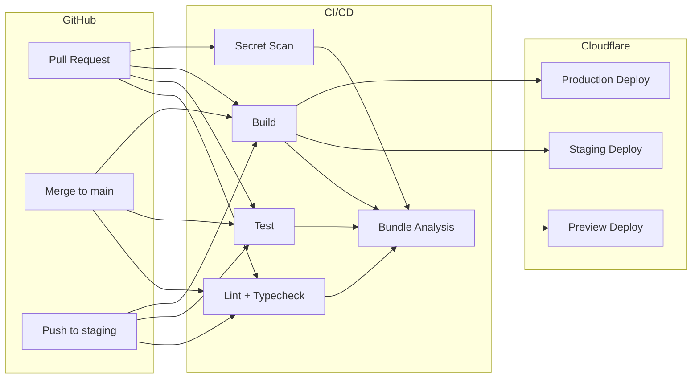
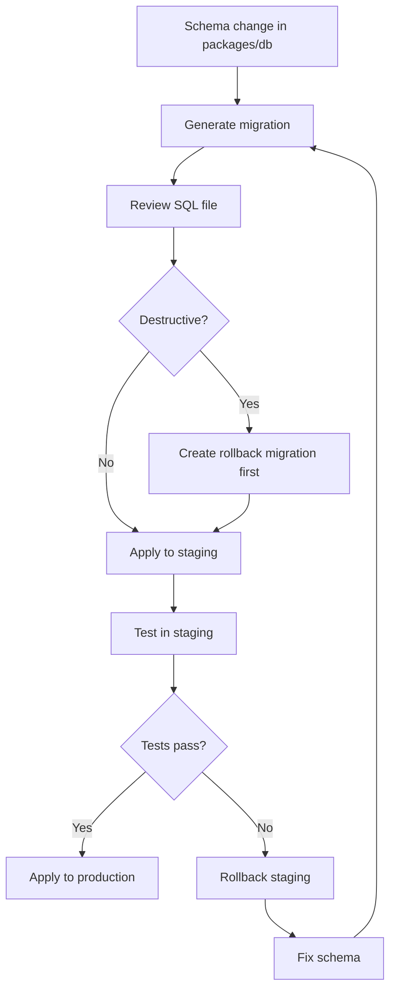

# Production Deployment

> Full CI/CD pipeline with preview deploys per PR, staging environment validation, production deployment to Cloudflare Workers + Workers Sites, automated migration rollback, and multi-environment secret management.

---

## Table of Contents

1. [Deployment Architecture](#deployment-architecture)
2. [Environments](#environments)
3. [CI/CD Pipeline](#cicd-pipeline)
4. [Deploy API](#deploy-api)
5. [Deploy Web](#deploy-web)
6. [Database Migrations](#database-migrations)
7. [Secrets Management](#secrets-management)
8. [Preview Deploys](#preview-deploys)
9. [Staging Environment](#staging-environment)
10. [Production Checklist](#production-checklist)
11. [Rollback](#rollback)
12. [Monitoring](#monitoring)
13. [DNS Setup](#dns-setup)
14. [Cost Projections](#cost-projections)

---

## Deployment Architecture



---

## Environments

| Environment | API URL | Web URL | Deploy Trigger | Purpose |
|-------------|---------|---------|---------------|---------|
| **Local** | `http://localhost:8787` | `http://localhost:5173` | `pnpm dev` | Development |
| **Preview** | `api.devsage-org.workers.dev` | `platform.devsage-org.workers.dev` | Every PR push | Isolated review |
| **Staging** | `https://staging-api.devsage.org` | `https://staging.devsage.org` | Push to `staging` branch | Pre-production validation |
| **Production** | `https://api.devsage.org` | `https://devsage.org` | Merge to `main` | Live traffic |

### Environment Isolation

| Resource | Preview | Staging | Production |
|----------|---------|---------|------------|
| D1 Database | Separate per-PR | Shared staging DB | Production DB |
| KV Namespace | Shared preview | Staging namespace | Production namespace |
| Durable Objects | Shared preview | Staging DOs | Production DOs |
| Queues | Shared preview | Staging queue | Production queue |
| R2 Bucket | Shared preview | Staging bucket | Production bucket |
| Secrets | Dev secrets | Staging secrets | Production secrets |

---

## CI/CD Pipeline

### GitHub Actions Workflow

```yaml
# .github/workflows/ci.yml
name: CI/CD

on:
  push:
    branches: [main, staging]
  pull_request:
    branches: [main]

jobs:
  quality:
    runs-on: ubuntu-latest
    steps:
      - uses: actions/checkout@v4
      - uses: pnpm/action-setup@v4
      - uses: actions/setup-node@v4
        with:
          node-version: 20
          cache: pnpm
      - run: pnpm install --frozen-lockfile
      - run: pnpm lint
      - run: pnpm typecheck

  test:
    runs-on: ubuntu-latest
    steps:
      - uses: actions/checkout@v4
      - uses: pnpm/action-setup@v4
      - uses: actions/setup-node@v4
        with:
          node-version: 20
          cache: pnpm
      - run: pnpm install --frozen-lockfile
      - run: pnpm test

  secret-scan:
    runs-on: ubuntu-latest
    steps:
      - uses: actions/checkout@v4
        with:
          fetch-depth: 0
      - uses: gitleaks/gitleaks-action@v2

  build:
    runs-on: ubuntu-latest
    needs: [quality, test, secret-scan]
    steps:
      - uses: actions/checkout@v4
      - uses: pnpm/action-setup@v4
      - uses: actions/setup-node@v4
        with:
          node-version: 20
          cache: pnpm
      - run: pnpm install --frozen-lockfile
      - run: pnpm build
      - uses: actions/upload-artifact@v4
        with:
          name: build-output
          path: |
            apps/api/dist/
            apps/platform/dist/

  bundle-analysis:
    runs-on: ubuntu-latest
    needs: build
    if: github.event_name == 'pull_request'
    steps:
      - name: Analyze bundle size
        run: |
          # Compare bundle size against budget
          # Fail if initial JS > 200KB gzip

  deploy-preview:
    runs-on: ubuntu-latest
    needs: build
    if: github.event_name == 'pull_request'
    steps:
      - name: Deploy preview
        run: |
          pnpm deploy:api:preview
          pnpm deploy:web:preview

  deploy-staging:
    runs-on: ubuntu-latest
    needs: build
    if: github.ref == 'refs/heads/staging'
    steps:
      - name: Deploy to staging
        run: |
          pnpm deploy:api:staging
pnpm deploy:platform:staging

  deploy-production:
    runs-on: ubuntu-latest
    needs: build
    if: github.ref == 'refs/heads/main'
    steps:
      - name: Deploy to production
        run: |
          pnpm deploy:api
          pnpm deploy:web
```

### Pipeline Duration Targets

| Stage | Target | Measured By |
|-------|--------|-------------|
| Lint + typecheck | < 60s | `pnpm lint && pnpm typecheck` |
| Tests | < 120s | `pnpm test` |
| Build | < 60s | `pnpm build` |
| Secret scan | < 30s | `gitleaks` |
| Deploy (each service) | < 30s | `wrangler deploy` |
| **Total pipeline** | **< 5 minutes** | PR open → preview deployed |

---

## Deploy API

### Manual Deploy

```bash
# Production
pnpm deploy:api

# Staging
pnpm deploy:api:staging

# Dev environment
pnpm deploy:api:dev
```

This runs `pnpm --filter @devsage/api deploy`, which invokes `wrangler deploy` from `apps/api/`.

**Never run `wrangler deploy` from the repo root** — there is no `wrangler.jsonc` at root level.

### Wrangler Configuration

Key configuration in `apps/api/wrangler.jsonc`:

| Setting | Value | Notes |
|---------|-------|-------|
| `account_id` | Baked in config | No environment variable needed |
| `d1_databases` | DB binding + migration path | `../../packages/db/migrations` |
| `durable_objects` | All DO bindings | Must match re-exports in `src/index.ts` |
| `queues` | Producer + consumer bindings | Same Worker handles both |
| `cron_triggers` | `0 * * * *` (hourly) | Deadline checks, phase transitions |
| `observability.enabled` | `true` | Production logging |

### Deploy Hooks

```bash
# Pre-deploy: run migrations
pnpm --filter @devsage/api predeploy

# Post-deploy: verify health
pnpm --filter @devsage/api postdeploy
```

---

## Deploy Web

```bash
# Production
pnpm deploy:web

# Staging
pnpm deploy:web:staging
```

This runs `tsc --noEmit && vite build` followed by `wrangler deploy` from `apps/platform/`.

### Web Environment Variables

The production env file `apps/platform/.env.production` is committed to the repository:

```env
VITE_API_ORIGIN=https://api.devsage.org
VITE_WS_ORIGIN=wss://ws.devsage.org
VITE_APP_ENV=production
VITE_SENTRY_DSN=https://...@sentry.io/...
VITE_POSTHOG_KEY=phc_...
```

**Never place secrets in `VITE_*` variables** — they are embedded in the JS bundle.

---

## Database Migrations

### Migration Workflow



### Commands

```bash
# Generate migration from schema changes
pnpm --filter @devsage/db drizzle-kit generate

# Apply to local D1 (automatic on dev start)
pnpm --filter @devsage/api dev

# Apply to staging D1
pnpm --filter @devsage/api exec wrangler d1 migrations apply devsage-db --remote --env staging

# Apply to production D1
pnpm --filter @devsage/api exec wrangler d1 migrations apply devsage-db --remote
```

### Migration Safety Rules

| Rule | Enforcement |
|------|-------------|
| Never drop columns without deprecation period | Code review |
| Always add columns as nullable or with defaults | Drizzle schema validation |
| Test migration on staging before production | CI pipeline |
| Keep rollback SQL for every migration | Convention |
| No data migrations in schema migrations | Separate data migration scripts |

---

## Secrets Management

### Upload Secrets

```bash
# Bulk upload from file
pnpm deploy:api:secrets

# Individual secret
cd apps/api
wrangler secret put JWT_SECRET
wrangler secret put GITHUB_CLIENT_SECRET
```

### Required Secrets by Environment

| Secret | Local (.dev.vars) | Staging | Production |
|--------|-------------------|---------|------------|
| `JWT_SECRET` | Dev value | Staging key | Production key |
| `GOOGLE_CLIENT_ID` | Dev app | Staging app | Production app |
| `GOOGLE_CLIENT_SECRET` | Dev app | Staging app | Production app |
| `GITHUB_CLIENT_ID` | Dev app | Staging app | Production app |
| `GITHUB_CLIENT_SECRET` | Dev app | Staging app | Production app |
| `GITHUB_WEBHOOK_SECRET` | Dev value | Staging value | Production value |
| `FRONTEND_URL` | `http://localhost:5173` | `https://staging.devsage.org` | `https://devsage.org` |
| `SMTP_URL` | Local SMTP | SendGrid/SES | SendGrid/SES |
| `SMTP_USERNAME` | Empty | SMTP user | SMTP user |
| `SMTP_PASSWORD` | Empty | SMTP password | SMTP password |
| `SMTP_EMAIL_ADDR` | `noreply@devsage.local` | `noreply@devsage.org` | `noreply@devsage.org` |

### Secret Rotation

| Secret | Rotation Frequency | Procedure |
|--------|-------------------|-----------|
| `JWT_SECRET` | Every 90 days | Generate new key → deploy → old tokens expire naturally (7 days) |
| OAuth secrets | On compromise only | Rotate in provider dashboard → update Cloudflare secret → deploy |
| `GITHUB_WEBHOOK_SECRET` | Every 90 days | Update GitHub webhook config → update Cloudflare secret |
| SMTP credentials | On provider change | Update Cloudflare secrets → verify email delivery |

---

## Preview Deploys

Every pull request automatically deploys a preview environment:

| Feature | Detail |
|---------|--------|
| URL pattern | `{app}.devsage-org.workers.dev` |
| Isolation | Separate D1 database per PR |
| Lifecycle | Created on first PR push, deleted when PR closes |
| Seed data | Automatically seeded with sample data |
| Comment | Bot comments on PR with preview URLs |

### PR Comment Format

```
## 🚀 Preview Deploy

| Service | URL | Status |
|---------|-----|--------|
| Platform | [platform.devsage-org.workers.dev](https://...) | ✅ Deployed |
| API | [api.devsage-org.workers.dev](https://...) | ✅ Deployed |
| Admin | [admin.devsage-org.workers.dev](https://...) | ✅ Deployed |

Deployed at: 2026-01-15 10:30 UTC
Commit: abc1234
```

---

## Staging Environment

Staging mirrors production configuration but with separate resources.

### Promoting to Production

```bash
# After staging validation passes:
git checkout main
git merge staging
git push origin main
# CI automatically deploys to production
```

### Staging Smoke Tests

Automated tests run against staging after deploy:

| Test | What It Verifies |
|------|-----------------|
| Health check | API responds to `GET /health` |
| Auth flow | OAuth redirect → callback → JWT |
| Hackathon CRUD | Create, read, update hackathon |
| Team operations | Create team, join, leave |
| Submission flow | Tag → capture → validate |
| WebSocket | Connection + message delivery |

---

## Production Checklist

### First-Time Setup

- [ ] Create Cloudflare account and authenticate Wrangler
- [ ] Create D1 database: `wrangler d1 create devsage-db`
- [ ] Run migrations: `wrangler d1 migrations apply devsage-db --remote`
- [ ] Upload all production secrets
- [ ] Configure DNS records
- [ ] Set up GitHub OAuth app with production URLs
- [ ] Set up Google OAuth credentials with production URLs
- [ ] Configure GitHub webhook with production URL and secret
- [ ] Verify email delivery (SMTP configuration)
- [ ] Deploy API: `pnpm deploy:api`
- [ ] Deploy Web: `pnpm deploy:web`
- [ ] Verify health endpoint: `curl https://api.devsage.org/health`
- [ ] Test full OAuth login flow
- [ ] Enable Cloudflare observability

### Pre-Deploy Checklist

- [ ] All CI checks pass (lint, typecheck, test, secret scan)
- [ ] Migrations tested on staging
- [ ] Bundle size within budget (< 200KB gzip initial)
- [ ] No new secrets required (or secrets already uploaded)
- [ ] Changelog updated

---

## Rollback

### Worker Rollback

Cloudflare Workers support instant rollback via the dashboard:

1. Navigate to Workers & Pages → your worker → Deployments
2. Find the previous good deployment
3. Click "Rollback to this deployment"

Rollback is instant (< 1s) and affects all traffic globally.

### Database Rollback

D1 migrations are forward-only. For rollback:

1. Apply the corresponding rollback migration SQL
2. Each migration should have a `down.sql` companion
3. Test rollback on staging first

### Emergency Procedure

```bash
# 1. Rollback API to previous version (via dashboard or CLI)
wrangler deployments list --name devsage-api
wrangler rollback --name devsage-api --version {previous-version-id}

# 2. If database migration caused the issue:
wrangler d1 execute devsage-db --remote --file rollback/0042_rollback.sql

# 3. Verify
curl https://api.devsage.org/health
```

---

## Monitoring

### Real-Time Logs

```bash
cd apps/api
wrangler tail
```

Or use the Cloudflare dashboard: Workers & Pages → Worker → Logs.

### Observability

| Feature | Configuration | Dashboard |
|---------|-------------|-----------|
| Request logs | `observability.enabled: true` in wrangler.jsonc | Cloudflare dashboard |
| Error tracking | Sentry DSN in web app | sentry.io |
| Performance | Web Vitals reporting | PostHog / custom dashboard |
| Analytics | Cloudflare Analytics Engine | Custom dashboard |
| Uptime | Cloudflare Health Checks | Cloudflare dashboard |

### Alerts

| Alert | Condition | Channel |
|-------|-----------|---------|
| Error rate spike | > 5% of requests return 5xx over 5 minutes | Slack + email |
| Latency degradation | P95 > 2s over 5 minutes | Slack |
| Queue backlog | > 1000 messages pending for > 10 minutes | Slack + email |
| D1 errors | Any D1 write failure | Slack + email |
| Certificate expiry | < 14 days until expiry | Email |

---

## DNS Setup

| Record | Name | Target | Notes |
|--------|------|--------|-------|
| CNAME | `devsage.org` | Web Worker | Proxied through Cloudflare |
| CNAME | `platform.devsage.org` | Platform Worker | Proxied through Cloudflare |
| CNAME | `shikdd.devsage.org` | Admin Worker (`admin.devsage-org.workers.dev`) | Proxied through Cloudflare |
| CNAME | `api.devsage.org` | API Worker | Proxied through Cloudflare |
| CNAME | `staging.devsage.org` | Staging Web Worker | Proxied |
| CNAME | `staging-api.devsage.org` | Staging API Worker | Proxied |

SSL/TLS is automatic via Cloudflare. Full (Strict) mode recommended.

---

## Cost Projections

### Cloudflare Workers Free Tier

| Resource | Free Tier | Estimated Usage (500 users) | Cost |
|----------|-----------|---------------------------|------|
| Worker requests | 100K/day | ~50K/day | Free |
| D1 reads | 5M/day | ~500K/day | Free |
| D1 writes | 100K/day | ~20K/day | Free |
| D1 storage | 5 GB | ~100 MB | Free |
| KV reads | 100K/day | ~10K/day | Free |
| KV writes | 1K/day | ~500/day | Free |
| R2 storage | 10 GB | ~1 GB | Free |
| R2 operations | 1M Class A, 10M Class B | ~100K total | Free |
| Durable Objects | 400K duration-hours | ~5K hours | Free |
| Queues | 1M messages | ~100K messages | Free |

### Growth Estimates

| Scale | Monthly Cost | Notes |
|-------|-------------|-------|
| 0-500 users | $0 | Free tier covers everything |
| 500-5,000 users | $5-25/month | Workers Paid plan ($5/mo base) |
| 5,000-50,000 users | $25-100/month | Increased D1 + R2 usage |
| 50,000+ users | $100-500/month | Multiple D1 databases, high queue volume |
