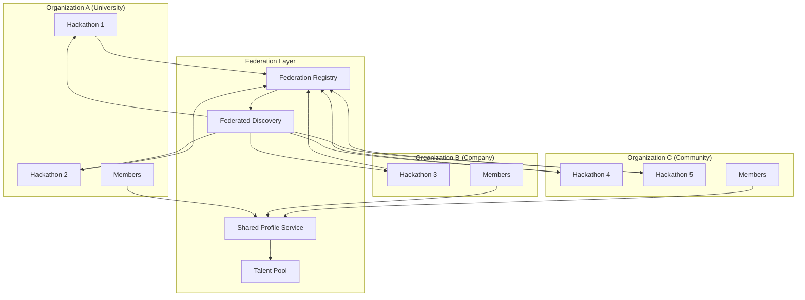
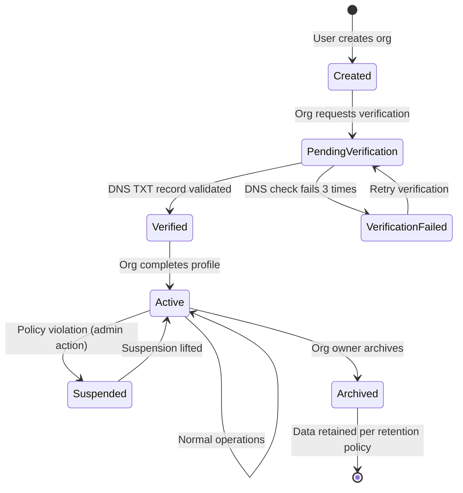
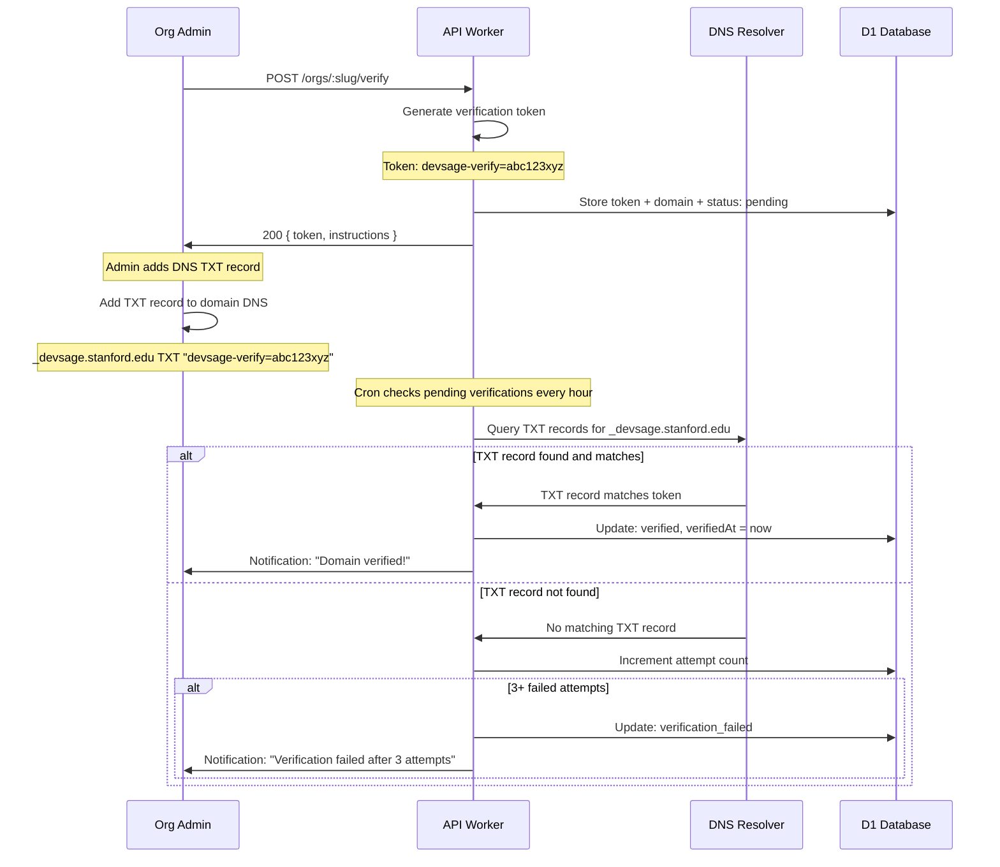
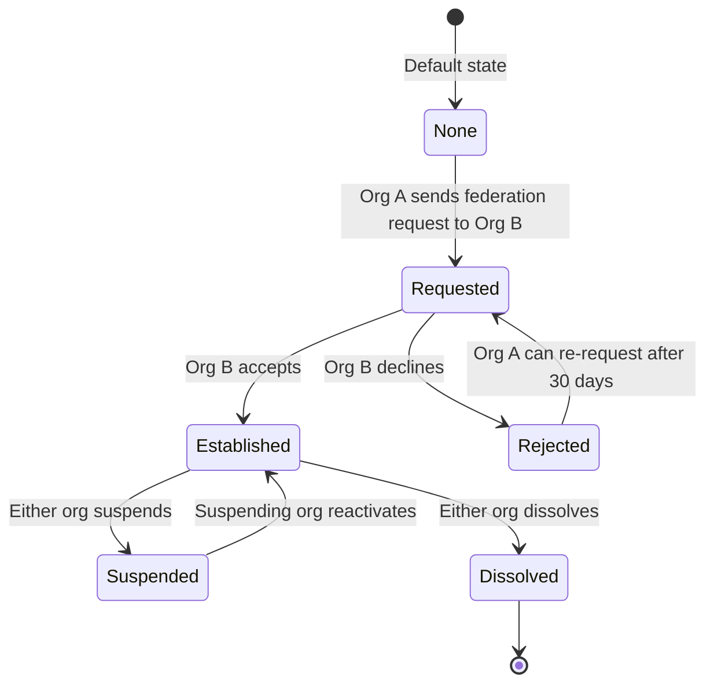
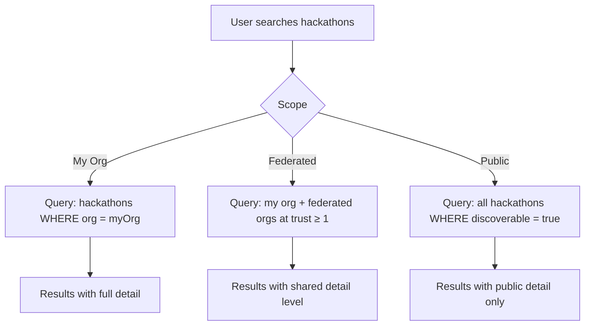
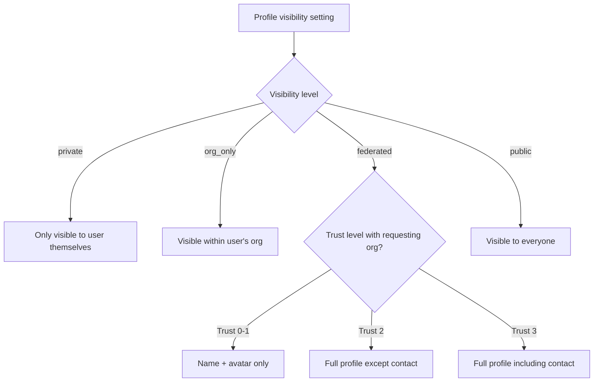
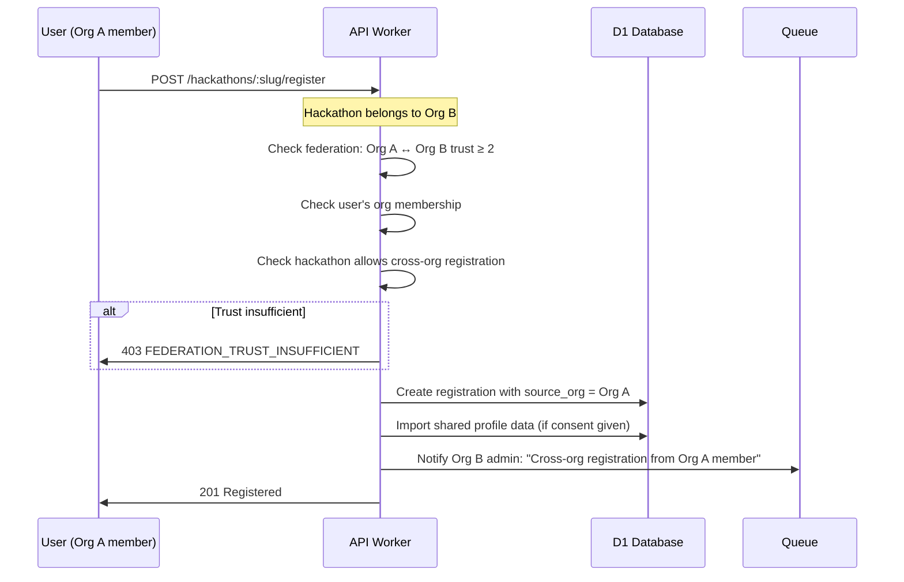
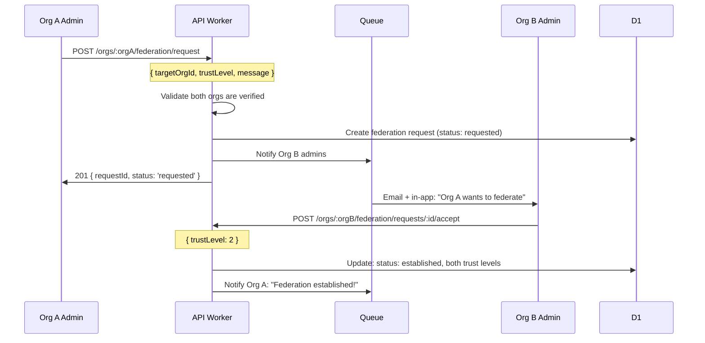
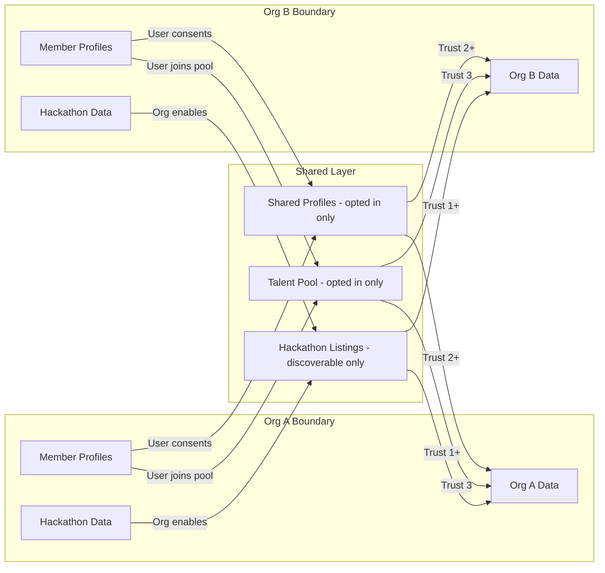

# 18 — Multi-org Federation

> Cross-organization hackathon discovery with DNS-verified org identity, tiered trust levels, portable participant profiles, shared talent pools, and federated search — enabling universities, companies, and communities to collaborate across organizational boundaries while maintaining autonomy.

---

## Table of Contents

1. [Design Goals](#design-goals)
2. [Architecture Overview](#architecture-overview)
3. [Organization Model](#organization-model)
4. [DNS Verification](#dns-verification)
5. [Trust Levels](#trust-levels)
6. [Federated Discovery](#federated-discovery)
7. [Shared Profiles](#shared-profiles)
8. [Cross-org Participation](#cross-org-participation)
9. [Talent Pool](#talent-pool)
10. [Federation Governance](#federation-governance)
11. [Privacy & Data Boundaries](#privacy--data-boundaries)
12. [API Endpoints](#api-endpoints)
13. [Edge Cases](#edge-cases)
14. [Error Codes](#error-codes)
15. [Database Tables](#database-tables)
16. [Decision Log](#decision-log)

---

## Design Goals

| Goal | Target | Rationale |
|------|--------|-----------|
| Org verification time | < 24 hours (DNS propagation) | Orgs should be verified quickly without manual admin approval |
| Cross-org hackathon discovery | < 2s search results | Participants should find hackathons across orgs instantly |
| Profile portability | Zero re-entry of shared data | Participants shouldn't re-enter name, bio, skills for every hackathon |
| Data sovereignty | Full org control over org data | Each org owns its data; federation is opt-in sharing |
| Trust establishment | Bilateral agreement | Both orgs must agree to federate — no unilateral access |
| Federation latency | < 100ms overhead | Cross-org queries should not noticeably slow down UX |
| Org autonomy | 100% independent operation | Orgs can leave federation at any time without data loss |

---

## Architecture Overview



### Federation Model

DevSage uses a **hub-and-spoke federation** model:
- Each organization is an independent entity with full data ownership
- The platform acts as the federation hub, maintaining a registry of verified orgs
- Orgs opt into federation relationships bilaterally
- Shared data (profiles, hackathon listings) is copied, not referenced — each org has its own view

This is NOT a decentralized/mesh federation (like ActivityPub). It's a centralized platform with controlled org-to-org sharing.

---

## Organization Model

### Organization Lifecycle



### Organization Entity

```typescript
interface Organization {
  id: string;                     // Org ID (`org_` prefix + UUID)
  slug: string;                   // URL-safe slug (unique)
  
  // Identity
  name: string;                   // Display name
  description: string;            // About this org (max 1000 chars)
  domain: string;                 // Verified domain (e.g., "stanford.edu")
  logoUrl?: string;               // R2-hosted logo
  websiteUrl?: string;
  
  // Classification
  type: 'university' | 'company' | 'community' | 'nonprofit' | 'government';
  size: 'small' | 'medium' | 'large' | 'enterprise';  // Member count bracket
  
  // Verification
  verificationStatus: 'unverified' | 'pending' | 'verified' | 'failed';
  verifiedAt?: string;
  verificationMethod: 'dns_txt' | 'admin_manual';
  
  // Federation settings
  federationEnabled: boolean;     // Opt-in to federation
  discoverable: boolean;          // Listed in org directory
  profileSharingEnabled: boolean; // Allow member profiles to be shared
  talentPoolEnabled: boolean;     // Allow members to join talent pool
  
  // Status
  status: 'created' | 'pending_verification' | 'active' | 'suspended' | 'archived';
  
  // Stats
  memberCount: number;
  hackathonCount: number;
  
  // Ownership
  ownerUserId: string;
  
  createdAt: string;
  updatedAt: string;
}
```

### Organization Roles

| Role | Permissions |
|------|------------|
| `owner` | Full control. Transfer ownership. Delete org. Manage federation settings |
| `admin` | Manage members, hackathons, settings. Cannot delete org or transfer ownership |
| `moderator` | Manage hackathon content, moderate members. Cannot change org settings |
| `member` | Participate in org hackathons. View org directory. Opt into shared profile |
| `guest` | Participate in specific hackathons via cross-org invite. Limited org visibility |

---

## DNS Verification

### Verification Flow



### DNS Record Specification

```
Record Type: TXT
Host:        _devsage.{domain}
Value:       devsage-verify={token}
TTL:         Any (3600 recommended)
```

Example for `stanford.edu`:
```
_devsage.stanford.edu. IN TXT "devsage-verify=dv_abc123xyz789"
```

### Verification Rules

| Rule | Value | Rationale |
|------|-------|-----------|
| Token format | `dv_` + 20 random chars | Collision-resistant, clearly DevSage-specific |
| Check interval | Hourly (cron) | Balance between responsiveness and DNS query volume |
| Max attempts | 3 failed checks after first TXT not found | Allow DNS propagation time before failing |
| Token expiry | 72 hours | Enough time for DNS changes to propagate |
| Re-verification | Every 90 days | Ensure ongoing domain ownership |
| Manual override | Platform admin can verify manually | For orgs that can't modify DNS (edge cases) |

### Benefits of DNS Verification

| Benefit | Explanation |
|---------|-------------|
| Proves domain ownership | Only the domain admin can add TXT records |
| No email dependency | Works even if email is hosted elsewhere |
| Automatable | Cron-based checking, no manual review needed |
| Standard practice | Same approach used by Google, GitHub, Stripe |
| Revocable | Org can remove TXT record to de-verify |

---

## Trust Levels

### Trust Between Organizations

Federation relationships are bilateral — both orgs must agree.



### Trust Tiers

| Tier | Name | Capabilities | Use Case |
|------|------|-------------|----------|
| 0 | `none` | No relationship. Public hackathon listings visible | Default for all orgs |
| 1 | `discovery` | Hackathon cross-listing in each other's directories | "We want our members to see each other's events" |
| 2 | `participation` | Cross-org registration without invite codes. Shared basic profiles | "Our members should be able to join each other's hackathons easily" |
| 3 | `collaboration` | Shared talent pool. Joint hackathon co-hosting. Detailed profile sharing | "We run events together and share talent" |

### Trust Configuration

```typescript
interface FederationRelationship {
  id: string;
  orgAId: string;                  // Initiating org
  orgBId: string;                  // Target org
  
  // Trust level (must be agreed by both)
  trustLevel: 0 | 1 | 2 | 3;
  orgATrustLevel: 0 | 1 | 2 | 3;  // What A offers
  orgBTrustLevel: 0 | 1 | 2 | 3;  // What B offers
  // Effective trust = min(orgATrustLevel, orgBTrustLevel)
  
  // Status
  status: 'requested' | 'established' | 'suspended' | 'dissolved';
  requestedBy: 'org_a' | 'org_b';
  
  // Sharing preferences
  sharingConfig: {
    shareHackathonListings: boolean;    // Trust 1+
    shareMemberProfiles: boolean;        // Trust 2+
    shareTeamFormation: boolean;         // Trust 2+
    shareTalentPool: boolean;            // Trust 3
    allowCoHosting: boolean;             // Trust 3
  };
  
  // Metadata
  requestedAt: string;
  establishedAt?: string;
  suspendedAt?: string;
  dissolvedAt?: string;
  message?: string;                // Optional message with request
}
```

### Effective Trust Calculation

Both orgs independently set their offered trust level. The effective trust is the **minimum** of both:

```
Org A offers: Trust 3 (full collaboration)
Org B offers: Trust 2 (participation only)
Effective trust: Trust 2 (lower of the two)
```

This ensures neither org can force a higher trust level than the other is comfortable with.

---

## Federated Discovery

### Hackathon Discovery Flow



### Discovery Detail Levels

| Detail | Public (Trust 0) | Discovery (Trust 1) | Participation (Trust 2+) |
|--------|-----------------|---------------------|--------------------------|
| Hackathon name | ✅ | ✅ | ✅ |
| Description | ✅ | ✅ | ✅ |
| Dates | ✅ | ✅ | ✅ |
| Org name + logo | ✅ | ✅ | ✅ |
| Registration count | ❌ | ✅ | ✅ |
| Team count | ❌ | ✅ | ✅ |
| Tracks/categories | ❌ | ✅ | ✅ |
| Prize information | ❌ | ❌ | ✅ |
| Mentor availability | ❌ | ❌ | ✅ |
| Sponsor information | ❌ | ❌ | ✅ |
| Direct registration link | ❌ | ❌ | ✅ |

### Cross-org Hackathon Listing

When trust level ≥ 1, hackathons from federated orgs appear in the discovery feed:

```
┌─────────────────────────────────────────────────────────────┐
│  Discover Hackathons                                         │
│  [My Org ▼] [All Federated ▼] [Public ▼]                   │
│                                                              │
│  ┌──────────────────────────────────────────────────────┐   │
│  │ 🏠 Summer Hack 2026 — Stanford University             │   │
│  │    REGISTRATION_OPEN · Jun 15-17 · 186 registered     │   │
│  │    Tracks: AI/ML, Web, Mobile                         │   │
│  │    [Register]                                          │   │
│  └──────────────────────────────────────────────────────┘   │
│                                                              │
│  ┌──────────────────────────────────────────────────────┐   │
│  │ 🤝 CloudHack 2026 — Cloudflare (Federated)           │   │
│  │    REGISTRATION_OPEN · Jul 1-3 · 340 registered       │   │
│  │    Tracks: Workers, AI, IoT                           │   │
│  │    [View Details]                                      │   │
│  └──────────────────────────────────────────────────────┘   │
│                                                              │
│  ┌──────────────────────────────────────────────────────┐   │
│  │ 🌍 Global Health Hack — WHO (Public)                  │   │
│  │    ACTIVE · Aug 10-12                                  │   │
│  │    [View on their platform →]                          │   │
│  └──────────────────────────────────────────────────────┘   │
└─────────────────────────────────────────────────────────────┘
```

---

## Shared Profiles

### Profile Portability

Users can create a portable profile that follows them across orgs and hackathons:

```typescript
interface SharedProfile {
  userId: string;
  
  // Public identity (always shared)
  displayName: string;
  avatarUrl: string;
  bio: string;                    // Max 500 chars
  
  // Professional (shared at trust 2+)
  skills: ProfileSkill[];
  experienceLevel: 'student' | 'junior' | 'mid' | 'senior' | 'staff';
  githubUsername?: string;
  linkedinUrl?: string;
  portfolioUrl?: string;
  
  // Hackathon history (shared at trust 2+)
  hackathonCount: number;
  hackathonHighlights: ProfileHighlight[];  // Max 5
  
  // Preferences (shared at trust 2+)
  lookingForTeam: boolean;
  preferredRoles: string[];       // "frontend", "backend", "design", etc.
  preferredTeamSize: 'small' | 'medium' | 'large' | 'any';
  timezone: string;
  spokenLanguages: string[];
  
  // Privacy controls
  visibility: 'private' | 'org_only' | 'federated' | 'public';
  sharingConsent: boolean;        // Explicit opt-in to cross-org sharing
  
  // Stats
  totalProjectsSubmitted: number;
  averageTeamRating?: number;     // From mentor feedback
  badges: ProfileBadge[];
  
  updatedAt: string;
}

interface ProfileSkill {
  name: string;
  category: 'language' | 'framework' | 'tool' | 'domain';
  proficiency: 'beginner' | 'intermediate' | 'advanced' | 'expert';
  endorsementCount: number;       // From teammates/mentors
}

interface ProfileHighlight {
  hackathonName: string;
  orgName: string;
  role: string;                   // "Participant", "Winner", "Mentor"
  achievement?: string;           // "1st Place", "Best AI Project"
  date: string;
}

interface ProfileBadge {
  type: 'winner' | 'top_mentor' | 'serial_hacker' | 'team_player' | 'first_hackathon';
  label: string;
  earnedAt: string;
  hackathonName: string;
}
```

### Profile Sharing Rules



### Profile Sync

When a user updates their shared profile, the change propagates:

1. **Immediate**: User's own org sees the update instantly
2. **Background**: Federated org caches refreshed within 1 hour (KV cache with TTL)
3. **On-demand**: Full profile fetched from source when user clicks "View Profile"

---

## Cross-org Participation

### Registration Flow (Trust Level 2+)



### Cross-org Registration Rules

| Rule | Implementation |
|------|---------------|
| Trust level ≥ 2 required | API checks federation relationship before allowing registration |
| Hackathon must opt-in | Hackathon setting: `allowCrossOrgRegistration: boolean` |
| Profile auto-import | If user has shared profile with `federated` or `public` visibility, basic info is pre-filled |
| Org attribution | Registration record includes `source_org_id` for analytics |
| Role limits | Cross-org participants default to `participant` role (cannot be admin/owner) |
| Team formation | Cross-org participants can join teams normally |

---

## Talent Pool

### Concept

At trust level 3, federated orgs can share a talent pool — members who opt in are discoverable by other orgs for team formation, recruitment, and hackathon invites.

### Talent Pool Entry

```typescript
interface TalentPoolEntry {
  userId: string;
  orgId: string;                  // Home org
  sharedProfileId: string;        // Reference to SharedProfile
  
  // Talent-specific
  openToOpportunities: boolean;   // Open to being contacted
  interestedIn: ('hackathons' | 'mentoring' | 'judging' | 'collaboration')[];
  availableFrom?: string;         // When they're next available
  
  // Visibility
  visibleToOrgs: 'all_federated' | 'specific';
  specificOrgIds?: string[];      // If 'specific', which orgs can see
  
  // Metadata
  joinedPoolAt: string;
  lastActiveAt: string;           // Last hackathon participation
}
```

### Talent Pool Search

```
GET /api/v1/talent-pool/search?skills=react,typescript&available=true&openTo=hackathons

Response:
{
  "ok": true,
  "data": [
    {
      "userId": "user_abc",
      "displayName": "Alice Chen",
      "org": "Stanford University",
      "skills": ["React", "TypeScript", "GraphQL"],
      "experienceLevel": "senior",
      "hackathonCount": 8,
      "badges": ["winner", "serial_hacker"],
      "availableFrom": "2026-06-01",
      "interestedIn": ["hackathons", "mentoring"]
    }
  ],
  "meta": { "total": 42, "limit": 20, "offset": 0 }
}
```

### Talent Pool Privacy

| Control | Default | Description |
|---------|---------|-------------|
| Opt-in required | true | Users must explicitly join the talent pool |
| Contact method | In-app only | No email/phone shared — messages via platform |
| Profile detail | Skill-level only | Full profile visible only after mutual interest |
| Withdrawal | Immediate | User can leave pool at any time |
| Data deletion | Within 24 hours | Pool entry and cached data removed |

---

## Federation Governance

### Federation Request Flow



### Governance Rules

| Rule | Implementation |
|------|---------------|
| Both orgs must be verified | API rejects requests from/to unverified orgs |
| Bilateral consent | Both orgs must accept for federation to activate |
| Independent trust levels | Each org sets their offered trust level independently |
| Unilateral dissolution | Either org can dissolve at any time |
| Suspension | Either org can temporarily suspend without dissolving |
| Cooldown after rejection | 30-day cooldown before re-requesting |
| Max federation partners | 100 per org (prevent spam federation) |
| Audit logging | All federation changes logged in audit trail |

### Co-hosted Hackathons (Trust Level 3)

At trust level 3, orgs can co-host hackathons:

```typescript
interface CoHostedHackathon {
  hackathonId: string;
  primaryOrgId: string;         // Org that created the hackathon
  coHostOrgIds: string[];       // Additional hosting orgs
  
  // Each co-host gets:
  // - Listed as co-organizer on hackathon page
  // - Admin access for their designated members
  // - Inclusion in analytics and reporting
  // - Branded presence (logo in header)
  
  // The primary org retains:
  // - Final decision authority on settings
  // - Data ownership
  // - Billing responsibility
}
```

---

## Privacy & Data Boundaries

### Data Sovereignty Principles

| Principle | Implementation |
|-----------|---------------|
| Org owns its data | All org data stored with `org_id` FK. Deletion removes all org data |
| Sharing is opt-in | Federation, profile sharing, talent pool — all require explicit consent |
| User controls their data | Users choose profile visibility and can withdraw sharing at any time |
| No cross-org data mining | Federated orgs see only what's explicitly shared. No aggregate analytics on other orgs |
| Dissolution cleans up | When federation is dissolved, cached cross-org data is purged within 24 hours |

### Data Flow Boundaries



### GDPR Considerations

| Right | Implementation |
|-------|---------------|
| Right to access | User can export all shared profile data + where it's been shared |
| Right to erasure | Deleting shared profile removes data from all federated caches within 24h |
| Right to restrict | User can change visibility to `private` — immediately stops sharing |
| Data portability | Shared profile exportable as JSON |
| Consent management | Explicit opt-in for each sharing level. Consent recorded with timestamp |
| Withdrawal | One-click withdrawal from talent pool and profile sharing |

---

## API Endpoints

### Organization Management

| Method | Path | Auth | Min Role | Description |
|--------|------|------|----------|-------------|
| POST | `/api/v1/orgs` | JWT | — | Create organization |
| GET | `/api/v1/orgs` | JWT | — | List orgs (user's orgs + public directory) |
| GET | `/api/v1/orgs/:slug` | JWT | — | Get org details |
| PATCH | `/api/v1/orgs/:slug` | JWT | org admin | Update org settings |
| DELETE | `/api/v1/orgs/:slug` | JWT | org owner | Archive org |

### Org Membership

| Method | Path | Auth | Min Role | Description |
|--------|------|------|----------|-------------|
| GET | `/api/v1/orgs/:slug/members` | JWT | org member | List org members |
| POST | `/api/v1/orgs/:slug/members/invite` | JWT | org admin | Invite member by email |
| PATCH | `/api/v1/orgs/:slug/members/:userId` | JWT | org admin | Update member role |
| DELETE | `/api/v1/orgs/:slug/members/:userId` | JWT | org admin | Remove member |
| POST | `/api/v1/orgs/:slug/members/leave` | JWT | org member | Leave org |

### DNS Verification

| Method | Path | Auth | Min Role | Description |
|--------|------|------|----------|-------------|
| POST | `/api/v1/orgs/:slug/verify` | JWT | org owner | Start verification (get TXT record value) |
| GET | `/api/v1/orgs/:slug/verify/status` | JWT | org owner | Check verification status |
| POST | `/api/v1/orgs/:slug/verify/check` | JWT | org owner | Trigger manual DNS check |

### Federation Management

| Method | Path | Auth | Min Role | Description |
|--------|------|------|----------|-------------|
| GET | `/api/v1/orgs/:slug/federation` | JWT | org admin | List federation relationships |
| POST | `/api/v1/orgs/:slug/federation/request` | JWT | org admin | Send federation request |
| GET | `/api/v1/orgs/:slug/federation/requests` | JWT | org admin | List incoming requests |
| POST | `/api/v1/orgs/:slug/federation/requests/:id/accept` | JWT | org admin | Accept federation request |
| POST | `/api/v1/orgs/:slug/federation/requests/:id/reject` | JWT | org admin | Reject federation request |
| PATCH | `/api/v1/orgs/:slug/federation/:relId` | JWT | org admin | Update trust level |
| POST | `/api/v1/orgs/:slug/federation/:relId/suspend` | JWT | org admin | Suspend federation |
| POST | `/api/v1/orgs/:slug/federation/:relId/reactivate` | JWT | org admin | Reactivate federation |
| DELETE | `/api/v1/orgs/:slug/federation/:relId` | JWT | org admin | Dissolve federation |

### Federated Discovery

| Method | Path | Auth | Min Role | Description |
|--------|------|------|----------|-------------|
| GET | `/api/v1/discover/hackathons` | Optional | — | Search hackathons across orgs |
| GET | `/api/v1/discover/orgs` | Optional | — | Search verified organizations |

### Shared Profiles

| Method | Path | Auth | Min Role | Description |
|--------|------|------|----------|-------------|
| GET | `/api/v1/me/shared-profile` | JWT | — | Get own shared profile |
| PUT | `/api/v1/me/shared-profile` | JWT | — | Create/update shared profile |
| DELETE | `/api/v1/me/shared-profile` | JWT | — | Delete shared profile |
| PATCH | `/api/v1/me/shared-profile/visibility` | JWT | — | Update visibility setting |

### Talent Pool

| Method | Path | Auth | Min Role | Description |
|--------|------|------|----------|-------------|
| POST | `/api/v1/talent-pool/join` | JWT | — | Join talent pool |
| DELETE | `/api/v1/talent-pool/leave` | JWT | — | Leave talent pool |
| GET | `/api/v1/talent-pool/search` | JWT | — | Search talent pool (federated orgs only) |
| GET | `/api/v1/talent-pool/me` | JWT | — | Get own talent pool entry |
| PATCH | `/api/v1/talent-pool/me` | JWT | — | Update talent pool preferences |
| POST | `/api/v1/talent-pool/:userId/contact` | JWT | — | Send in-app message to talent |

---

## Edge Cases

| Scenario | Behavior |
|----------|----------|
| Org A federates with Org B, Org B deletes its org | Federation auto-dissolved. Org A cached data purged within 24h |
| User belongs to 2 orgs that are federated | User appears once in searches (deduplicated by userId). Profile shown from home org |
| DNS verification fails because domain changed registrar | Verification paused. Org admin can re-trigger check. 72-hour window before failure |
| Org admin sends federation request to an unverified org | 400 — both orgs must be verified to federate |
| User opts out of profile sharing while registered in cross-org hackathon | Existing registration remains (data already shared for that hackathon). Future registrations won't auto-import profile |
| Trust level downgraded from 3 to 1 | Talent pool entries no longer visible. Existing cross-org registrations preserved. New registrations follow new trust rules |
| Both orgs try to send federation request to each other simultaneously | First request creates the relationship. Second request auto-accepts (both parties expressed intent) |
| Federation dissolved during active co-hosted hackathon | Hackathon continues until completion (data integrity). Federation dissolution takes effect after hackathon ends |
| Org has 100 federation partners (max) and tries to add another | 429 — "Federation partner limit reached" |
| Cross-org participant's home org gets suspended | Participant retains access to in-progress hackathons. Cannot register for new ones until suspension lifted |
| User deletes their shared profile | Cached copies in federated org caches marked for deletion. Background job purges within 24h |
| DNS TXT record removed after verification | Re-verification cron detects missing TXT every 90 days. 7-day grace period before marking as unverified |
| Org with 50 hackathons archives itself | All hackathons move to ARCHIVED. Data retained per retention policy. Federation relationships dissolved |

---

## Error Codes

| Code | HTTP Status | Condition |
|------|-------------|-----------|
| `ORG_NOT_FOUND` | 404 | Organization slug doesn't exist |
| `ORG_SLUG_TAKEN` | 409 | Organization slug already in use |
| `ORG_NOT_VERIFIED` | 403 | Action requires verified org |
| `ORG_SUSPENDED` | 403 | Organization is suspended |
| `ORG_MEMBER_EXISTS` | 409 | User already a member of this org |
| `ORG_MEMBER_NOT_FOUND` | 404 | User is not a member of this org |
| `ORG_OWNER_CANNOT_LEAVE` | 400 | Owner must transfer ownership before leaving |
| `ORG_ROLE_INSUFFICIENT` | 403 | User's org role insufficient for this action |
| `VERIFICATION_ALREADY_PENDING` | 409 | Verification already in progress |
| `VERIFICATION_TOKEN_EXPIRED` | 410 | Verification token past 72-hour expiry |
| `VERIFICATION_DNS_NOT_FOUND` | 404 | TXT record not found at expected DNS location |
| `FEDERATION_SELF_REQUEST` | 400 | Cannot federate with yourself |
| `FEDERATION_ALREADY_EXISTS` | 409 | Federation relationship already exists |
| `FEDERATION_REQUEST_PENDING` | 409 | A pending request already exists between these orgs |
| `FEDERATION_COOLDOWN` | 429 | Re-request cooldown (30 days after rejection) |
| `FEDERATION_PARTNER_LIMIT` | 429 | Max 100 federation partners reached |
| `FEDERATION_NOT_FOUND` | 404 | Federation relationship doesn't exist |
| `FEDERATION_TRUST_INSUFFICIENT` | 403 | Action requires higher trust level |
| `FEDERATION_TARGET_NOT_VERIFIED` | 400 | Target org is not verified |
| `PROFILE_SHARING_DISABLED` | 403 | User's org has disabled profile sharing |
| `TALENT_POOL_DISABLED` | 403 | User's org has disabled talent pool |
| `TALENT_POOL_ALREADY_JOINED` | 409 | User already in talent pool |
| `TALENT_POOL_NOT_MEMBER` | 404 | User not in talent pool |
| `CROSS_ORG_REGISTRATION_DISABLED` | 403 | Hackathon doesn't allow cross-org registration |

---

## Database Tables

### organizations

Organization records.

| Column | Type | Constraints | Description |
|--------|------|-------------|-------------|
| `id` | TEXT | PRIMARY KEY | Org ID (`org_` prefix + UUID) |
| `slug` | TEXT | NOT NULL, UNIQUE | URL-safe slug |
| `name` | TEXT | NOT NULL | Display name |
| `description` | TEXT | NULL | About (max 1000 chars) |
| `domain` | TEXT | NULL, UNIQUE | Verified domain |
| `logo_url` | TEXT | NULL | R2-hosted logo |
| `website_url` | TEXT | NULL | Organization website |
| `type` | TEXT | NOT NULL | `university`, `company`, `community`, `nonprofit`, `government` |
| `size` | TEXT | NOT NULL, DEFAULT 'small' | `small`, `medium`, `large`, `enterprise` |
| `verification_status` | TEXT | NOT NULL, DEFAULT 'unverified' | DNS verification status |
| `verification_token` | TEXT | NULL | DNS TXT record token |
| `verification_attempts` | INTEGER | NOT NULL, DEFAULT 0 | Failed check count |
| `verified_at` | TEXT | NULL | Verification timestamp |
| `next_reverification_at` | TEXT | NULL | 90-day re-verification check |
| `federation_enabled` | INTEGER | NOT NULL, DEFAULT 0 | Opt-in to federation |
| `discoverable` | INTEGER | NOT NULL, DEFAULT 1 | Listed in directory |
| `profile_sharing_enabled` | INTEGER | NOT NULL, DEFAULT 0 | Allow member profiles to be shared |
| `talent_pool_enabled` | INTEGER | NOT NULL, DEFAULT 0 | Allow talent pool |
| `status` | TEXT | NOT NULL, DEFAULT 'created' | Lifecycle status |
| `owner_user_id` | TEXT | NOT NULL, FK → users.id | Org owner |
| `member_count` | INTEGER | NOT NULL, DEFAULT 0 | Cached member count |
| `hackathon_count` | INTEGER | NOT NULL, DEFAULT 0 | Cached hackathon count |
| `created_at` | TEXT | NOT NULL, DEFAULT CURRENT_TIMESTAMP | Creation time |
| `updated_at` | TEXT | NOT NULL, DEFAULT CURRENT_TIMESTAMP | Last update |

**Indexes:**
- `idx_orgs_domain` → `(domain)` — domain lookup
- `idx_orgs_status_discoverable` → `(status, discoverable)` — directory listing
- `idx_orgs_owner` → `(owner_user_id)` — user's orgs

### org_members

Organization membership.

| Column | Type | Constraints | Description |
|--------|------|-------------|-------------|
| `org_id` | TEXT | NOT NULL, FK → organizations.id | Organization |
| `user_id` | TEXT | NOT NULL, FK → users.id | Member |
| `role` | TEXT | NOT NULL, DEFAULT 'member' | `owner`, `admin`, `moderator`, `member`, `guest` |
| `invited_by` | TEXT | NULL, FK → users.id | Who invited this member |
| `joined_at` | TEXT | NOT NULL, DEFAULT CURRENT_TIMESTAMP | Join time |
| `updated_at` | TEXT | NOT NULL, DEFAULT CURRENT_TIMESTAMP | Last role change |

**Primary Key:** `(org_id, user_id)`

**Indexes:**
- `idx_org_members_user` → `(user_id)` — find user's orgs

### federation_relationships

Bilateral federation agreements.

| Column | Type | Constraints | Description |
|--------|------|-------------|-------------|
| `id` | TEXT | PRIMARY KEY | Relationship ID (`fed_` prefix + UUID) |
| `org_a_id` | TEXT | NOT NULL, FK → organizations.id | First org |
| `org_b_id` | TEXT | NOT NULL, FK → organizations.id | Second org |
| `org_a_trust_level` | INTEGER | NOT NULL, DEFAULT 0 | Trust level offered by Org A |
| `org_b_trust_level` | INTEGER | NOT NULL, DEFAULT 0 | Trust level offered by Org B |
| `effective_trust_level` | INTEGER | NOT NULL, DEFAULT 0 | min(org_a, org_b) |
| `status` | TEXT | NOT NULL, DEFAULT 'requested' | `requested`, `established`, `suspended`, `dissolved` |
| `requested_by` | TEXT | NOT NULL | `org_a` or `org_b` |
| `sharing_config` | TEXT | NOT NULL | JSON object of sharing preferences |
| `message` | TEXT | NULL | Message attached to request |
| `requested_at` | TEXT | NOT NULL, DEFAULT CURRENT_TIMESTAMP | Request time |
| `established_at` | TEXT | NULL | When both parties agreed |
| `suspended_at` | TEXT | NULL | Suspension time |
| `dissolved_at` | TEXT | NULL | Dissolution time |

**Indexes:**
- `idx_fed_org_a` → `(org_a_id, status)` — org's relationships
- `idx_fed_org_b` → `(org_b_id, status)` — org's relationships
- UNIQUE `(org_a_id, org_b_id)` WHERE `status != 'dissolved'` — one active relationship per pair

### shared_profiles

Portable user profiles for cross-org sharing.

| Column | Type | Constraints | Description |
|--------|------|-------------|-------------|
| `user_id` | TEXT | PRIMARY KEY, FK → users.id | Profile owner |
| `display_name` | TEXT | NOT NULL | Public display name |
| `bio` | TEXT | NULL | Short bio (max 500 chars) |
| `skills` | TEXT | NOT NULL, DEFAULT '[]' | JSON array of skills |
| `experience_level` | TEXT | NULL | Experience level |
| `github_username` | TEXT | NULL | GitHub username |
| `linkedin_url` | TEXT | NULL | LinkedIn profile URL |
| `portfolio_url` | TEXT | NULL | Portfolio URL |
| `looking_for_team` | INTEGER | NOT NULL, DEFAULT 0 | 1 = looking for team |
| `preferred_roles` | TEXT | NOT NULL, DEFAULT '[]' | JSON array of preferred roles |
| `preferred_team_size` | TEXT | NULL | Team size preference |
| `timezone` | TEXT | NULL | IANA timezone |
| `spoken_languages` | TEXT | NOT NULL, DEFAULT '["English"]' | JSON array of languages |
| `visibility` | TEXT | NOT NULL, DEFAULT 'private' | `private`, `org_only`, `federated`, `public` |
| `sharing_consent` | INTEGER | NOT NULL, DEFAULT 0 | Explicit opt-in |
| `sharing_consent_at` | TEXT | NULL | When consent was given |
| `hackathon_count` | INTEGER | NOT NULL, DEFAULT 0 | Total hackathons participated in |
| `hackathon_highlights` | TEXT | NOT NULL, DEFAULT '[]' | JSON array of highlights |
| `badges` | TEXT | NOT NULL, DEFAULT '[]' | JSON array of badges |
| `total_projects_submitted` | INTEGER | NOT NULL, DEFAULT 0 | Submission count |
| `created_at` | TEXT | NOT NULL, DEFAULT CURRENT_TIMESTAMP | Profile creation |
| `updated_at` | TEXT | NOT NULL, DEFAULT CURRENT_TIMESTAMP | Last update |

**Indexes:**
- `idx_shared_profiles_visibility` → `(visibility)` WHERE `sharing_consent = 1` — discoverable profiles

### talent_pool_entries

Talent pool opt-in entries.

| Column | Type | Constraints | Description |
|--------|------|-------------|-------------|
| `user_id` | TEXT | PRIMARY KEY, FK → users.id | Pool member |
| `org_id` | TEXT | NOT NULL, FK → organizations.id | Home org |
| `open_to_opportunities` | INTEGER | NOT NULL, DEFAULT 1 | Open to contact |
| `interested_in` | TEXT | NOT NULL | JSON array of interests |
| `available_from` | TEXT | NULL | Next availability date |
| `visible_to_orgs` | TEXT | NOT NULL, DEFAULT 'all_federated' | `all_federated` or `specific` |
| `specific_org_ids` | TEXT | NULL | JSON array (if `specific`) |
| `joined_pool_at` | TEXT | NOT NULL, DEFAULT CURRENT_TIMESTAMP | Join time |
| `last_active_at` | TEXT | NOT NULL, DEFAULT CURRENT_TIMESTAMP | Last hackathon activity |

**Indexes:**
- `idx_talent_pool_org` → `(org_id)` — members by org
- `idx_talent_pool_active` → `(open_to_opportunities, last_active_at)` — active, contactable members

---

## Decision Log

| Decision | Choice | Why | Alternatives Considered |
|----------|--------|-----|------------------------|
| Federation model | Hub-and-spoke (centralized) | Simpler than mesh/ActivityPub. Platform controls data flow. Easier to enforce privacy rules. Matches DevSage's deployment model | ActivityPub (complex, decentralized), Direct org-to-org API (fragile), Fully centralized (no org autonomy) |
| Org verification | DNS TXT records | Proves domain ownership without manual review. Automatable. Industry standard (Google, GitHub). No email dependency | Email verification (less trustworthy), Manual admin review (doesn't scale), OAuth with org admin (complex) |
| Trust levels | 4-tier bilateral model | Granular enough for different relationship types. Bilateral ensures both parties consent. Min(A, B) prevents trust escalation | Binary on/off (too coarse), Unilateral trust (security risk), Permission-based ACL (too complex) |
| Profile portability | Opt-in shared profile with visibility controls | User controls their data. Reduces re-entry friction. GDPR-compliant by design | Auto-share everything (privacy violation), No sharing (too much friction), OAuth-based profile fetch (complex) |
| Talent pool | Separate opt-in from profile sharing | Profile sharing = passive visibility. Talent pool = active "I want to be found." Different consent levels | Combined with profile (confusing consent), External job board (different product), No talent pool (missed value) |
| Data boundaries | Copied/cached, not referenced | Each org has independent data. No cross-org dependencies. Dissolution is clean. Latency is predictable | Shared database views (coupling), API federation (latency, availability), Blockchain (overkill) |
| Co-hosting | Trust level 3 with primary/secondary model | Primary org retains data ownership and billing. Co-hosts get visibility and admin access. Clear authority chain | Equal co-hosting (dispute resolution unclear), Separate hackathons with cross-listing (fragmented experience) |
| Re-verification | 90-day cron check | Ensures ongoing domain ownership. Prevents stale verifications. Grace period prevents accidental de-verification | Annual (too infrequent), Continuous (excessive DNS queries), Never (stale verifications) |
| Federation partner limit | 100 per org | Prevents spam federation. 100 partners is more than enough for any org. Keeps queries manageable | Unlimited (abuse risk), 10 (too restrictive), Tier-based limits (complex) |
| Cross-org role ceiling | Participant only | Prevents external users from gaining admin access. Security boundary. Organizers can manually promote if needed | Same role system (security risk), No roles (confusing), Separate cross-org role set (complexity) |
