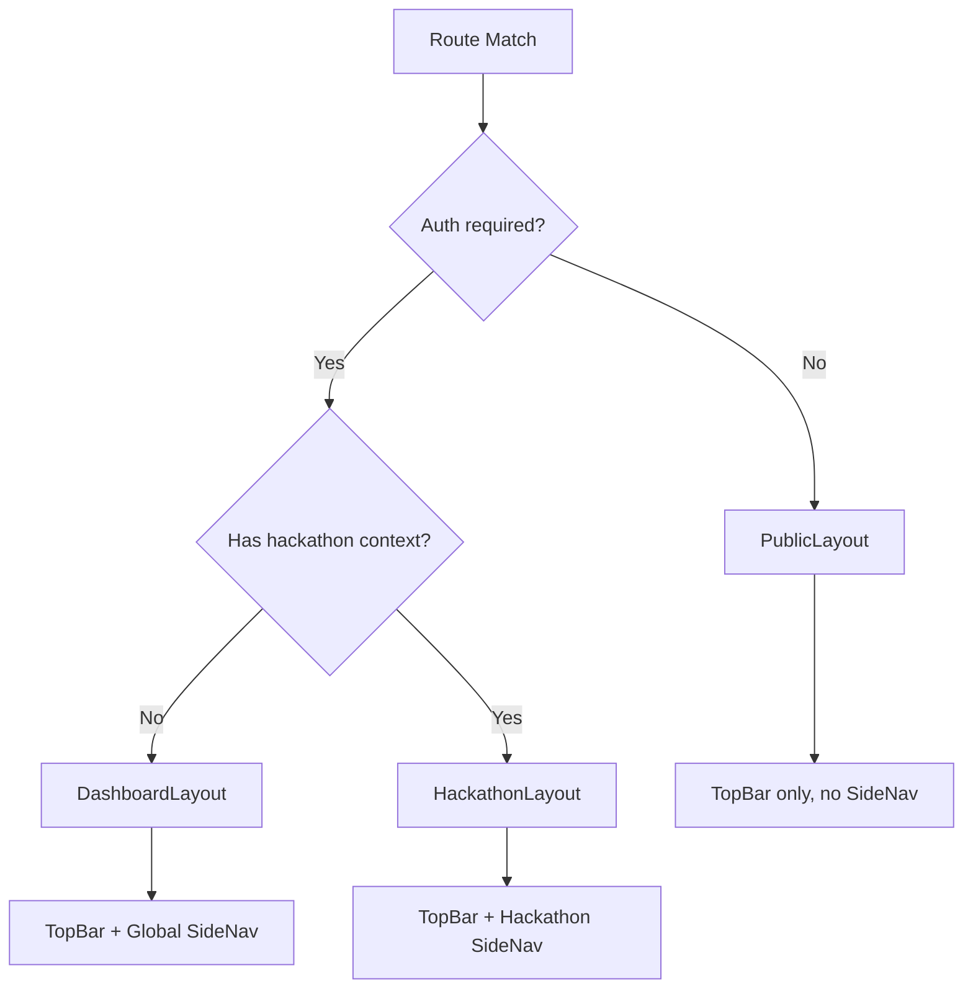
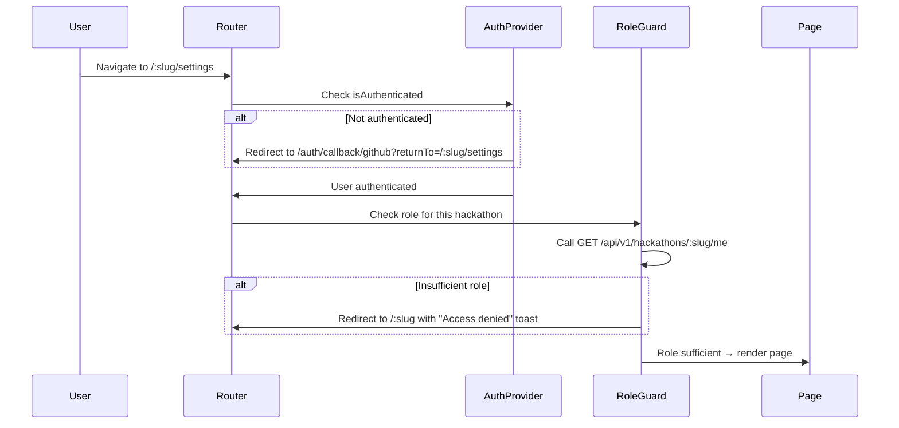
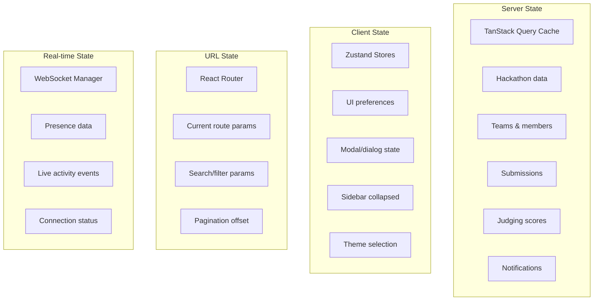
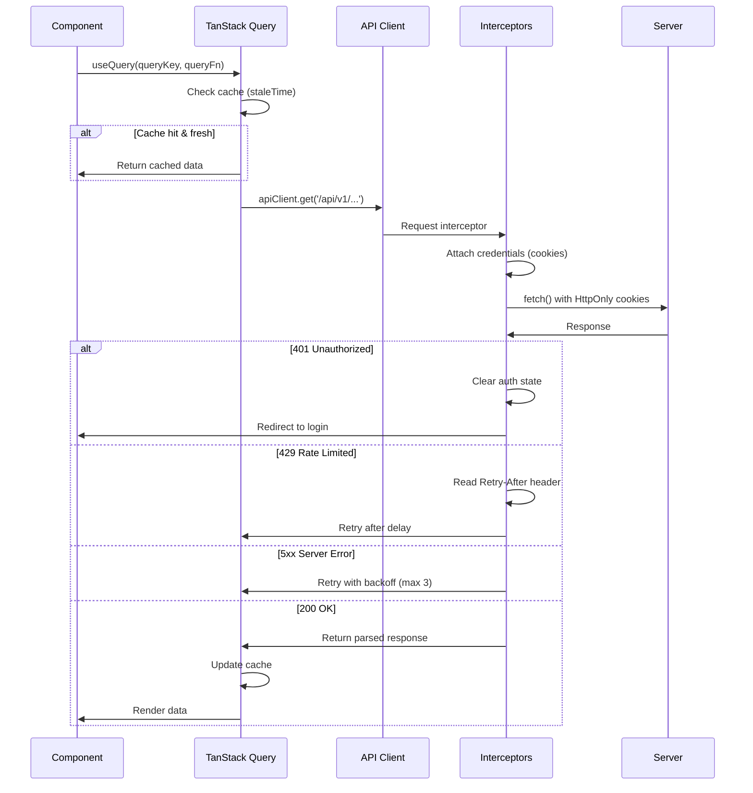
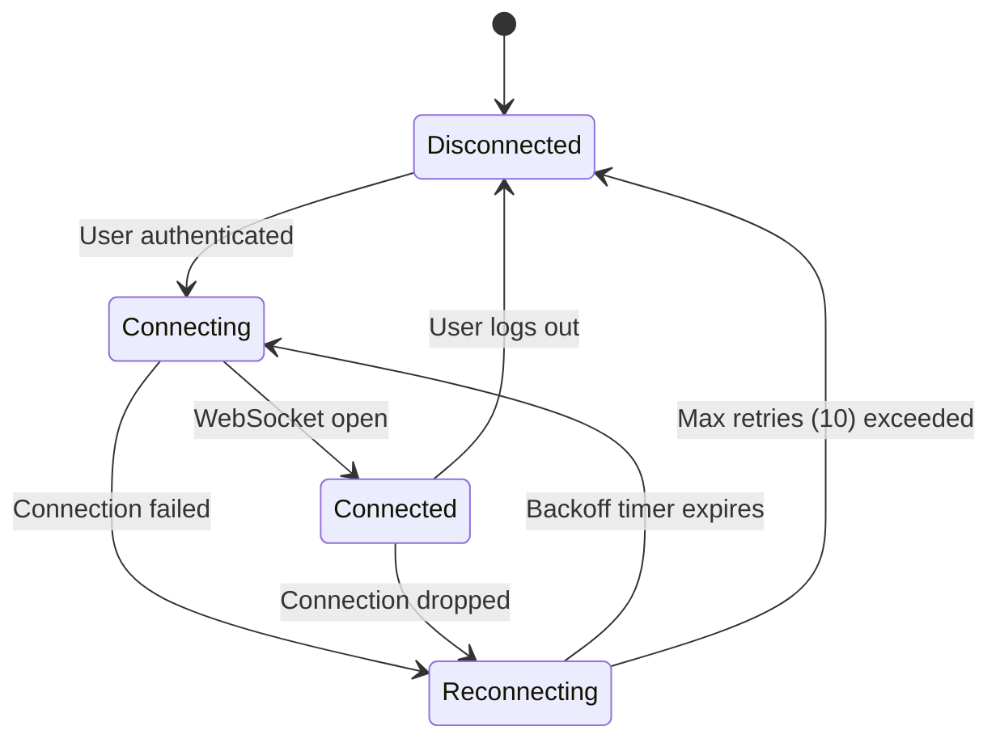
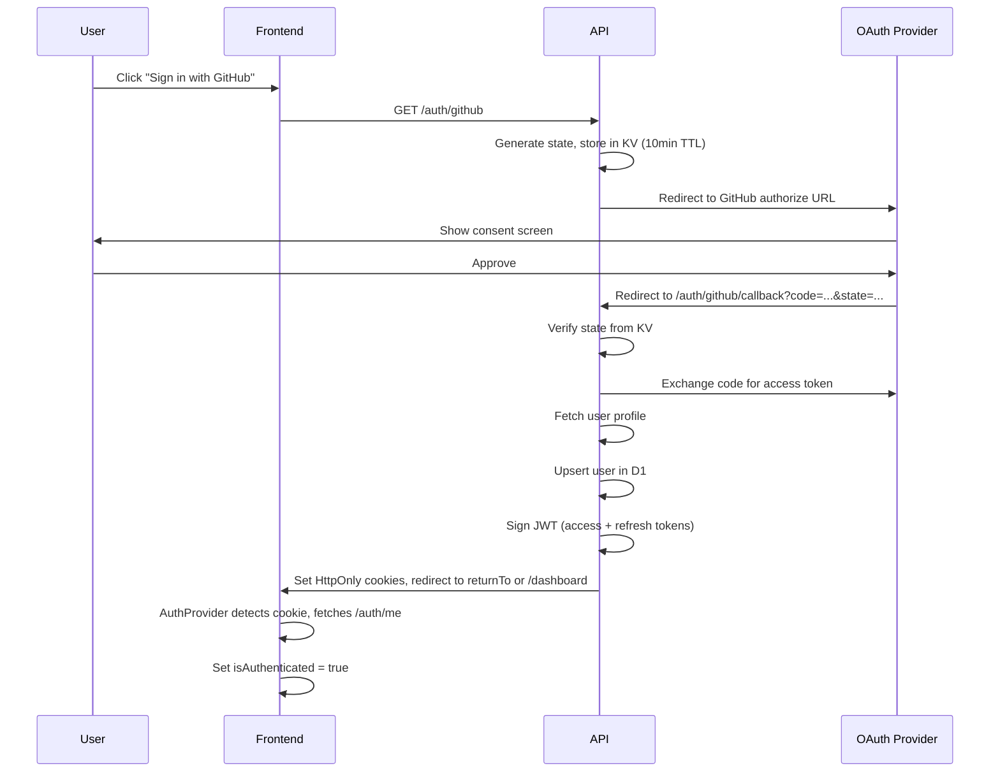
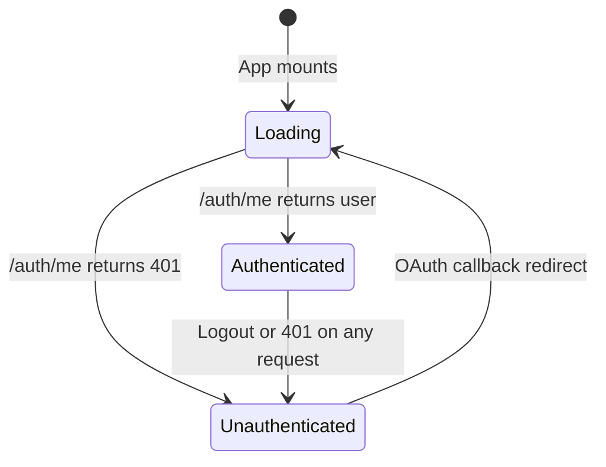
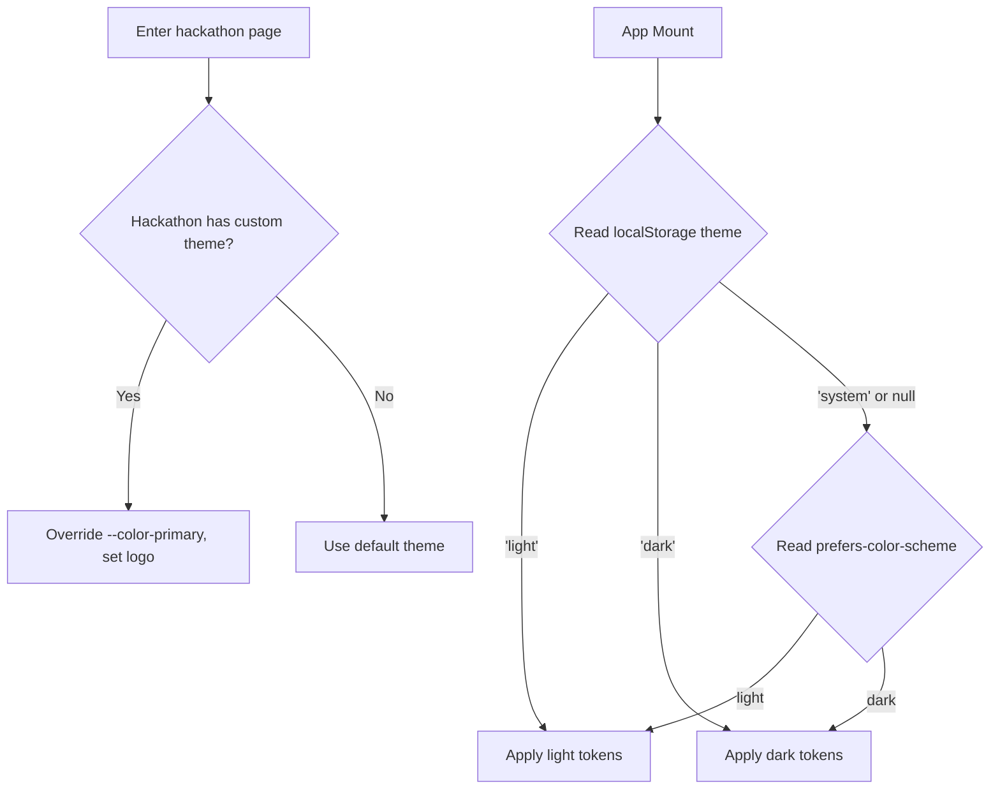
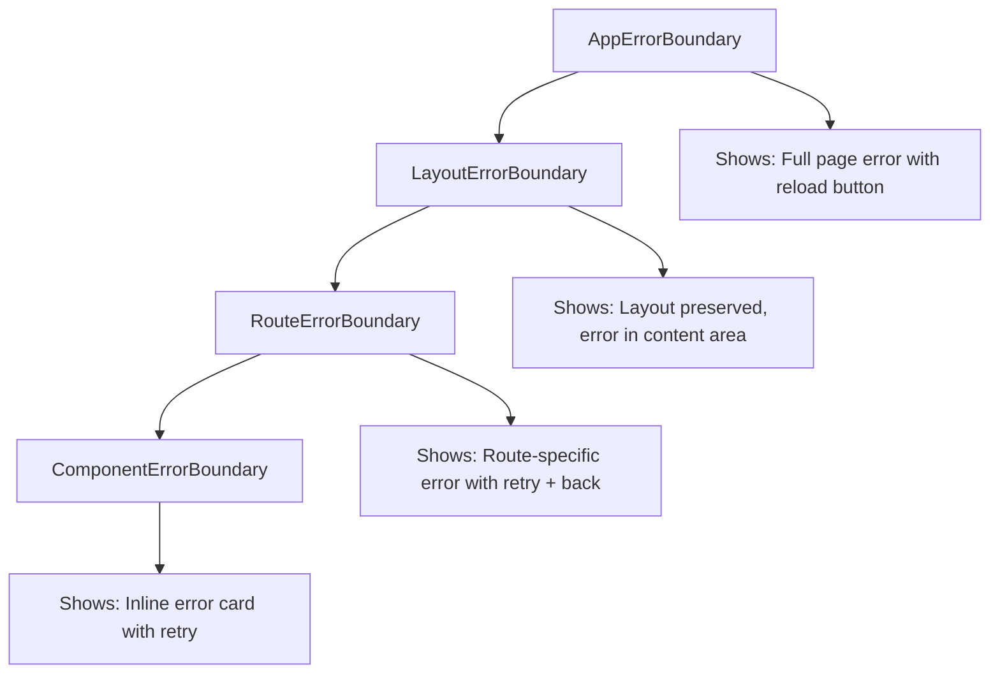
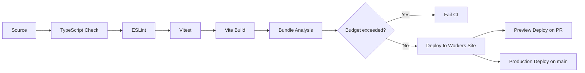

# 13 — Frontend Architecture

> React SPA with component-driven design, real-time data flow, accessibility-first development, and strict performance budgets — all running on Cloudflare Workers Sites at the edge. Phase 1 uses invite-only participation (no public registration), GitHub as the sole VCS provider, 5-state hackathon lifecycle with rounds-based elimination, and email + in-app as the only notification channels.

---

## Table of Contents

1. [Design Goals](#design-goals)
2. [Technology Stack](#technology-stack)
3. [Application Shell](#application-shell)
4. [Routing Architecture](#routing-architecture)
5. [Component Hierarchy](#component-hierarchy)
6. [State Management](#state-management)
7. [Data Fetching Layer](#data-fetching-layer)
8. [Real-time Integration](#real-time-integration)
9. [Authentication Flow](#authentication-flow)
10. [Theming & Design System](#theming--design-system)
11. [Accessibility](#accessibility)
12. [Performance Budget](#performance-budget)
13. [Error Handling](#error-handling)
14. [Testing Strategy](#testing-strategy)
15. [Build & Deployment](#build--deployment)
16. [Edge Cases](#edge-cases)
17. [Error Codes](#error-codes)
18. [Decision Log](#decision-log)

---

## Design Goals

| Goal | Target | Rationale |
|------|--------|-----------|
| First Contentful Paint | < 1.2s on 4G | Hackathon participants are often on event Wi-Fi with variable quality |
| Total JS bundle | < 200 KB gzip (initial) | Edge-served SPA must be lean; code-split per route |
| Lighthouse accessibility | ≥ 95 | Hackathons must be inclusive — screen readers, keyboard nav, color contrast |
| Lighthouse performance | ≥ 90 | Users expect snappy interactions during time-constrained events |
| Time to Interactive | < 2.5s on 4G | Critical during submission deadlines when every second matters |
| Offline resilience | Graceful degradation | Show cached data, queue actions, reconnect automatically |
| Real-time latency | < 500ms for live updates | Leaderboard, activity feed, and announcements must feel instant |
| Bundle per route | < 50 KB gzip | Lazy-loaded route chunks keep navigation fast |

---

## Technology Stack

| Layer | Technology | Version | Purpose |
|-------|-----------|---------|---------|
| Framework | React | 18+ | Component model, concurrent features |
| Build tool | Vite | 6+ | Fast HMR, optimized production builds |
| Routing | React Router | v7 | File-convention routing, loaders, actions |
| Styling | Tailwind CSS | v4 | Utility-first, design tokens via CSS variables |
| Component library | shadcn/ui | Latest | Radix-based accessible primitives |
| State (server) | TanStack Query | v5 | Cache, dedup, background refetch, optimistic updates |
| State (client) | Zustand | v5 | Lightweight stores for UI state (modals, sidebars, preferences) |
| Forms | React Hook Form + Zod | Latest | Validation shared with API via `@devsage/shared` |
| Real-time | WebSocket client | Custom | Connects to Real-time Gateway DO (see doc 14) |
| Icons | Lucide React | Latest | Consistent icon set, tree-shakeable |
| Date/time | date-fns | Latest | Lightweight, tree-shakeable date formatting |
| Charts | Recharts | Latest | SVG-based, accessible chart components |
| Hosting | Cloudflare Workers Sites | — | Edge-deployed, global CDN |

### Shared Package Dependency

The frontend imports `@devsage/shared` for:

- **Zod schemas** — same validation on client and server
- **TypeScript types** — API request/response shapes
- **Constants** — role names, hackathon states, error codes
- **Utilities** — slug generation, date formatting helpers

This ensures zero drift between what the API expects and what the frontend sends.

---

## Application Shell

```
┌─────────────────────────────────────────────────────────────────┐
│  TopBar                                                          │
│  ┌──────────┐  ┌──────────────────────────────┐  ┌────────────┐ │
│  │  Logo     │  │  Breadcrumbs / Context       │  │  User Menu │ │
│  └──────────┘  └──────────────────────────────┘  └────────────┘ │
├─────────────────────────────────────────────────────────────────┤
│        │                                                         │
│  Side  │  Main Content Area                                      │
│  Nav   │  ┌─────────────────────────────────────────────────┐   │
│        │  │                                                   │   │
│  ┌──┐  │  │  <Outlet />                                       │   │
│  │  │  │  │  (Route-specific content)                         │   │
│  │  │  │  │                                                   │   │
│  │  │  │  │                                                   │   │
│  │  │  │  └─────────────────────────────────────────────────┘   │
│  └──┘  │                                                         │
│        │  ┌─────────────────────────────────────────────────┐   │
│        │  │  CommandPalette (⌘K)                              │   │
│        │  └─────────────────────────────────────────────────┘   │
├─────────────────────────────────────────────────────────────────┤
│  Toast Stack (bottom-right, max 3 visible)                       │
│  Real-time Connection Indicator (bottom-left)                    │
└─────────────────────────────────────────────────────────────────┘
```

### Shell Responsibilities

| Component | Responsibility |
|-----------|---------------|
| `TopBar` | Logo, breadcrumb navigation, notification bell with unread count, user avatar/menu |
| `SideNav` | Context-aware navigation — changes based on whether user is in a hackathon, admin panel, or global view |
| `Outlet` | React Router outlet for route-specific content |
| `CommandPalette` | ⌘K / Ctrl+K global search — hackathons, teams, users, actions |
| `ToastStack` | Stacked notifications for success/error/info feedback |
| `ConnectionIndicator` | WebSocket connection status dot (green/yellow/red) |

### Layout Variants



| Layout | Used For | SideNav Content |
|--------|----------|-----------------|
| `PublicLayout` | Landing, login, public hackathon pages | None — full-width content |
| `DashboardLayout` | User dashboard, settings, workspace management | My Hackathons, Teams, Settings, Admin |
| `HackathonLayout` | Everything inside a specific hackathon | Overview, Teams, Submissions, Judging, Activity, Settings |

---

## Routing Architecture

### Route Structure

```
/                                   → Landing page (PublicLayout)
/auth/callback/:provider            → OAuth callback handler
/dashboard                          → User dashboard (DashboardLayout)
/dashboard/settings                 → User settings
/dashboard/notifications            → Notification center

/hackathons                         → Browse hackathons (PublicLayout)
/hackathons/new                     → Create hackathon wizard (DashboardLayout)

/:slug                              → Hackathon landing (PublicLayout or HackathonLayout)
/:slug/accept-invite                → Accept invitation flow (invite-only)
/:slug/teams                        → Team listing
/:slug/teams/:teamId                → Team detail
/:slug/rounds                       → Rounds overview (active/completed)
/:slug/rounds/:roundId              → Round detail (submissions for that round)
/:slug/submissions                  → Submission gallery
/:slug/submissions/:submissionId    → Submission detail + diff viewer
/:slug/judging                      → Judging dashboard (judge+ role)
/:slug/judging/:submissionId        → Score submission
/:slug/leaderboard                  → Public leaderboard
/:slug/activity                     → Real-time activity feed
/:slug/announcements                → Announcements timeline
/:slug/sponsors                     → Sponsor showcase
/:slug/analytics                    → Analytics dashboard (organizer+ role)
/:slug/settings                     → Hackathon settings (organizer+ role)
/:slug/settings/judges              → Judge management
/:slug/settings/tracks              → Track/category management
/:slug/settings/rounds              → Round configuration
/:slug/settings/invites             → Invite management

/admin                              → Platform admin (platform_admin role)
/admin/workspaces                   → Workspace management
/admin/users                        → User management
/admin/audit                        → Global audit log viewer

/*                                  → 404 Not Found
```

> **Phase 2**: Additional routes will be added for `/:slug/mentors` (mentor directory and request system), `/:slug/settings/webhooks` (outbound webhook configuration), and `/:slug/settings/roles` (custom role management) when those features are introduced.

### Route Protection



### Route Guard Components

```typescript
// ProtectedRoute — requires authentication
interface ProtectedRouteProps {
  children: React.ReactNode;
  returnTo?: string;  // URL to redirect back after login
}

// RoleGuard — requires minimum role within a hackathon
interface RoleGuardProps {
  children: React.ReactNode;
  minRole: 'team_member' | 'team_lead' | 'judge' | 'co_organizer' | 'organizer';
  hackathonSlug: string;
  fallback?: React.ReactNode;  // Show instead of redirect
}

// FeatureGate — conditional rendering based on hackathon config
interface FeatureGateProps {
  children: React.ReactNode;
  feature: 'sponsors' | 'analytics' | 'rounds';
  hackathonSlug: string;
  fallback?: React.ReactNode;
}
```

### Code Splitting Strategy

Every route is lazy-loaded. The router configuration uses `React.lazy()` with route-level chunks:

```typescript
// Route-level code splitting
const Dashboard = lazy(() => import('./pages/Dashboard'));
const HackathonLanding = lazy(() => import('./pages/HackathonLanding'));
const JudgingDashboard = lazy(() => import('./pages/JudgingDashboard'));
const AnalyticsDashboard = lazy(() => import('./pages/AnalyticsDashboard'));

// Heavy components also split independently
const MarkdownEditor = lazy(() => import('./components/MarkdownEditor'));
const DiffViewer = lazy(() => import('./components/DiffViewer'));
const ChartDashboard = lazy(() => import('./components/ChartDashboard'));
```

Prefetch strategy: when a user hovers over a navigation link for > 100ms, prefetch that route's chunk.

---

## Component Hierarchy

### Component Categories

```
components/
├── ui/                  # shadcn/ui primitives (Button, Dialog, Card, etc.)
├── layout/              # Shell components (TopBar, SideNav, Breadcrumbs)
├── common/              # Shared business components
│   ├── UserAvatar.tsx
│   ├── RoleBadge.tsx
│   ├── TimeAgo.tsx
│   ├── StatusBadge.tsx
│   ├── EmptyState.tsx
│   ├── LoadingSkeleton.tsx
│   ├── ErrorBoundary.tsx
│   ├── InfiniteScroll.tsx
│   └── CommandPalette.tsx
├── hackathon/           # Hackathon-specific components
│   ├── HackathonCard.tsx
│   ├── StateIndicator.tsx
│   ├── RoundIndicator.tsx
│   ├── CountdownTimer.tsx
│   ├── InviteAcceptance.tsx
│   └── AnnouncementBanner.tsx
├── team/                # Team components
│   ├── TeamCard.tsx
│   ├── MemberList.tsx
│   ├── InviteDialog.tsx
│   ├── SkillTagSelector.tsx
│   └── TeamDiscoveryGrid.tsx
├── submission/          # Submission components
│   ├── SubmissionCard.tsx
│   ├── DiffViewer.tsx
│   ├── ArtifactList.tsx
│   ├── ValidationStatus.tsx
│   └── SubmissionTimeline.tsx
├── judging/             # Judging components
│   ├── RubricForm.tsx
│   ├── ScoreSlider.tsx
│   ├── LeaderboardTable.tsx
│   └── JudgeAssignmentGrid.tsx
├── notification/        # Notification components
│   ├── NotificationBell.tsx
│   ├── NotificationList.tsx
│   ├── NotificationPreferences.tsx
│   └── ToastProvider.tsx
├── analytics/           # Analytics/chart components
│   ├── MetricCard.tsx
│   ├── TimeSeriesChart.tsx
│   ├── FunnelChart.tsx
│   ├── HeatmapCalendar.tsx
│   └── ExportButton.tsx
└── sponsor/             # Sponsor components
    ├── SponsorTierCard.tsx
    └── SponsorShowcase.tsx
```

> **Phase 2**: Additional component directories will be added for `mentor/` (mentorship system — MentorCard, SessionScheduler, MentorRequestForm, FeedbackForm), `sponsor/LeadCaptureForm` (sponsor lead capture), and `judging/AudienceVotingCard` (audience voting) when those features are introduced.

### Component Design Principles

| Principle | Implementation |
|-----------|---------------|
| Composition over configuration | Small, focused components composed together — no mega-components with 20+ props |
| Controlled by default | All form inputs are controlled via React Hook Form |
| Accessible primitives | All interactive components extend shadcn/ui (built on Radix) |
| Loading states | Every data-dependent component has a skeleton loading state |
| Error boundaries | Each route wrapped in error boundary; shows retry button |
| Responsive | Mobile-first breakpoints: sm(640), md(768), lg(1024), xl(1280) |

---

## State Management

### State Categories



### Server State (TanStack Query)

All API data flows through TanStack Query. No raw `fetch()` calls in components.

```typescript
// Query key factory — consistent, predictable cache keys
const queryKeys = {
  hackathons: {
    all: ['hackathons'] as const,
    list: (filters: HackathonFilters) => ['hackathons', 'list', filters] as const,
    detail: (slug: string) => ['hackathons', slug] as const,
    me: (slug: string) => ['hackathons', slug, 'me'] as const,
  },
  teams: {
    all: (slug: string) => ['hackathons', slug, 'teams'] as const,
    detail: (slug: string, teamId: string) => ['hackathons', slug, 'teams', teamId] as const,
    members: (slug: string, teamId: string) => ['hackathons', slug, 'teams', teamId, 'members'] as const,
  },
  rounds: {
    all: (slug: string) => ['hackathons', slug, 'rounds'] as const,
    detail: (slug: string, roundId: string) => ['hackathons', slug, 'rounds', roundId] as const,
  },
  submissions: {
    all: (slug: string) => ['hackathons', slug, 'submissions'] as const,
    detail: (slug: string, subId: string) => ['hackathons', slug, 'submissions', subId] as const,
  },
  judging: {
    scores: (slug: string, subId: string) => ['hackathons', slug, 'judging', subId, 'scores'] as const,
    leaderboard: (slug: string) => ['hackathons', slug, 'leaderboard'] as const,
  },
  notifications: {
    all: ['notifications'] as const,
    unreadCount: ['notifications', 'unread-count'] as const,
  },
} as const;
```

#### Query Defaults

| Setting | Value | Rationale |
|---------|-------|-----------|
| `staleTime` | 30 seconds | Balance freshness vs. API load |
| `gcTime` | 5 minutes | Keep inactive data for back-navigation |
| `refetchOnWindowFocus` | true | Catch updates when user returns to tab |
| `refetchOnReconnect` | true | Sync after network restoration |
| `retry` | 3 with exponential backoff | Handle transient failures |

#### Optimistic Updates

Mutations that modify visible data use optimistic updates for instant feedback:

```typescript
// Pattern: optimistic update with rollback
interface OptimisticMutationOptions<TData, TVariables> {
  mutationFn: (variables: TVariables) => Promise<TData>;
  queryKey: readonly unknown[];
  optimisticUpdate: (old: TData, variables: TVariables) => TData;
  onError?: (error: Error, variables: TVariables, rollback: TData) => void;
}
```

Optimistic updates are applied to:
- Team join/leave
- Submission scoring (judge view)
- Notification mark-as-read
- Announcement publish
- Role assignment changes

### Client State (Zustand)

Minimal client-only state in focused stores:

```typescript
// UI preferences store — persisted to localStorage
interface UIPreferencesStore {
  sidebarCollapsed: boolean;
  theme: 'light' | 'dark' | 'system';
  compactMode: boolean;
  setSidebarCollapsed: (collapsed: boolean) => void;
  setTheme: (theme: 'light' | 'dark' | 'system') => void;
  toggleCompactMode: () => void;
}

// Command palette store — ephemeral
interface CommandPaletteStore {
  isOpen: boolean;
  recentCommands: string[];
  open: () => void;
  close: () => void;
  addRecent: (command: string) => void;
}

// Toast store — ephemeral
interface ToastStore {
  toasts: Toast[];
  addToast: (toast: Omit<Toast, 'id'>) => string;
  removeToast: (id: string) => void;
  clearAll: () => void;
}
```

### URL State

All filterable/shareable state lives in URL search params:

```typescript
// Example: submission gallery filters
// /:slug/submissions?track=ai&status=submitted&sort=recent&page=2

interface SubmissionFilters {
  track?: string;
  status?: 'submitted' | 'validated' | 'disqualified';
  sort?: 'recent' | 'score' | 'team';
  page?: number;
}
```

This ensures:
- Shareable links with filters intact
- Browser back/forward preserves filter state
- No client state to sync

---

## Data Fetching Layer

### API Client

```typescript
// Centralized API client wrapping fetch
interface ApiClient {
  get<T>(path: string, options?: RequestOptions): Promise<ApiResponse<T>>;
  post<T>(path: string, body: unknown, options?: RequestOptions): Promise<ApiResponse<T>>;
  put<T>(path: string, body: unknown, options?: RequestOptions): Promise<ApiResponse<T>>;
  patch<T>(path: string, body: unknown, options?: RequestOptions): Promise<ApiResponse<T>>;
  delete<T>(path: string, options?: RequestOptions): Promise<ApiResponse<T>>;
}

interface RequestOptions {
  signal?: AbortSignal;
  headers?: Record<string, string>;
  timeout?: number;  // Default: 10_000ms
}

// Standard API response envelope (matches API doc)
interface ApiResponse<T> {
  ok: true;
  data: T;
  meta?: {
    total?: number;
    limit?: number;
    offset?: number;
    hasMore?: boolean;
  };
}

interface ApiError {
  ok: false;
  error: {
    code: string;
    message: string;
    details?: Record<string, unknown>;
  };
}
```

### Request Flow



### Request Interceptors

| Interceptor | Trigger | Behavior |
|-------------|---------|----------|
| Auth redirect | 401 response | Clear auth context, redirect to login with `returnTo` |
| Rate limit | 429 response | Parse `Retry-After`, delay retry, show toast |
| Server error | 5xx response | Retry with exponential backoff (1s, 2s, 4s) |
| Network error | `fetch()` throws | Show "Connection lost" banner, retry on reconnect |
| Timeout | No response in 10s | Abort request, show timeout error |

---

## Real-time Integration

The frontend connects to the Real-time Gateway Durable Object (detailed in doc 14) via WebSocket.

### Connection Lifecycle



### WebSocket Manager

```typescript
interface WebSocketManager {
  // Connection
  connect(hackathonId: string): void;
  disconnect(): void;
  getStatus(): 'connected' | 'connecting' | 'reconnecting' | 'disconnected';

  // Subscriptions
  subscribe(channel: string, handler: (event: RealtimeEvent) => void): () => void;
  unsubscribe(channel: string): void;

  // Channels
  joinChannel(channel: string): void;
  leaveChannel(channel: string): void;

  // Presence
  getPresence(channel: string): PresenceUser[];
  onPresenceChange(handler: (users: PresenceUser[]) => void): () => void;
}

// Channel naming convention
type Channel =
  | `hackathon:${string}`              // Global hackathon events
  | `hackathon:${string}:activity`     // Activity feed
  | `hackathon:${string}:announcements`// Announcements
  | `hackathon:${string}:leaderboard`  // Score updates
  | `hackathon:${string}:team:${string}` // Team-specific events
  | `user:${string}:notifications`;    // Personal notifications
```

### Cache Invalidation via WebSocket

When the server pushes a real-time event, the frontend invalidates the corresponding TanStack Query cache:

```typescript
// Event-to-query mapping
const eventQueryMap: Record<string, (event: RealtimeEvent) => readonly unknown[]> = {
  'submission.created':    (e) => queryKeys.submissions.all(e.hackathonSlug),
  'submission.validated':  (e) => queryKeys.submissions.detail(e.hackathonSlug, e.submissionId),
  'score.submitted':       (e) => queryKeys.judging.leaderboard(e.hackathonSlug),
  'team.member_joined':    (e) => queryKeys.teams.members(e.hackathonSlug, e.teamId),
  'hackathon.state_changed': (e) => queryKeys.hackathons.detail(e.hackathonSlug),
  'round.started':           (e) => queryKeys.hackathons.detail(e.hackathonSlug),
  'team.eliminated':         (e) => queryKeys.teams.all(e.hackathonSlug),
  'announcement.created':  (e) => queryKeys.hackathons.detail(e.hackathonSlug),
};
```

On receiving a WebSocket event:
1. Show toast notification (if relevant)
2. Invalidate matching query key → triggers background refetch
3. If user is on the affected page, data updates automatically

### SSE Fallback

If WebSocket connection fails after 3 attempts, the client falls back to Server-Sent Events:

```typescript
interface SSEFallback {
  connect(hackathonSlug: string): EventSource;
  // Endpoint: GET /api/v1/hackathons/:slug/events/stream
  // Reconnects automatically via EventSource spec
}
```

---

## Authentication Flow

### OAuth Login Sequence



### Auth Context

```typescript
interface AuthContextValue {
  user: User | null;
  isAuthenticated: boolean;
  isLoading: boolean;         // True during initial /auth/me check
  logout: () => Promise<void>;
  loginWithGithub: (returnTo?: string) => void;
  loginWithGoogle: (returnTo?: string) => void;
}

interface User {
  id: string;
  username: string;
  displayName: string;
  avatarUrl: string;
  email: string;
  provider: 'github' | 'google';
  createdAt: string;
}
```

### Auth State Machine



---

## Theming & Design System

### Design Tokens

All design tokens are CSS custom properties, enabling runtime theme switching without re-bundling:

```typescript
interface DesignTokens {
  // Colors (HSL values for Tailwind v4 compatibility)
  '--color-background': string;
  '--color-foreground': string;
  '--color-primary': string;
  '--color-primary-foreground': string;
  '--color-secondary': string;
  '--color-muted': string;
  '--color-accent': string;
  '--color-destructive': string;
  '--color-border': string;
  '--color-ring': string;

  // Spacing scale (rem-based)
  '--spacing-xs': string;   // 0.25rem
  '--spacing-sm': string;   // 0.5rem
  '--spacing-md': string;   // 1rem
  '--spacing-lg': string;   // 1.5rem
  '--spacing-xl': string;   // 2rem

  // Radius
  '--radius-sm': string;    // 0.25rem
  '--radius-md': string;    // 0.5rem
  '--radius-lg': string;    // 0.75rem
  '--radius-full': string;  // 9999px

  // Typography
  '--font-sans': string;
  '--font-mono': string;
}
```

### Theme System

| Feature | Implementation |
|---------|---------------|
| Light/Dark/System | `prefers-color-scheme` media query + manual override stored in localStorage |
| Per-hackathon branding | Organizers set primary color + logo → applied via CSS variable override on hackathon pages |
| High contrast mode | Additional token set for WCAG AAA compliance |
| Reduced motion | Respects `prefers-reduced-motion` — disables animations, transitions |

### Theme Application



---

## Accessibility

### Compliance Target

WCAG 2.1 Level AA across all interactive surfaces. Level AAA for color contrast on critical text (deadlines, error messages, scores).

### Implementation Checklist

| Requirement | Implementation |
|-------------|---------------|
| Keyboard navigation | All interactive elements focusable, logical tab order, skip-to-main link |
| Screen reader support | ARIA labels, live regions for dynamic content, semantic HTML |
| Color contrast | Minimum 4.5:1 for normal text, 3:1 for large text (enforced by design tokens) |
| Focus indicators | Visible focus ring (2px solid, offset 2px) on all interactive elements |
| Form accessibility | Labels associated via `htmlFor`, error messages via `aria-describedby`, required fields via `aria-required` |
| Dynamic content | `aria-live="polite"` for toasts, `aria-live="assertive"` for errors |
| Reduced motion | `prefers-reduced-motion: reduce` disables all CSS transitions and JS animations |
| Alt text | All informational images have descriptive alt text; decorative images use `alt=""` |
| Heading hierarchy | Strict h1 → h2 → h3 nesting, one h1 per page |
| Landmark regions | `<header>`, `<nav>`, `<main>`, `<aside>`, `<footer>` for assistive navigation |

### Live Region Strategy

```typescript
// Real-time updates announced to screen readers
interface LiveRegionConfig {
  // Activity feed updates — polite (don't interrupt)
  activityFeed: 'polite';
  // Score changes on leaderboard — polite
  leaderboard: 'polite';
  // Deadline warnings — assertive (interrupt immediately)
  deadlineWarning: 'assertive';
  // Error messages — assertive
  formErrors: 'assertive';
  // Toast notifications — polite
  toasts: 'polite';
  // State transitions — assertive
  stateChange: 'assertive';
}
```

### Keyboard Shortcuts

| Shortcut | Action |
|----------|--------|
| `⌘K` / `Ctrl+K` | Open command palette |
| `Escape` | Close modal/dialog/palette |
| `?` | Show keyboard shortcut help (when not in input) |
| `G then D` | Go to dashboard |
| `G then T` | Go to teams (within hackathon) |
| `G then S` | Go to submissions (within hackathon) |
| `G then L` | Go to leaderboard (within hackathon) |
| `N` | Next item in list |
| `P` | Previous item in list |
| `Enter` | Open selected item |

---

## Performance Budget

### Bundle Size Budget

| Chunk | Max Size (gzip) | Contents |
|-------|----------------|----------|
| `vendor.js` | 80 KB | React, React DOM, React Router |
| `app.js` | 40 KB | App shell, layout, auth, routing |
| `query.js` | 15 KB | TanStack Query + Zustand |
| `ui.js` | 30 KB | shadcn/ui components (tree-shaken) |
| Route chunks (each) | 50 KB | Individual page + its unique components |
| Total initial | < 200 KB | vendor + app + query + ui |

### Performance Metrics

| Metric | Target | Measurement |
|--------|--------|-------------|
| First Contentful Paint | < 1.2s | Lighthouse (4G throttle) |
| Largest Contentful Paint | < 2.0s | Lighthouse (4G throttle) |
| Time to Interactive | < 2.5s | Lighthouse (4G throttle) |
| Cumulative Layout Shift | < 0.05 | Lighthouse |
| First Input Delay | < 50ms | Lighthouse |
| Total Blocking Time | < 200ms | Lighthouse |

### Optimization Techniques

| Technique | Implementation |
|-----------|---------------|
| Code splitting | Route-level via `React.lazy()` + `Suspense` |
| Prefetching | Hover-triggered route prefetch (100ms delay) |
| Image optimization | ``, WebP with PNG fallback |
| Font loading | `font-display: swap`, preload critical fonts |
| CSS | Tailwind v4 JIT — only ships used utilities |
| Tree shaking | ESM imports, sideEffects: false in package.json |
| Compression | Brotli (Cloudflare Workers Sites automatic) |
| Caching | Immutable hashed assets (1yr cache), HTML no-cache |
| Skeleton screens | Content-shaped placeholders during loading |
| Virtual scrolling | `@tanstack/react-virtual` for long lists (teams, submissions, activity) |

### Performance Monitoring

```typescript
// Web Vitals reporting
interface PerformanceReporting {
  // Collected metrics
  metrics: ['FCP', 'LCP', 'TTI', 'CLS', 'FID', 'TBT'];
  // Report to
  endpoint: 'POST /api/v1/telemetry/vitals';
  // Sampling rate
  sampleRate: 0.1;  // 10% of sessions
  // Include
  metadata: {
    route: string;
    connectionType: string;
    deviceMemory: number;
    hardwareConcurrency: number;
  };
}
```

---

## Error Handling

### Error Boundary Hierarchy



### Error Display Patterns

| Error Type | Display | User Action |
|------------|---------|-------------|
| Network error | Banner at top: "Connection lost. Retrying..." | Automatic retry |
| 401 Unauthorized | Redirect to login | Login |
| 403 Forbidden | Inline message: "You don't have access to this resource" | Request access or go back |
| 404 Not Found | Full page: "Page not found" with search + home link | Navigate elsewhere |
| 422 Validation | Inline field errors below inputs | Fix and resubmit |
| 429 Rate Limited | Toast: "Too many requests. Try again in {n}s" | Wait |
| 500 Server Error | Inline error card with retry button | Retry |
| WebSocket disconnect | Status dot turns red, banner: "Real-time updates paused" | Automatic reconnect |

### Error Reporting

```typescript
interface ErrorReport {
  message: string;
  stack?: string;
  componentStack?: string;  // React error boundary info
  route: string;
  userId?: string;
  timestamp: string;
  metadata: {
    userAgent: string;
    viewport: { width: number; height: number };
    memory?: number;
  };
}

// Errors batched and sent to:
// POST /api/v1/telemetry/errors
// Sampling: 100% for 5xx, 10% for client errors
```

---

## Testing Strategy

### Testing Pyramid

| Level | Tool | Scope | Target Coverage |
|-------|------|-------|----------------|
| Unit | Vitest | Individual functions, hooks, utilities | 90% |
| Component | Vitest + Testing Library | Isolated component rendering, interaction | 80% |
| Integration | Vitest + Testing Library | Multi-component flows with mocked API | 70% |
| Visual regression | Chromatic (Storybook) | Screenshot comparison for UI components | Key components |
| Accessibility | axe-core + Testing Library | Automated a11y checks on every component test | 100% of interactive components |
| E2E | Playwright | Critical user flows end-to-end | Happy paths only |

### Test Patterns

```typescript
// Component test pattern
// 1. Render with providers (query client, router, auth)
// 2. Assert initial state (loading skeleton)
// 3. Wait for data (mocked API response)
// 4. Assert rendered content
// 5. Simulate user interaction
// 6. Assert side effects (API calls, navigation, state changes)

interface TestSetupOptions {
  user?: Partial<User>;          // Auth context override
  route?: string;                 // Initial route
  queryData?: Record<string, unknown>;  // Pre-populated query cache
  hackathonRole?: string;         // Role for RoleGuard testing
}
```

### Test File Organization

```
src/
├── components/
│   └── team/
│       ├── TeamCard.tsx
│       └── __tests__/
│           └── TeamCard.test.tsx
├── hooks/
│   └── __tests__/
│       └── useHackathon.test.tsx
├── pages/
│   └── __tests__/
│       └── Dashboard.test.tsx
└── lib/
    └── __tests__/
        └── api.test.ts
```

---

## Build & Deployment

### Build Pipeline



### Build Configuration

```typescript
// Vite build output targets
interface BuildConfig {
  target: 'es2022';              // Modern browsers only
  minify: 'esbuild';             // Fastest minification
  sourcemap: true;               // Always generate for debugging
  cssMinify: true;               // Minify CSS output
  rollupOptions: {
    output: {
      manualChunks: {
        vendor: ['react', 'react-dom', 'react-router'];
        query: ['@tanstack/react-query', 'zustand'];
        ui: ['@radix-ui/*'];
      };
    };
  };
}
```

### Deployment Environments

| Environment | URL | Deploy Trigger | Purpose |
|-------------|-----|---------------|---------|
| Preview | `{branch}.devsage.workers.dev` | Every PR push | Review changes in isolation |
| Staging | `staging.devsage.org` | Merge to `staging` branch | Pre-production validation |
| Production | `devsage.org` | Merge to `main` branch | Live traffic |

### Environment Variables (Client-Side)

All client environment variables use the `VITE_` prefix (exposed at build time):

| Variable | Description | Example |
|----------|-------------|---------|
| `VITE_API_ORIGIN` | API base URL | `https://api.devsage.org` |
| `VITE_WS_ORIGIN` | WebSocket URL | `wss://ws.devsage.org` |
| `VITE_APP_ENV` | Current environment | `production` / `staging` / `preview` |
| `VITE_SENTRY_DSN` | Error reporting endpoint | `https://...@sentry.io/...` |
| `VITE_POSTHOG_KEY` | Analytics key | `phc_...` |

**Security rule**: No secrets in `VITE_*` variables — they are embedded in the JS bundle.

### Dev Proxy Configuration

In development, Vite proxies API requests to the local Wrangler dev server:

| Path Prefix | Proxy Target | Purpose |
|-------------|-------------|---------|
| `/api/v1/` | `http://localhost:8787` | REST API |
| `/auth/` | `http://localhost:8787` | OAuth flows |
| `/hackathons/` | `http://localhost:8787` | Legacy routes |
| `/webhooks/` | `http://localhost:8787` | Webhook endpoints |

---

## Edge Cases

| Scenario | Behavior |
|----------|----------|
| User opens app with expired JWT | `/auth/me` returns 401 → redirect to login, preserve current URL as `returnTo` |
| User has app open during hackathon state transition | WebSocket pushes `state_changed` event → invalidate hackathon query → UI reflects new state with banner notification |
| Network drops during form submission | Mutation retries 3x with backoff → if all fail, show error with "Save draft locally" option → retry on reconnect |
| User opens same hackathon in multiple tabs | Each tab has its own WebSocket connection → presence shows as single user (server deduplicates) |
| Browser doesn't support WebSocket | Automatic fallback to SSE → reduced functionality (no presence, no bi-directional) |
| JavaScript disabled | Show `<noscript>` message: "DevSage requires JavaScript" |
| Very long team/hackathon names | Truncate with ellipsis at container boundary, full name in tooltip |
| Rapid navigation between routes | Abort in-flight queries for abandoned routes via `AbortController` |
| User submits form, hits back, then forward | React Router restores scroll position, TanStack Query serves from cache |
| Low memory device | Reduce `gcTime` to 1 minute, disable prefetching |
| User's system clock is wrong | All countdown timers use server time from API response headers |
| Very slow connection (< 1 Mbps) | Show degraded UI: disable auto-loading images, simplify animations, show bandwidth warning |
| 1000+ teams in hackathon | Virtual scrolling for team list, pagination for API requests |
| Screen reader navigates leaderboard during live updates | Debounce `aria-live` updates to max 1 per 5 seconds to avoid overwhelming |

---

## Error Codes

| Code | HTTP Status | Condition |
|------|-------------|-----------|
| `NETWORK_ERROR` | — | `fetch()` threw (no connection, DNS failure) |
| `TIMEOUT` | — | Request exceeded 10s timeout |
| `AUTH_EXPIRED` | 401 | JWT expired or invalid |
| `AUTH_REQUIRED` | 401 | Route requires authentication but no session |
| `FORBIDDEN` | 403 | Authenticated but insufficient role for action |
| `NOT_FOUND` | 404 | Resource or route does not exist |
| `VALIDATION_ERROR` | 422 | Form input failed Zod validation |
| `RATE_LIMITED` | 429 | Too many requests, retry after delay |
| `SERVER_ERROR` | 500 | Unexpected server failure |
| `WS_CONNECT_FAILED` | — | WebSocket connection could not be established |
| `WS_DISCONNECTED` | — | WebSocket connection lost unexpectedly |
| `CHUNK_LOAD_FAILED` | — | Lazy-loaded route chunk failed to download (deploy during session) |
| `RENDER_ERROR` | — | React component threw during render (caught by error boundary) |

### Chunk Load Error Recovery

When a lazy-loaded chunk fails (common after deployment when hashes change):

1. Catch the `ChunkLoadError`
2. Show banner: "A new version is available"
3. Offer "Reload" button
4. If user ignores, retry chunk load 3x
5. If still failing, force reload: `window.location.reload()`

---

## Decision Log

| Decision | Choice | Why | Alternatives Considered |
|----------|--------|-----|------------------------|
| State management | TanStack Query + Zustand | Server state (95% of data) maps perfectly to TQ; Zustand handles the remaining UI state without boilerplate | Redux (too much boilerplate), Jotai (similar but less ecosystem), React Context (re-render issues at scale) |
| Styling | Tailwind CSS v4 | Utility-first eliminates naming, design tokens via CSS vars, purges unused styles, pairs with shadcn/ui | CSS Modules (more verbose), styled-components (runtime cost), vanilla CSS (inconsistent) |
| Component library | shadcn/ui (Radix) | Accessible by default, unstyled/customizable, copy-paste model avoids version lock-in | Material UI (opinionated styling), Chakra (heavier), Headless UI (less complete) |
| Routing | React Router v7 | Mature, file-convention support, loaders/actions pattern, nested layouts | TanStack Router (newer/less stable), Next.js (SSR overkill for SPA) |
| Real-time approach | WebSocket + SSE fallback | WebSocket for bidirectional (presence), SSE as graceful degradation | Long polling (wasteful), WebSocket only (no fallback), Firebase (vendor lock) |
| Form handling | React Hook Form + Zod | Uncontrolled by default (performance), Zod resolver shares schemas with API | Formik (heavier, controlled), native forms (no validation DX) |
| Build tool | Vite | Fastest HMR, ESBuild for dev, Rollup for production, ecosystem standard | Webpack (slower), Turbopack (too new), Parcel (less configurable) |
| Hosting | Cloudflare Workers Sites | Same vendor and runtime as API (Workers), global CDN, preview deploys per PR, generous free tier | Cloudflare Pages (separate build system), Vercel (different vendor), Netlify (different vendor), S3+CloudFront (more complex) |
| Charts | Recharts | SVG-based (accessible), React-native API, tree-shakeable, lightweight | Chart.js (canvas-based, less accessible), D3 (too low-level), Nivo (heavier) |
| Virtual scrolling | @tanstack/react-virtual | Same ecosystem as TanStack Query, lightweight, supports variable-height items | react-window (less maintained), react-virtualized (heavier) |
| Error monitoring | Sentry | Industry standard, React integration, source map upload, performance tracing | LogRocket (expensive), Bugsnag (less React support), custom (maintenance burden) |
| Analytics | PostHog | Self-hostable, event tracking + session replay, GDPR-friendly | Mixpanel (more expensive), Amplitude (similar), Google Analytics (privacy concerns) |
