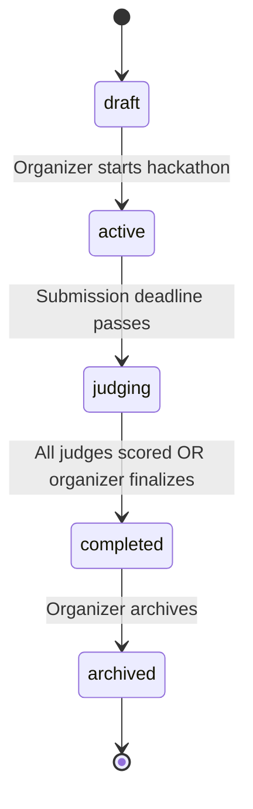
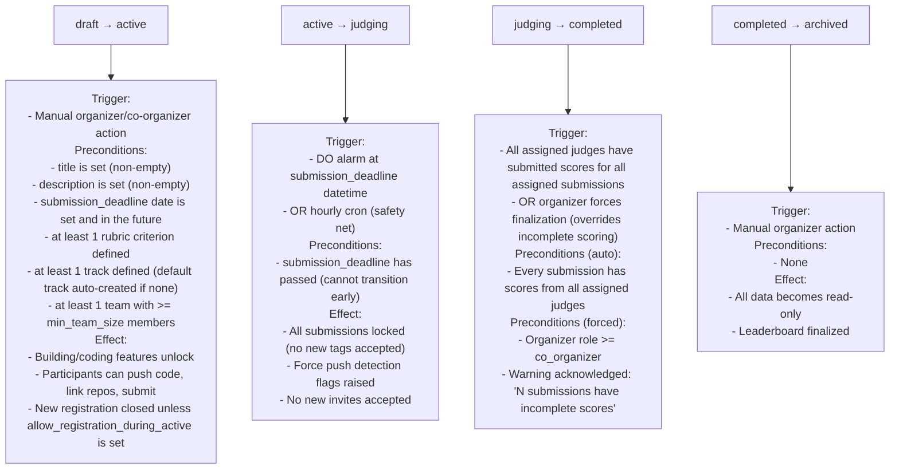
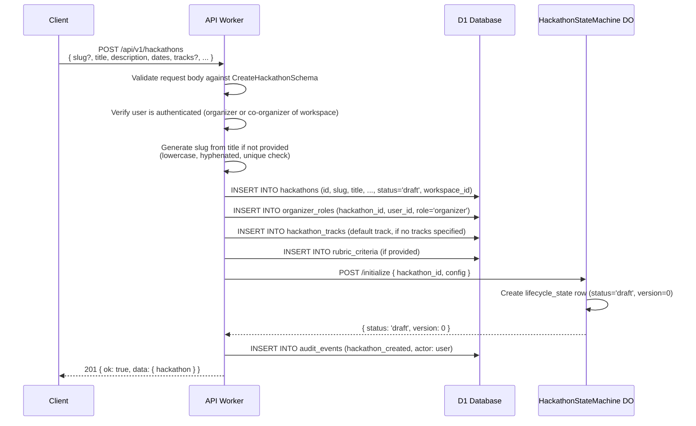
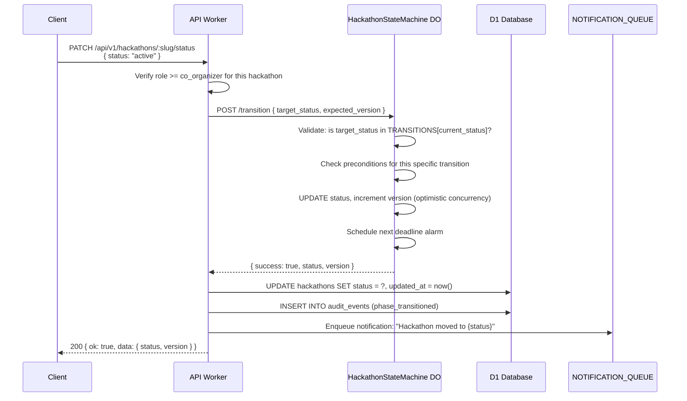
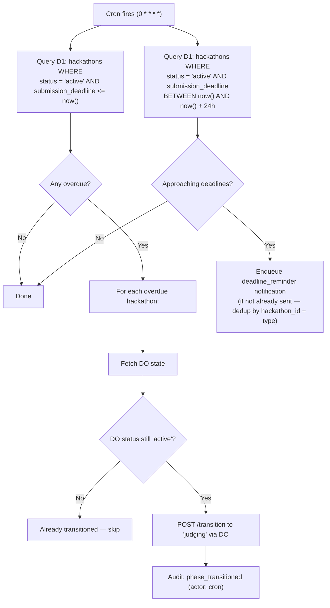
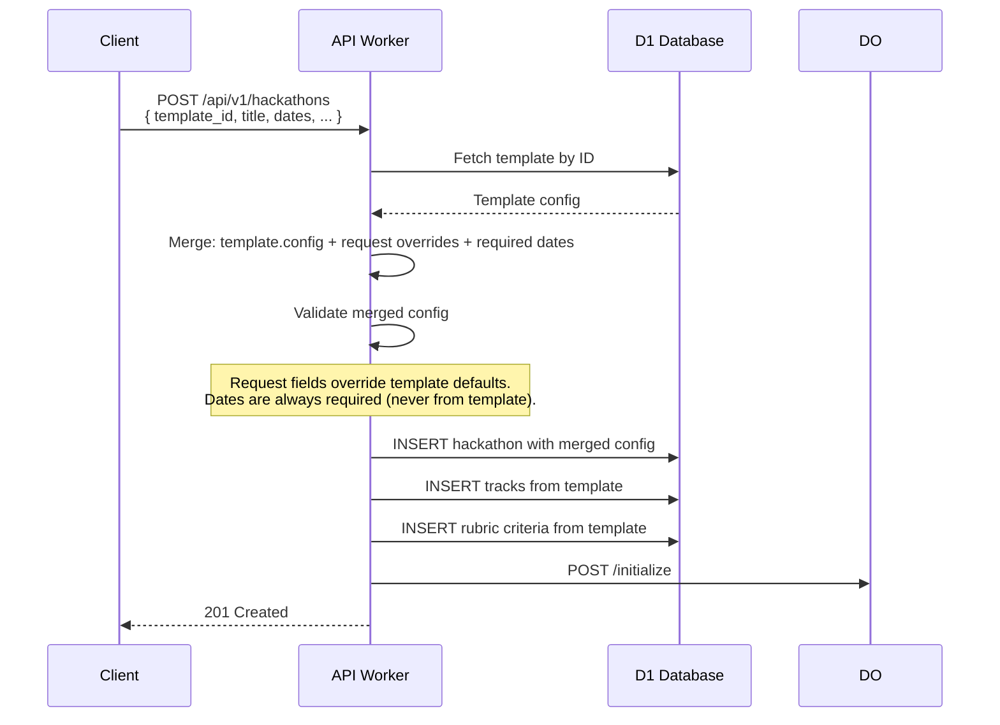
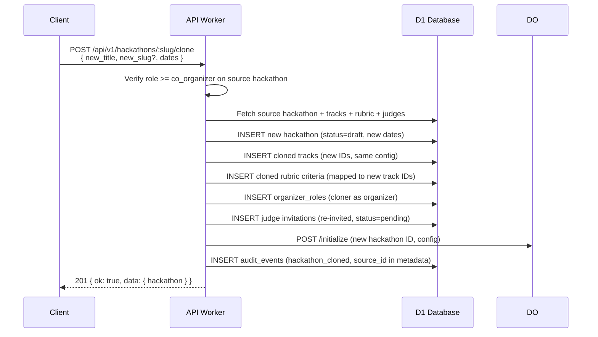

# Hackathon Lifecycle

> Complete specification for the DevSage v3 hackathon lifecycle system. Covers the state machine, phase transitions, Durable Object design, automated deadline enforcement, hackathon templates, multi-track support, custom phases, and configuration. Any developer should be able to implement the entire lifecycle system from this document alone.

---

## Table of Contents

- [Design Goals](#design-goals)
- [State Machine](#state-machine)
- [States and Allowed Actions](#states-and-allowed-actions)
- [Transition Rules](#transition-rules)
- [Durable Object Design](#durable-object-design)
- [Creating a Hackathon](#creating-a-hackathon)
- [Transitioning Phases](#transitioning-phases)
- [Automated Transitions](#automated-transitions)
- [Hackathon Configuration](#hackathon-configuration)
- [Templates](#templates)
- [Multi-Track Hackathons](#multi-track-hackathons)
- [Custom Phases](#custom-phases)
- [Hackathon Cloning](#hackathon-cloning)
- [Branding and Theming](#branding-and-theming)
- [Edge Cases](#edge-cases)
- [Error Codes](#error-codes)
- [Database Tables](#database-tables)
- [Decision Log](#decision-log)

---

## Design Goals

| Goal | Description |
|------|-------------|
| **Single-writer consistency** | All state mutations flow through a single Durable Object instance per hackathon. No race conditions on phase transitions or submission locking. |
| **Forward-only transitions** | The state machine only moves forward. No backward transitions, no state skipping. Prevents accidental rollback of a live hackathon. |
| **Automated deadline enforcement** | Deadlines trigger automatic transitions via DO alarms. A cron job acts as a safety net. No manual intervention required for time-based transitions. |
| **Templateable** | Organizers can save hackathon configurations as reusable templates. Common formats (24-hour, weekend, week-long) ship as platform defaults. |
| **Multi-track support** | A single hackathon can have multiple tracks (e.g., "AI/ML", "Web3", "Social Impact"). Teams select a track at registration. Judges are assigned per track. Leaderboards are per-track and overall. |
| **Custom phases** | Organizers can insert optional custom phases between the standard phases (e.g., "Workshop Day" during active, "Demo Day" between judging and completed). |
| **Idempotent operations** | All state transitions are idempotent — retrying the same transition with the same expected version is safe. |

---

## State Machine

### Core States

Every hackathon progresses through 5 mandatory states. The state machine is forward-only — no backward transitions, no skipping. Registration and team formation happen during the `draft` phase — the participant site (`{slug}.devsage.org`) goes live during draft for this purpose. Late registration during `active` is configurable per hackathon.



### Valid Transitions Map

```typescript
const HACKATHON_STATUS_TRANSITIONS: Record<HackathonStatus, HackathonStatus[]> = {
  draft:     ['active'],
  active:    ['judging'],
  judging:   ['completed'],
  completed: ['archived'],
  archived:  ['completed'],  // Un-archive for score corrections only
};
```

Attempting any transition not in this map returns `INVALID_TRANSITION`. This map is the single source of truth — it lives in the shared package so both API and frontend reference the same definition.

### Custom Phase Insertion

Organizers can insert optional custom phases between standard phases (see [Custom Phases](#custom-phases)). Custom phases do not alter the core state machine — they are sub-states within a standard phase.

---

## States and Allowed Actions

| State | Visibility | Description | Who Can Do What |
|-------|-----------|-------------|-----------------|
| `draft` | Participant site live for registration + team formation | Hackathon is being configured. `{slug}.devsage.org` is live — participants can register and form teams, but cannot push code or submit. | **Organizers/Co-Organizers:** Edit all config (title, description, deadlines, rubric, tracks, branding). Invite co-organizers, judges. Send registration links to participants. Delete hackathon. **Participants:** Register via hackathon link, form teams, invite team members, view hackathon info. **Judges:** Can accept invites. |
| `active` | Full hackathon features live | Hackathon is live. Building and coding begins. | **Participants:** Push code, link repos, submit via git tag, upload supplementary files, update submissions (if under limit). New registration allowed if organizer enabled `allow_registration_during_active`. **Bot:** Tracks commits, detects force pushes, captures tags. **Organizers:** Monitor activity feed, send announcements. Cannot edit deadlines. **Judges:** Can be invited. |
| `judging` | Landing page public, rest invite-only | Submission deadline passed. All submissions are locked. | **Judges:** Score assigned submissions, view code, see AI reviews. **Organizers:** Assign/reassign judges, force finalize, trigger AI reviews. **Participants:** View own submission (read-only), cannot modify. No new invites accepted. |
| `completed` | Landing page public, rest invite-only | All judging is done. Results are visible. | **All invited users:** View leaderboard, final scores, per-criterion breakdown. **Organizers:** Download results (CSV/JSON), publish announcements. **Participants:** View feedback from judges. |
| `archived` | Landing page public, rest invite-only | Historical record. Data preserved indefinitely. | **All invited users:** View only. All data frozen. No mutations allowed except organizer un-archiving (returns to `completed`). |

### Archive and Un-archive

Archiving is a soft operation — it marks the hackathon as read-only but does not delete data. Un-archiving (returning from `archived` to `completed`) is the **only exception** to the forward-only rule. It exists because an organizer may need to correct scores or update results after archiving prematurely.

```typescript
// Exception to forward-only: archived can return to completed
const HACKATHON_STATUS_TRANSITIONS = {
  draft:     ['active'],
  active:    ['judging'],
  judging:   ['completed'],
  completed: ['archived'],
  archived:  ['completed'],  // Un-archive only
};
```

---

## Transition Rules

### Preconditions

Each transition has preconditions that must be satisfied. The DO validates these before allowing the transition.



### Transition Audit

Every transition — whether manual or automated — produces an audit event:

| Field | Value |
|-------|-------|
| `event_type` | `phase_transitioned` |
| `actor_type` | `user` (manual), `cron` (hourly check), `system` (DO alarm) |
| `actor_id` | User ID (manual) or `cron`/`system` |
| `hackathon_id` | The hackathon |
| `metadata` | `{ from_status, to_status, trigger, version }` |

---

## Durable Object Design

### Purpose

One Durable Object instance per hackathon, addressed by hackathon ID. The DO is the single source of truth for:

1. **Current phase/status** — the definitive state, synced to D1 for query convenience
2. **Submission locking** — exactly-once acceptance of git tag submissions (no duplicates, no races)
3. **Deadline enforcement** — alarms fire at exact deadline timestamps
4. **Transition validation** — precondition checks and forward-only enforcement
5. **Optimistic concurrency** — version counter prevents conflicting concurrent transitions

### Storage Model (SQLite-backed)

The DO uses Cloudflare's SQLite-backed Durable Object storage (`new_sqlite_classes`). Three internal tables:

**`lifecycle_state`** — one row per DO (the hackathon's current state)

| Column | Type | Description |
|--------|------|-------------|
| `hackathon_id` | TEXT PK | Same as DO ID |
| `status` | TEXT | Current phase |
| `config` | TEXT | JSON blob: deadlines, limits, tag pattern, flags |
| `version` | INTEGER | Optimistic concurrency counter, starts at 0 |
| `transitioned_at` | TEXT | ISO-8601 timestamp of last transition |

**`submission_locks`** — one row per accepted submission

| Column | Type | Description |
|--------|------|-------------|
| `team_id` | TEXT | Team that submitted |
| `tag_name` | TEXT | Git tag name (e.g., `submission_v1`) |
| `submission_id` | TEXT | UUID of the submission record in D1 |
| `commit_sha` | TEXT | The commit the tag points to |
| `webhook_delivery_id` | TEXT UNIQUE | GitHub webhook delivery ID — deduplication key |
| `locked_at` | TEXT | ISO-8601 |

**`team_submissions`** — one row per team, tracks submission count

| Column | Type | Description |
|--------|------|-------------|
| `team_id` | TEXT PK | Team |
| `submission_count` | INTEGER | How many submissions accepted (compared against `max_submissions_per_team`) |

### DO HTTP Interface

The Worker communicates with the DO via HTTP (Durable Object fetch). These are internal endpoints — not exposed to the public API.

| Method | Path | Request Body | Response | Purpose |
|--------|------|-------------|----------|---------|
| POST | `/initialize` | `{ hackathon_id, config }` | `{ status: 'draft', version: 0 }` | Create initial state. Called once at hackathon creation. |
| GET | `/state` | — | `{ status, version, config, transitioned_at }` | Read current state. |
| POST | `/transition` | `{ target_status, expected_version }` | `{ success, status, version }` | Attempt a state transition. Validates forward-only rule and preconditions. |
| POST | `/accept-submission` | `{ team_id, tag_name, submission_id, commit_sha, webhook_delivery_id }` | `{ accepted: boolean, reason? }` | Lock a submission. Returns `accepted: false` if: status is not `active`, team at submission limit, duplicate `webhook_delivery_id`, or tag doesn't match pattern. |
| GET | `/can-accept-submissions` | — | `{ can_accept: boolean, reason? }` | Quick check for submission acceptance eligibility. |
| POST | `/update-config` | `{ config, expected_version }` | `{ success, version }` | Update config (most fields only allowed in `draft`; description and rules editable in `active`). |

### Optimistic Concurrency

All state-mutating DO operations use version-based optimistic concurrency:

```sql
UPDATE lifecycle_state
SET status = ?, version = version + 1, transitioned_at = ?
WHERE hackathon_id = ? AND version = ?
```

If `rows_affected = 0`, a concurrent modification occurred. The caller should re-read state and retry. The API layer retries up to 3 times before returning `CONCURRENT_MODIFICATION` to the client.

### Alarm Scheduling

When a transition occurs, the DO schedules the next deadline alarm:

| Current State | Alarm Scheduled For | Action on Fire |
|---------------|-------------------|----------------|
| `draft` | None (manual transition to `active`) | — |
| `active` | `submission_deadline` datetime | Auto-transition to `judging`, lock all submissions |
| `judging` | `judging_ends` datetime (if set) | Notify organizer that judging window is closing. Does NOT auto-transition — organizer must finalize or force-complete. |

When an alarm fires:
1. Check which deadline passed
2. Validate the current status matches what the alarm expects (guard against stale alarms)
3. Execute the transition
4. Schedule the next upcoming alarm
5. Write audit event with `actor_type: 'system'`
6. Enqueue notification to organizers: "Hackathon {title} has moved to {new_status}"

---

## Creating a Hackathon



**Slug generation rules:**
- Input: title or explicit slug
- Transform: lowercase, replace spaces with hyphens, strip non-alphanumeric (except hyphens), truncate to 60 chars
- Uniqueness: check D1 for conflicts. On conflict, append `-2`, `-3`, etc.
- Immutable after creation (changing slug would break URLs)

---

## Transitioning Phases



**Why does D1 also store the status?** The DO is the source of truth, but D1 stores a copy for query convenience. Listing hackathons by status (`SELECT * FROM hackathons WHERE status = 'active'`) should not require fetching from every DO instance. The Worker updates D1 immediately after a successful DO transition. In the rare case of a failure between DO transition and D1 update, the cron job reconciles them.

---

## Automated Transitions

### DO Alarm (Precise)

DO alarms fire at the exact deadline timestamp. They are the primary mechanism for time-based transitions.

When the alarm fires:
1. The DO reads its current state
2. Verifies the expected transition is valid (e.g., alarm expected `active → judging` but status is already `judging` — no-op)
3. Executes the transition
4. Schedules the next alarm
5. Returns an audit event payload to the Worker (the Worker writes it to D1)

### Cron Trigger (Hourly Safety Net)

A cron job (`0 * * * *`) runs every hour as a backup for missed DO alarms.



The cron should never be the primary transition mechanism — it exists only to catch DO alarm failures (which are rare but possible during Cloudflare incidents).

---

## Hackathon Configuration

All configuration fields for a hackathon. Set during creation, editable during `draft` only (with minor exceptions noted below).

### Core Fields

| Field | Type | Required | Default | Editable In | Description |
|-------|------|----------|---------|-------------|-------------|
| `slug` | TEXT | Yes | Auto from title | Never (immutable) | URL-safe identifier. Unique across all hackathons. |
| `title` | TEXT | Yes | — | draft | Display name |
| `tagline` | TEXT | No | — | draft | Short one-line description for cards/previews |
| `description` | TEXT | Yes | — | draft, active | Full description (Markdown supported) |
| `rules_md` | TEXT | No | — | draft, active | Competition rules (Markdown) |

### Dates and Deadlines

| Field | Type | Required | Editable In | Constraints |
|-------|------|----------|-------------|-------------|
| `starts_at` | ISO-8601 | Yes | draft | When the hackathon goes live (transition to `active`) |
| `submission_deadline` | ISO-8601 | Yes | draft | Must be > `starts_at` |
| `judging_starts` | ISO-8601 | No | draft | If set, must be >= `submission_deadline` |
| `judging_ends` | ISO-8601 | No | draft | If set, must be > `judging_starts` |

**Constraint:** Dates must always maintain chronological order: `starts_at < submission_deadline <= judging_starts < judging_ends`. Editing one date validates the entire chain. All dates are immutable after `draft → active` transition.

### Team Configuration

| Field | Type | Default | Description |
|-------|------|---------|-------------|
| `min_team_size` | INTEGER | 1 | Minimum members per team. Enforced at `draft → active` transition. |
| `max_team_size` | INTEGER | 5 | Maximum members per team. Enforced at join time. |
| `max_teams` | INTEGER | unlimited (null) | Cap on total registered teams. Enforced at team creation. |
| `allow_solo` | BOOLEAN | true | Whether single-member teams are allowed (convenience for `min_team_size = 1`) |
| `allow_registration_during_active` | BOOLEAN | false | If true, new participants can register and join teams even after the hackathon moves to `active`. If false, registration closes at `draft → active`. Configurable by organizer. |
| `track_assignment_mode` | ENUM | `team_choice` | `organizer_assigned` (organizer picks track per team) or `team_choice` (team lead picks) |

### Submission Configuration

| Field | Type | Default | Description |
|-------|------|---------|-------------|
| `submission_tag_pattern` | TEXT | `submission_v%` | Glob pattern for recognized git tags. `%` is a wildcard. E.g., `submission_v%` matches `submission_v1`, `submission_v2`, etc. |
| `max_submissions_per_team` | INTEGER | unlimited (null) | Maximum number of submissions (tag pushes) per team. Each matching tag counts as one submission. |
| `allow_late_submissions` | BOOLEAN | false | If true, tags pushed after the deadline are accepted but flagged as "late" in the submission record. |
| `require_readme` | BOOLEAN | false | If true, submission validation checks for a README.md in the repo root at the tagged commit. |
| `require_demo_url` | BOOLEAN | false | If true, teams must submit a demo URL alongside their tag-based code submission. |

### Judging Configuration

| Field | Type | Default | Description |
|-------|------|---------|-------------|
| `judges_per_submission` | INTEGER | 2 | How many judges are assigned to each submission. |
| `enable_ai_reviews` | BOOLEAN | true | Whether AI-generated first-pass reviews are created for each submission. |
| `blind_judging` | BOOLEAN | false | If true, judges see submission code but not team names or member identities. |
| `enable_audience_voting` | BOOLEAN | false | If true, authenticated users can cast one vote per track during the judging phase. |

### Visibility and Access

Hackathon access requires the registration link. The hackathon landing page (`{slug}.devsage.org/`) may be publicly accessible for informational purposes (title, description, dates, branding) depending on `landing_page_public` setting. Registration is available during `draft` (and optionally during `active` if `allow_registration_during_active` is set). Registration mode (open link, domain-restricted, or approval-based) is configured per hackathon (see authentication doc).

| Field | Type | Default | Description |
|-------|------|---------|-------------|
| `landing_page_public` | BOOLEAN | true | Whether the hackathon landing page is visible to unauthenticated visitors. If false, even the landing page requires login. |

---

## Templates

Templates are saved hackathon configurations that can be reused. They store all configuration fields except dates (which are always set fresh).

### Platform Default Templates

These ship with DevSage and cannot be modified or deleted.

| Template | Duration | Team Size | Tracks | Notes |
|----------|----------|-----------|--------|-------|
| **Weekend Hackathon** | 48 hours (Sat-Sun) | 2-5 | 1 (default) | Standard format. Registration opens 2 weeks before. |
| **Week-long Challenge** | 7 days | 1-6 | Up to 3 | Extended format for complex projects. |
| **24-hour Sprint** | 24 hours | 1-4 | 1 | Intense format. No late submissions. |
| **Open Innovation** | 30 days | 1-10 | Up to 5 | Long-form innovation challenge. Monthly deadline. |

### Custom Templates

Organizers can save their hackathon configuration as a template from the hackathon settings page (available in any state).

```typescript
interface HackathonTemplate {
  id: string;                   // UUID
  name: string;                 // "SHIKDD Internal Hack"
  description: string;          // What this template is for
  created_by: string;           // user_id of creator
  org_id: string | null;        // if org-scoped, only org members can use it
  is_platform_default: boolean; // true for built-in templates
  config: {
    // All hackathon config fields EXCEPT dates
    min_team_size: number;
    max_team_size: number;
    max_teams: number | null;
    submission_tag_pattern: string;
    max_submissions_per_team: number | null;
    allow_late_submissions: boolean;
    judges_per_submission: number;
    enable_ai_reviews: boolean;
    blind_judging: boolean;
    landing_page_public: boolean;
    tracks: { name: string; description: string }[];
    rubric_criteria: { name: string; description: string; max_score: number; weight: number }[];
    // ... other config fields
  };
  created_at: string;
  updated_at: string;
}
```

### Creating from Template



---

## Multi-Track Hackathons

A hackathon can have one or more tracks. Each track represents a category or theme that teams compete within.

### How Tracks Work

- Tracks are optional. If the organizer doesn't configure tracks, a "General" default track is created automatically.
- Every hackathon has at least one track (default or custom).
- **Track assignment mode** is set by the organizer per-hackathon:
  - `organizer_assigned` — organizer assigns each team to a track when inviting the team lead
  - `team_choice` — team lead chooses a track when accepting the invite or forming their team
- Once a team's track is set (by either method), the **team lead cannot change it**. The organizer can override/reassign a team's track at any time before `judging`.
- Tracks can have a `max_teams` cap. If a track is full, new teams cannot be assigned to it.
- Judges can be assigned to specific tracks (a judge may score submissions in "AI/ML" track only) or to all tracks.
- Leaderboards are per-track and overall (weighted aggregate).
- Rubric criteria can be global (apply to all tracks) or track-specific.

### Track Schema

```typescript
interface HackathonTrack {
  id: string;           // UUID
  hackathon_id: string; // FK
  name: string;         // "AI/ML", "Web3", "Social Impact"
  description: string;  // What this track is about
  max_teams: number | null; // Optional cap per track
  sort_order: number;   // Display ordering
  created_at: string;
}
```

### Track-Specific Rubric Criteria

Organizers can define rubric criteria that apply only to certain tracks:

```typescript
interface RubricCriterion {
  id: string;
  hackathon_id: string;
  track_id: string | null;  // null = applies to all tracks
  name: string;             // "Innovation", "Technical Complexity"
  description: string;      // Guidance for judges
  max_score: number;        // e.g., 10
  weight: number;           // e.g., 0.3 (30%)
  sort_order: number;
}
```

If a criterion has `track_id = null`, it appears for all submissions. If `track_id` is set, it only appears when judging submissions in that track.

### Leaderboard Calculation

- **Per-track leaderboard:** Average weighted score across all judges for submissions in that track, ranked.
- **Overall leaderboard:** All submissions across all tracks, ranked by the same weighted average. This is the "grand champion" ranking.
- Track-specific criteria are only included in the per-track leaderboard. Overall leaderboard uses only global criteria.

---

## Custom Phases

Organizers can insert optional custom phases between standard phases. Custom phases are informational — they do not alter the core state machine logic. They exist to communicate timeline structure to participants.

### How Custom Phases Work

- Custom phases are sub-states displayed in the hackathon timeline UI.
- They have a name, description, start time, and end time.
- They do not block or gate state transitions — the core state machine is unaware of them.
- They are purely visual/informational: "Demo Day", "Workshop Week", "Review Period".

### Custom Phase Schema

```typescript
interface CustomPhase {
  id: string;
  hackathon_id: string;
  name: string;                // "Mentorship Period"
  description: string;         // "Teams are matched with mentors for guidance"
  parent_state: HackathonStatus; // Which core state this phase sits within
  starts_at: string;           // ISO-8601
  ends_at: string;             // ISO-8601
  sort_order: number;          // Ordering within parent state
}
```

**Example:** A hackathon with a "Workshop Day" during the `active` phase:

| Core State | Custom Phase | Dates |
|-----------|-------------|-------|
| `active` | Workshop Day | Mar 1 – Mar 2 |
| `active` | Build Sprint | Mar 2 – Mar 8 |
| `judging` | — | Mar 8 – Mar 15 |

The frontend timeline component reads both core states and custom phases to render a rich visual timeline.

---

## Hackathon Cloning

Organizers can clone an existing hackathon to create a new one with the same configuration. This is different from templates — cloning copies the full configuration including tracks, rubric criteria, judge invitations, and branding.

### What Gets Cloned

| Copied | Not Copied |
|--------|-----------|
| Title (appended with " (Copy)") | All dates (must be set fresh) |
| Description, rules | Teams, participants |
| Tracks and track config | Submissions, scores |
| Rubric criteria and weights | Audit events |
| Branding (colors, logo R2 key, banner R2 key) | Activity feed |
| Team size and submission limits | Judge responses (only invitations) |
| Visibility settings | Webhook delivery history |
| Judge invitation list (re-invited as pending) | |

### Clone Flow



---

## Branding and Theming

Each hackathon can be visually branded with custom colors, logos, and banners.

| Field | Type | Storage | Constraints |
|-------|------|---------|-------------|
| `primary_color` | TEXT | D1 | Hex color code, e.g., `#6366f1`. Used for buttons, links, accents. |
| `secondary_color` | TEXT | D1 | Hex color code. Used for hover states, secondary elements. |
| `logo_r2_key` | TEXT | R2 (object), D1 (key reference) | Max 2MB, PNG/SVG/WebP. Displayed in header and open graph tags. |
| `banner_r2_key` | TEXT | R2 (object), D1 (key reference) | Max 5MB, PNG/JPG/WebP. Displayed on hackathon landing page hero. |
| `favicon_r2_key` | TEXT | R2 (object), D1 (key reference) | Max 256KB, PNG/ICO. Custom favicon for hackathon subdomain/page. |
| `custom_css` | TEXT | D1 | Limited CSS overrides (sanitized, max 10KB). Applied to hackathon pages only. |

**Asset upload flow:** Organizer uploads via `POST /api/v1/hackathons/:slug/assets` → Worker validates file type/size → uploads to R2 with key `hackathons/{hackathon_id}/{type}/{filename}` → stores R2 key in hackathon record.

---

## Edge Cases

### Organizer Extends Deadline Mid-Hackathon

Not allowed once the hackathon enters `active` state. Deadlines are immutable after the `draft → active` transition. If an organizer needs to extend:
- They cannot. The system enforces this rigidly to maintain fairness.
- Workaround: if `allow_late_submissions = true` is set before the hackathon starts, late tags are accepted but flagged.

**Why no deadline extension?** Extending deadlines mid-hackathon is unfair to teams that planned around the original deadline. Late submissions flagging is the compromise — organizers can decide how to weigh them during judging.

### DO Alarm Misfire

If a DO alarm fails to fire (rare Cloudflare infrastructure issue), the hourly cron catches it. The cron queries D1 for hackathons that should have transitioned but haven't, and triggers the transition via the DO. Audit event records the actor as `cron` instead of `system`.

### Concurrent Transition Attempts

Two admins click "Start Hackathon" at the same time. Both requests reach the DO's `/transition` endpoint. The optimistic concurrency check ensures only one succeeds:
- First request: `UPDATE WHERE version = 3` → succeeds, version becomes 4
- Second request: `UPDATE WHERE version = 3` → 0 rows affected → returns `CONCURRENT_MODIFICATION`
- The API layer retries up to 3 times. On retry, it re-reads the state — if the transition already happened, it returns success (idempotent).

### Hackathon with Zero Submissions

If the `active → judging` transition fires and no team has submitted:
- The transition succeeds (no precondition requiring submissions)
- The judging phase has nothing to judge
- Organizer can immediately force-complete (`judging → completed`)
- Leaderboard shows no results

### Team Below Minimum Size at Start

When transitioning `draft → active`, the precondition checks that at least 1 team meets `min_team_size`. Teams below the minimum are NOT auto-removed — they are flagged with `status = 'incomplete'` and blocked from submitting. This allows their members to see a warning and potentially merge with other incomplete teams (if organizer enables it).

### Deleting a Hackathon

Only allowed in `draft` state before any participants have registered. Once a hackathon has participants or has transitioned to `active`, it cannot be deleted — only archived. This preserves data integrity for participants who have already registered.

```
DELETE /api/v1/hackathons/:slug
- Requires: role = organizer, status = draft
- Effect: Hard delete from D1, destroy DO instance
- Audit: hackathon_deleted event (captured before deletion)
```

---

## Error Codes

| Code | HTTP Status | When |
|------|-------------|------|
| `INVALID_TRANSITION` | 400 | Requested state transition is not in the valid transitions map |
| `PRECONDITION_FAILED` | 400 | Transition preconditions not met (e.g., no rubric criteria, no teams) |
| `CONCURRENT_MODIFICATION` | 409 | Optimistic concurrency version mismatch after 3 retries |
| `HACKATHON_NOT_FOUND` | 404 | No hackathon with this slug |
| `SLUG_TAKEN` | 409 | Slug already in use by another hackathon |
| `DEADLINE_IMMUTABLE` | 400 | Attempting to change a deadline after the state where it becomes locked |
| `DELETION_NOT_ALLOWED` | 400 | Attempting to delete a hackathon that is past `draft` state |
| `TEMPLATE_NOT_FOUND` | 404 | Referenced template ID does not exist |
| `TRACK_NOT_FOUND` | 404 | Referenced track ID does not exist in this hackathon |
| `MAX_TEAMS_REACHED` | 400 | Hackathon or track has reached its team cap |
| `SUBMISSIONS_LOCKED` | 400 | Attempting to submit when hackathon is not in `active` state |
| `INVALID_DATE_ORDER` | 400 | Dates violate chronological order constraints |

---

## Database Tables

### `hackathons` (modified from v2)

| Column | Type | Notes |
|--------|------|-------|
| `id` | TEXT PK | UUID |
| `slug` | TEXT UNIQUE | URL-safe, immutable after creation |
| `title` | TEXT | |
| `tagline` | TEXT | Nullable |
| `description` | TEXT | Markdown |
| `rules_md` | TEXT | Nullable, Markdown |
| `status` | TEXT | One of the 5 states (draft, active, judging, completed, archived). Synced from DO. |
| `landing_page_public` | INTEGER | 0 or 1. Default 1. |
| `starts_at` | TEXT | ISO-8601. When hackathon goes live. |
| `submission_deadline` | TEXT | ISO-8601 |
| `judging_starts` | TEXT | ISO-8601. Nullable. |
| `judging_ends` | TEXT | ISO-8601. Nullable. |
| `min_team_size` | INTEGER | Default 1 |
| `max_team_size` | INTEGER | Default 5 |
| `max_teams` | INTEGER | Nullable (unlimited) |
| `allow_solo` | INTEGER | 0 or 1. Default 1. |
| `allow_registration_during_active` | INTEGER | 0 or 1. Default 0. |
| `submission_tag_pattern` | TEXT | Default `submission_v%` |
| `max_submissions_per_team` | INTEGER | Nullable (unlimited) |
| `allow_late_submissions` | INTEGER | 0 or 1. Default 0. |
| `require_readme` | INTEGER | 0 or 1. Default 0. |
| `require_demo_url` | INTEGER | 0 or 1. Default 0. |
| `judges_per_submission` | INTEGER | Default 2 |
| `enable_ai_reviews` | INTEGER | 0 or 1. Default 1. |
| `blind_judging` | INTEGER | 0 or 1. Default 0. |
| `enable_audience_voting` | INTEGER | 0 or 1. Default 0. |

| `primary_color` | TEXT | Default `#6366f1` |
| `secondary_color` | TEXT | Nullable |
| `logo_r2_key` | TEXT | Nullable |
| `banner_r2_key` | TEXT | Nullable |
| `favicon_r2_key` | TEXT | Nullable |
| `custom_css` | TEXT | Nullable. Max 10KB. |
| `template_id` | TEXT | Nullable. FK → hackathon_templates. Which template was used. |
| `cloned_from_id` | TEXT | Nullable. FK → hackathons. Source hackathon if cloned. |
| `workspace_id` | TEXT | FK → workspaces.id. Every hackathon belongs to a workspace. |
| `created_by` | TEXT | FK → users.id (organizer or co-organizer who created it) |
| `created_at` | TEXT | ISO-8601 |
| `updated_at` | TEXT | ISO-8601 |

**Indexes:** `slug` (unique), `status`, `created_by`, `starts_at`, `submission_deadline`.

### `hackathon_tracks` (new)

| Column | Type | Notes |
|--------|------|-------|
| `id` | TEXT PK | UUID |
| `hackathon_id` | TEXT FK | → hackathons.id |
| `name` | TEXT | Track name |
| `description` | TEXT | Nullable |
| `max_teams` | INTEGER | Nullable (unlimited) |
| `sort_order` | INTEGER | Display ordering |
| `created_at` | TEXT | ISO-8601 |

**Indexes:** `hackathon_id`, unique(`hackathon_id`, `name`).

### `hackathon_templates` (new)

| Column | Type | Notes |
|--------|------|-------|
| `id` | TEXT PK | UUID |
| `name` | TEXT | Template name |
| `description` | TEXT | Nullable |
| `created_by` | TEXT FK | → users.id |
| `org_id` | TEXT | Nullable. If set, only org members can use. |
| `is_platform_default` | INTEGER | 0 or 1 |
| `config` | TEXT | JSON blob of all config fields (except dates) |
| `created_at` | TEXT | ISO-8601 |
| `updated_at` | TEXT | ISO-8601 |

**Indexes:** `created_by`, `org_id`.

### `custom_phases` (new)

| Column | Type | Notes |
|--------|------|-------|
| `id` | TEXT PK | UUID |
| `hackathon_id` | TEXT FK | → hackathons.id |
| `name` | TEXT | Phase display name |
| `description` | TEXT | Nullable |
| `parent_state` | TEXT | Which core state this sits within |
| `starts_at` | TEXT | ISO-8601 |
| `ends_at` | TEXT | ISO-8601 |
| `sort_order` | INTEGER | Ordering within parent state |
| `created_at` | TEXT | ISO-8601 |

**Indexes:** `hackathon_id`.

---

## Decision Log

| Decision | Choice | Why | Alternatives Considered |
|----------|--------|-----|------------------------|
| Forward-only state machine | No backward transitions | Prevents accidental rollback of a live hackathon. If scores are published and you revert to `judging`, trust is broken. Simplifies reasoning about system state. | Bidirectional with confirmation — adds complexity, error-prone. |
| Un-archive exception | `archived → completed` allowed | Organizers occasionally need to correct scores after archiving prematurely. Low risk — archived is already past judging. | No exceptions — forces organizer to re-create hackathon. Too punitive. |
| DO as single source of truth | All transitions go through DO | Single-writer eliminates race conditions on state transitions and submission locking. D1 is a read replica for queries. | D1 with row-level locking — SQLite doesn't support row-level locks. Advisory locks — not available on D1. |
| SQLite-backed DO storage | `new_sqlite_classes` | Relational queries inside DO (join submission_locks with team_submissions). Better than KV-style storage for structured data. | KV-backed DO — harder to query, no joins, no indexes. |
| Hourly cron as safety net | Cron checks for missed transitions | DO alarms can fail during Cloudflare incidents. Hourly cron ensures transitions happen within ~1 hour of deadline. | No safety net — too risky. Minute-level cron — unnecessary cost, alarms are reliable 99.9% of the time. |
| Immutable deadlines after start | No extension once `active` | Fairness: teams plan around deadlines. Extending mid-hackathon advantages teams who haven't started yet. `allow_late_submissions` is the compromise. | Flexible deadlines with notification — unfair, creates confusion. |
| Slug-based addressing | `/hackathons/:slug` not `/:id` | Human-readable URLs. Shareable links look professional. Slug is immutable after creation. | UUID in URL — ugly, not memorable. Numeric ID — predictable, security concern. |
| Templates exclude dates | Dates always fresh | Dates are time-sensitive and meaningless to copy. Every hackathon has different dates. | Copy dates with offset — fragile, hard to reason about. |
| Custom phases as informational only | No impact on state machine | Keeps the core state machine simple and predictable. Custom phases are UI-only. Adding them to the state machine would make transitions configurable and error-prone. | Custom phases as real states — combinatorial explosion of transitions, extremely complex validation. |
| D1 status as read replica | Worker syncs status to D1 after DO transition | Enables `SELECT * FROM hackathons WHERE status = 'active'` without fetching from every DO. Cron reconciles any sync failures. | Query DOs directly — O(N) DO fetches per list request, not scalable. |
| Optimistic concurrency with 3 retries | Version-based locking | Simple, works well for low-contention scenarios (state transitions are rare). 3 retries handles brief contention without over-complicating. | Pessimistic locking — not available in DO SQLite. Queue-based serialization — overkill for rare transitions. |
