# Infrastructure & Deployment

> Edge-native platform on Cloudflare Workers with D1, Durable Objects, Queues, KV, and R2 — deployed via CI/CD with staging environments, preview deploys, observability dashboards, secret rotation, cost modelling, and a multi-region readiness plan. Everything runs at the edge, $5/month at Year 1 scale. Phase 1 uses GitHub as the sole VCS provider, JWT cookie auth only (no API keys), and email as the only external notification channel.

---

## Table of Contents

- [Design Goals](#design-goals)
- [1. Infrastructure Topology](#1-infrastructure-topology)
- [2. Cloudflare Primitives](#2-cloudflare-primitives)
- [3. Worker Architecture](#3-worker-architecture)
- [4. Durable Objects](#4-durable-objects)
- [5. Queue System](#5-queue-system)
- [6. Cron Triggers](#6-cron-triggers)
- [7. Secrets Management](#7-secrets-management)
- [8. CI/CD Pipeline](#8-cicd-pipeline)
- [9. Environments & Staging](#9-environments--staging)
- [10. Observability & Monitoring](#10-observability--monitoring)
- [11. Failure Modes & Recovery](#11-failure-modes--recovery)
- [12. Resource Limits & Cost Model](#12-resource-limits--cost-model)
- [13. External Service Dependencies](#13-external-service-dependencies)
- [14. Monorepo Tooling](#14-monorepo-tooling)
- [15. Multi-Region & Scale Readiness](#15-multi-region--scale-readiness)
- [16. Security Hardening](#16-security-hardening)
- [17. Decision Log](#17-decision-log)

---

## Design Goals

| Goal | Description |
|------|-------------|
| Edge-native | All compute at the Cloudflare edge. Sub-50ms cold starts, sub-10ms warm requests |
| Single Worker model | One Worker handles API routes, DO orchestration, queue consumption, and cron — no multi-worker coordination |
| Zero-ops storage | D1, KV, R2 are fully managed. No database servers, no backups to configure, no replication to monitor |
| $5/month Year 1 | Workers Paid plan ($5) covers all usage at Year 1 scale (2K users, 10 hackathons) |
| CI/CD from day one | Every push to main deploys automatically. PRs get preview environments |
| Observable | Structured logs, error tracking, request tracing, and alerting without external services |
| Secrets-safe | Pre-commit hooks, CI scans, encrypted secrets in Workers — no secrets in code, ever |
| Multi-region ready | Architecture supports multi-region when scale demands, without fundamental redesign |

---

## 1. Infrastructure Topology

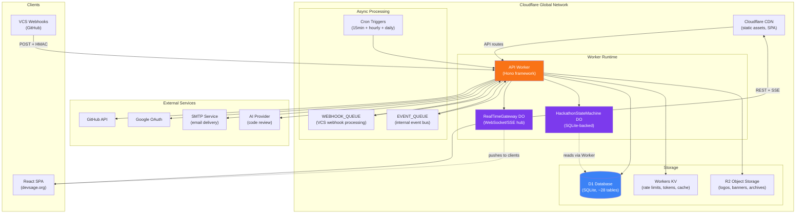

---

## 2. Cloudflare Primitives

### Worker Bindings

| Binding | Type | Name / Class | Purpose |
|---------|------|--------------|---------|
| `DB` | D1 Database | `devsage-db` | Primary datastore (~28 tables) |
| `KV` | KV Namespace | `devsage-kv` | OAuth state, rate limits, token cache, session cache |
| `R2` | R2 Bucket | `devsage-assets` | Logos, banners, exports, audit archives |
| `HACKATHON_SM` | Durable Object | `HackathonStateMachine` | State machine, submission locking, deadline alarms |
| `REALTIME_GW` | Durable Object | `RealTimeGateway` | WebSocket/SSE connection hub, event broadcasting |
| `WEBHOOK_QUEUE` | Queue (producer) | `webhook-inbound` | VCS webhook processing |
| `EVENT_QUEUE` | Queue (producer) | `event-bus` | Internal event distribution |

### Worker Configuration

| Setting | Value |
|---------|-------|
| Compatibility date | `2026-01-01` |
| Compatibility flags | `nodejs_compat` |
| DO migrations | `new_sqlite_classes: [HackathonStateMachine, RealTimeGateway]` |
| Observability | Enabled |
| Logpush | Enabled (structured JSON) |
| Placement | Smart placement (closest to D1 primary) |

### Binding Type Definition

```typescript
interface Env {
  // Storage
  DB: D1Database;
  KV: KVNamespace;
  R2: R2Bucket;

  // Durable Objects
  HACKATHON_SM: DurableObjectNamespace;
  REALTIME_GW: DurableObjectNamespace;

  // Queues (producer)
  WEBHOOK_QUEUE: Queue;
  EVENT_QUEUE: Queue;

  // Secrets
  JWT_SECRET: string;
  GITHUB_CLIENT_ID: string;
  GITHUB_CLIENT_SECRET: string;
  GITHUB_APP_ID: string;
  GITHUB_APP_PRIVATE_KEY: string;
  GITHUB_WEBHOOK_SECRET: string;
  GOOGLE_CLIENT_ID: string;
  GOOGLE_CLIENT_SECRET: string;
  SMTP_URL: string;
  SMTP_USERNAME: string;
  SMTP_PASSWORD: string;
  SMTP_EMAIL_ADDR: string;
  FRONTEND_URL: string;
  PLATFORM_URL: string;
  ADMIN_URL: string;
}
```

---

## 3. Worker Architecture

A single Worker handles all request types. The Hono framework routes to the appropriate handler.

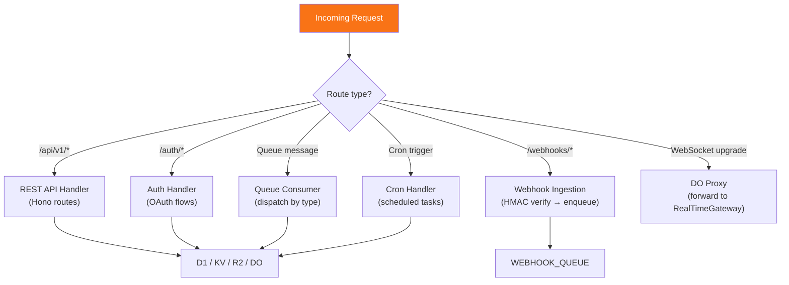

### Entry Point Structure

```typescript
export default {
  // HTTP requests (API, auth, webhooks, static)
  async fetch(request: Request, env: Env, ctx: ExecutionContext): Promise<Response> {
    return app.fetch(request, env, ctx);
  },

  // Queue consumer (webhook processing, event bus)
  async queue(batch: MessageBatch, env: Env, ctx: ExecutionContext): Promise<void> {
    await queueDispatcher(batch, env, ctx);
  },

  // Cron triggers (deadlines, reminders, archival, integrity checks)
  async scheduled(event: ScheduledEvent, env: Env, ctx: ExecutionContext): Promise<void> {
    await cronHandler(event, env, ctx);
  },
};

// Durable Object re-exports (REQUIRED by wrangler)
export { HackathonStateMachine } from './durable-objects/hackathon-state-machine';
export { RealTimeGateway } from './durable-objects/real-time-gateway';
```

### Request Lifecycle

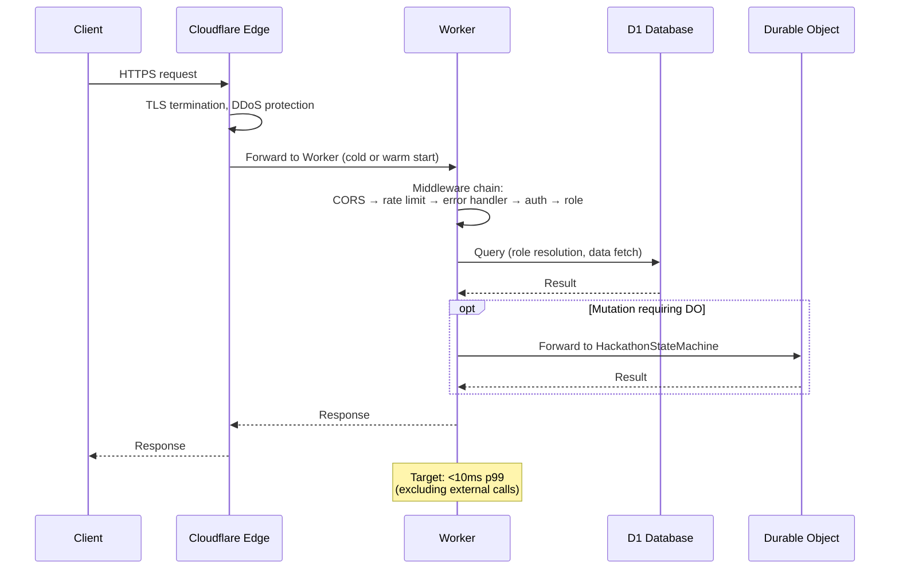

---

## 4. Durable Objects

### HackathonStateMachine

| Property | Value |
|----------|-------|
| Storage | SQLite-backed (`new_sqlite_classes`) |
| Naming | `hackathon_id` as DO name (one DO per hackathon) |
| Purpose | State transitions, submission locking, deadline alarms |
| Persistence | DO SQLite for state + submission locks |
| Alarm | Used for automated deadline-based transitions |

### RealTimeGateway

| Property | Value |
|----------|-------|
| Storage | In-memory (no persistence needed) |
| Naming | `hackathon_id` as DO name (one DO per hackathon) |
| Purpose | WebSocket/SSE connection hub, event broadcasting |
| Connections | Manages connected clients per hackathon |
| Fan-out | Broadcasts events to all connected clients for a hackathon |

### DO Communication Pattern

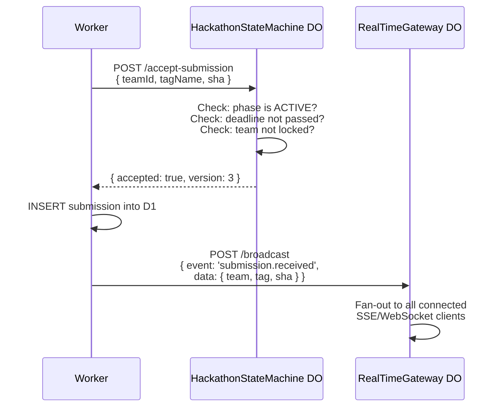

### DO Routing

```typescript
function getHackathonDO(env: Env, hackathonId: string): DurableObjectStub {
  const id = env.HACKATHON_SM.idFromName(hackathonId);
  return env.HACKATHON_SM.get(id);
}

function getRealTimeDO(env: Env, hackathonId: string): DurableObjectStub {
  const id = env.REALTIME_GW.idFromName(hackathonId);
  return env.REALTIME_GW.get(id);
}
```

---

## 5. Queue System

### Queue Configuration

| Queue | Binding | Purpose | Max Batch | Max Retries | Retry Delay |
|-------|---------|---------|-----------|-------------|-------------|
| `webhook-inbound` | `WEBHOOK_QUEUE` | VCS webhook processing | 10 | 3 | 30s, 2min, 10min |
| `event-bus` | `EVENT_QUEUE` | Internal event distribution | 10 | 3 | 30s, 2min, 10min |

### Queue Flow

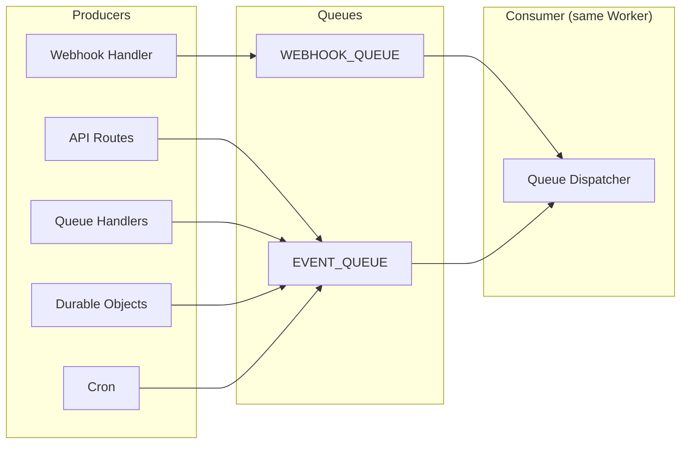

### Queue Dispatcher

```typescript
async function queueDispatcher(
  batch: MessageBatch,
  env: Env,
  ctx: ExecutionContext,
): Promise<void> {
  for (const message of batch.messages) {
    try {
      const { queue } = batch;
      switch (queue) {
        case 'webhook-inbound':
          await webhookProcessor(message.body, env);
          break;
        case 'event-bus':
          await eventBusProcessor(message.body, env);
          break;
      }
      message.ack();
    } catch (error) {
      console.error(`Queue processing failed:`, error);
      message.retry();
    }
  }
}
```

> **Phase 2**: An `OUTBOUND_WEBHOOK_QUEUE` will be added for organizer webhook delivery (separate retry policy: 5 retries with 1min–1hr backoff) when outbound webhooks are introduced.

### Dead Letter Handling

After exhausting retries, messages are acknowledged (removed from queue) and logged:
- Audit event: `webhook.dead_lettered` or `event.dead_lettered`
- Dashboard indicator for organizers
- Platform admin alert for system-level failures

---

## 6. Cron Triggers

### Schedule Table

| Schedule | Cron Expression | Purpose |
|----------|----------------|---------|
| Every 15 minutes | `*/15 * * * *` | Deadline checks, digest scheduling, hackathon auto-transitions |
| Hourly | `0 * * * *` | Notification digest processing, judge reminders |
| Daily 03:00 UTC | `0 3 * * *` | Audit integrity verification |
| Daily 04:00 UTC | `0 4 * * *` | Notification cleanup (90-day retention), expired token cleanup |
| Monthly 1st 04:00 UTC | `0 4 1 * *` | Audit archival to R2 |
| Weekly Sunday 05:00 UTC | `0 5 * * 0` | In-app notification purge (90+ days) |

### Cron Handler Structure

```typescript
async function cronHandler(event: ScheduledEvent, env: Env, ctx: ExecutionContext): Promise<void> {
  const jobs: CronJob[] = [
    { schedule: '*/15', handler: checkDeadlines },
    { schedule: '*/15', handler: processDigests },
    { schedule: '0', handler: sendJudgeReminders },
    { schedule: '3', handler: verifyAuditIntegrity },
    { schedule: '4', handler: cleanupExpiredTokens },
    { schedule: '4', handler: cleanupOldNotifications },
    { schedule: 'monthly', handler: archiveAuditEvents },
    { schedule: 'weekly', handler: purgeOldInAppNotifications },
  ];

  for (const job of matchingJobs(event, jobs)) {
    try {
      await job.handler(env);
      await insertAuditEvent(db, {
        actorType: 'cron',
        action: 'system.cron_executed',
        entityType: 'system',
        entityId: job.handler.name,
        details: { duration_ms: Date.now() - start },
      });
    } catch (error) {
      console.error(`Cron job ${job.handler.name} failed:`, error);
    }
  }
}
```

---

## 7. Secrets Management

### Secret Categories

| Category | Secrets | Storage |
|----------|---------|---------|
| Authentication | `JWT_SECRET`, `GOOGLE_CLIENT_*`, `GITHUB_CLIENT_*` | Worker secrets |
| VCS Integration | `GITHUB_APP_ID`, `GITHUB_APP_PRIVATE_KEY`, `GITHUB_WEBHOOK_SECRET` | Worker secrets |
| Email | `SMTP_URL`, `SMTP_USERNAME`, `SMTP_PASSWORD`, `SMTP_EMAIL_ADDR` | Worker secrets |
| CORS | `FRONTEND_URL`, `PLATFORM_URL`, `ADMIN_URL` | Worker secrets |

> **Phase 2**: Additional secrets will be added for GitLab (`GITLAB_WEBHOOK_TOKEN`), Bitbucket (`BITBUCKET_WEBHOOK_SECRET`), and push notifications (`VAPID_PUBLIC_KEY`, `VAPID_PRIVATE_KEY`) when multi-VCS and push notification support are introduced.

### Development Secrets

```
apps/api/.dev.vars       # API secrets (gitignored)
apps/web/.env.local      # Web dev overrides (gitignored)
```

### Production Secret Deployment

```bash
# Individual secret
wrangler secret put JWT_SECRET --env production

# Bulk from file (file NOT committed)
wrangler secret bulk .env.production --env production

# Via CI (GitHub Actions)
echo "$JWT_SECRET" | wrangler secret put JWT_SECRET --env production
```

### Secret Rotation

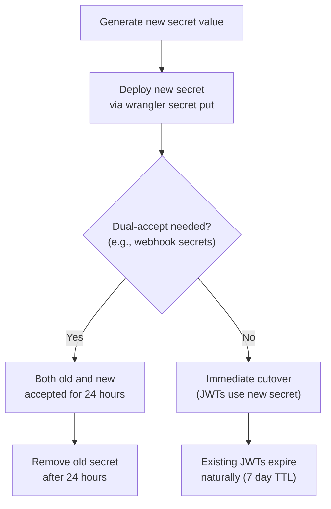

### Security Guardrails

| Layer | Protection | Blocks |
|-------|-----------|--------|
| Pre-commit hook | `secretlint` scans staged files | Commits with secrets |
| Pre-push hook | Full repo secret scan | Pushes with secrets |
| CI pipeline | `gitleaks` on every PR + push to main | PRs with secrets |
| `.gitignore` | All `.env*` files gitignored | Accidental commits |
| Web app | Only `VITE_*` variables exposed | Server secrets in client |
| Worker runtime | Secrets encrypted at rest in Cloudflare | Plaintext exposure |

---

## 8. CI/CD Pipeline

### Pipeline Architecture

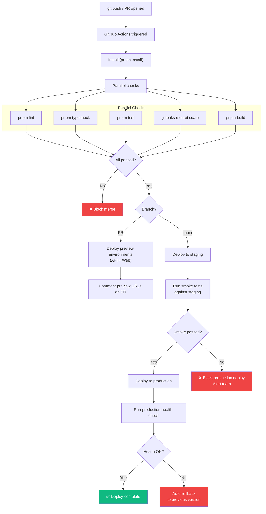

### GitHub Actions Workflow Summary

| Workflow | Trigger | Steps |
|----------|---------|-------|
| `ci.yml` | PR, push to main | lint → typecheck → test → build → secret scan |
| `deploy-preview.yml` | PR opened/updated | Build → deploy preview → comment URLs |
| `deploy-staging.yml` | Push to main | Deploy to staging → smoke tests |
| `deploy-production.yml` | Staging smoke passed | Deploy to production → health check → auto-rollback |
| `secret-scan.yml` | PR, push to main | gitleaks full scan |

### Deployment Commands

```bash
# Local development
pnpm dev                      # All apps (turbo --parallel)

# Manual deploy (avoid — prefer CI)
pnpm deploy:api               # Deploy API worker
pnpm deploy:api:secrets       # Upload API secrets
pnpm deploy:web               # Deploy web SPA

# CI deploy (automated)
wrangler deploy --env staging
wrangler deploy --env production
```

---

## 9. Environments & Staging

### Environment Matrix

| Environment | API URL | Web URL | D1 Database | Purpose |
|------------|---------|---------|-------------|---------|
| Development | `http://localhost:8787` | `http://localhost:5173` | Local miniflare | Developer machine |
| Preview | `https://preview-{sha}.api.devsage.org` | `https://preview-{sha}.devsage.org` | Preview D1 | PR review |
| Staging | `https://staging-api.devsage.org` | `https://staging.devsage.org` | Staging D1 | Pre-production validation |
| Production | `https://api.devsage.org` | `https://devsage.org` | Production D1 | Live users |

### Environment-Specific Configuration

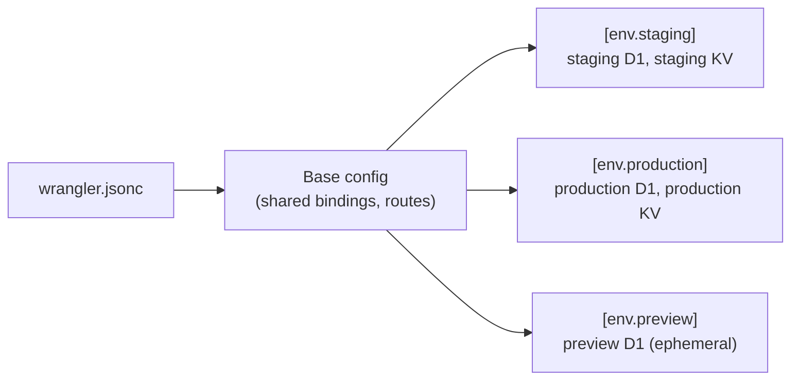

### Preview Environment Lifecycle

1. PR opened → preview environment created (ephemeral D1 + Worker)
2. PR updated → preview redeployed
3. PR merged/closed → preview environment destroyed (after 24 hours)

### Staging → Production Promotion

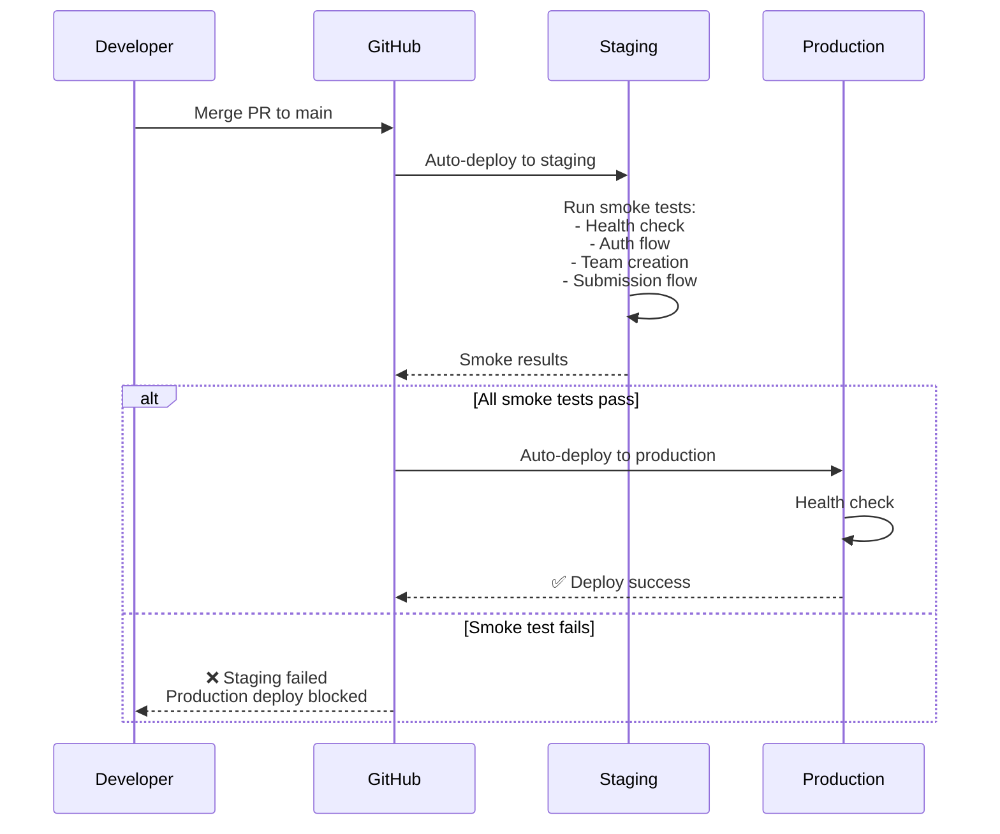

---

## 10. Observability & Monitoring

### Observability Stack

| Layer | Tool | Purpose |
|-------|------|---------|
| Request logging | Workers Logpush | Structured JSON logs to R2 or external sink |
| Error tracking | Cloudflare Worker Analytics | Invocation errors, subrequest failures |
| Performance | Workers Analytics Engine | p50/p95/p99 latency, CPU time |
| Uptime | Cloudflare Health Checks | Endpoint monitoring with alerting |
| Custom metrics | Analytics Engine | Business metrics (submissions/day, active users) |
| Audit | Internal audit trail | Full operation history |

### Structured Logging

```typescript
// All logs are structured JSON for machine parsing
console.warn(JSON.stringify({
  level: 'warn',
  requestId: c.get('requestId'),
  action: 'smtp_timeout',
  recipient: email,
  duration_ms: 10000,
  error: 'AbortController timeout',
  hackathon_id: hackathon.id,
  timestamp: new Date().toISOString(),
}));
```

### Key Metrics & Alerts

| Metric | Threshold | Alert |
|--------|-----------|-------|
| API error rate (5xx) | > 1% of requests | Immediate (email) |
| API p99 latency | > 500ms | Warning |
| D1 error rate | > 0.1% of queries | Immediate |
| Queue dead letters | > 0 in 1 hour | Warning |
| Cron job failure | Any failure | Warning |
| Webhook processing backlog | > 100 pending | Warning |
| Auth failure spike | > 50/min | Immediate (potential attack) |
| SSL certificate expiry | < 30 days | Warning |

### Health Check Endpoint

```
GET /api/v1/admin/health
```

```json
{
  "ok": true,
  "data": {
    "status": "healthy",
    "checks": {
      "d1": { "status": "ok", "latency_ms": 2 },
      "kv": { "status": "ok", "latency_ms": 1 },
      "r2": { "status": "ok", "latency_ms": 5 },
      "durable_objects": { "status": "ok" }
    },
    "version": "1.2.3",
    "commit": "abc123d",
    "deployed_at": "2026-03-15T10:00:00Z",
    "uptime_seconds": 86400
  }
}
```

---

## 11. Failure Modes & Recovery

### Failure Classification

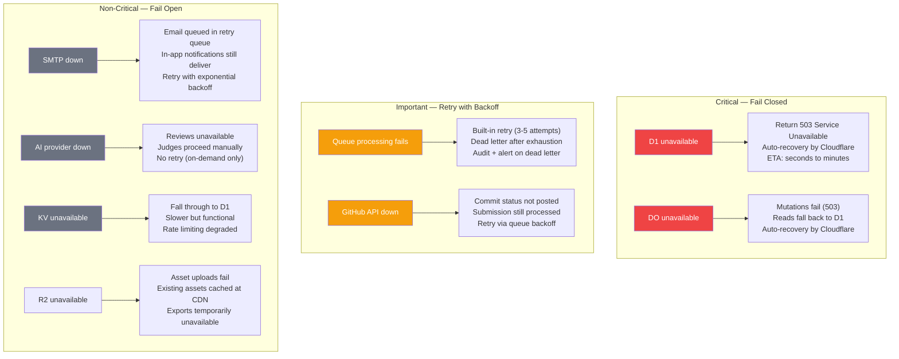

### Failure Matrix

| Dependency | Criticality | Failure Behavior | Recovery | User Impact |
|-----------|------------|------------------|----------|-------------|
| D1 | Critical | 503 on all data operations | Automatic (CF-managed) | Full outage |
| Durable Objects | Critical (writes) | Mutations fail, reads fall back | Automatic | Submissions blocked |
| KV | Degraded | Fall through to D1 | Automatic | Slower responses, degraded rate limiting |
| R2 | Degraded | Uploads fail, existing assets cached | Automatic | Can't upload new assets |
| Queues | Delayed | Processing delayed, retried | Built-in retry + dead letter | Delayed webhooks and notifications |
| GitHub API | Degraded | Commit status not posted | Queue retry | No status checks on PR |
| SMTP | Degraded | Emails delayed | Queue retry | Delayed email notifications |
| AI Provider | Non-critical | Reviews unavailable | On-demand retry | Judges proceed without AI |

### Rollback Strategy

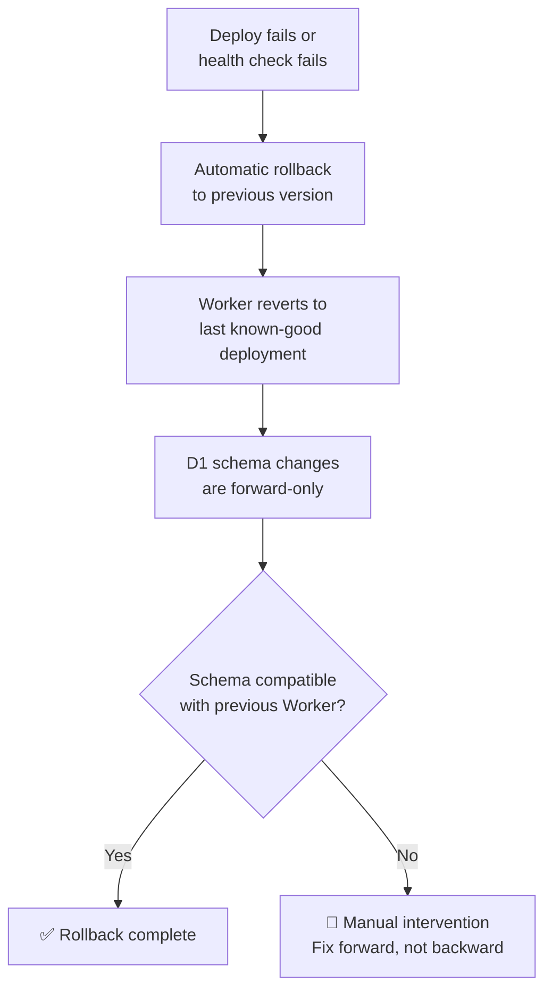

**Key principle:** D1 migrations are forward-only. Worker code must handle both old and new schema during transition periods. This means adding columns must use defaults, and reading new columns must handle null.

---

## 12. Resource Limits & Cost Model

### Workers Paid Plan ($5/month)

| Resource | Paid Limit | Year 1 Projected | Headroom |
|----------|-----------|-------------------|----------|
| Requests | 10M/month | ~750K/month | 13x |
| CPU time | 30ms/invocation | <10ms p99 | 3x |
| D1 rows read | 25B/month | ~6M/month | 4000x |
| D1 rows written | 50M/month | ~600K/month | 83x |
| D1 storage | 5 GB | ~165 MB | 30x |
| KV reads | 10M/month | ~300K/month | 33x |
| KV writes | 1M/month | ~50K/month | 20x |
| Queue operations | Included | ~100K/month | Included |
| DO requests | Included | ~50K/month | Included |
| DO storage | 10 GB | ~100 MB | 100x |
| R2 storage | 10 GB free | ~500 MB | 20x |
| R2 operations | 1M Class A, 10M Class B | ~10K/month | 100x+ |

### Cost Projections

| Scale | Users | Hackathons | Monthly Cost |
|-------|-------|------------|-------------|
| MVP | 500 | 3 | $0 (free tier) |
| Year 1 | 2,000 | 10 | $5 (Workers Paid) |
| Year 2 | 10,000 | 50 | $5–15 (may need D1 paid add-on) |
| Year 3 | 50,000 | 200 | $25–50 (D1 paid + queue volume) |

### Upgrade Triggers

| Trigger | Current Limit | Upgrade To |
|---------|--------------|-----------|
| Requests > 8M/month | 10M (paid) | No action needed until 10M |
| D1 storage > 4 GB | 5 GB (paid) | Audit archival first, then D1 paid add-on |
| KV writes > 800K/month | 1M (paid) | Optimize caching, then KV paid add-on |
| Worker CPU > 25ms p99 | 30ms (paid) | Optimize hot paths, profile with Workers Analytics |

---

## 13. External Service Dependencies

| Service | Purpose | Timeout | Failure Mode | Rate Limit | Auth |
|---------|---------|---------|-------------|------------|------|
| GitHub API | OAuth, commit status, file reads | 10s | Fail-open | 5,000 req/hr | App installation tokens (KV-cached) |
| Google OAuth | OAuth login | 10s | Fail-open | N/A | Client ID/secret |
| SMTP Service | Email delivery | 10s | Fail-open, retry | 500 emails/hr | Username/password |
| AI Provider | Code reviews | 25s | Fail-open | Per-token | API key |

> **Phase 2**: GitLab API, Bitbucket API, and Web Push (FCM/Mozilla) will be added as additional external service dependencies when multi-VCS and push notification support are introduced.

### Fail-Open Pattern

All external calls follow the same pattern:

```typescript
async function callExternalService<T>(
  url: string,
  options: RequestInit,
  timeoutMs: number = 10_000,
): Promise<T | null> {
  const controller = new AbortController();
  const timeout = setTimeout(() => controller.abort(), timeoutMs);

  try {
    const response = await fetch(url, {
      ...options,
      signal: controller.signal,
    });

    if (!response.ok) {
      console.warn(`External service error: ${response.status} ${url}`);
      return null;
    }

    return await response.json() as T;
  } catch (error) {
    console.warn(`External service failure: ${url}`, error);
    return null;  // Never throw
  } finally {
    clearTimeout(timeout);
  }
}
```

---

## 14. Monorepo Tooling

### Tool Stack

| Tool | Purpose |
|------|---------|
| **Turborepo** | Build orchestration, caching, task parallelism, dependency graph |
| **pnpm** | Package manager with workspaces (strict, efficient) |
| **TypeScript** | Strict mode throughout, shared tsconfig via `packages/config` |
| **Vitest** | Testing everywhere — Workers pool (API), jsdom (Web), standard (shared) |
| **ESLint 9** | Flat config, shared via `packages/config/eslint.config.mjs` |
| **Drizzle ORM** | Type-safe D1 access, migration generation |
| **Vite** | Web SPA bundler, dev server with API proxy |
| **Tailwind CSS v4** | Utility-first styling for web app |
| **shadcn/ui** | Component library (copy-paste, not dependency) |

### Workspace Structure

```
DevSage/
├── apps/
│   ├── api/            # @devsage/api — Cloudflare Worker
│   └── web/            # @devsage/web — React SPA
├── packages/
│   ├── config/         # @devsage/config — tsconfig + ESLint
│   ├── db/             # @devsage/db — Drizzle schemas + migrations
│   └── shared/         # @devsage/shared — Zod schemas, types, constants
├── turbo.json
├── pnpm-workspace.yaml
└── package.json        # Root scripts
```

### Task Graph

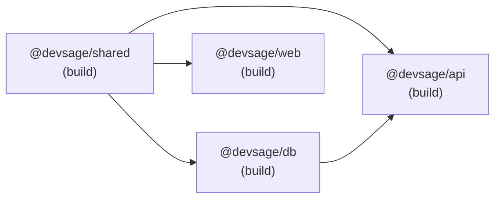

### Root Scripts

```bash
pnpm dev                     # All apps dev (turbo --parallel)
pnpm build                   # Build all (turbo, respects dependency graph)
pnpm test                    # Test all (turbo)
pnpm lint                    # Lint all
pnpm typecheck               # Type-check all
pnpm secrets:scan            # Full repo secret scan
pnpm secrets:staged          # Scan staged files only
pnpm deploy:api              # Deploy API worker
pnpm deploy:api:secrets      # Upload API secrets
pnpm deploy:web              # Deploy web app
```

---

## 15. Multi-Region & Scale Readiness

### Current: Single Region

D1 has a primary location. Workers execute globally but read/write to the primary D1. Smart Placement moves the Worker closer to D1 for lower latency.

### D1 Read Replicas (When Available)

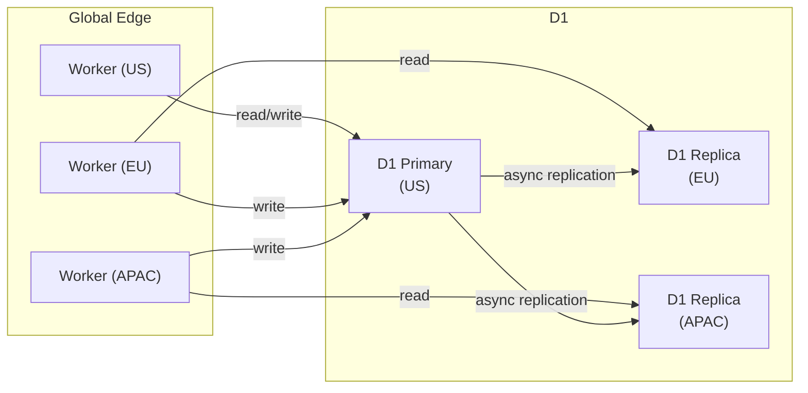

**Benefits:** Read-heavy endpoints (leaderboard, team directory, commit log) served from local replica. Writes still go to primary.

### Per-Workspace D1 Isolation (Future)

> **Phase 2**: When a single D1 approaches limits (5 GB or performance), partition by workspace:

| Strategy | Description |
|----------|-------------|
| Shared tables | `users`, `platform_admins` remain in primary D1 |
| Tenant tables | All hackathon-scoped tables in per-workspace D1 |
| Routing | Middleware resolves workspace from slug, routes to correct D1 |
| Migrations | All D1 instances run identical schema |

### Global Durable Objects (Future)

Durable Objects already run closest to the first request. For global events:

| Pattern | Use Case |
|---------|----------|
| Per-hackathon DO | State machine, submission locking (already implemented) |
| Per-hackathon Real-Time DO | WebSocket/SSE broadcasting (already implemented) |
| Global coordination | Not needed — hackathons are naturally isolated by ID |

---

## 16. Security Hardening

### Network Security

| Layer | Protection |
|-------|-----------|
| TLS | Cloudflare manages SSL certificates (automatic renewal) |
| DDoS | Cloudflare DDoS protection (L3/L4/L7) on all Workers |
| WAF | Cloudflare WAF rules (OWASP Core Rule Set) |
| Bot management | Cloudflare Bot Management (challenge suspicious traffic) |
| IP reputation | Cloudflare Threat Intelligence |

### Application Security

| Measure | Implementation |
|---------|---------------|
| CORS | Strict origin whitelist, credentials mode |
| CSRF | SameSite=Lax cookies + CORS origin check |
| XSS | Content-Security-Policy headers on SPA |
| JWT | HttpOnly, Secure, SameSite=Lax cookies. No localStorage |
| Secrets | Encrypted at rest in Workers runtime. Never logged |
| Input validation | Zod on every endpoint (body, query, params) |
| Rate limiting | Per-IP and per-user limits |
| SQL injection | Drizzle ORM parameterized queries (never raw SQL) |
| HMAC verification | Timing-safe comparison for webhook signatures |
| Audit trail | Every mutation logged with actor, IP, user-agent |

### Secret Scanning Pipeline

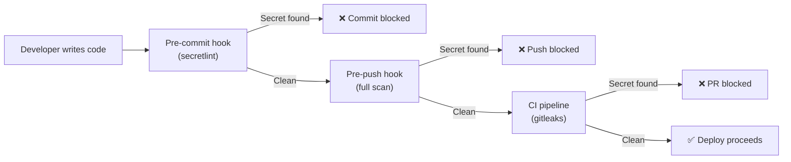

---

## 17. Decision Log

| Decision | Choice | Why | Alternatives Considered |
|----------|--------|-----|------------------------|
| Single Worker for everything | API + DO re-exports + queue consumer + cron in one Worker | Simplicity. Cloudflare routes everything through one entry point. No inter-Worker communication needed. Same Worker produces and consumes queues | Separate Workers per concern (coordination overhead); microservices (overkill at this scale) |
| Cloudflare D1 over external DB | D1 (SQLite on Cloudflare's edge) | Zero-ops, co-located with Worker, sub-millisecond reads, free 5 GB. No connection pooling, no VPN, no cold connections | PlanetScale (connection overhead from Workers); Turso (similar to D1 but vendor); Supabase PostgreSQL (not edge-native) |
| SQLite-backed Durable Objects | `new_sqlite_classes` for HackathonStateMachine | Persistent state survives DO eviction. SQL queries for complex state (submission locks, alarm schedules). No KV iteration needed | KV-backed DO (no SQL queries, iterate-all for lookups); in-memory only (lost on eviction); external DB from DO (latency) |
| Workers KV for caching | Rate limits, OAuth state, token cache | Globally replicated, sub-millisecond reads, TTL support. Perfect for ephemeral data. Eventually consistent is fine for caches | D1 for everything (slower for hot data); external Redis (latency, cost); DO for rate limiting (expensive) |
| R2 for object storage | Logos, banners, audit archives, exports | S3-compatible, zero-egress, co-located with Workers. Cheaper than S3 for reads from Workers | Cloudflare Images (less flexible); S3 (egress costs from Workers); D1 BLOB (not designed for large objects) |
| Two separate queues | webhook-inbound, event-bus | Separate retry policies per concern. Independent backpressure. Webhook ingestion isolated from internal event processing | Single queue with message types (can't differentiate retry policies); more queues (operational overhead); no queues (sync processing, timeouts) |
| $5/month target | Workers Paid plan as baseline | Free tier's KV write limit (1K/day) is too tight. $5 unlocks 10M requests, 1M KV writes, 50M D1 writes — enormous headroom for Year 1. No per-request billing surprise | Stay on free tier (too constrained); higher tier (unnecessary); external providers (more expensive) |
| CI/CD with staging gate | main → staging → smoke test → production | Catches deployment issues before they reach users. Staging uses separate D1 (no production data risk). Smoke tests validate critical paths | Direct to production (risky); manual promotion (slow, error-prone); feature flags only (doesn't catch infra issues) |
| Preview environments per PR | Ephemeral Worker + D1 per PR | Reviewers can test changes in isolation. No shared state between PRs. Auto-cleanup after 24 hours | Shared staging for all PRs (conflicts); no preview (review code only); local only (can't share URLs) |
| Forward-only schema migrations | Drizzle-kit generate, no rollbacks | Rollbacks in production are dangerous and often fail. Forward migrations are predictable. Bad migrations get corrective forward fixes | Reversible migrations (false safety); blue-green schema (complex); no migrations (manual SQL, error-prone) |
| Smart Placement | Worker runs closest to D1 primary | Reduces Worker↔D1 latency from ~50ms to ~5ms for non-cached requests. Biggest performance win for database-heavy endpoints | No placement (higher latency); manual region pinning (inflexible); multiple D1 primaries (not supported) |
