# Judging & Scoring

> Complete specification for the DevSage v3 judging system. Covers rubric configuration, judge invitations, per-round judging (tied to hackathon rounds from submissions.md), round-robin and track-aware assignment, blind mode, scoring, AI-assisted reviews, leaderboard computation, and results publication. Any developer should be able to implement the entire judging system from this document alone.

---

## Table of Contents

- [Design Goals](#design-goals)
- [Judging Flow (End-to-End)](#judging-flow-end-to-end)
- [Rubric Configuration](#rubric-configuration)
- [Judge Invitations](#judge-invitations)
- [Judge Assignment](#judge-assignment)
- [Per-Round Judging](#per-round-judging)
- [Scoring](#scoring)
- [Blind Judging Mode](#blind-judging-mode)
- [AI-Assisted Reviews](#ai-assisted-reviews)
- [Leaderboard](#leaderboard)
- [Results Publication](#results-publication)
- [Judge Dashboard](#judge-dashboard)
- [Edge Cases](#edge-cases)
- [Error Codes](#error-codes)
- [Database Tables](#database-tables)
- [Decision Log](#decision-log)

---

## Design Goals

| Goal | Description |
|------|-------------|
| **Structured rubrics** | Every hackathon defines scoring criteria with weights. No ad-hoc judging — every score maps to a criterion. |
| **Editable until submitted** | Judges can edit scores per-criterion while reviewing a submission. Once they click "Submit All" for that submission, all scores are locked — no further edits. |
| **Balanced assignment** | Round-robin ensures every team gets the same number of reviewers and every judge reviews a similar number of submissions. |
| **Track-aware** | In multi-track hackathons, judges can be assigned to specific tracks. Track-specific rubric criteria only appear for relevant submissions. |
| **Per-round judging** | Judging happens per hackathon round (defined in submissions.md). Each round can have different rubric criteria. Rounds can be normal or elimination. |
| **Blind mode** | Judges see code and artifacts but not team names, member identities, or GitHub usernames. Prevents bias from reputation. |
| **AI as advisor** | AI reviews provide a first-pass analysis to help judges scale. AI never scores — it summarizes, highlights strengths, and flags concerns. Judges always make the final call. |
| **Pinned snapshots** | Every score and review is tied to an exact commit SHA. Even if code changes afterward, the judged artifact is immutable. |

---

## Judging Flow (End-to-End)

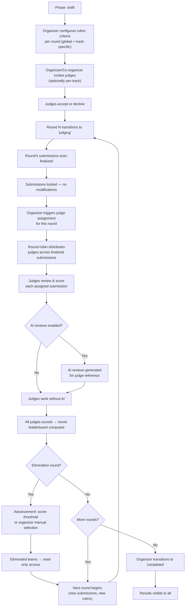

---

## Rubric Configuration

Organizers define the scoring criteria that judges use to evaluate submissions. Each criterion has a name, description, max score, and weight. Criteria can be global (all tracks) or track-specific.

### Rubric API

```
POST /api/v1/hackathons/:slug/rubric
Body: { criteria: [...] }
→ Bulk upsert: deletes all existing criteria, inserts new set.
→ Only allowed in 'draft' status.

GET /api/v1/hackathons/:slug/rubric
→ Returns all criteria. Visible to judges and participants (so they know how they'll be evaluated).
```

### Criterion Schema

```typescript
interface RubricCriterion {
  id: string;                   // UUID
  hackathon_id: string;         // FK
  track_id: string | null;      // null = applies to all tracks
  round_id: string;             // FK → hackathon_rounds.id (criteria can differ per round)
  name: string;                 // "Innovation", "Technical Execution"
  description: string;          // Guidance for judges on how to evaluate
  max_score: number;            // e.g., 10
  weight: number;               // e.g., 2.0 — higher weight = more influence on total
  sort_order: number;           // Display ordering
}
```

### Example Rubric (Single-Track)

| Criterion | Max Score | Weight | Round | Description |
|-----------|-----------|--------|-------|-------------|
| Innovation | 10 | 2.0 | Round 1 | Originality of the idea and approach |
| Technical Execution | 10 | 1.5 | Round 1 | Code quality, architecture, completeness |
| User Experience | 10 | 1.0 | Round 1 | Design, usability, accessibility |
| Presentation | 10 | 0.5 | Round 1 | README quality, demo clarity |

### Example Rubric (Multi-Track with Finals)

| Criterion | Track | Max Score | Weight | Round |
|-----------|-------|-----------|--------|-------|
| Innovation | All | 10 | 2.0 | Round 1 |
| Technical Execution | All | 10 | 1.5 | Round 1 |
| AI Model Quality | AI/ML only | 10 | 2.0 | Round 1 |
| UI Polish | Web only | 10 | 1.5 | Round 1 |
| Grand Final: Impact | All | 10 | 3.0 | Round 3 (Finals) |
| Grand Final: Scalability | All | 10 | 2.0 | Round 3 (Finals) |
| Grand Final: Demo | All | 10 | 1.0 | Round 3 (Finals) |

**Weight semantics:** Weights are relative multipliers within a round. A criterion with weight 2.0 counts twice as much as one with weight 1.0. The leaderboard formula normalizes across all criteria.

### Rubric Locking

The rubric is editable during `draft` only. Once the hackathon transitions to `active`, the rubric is locked — no modifications. This ensures judges and participants see the same criteria throughout.

**Why lock at active (not judging)?** Participants should know how they'll be evaluated when they start building. Changing the rubric after the hackathon starts would be unfair.

---

## Judge Invitations

### Inviting Judges

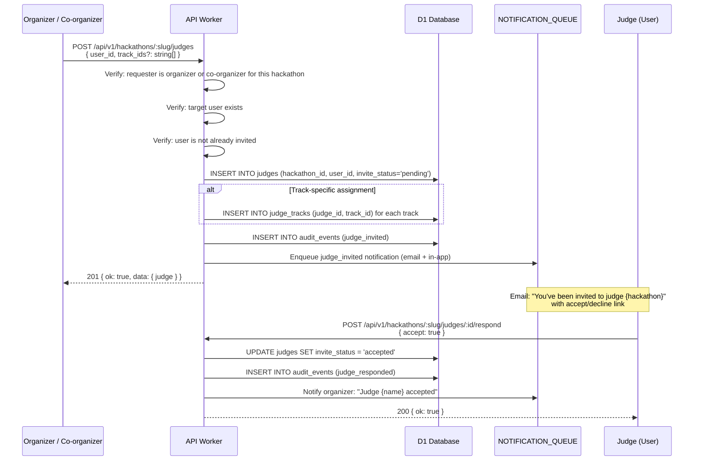

### Invite States

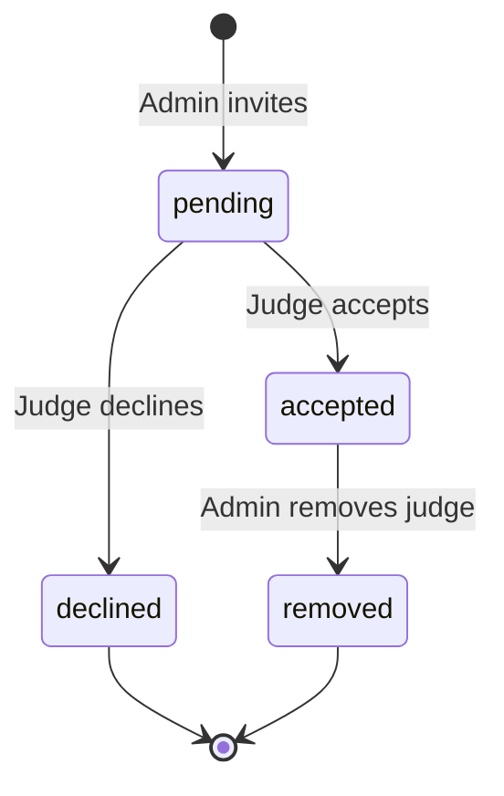

A judge can only be assigned to submissions after accepting. Declined judges are kept in the record for audit purposes. Removed judges have their pending assignments reassigned.

### Bulk Invite

```
POST /api/v1/hackathons/:slug/judges/bulk
Body: { user_ids: string[], track_ids?: string[] }
→ Invites multiple judges at once. Same validation per judge.
→ Returns partial success: { invited: [...], failed: [...] }
```

---

## Judge Assignment

Once a round enters `judging` and judges have accepted, the organizer triggers assignment. This distributes that round's finalized submissions across judges using a round-robin algorithm.

### Triggering Assignment

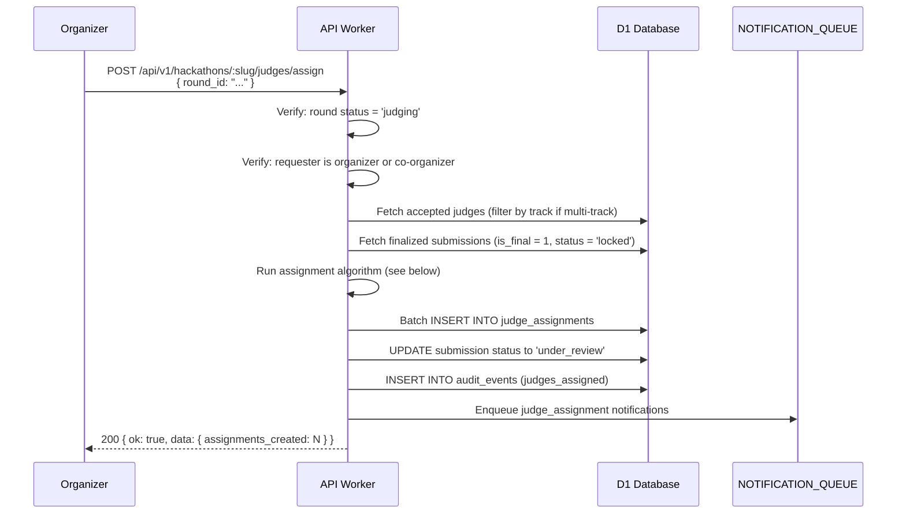

### Round-Robin Algorithm

```
Input:
  judges: Judge[] (accepted, optionally filtered by track)
  submissions: Submission[] (finalized, optionally filtered by track)
  reviews_per_submission: number (from hackathon config, default 2)

Algorithm:
  Sort judges by number of existing assignments ASC (balance workload)
  Sort submissions by team name ASC (deterministic ordering)

  For each submission[i]:
    For j in range(reviews_per_submission):
      judge_index = (i + j) % judges.length
      candidate = judges[judge_index]

      // Conflict check: judge cannot review their own team
      if candidate.user_id is a member of submission.team:
        skip to next judge in rotation

      Create assignment: { judge_id: candidate.id, submission_id, status: 'pending' }

Output:
  List of (judge_id, submission_id) pairs
```

**Guarantees:**
- Every finalized submission gets exactly `reviews_per_submission` judges (unless fewer judges than needed)
- Workload is balanced: judges differ by at most 1 assignment
- No judge reviews their own team's submission
- Deterministic: same input → same output (useful for debugging)

### Track-Aware Assignment

In multi-track hackathons, assignment can be track-aware:

1. Judges assigned to specific tracks only review submissions in those tracks
2. Judges with no track restriction review submissions in any track
3. The algorithm runs per-track first (track-specific judges), then fills remaining slots with unrestricted judges

```
GET /api/v1/hackathons/:slug/judges/assignments
  ?judge_id=...       (view assignments for a specific judge)
  &track_id=...       (filter by track)
  &status=pending     (filter by assignment status)
  &limit=20&offset=0
```

### Reassignment

If a judge is removed after assignment, their pending assignments are redistributed:

```
POST /api/v1/hackathons/:slug/judges/reassign
Body: { judge_id: "removed-judge-id" }
→ Reassigns their pending (unscored) submissions to other judges via round-robin.
→ Completed scores are preserved (they don't disappear).
```

---

## Per-Round Judging

Judging is tied to **hackathon rounds** defined in the submissions system (see `submissions.md` → Rounds System). Each round has its own submission window, judging cycle, and optionally different rubric criteria. Rounds can be normal or elimination.

> **Key concept:** Hackathon rounds are defined once in `hackathon_rounds` table (see submissions.md). The judging system references those rounds — it does not define its own.

### How Per-Round Judging Works

| Property | Per Round |
|----------|-----------|
| Submissions | Finalized submissions for that round (one per team) |
| Judges | Same judge pool for all rounds (shared config) |
| Rubric | Can have different criteria per round (`round_id` on rubric_criteria) |
| Advancement | Elimination rounds: score threshold or organizer manual selection |

### Round Judging Flow

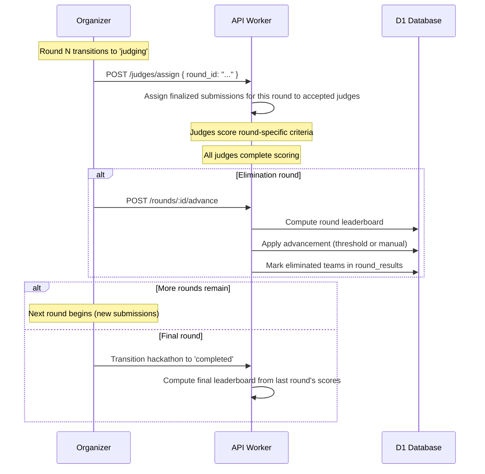

### Leaderboard Per Round

- Each round's leaderboard is computed from that round's criteria only
- Previous round scores do NOT carry over — each round is a fresh evaluation
- The final round's leaderboard IS the final hackathon leaderboard

**Why don't scores carry over?** Each round is a fresh evaluation. Carrying over previous scores would bias later rounds toward preferences of earlier judges. Clean slate per round is fairer.

---

## Scoring

Judges score each criterion for each assigned submission. Scores can be edited while the judge is working on a submission, but once they click "Submit All" for that submission, all scores are locked permanently.

### Two-Phase Scoring: Draft → Submitted

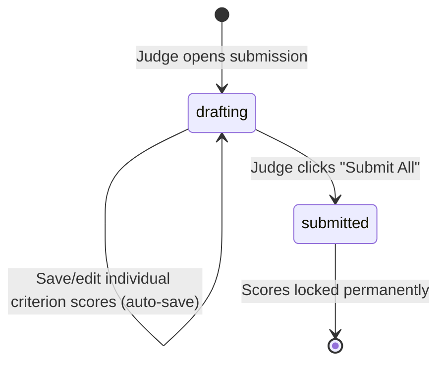

**Phase 1 — Drafting:** Judge can save, edit, and revise scores for individual criteria as many times as they want. Draft scores are saved to the database but marked `is_submitted = false`. Other judges and the leaderboard cannot see draft scores.

**Phase 2 — Submitted:** Judge clicks "Submit All" for the submission. All draft scores are marked `is_submitted = true` and become immutable. The judge assignment status transitions to `completed`.

### Saving Draft Scores

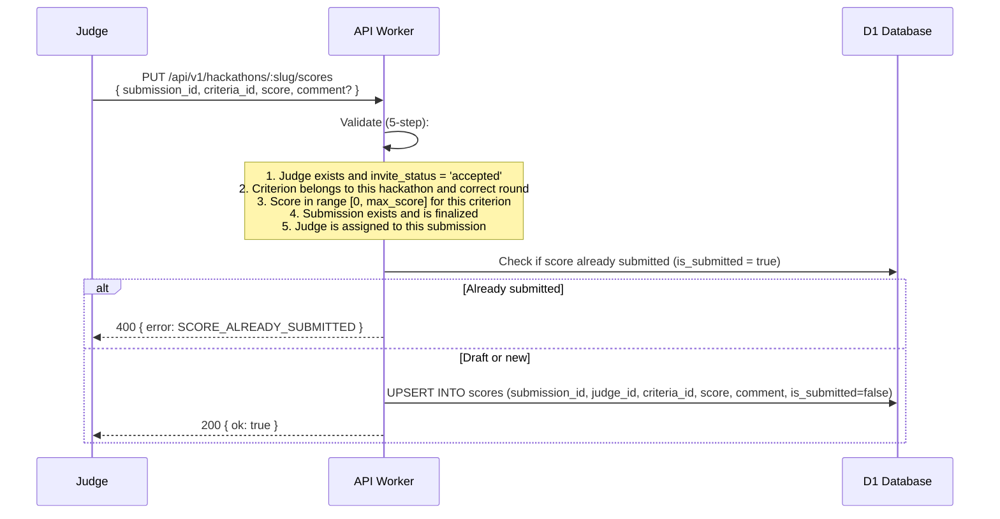

### Submitting All Scores

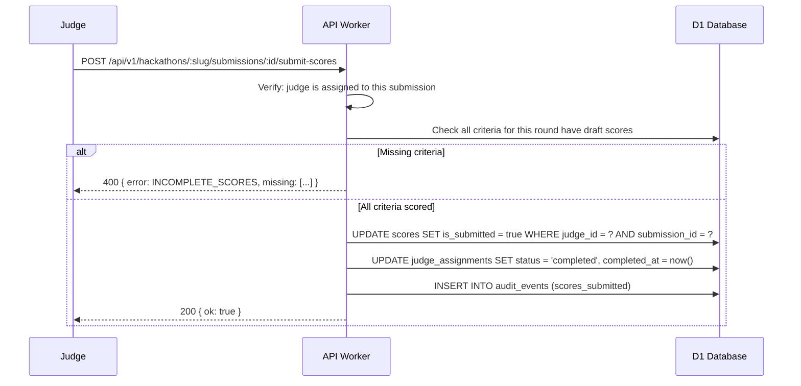

### Score Validation (5-Step)

| Step | Check | Error Code |
|------|-------|------------|
| 1 | Judge exists and `invite_status = accepted` | `JUDGE_NOT_FOUND` |
| 2 | Criterion belongs to this hackathon and matches the current round | `CRITERIA_NOT_FOUND` |
| 3 | `0 <= score <= max_score` for this criterion | `SCORE_OUT_OF_RANGE` |
| 4 | Submission exists, belongs to hackathon, and is finalized (`locked`/`under_review`) | `SUBMISSION_NOT_FOUND` |
| 5 | Judge is assigned to this submission | `NOT_ASSIGNED` |

### Score Locking

Once submitted, scores are immutable. There is no update or delete endpoint for submitted scores. The `is_submitted` flag is a one-way transition.

**Why lock after submit?** Allows judges to iterate and revise while working, but prevents changing scores after seeing other judges' results or leaderboard positions. If a judge made a genuine mistake after submitting, the organizer can void the entire assignment and reassign to a different judge — but the original score record is preserved in the audit trail.

### Score Schema

```typescript
interface Score {
  id: string;               // UUID
  submission_id: string;     // FK
  judge_id: string;          // FK → judges table (not users table)
  criteria_id: string;       // FK → rubric_criteria
  score: number;             // 0 to max_score
  comment: string | null;    // Optional judge comment (max 1000 chars)
  is_submitted: boolean;     // false = draft (editable), true = submitted (locked)
  round_id: string;          // FK → hackathon_rounds.id
  scored_at: string;         // ISO-8601 — last edit time (draft) or submission time
}
```

---

## Blind Judging Mode

When `blind_judging = true` on the hackathon config, judges see submission code and artifacts but not team identity.

### What Judges See (Blind Mode)

| Visible | Hidden |
|---------|--------|
| Submission code (via commit SHA) | Team name |
| README content | Team member names |
| Demo URL | Team member GitHub usernames |
| AI review (if enabled) | Team member avatars |
| Round number | GitHub repo owner/name (shown as "Repository") |
| Submission timestamp | Commit author name (shown as "Author") |

### Implementation

The judge-facing API endpoints filter response data when `blind_judging = true`:

- `GET /submissions/:id` for judges → strip `team_name`, `team_members`, `repo_full_name`, replace `commit_author` with "Author"
- Submission code is served via a proxy that strips identifying metadata from the GitHub API response
- The leaderboard during `judging` phase shows anonymous identifiers: "Submission #1", "Submission #2" (ordered randomly, not by score)

### Unblinding

When the hackathon transitions to `completed`, blind mode is lifted. The leaderboard reveals team names and member identities. Judges can then see who they reviewed.

---

---

## AI-Assisted Reviews

AI reviews are an optional, advisory layer that helps judges evaluate submissions at scale. AI never scores — it provides a structured summary that judges can reference.

### When AI Reviews Run

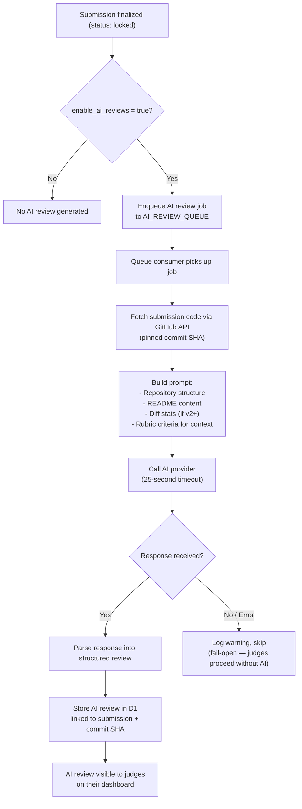

### AI Review Schema

```typescript
interface AIReview {
  id: string;
  submission_id: string;     // FK
  commit_sha: string;        // Pinned — this review is for this exact commit
  round: number;             // Which judging round
  provider: string;          // "openai", "anthropic", etc.
  model: string;             // "gpt-4o-mini", "claude-3-haiku", etc.
  prompt_hash: string;       // SHA-256 of the prompt (for reproducibility audit)
  summary: string;           // 2-3 sentence overview
  strengths: string[];       // ["Clean architecture", "Comprehensive tests"]
  concerns: string[];        // ["No error handling in auth flow", "Missing mobile responsiveness"]
  technical_notes: string;   // Detailed technical observations
  raw_response: string;      // Full AI response (for audit)
  tokens_used: number;       // Token count for cost tracking
  latency_ms: number;        // How long the AI call took
  created_at: string;        // ISO-8601
}
```

### AI Review Properties

| Property | Value |
|----------|-------|
| Provider | Any OpenAI-compatible API endpoint (configurable per hackathon) |
| Default model | `gpt-4o-mini` (cost-effective for volume) |
| Timeout | 25 seconds per review. If exceeded, skip and log. |
| Temperature | 0.3 (low variance for consistency across submissions) |
| Max tokens | 2000 (summary, not exhaustive analysis) |
| Fail-open | If the AI provider is down, judges proceed without AI. No blocking. |
| Caching | Same prompt hash + commit SHA = cached response (no duplicate API calls) |
| Pinning | Review is tied to the exact commit SHA. If submission is re-pinned (shouldn't happen), a new review is generated. |
| Cost tracking | `tokens_used` stored per review. Organizers can see total AI cost on their dashboard. |

### What AI Reviews Do NOT Do

- Do not score submissions (scores come from human judges only)
- Do not influence the leaderboard in any way
- Do not block the judging flow (fail-open on any error)
- Do not access private team data (only the repo code at the pinned commit)
- Do not persist beyond the hackathon (can be deleted with the hackathon)

---

## Leaderboard

### Weighted Score Formula

The leaderboard computes a weighted percentage score for each team:

```
weighted_score = SUM(score_i * weight_i) / SUM(max_score_i * weight_i) * 100
```

Where `i` iterates over all criteria scored for that submission in the relevant round.

```sql
SELECT
  t.id AS team_id,
  t.name AS team_name,
  ht.name AS track_name,
  ROUND(
    SUM(s.score * rc.weight) / SUM(rc.max_score * rc.weight) * 100,
    2
  ) AS weighted_percentage,
  COUNT(DISTINCT s.judge_id) AS judges_completed,
  COUNT(DISTINCT s.criteria_id) AS criteria_scored
FROM scores s
  JOIN rubric_criteria rc ON s.criteria_id = rc.id
  JOIN submissions sub ON s.submission_id = sub.id
  JOIN teams t ON sub.team_id = t.id
  JOIN hackathon_tracks ht ON t.track_id = ht.id
WHERE sub.hackathon_id = ?
  AND sub.is_final = 1
  AND sub.round_id = ?
  AND s.is_submitted = 1
GROUP BY t.id
ORDER BY weighted_percentage DESC
```

### Leaderboard Types

| Type | Scope | When Computed |
|------|-------|---------------|
| **Per-track** | Submissions in one track, scored by that track's criteria | During and after judging |
| **Overall** | All submissions across all tracks, scored by global criteria only | After judging |

### Leaderboard API

```
GET /api/v1/hackathons/:slug/leaderboard
  ?track_id=...          (per-track leaderboard)
  &round_id=...          (specific round)
  &limit=50&offset=0
```

### Leaderboard Response

```typescript
interface LeaderboardEntry {
  rank: number;
  team_id: string;
  team_name: string;           // hidden if blind_judging and phase = judging
  track: { id: string; name: string };
  round: { id: string; round_number: number; name: string };
  weighted_percentage: number;  // 0.00 - 100.00
  criteria_breakdown: {
    criterion_name: string;
    average_score: number;     // average across judges
    max_score: number;
    weight: number;
  }[];
  judges_completed: number;
  submission_id: string;
}
```

### Visibility Rules

| Viewer Role | During `judging` | After `completed` |
|-------------|------------------|--------------------|
| Participant | Own team's scores and rank only | Full leaderboard |
| Judge | Own submitted scores only (no other judges' scores) | Full leaderboard |
| Organizer/Co-organizer | Full leaderboard (real-time) | Full leaderboard |
| Public (on `{slug}.devsage.org`) | Nothing | Full leaderboard |

**Why hide the leaderboard from judges during judging?** Prevents anchoring bias. If a judge sees that a team is ranked #1, they may unconsciously inflate their score. Judges should evaluate each submission independently.

---

## Results Publication

When the organizer transitions to `completed`, results become public.

### What Gets Published

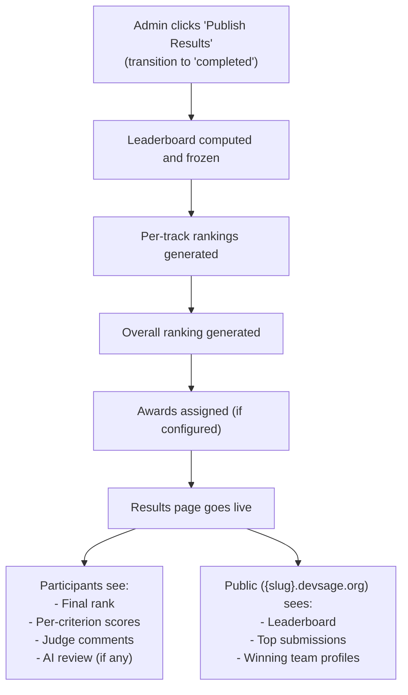

### Awards

Organizers can configure named awards that map to leaderboard positions:

```typescript
interface Award {
  id: string;
  hackathon_id: string;
  name: string;             // "1st Place", "Best UI/UX", "Most Innovative"
  track_id: string | null;  // null = overall, or track-specific
  round_id: string;         // FK → hackathon_rounds.id (typically final round)
  rank: number;             // Which leaderboard rank receives this award (1 = winner)
  prize_description: string | null;  // "GitHub Copilot for 1 year"
}
```

Awards are auto-assigned based on leaderboard positions when results are published. Organizers can manually override (reassign) if needed.

### Results Export

```
GET /api/v1/hackathons/:slug/results/export?format=csv
GET /api/v1/hackathons/:slug/results/export?format=json
→ Downloads full results: teams, scores, rankings, criteria breakdowns, judge comments
→ Requires: admin+
```

---

## Judge Dashboard

The judge dashboard is the primary interface for judges to review and score submissions. This section describes what the dashboard shows and how it behaves.

### Dashboard Layout

| Section | Content |
|---------|---------|
| **My Assignments** | List of assigned submissions with status (pending / in-progress / completed) |
| **Current Submission** | Code viewer (via GitHub), README, demo URL, screenshots, deck, AI review |
| **Scoring Form** | All applicable rubric criteria with score inputs and comment fields |
| **My Progress** | Progress bar: "5 of 12 submissions scored" |

### Submission View (for Judges)

When a judge opens a submission, they see:

1. **Code browser** — browsable file tree at the pinned commit SHA, fetched via GitHub Contents API
2. **README** — rendered Markdown
3. **Demo URL** — clickable link (opens in new tab)
4. **Compare with previous round** — link to GitHub compare view (if team submitted in previous rounds)
5. **AI review** — structured summary with strengths, concerns, and technical notes (clearly labeled as AI-generated, advisory only)
6. **Scoring form** — one input per rubric criterion, with the criterion description visible, plus an optional comment field per criterion. Scores auto-save as drafts. "Submit All" button locks scores.

### Assignment Status Flow

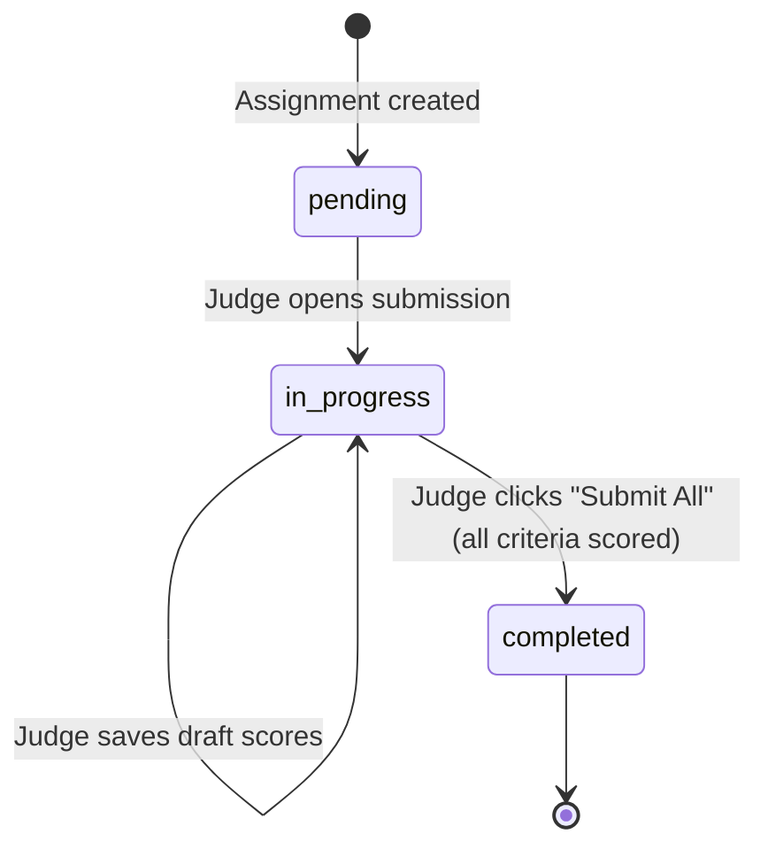

---

## Edge Cases

### Fewer Judges Than Submissions

If fewer than `reviews_per_submission` accepted judges are available, each submission gets as many reviewers as possible. The system does not block judging — even a single judge's scores produce a leaderboard. The organizer is warned: "Only {N} judges available. Submissions will receive fewer reviews than configured."

### Judge Is Also a Participant

If a user is both a participant and a judge (allowed in informal hackathons), the assignment algorithm ensures they are never assigned their own team's submission. The conflict check (`judge.user_id not in submission.team.members`) handles this.

### Judge Doesn't Complete All Assignments

The organizer can force-finalize judging even with incomplete assignments. Submissions with fewer scores than expected are scored using the scores they have — the weighted formula works with any number of scores. The leaderboard notes: "Scored by {N} of {expected} judges."

### Score Submitted After Judging Phase Ends

If the hackathon transitions to `completed` while a judge is mid-scoring, their remaining scores are rejected. The transition locks the scoring endpoints. Any in-progress work is lost. The frontend warns judges when the judging window is closing.

### Tie on Leaderboard

Ties are displayed as ties — no automatic tiebreaker. Both teams show the same rank. The organizer can manually resolve ties by assigning awards to specific teams.

### Rubric with Zero Criteria

A hackathon cannot transition from `draft` to `active` without at least one rubric criterion per round. The precondition check enforces this.

### AI Review Takes Too Long

The 25-second timeout is generous. If the AI provider is slow, the review job fails and is not retried (fail-open). The judge sees "AI review unavailable for this submission" and scores without it. No delay to the judging process.

### Judge Removed After Partial Scoring

If a judge is removed after scoring some submissions, their existing scores are preserved (write-once, immutable). Their remaining pending assignments are reassigned to other judges. The audit trail shows who scored what.

---

## Error Codes

| Code | HTTP Status | When |
|------|-------------|------|
| `JUDGE_NOT_FOUND` | 404 | Judge ID does not exist or has not accepted |
| `CRITERIA_NOT_FOUND` | 404 | Criterion does not exist for this hackathon/round |
| `SCORE_OUT_OF_RANGE` | 400 | Score < 0 or > max_score |
| `SUBMISSION_NOT_FOUND` | 404 | Submission does not exist or is not finalized |
| `NOT_ASSIGNED` | 403 | Judge is not assigned to this submission |
| `SCORE_ALREADY_SUBMITTED` | 400 | Attempting to edit a score that has already been submitted (locked) |
| `INCOMPLETE_SCORES` | 400 | Attempting to submit scores but not all criteria have draft scores |
| `JUDGING_NOT_ACTIVE` | 400 | Attempting to score when round is not in 'judging' status |
| `RUBRIC_LOCKED` | 400 | Attempting to edit rubric after hackathon is `active` |
| `ALREADY_INVITED` | 409 | Judge already invited to this hackathon |
| `ASSIGNMENT_CONFLICT` | 400 | Judge cannot be assigned to their own team's submission |
| `NO_JUDGES_AVAILABLE` | 400 | No accepted judges available for assignment |
| `NO_SUBMISSIONS` | 400 | No finalized submissions to assign for this round |
| `ROUND_NOT_FOUND` | 404 | Specified round does not exist |
| `ADVANCEMENT_FAILED` | 400 | Cannot advance — round scoring incomplete |

---

## Database Tables

### `judges`

| Column | Type | Notes |
|--------|------|-------|
| `id` | TEXT PK | UUID |
| `hackathon_id` | TEXT FK | → hackathons.id |
| `user_id` | TEXT FK | → users.id |
| `invite_status` | TEXT | `pending`, `accepted`, `declined`, `removed` |
| `invited_by` | TEXT FK | → users.id (who invited) |
| `responded_at` | TEXT | ISO-8601. Nullable. |
| `created_at` | TEXT | ISO-8601 |

**Indexes:** unique(`hackathon_id`, `user_id`), `invite_status`.

### `judge_tracks` (new)

| Column | Type | Notes |
|--------|------|-------|
| `id` | TEXT PK | UUID |
| `judge_id` | TEXT FK | → judges.id |
| `track_id` | TEXT FK | → hackathon_tracks.id |

**Indexes:** unique(`judge_id`, `track_id`).

### `rubric_criteria` (modified from v2)

| Column | Type | Notes |
|--------|------|-------|
| `id` | TEXT PK | UUID |
| `hackathon_id` | TEXT FK | → hackathons.id |
| `track_id` | TEXT FK | Nullable. null = all tracks. |
| `round_id` | TEXT FK | → hackathon_rounds.id. Which round this criterion applies to. |
| `name` | TEXT | Criterion name |
| `description` | TEXT | Evaluation guidance for judges |
| `max_score` | INTEGER | Default 10 |
| `weight` | REAL | Default 1.0 |
| `sort_order` | INTEGER | Display ordering |
| `created_at` | TEXT | ISO-8601 |

**Indexes:** `hackathon_id`, `track_id`, `round_id`.

### `judge_assignments` (modified from v2)

| Column | Type | Notes |
|--------|------|-------|
| `id` | TEXT PK | UUID |
| `judge_id` | TEXT FK | → judges.id |
| `team_id` | TEXT FK | → teams.id |
| `hackathon_id` | TEXT FK | → hackathons.id |
| `submission_id` | TEXT FK | → submissions.id (pinned finalized submission) |
| `round_id` | TEXT FK | → hackathon_rounds.id |
| `status` | TEXT | `pending`, `in_progress`, `completed` |
| `assigned_at` | TEXT | ISO-8601 |
| `completed_at` | TEXT | ISO-8601. Nullable. |

**Indexes:** unique(`judge_id`, `team_id`, `round_id`), `hackathon_id`, `submission_id`, `status`.

### `scores` (modified from v2)

| Column | Type | Notes |
|--------|------|-------|
| `id` | TEXT PK | UUID |
| `submission_id` | TEXT FK | → submissions.id |
| `judge_id` | TEXT FK | → judges.id |
| `criteria_id` | TEXT FK | → rubric_criteria.id |
| `score` | INTEGER | 0 to max_score |
| `comment` | TEXT | Nullable. Max 1000 chars. |
| `is_submitted` | INTEGER | 0 = draft (editable), 1 = submitted (locked). One-way transition. |
| `round_id` | TEXT FK | → hackathon_rounds.id |
| `scored_at` | TEXT | ISO-8601. Last edit time (draft) or submission time (submitted). |

**Indexes:** unique(`submission_id`, `judge_id`, `criteria_id`), `judge_id`, `round_id`, `is_submitted`.

### `ai_reviews` (modified from v2)

| Column | Type | Notes |
|--------|------|-------|
| `id` | TEXT PK | UUID |
| `submission_id` | TEXT FK | → submissions.id |
| `commit_sha` | TEXT | Pinned commit |
| `round_id` | TEXT FK | → hackathon_rounds.id |
| `provider` | TEXT | "openai", "anthropic", etc. |
| `model` | TEXT | "gpt-4o-mini", etc. |
| `prompt_hash` | TEXT | SHA-256 of the prompt |
| `summary` | TEXT | 2-3 sentence overview |
| `strengths` | TEXT | JSON string array |
| `concerns` | TEXT | JSON string array |
| `technical_notes` | TEXT | Detailed observations |
| `raw_response` | TEXT | Full AI response |
| `tokens_used` | INTEGER | |
| `latency_ms` | INTEGER | |
| `created_at` | TEXT | ISO-8601 |

**Indexes:** unique(`submission_id`, `round_id`), `commit_sha`.

### `awards` (new)

| Column | Type | Notes |
|--------|------|-------|
| `id` | TEXT PK | UUID |
| `hackathon_id` | TEXT FK | → hackathons.id |
| `name` | TEXT | "1st Place", "Best UI/UX", "Most Innovative" |
| `track_id` | TEXT FK | Nullable. null = overall. |
| `round_id` | TEXT FK | → hackathon_rounds.id (typically final round) |
| `rank` | INTEGER | Which leaderboard rank receives this award |
| `prize_description` | TEXT | Nullable |
| `team_id` | TEXT FK | Nullable. Auto-assigned or manually overridden. |
| `created_at` | TEXT | ISO-8601 |

**Indexes:** `hackathon_id`.

> **Note:** Round configuration (round names, types, advancement methods) is defined in the `hackathon_rounds` table — see submissions.md. The judging system references those rounds via `round_id` foreign keys.

---

## Decision Log

| Decision | Choice | Why | Alternatives Considered |
|----------|--------|-----|------------------------|
| Draft-then-submit scores | Editable until "Submit All" | Allows judges to iterate while reviewing. Once submitted, locked to prevent anchoring bias. Best of both worlds: flexibility during review, integrity after submission. | Write-once — too strict, no room for honest revision. Fully editable — bias risk from seeing others' scores. |
| Round-robin assignment | Deterministic, balanced | Every team gets the same number of reviewers. Every judge gets similar workload. Deterministic = debuggable. Simple to implement. | Random assignment — unbalanced. Self-selection — judges cherry-pick easy submissions. Expertise matching — no skill data to match on. |
| AI as advisor only | Never scores, never influences leaderboard | Judges are accountable for scores. AI can hallucinate or miss context. AI review is a tool, not a replacement. Keeping it advisory means we never need to explain "the AI gave you a low score." | AI scoring — no accountability, bias risk. AI + human hybrid score — opaque, hard to explain. |
| Blind mode hides team names | Prevents reputation bias | A team with a famous developer shouldn't get higher scores. Blind mode levels the playing field. Unblinding happens at results, so the reveal is part of the ceremony. | No blind mode — reputation bias. Permanent blind — no reveal, less exciting. |
| No audience voting | Judges only | Audience voting is a popularity contest that can distort technical evaluation. Invite-only model limits the voter pool anyway. Judges are the authoritative evaluators. | Audience voting — popularity bias, limited voter pool in invite-only model. |
| Per-round judging (tied to hackathon rounds) | Unified round system | Judging rounds are the same as hackathon rounds from submissions.md. One round definition, used by both submission and judging systems. Eliminates concept duplication. | Separate judging rounds — confusing, two round systems to configure. |
| Scores don't carry between rounds | Fresh evaluation per round | Each round is independent. Carrying scores biases later rounds toward earlier preferences. Clean slate is fairer. | Carry forward — biased. Weighted carry — complex, still biased. |
| Rubric locked at active | Fairness | Participants should know evaluation criteria before building. Changing rubric after hackathon starts is unfair. | Lock at judging — too late, teams already built without knowing criteria. Never lock — constant changes, confusing. |
| Draft-then-submit scoring | All-or-nothing per submission | Judges save drafts as they go, then submit all scores for a submission at once. Prevents partial scoring states while allowing iteration. | Individual saves without submit — partial states, complex progress tracking. Batch-only — no saving progress. |
| Ties displayed as ties | No automatic tiebreaker | Tiebreaking rules are policy decisions (submission time? fewer team members? audience votes?). The platform should not impose one. Organizers resolve ties manually. | Auto-tiebreak by submission time — arbitrary. Random tiebreak — unfair. |
