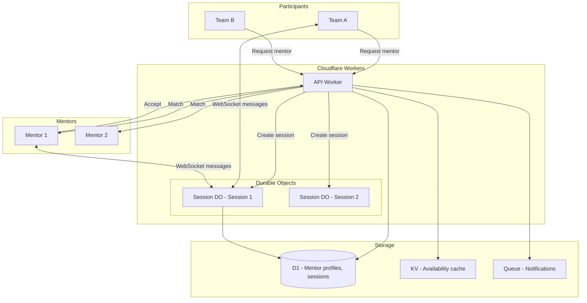
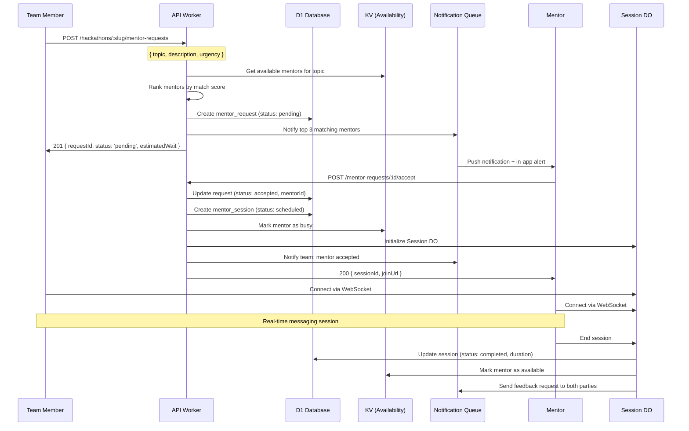
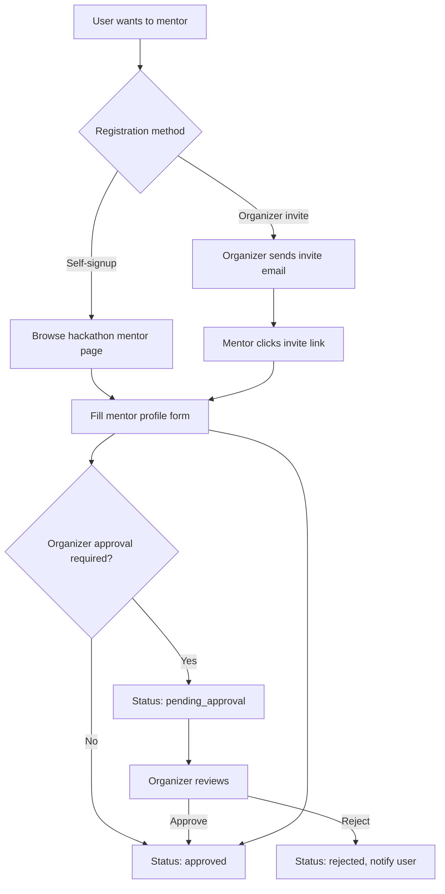
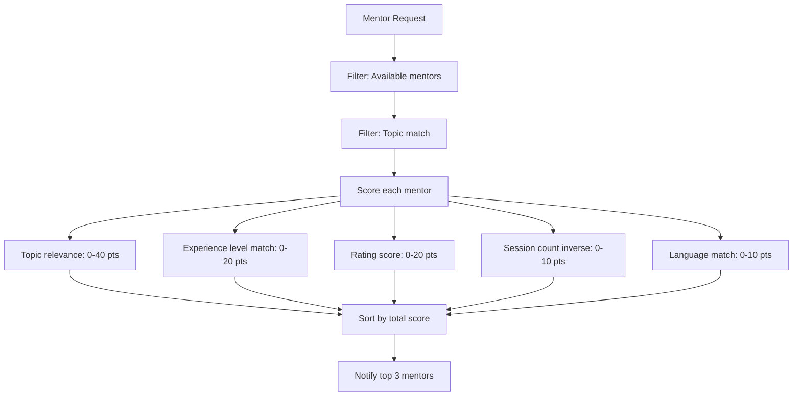
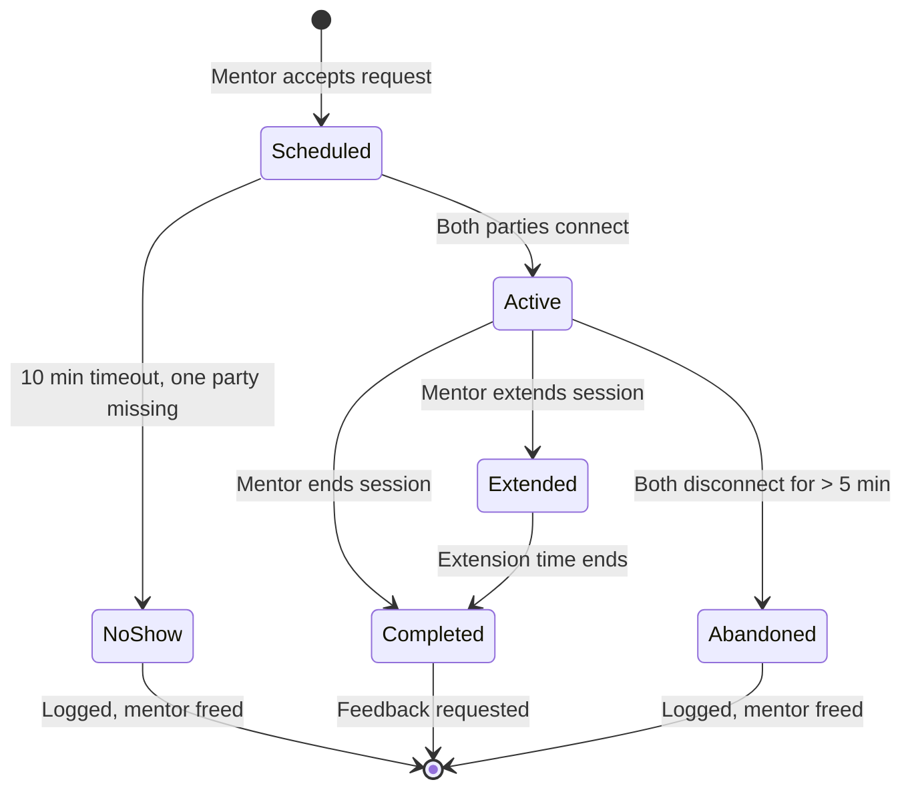
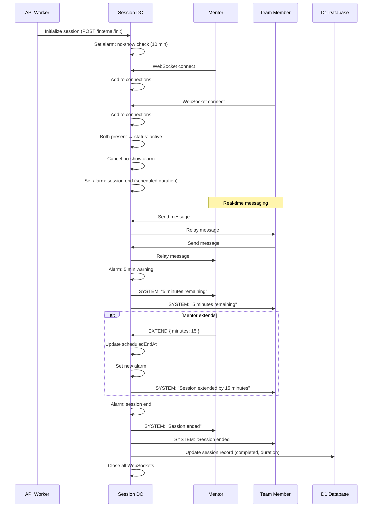
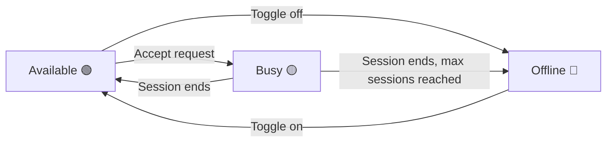

# 17 — Mentorship System

> Mentor-team matching with topic-based discovery, session scheduling via Durable Objects, real-time messaging, structured feedback loops, and mentor availability tracking — connecting experienced practitioners with hackathon teams when they need help most.

---

## Table of Contents

1. [Design Goals](#design-goals)
2. [Architecture Overview](#architecture-overview)
3. [Mentor Registration](#mentor-registration)
4. [Mentor Discovery & Matching](#mentor-discovery--matching)
5. [Session Management](#session-management)
6. [Session Durable Object](#session-durable-object)
7. [Messaging](#messaging)
8. [Scheduling](#scheduling)
9. [Feedback System](#feedback-system)
10. [Mentor Dashboard](#mentor-dashboard)
11. [Organizer Controls](#organizer-controls)
12. [API Endpoints](#api-endpoints)
13. [Edge Cases](#edge-cases)
14. [Error Codes](#error-codes)
15. [Database Tables](#database-tables)
16. [Decision Log](#decision-log)

---

## Design Goals

| Goal | Target | Rationale |
|------|--------|-----------|
| Time from request to match | < 5 minutes (during active hours) | Hackathon time is precious; stuck teams need help fast |
| Session start latency | < 30 seconds after acceptance | Mentor and team should connect immediately |
| Message delivery | < 500ms end-to-end | Real-time conversation during sessions |
| Mentor availability accuracy | < 1 minute staleness | Teams should not request unavailable mentors |
| Feedback submission rate | > 80% of sessions | Feedback improves mentor quality and matching |
| Max concurrent sessions per mentor | 1 | Focused attention produces better outcomes |
| Session duration tracking | Accurate to ±1 minute | Data for organizer reporting and mentor recognition |

---

## Architecture Overview



### Request-to-Session Flow



---

## Mentor Registration

### Becoming a Mentor

Mentors register per-hackathon. An organizer can also directly invite mentors.



### Mentor Profile

```typescript
interface MentorProfile {
  id: string;
  hackathonId: string;
  userId: string;
  
  // Professional info
  displayName: string;
  bio: string;                      // Max 500 chars
  company?: string;
  jobTitle?: string;
  avatarUrl: string;
  
  // Expertise
  topics: MentorTopic[];            // Skills/areas they can help with
  experienceLevel: 'junior' | 'mid' | 'senior' | 'staff' | 'principal';
  yearsOfExperience?: number;
  
  // Availability
  availabilitySchedule: AvailabilitySlot[];
  timezone: string;                 // IANA timezone (e.g., "America/New_York")
  maxSessionsPerDay: number;        // Default: 5
  sessionDurationMinutes: number;   // Default: 30, options: 15, 30, 45, 60
  
  // Preferences
  preferredTeamSize?: 'small' | 'medium' | 'large' | 'any';
  languages: string[];              // Spoken languages
  
  // Status
  status: 'pending_approval' | 'approved' | 'rejected' | 'inactive';
  currentAvailability: 'available' | 'busy' | 'offline';
  
  // Stats
  totalSessions: number;
  averageRating: number;            // 1-5 scale
  totalFeedbackCount: number;
  
  createdAt: string;
  updatedAt: string;
}

interface MentorTopic {
  name: string;                     // e.g., "React", "Machine Learning", "DevOps"
  proficiency: 'familiar' | 'proficient' | 'expert';
}

interface AvailabilitySlot {
  dayOfWeek: 0 | 1 | 2 | 3 | 4 | 5 | 6;  // 0 = Sunday
  startTime: string;               // HH:mm in mentor's timezone
  endTime: string;                  // HH:mm in mentor's timezone
}
```

---

## Mentor Discovery & Matching

### Discovery Page

Participants browse available mentors filtered by topic, availability, and rating.

```
┌─────────────────────────────────────────────────────────────┐
│  Find a Mentor                                               │
│  ┌──────────────────────────────────────────────────────┐   │
│  │ 🔍 Search by topic, name, or skill...                │   │
│  └──────────────────────────────────────────────────────┘   │
│                                                              │
│  Filters: [Topic ▼] [Available Now ▼] [Language ▼]          │
│                                                              │
│  ┌─────────────────────────────┐ ┌──────────────────────┐   │
│  │ 🟢 Alice Chen               │ │ 🟡 Bob Park          │   │
│  │ Senior Engineer @ Stripe    │ │ Staff Eng @ Google   │   │
│  │ Topics: React, TypeScript,  │ │ Topics: ML, Python,  │   │
│  │         System Design       │ │         Data Pipelines│   │
│  │ ⭐ 4.8 (23 sessions)       │ │ ⭐ 4.9 (15 sessions) │   │
│  │ Available now               │ │ Available in 30m     │   │
│  │ [Request Session]           │ │ [Request Session]    │   │
│  └─────────────────────────────┘ └──────────────────────┘   │
│                                                              │
│  ┌─────────────────────────────┐ ┌──────────────────────┐   │
│  │ 🔴 Carol Davis              │ │ 🟢 Dan Kim           │   │
│  │ CTO @ StartupXYZ           │ │ DevRel @ Cloudflare  │   │
│  │ Topics: Architecture,       │ │ Topics: Workers,     │   │
│  │         Product, Pitching   │ │         Serverless   │   │
│  │ ⭐ 4.7 (31 sessions)       │ │ ⭐ 5.0 (8 sessions)  │   │
│  │ In session (busy)           │ │ Available now        │   │
│  │ [Join Waitlist]             │ │ [Request Session]    │   │
│  └─────────────────────────────┘ └──────────────────────┘   │
└─────────────────────────────────────────────────────────────┘
```

### Matching Algorithm

When a team requests a mentor, the system ranks available mentors:



### Scoring Breakdown

| Factor | Weight | Calculation |
|--------|--------|-------------|
| Topic relevance | 40 points | `expert` in requested topic = 40, `proficient` = 30, `familiar` = 20, partial match = 10 |
| Experience match | 20 points | Closer to team's needs = higher. Senior/Staff preferred for architecture, junior OK for quick debugging |
| Average rating | 20 points | `(averageRating / 5) × 20` |
| Load balancing | 10 points | Mentors with fewer sessions today score higher. `(1 - sessionsToday / maxSessionsPerDay) × 10` |
| Language match | 10 points | Shared language with requesting team member = 10, fallback to English = 5 |

### Request Routing

```typescript
interface MentorRequest {
  id: string;
  hackathonId: string;
  teamId: string;
  requestedBy: string;          // User ID of team member who requested
  
  // What they need help with
  topic: string;                // Primary topic
  description: string;          // What they're stuck on (max 500 chars)
  urgency: 'low' | 'normal' | 'urgent';
  preferredMentorId?: string;   // Specific mentor requested (optional)
  
  // Matching state
  status: 'pending' | 'matched' | 'accepted' | 'expired' | 'cancelled';
  notifiedMentorIds: string[];  // Mentors who were notified
  matchedMentorId?: string;     // Mentor who accepted
  sessionId?: string;           // Created session ID
  
  // Timing
  expiresAt: string;            // Request expires after 30 minutes
  createdAt: string;
  matchedAt?: string;
  acceptedAt?: string;
}
```

### Request Expiry & Escalation

| Time Since Request | Action |
|-------------------|--------|
| 0 minutes | Notify top 3 matching mentors |
| 5 minutes | If no response, notify next 3 mentors |
| 10 minutes | Notify organizer: "Unmatched request needs attention" |
| 15 minutes | If urgent, notify ALL available mentors for topic |
| 30 minutes | Request expires. Team notified: "No mentors available. Try again later." |

---

## Session Management

### Session States



### Session Data

```typescript
interface MentorSession {
  id: string;
  hackathonId: string;
  requestId: string;            // Originating request
  mentorId: string;             // Mentor profile ID
  mentorUserId: string;         // Mentor user ID
  teamId: string;
  
  // Participants
  participants: SessionParticipant[];
  
  // Timing
  status: 'scheduled' | 'active' | 'extended' | 'completed' | 'no_show' | 'abandoned';
  scheduledDurationMinutes: number;
  actualDurationMinutes?: number;
  scheduledStartAt: string;
  actualStartAt?: string;
  endedAt?: string;
  extendedUntil?: string;
  
  // Content
  topic: string;
  description: string;
  notes?: string;               // Mentor's session notes (private to mentor)
  
  // Feedback
  mentorFeedbackId?: string;
  teamFeedbackId?: string;
  
  createdAt: string;
  updatedAt: string;
}

interface SessionParticipant {
  userId: string;
  role: 'mentor' | 'team_member';
  joinedAt?: string;
  leftAt?: string;
  present: boolean;
}
```

---

## Session Durable Object

Each active mentoring session gets its own Durable Object for real-time messaging and state management.

### DO Responsibilities

| Responsibility | Implementation |
|---------------|---------------|
| WebSocket management | Accept connections from mentor + team members |
| Message relay | Broadcast messages to all session participants |
| Session timer | Alarm-based duration tracking and auto-end |
| Presence tracking | Track who is connected, detect no-shows |
| Message persistence | Store messages in DO SQLite for history |
| State transitions | Manage session state machine |

### DO State

```typescript
interface SessionDOState {
  sessionId: string;
  hackathonId: string;
  mentorUserId: string;
  teamId: string;
  allowedUserIds: Set<string>;    // Mentor + team members
  
  // Connections
  connections: Map<string, {
    userId: string;
    role: 'mentor' | 'team_member';
    socket: WebSocket;
    connectedAt: string;
  }>;
  
  // Session state
  status: 'waiting' | 'active' | 'extended' | 'ending';
  startedAt?: string;
  scheduledEndAt: string;
  
  // Messages
  messageSequence: number;
}
```

### DO Lifecycle



### Alarm Schedule

| Alarm | Trigger | Action |
|-------|---------|--------|
| No-show check | 10 min after creation | If < 2 participants connected, mark `no_show`, close session |
| 5-minute warning | 5 min before scheduled end | Send system message to all participants |
| Session end | At scheduled end time | End session, persist messages, update D1 |
| Idle check | Every 5 minutes during active | If all connections dropped > 5 min ago, mark `abandoned` |
| Extension limit | At extended end time | Hard end — cannot extend beyond 2× original duration |

---

## Messaging

### Message Protocol

```typescript
// Client → Server
type ClientSessionMessage =
  | { type: 'MESSAGE'; content: string }
  | { type: 'TYPING' }
  | { type: 'STOP_TYPING' }
  | { type: 'EXTEND'; minutes: 15 | 30 }  // Mentor only
  | { type: 'END_SESSION' }                // Mentor only
  | { type: 'PING' };

// Server → Client
type ServerSessionMessage =
  | { type: 'MESSAGE'; id: string; userId: string; username: string; role: string; content: string; timestamp: string }
  | { type: 'TYPING'; userId: string; username: string }
  | { type: 'STOP_TYPING'; userId: string }
  | { type: 'SYSTEM'; content: string; timestamp: string }
  | { type: 'PARTICIPANT_JOINED'; userId: string; username: string; role: string }
  | { type: 'PARTICIPANT_LEFT'; userId: string; username: string }
  | { type: 'SESSION_EXTENDED'; newEndAt: string; extendedBy: number }
  | { type: 'SESSION_ENDING'; minutesRemaining: number }
  | { type: 'SESSION_ENDED'; duration: number; feedbackUrl: string }
  | { type: 'PONG'; serverTime: string }
  | { type: 'ERROR'; code: string; message: string };
```

### Message Constraints

| Constraint | Value | Rationale |
|-----------|-------|-----------|
| Max message length | 2,000 characters | Keeps messages readable, prevents abuse |
| Max messages per minute per user | 30 | Prevents flooding |
| Max participants per session | 6 | Mentor + up to 5 team members |
| Message history retention | 90 days | Post-hackathon reference |
| Typing indicator timeout | 5 seconds | Auto-clear if no follow-up |

### Message Storage

Messages are stored in the Session DO's embedded SQLite during the active session, then flushed to D1 when the session ends:

```typescript
// DO SQLite during session (fast writes)
interface DOMessage {
  id: string;
  sequence: number;
  userId: string;
  role: 'mentor' | 'team_member' | 'system';
  content: string;
  createdAt: string;
}

// Flushed to D1 on session end (persistent)
// Same schema as mentor_session_messages table
```

---

## Scheduling

### Availability Management

Mentors set their availability in two ways:

#### 1. Recurring Schedule

Weekly recurring slots (e.g., "Available Sat-Sun 10am-6pm"):

```typescript
interface RecurringAvailability {
  slots: AvailabilitySlot[];
  timezone: string;
  // Effective during the hackathon's active period
}
```

#### 2. Real-time Status Toggle

Manual toggle for immediate availability changes:



### Availability Resolution

```typescript
// Availability is determined by combining schedule + manual toggle + session state
function resolveAvailability(mentor: MentorProfile): 'available' | 'busy' | 'offline' {
  // 1. If currently in a session → busy
  if (hasActiveSession(mentor.id)) return 'busy';
  
  // 2. If manually set to offline → offline
  if (mentor.manualStatus === 'offline') return 'offline';
  
  // 3. If outside scheduled hours → offline
  if (!isWithinSchedule(mentor.availabilitySchedule, mentor.timezone)) return 'offline';
  
  // 4. If max sessions per day reached → offline
  if (getSessionCountToday(mentor.id) >= mentor.maxSessionsPerDay) return 'offline';
  
  // 5. Otherwise → available
  return 'available';
}
```

### Availability Cache (KV)

Current availability is cached in KV for fast lookups:

```typescript
// KV key: mentor-availability:{hackathonId}
// KV value: JSON map of mentorId → availability status
// TTL: 60 seconds (refreshed by availability changes)

interface AvailabilityCache {
  [mentorId: string]: {
    status: 'available' | 'busy' | 'offline';
    topics: string[];
    updatedAt: string;
  };
}
```

Updated whenever:
- Mentor toggles availability
- Session starts (→ busy)
- Session ends (→ available or offline based on schedule)
- Cron checks scheduled transitions

---

## Feedback System

### Post-Session Feedback

Both mentor and team submit feedback after each session. Feedback request sent automatically when session ends.

### Team → Mentor Feedback

```typescript
interface TeamFeedback {
  id: string;
  sessionId: string;
  submittedBy: string;        // Team member who fills it out
  
  // Rating (required)
  overallRating: 1 | 2 | 3 | 4 | 5;
  
  // Specific ratings (required)
  helpfulness: 1 | 2 | 3 | 4 | 5;     // How helpful was the advice?
  communication: 1 | 2 | 3 | 4 | 5;   // How clear was the communication?
  expertise: 1 | 2 | 3 | 4 | 5;       // How knowledgeable on the topic?
  
  // Optional
  wouldRecommend: boolean;
  comment?: string;            // Max 500 chars
  tags?: string[];             // ['patient', 'great_explainer', 'hands_on', 'encouraging']
  
  createdAt: string;
}
```

### Mentor → Team Feedback

```typescript
interface MentorFeedback {
  id: string;
  sessionId: string;
  
  // Rating (required)
  teamPreparedness: 1 | 2 | 3 | 4 | 5;   // Were they prepared with questions?
  engagement: 1 | 2 | 3 | 4 | 5;          // Were they engaged during session?
  
  // Session outcome
  outcome: 'resolved' | 'partially_resolved' | 'needs_followup' | 'topic_mismatch';
  
  // Optional
  internalNotes?: string;      // Visible only to mentor and organizer
  suggestedTopics?: string[];  // Topics the team should explore
  followUpNeeded: boolean;
  
  createdAt: string;
}
```

### Feedback Impact

| Feedback Signal | System Response |
|----------------|-----------------|
| Rating < 3.0 average (after 5+ sessions) | Flag to organizer for review |
| Rating > 4.5 average (after 10+ sessions) | "Top Mentor" badge on profile |
| `wouldRecommend: false` from 3+ teams | Lower matching priority |
| `outcome: topic_mismatch` | Adjust topic proficiency scoring |
| `followUpNeeded: true` | Create follow-up request suggestion for team |
| Consistent `patient` tag | Boost priority for first-time hackathon teams |

### Feedback Reminders

| Timing | Action |
|--------|--------|
| Session ends | In-app notification + email: "How was your session?" |
| 2 hours after | Reminder notification if feedback not submitted |
| 24 hours after | Final reminder |
| 48 hours after | Feedback window closes |

---

## Mentor Dashboard

### Mentor View

```
┌─────────────────────────────────────────────────────────────┐
│  Mentor Dashboard — Summer Hack 2026                         │
│  Status: 🟢 Available    [Go Offline]                        │
├──────────┬──────────┬──────────┬──────────┬─────────────────┤
│ Sessions │ Today    │ Rating   │ Feedback │ Time Given      │
│ Total    │          │          │ Pending  │                 │
│ 14       │ 3/5      │ ⭐ 4.8   │ 2        │ 7h 30m          │
├──────────┴──────────┴──────────┴──────────┴─────────────────┤
│                                                              │
│  Incoming Requests                                           │
│  ┌──────────────────────────────────────────────────────┐   │
│  │ 🔴 URGENT — Team ByteForge                           │   │
│  │ Topic: React state management                        │   │
│  │ "Our context provider is causing infinite re-renders  │   │
│  │  and we can't figure out why"                         │   │
│  │ Requested 2 min ago                                   │   │
│  │ [Accept] [Pass]                                       │   │
│  └──────────────────────────────────────────────────────┘   │
│                                                              │
│  Today's Sessions                                            │
│  ┌──────────────────────────────────────────────────────┐   │
│  │ ✅ 10:00 — Team Alpha (30 min) — Docker deployment   │   │
│  │ ✅ 11:15 — Team Gamma (45 min) — API design          │   │
│  │ ✅ 14:00 — Team Delta (30 min) — React Router        │   │
│  └──────────────────────────────────────────────────────┘   │
│                                                              │
│  Pending Feedback (from your sessions)                       │
│  ┌──────────────────────────────────────────────────────┐   │
│  │ Session with Team Alpha — [Give Feedback]             │   │
│  │ Session with Team Gamma — [Give Feedback]             │   │
│  └──────────────────────────────────────────────────────┘   │
│                                                              │
│  [Edit Profile]  [Update Availability]  [View All Sessions]  │
└─────────────────────────────────────────────────────────────┘
```

---

## Organizer Controls

### Mentor Management

| Feature | Description |
|---------|-------------|
| Approve/reject mentors | Review mentor applications (if approval required) |
| Invite mentors | Send direct invites to known mentors |
| Assign mentor to team | Manually match mentor ↔ team |
| View all sessions | Cross-mentor session list with filters |
| Override availability | Force mentor online/offline |
| Remove mentor | Deactivate mentor profile, cancel pending requests |
| View feedback | All feedback across all mentors |

### Organizer Analytics

| Metric | Description |
|--------|-------------|
| Total mentor sessions | Count of completed sessions |
| Average session duration | Mean duration across all sessions |
| Average response time | Time from request to mentor acceptance |
| Average rating | Mean mentor rating across all sessions |
| No-show rate | Sessions that ended as no_show / total |
| Topic demand | Most requested topics (unmet demand visible) |
| Mentor utilization | Sessions per mentor / available hours |
| Unmatched requests | Requests that expired without a match |

### Topic Management

Organizers define the available mentor topics for their hackathon:

```typescript
interface MentorTopicConfig {
  hackathonId: string;
  topics: Array<{
    name: string;           // e.g., "React", "Machine Learning"
    category: string;       // e.g., "Frontend", "AI/ML", "DevOps"
    description?: string;   // What this topic covers
    icon?: string;          // Emoji or icon name
  }>;
}
```

Mentors select from this predefined list. This ensures consistent matching and prevents topic fragmentation.

---

## API Endpoints

### Mentor Profile

| Method | Path | Auth | Min Role | Description |
|--------|------|------|----------|-------------|
| POST | `/api/v1/hackathons/:slug/mentors` | JWT | participant | Register as mentor |
| GET | `/api/v1/hackathons/:slug/mentors` | JWT | participant | List available mentors (filtered) |
| GET | `/api/v1/hackathons/:slug/mentors/:mentorId` | JWT | participant | Get mentor profile |
| PATCH | `/api/v1/hackathons/:slug/mentors/:mentorId` | JWT | self/admin | Update mentor profile |
| DELETE | `/api/v1/hackathons/:slug/mentors/:mentorId` | JWT | self/admin | Deactivate mentor profile |
| PATCH | `/api/v1/hackathons/:slug/mentors/:mentorId/availability` | JWT | self | Update availability toggle |

### Mentor Requests

| Method | Path | Auth | Min Role | Description |
|--------|------|------|----------|-------------|
| POST | `/api/v1/hackathons/:slug/mentor-requests` | JWT | participant | Create mentor request |
| GET | `/api/v1/hackathons/:slug/mentor-requests` | JWT | participant | List own team's requests |
| GET | `/api/v1/hackathons/:slug/mentor-requests/incoming` | JWT | mentor | List requests awaiting mentor |
| POST | `/api/v1/hackathons/:slug/mentor-requests/:id/accept` | JWT | mentor | Accept a request |
| POST | `/api/v1/hackathons/:slug/mentor-requests/:id/pass` | JWT | mentor | Pass on a request |
| POST | `/api/v1/hackathons/:slug/mentor-requests/:id/cancel` | JWT | participant | Cancel own request |

### Sessions

| Method | Path | Auth | Min Role | Description |
|--------|------|------|----------|-------------|
| GET | `/api/v1/hackathons/:slug/mentor-sessions` | JWT | participant | List own sessions (mentor or team) |
| GET | `/api/v1/hackathons/:slug/mentor-sessions/:sessionId` | JWT | participant | Get session details |
| GET | `/api/v1/hackathons/:slug/mentor-sessions/:sessionId/messages` | JWT | participant | Get message history |
| POST | `/api/v1/hackathons/:slug/mentor-sessions/:sessionId/extend` | JWT | mentor | Extend session duration |
| POST | `/api/v1/hackathons/:slug/mentor-sessions/:sessionId/end` | JWT | mentor | End session |

### Session WebSocket

| Method | Path | Auth | Description |
|--------|------|------|-------------|
| GET | `/ws/mentor-session/:sessionId` | JWT cookie | Upgrade to WebSocket for real-time messaging |

### Feedback

| Method | Path | Auth | Min Role | Description |
|--------|------|------|----------|-------------|
| POST | `/api/v1/hackathons/:slug/mentor-sessions/:sessionId/feedback` | JWT | participant | Submit feedback |
| GET | `/api/v1/hackathons/:slug/mentor-sessions/:sessionId/feedback` | JWT | participant | Get feedback (own only) |
| GET | `/api/v1/hackathons/:slug/mentors/:mentorId/feedback` | JWT | admin | Get all feedback for a mentor |

### Organizer Endpoints

| Method | Path | Auth | Min Role | Description |
|--------|------|------|----------|-------------|
| GET | `/api/v1/hackathons/:slug/mentors/admin` | JWT | admin | List all mentors with stats |
| PATCH | `/api/v1/hackathons/:slug/mentors/:mentorId/approve` | JWT | admin | Approve mentor application |
| PATCH | `/api/v1/hackathons/:slug/mentors/:mentorId/reject` | JWT | admin | Reject mentor application |
| POST | `/api/v1/hackathons/:slug/mentors/invite` | JWT | admin | Invite mentor by email |
| GET | `/api/v1/hackathons/:slug/mentor-analytics` | JWT | admin | Mentorship analytics |
| POST | `/api/v1/hackathons/:slug/mentor-topics` | JWT | admin | Set available mentor topics |
| GET | `/api/v1/hackathons/:slug/mentor-topics` | JWT | participant | Get available mentor topics |

---

## Edge Cases

| Scenario | Behavior |
|----------|----------|
| Team requests mentor but no mentors registered for topic | Return 200 with `estimatedWait: null` and message: "No mentors available for this topic. Try broadening your topic or asking later." |
| Mentor accepts request but team already cancelled | 409 MENTOR_REQUEST_ALREADY_RESOLVED. Mentor freed immediately |
| Two mentors accept same request simultaneously | First `accept` wins (D1 transaction with status check). Second gets 409 |
| Mentor's connection drops during session | Session stays active for 5 minutes. If mentor reconnects, session resumes. If not, session marked `abandoned` |
| All team members disconnect during session | Session stays active for 5 minutes (mentor can still leave notes). If no reconnect, session ends |
| Mentor tries to extend beyond 2× original duration | Extension rejected with error. Suggest ending and starting a new session |
| Team requests same mentor who is already in another session | Mentor shown as `busy`. Team can request a different mentor or join waitlist |
| Mentor has max sessions for the day | Mentor shown as `offline` in discovery. Cannot accept new requests |
| Feedback submitted after 48-hour window | 410 FEEDBACK_WINDOW_CLOSED |
| Team submits mentor request while already having an active session | 409 — one active session per team at a time |
| Hackathon phase is not ACTIVE | Mentor requests blocked. "Mentorship is only available during the active hackathon phase" |
| Mentor registered for hackathon A tries to mentor in hackathon B | 403 — mentor profiles are per-hackathon |
| Session DO evicted during active session | Both parties disconnected. On reconnect, DO rehydrates from SQLite. Messages preserved. Timer resumes from last known state |
| Very long session (2+ hours) | Hard cap at 2× original duration. System sends warning at 1.5×, auto-ends at 2× |
| Team has 1 member who requests a mentor | Valid — solo participants can request mentors too. Session has 2 participants (mentor + 1) |

---

## Error Codes

| Code | HTTP Status | Condition |
|------|-------------|-----------|
| `MENTOR_NOT_FOUND` | 404 | Mentor profile ID doesn't exist |
| `MENTOR_NOT_APPROVED` | 403 | Mentor profile pending approval or rejected |
| `MENTOR_ALREADY_REGISTERED` | 409 | User already has a mentor profile for this hackathon |
| `MENTOR_UNAVAILABLE` | 409 | Mentor is busy or offline |
| `MENTOR_MAX_SESSIONS` | 429 | Mentor reached daily session limit |
| `MENTOR_REQUEST_NOT_FOUND` | 404 | Request ID doesn't exist |
| `MENTOR_REQUEST_EXPIRED` | 410 | Request past 30-minute expiry |
| `MENTOR_REQUEST_ALREADY_RESOLVED` | 409 | Request already accepted, cancelled, or expired |
| `MENTOR_REQUEST_ACTIVE_EXISTS` | 409 | Team already has an active/pending request |
| `MENTOR_SESSION_NOT_FOUND` | 404 | Session ID doesn't exist |
| `MENTOR_SESSION_NOT_ACTIVE` | 409 | Action attempted on non-active session |
| `MENTOR_SESSION_EXTEND_LIMIT` | 400 | Cannot extend beyond 2× original duration |
| `MENTOR_SESSION_ACTIVE_EXISTS` | 409 | Team already has an active session |
| `MENTOR_TOPIC_NOT_FOUND` | 400 | Requested topic not in hackathon's topic list |
| `MENTOR_FEEDBACK_ALREADY_SUBMITTED` | 409 | Feedback already submitted for this session |
| `MENTOR_FEEDBACK_WINDOW_CLOSED` | 410 | Past 48-hour feedback submission window |
| `MENTOR_FEEDBACK_NOT_PARTICIPANT` | 403 | User was not a participant in this session |
| `MENTORSHIP_NOT_ACTIVE` | 403 | Hackathon is not in ACTIVE phase |
| `MENTORSHIP_NOT_ENABLED` | 403 | Organizer has not enabled mentorship for this hackathon |
| `MENTOR_INVITE_NOT_FOUND` | 404 | Invite token doesn't exist |
| `MENTOR_MESSAGE_TOO_LONG` | 400 | Message exceeds 2,000 character limit |
| `MENTOR_MESSAGE_RATE_LIMIT` | 429 | Exceeded 30 messages per minute |

---

## Database Tables

### mentor_profiles

Mentor registrations per hackathon.

| Column | Type | Constraints | Description |
|--------|------|-------------|-------------|
| `id` | TEXT | PRIMARY KEY | Mentor profile ID (`mnt_` prefix + UUID) |
| `hackathon_id` | TEXT | NOT NULL, FK → hackathons.id | Hackathon context |
| `user_id` | TEXT | NOT NULL, FK → users.id | User account |
| `display_name` | TEXT | NOT NULL | Display name for mentor directory |
| `bio` | TEXT | NOT NULL | Short bio (max 500 chars) |
| `company` | TEXT | NULL | Company affiliation |
| `job_title` | TEXT | NULL | Job title |
| `topics` | TEXT | NOT NULL | JSON array of `{ name, proficiency }` |
| `experience_level` | TEXT | NOT NULL | `junior`, `mid`, `senior`, `staff`, `principal` |
| `years_of_experience` | INTEGER | NULL | Years of professional experience |
| `availability_schedule` | TEXT | NOT NULL | JSON array of `{ dayOfWeek, startTime, endTime }` |
| `timezone` | TEXT | NOT NULL | IANA timezone string |
| `max_sessions_per_day` | INTEGER | NOT NULL, DEFAULT 5 | Daily session cap |
| `session_duration_minutes` | INTEGER | NOT NULL, DEFAULT 30 | Default session length |
| `preferred_team_size` | TEXT | NULL | `small`, `medium`, `large`, `any` |
| `languages` | TEXT | NOT NULL, DEFAULT '["English"]' | JSON array of spoken languages |
| `status` | TEXT | NOT NULL, DEFAULT 'pending_approval' | Profile status |
| `manual_status` | TEXT | NOT NULL, DEFAULT 'offline' | Manual availability toggle |
| `total_sessions` | INTEGER | NOT NULL, DEFAULT 0 | Completed session count |
| `average_rating` | REAL | NOT NULL, DEFAULT 0 | Running average (1-5) |
| `total_feedback_count` | INTEGER | NOT NULL, DEFAULT 0 | Number of feedback received |
| `invite_token` | TEXT | NULL, UNIQUE | Invite token (if invited) |
| `created_at` | TEXT | NOT NULL, DEFAULT CURRENT_TIMESTAMP | Registration time |
| `updated_at` | TEXT | NOT NULL, DEFAULT CURRENT_TIMESTAMP | Last update |

**Indexes:**
- `idx_mentors_hackathon_status` → `(hackathon_id, status)` — list approved mentors
- `idx_mentors_user` → `(user_id)` — find user's mentor profiles
- UNIQUE `(hackathon_id, user_id)` — one profile per user per hackathon

### mentor_requests

Help requests from teams.

| Column | Type | Constraints | Description |
|--------|------|-------------|-------------|
| `id` | TEXT | PRIMARY KEY | Request ID (`mreq_` prefix + UUID) |
| `hackathon_id` | TEXT | NOT NULL, FK → hackathons.id | Hackathon context |
| `team_id` | TEXT | NOT NULL, FK → teams.id | Requesting team |
| `requested_by` | TEXT | NOT NULL, FK → users.id | Team member who made the request |
| `topic` | TEXT | NOT NULL | Primary topic |
| `description` | TEXT | NOT NULL | Description of what help is needed |
| `urgency` | TEXT | NOT NULL, DEFAULT 'normal' | `low`, `normal`, `urgent` |
| `preferred_mentor_id` | TEXT | NULL, FK → mentor_profiles.id | Specific mentor requested |
| `status` | TEXT | NOT NULL, DEFAULT 'pending' | `pending`, `matched`, `accepted`, `expired`, `cancelled` |
| `notified_mentor_ids` | TEXT | NOT NULL, DEFAULT '[]' | JSON array of notified mentor IDs |
| `matched_mentor_id` | TEXT | NULL, FK → mentor_profiles.id | Mentor who accepted |
| `session_id` | TEXT | NULL, FK → mentor_sessions.id | Created session |
| `expires_at` | TEXT | NOT NULL | 30 minutes from creation |
| `matched_at` | TEXT | NULL | When mentor accepted |
| `created_at` | TEXT | NOT NULL, DEFAULT CURRENT_TIMESTAMP | Request time |

**Indexes:**
- `idx_mreq_hackathon_status` → `(hackathon_id, status)` — pending requests
- `idx_mreq_team` → `(team_id, status)` — team's requests
- `idx_mreq_expires` → `(status, expires_at)` — expiry cron cleanup

### mentor_sessions

Completed and active mentoring sessions.

| Column | Type | Constraints | Description |
|--------|------|-------------|-------------|
| `id` | TEXT | PRIMARY KEY | Session ID (`msess_` prefix + UUID) |
| `hackathon_id` | TEXT | NOT NULL, FK → hackathons.id | Hackathon context |
| `request_id` | TEXT | NOT NULL, FK → mentor_requests.id | Originating request |
| `mentor_id` | TEXT | NOT NULL, FK → mentor_profiles.id | Mentor profile |
| `mentor_user_id` | TEXT | NOT NULL, FK → users.id | Mentor user account |
| `team_id` | TEXT | NOT NULL, FK → teams.id | Team being mentored |
| `topic` | TEXT | NOT NULL | Session topic |
| `description` | TEXT | NOT NULL | Session description |
| `status` | TEXT | NOT NULL, DEFAULT 'scheduled' | `scheduled`, `active`, `extended`, `completed`, `no_show`, `abandoned` |
| `scheduled_duration_minutes` | INTEGER | NOT NULL | Originally scheduled duration |
| `actual_duration_minutes` | INTEGER | NULL | Actual duration (when completed) |
| `scheduled_start_at` | TEXT | NOT NULL | When the session should start |
| `actual_start_at` | TEXT | NULL | When both parties connected |
| `ended_at` | TEXT | NULL | Session end time |
| `extended_until` | TEXT | NULL | Extended end time (if extended) |
| `mentor_notes` | TEXT | NULL | Private notes from mentor |
| `mentor_feedback_id` | TEXT | NULL | FK → mentor_session_feedback.id |
| `team_feedback_id` | TEXT | NULL | FK → mentor_session_feedback.id |
| `created_at` | TEXT | NOT NULL, DEFAULT CURRENT_TIMESTAMP | Record creation |
| `updated_at` | TEXT | NOT NULL, DEFAULT CURRENT_TIMESTAMP | Last update |

**Indexes:**
- `idx_msess_hackathon_status` → `(hackathon_id, status)` — active sessions
- `idx_msess_mentor` → `(mentor_id, status)` — mentor's sessions
- `idx_msess_team` → `(team_id)` — team's sessions

### mentor_session_messages

Persistent message history (flushed from DO SQLite after session ends).

| Column | Type | Constraints | Description |
|--------|------|-------------|-------------|
| `id` | TEXT | PRIMARY KEY | Message ID (`mmsg_` prefix + UUID) |
| `session_id` | TEXT | NOT NULL, FK → mentor_sessions.id | Parent session |
| `user_id` | TEXT | NULL | Sender (null for system messages) |
| `role` | TEXT | NOT NULL | `mentor`, `team_member`, `system` |
| `content` | TEXT | NOT NULL | Message text |
| `sequence` | INTEGER | NOT NULL | Order within session |
| `created_at` | TEXT | NOT NULL | Send timestamp |

**Indexes:**
- `idx_mmsg_session_seq` → `(session_id, sequence)` — ordered message history

### mentor_session_feedback

Feedback from both parties.

| Column | Type | Constraints | Description |
|--------|------|-------------|-------------|
| `id` | TEXT | PRIMARY KEY | Feedback ID (`mfb_` prefix + UUID) |
| `session_id` | TEXT | NOT NULL, FK → mentor_sessions.id | Session this feedback is for |
| `submitted_by` | TEXT | NOT NULL, FK → users.id | Who submitted |
| `feedback_type` | TEXT | NOT NULL | `team_to_mentor` or `mentor_to_team` |
| `overall_rating` | INTEGER | NULL | 1-5 (team → mentor only) |
| `helpfulness` | INTEGER | NULL | 1-5 (team → mentor only) |
| `communication` | INTEGER | NULL | 1-5 (team → mentor only) |
| `expertise` | INTEGER | NULL | 1-5 (team → mentor only) |
| `would_recommend` | INTEGER | NULL | 0/1 (team → mentor only) |
| `team_preparedness` | INTEGER | NULL | 1-5 (mentor → team only) |
| `engagement` | INTEGER | NULL | 1-5 (mentor → team only) |
| `outcome` | TEXT | NULL | `resolved`, `partially_resolved`, `needs_followup`, `topic_mismatch` (mentor → team) |
| `comment` | TEXT | NULL | Free text (max 500 chars) |
| `tags` | TEXT | NULL | JSON array of feedback tags |
| `internal_notes` | TEXT | NULL | Visible only to submitter + organizer |
| `follow_up_needed` | INTEGER | NOT NULL, DEFAULT 0 | 0/1 |
| `suggested_topics` | TEXT | NULL | JSON array (mentor → team) |
| `created_at` | TEXT | NOT NULL, DEFAULT CURRENT_TIMESTAMP | Submission time |

**Indexes:**
- `idx_mfb_session` → `(session_id, feedback_type)` — get feedback for a session
- UNIQUE `(session_id, feedback_type)` — one feedback per type per session

### mentor_topics

Available mentor topics per hackathon.

| Column | Type | Constraints | Description |
|--------|------|-------------|-------------|
| `id` | TEXT | PRIMARY KEY | Topic ID (`mtop_` prefix + UUID) |
| `hackathon_id` | TEXT | NOT NULL, FK → hackathons.id | Hackathon context |
| `name` | TEXT | NOT NULL | Topic name |
| `category` | TEXT | NOT NULL | Topic category (e.g., "Frontend") |
| `description` | TEXT | NULL | Topic description |
| `icon` | TEXT | NULL | Emoji or icon name |
| `display_order` | INTEGER | NOT NULL | Sort order |
| `created_at` | TEXT | NOT NULL, DEFAULT CURRENT_TIMESTAMP | Creation time |

**Indexes:**
- `idx_mtop_hackathon` → `(hackathon_id, display_order)` — ordered topic list
- UNIQUE `(hackathon_id, name)` — no duplicate topics

---

## Decision Log

| Decision | Choice | Why | Alternatives Considered |
|----------|--------|-----|------------------------|
| Session transport | Durable Object per session | Natural isolation, WebSocket support, embedded SQLite for messages, alarm-based timers. Same pattern as hackathon state machine | Shared Gateway DO (complex routing), Direct Worker WebSocket (no persistence), External chat service (vendor dependency) |
| Matching approach | Scored ranking with multi-mentor notification | Notifying top 3 ensures faster response than sequential asks. Score considers topic fit, rating, and load balancing | First-available (unfair distribution), Queue-based (slower), Manual matching only (doesn't scale) |
| Availability tracking | KV cache + manual toggle + schedule | KV gives fast reads for discovery page. Manual toggle gives mentors immediate control. Schedule handles recurring patterns | D1 only (slow reads), DO-based (overkill), Fixed schedule only (inflexible) |
| Message persistence | DO SQLite during session → D1 after | Fast writes during active session (SQLite is local to DO). Durable storage after session for history. Avoids D1 write latency during real-time chat | D1 only (write latency during chat), DO only (data lost on eviction), External message queue (complexity) |
| Feedback model | Dual feedback (team → mentor + mentor → team) | Both perspectives valuable. Team feedback improves matching. Mentor feedback helps organizers identify struggling teams | Team feedback only (incomplete picture), Rating only (no qualitative data), No feedback (no improvement loop) |
| Request expiry | 30 minutes with escalation tiers | Long enough to find a match, short enough that teams aren't waiting indefinitely. Escalation tiers ensure increasing urgency | Fixed timeout (no escalation), No expiry (stale requests pile up), 10 minutes (too short for volunteer mentors) |
| Topic system | Organizer-defined per hackathon | Prevents topic fragmentation. Consistent matching. Organizers know what mentors they recruited | Free-text topics (fragmentation), Global topic list (not all topics relevant), No topics (poor matching) |
| Session duration | Configurable with hard cap at 2× | Mentors set their default (15-60 min). Extensions allowed but capped to prevent monopolization | Fixed 30 min (inflexible), Unlimited (mentor burnout), No extensions (abrupt endings) |
| Max concurrent sessions per team | 1 | Prevents teams from monopolizing mentor time. One focused session is more productive than split attention | Unlimited (resource abuse), Per-member (complex tracking), 2 (still splits focus) |
| Mentor approval | Optional per hackathon | Some hackathons want quality control, others are open to all mentors. Flag respects both | Always required (friction for open hackathons), Never required (quality risk), Auto-approve verified users (complex) |
| Session no-show handling | 10-minute timeout | Generous enough for late joiners (event Wi-Fi issues), strict enough to free mentor for others | 5 minutes (too short), 15 minutes (too long), Manual cancellation only (mentors forget) |
