# Notifications

> Multi-channel notification platform delivering email, in-app, push, and third-party (Slack/Discord) notifications through a queue-based pipeline with per-user preference controls, template rendering, batching, digest scheduling, and idempotent delivery — enabling hackathon participants, organizers, and judges to stay informed through their preferred channels without notification fatigue.

---

## Table of Contents

- [Design Goals](#design-goals)
- [1. Notification Architecture](#1-notification-architecture)
- [2. Delivery Channels](#2-delivery-channels)
- [3. Notification Types](#3-notification-types)
- [4. Event-to-Notification Mapping](#4-event-to-notification-mapping)
- [5. Recipient Resolution](#5-recipient-resolution)
- [6. User Preferences](#6-user-preferences)
- [7. Email Channel](#7-email-channel)
- [8. In-App Channel](#8-in-app-channel)
- [9. Push Notifications](#9-push-notifications)
- [10. Slack & Discord Integration](#10-slack--discord-integration)
- [11. Digest & Batching](#11-digest--batching)
- [12. Template System](#12-template-system)
- [13. Deadline Reminders](#13-deadline-reminders)
- [14. Idempotency & Reliability](#14-idempotency--reliability)
- [15. Rate Limiting & Throttling](#15-rate-limiting--throttling)
- [16. API Endpoints](#16-api-endpoints)
- [17. Edge Cases](#17-edge-cases)
- [18. Error Codes](#18-error-codes)
- [19. Database Tables](#19-database-tables)
- [20. Decision Log](#20-decision-log)

---

## Design Goals

| Goal | Description |
|------|-------------|
| Multi-channel delivery | Email, in-app, push (Web Push), Slack, and Discord — all from a single event |
| User-controlled preferences | Users choose which channels receive which notification types. No forced channels except critical security alerts |
| Zero duplicate notifications | Idempotency at every layer — event bus, queue, handler, DB constraints |
| Batching & digests | High-frequency events (commits, activity) are batched into periodic digests instead of individual notifications |
| Template-driven rendering | Each channel has its own template. Content adapts to channel capabilities (rich HTML email vs. plain push) |
| Fail-open delivery | SMTP failures, push failures, Slack API errors never block queue processing. Failed deliveries are logged and retryable |
| Auditable | Every notification sent, failed, or suppressed produces an audit record |
| Scalable | Queue-based processing handles bursts (phase transitions → thousands of notifications) without blocking the API |

---

## 1. Notification Architecture

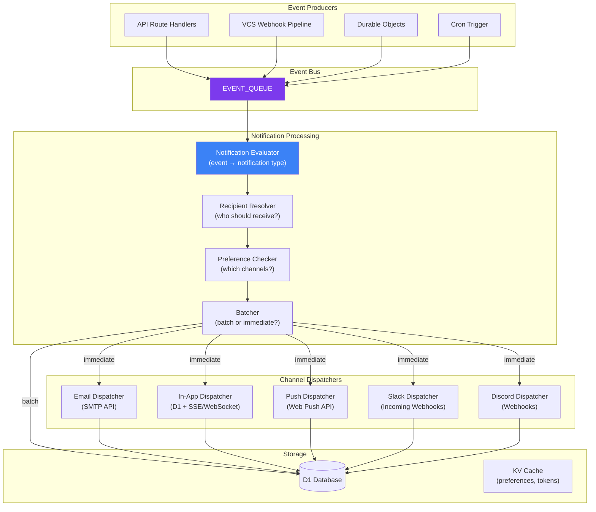

### Processing Pipeline

Every notification flows through 4 stages:

1. **Evaluate** — Map the internal event to a notification type. Some events don't produce notifications (filtered out).
2. **Resolve recipients** — Determine who should receive this notification based on the event type and context.
3. **Check preferences** — For each recipient, determine which channels they've opted into for this notification type.
4. **Batch or dispatch** — High-frequency notifications are batched for digest delivery. Others are dispatched immediately to each enabled channel.

---

## 2. Delivery Channels

| Channel | Transport | Latency | Rich Content | Offline Capable |
|---------|-----------|---------|-------------|----------------|
| Email | HTTP-based SMTP API | 1–30s | Full HTML with images | Yes (inbox) |
| In-app | D1 write + SSE/WebSocket push | <1s | Structured card with actions | Yes (stored in DB) |
| Web Push | Web Push Protocol (VAPID) | 1–5s | Title + body + icon + action URL | Yes (service worker) |
| Slack | Incoming Webhook (HTTPS POST) | 1–3s | Block Kit (rich formatting) | Yes (Slack stores) |
| Discord | Webhook (HTTPS POST) | 1–3s | Embeds (rich formatting) | Yes (Discord stores) |

### Channel Capabilities

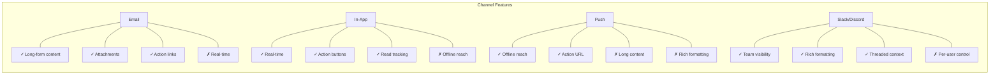

---

## 3. Notification Types

### Categorized by Priority

| Priority | Behavior | Example Types |
|----------|----------|--------------|
| **Critical** | All channels, cannot be disabled, bypass digest | `account.security_alert`, `submission.deadline_1h` |
| **High** | Default all channels on, user can disable some | `force_push.detected`, `submission.received` |
| **Normal** | Default email + in-app, user configurable | `judge.invited`, `phase.changed`, `team.member_joined` |
| **Low** | Default in-app only, fully optional | `commit.activity`, `team.chat_message` |

### Complete Notification Type Catalog

| Type | Trigger Event | Default Channels | Priority |
|------|--------------|-------------------|----------|
| `submission.received` | Submission tag accepted | email, in-app, push | High |
| `submission.rejected` | Submission tag rejected | email, in-app | High |
| `submission.finalized` | Team leader finalizes | email, in-app | Normal |
| `submission.deadline_24h` | Cron: 24h before deadline | email, in-app, push | Normal |
| `submission.deadline_1h` | Cron: 1h before deadline | email, in-app, push | Critical |
| `force_push.detected` | Force push on tracked repo | email, in-app | High |
| `phase.changed` | Hackathon phase transition | email, in-app | Normal |
| `team.member_joined` | New member joins team | in-app | Normal |
| `team.member_left` | Member leaves team | in-app | Normal |
| `team.invite_received` | Invited to join a team | email, in-app, push | Normal |
| `team.repo_linked` | Repository linked to team | in-app | Low |
| `team.bot_activated` | VCS bot activated | in-app | Low |
| `team.bot_deactivated` | VCS bot deactivated | in-app, email | Normal |
| `judge.invited` | Admin invites as judge | email, in-app | Normal |
| `judge.assigned` | Submissions assigned to judge | email, in-app | Normal |
| `judge.reminder` | Cron: unscored assignments | email, in-app | Normal |
| `scoring.completed` | All judges scored a submission | in-app | Low |
| `results.published` | Final results announced | email, in-app, push | High |
| `announcement.posted` | Organizer posts announcement | email, in-app, push | Normal |
| `organizer.invited` | Platform admin sends invite | email | Normal |
| `account.security_alert` | Suspicious login, password change | email, push | Critical |
| `account.welcome` | User first sign-up | email | Normal |
| `commit.activity_digest` | Periodic commit summary | email | Low |
| `hackathon.registration_open` | Registration opens | email, in-app, push | Normal |
| `hackathon.starting_soon` | Cron: hackathon starts in 1h | email, in-app, push | High |
| `system.webhook_failure` | Webhook dead-lettered | email, in-app | High |
| `mentor.session_requested` | Team requests mentor session | email, in-app | Normal |
| `mentor.session_confirmed` | Mentor confirms session | email, in-app, push | Normal |

---

## 4. Event-to-Notification Mapping

The notification evaluator maps internal events from the event bus to notification types. Not all events produce notifications.

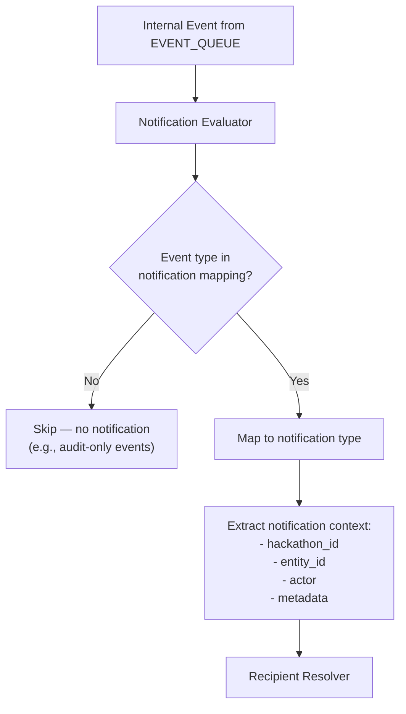

### Mapping Table

```typescript
const EVENT_TO_NOTIFICATION: Record<string, NotificationType | null> = {
  'submission.received':       'submission.received',
  'submission.rejected':       'submission.rejected',
  'submission.finalized':      'submission.finalized',
  'force_push.detected':       'force_push.detected',
  'hackathon.phase_changed':   'phase.changed',
  'team.member_joined':        'team.member_joined',
  'team.member_left':          'team.member_left',
  'bot.activated':             'team.bot_activated',
  'bot.deactivated':           'team.bot_deactivated',
  'judging.score_submitted':   null,               // No notification (internal)
  'judging.results_published': 'results.published',
  'system.webhook_dead_lettered': 'system.webhook_failure',
  // ... etc.
};
```

---

## 5. Recipient Resolution

Each notification type has specific rules for determining who receives it.

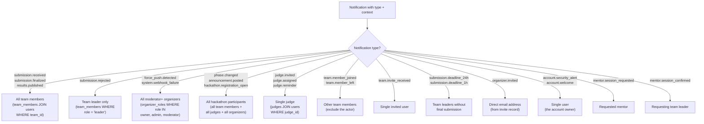

### Recipient Resolution Query — Deadline Reminders

```sql
SELECT u.id, u.email, u.display_name, t.id AS team_id, t.name AS team_name
FROM team_members tm
  JOIN teams t ON tm.team_id = t.id
  JOIN users u ON tm.user_id = u.id
WHERE t.hackathon_id = :hackathonId
  AND tm.role = 'leader'
  AND t.id NOT IN (
    SELECT team_id FROM submissions
    WHERE hackathon_id = :hackathonId
      AND is_final = 1
  )
```

### Actor Exclusion

The person who triggered the event is excluded from receiving the notification. For example, the team leader who finalizes a submission does not receive a "submission finalized" notification — only other team members do.

```typescript
interface RecipientResolution {
  recipients: Recipient[];
  excludeActorId: string | null;  // Actor from the triggering event
}

interface Recipient {
  userId: string;
  email: string;
  displayName: string;
  locale: string;       // For localized templates (future)
  timezone: string;     // For digest scheduling
}
```

---

## 6. User Preferences

Users control which channels deliver which notification types. Preferences are per-user, not per-hackathon.

### Preference Structure

```typescript
interface NotificationPreferences {
  userId: string;

  // Per-type channel overrides
  channels: Record<NotificationType, ChannelPreference>;

  // Global settings
  global: {
    quiet_hours_enabled: boolean;
    quiet_hours_start: string;        // "22:00" (user's local time)
    quiet_hours_end: string;          // "08:00"
    timezone: string;                 // IANA timezone (e.g., "America/Los_Angeles")
    digest_frequency: 'realtime' | 'hourly' | 'daily' | 'weekly';
    digest_time: string;              // "09:00" (for daily/weekly digests)
    digest_day: number;               // 0-6 (for weekly digest, 0=Sunday)
    email_format: 'html' | 'text';    // Preferred email format
  };

  // Channel-level config
  slack?: {
    webhook_url: string;              // User's personal Slack webhook
    channel: string;                  // Override channel
  };
  discord?: {
    webhook_url: string;              // User's personal Discord webhook
  };
  push?: {
    subscriptions: PushSubscription[]; // Web Push subscriptions (multiple devices)
  };
}

interface ChannelPreference {
  email: boolean;
  in_app: boolean;
  push: boolean;
  slack: boolean;
  discord: boolean;
}
```

### Default Preferences

When a user has no explicit preferences set, the system uses the defaults from the notification type catalog (Section 3). Users can override any default.

### Preference Resolution Flow

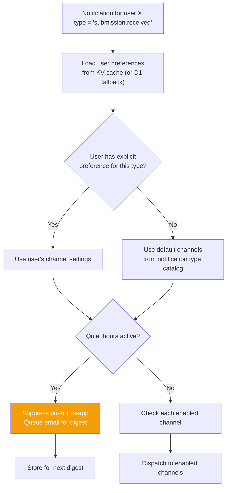

### Critical Override

Notifications with `critical` priority bypass all preference checks and quiet hours. They are always delivered to email and push regardless of user settings.

---

## 7. Email Channel

### SMTP Configuration

| Property | Value |
|----------|-------|
| Protocol | HTTP-based SMTP API (Workers cannot open raw TCP sockets) |
| Timeout | 10 seconds per email (AbortController) |
| Failure mode | Fail-open: log error, record as failed delivery, continue to next recipient |
| Rate limit | 500 emails/hour (configurable per SMTP provider) |
| Format | HTML with plain-text fallback (multipart/alternative) |
| From address | Configurable: `notifications@devsage.org` (default) |

### Email Sending Flow

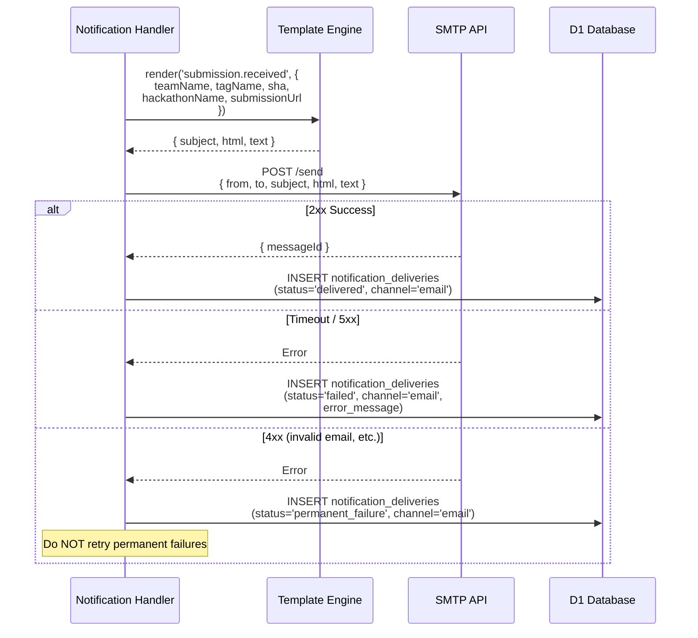

### Serialized Sending

Emails within a queue batch are sent **serially** — one at a time. This respects SMTP rate limits and prevents connection exhaustion.

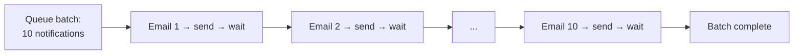

### Unsubscribe Mechanism

Every email includes a one-click unsubscribe link and a `List-Unsubscribe` header (RFC 8058):

```
List-Unsubscribe: <https://devsage.org/notifications/unsubscribe?token=xxx>
List-Unsubscribe-Post: List-Unsubscribe=One-Click
```

The unsubscribe token is a signed JWT containing `userId` and `notificationType`. Clicking it disables that notification type's email channel for the user.

---

## 8. In-App Channel

In-app notifications are stored in D1 and pushed to connected clients via SSE or WebSocket.

### In-App Notification Model

```typescript
interface InAppNotification {
  id: string;                     // UUID
  user_id: string;                // Recipient
  hackathon_id: string | null;    // Context hackathon (null for account-level)
  type: NotificationType;         // Notification type
  title: string;                  // Short title (max 100 chars)
  body: string;                   // Description (max 500 chars)
  icon: string;                   // Icon identifier (e.g., "submission", "alert", "team")
  action_url: string | null;      // Deep link to relevant page
  action_label: string | null;    // Button text (e.g., "View Submission")
  metadata: Record<string, unknown>;  // Structured data for rich rendering
  read: boolean;                  // Has user seen it
  read_at: string | null;         // When marked as read
  created_at: string;             // ISO-8601
}
```

### Real-Time Push

When an in-app notification is created, connected clients are notified immediately:

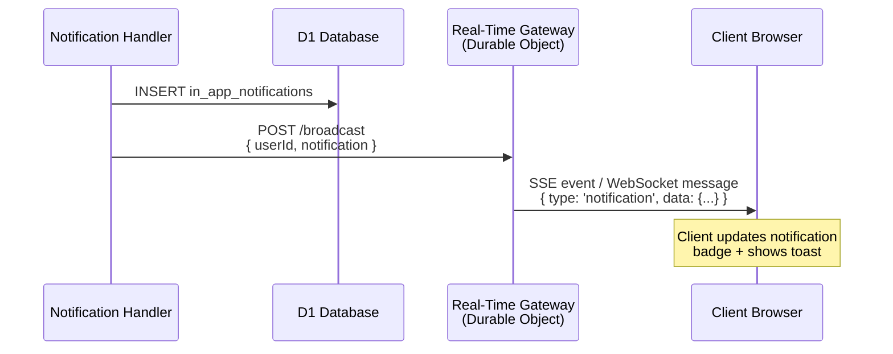

### Read Tracking

- Notifications are marked as read when the user opens the notification panel or clicks a specific notification.
- Bulk mark-as-read is supported (mark all notifications for a hackathon as read).
- Read state is per-user, not shared.

### Retention

- In-app notifications are retained for 90 days.
- A cron job runs weekly to delete notifications older than 90 days.
- Users can manually dismiss (delete) notifications at any time.

---

## 9. Push Notifications

Web Push notifications reach users even when they don't have DevSage open.

### Web Push Architecture

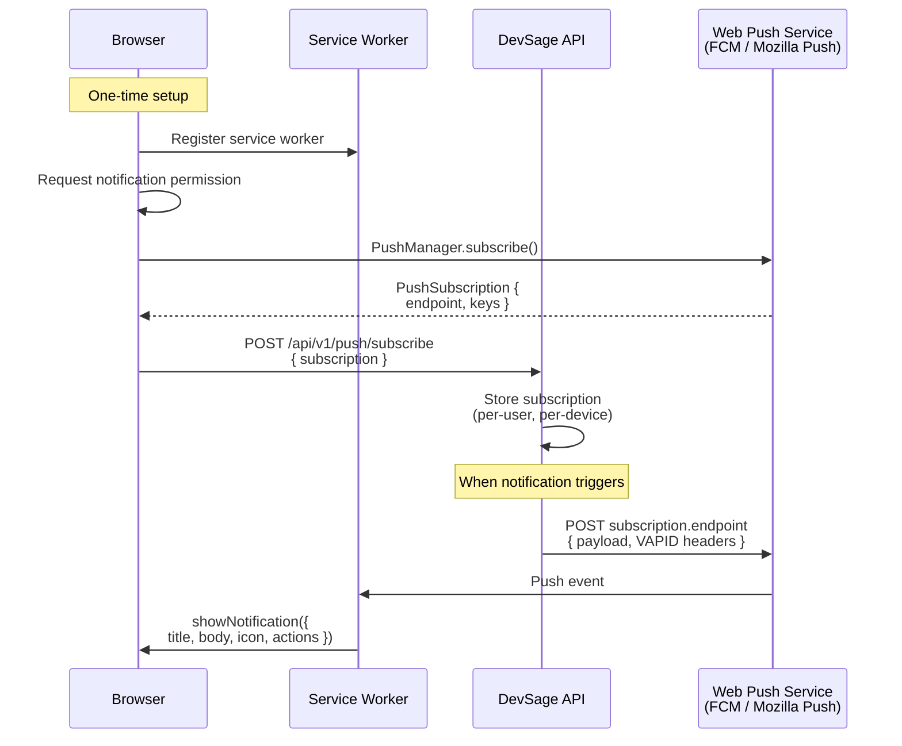

### VAPID Authentication

| Property | Description |
|----------|-------------|
| Key type | ECDSA P-256 |
| Public key | Shared with client for `PushManager.subscribe()` |
| Private key | Stored as Worker secret (`VAPID_PRIVATE_KEY`) |
| Subject | `mailto:notifications@devsage.org` |

### Push Payload

```typescript
interface PushPayload {
  title: string;              // Notification title (max 50 chars)
  body: string;               // Description (max 120 chars)
  icon: string;               // URL to notification icon
  badge: string;              // URL to badge icon (small)
  tag: string;                // Grouping tag (replaces older notifications with same tag)
  data: {
    url: string;              // Deep link to open on click
    notificationId: string;   // For mark-as-read on click
    type: NotificationType;
  };
  actions?: Array<{
    action: string;           // Identifier
    title: string;            // Button text
    icon?: string;            // Action icon
  }>;
}
```

### Multi-Device Support

- A user can have multiple push subscriptions (desktop browser + mobile browser + PWA).
- All subscriptions receive the push notification.
- Expired or invalid subscriptions (410 response from push service) are automatically removed.
- Maximum 5 push subscriptions per user.

---

## 10. Slack & Discord Integration

Hackathon-level Slack and Discord channels receive notifications via incoming webhooks.

### Configuration Levels

| Level | Configured By | Scope |
|-------|-------------|-------|
| Hackathon-level | Organizer (admin+) | All events for the hackathon go to a shared channel |
| User-level | Individual user | User's own webhook for their personal notifications |

### Slack Message Format

```typescript
interface SlackNotificationPayload {
  text: string;              // Fallback text
  blocks: SlackBlock[];      // Block Kit layout
  unfurl_links: false;
  unfurl_media: false;
}

// Example: submission.received
{
  text: "Team Alpha submitted submission_v1",
  blocks: [
    {
      type: "header",
      text: { type: "plain_text", text: "📦 New Submission" }
    },
    {
      type: "section",
      fields: [
        { type: "mrkdwn", text: "*Team:*\nTeam Alpha" },
        { type: "mrkdwn", text: "*Tag:*\nsubmission_v1" },
        { type: "mrkdwn", text: "*SHA:*\nabc123d" },
        { type: "mrkdwn", text: "*Hackathon:*\nSpring Hack 2026" }
      ]
    },
    {
      type: "actions",
      elements: [{
        type: "button",
        text: { type: "plain_text", text: "View Submission" },
        url: "https://devsage.org/spring-hack-2026/submissions/..."
      }]
    }
  ]
}
```

### Discord Embed Format

```typescript
interface DiscordWebhookPayload {
  content: string;            // Plain text fallback
  embeds: DiscordEmbed[];     // Rich embed
}

// Example: submission.received
{
  content: "Team Alpha submitted submission_v1",
  embeds: [{
    title: "📦 New Submission",
    color: 0x10b981,         // Green
    fields: [
      { name: "Team", value: "Team Alpha", inline: true },
      { name: "Tag", value: "submission_v1", inline: true },
      { name: "SHA", value: "`abc123d`", inline: true }
    ],
    url: "https://devsage.org/spring-hack-2026/submissions/...",
    timestamp: "2026-03-15T14:30:00Z"
  }]
}
```

### Delivery

- Both Slack and Discord use simple HTTPS POST to incoming webhook URLs.
- 10-second timeout per request.
- Fail-open: failures are logged but don't affect other channels.
- Rate limited: maximum 30 messages per minute per webhook URL (Slack's limit is 1/sec).

---

## 11. Digest & Batching

High-frequency events are batched into periodic digests to prevent notification fatigue.

### Which Events Are Batched

| Notification Type | Batching | Reason |
|------------------|----------|--------|
| `commit.activity_digest` | Always batched | Commit activity is continuous — individual emails would be overwhelming |
| `team.member_joined` / `left` | Batched during quiet hours | Low urgency, can wait |
| `scoring.completed` | Batched during judging phase | Multiple scores arrive rapidly |
| All low-priority types | Batched per user preference | User controls digest frequency |

### Digest Processing Flow

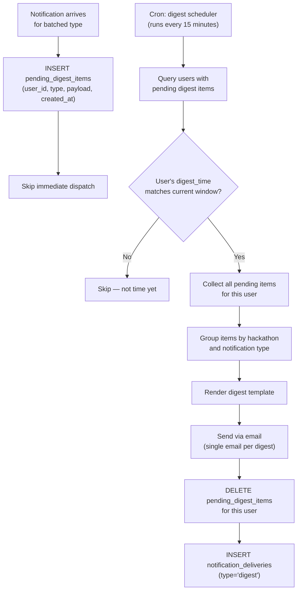

### Digest Email Structure

```
Subject: DevSage Weekly Digest — 3 hackathons, 12 updates

## Spring Hack 2026
- 🔀 47 commits across 3 teams you're in
- 📦 2 new submissions received
- 👤 1 new team member joined Team Alpha

## Summer Code Jam
- ⚖️ 5 submissions scored (3 remaining)
- 📢 1 new announcement from organizers

[View all activity →]
```

---

## 12. Template System

Each notification type has templates for each delivery channel. Templates use a simple interpolation system with conditional blocks.

### Template Structure

```typescript
interface NotificationTemplate {
  type: NotificationType;
  channel: Channel;

  // Template content with {{variable}} interpolation
  subject?: string;         // Email subject (email only)
  title: string;            // Short title (all channels)
  body: string;             // Main content
  action_url?: string;      // Deep link pattern
  action_label?: string;    // CTA button text

  // Conditional blocks
  conditions?: Array<{
    if: string;             // Condition expression (e.g., "severity == 'critical'")
    then: Partial<NotificationTemplate>;  // Override fields when condition is true
  }>;
}
```

### Template Variables

| Variable | Type | Available In |
|----------|------|-------------|
| `{{hackathon.name}}` | string | All hackathon-scoped notifications |
| `{{hackathon.slug}}` | string | All hackathon-scoped notifications |
| `{{team.name}}` | string | Team-scoped notifications |
| `{{user.displayName}}` | string | All notifications |
| `{{actor.displayName}}` | string | Event-triggered notifications |
| `{{submission.tagName}}` | string | Submission notifications |
| `{{submission.sha}}` | string | Submission notifications |
| `{{deadline.formatted}}` | string | Deadline reminders |
| `{{deadline.remaining}}` | string | Deadline reminders (e.g., "24 hours") |
| `{{phase.from}}` | string | Phase change notifications |
| `{{phase.to}}` | string | Phase change notifications |
| `{{frontendUrl}}` | string | All (base URL for links) |

### Example Templates

**submission.received (email)**:
```
Subject: ✅ Submission received — {{team.name}} tagged {{submission.tagName}}
Title: Submission Received
Body: Your team {{team.name}} submitted {{submission.tagName}} (commit {{submission.sha}})
      for {{hackathon.name}}. The submission has been recorded and will be reviewed.
Action URL: {{frontendUrl}}/{{hackathon.slug}}/submissions
Action Label: View Submission
```

**submission.deadline_1h (push)**:
```
Title: ⏰ 1 hour left to submit!
Body: {{hackathon.name}} submission deadline is in {{deadline.remaining}}.
      Your team {{team.name}} has not finalized a submission yet.
Action URL: {{frontendUrl}}/{{hackathon.slug}}/submit
```

---

## 13. Deadline Reminders

Cron-driven reminders at T-24h and T-1h before submission deadlines.

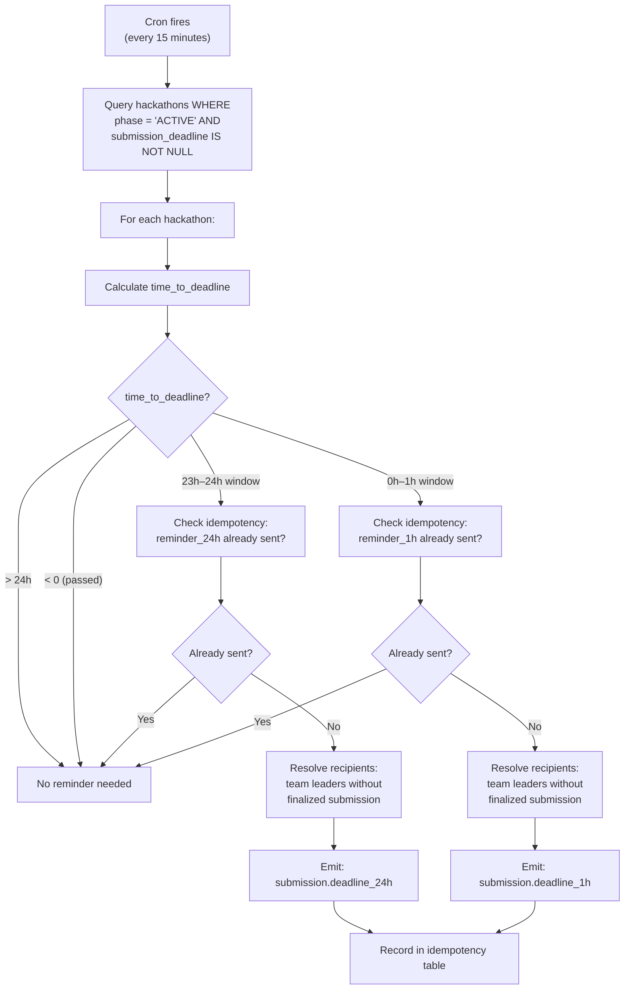

### Idempotency for Reminders

| Reminder | Idempotency Key | Ensures |
|----------|-----------------|---------|
| T-24h | `deadline_reminder_24h:{hackathonId}` | Only one 24h reminder per hackathon |
| T-1h | `deadline_reminder_1h:{hackathonId}` | Only one 1h reminder per hackathon |

### Additional Cron-Driven Notifications

| Notification | Schedule | Description |
|-------------|----------|-------------|
| `judge.reminder` | Daily at 09:00 UTC | Judges with unscored assignments |
| `hackathon.starting_soon` | Check every 15 min | Hackathon starts within 1 hour |
| `commit.activity_digest` | Per user preference | Periodic commit activity summary |

---

## 14. Idempotency & Reliability

### Idempotency Layers

| Layer | Key | Mechanism |
|-------|-----|-----------|
| Event bus | `event.id` | Each internal event has a UUID. Notification evaluator checks `notification_deliveries` for existing delivery with same `event_id` |
| Queue consumer | `delivery_id` in queue message | Pre-check query before processing |
| Per-recipient | `UNIQUE(event_id, user_id, channel)` | DB constraint prevents duplicate delivery per user per channel |
| Cron reminders | `idempotency_key` in `notification_idempotency` | Prevents duplicate reminder generation |

### Retry Behavior

| Failure Type | Retry? | Max Retries | Backoff |
|-------------|--------|-------------|---------|
| SMTP timeout | Yes | 3 | Exponential (30s, 2min, 10min) |
| SMTP 5xx | Yes | 3 | Exponential |
| SMTP 4xx (invalid address) | No | – | Permanent failure |
| Push 410 (subscription expired) | No | – | Remove subscription |
| Push 429 (rate limited) | Yes | 3 | Exponential |
| Slack/Discord 429 | Yes | 3 | Respect Retry-After header |
| Slack/Discord 4xx | No | – | Log error, check webhook URL |
| D1 write failure | Yes | 3 | Queue retry |

### Dead Letter Handling

After exhausting retries:
1. `notification_deliveries` row updated: `status = 'dead_lettered'`.
2. Audit event: `notification.dead_lettered`.
3. If the failed channel is email → attempt in-app delivery as fallback.
4. Dead-lettered deliveries are queryable by platform admins for debugging.

---

## 15. Rate Limiting & Throttling

### Per-Channel Rate Limits

| Channel | Rate Limit | Enforcement |
|---------|-----------|-------------|
| Email (SMTP) | 500/hour | Serialized sending with queue backpressure |
| Push (Web Push) | 100/minute per user | Token bucket in KV |
| Slack | 1/second per webhook URL | Queue delay between sends |
| Discord | 30/minute per webhook URL | Queue delay between sends |
| In-app | No limit | Stored in D1, pushed via SSE |

### Burst Protection

When a phase transition triggers thousands of notifications (e.g., `phase.changed` to all participants):

```mermaid
flowchart TD
    A["phase.changed event<br/>(1000 participants)"] --> B["Resolve all recipients"]
    B --> C["Chunk into batches<br/>of 50 recipients"]
    C --> D["Enqueue each batch<br/>as separate queue message"]
    D --> E["Queue processes batches<br/>with natural spacing"]

    Note over E: Each batch processes<br/>serially within itself,<br/>batches process in parallel<br/>across queue consumers
```

### Per-User Daily Caps

| Priority | Max Emails/Day | Max Push/Day |
|----------|---------------|-------------|
| Critical | Unlimited | Unlimited |
| High | 20 | 20 |
| Normal | 10 | 10 |
| Low | 5 (or digest only) | 5 |

When a user hits their daily cap, remaining notifications are converted to in-app only (never lost).

---

## 16. API Endpoints

### Notification Preferences

```
GET    /api/v1/notifications/preferences                          # Get user's preferences
PUT    /api/v1/notifications/preferences                          # Update preferences
PUT    /api/v1/notifications/preferences/:notificationType        # Update specific type
POST   /api/v1/notifications/preferences/reset                    # Reset to defaults
```

### In-App Notifications

```
GET    /api/v1/notifications                                      # List user's in-app notifications
GET    /api/v1/notifications/unread-count                         # Get unread count
PUT    /api/v1/notifications/:id/read                             # Mark as read
PUT    /api/v1/notifications/read-all                             # Mark all as read
PUT    /api/v1/notifications/read-all/:hackathonSlug              # Mark all for hackathon as read
DELETE /api/v1/notifications/:id                                  # Dismiss notification
```

### Push Subscriptions

```
POST   /api/v1/push/subscribe                                     # Register push subscription
DELETE /api/v1/push/subscribe/:subscriptionId                      # Remove subscription
GET    /api/v1/push/subscriptions                                  # List user's subscriptions
POST   /api/v1/push/test                                          # Send test push
```

### Hackathon Notification Config (Admin)

```
GET    /api/v1/hackathons/:slug/notifications/config               # Get hackathon notification config
PUT    /api/v1/hackathons/:slug/notifications/config               # Update config (admin+)
POST   /api/v1/hackathons/:slug/notifications/broadcast            # Send custom announcement (admin+)
GET    /api/v1/hackathons/:slug/notifications/deliveries           # List delivery history (admin+)
GET    /api/v1/hackathons/:slug/notifications/stats                # Delivery statistics (admin+)
```

### Unsubscribe

```
GET    /api/v1/notifications/unsubscribe                           # One-click email unsubscribe (token in query)
POST   /api/v1/notifications/unsubscribe                           # POST-based unsubscribe (RFC 8058)
```

---

## 17. Edge Cases

| Scenario | Behavior |
|----------|----------|
| User has no email address (GitHub OAuth without email scope) | Email channel skipped. In-app and push used instead. Warning logged |
| SMTP service down during phase transition (1000 emails queued) | Emails fail individually, each retried per queue config. In-app notifications succeed independently |
| User unsubscribes via email link then re-subscribes in app | Re-subscription takes effect immediately. No cooldown period |
| Push subscription endpoint returns 410 (expired) | Subscription auto-removed from database. No error to user |
| Slack webhook URL becomes invalid (team deleted Slack app) | Delivery fails, logged. After 5 consecutive failures, Slack integration auto-disabled for that hackathon. Organizer notified |
| Same event triggers two notification types | Each is processed independently. User may receive both (e.g., a phase change AND a deadline reminder) |
| User is both a team member and a judge in the same hackathon | Receives notifications for both roles. No dedup across roles (different information) |
| Digest scheduled during quiet hours | Digest sent at the end of quiet hours (first digest window after quiet_hours_end) |
| Cron fires twice for the same deadline reminder window | Idempotency key prevents duplicate reminder generation |
| User changes timezone after digest items are pending | New timezone applies to next digest cycle. Pending items delivered in the current cycle |
| Notification type added in future version | Users without explicit preference for new type get the type's default channels |
| Hackathon has 500 teams, phase transition triggers 2000+ emails | Chunked into batches of 50. Queue processes over ~10 minutes. No email lost |
| Email bounces (permanent delivery failure) | Recipient's email marked as `bounced` in users table. Future emails to this address are suppressed until user updates email |
| User deletes account | All pending notifications and push subscriptions are purged. In-app notifications are deleted. Digest items cleared |

---

## 18. Error Codes

| Code | HTTP | Condition |
|------|------|-----------|
| `NOTIFICATION_NOT_FOUND` | 404 | In-app notification ID does not exist or belongs to another user |
| `NOTIFICATION_ALREADY_READ` | 409 | Notification is already marked as read |
| `PREFERENCES_INVALID` | 400 | Preference update contains invalid notification type or channel |
| `PUSH_SUBSCRIPTION_INVALID` | 400 | Push subscription object is malformed (missing endpoint or keys) |
| `PUSH_SUBSCRIPTION_NOT_FOUND` | 404 | Push subscription ID does not exist |
| `PUSH_MAX_SUBSCRIPTIONS` | 400 | User has reached 5 push subscriptions limit |
| `PUSH_PERMISSION_DENIED` | 403 | Browser denied notification permission (client-side error) |
| `UNSUBSCRIBE_TOKEN_INVALID` | 400 | Unsubscribe token is malformed or expired |
| `UNSUBSCRIBE_TOKEN_EXPIRED` | 410 | Unsubscribe token has expired (>30 days) |
| `BROADCAST_EMPTY_RECIPIENTS` | 400 | Custom broadcast has no valid recipients |
| `BROADCAST_TOO_FREQUENT` | 429 | Organizer sending too many broadcasts (max 5/hour per hackathon) |
| `SLACK_WEBHOOK_INVALID` | 400 | Slack webhook URL is not a valid Slack incoming webhook URL |
| `DISCORD_WEBHOOK_INVALID` | 400 | Discord webhook URL is not a valid Discord webhook URL |
| `SMTP_DELIVERY_FAILED` | 502 | SMTP service returned an error (logged, not surfaced to end user) |
| `DIGEST_CONFIG_INVALID` | 400 | Invalid digest configuration (bad time format, invalid timezone) |
| `QUIET_HOURS_INVALID` | 400 | Quiet hours start and end are the same |
| `EMAIL_BOUNCED` | 400 | User's email address has been marked as bounced |

---

## 19. Database Tables

### `in_app_notifications`

Stores in-app notifications for users.

| Column | Type | Constraints | Description |
|--------|------|-------------|-------------|
| `id` | TEXT | PK, UUID | Unique notification ID |
| `user_id` | TEXT | FK → users.id, NOT NULL | Recipient |
| `hackathon_id` | TEXT | FK → hackathons.id, NULL | Context hackathon (null for account-level) |
| `type` | TEXT | NOT NULL | Notification type |
| `title` | TEXT | NOT NULL | Short title |
| `body` | TEXT | NOT NULL | Description |
| `icon` | TEXT | NOT NULL, DEFAULT 'info' | Icon identifier |
| `action_url` | TEXT | NULL | Deep link URL |
| `action_label` | TEXT | NULL | CTA button text |
| `metadata` | TEXT | NOT NULL, DEFAULT '{}' | JSON structured data |
| `read` | INTEGER | NOT NULL, DEFAULT 0 | 0 = unread, 1 = read |
| `read_at` | TEXT | NULL | When marked as read |
| `created_at` | TEXT | NOT NULL, DEFAULT CURRENT_TIMESTAMP | ISO-8601 |

**Indexes:** INDEX(`user_id`, `read`, `created_at` DESC), INDEX(`user_id`, `hackathon_id`), INDEX(`created_at`)

---

### `notification_deliveries`

Tracks every delivery attempt across all channels.

| Column | Type | Constraints | Description |
|--------|------|-------------|-------------|
| `id` | TEXT | PK, UUID | Unique delivery record ID |
| `event_id` | TEXT | NOT NULL | Internal event ID that triggered this notification |
| `user_id` | TEXT | FK → users.id, NOT NULL | Recipient |
| `channel` | TEXT | NOT NULL, CHECK IN ('email','in_app','push','slack','discord') | Delivery channel |
| `notification_type` | TEXT | NOT NULL | Notification type |
| `status` | TEXT | NOT NULL, DEFAULT 'pending' | pending, delivered, failed, permanent_failure, dead_lettered |
| `error_message` | TEXT | NULL | Error details if failed |
| `attempts` | INTEGER | NOT NULL, DEFAULT 0 | Number of delivery attempts |
| `delivered_at` | TEXT | NULL | When successfully delivered |
| `created_at` | TEXT | NOT NULL, DEFAULT CURRENT_TIMESTAMP | ISO-8601 |

**Indexes:** UNIQUE(`event_id`, `user_id`, `channel`), INDEX(`user_id`, `created_at`), INDEX(`status`), INDEX(`notification_type`)

---

### `notification_preferences`

Stores per-user notification preferences.

| Column | Type | Constraints | Description |
|--------|------|-------------|-------------|
| `id` | TEXT | PK, UUID | Unique row ID |
| `user_id` | TEXT | FK → users.id, UNIQUE, NOT NULL | Which user |
| `channels` | TEXT | NOT NULL, DEFAULT '{}' | JSON: per-type channel overrides |
| `global_settings` | TEXT | NOT NULL, DEFAULT '{}' | JSON: quiet hours, digest config, etc. |
| `slack_config` | TEXT | NULL | JSON: personal Slack webhook config |
| `discord_config` | TEXT | NULL | JSON: personal Discord webhook config |
| `updated_at` | TEXT | NOT NULL, DEFAULT CURRENT_TIMESTAMP | ISO-8601 |

**Indexes:** UNIQUE(`user_id`)

---

### `push_subscriptions`

Stores Web Push subscriptions for push notifications.

| Column | Type | Constraints | Description |
|--------|------|-------------|-------------|
| `id` | TEXT | PK, UUID | Unique subscription ID |
| `user_id` | TEXT | FK → users.id, NOT NULL | Which user |
| `endpoint` | TEXT | NOT NULL | Web Push endpoint URL |
| `key_p256dh` | TEXT | NOT NULL | Client public key |
| `key_auth` | TEXT | NOT NULL | Auth secret |
| `user_agent` | TEXT | NULL | Browser/device identifier |
| `created_at` | TEXT | NOT NULL, DEFAULT CURRENT_TIMESTAMP | ISO-8601 |
| `last_used_at` | TEXT | NULL | Last successful push |

**Indexes:** INDEX(`user_id`), UNIQUE(`endpoint`)

---

### `pending_digest_items`

Temporarily stores notifications queued for digest delivery.

| Column | Type | Constraints | Description |
|--------|------|-------------|-------------|
| `id` | TEXT | PK, UUID | Unique item ID |
| `user_id` | TEXT | FK → users.id, NOT NULL | Recipient |
| `hackathon_id` | TEXT | FK → hackathons.id, NULL | Context hackathon |
| `notification_type` | TEXT | NOT NULL | Notification type |
| `title` | TEXT | NOT NULL | Notification title |
| `body` | TEXT | NOT NULL | Notification body |
| `metadata` | TEXT | NOT NULL, DEFAULT '{}' | JSON event data |
| `created_at` | TEXT | NOT NULL, DEFAULT CURRENT_TIMESTAMP | ISO-8601 |

**Indexes:** INDEX(`user_id`, `created_at`), INDEX(`user_id`, `hackathon_id`)

---

### `notification_idempotency`

Prevents duplicate cron-generated notifications.

| Column | Type | Constraints | Description |
|--------|------|-------------|-------------|
| `id` | TEXT | PK, UUID | Unique row ID |
| `idempotency_key` | TEXT | UNIQUE, NOT NULL | Key like `deadline_reminder_24h:{hackathonId}` |
| `created_at` | TEXT | NOT NULL, DEFAULT CURRENT_TIMESTAMP | When the notification was generated |

**Indexes:** UNIQUE(`idempotency_key`)

---

### `hackathon_notification_config`

Per-hackathon notification settings (Slack/Discord channels, custom branding).

| Column | Type | Constraints | Description |
|--------|------|-------------|-------------|
| `id` | TEXT | PK, UUID | Unique config ID |
| `hackathon_id` | TEXT | FK → hackathons.id, UNIQUE, NOT NULL | Which hackathon |
| `slack_webhook_url` | TEXT | NULL | Hackathon-level Slack incoming webhook |
| `discord_webhook_url` | TEXT | NULL | Hackathon-level Discord webhook |
| `slack_events` | TEXT | NOT NULL, DEFAULT '[]' | JSON array of event types to send to Slack |
| `discord_events` | TEXT | NOT NULL, DEFAULT '[]' | JSON array of event types to send to Discord |
| `email_from_name` | TEXT | NULL | Custom "from" name (default: "DevSage") |
| `email_reply_to` | TEXT | NULL | Custom reply-to address |
| `broadcast_cooldown_minutes` | INTEGER | NOT NULL, DEFAULT 12 | Min minutes between broadcasts |
| `created_at` | TEXT | NOT NULL, DEFAULT CURRENT_TIMESTAMP | ISO-8601 |
| `updated_at` | TEXT | NOT NULL, DEFAULT CURRENT_TIMESTAMP | ISO-8601 |

**Indexes:** UNIQUE(`hackathon_id`)

---

## 20. Decision Log

| Decision | Choice | Why | Alternatives Considered |
|----------|--------|-----|------------------------|
| Multi-channel from single event | Event bus fans out to channel dispatchers | Adding a channel means adding one dispatcher. No changes to event producers. Each channel fails independently | Per-channel event production (duplication); single dispatcher for all channels (single point of failure) |
| Per-user preferences with type+channel granularity | `NotificationPreferences.channels[type][channel]` | Users have different tolerances. A judge needs email for assignments but not for commit activity. Fine-grained control prevents unsubscribe-all | Global on/off per channel (too coarse); per-hackathon preferences (too many settings); no preferences (user hostile) |
| Quiet hours suppress push + in-app, not email | Email queued for digest; push/in-app held | Push notifications at 3am are disruptive. Email is asynchronous by nature — users check it when ready. In-app suppressed because toasts would wake them | Suppress all channels (email is already async); suppress nothing (user hostile); per-channel quiet hours (too complex) |
| Serialized email sending | One email at a time within a batch | SMTP rate limits are strict (500/hr for self-hosted). Parallel sending would exhaust connections and trigger rate limits | Parallel with semaphore (risk rate limits); batched SMTP API (provider-specific, not portable) |
| Critical notifications bypass preferences | Always email + push, ignore quiet hours | Security alerts and imminent deadlines must reach the user. Allowing suppression creates real-world harm (missed deadlines, compromised accounts) | Respect all preferences (risky); only bypass for security (deadline misses are also harmful) |
| Web Push via VAPID (not FCM) | Standards-based Web Push | Works across Chrome, Firefox, Edge, Safari without vendor lock-in. No Google dependency. VAPID is the W3C standard | Firebase Cloud Messaging (vendor lock-in); no push (poor UX); email-only push simulation (not real-time) |
| Max 5 push subscriptions per user | Hard limit | Covers laptop + phone + tablet + 2 spare. Prevents subscription leaks from stale browsers. Easy cleanup | Unlimited (stale subscription bloat); 1 per user (bad multi-device UX); per-device-type limits (complex) |
| Digest frequency user-controlled | realtime, hourly, daily, weekly options | Different users have different information appetites. Organizers want real-time, casual participants want weekly | One frequency for all (doesn't fit); per-type frequency (too many knobs); no digest (notification fatigue) |
| In-app retention of 90 days | Weekly cron purges older items | 90 days covers the lifecycle of most hackathons with buffer. Prevents unbounded D1 growth. Users rarely look back further | 30 days (too short for long hackathons); unlimited (storage concern); per-hackathon lifecycle (complex) |
| Actor exclusion from notifications | Event actor doesn't receive their own notification | Receiving "You just did X" is noise. The actor already knows. Exclusion prevents UX annoyance | Send to everyone including actor (noisy); make it a preference (over-engineering) |
| Email bounce tracking | Mark address as bounced, suppress future emails | Repeated sends to bounced addresses hurt SMTP reputation. Suppressing prevents deliverability degradation for all users | Retry indefinitely (reputation harm); remove user account (too aggressive); ignore bounces (reputation harm) |
| Unsubscribe via signed JWT in link | One-click unsubscribe per RFC 8058 | Complies with email regulations (CAN-SPAM, GDPR). No login required. Token scoped to user+type for security | Login-required unsubscribe (friction, regulation risk); global unsubscribe only (too coarse); no unsubscribe (illegal) |
| Chunked batch processing for mass notifications | 50 recipients per queue message | Keeps individual queue message processing time bounded (~25 seconds for 50 emails). Natural queue parallelism handles throughput | Single message per recipient (queue overhead); all recipients in one message (timeout risk); custom batch size (premature optimization) |
