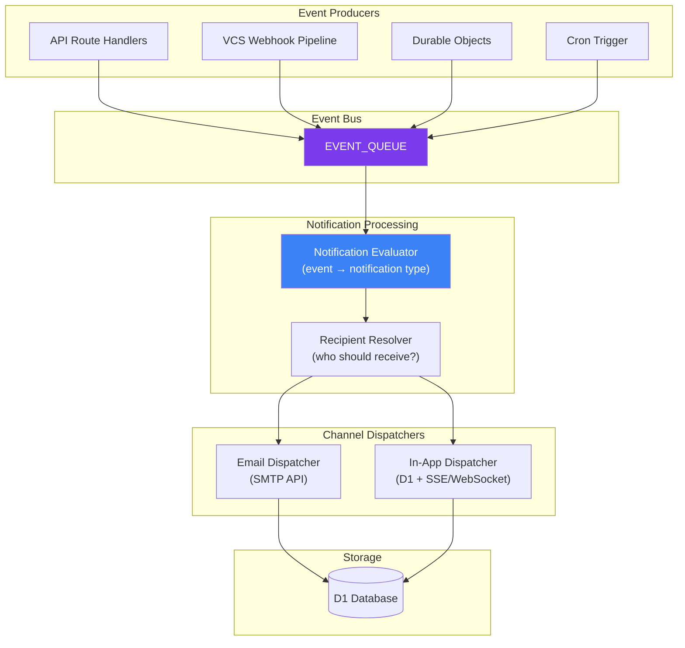
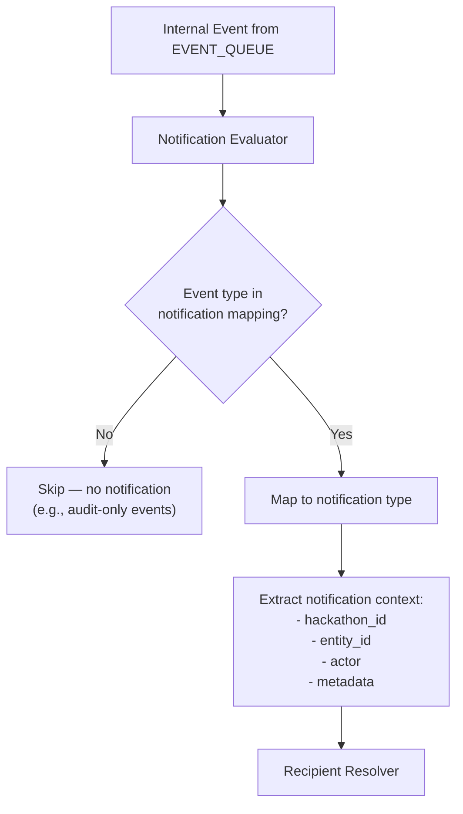
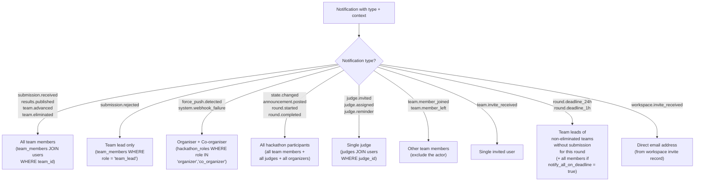
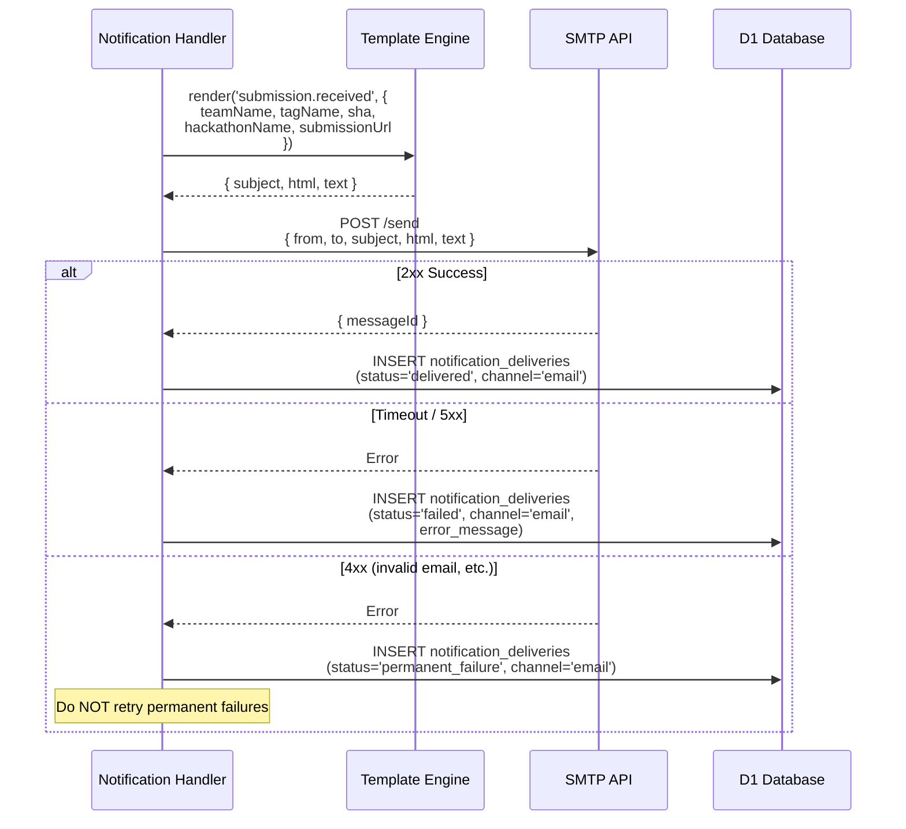
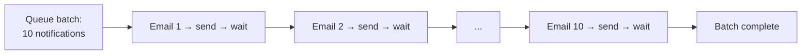
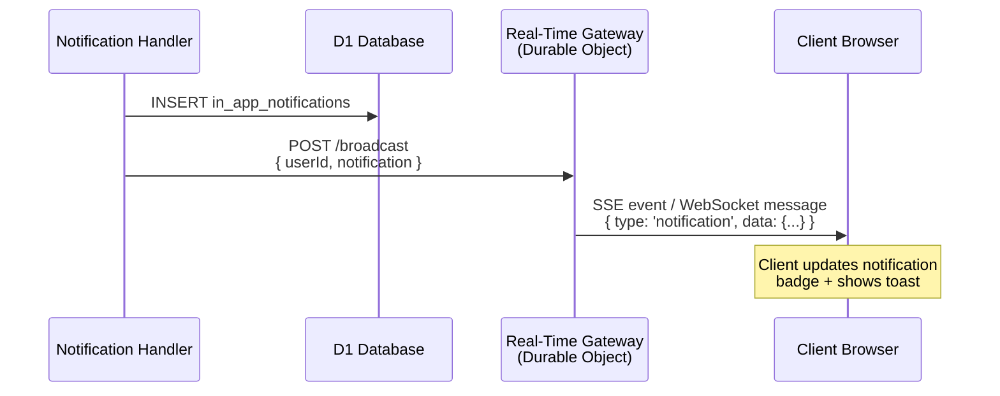
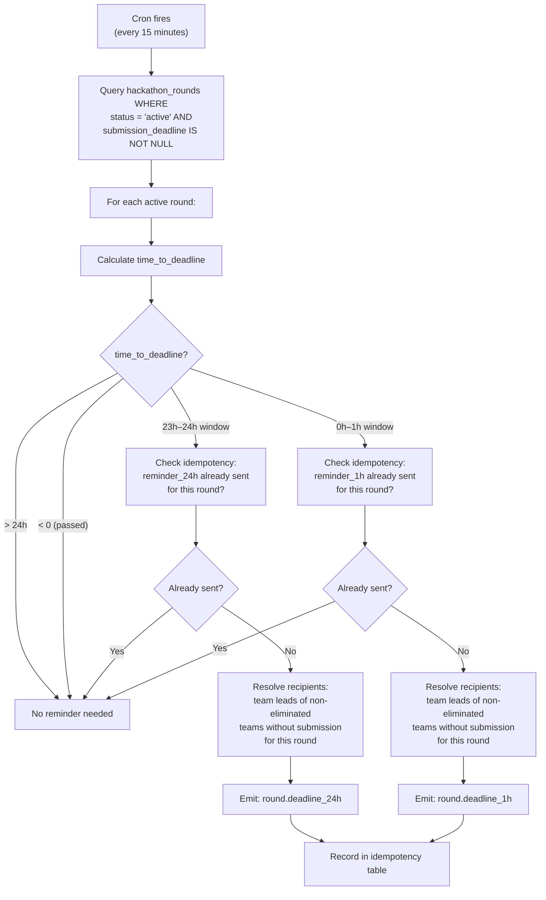

# Notifications

> Email and in-app notification system with queue-based pipeline, template rendering, and idempotent delivery — enabling hackathon team members, organizers, and judges to stay informed about submissions, round deadlines, judging, and team activity.

---

## Table of Contents

- [Design Goals](#design-goals)
- [1. Notification Architecture](#1-notification-architecture)
- [2. Delivery Channels](#2-delivery-channels)
- [3. Notification Types](#3-notification-types)
- [4. Event-to-Notification Mapping](#4-event-to-notification-mapping)
- [5. Recipient Resolution](#5-recipient-resolution)
- [6. Email Channel](#6-email-channel)
- [7. In-App Channel](#7-in-app-channel)
- [8. Template System](#8-template-system)
- [9. Deadline Reminders](#9-deadline-reminders)
- [10. Idempotency & Reliability](#10-idempotency--reliability)
- [11. Rate Limiting & Throttling](#11-rate-limiting--throttling)
- [12. API Endpoints](#12-api-endpoints)
- [13. Edge Cases](#13-edge-cases)
- [14. Error Codes](#14-error-codes)
- [15. Database Tables](#15-database-tables)
- [16. Decision Log](#16-decision-log)

---

## Design Goals

| Goal | Description |
|------|-------------|
| Two-channel delivery | Email and in-app notifications from a single event. Push, Slack, and Discord deferred to Phase 2 |
| Zero duplicate notifications | Idempotency at every layer — event bus, queue, handler, DB constraints |
| Template-driven rendering | Each channel has its own template. Content adapts to channel capabilities (rich HTML email vs. structured in-app card) |
| Fail-open delivery | SMTP failures never block queue processing. Failed deliveries are logged and retryable |
| Rounds-aware reminders | Deadline reminders are per-round, targeting team leads (always) and optionally all team members (`notify_all_on_deadline` config) of non-eliminated teams without submissions for the active round |
| Auditable | Every notification sent, failed, or suppressed produces an audit record |
| Scalable | Queue-based processing handles bursts (state transitions → thousands of notifications) without blocking the API |

---

## 1. Notification Architecture



### Processing Pipeline

Every notification flows through 3 stages:

1. **Evaluate** — Map the internal event to a notification type. Some events don't produce notifications (filtered out).
2. **Resolve recipients** — Determine who should receive this notification based on the event type and context.
3. **Dispatch** — Send to both email and in-app channels for each recipient. All recipients get defaults (no user preferences in Phase 1).

---

## 2. Delivery Channels

| Channel | Transport | Latency | Rich Content | Offline Capable |
|---------|-----------|---------|-------------|----------------|
| Email | HTTP-based SMTP API | 1–30s | Full HTML with images | Yes (inbox) |
| In-app | D1 write + SSE/WebSocket push | <1s | Structured card with actions | Yes (stored in DB) |

Both channels are dispatched for every notification. In Phase 1 there are no user preferences — all recipients receive both email and in-app notifications for all types they are eligible for.

---

## 3. Notification Types

### Categorized by Priority

| Priority | Behavior | Example Types |
|----------|----------|--------------|
| **Critical** | Both channels always, cannot be disabled | `round.deadline_1h` |
| **High** | Both channels always | `force_push.detected`, `submission.received` |
| **Normal** | Both channels | `judge.invited`, `state.changed`, `team.member_joined` |
| **Low** | In-app only | `team.repo_linked`, `team.bot_activated` |

### Notification Type Catalog

| Type | Trigger Event | Channels | Priority |
|------|--------------|----------|----------|
| `submission.received` | Submission tag accepted | email, in-app | High |
| `submission.rejected` | Submission tag rejected | email, in-app | High |
| `round.deadline_24h` | Cron: 24h before round deadline | email, in-app | Normal |
| `round.deadline_1h` | Cron: 1h before round deadline | email, in-app | Critical |
| `round.started` | Round transitions to active | email, in-app | Normal |
| `round.completed` | Round results finalized | email, in-app | High |
| `team.eliminated` | Team eliminated after a round | email, in-app | High |
| `team.advanced` | Team advanced to next round | email, in-app | High |
| `force_push.detected` | Force push on tracked repo | email, in-app | High |
| `state.changed` | Hackathon state transition | email, in-app | Normal |
| `team.member_joined` | New member accepts invite | in-app | Normal |
| `team.member_left` | Member leaves team | in-app | Normal |
| `team.invite_received` | Invited to join a team | email, in-app | Normal |
| `team.repo_linked` | Repository linked to team | in-app | Low |
| `team.bot_activated` | GitHub bot activated | in-app | Low |
| `team.bot_deactivated` | GitHub bot deactivated | email, in-app | Normal |
| `judge.invited` | Organizer invites as judge | email, in-app | Normal |
| `judge.assigned` | Submissions assigned to judge | email, in-app | Normal |
| `judge.reminder` | Cron: unscored assignments | email, in-app | Normal |
| `scoring.completed` | All judges scored a submission | in-app | Low |
| `results.published` | Final results announced | email, in-app | High |
| `announcement.posted` | Organizer posts announcement | email, in-app | Normal |
| `workspace.invite_received` | Platform admin invites user to workspace (as organiser/co-organiser) | email | Normal |
| `hackathon.starting_soon` | Cron: hackathon starts in 1h | email, in-app | High |
| `system.webhook_failure` | Webhook dead-lettered | email, in-app | High |

---

## 4. Event-to-Notification Mapping

The notification evaluator maps internal events from the event bus to notification types. Not all events produce notifications.



### Mapping Table

```typescript
const EVENT_TO_NOTIFICATION: Record<string, NotificationType | null> = {
  'submission.received':              'submission.received',
  'submission.rejected':              'submission.rejected',
  'force_push.detected':              'force_push.detected',
  'hackathon.state_changed':          'state.changed',
  'round.started':                    'round.started',
  'round.completed':                  'round.completed',
  'team.member_joined':               'team.member_joined',
  'team.member_left':                 'team.member_left',
  'bot.activated':                    'team.bot_activated',
  'bot.deactivated':                  'team.bot_deactivated',
  'judging.score_submitted':          null,               // No notification (internal)
  'judging.results_published':        'results.published',
  'system.webhook_dead_lettered':     'system.webhook_failure',
  // ... etc.
};
```

---

## 5. Recipient Resolution

Each notification type has specific rules for determining who receives it.



### Recipient Resolution Query — Round Deadline Reminders

Team leads always receive deadline reminders. If the hackathon's `notify_all_on_deadline` flag is enabled (configurable by organiser), all team members receive them.

```sql
SELECT u.id, u.email, u.display_name, t.id AS team_id, t.name AS team_name
FROM team_members tm
  JOIN teams t ON tm.team_id = t.id
  JOIN users u ON tm.user_id = u.id
WHERE t.hackathon_id = :hackathonId
  AND (
    tm.role = 'team_lead'
    OR :notifyAllOnDeadline = true   -- hackathon config flag
  )
  AND t.id NOT IN (
    -- Teams that already submitted for this round
    SELECT team_id FROM submissions
    WHERE round_id = :roundId
      AND status != 'superseded'     -- ignore superseded submissions
  )
  AND t.id NOT IN (
    -- Teams eliminated in previous rounds
    SELECT team_id FROM round_results
    WHERE hackathon_id = :hackathonId
      AND status = 'eliminated'
  )
```

### Actor Exclusion

The person who triggered the event is excluded from receiving the notification. For example, the organizer who transitions a round does not receive a "round started" notification — only other participants do.

```typescript
interface RecipientResolution {
  recipients: Recipient[];
  excludeActorId: string | null;  // Actor from the triggering event
}

interface Recipient {
  userId: string;
  email: string;
  displayName: string;
}
```

---

## 6. Email Channel

### SMTP Configuration

| Property | Value |
|----------|-------|
| Protocol | HTTP-based SMTP API (Workers cannot open raw TCP sockets) |
| Timeout | 10 seconds per email (AbortController) |
| Failure mode | Fail-open: log error, record as failed delivery, continue to next recipient |
| Rate limit | 500 emails/hour (configurable per SMTP provider) |
| Format | HTML with plain-text fallback (multipart/alternative) |
| From address | Configurable: `notifications@devsage.org` (default) |

### Email Sending Flow



### Serialized Sending

Emails within a queue batch are sent **serially** — one at a time. This respects SMTP rate limits and prevents connection exhaustion.



### Unsubscribe Mechanism

Every email includes a one-click unsubscribe link and a `List-Unsubscribe` header (RFC 8058):

```
List-Unsubscribe: <https://devsage.org/notifications/unsubscribe?token=xxx>
List-Unsubscribe-Post: List-Unsubscribe=One-Click
```

The unsubscribe token is a signed JWT containing `userId` and `notificationType`. Clicking it disables that notification type's email channel for the user.

**Critical notifications cannot be unsubscribed.** If a user attempts to unsubscribe from a critical notification type (e.g., `round.deadline_1h`), the request is rejected with an explanation that critical notifications are mandatory. Only High, Normal, and Low priority types support email unsubscription.

---

## 7. In-App Channel

In-app notifications are stored in D1 and pushed to connected clients via SSE or WebSocket.

### In-App Notification Model

```typescript
interface InAppNotification {
  id: string;                     // UUID
  user_id: string;                // Recipient
  hackathon_id: string | null;    // Context hackathon (null for account-level)
  type: NotificationType;         // Notification type
  title: string;                  // Short title (max 100 chars)
  body: string;                   // Description (max 500 chars)
  icon: string;                   // Icon identifier (e.g., "submission", "alert", "team")
  action_url: string | null;      // Deep link to relevant page
  action_label: string | null;    // Button text (e.g., "View Submission")
  metadata: Record<string, unknown>;  // Structured data for rich rendering
  read: boolean;                  // Has user seen it
  read_at: string | null;         // When marked as read
  created_at: string;             // ISO-8601
}
```

### Real-Time Push

When an in-app notification is created, connected clients are notified immediately:



### Read Tracking

- Notifications are marked as read when the user opens the notification panel or clicks a specific notification.
- Bulk mark-as-read is supported (mark all notifications for a hackathon as read).
- Read state is per-user, not shared.

### Retention

- In-app notifications are retained for 90 days.
- A cron job runs weekly to delete notifications older than 90 days.
- Users can manually dismiss (delete) notifications at any time.

---

## 8. Template System

Each notification type has templates for each delivery channel. Templates use a simple interpolation system with conditional blocks.

### Template Structure

```typescript
interface NotificationTemplate {
  type: NotificationType;
  channel: Channel;

  // Template content with {{variable}} interpolation
  subject?: string;         // Email subject (email only)
  title: string;            // Short title (all channels)
  body: string;             // Main content
  action_url?: string;      // Deep link pattern
  action_label?: string;    // CTA button text

  // Conditional blocks
  conditions?: Array<{
    if: string;             // Condition expression (e.g., "severity == 'critical'")
    then: Partial<NotificationTemplate>;  // Override fields when condition is true
  }>;
}
```

### Template Variables

| Variable | Type | Available In |
|----------|------|-------------|
| `{{hackathon.name}}` | string | All hackathon-scoped notifications |
| `{{hackathon.slug}}` | string | All hackathon-scoped notifications |
| `{{team.name}}` | string | Team-scoped notifications |
| `{{user.displayName}}` | string | All notifications |
| `{{actor.displayName}}` | string | Event-triggered notifications |
| `{{submission.tagName}}` | string | Submission notifications |
| `{{submission.sha}}` | string | Submission notifications |
| `{{deadline.formatted}}` | string | Deadline reminders |
| `{{deadline.remaining}}` | string | Deadline reminders (e.g., "24 hours") |
| `{{round.name}}` | string | Round-scoped notifications |
| `{{round.number}}` | number | Round-scoped notifications |
| `{{state.from}}` | string | State change notifications |
| `{{state.to}}` | string | State change notifications |
| `{{hackathonUrl}}` | string | All (e.g., `https://{slug}.devsage.org`) |

### Example Templates

**submission.received (email)**:
```
Subject: Submission received — {{team.name}} tagged {{submission.tagName}}
Title: Submission Received
Body: Your team {{team.name}} submitted {{submission.tagName}} (commit {{submission.sha}})
      for {{hackathon.name}} — Round {{round.number}}: {{round.name}}.
      The submission has been recorded and will be reviewed.
Action URL: {{hackathonUrl}}/submissions
Action Label: View Submission
```

**round.deadline_1h (email)**:
```
Subject: 1 hour left — {{hackathon.name}} Round {{round.number}} deadline
Title: 1 hour left to submit!
Body: {{hackathon.name}} Round {{round.number}} ({{round.name}}) submission deadline
      is in {{deadline.remaining}}. Your team {{team.name}} has not submitted yet.
Action URL: {{hackathonUrl}}/submit
Action Label: Submit Now
```

---

## 9. Deadline Reminders

Cron-driven reminders at T-24h and T-1h before each round's submission deadline.



### Idempotency for Reminders

| Reminder | Idempotency Key | Ensures |
|----------|-----------------|---------|
| T-24h | `round_deadline_24h:{roundId}` | Only one 24h reminder per round |
| T-1h | `round_deadline_1h:{roundId}` | Only one 1h reminder per round |

### Additional Cron-Driven Notifications

| Notification | Schedule | Description |
|-------------|----------|-------------|
| `judge.reminder` | Daily at 09:00 UTC | Judges with unscored assignments for the active round |
| `hackathon.starting_soon` | Check every 15 min | Hackathon starts within 1 hour |

---

## 10. Idempotency & Reliability

### Idempotency Layers

| Layer | Key | Mechanism |
|-------|-----|-----------|
| Event bus | `event.id` | Each internal event has a UUID. Notification evaluator checks `notification_deliveries` for existing delivery with same `event_id` |
| Queue consumer | `delivery_id` in queue message | Pre-check query before processing |
| Per-recipient | `UNIQUE(event_id, user_id, channel)` | DB constraint prevents duplicate delivery per user per channel |
| Cron reminders | `idempotency_key` in `notification_idempotency` | Prevents duplicate reminder generation |

### Retry Behavior

| Failure Type | Retry? | Max Retries | Backoff |
|-------------|--------|-------------|---------|
| SMTP timeout | Yes | 3 | Exponential (30s, 2min, 10min) |
| SMTP 5xx | Yes | 3 | Exponential |
| SMTP 4xx (invalid address) | No | – | Permanent failure |
| D1 write failure | Yes | 3 | Queue retry |

### Dead Letter Handling

After exhausting retries:
1. `notification_deliveries` row updated: `status = 'dead_lettered'`.
2. Audit event: `notification.dead_lettered`.
3. If the failed channel is email → attempt in-app delivery as fallback.
4. Dead-lettered deliveries are queryable by platform admins (all hackathons) and organisers/co-organisers (their own hackathon) for debugging.

---

## 11. Rate Limiting & Throttling

### Per-Channel Rate Limits

| Channel | Rate Limit | Enforcement |
|---------|-----------|-------------|
| Email (SMTP) | 500/hour | Serialized sending with queue backpressure |
| In-app | No limit | Stored in D1, pushed via SSE |

### Burst Protection

When a state transition triggers thousands of notifications (e.g., `state.changed` to all participants):

```mermaid
flowchart TD
    A["state.changed event<br/>(1000 participants)"] --> B["Resolve all recipients"]
    B --> C["Chunk into batches<br/>of 50 recipients"]
    C --> D["Enqueue each batch<br/>as separate queue message"]
    D --> E["Queue processes batches<br/>with natural spacing"]

    Note over E: Each batch processes<br/>serially within itself,<br/>batches process in parallel<br/>across queue consumers
```

### Per-User Daily Caps

| Priority | Max Emails/Day |
|----------|---------------|
| Critical | Unlimited |
| High | 20 |
| Normal | 10 |
| Low | 0 (in-app only) |

When a user hits their daily cap, remaining notifications are delivered as in-app only (never lost).

---

## 12. API Endpoints

### In-App Notifications

```
GET    /api/v1/notifications                                      # List user's in-app notifications
GET    /api/v1/notifications/unread-count                         # Get unread count
PUT    /api/v1/notifications/:id/read                             # Mark as read
PUT    /api/v1/notifications/read-all                             # Mark all as read
PUT    /api/v1/notifications/read-all/:hackathonSlug              # Mark all for hackathon as read
DELETE /api/v1/notifications/:id                                  # Dismiss notification
```

### Hackathon Notification Management (organiser / co-organiser)

```
POST   /api/v1/hackathons/:slug/notifications/broadcast            # Send custom announcement (organiser/co-organiser)
GET    /api/v1/hackathons/:slug/notifications/deliveries           # List delivery history (organiser/co-organiser)
GET    /api/v1/hackathons/:slug/notifications/stats                # Delivery statistics (organiser/co-organiser)
```

### Unsubscribe

```
GET    /api/v1/notifications/unsubscribe                           # One-click email unsubscribe (token in query)
POST   /api/v1/notifications/unsubscribe                           # POST-based unsubscribe (RFC 8058)
```

---

## 13. Edge Cases

| Scenario | Behavior |
|----------|----------|
| User has no email address (GitHub OAuth without email scope) | Email channel skipped. In-app used instead. Warning logged |
| SMTP service down during state transition (1000 emails queued) | Emails fail individually, each retried per queue config. In-app notifications succeed independently |
| User unsubscribes via email link | Unsubscribe takes effect immediately for that notification type. In-app notifications continue |
| Same event triggers two notification types | Each is processed independently. User may receive both (e.g., a state change AND a deadline reminder) |
| User is both a team member and a judge in the same hackathon | Receives notifications for both roles. No dedup across roles (different information) |
| Cron fires twice for the same round deadline reminder window | Idempotency key (per round_id) prevents duplicate reminder generation |
| Hackathon has 500 teams, state transition triggers 2000+ emails | Chunked into batches of 50. Queue processes over ~10 minutes. No email lost |
| Email bounces (permanent delivery failure) | Recipient's email marked as `bounced` in users table. Future emails to this address are suppressed until user updates email |
| Team eliminated but round.completed notification fires | Eliminated team members receive the notification (they can see results) but with appropriate messaging |
| Round deadline reminder for single-round hackathon | Works identically — still uses `hackathon_rounds` table even for single-round hackathons |
| Organiser/co-organiser sends broadcast during active round | Broadcast sent to all hackathon participants (team members + judges + organisers/co-organisers) |

---

## 14. Error Codes

| Code | HTTP | Condition |
|------|------|-----------|
| `NOTIFICATION_NOT_FOUND` | 404 | In-app notification ID does not exist or belongs to another user |
| `NOTIFICATION_ALREADY_READ` | 409 | Notification is already marked as read |
| `UNSUBSCRIBE_TOKEN_INVALID` | 400 | Unsubscribe token is malformed or expired |
| `UNSUBSCRIBE_TOKEN_EXPIRED` | 410 | Unsubscribe token has expired (>30 days) |
| `BROADCAST_EMPTY_RECIPIENTS` | 400 | Custom broadcast has no valid recipients |
| `BROADCAST_TOO_FREQUENT` | 429 | Organizer sending too many broadcasts (max 5/hour per hackathon) |
| `SMTP_DELIVERY_FAILED` | 502 | SMTP service returned an error (logged, not surfaced to end user) |
| `EMAIL_BOUNCED` | 400 | User's email address has been marked as bounced |

---

## 15. Database Tables

### `in_app_notifications`

Stores in-app notifications for users.

| Column | Type | Constraints | Description |
|--------|------|-------------|-------------|
| `id` | TEXT | PK, UUID | Unique notification ID |
| `user_id` | TEXT | FK → users.id, NOT NULL | Recipient |
| `hackathon_id` | TEXT | FK → hackathons.id, NULL | Context hackathon (null for account-level) |
| `type` | TEXT | NOT NULL | Notification type |
| `title` | TEXT | NOT NULL | Short title |
| `body` | TEXT | NOT NULL | Description |
| `icon` | TEXT | NOT NULL, DEFAULT 'info' | Icon identifier |
| `action_url` | TEXT | NULL | Deep link URL |
| `action_label` | TEXT | NULL | CTA button text |
| `metadata` | TEXT | NOT NULL, DEFAULT '{}' | JSON structured data |
| `read` | INTEGER | NOT NULL, DEFAULT 0 | 0 = unread, 1 = read |
| `read_at` | TEXT | NULL | When marked as read |
| `created_at` | TEXT | NOT NULL, DEFAULT CURRENT_TIMESTAMP | ISO-8601 |

**Indexes:** INDEX(`user_id`, `read`, `created_at` DESC), INDEX(`user_id`, `hackathon_id`), INDEX(`created_at`)

---

### `notification_deliveries`

Tracks every delivery attempt across all channels.

| Column | Type | Constraints | Description |
|--------|------|-------------|-------------|
| `id` | TEXT | PK, UUID | Unique delivery record ID |
| `event_id` | TEXT | NOT NULL | Internal event ID that triggered this notification |
| `user_id` | TEXT | FK → users.id, NOT NULL | Recipient |
| `channel` | TEXT | NOT NULL, CHECK IN ('email','in_app') | Delivery channel |
| `notification_type` | TEXT | NOT NULL | Notification type |
| `status` | TEXT | NOT NULL, DEFAULT 'pending' | pending, delivered, failed, permanent_failure, dead_lettered |
| `error_message` | TEXT | NULL | Error details if failed |
| `attempts` | INTEGER | NOT NULL, DEFAULT 0 | Number of delivery attempts |
| `delivered_at` | TEXT | NULL | When successfully delivered |
| `created_at` | TEXT | NOT NULL, DEFAULT CURRENT_TIMESTAMP | ISO-8601 |

**Indexes:** UNIQUE(`event_id`, `user_id`, `channel`), INDEX(`user_id`, `created_at`), INDEX(`status`), INDEX(`notification_type`)

---

### `notification_idempotency`

Prevents duplicate cron-generated notifications.

| Column | Type | Constraints | Description |
|--------|------|-------------|-------------|
| `id` | TEXT | PK, UUID | Unique row ID |
| `idempotency_key` | TEXT | UNIQUE, NOT NULL | Key like `deadline_reminder_24h:{hackathonId}` |
| `created_at` | TEXT | NOT NULL, DEFAULT CURRENT_TIMESTAMP | When the notification was generated |

**Indexes:** UNIQUE(`idempotency_key`)

---

## 16. Decision Log

| Decision | Choice | Why | Alternatives Considered |
|----------|--------|-----|------------------------|
| Email + in-app only for Phase 1 | Two channels, no push/Slack/Discord | Push requires service workers, VAPID keys, subscription management. Slack/Discord require webhook configuration. Email + in-app covers the core need with minimal complexity. Can add channels in Phase 2 | Multi-channel from day one (complexity); email-only (poor real-time UX) |
| No user preferences for Phase 1 | All recipients get defaults for their notification types | Preference system (per-type channel control, quiet hours, digests) adds significant UI and backend complexity. Defaults are reasonable for hackathon-length events | Full preference system (over-engineering for Phase 1); simple on/off (still needs UI) |
| No digest/batching for Phase 1 | All notifications dispatched immediately | Digest system requires cron scheduling, pending items table, digest templates, user timezone handling. Hackathon notifications are infrequent enough that immediate delivery works | Full digest system (complexity); daily summary emails (still needs cron + templates) |
| Per-round deadline reminders | T-24h and T-1h for each round's submission_deadline | Rounds have independent deadlines. A single hackathon-level reminder would miss round-specific deadlines | Single hackathon deadline (doesn't support rounds); per-round + per-hackathon (redundant) |
| Serialized email sending | One email at a time within a batch | SMTP rate limits are strict (500/hr for self-hosted). Parallel sending would exhaust connections and trigger rate limits | Parallel with semaphore (risk rate limits); batched SMTP API (provider-specific, not portable) |
| In-app retention of 90 days | Weekly cron purges older items | 90 days covers the lifecycle of most hackathons with buffer. Prevents unbounded D1 growth. Users rarely look back further | 30 days (too short for long hackathons); unlimited (storage concern) |
| Actor exclusion from notifications | Event actor doesn't receive their own notification | Receiving "You just did X" is noise. The actor already knows. Exclusion prevents UX annoyance | Send to everyone including actor (noisy); make it a preference (over-engineering) |
| Email bounce tracking | Mark address as bounced, suppress future emails | Repeated sends to bounced addresses hurt SMTP reputation. Suppressing prevents deliverability degradation for all users | Retry indefinitely (reputation harm); ignore bounces (reputation harm) |
| Unsubscribe via signed JWT in link | One-click unsubscribe per RFC 8058 | Complies with email regulations (CAN-SPAM, GDPR). No login required. Token scoped to user+type for security | Login-required unsubscribe (friction, regulation risk); global unsubscribe only (too coarse); no unsubscribe (illegal) |
| Chunked batch processing for mass notifications | 50 recipients per queue message | Keeps individual queue message processing time bounded (~25 seconds for 50 emails). Natural queue parallelism handles throughput | Single message per recipient (queue overhead); all recipients in one message (timeout risk) |
