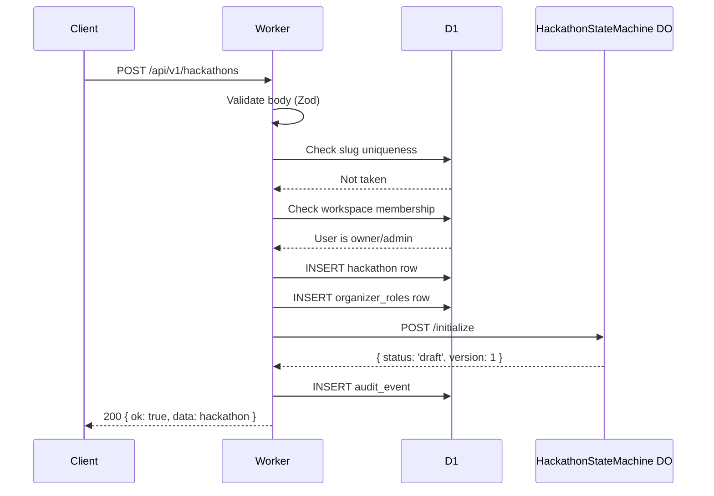

# Creating a Hackathon

> `POST /api/v1/hackathons` — Create a new hackathon within a workspace.

## Endpoint

```
POST /api/v1/hackathons
Auth: authMiddleware + requireRole('organizer') on workspace
```

## Request Body

```ts
interface CreateHackathonRequest {
  workspace_id: string;           // required — workspace this hackathon belongs to
  name: string;                   // required — display name
  slug: string;                   // required — URL-safe identifier (unique globally)
  description?: string;           // markdown description
  start_date?: string;            // ISO-8601
  end_date?: string;              // ISO-8601
  submission_deadline?: string;   // ISO-8601
  max_team_size?: number;         // default: 5
  min_team_size?: number;         // default: 1
  max_teams?: number;             // default: unlimited (null)
  template_id?: string;           // optional — clone settings from template
}
```

## Validation (Zod)

```ts
const createHackathonSchema = z.object({
  workspace_id: z.string().uuid(),
  name: z.string().min(3).max(100),
  slug: z.string().min(3).max(50).regex(/^[a-z0-9-]+$/),
  description: z.string().max(5000).optional(),
  start_date: z.string().datetime().optional(),
  end_date: z.string().datetime().optional(),
  submission_deadline: z.string().datetime().optional(),
  max_team_size: z.number().int().min(1).max(20).default(5),
  min_team_size: z.number().int().min(1).max(10).default(1),
  max_teams: z.number().int().min(1).max(500).nullable().default(null),
  template_id: z.string().uuid().optional(),
}).refine(
  (d) => !d.start_date || !d.end_date || d.start_date < d.end_date,
  { message: 'start_date must be before end_date' }
);
```

## Implementation Steps

**Important: D1 insert MUST happen before DO initialization.** If the DO init fails, the hackathon still exists in D1 and can be recovered — the DO `POST /initialize` is idempotent so it can be retried on next access. The reverse (DO first, D1 fails) would leave an orphaned DO with no database row.

1. Validate request body with Zod schema
2. Check slug uniqueness: `SELECT id FROM hackathons WHERE slug = ?`
3. Check workspace membership: user must be owner/admin of workspace
4. If `template_id` provided, load template settings and merge
5. **Insert hackathon row in D1** (this is the point of no return)
6. Create `organizer_roles` row (creator = organizer)
7. Initialize DO: `POST /initialize` to `HACKATHON_SM` (idempotent — safe to retry)
8. Insert audit event: `hackathon.created`
9. Return created hackathon

**Recovery:** If step 7 fails, the hackathon exists in D1 with `status: 'draft'` but the DO is uninitialized. Any subsequent request that accesses this hackathon's DO should call `POST /initialize` first (which is idempotent) to recover.



## DB Insert

```ts
await db.insert(hackathons).values({
  id: crypto.randomUUID(),
  workspace_id: body.workspace_id,
  name: body.name,
  slug: body.slug,
  description: body.description ?? null,
  status: 'draft',
  start_date: body.start_date ?? null,
  end_date: body.end_date ?? null,
  submission_deadline: body.submission_deadline ?? null,
  max_team_size: body.max_team_size,
  min_team_size: body.min_team_size,
  max_teams: body.max_teams,
  settings: JSON.stringify(templateSettings ?? {}),
  created_by: userId,
  created_at: new Date().toISOString(),
  updated_at: new Date().toISOString(),
});
```

## Response

```json
{
  "ok": true,
  "data": {
    "id": "uuid",
    "slug": "spring-hack-2026",
    "name": "Spring Hack 2026",
    "status": "draft",
    "workspace_id": "uuid",
    "created_at": "2026-02-15T19:30:00.000Z"
  }
}
```

## Error Codes

| Code | HTTP | When |
|------|------|------|
| `VALIDATION_ERROR` | 400 | Invalid request body |
| `SLUG_TAKEN` | 409 | Slug already exists |
| `WORKSPACE_NOT_FOUND` | 404 | Workspace doesn't exist |
| `INSUFFICIENT_ROLE` | 403 | User is not workspace owner/admin |

## Slug Rules

- Lowercase alphanumeric + hyphens only
- 3-50 characters
- Globally unique (used as subdomain: `{slug}.devsage.org`)
- Cannot be changed after hackathon has teams

## Edge Cases

- **Slug collision (two organizers create the same slug simultaneously).** The UNIQUE constraint on D1 catches this at the database level. Return 409 `SLUG_TAKEN`.
- **Template references a deleted template.** Return 404 for the template lookup, then create the hackathon without template settings applied.
- **DO initialization fails after D1 insert.** The hackathon exists in the database but the DO is uninitialized. On next access, the Worker should check DO state and re-initialize if needed (idempotent `POST /initialize`).
- **`workspace_id` doesn't belong to the user's workspaces.** Return 403 `INSUFFICIENT_ROLE`.
- **`max_team_size` < `min_team_size`.** Zod refinement catches this at validation time. Return 400 `VALIDATION_ERROR`.

## Done When

- [ ] POST creates hackathon in draft state
- [ ] Slug uniqueness enforced (409 on conflict)
- [ ] Workspace membership verified
- [ ] Creator added as organizer in organizer_roles
- [ ] DO initialized with draft state
- [ ] Template settings merged when template_id provided
- [ ] Audit event logged: hackathon.created
- [ ] Zod validation rejects invalid input (min/max team size, slug format)
- [ ] Integration test: create + verify DO state + verify DB rows
