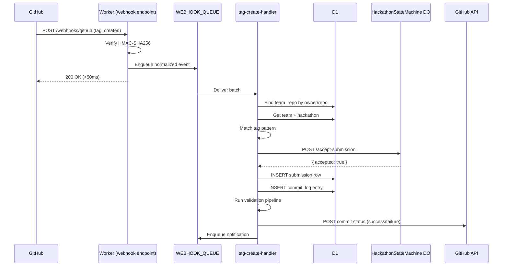

# Tag-Based Capture

> `apps/api/src/queue/tag-create-handler.ts` — Webhook-triggered pipeline from git tag to submission.

## Pipeline

```
GitHub tag_created webhook
  ↓
tag-create-handler (queue consumer)
  ↓
1. Find team_repo matching the repository
2. Extract tag name, commit SHA, timestamp
3. Match tag against pattern (e.g., submission-v*)
4. Determine round (if rounds configured)
5. Lock submission in DO (POST /accept-submission)
6. If accepted:
   a. Insert submission row in D1
   b. Insert commit_log entry
   c. Run validation pipeline
   d. Post commit status on GitHub
   e. Enqueue notification
7. If rejected:
   a. Post failure commit status
   b. Log reason
```

## Sequence Diagram



## Tag Pattern Matching

Default pattern: `submission-v*` (configurable per hackathon in settings).

```ts
// apps/api/src/lib/submission-tag.ts

// All regex metacharacters are escaped before conversion to prevent ReDoS attacks
// from user-supplied tag patterns.
function globToRegex(pattern: string): RegExp {
  // Escape all regex metacharacters EXCEPT *, then convert * to .*
  const escaped = pattern
    .replace(/[.+?^${}()|[\]\\]/g, '\\$&')
    .replace(/\*/g, '.*');
  return new RegExp(`^${escaped}$`);
}

function matchesTagPattern(tagName: string, pattern: string): boolean {
  const regex = globToRegex(pattern);
  return regex.test(tagName);
}
```

**Examples:**
- `submission-v1` ✅ matches `submission-v*`
- `submission-v2.1` ✅ matches `submission-v*`
- `release-v1` ❌ does not match `submission-v*`
- `submission-final` ✅ matches `submission-*`

## Webhook Payload (Normalized)

The `tag-create-handler` receives a normalized event:

```ts
interface TagCreatedEvent {
  type: 'tag_created';
  delivery_id: string;         // GitHub webhook delivery ID (idempotency)
  installation_id: number;
  repository: {
    owner: string;
    name: string;
    full_name: string;
  };
  tag: {
    name: string;              // e.g., 'submission-v1'
    sha: string;               // commit SHA the tag points to
  };
  sender: {
    login: string;
    id: number;
  };
  timestamp: string;           // ISO-8601
}
```

## Matching Tag to Team

```ts
// 1. Find team_repo by github_owner + github_repo
const teamRepo = await db.select()
  .from(teamRepos)
  .where(and(
    eq(teamRepos.github_owner, event.repository.owner),
    eq(teamRepos.github_repo, event.repository.name),
    eq(teamRepos.bot_active, 1)  // SQLite boolean: 1 = true
  ))
  .get();

if (!teamRepo) return; // repo not linked to any team

// 2. Get hackathon to check tag pattern
const team = await db.select().from(teams).where(eq(teams.id, teamRepo.team_id)).get();
const hackathon = await db.select().from(hackathons).where(eq(hackathons.id, team.hackathon_id)).get();

// 3. Check pattern
const pattern = hackathon.settings?.tag_pattern ?? 'submission-v*';
if (!matchesTagPattern(event.tag.name, pattern)) return; // not a submission tag
```

## Submission Row

```ts
await db.insert(submissions).values({
  id: crypto.randomUUID(),
  hackathon_id: hackathon.id,
  team_id: team.id,
  round_id: resolvedRoundId,    // null if single-round
  tag_name: event.tag.name,
  commit_sha: event.tag.sha,
  submitted_at: event.timestamp,
  status: 'pending_validation',  // → validated | failed_validation
  delivery_id: event.delivery_id,
  created_at: new Date().toISOString(),
});
```

## Error Codes

| Code | HTTP | When |
|------|------|------|
| `TAG_NOT_MATCHED` | — | Tag doesn't match pattern (silent skip) |
| `REPO_NOT_LINKED` | — | Repo not associated with any team (silent skip) |
| `SUBMISSION_REJECTED` | — | DO rejected (deadline passed, limit exceeded) |

## Edge Cases

- **Same tag pushed to two repos linked to different teams.** Each is processed independently. Both are valid submissions for their respective teams.
- **Tag pushed after deadline.** The DO rejects with `DEADLINE_PASSED`. The handler posts a failure commit status to GitHub so the participant sees the rejection.
- **Tag deleted and re-pushed with the same name.** The `delivery_id` is different, but the `submission_key` is the same (tag name). The DO lock returns "already accepted" (idempotent).
- **Repo unlinked between webhook send and queue processing.** The `team_repo` lookup returns null. Silently skip, no error.
- **Hackathon transitioned away from 'active' between enqueue and processing.** The DO rejects the submission. Handler posts a failure status to GitHub.
- **Force push changes the commit a tag points to.** GitHub fires a new `tag_created` event with a different SHA. Treat as an update to the existing submission.

## Done When

- [ ] Tag matching works for default pattern (submission-v*) and custom patterns
- [ ] Happy path: tag -> queue -> handler -> DO lock -> D1 insert -> GitHub status -> notification
- [ ] Rejected submissions get failure commit status on GitHub
- [ ] Idempotent: re-processing same delivery_id is safe
- [ ] Unknown repos silently skipped
- [ ] Integration test: mock GitHub webhook -> verify submission row + commit status API call
