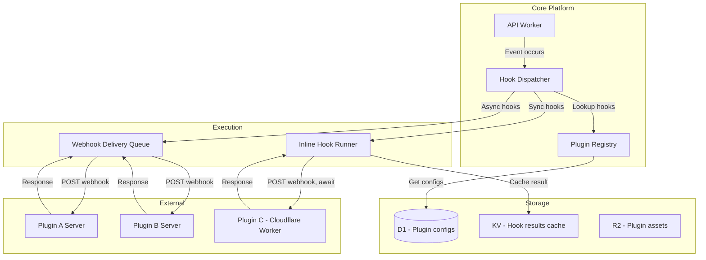
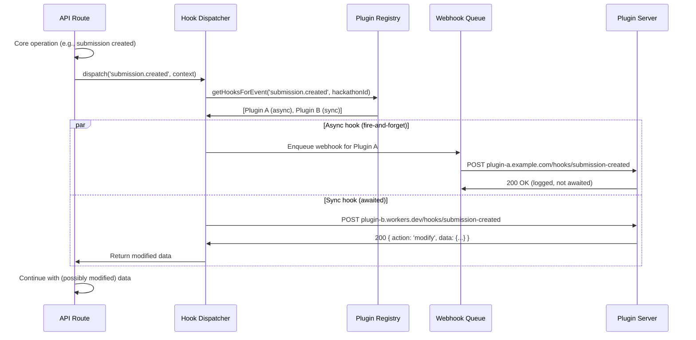
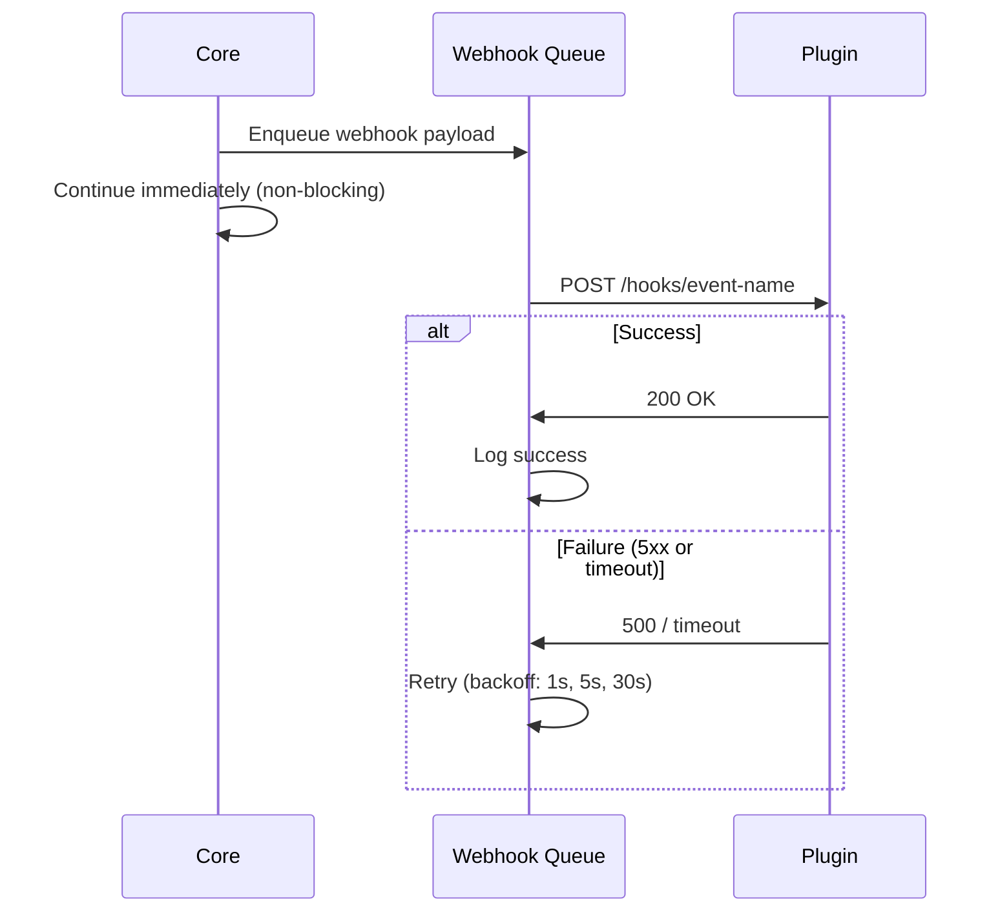
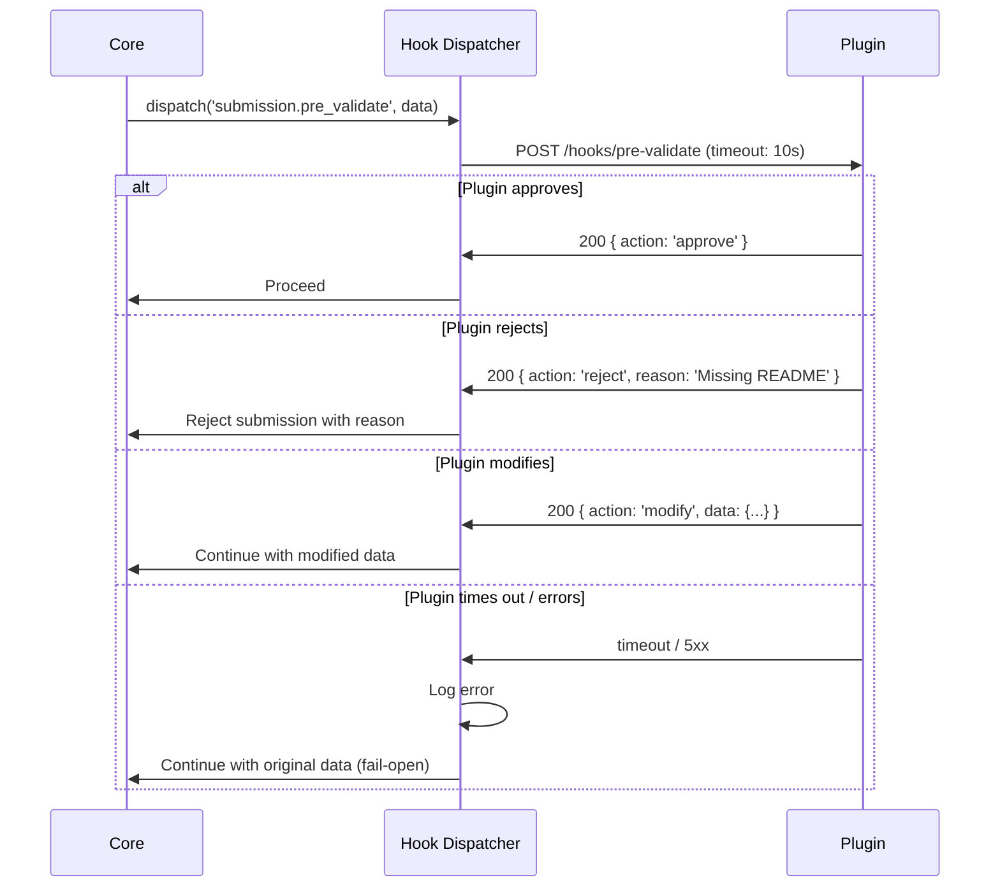
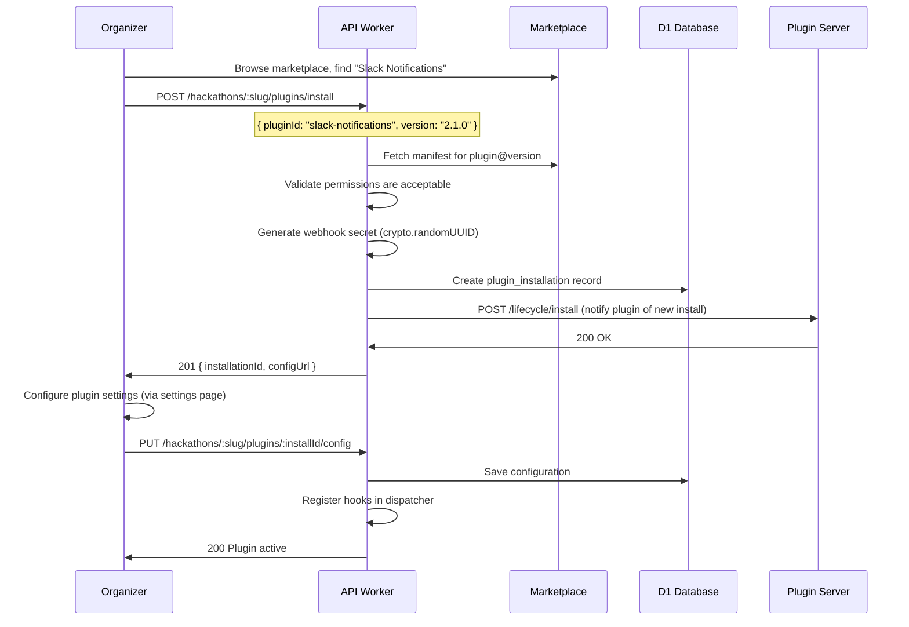
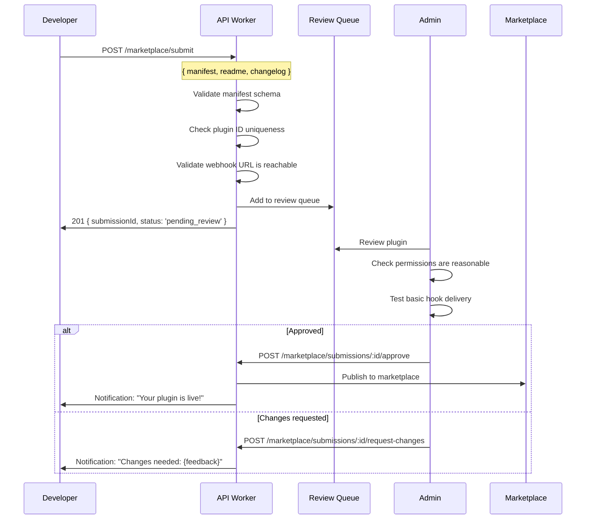
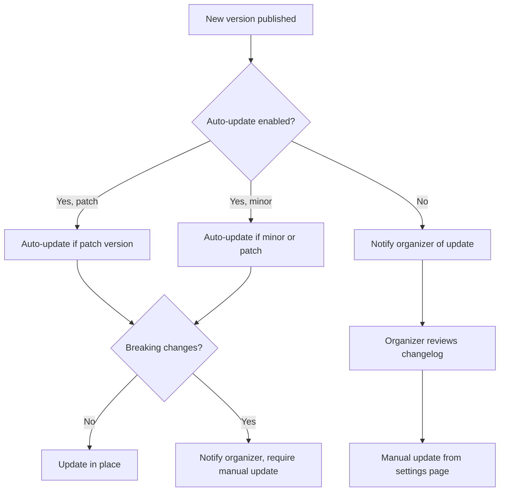

# 19 — Plugin Extensibility

> Lifecycle hook-based plugin system with declarative manifests, webhook-based execution, sandboxed contexts, a plugin marketplace, and version management — enabling third-party developers to extend DevSage without touching core code.

---

## Table of Contents

1. [Design Goals](#design-goals)
2. [Architecture Overview](#architecture-overview)
3. [Plugin Manifest](#plugin-manifest)
4. [Lifecycle Hooks](#lifecycle-hooks)
5. [Hook Execution](#hook-execution)
6. [Plugin Context & Sandbox](#plugin-context--sandbox)
7. [Plugin Types](#plugin-types)
8. [Plugin Installation](#plugin-installation)
9. [Plugin Configuration](#plugin-configuration)
10. [Marketplace](#marketplace)
11. [Plugin Development](#plugin-development)
12. [Versioning & Updates](#versioning--updates)
13. [Security Model](#security-model)
14. [API Endpoints](#api-endpoints)
15. [Edge Cases](#edge-cases)
16. [Error Codes](#error-codes)
17. [Database Tables](#database-tables)
18. [Decision Log](#decision-log)

---

## Design Goals

| Goal | Target | Rationale |
|------|--------|-----------|
| Hook execution latency | < 500ms for synchronous hooks | Plugins must not noticeably slow down core operations |
| Hook timeout | 10s hard limit | Prevent runaway plugins from blocking hackathon operations |
| Plugin install time | < 30 seconds | Self-service install from marketplace |
| Zero core code changes | 100% of plugins via hooks + webhooks | Plugins must never require deploying new DevSage code |
| Plugin isolation | Full sandboxing | One plugin failure cannot affect other plugins or core |
| Backward compatibility | Manifest v1 always supported | Plugin authors need stability guarantees |
| Marketplace discovery | < 2s search results | Organizers should find relevant plugins quickly |
| Max plugins per hackathon | 20 | Prevent hook chain performance degradation |

---

## Architecture Overview



### Event-to-Hook Flow



---

## Plugin Manifest

Every plugin is defined by a manifest file (`devsage-plugin.json`). This is the single source of truth for what a plugin does, what hooks it listens to, what permissions it needs, and how to configure it.

### Manifest Schema

```typescript
interface PluginManifest {
  // Identity
  id: string;                     // Unique plugin ID (e.g., "slack-notifications")
  name: string;                   // Human-readable name
  description: string;            // What this plugin does (max 500 chars)
  version: string;                // Semver (e.g., "1.2.0")
  author: {
    name: string;
    email?: string;
    url?: string;
  };
  repository?: string;            // Source code URL
  license: string;                // SPDX license identifier
  
  // Compatibility
  manifestVersion: 1;             // Manifest schema version
  minPlatformVersion?: string;    // Minimum DevSage version required
  
  // Hooks
  hooks: HookRegistration[];
  
  // Permissions
  permissions: PluginPermission[];
  
  // Configuration schema (JSON Schema)
  configSchema?: Record<string, unknown>;  // JSON Schema for plugin settings
  
  // Webhook endpoint
  webhookUrl: string;             // Base URL for webhook delivery
  
  // UI extensions (optional)
  ui?: {
    settingsPage?: string;        // URL for plugin settings iframe
    dashboardWidget?: {
      name: string;
      description: string;
      width: 'small' | 'medium' | 'large';
      height: 'small' | 'medium' | 'large';
      url: string;               // iframe URL for widget
    };
  };
  
  // Assets
  iconUrl?: string;               // Plugin icon (64×64)
  screenshotUrls?: string[];      // Marketplace screenshots
  
  // Categories
  categories: PluginCategory[];
  tags: string[];                 // Free-form tags for search
}

type PluginCategory =
  | 'communication'     // Slack, Discord, Teams integrations
  | 'analytics'         // Custom analytics, reporting
  | 'judging'           // Custom scoring, review tools
  | 'submission'        // Validation, processing, CI/CD
  | 'team'              // Team formation, matching
  | 'notification'      // Custom notification channels
  | 'devtools'          // Developer productivity
  | 'social'            // Social features, gamification
  | 'accessibility'     // A11y tools
  | 'other';
```

### Hook Registration

```typescript
interface HookRegistration {
  event: string;                  // Hook event name (e.g., "submission.created")
  endpoint: string;               // Path appended to webhookUrl (e.g., "/hooks/submission-created")
  mode: 'async' | 'sync';        // Async = fire-and-forget, Sync = awaited
  priority: number;               // Execution order (lower = first, default: 100)
  filter?: HookFilter;           // Optional: only trigger on matching conditions
  timeout?: number;               // Override default timeout (max 10s for sync, 30s for async)
}

interface HookFilter {
  // Only trigger when these conditions are met
  phases?: string[];              // Hackathon phases (e.g., ["ACTIVE", "JUDGING"])
  tracks?: string[];              // Specific tracks
  roles?: string[];               // Actor role must be one of these
  conditions?: Record<string, unknown>;  // Custom key-value conditions
}
```

### Example Manifest

```json
{
  "id": "slack-notifications",
  "name": "Slack Notifications",
  "description": "Send hackathon events to Slack channels. Supports submissions, team updates, announcements, and judging milestones.",
  "version": "2.1.0",
  "author": {
    "name": "DevSage Community",
    "url": "https://github.com/devsage-community/slack-plugin"
  },
  "repository": "https://github.com/devsage-community/slack-plugin",
  "license": "MIT",
  "manifestVersion": 1,
  "hooks": [
    {
      "event": "submission.created",
      "endpoint": "/hooks/submission",
      "mode": "async",
      "priority": 100
    },
    {
      "event": "hackathon.phase_changed",
      "endpoint": "/hooks/phase",
      "mode": "async",
      "priority": 50
    },
    {
      "event": "announcement.created",
      "endpoint": "/hooks/announcement",
      "mode": "async",
      "priority": 50,
      "filter": {
        "conditions": { "priority": "urgent" }
      }
    }
  ],
  "permissions": [
    "hackathon:read",
    "submission:read",
    "announcement:read",
    "team:read"
  ],
  "configSchema": {
    "type": "object",
    "properties": {
      "webhook_url": {
        "type": "string",
        "title": "Slack Webhook URL",
        "description": "Incoming webhook URL from Slack",
        "format": "uri"
      },
      "channel": {
        "type": "string",
        "title": "Channel",
        "description": "Slack channel to post to (e.g., #hackathon)"
      },
      "notify_submissions": {
        "type": "boolean",
        "title": "Notify on submissions",
        "default": true
      },
      "notify_announcements": {
        "type": "boolean",
        "title": "Notify on announcements",
        "default": true
      }
    },
    "required": ["webhook_url"]
  },
  "webhookUrl": "https://slack-plugin.devsage-community.workers.dev",
  "iconUrl": "https://cdn.devsage.org/plugins/slack/icon.png",
  "categories": ["communication", "notification"],
  "tags": ["slack", "chat", "notifications", "messaging"]
}
```

---

## Lifecycle Hooks

### Available Hooks

#### Hackathon Lifecycle

| Hook Event | Mode | Context Provided | Use Cases |
|-----------|------|-----------------|-----------|
| `hackathon.created` | async | Hackathon details | Set up external integrations |
| `hackathon.phase_changed` | async | Old phase, new phase, hackathon | Announce transitions, trigger workflows |
| `hackathon.settings_updated` | async | Changed fields, new values | Sync settings to external tools |
| `hackathon.deadline_warning` | async | Deadline, minutes remaining | Custom deadline notifications |
| `hackathon.archived` | async | Hackathon details | Clean up external resources |

#### Registration

| Hook Event | Mode | Context Provided | Use Cases |
|-----------|------|-----------------|-----------|
| `registration.created` | async | User, hackathon, track | Welcome messages, CRM sync |
| `registration.cancelled` | async | User, hackathon, reason | Analytics, follow-up |
| `registration.pre_validate` | sync | User, hackathon | Custom eligibility checks (return approve/reject) |

#### Team

| Hook Event | Mode | Context Provided | Use Cases |
|-----------|------|-----------------|-----------|
| `team.created` | async | Team, hackathon | Set up team resources (repos, channels) |
| `team.member_joined` | async | User, team, hackathon | Auto-invite to team channels |
| `team.member_left` | async | User, team, hackathon, reason | Clean up access |
| `team.repo_linked` | async | Team, repo URL, provider | Set up CI/CD, webhooks |
| `team.dissolved` | async | Team, hackathon | Clean up team resources |

#### Submission

| Hook Event | Mode | Context Provided | Use Cases |
|-----------|------|-----------------|-----------|
| `submission.created` | async/sync | Submission, team, hackathon | Run CI/CD, notify judges, validate |
| `submission.pre_validate` | sync | Submission, team, repo | Custom validation rules (return pass/fail) |
| `submission.validated` | async | Submission, validation result | Post-validation actions |
| `submission.rejected` | async | Submission, rejection reason | Notify team with fix suggestions |
| `submission.updated` | async | Submission, old version, new version | Diff analysis, re-validate |

#### Judging

| Hook Event | Mode | Context Provided | Use Cases |
|-----------|------|-----------------|-----------|
| `judging.round_started` | async | Round number, hackathon | Notify judges, update dashboards |
| `judging.score_submitted` | async | Score, judge, submission | Live scoring feeds |
| `judging.round_completed` | async | Round, results summary | Generate reports |
| `judging.leaderboard_updated` | async | Top N entries | Update external leaderboards |
| `judging.score_pre_validate` | sync | Score, rubric | Custom scoring validation rules |

#### Notification

| Hook Event | Mode | Context Provided | Use Cases |
|-----------|------|-----------------|-----------|
| `notification.pre_send` | sync | Notification, recipient | Custom routing, filtering, modification |
| `notification.sent` | async | Notification, delivery status | Delivery tracking |
| `notification.failed` | async | Notification, error | Fallback delivery channels |

#### Announcement

| Hook Event | Mode | Context Provided | Use Cases |
|-----------|------|-----------------|-----------|
| `announcement.created` | async | Announcement, author | Cross-post to Slack/Discord |
| `announcement.updated` | async | Announcement, changes | Update cross-posted messages |
| `announcement.pinned` | async | Announcement | Highlight in external channels |

#### Mentor

| Hook Event | Mode | Context Provided | Use Cases |
|-----------|------|-----------------|-----------|
| `mentor.session_started` | async | Session, mentor, team | Log in external system |
| `mentor.session_completed` | async | Session, duration, feedback | Generate session reports |
| `mentor.request_unmatched` | async | Request, topic, wait time | Escalation to external mentor pools |

---

## Hook Execution

### Execution Modes

#### Async Hooks (Default)

- Dispatched via Cloudflare Queue (fire-and-forget)
- Plugin receives webhook, processes it, responds with 2xx
- Failure does not affect core operation
- Retried up to 3 times with exponential backoff



#### Sync Hooks (Opted-in)

- Executed inline during the request
- Plugin can modify the operation's data or reject it
- Hard timeout: 10 seconds
- Failure falls through (core continues with original data)



### Hook Priority & Ordering

When multiple plugins register for the same hook event:

1. Sort by `priority` (ascending — lower number = first)
2. Execute in order
3. For sync hooks: each plugin receives the output of the previous (pipeline)
4. For async hooks: all dispatched in parallel (order doesn't matter)

```typescript
// Sync hook pipeline example:
// Plugin A (priority 10): Adds lint check results to submission
// Plugin B (priority 50): Validates based on lint results
// Plugin C (priority 100): Logs final validation result

// Data flows: original → A modifies → B validates → C logs
```

### Hook Response Format

```typescript
// Plugin webhook response
interface HookResponse {
  // What the plugin wants to do
  action: 'approve' | 'reject' | 'modify' | 'skip';
  
  // For 'reject': reason shown to user
  reason?: string;
  
  // For 'modify': merged into the hook context data
  data?: Record<string, unknown>;
  
  // Optional metadata (logged, not used by core)
  metadata?: {
    pluginVersion: string;
    processingTimeMs: number;
    [key: string]: unknown;
  };
}
```

---

## Plugin Context & Sandbox

### Hook Payload

Every webhook delivery includes a standardized payload:

```typescript
interface HookPayload {
  // Event identity
  event: string;                  // Hook event name
  hookId: string;                 // Unique delivery ID (for idempotency)
  timestamp: string;              // ISO-8601
  
  // Context
  hackathon: {
    id: string;
    slug: string;
    name: string;
    phase: string;
    timezone: string;
  };
  
  // Actor (who triggered this event)
  actor?: {
    id: string;
    username: string;
    role: string;
  };
  
  // Event-specific data
  data: Record<string, unknown>;
  
  // Plugin's saved configuration
  config: Record<string, unknown>;
  
  // Installation metadata
  installation: {
    id: string;
    pluginId: string;
    installedAt: string;
  };
}
```

### Webhook Delivery

```
POST {webhookUrl}{endpoint}
Content-Type: application/json
X-DevsAge-Signature: sha256={hmac}
X-DevsAge-Hook-Id: hook_abc123
X-DevsAge-Event: submission.created
X-DevsAge-Delivery-Id: del_xyz789
X-DevsAge-Timestamp: 2026-01-15T10:30:00Z
User-Agent: DevsAge-Hooks/1.0

{hookPayload}
```

### Signature Verification

Every webhook delivery is signed with HMAC-SHA256 using a per-installation secret:

```typescript
// Signature generation
const signature = hmacSHA256(
  JSON.stringify(payload),
  installation.webhookSecret
);

// Header: X-DevsAge-Signature: sha256={signature}

// Plugin verifies:
function verifySignature(payload: string, signature: string, secret: string): boolean {
  const expected = hmacSHA256(payload, secret);
  return timingSafeEqual(signature, `sha256=${expected}`);
}
```

### Data Access Boundaries

Plugins only receive data that matches their declared permissions:

| Permission | Data Accessible |
|-----------|----------------|
| `hackathon:read` | Hackathon name, slug, phase, dates, settings |
| `team:read` | Team names, member count, track |
| `team:members` | Team member names and roles |
| `submission:read` | Submission metadata, tag, track, status |
| `submission:content` | Submission repo URL, files, diffs |
| `judging:read` | Scores, rubric, leaderboard |
| `judging:write` | Submit AI-assisted scores (via API) |
| `notification:send` | Send notifications to users |
| `user:read` | User display name, avatar (no email/PII) |
| `announcement:read` | Announcement content, priority |
| `announcement:write` | Create announcements (via API) |
| `analytics:read` | Hackathon analytics data |
| `config:read` | Plugin's own configuration |

If a plugin requests `submission:read` but not `submission:content`, the webhook payload will include submission metadata but not the repo URL or file contents.

---

## Plugin Types

### Webhook Plugins (Standard)

External HTTP endpoints that receive webhook payloads. Can be hosted anywhere.

| Aspect | Detail |
|--------|--------|
| Hosting | Any HTTP endpoint (cloud function, Worker, server) |
| Language | Any (receives/returns JSON) |
| Latency | Network round-trip to external server |
| State | Plugin manages its own state |
| Cost | Plugin author pays for hosting |

### Worker Plugins (Optimized)

Cloudflare Worker-based plugins that run on the same edge network. Lower latency, recommended for sync hooks.

| Aspect | Detail |
|--------|--------|
| Hosting | Cloudflare Workers (same edge network) |
| Language | JavaScript/TypeScript |
| Latency | ~10ms (same-edge, no internet round-trip) |
| State | Workers KV, D1, or Durable Objects |
| Cost | Plugin author's Cloudflare account |

### Builtin Plugins (First-Party)

Maintained by the DevSage team. Installed by default or available for free in marketplace.

| Plugin | Description | Hooks Used |
|--------|-------------|-----------|
| `github-ci-check` | Runs CI checks on submission repos | `submission.pre_validate` (sync) |
| `discord-bot` | Posts events to Discord channels | `submission.created`, `announcement.created`, `hackathon.phase_changed` (async) |
| `auto-readme-check` | Validates submission has a README | `submission.pre_validate` (sync) |
| `gamification` | Achievement badges and point system | `submission.created`, `team.member_joined`, `mentor.session_completed` (async) |
| `csv-judge-import` | Import judge assignments from CSV | `judging.round_started` (async) |

---

## Plugin Installation

### Installation Flow



### Installation Record

```typescript
interface PluginInstallation {
  id: string;                     // Installation ID (`inst_` prefix + UUID)
  hackathonId: string;
  pluginId: string;
  version: string;                // Installed version
  
  // Configuration
  config: Record<string, unknown>;  // Plugin-specific settings
  webhookSecret: string;          // HMAC secret for this installation
  
  // Status
  status: 'installing' | 'active' | 'paused' | 'error' | 'uninstalled';
  errorMessage?: string;          // If status is 'error'
  
  // Permissions
  grantedPermissions: string[];   // Permissions approved at install
  
  // Stats
  totalHookDeliveries: number;
  lastDeliveryAt?: string;
  failedDeliveries: number;
  
  // Lifecycle
  installedBy: string;           // User who installed
  installedAt: string;
  updatedAt: string;
  pausedAt?: string;
  uninstalledAt?: string;
}
```

### Installation Limits

| Limit | Value | Rationale |
|-------|-------|-----------|
| Max plugins per hackathon | 20 | Prevent hook chain performance degradation |
| Max sync hooks per event | 5 | Limit total sync latency (5 × 10s max = 50s worst case) |
| Max async hooks per event | 20 | Queue can handle high fan-out |
| Max config size | 10 KB | Prevent storage abuse |
| Max webhook payload | 256 KB | Reasonable payload size |

---

## Plugin Configuration

### Config UI

Plugins define their settings via JSON Schema in the manifest. DevSage auto-generates a configuration form:

```
┌─────────────────────────────────────────────────────────────┐
│  Plugin Settings — Slack Notifications v2.1.0                │
│                                                              │
│  Slack Webhook URL *                                         │
│  ┌──────────────────────────────────────────────────────┐   │
│  │ https://hooks.slack.com/services/T.../B.../xxx       │   │
│  └──────────────────────────────────────────────────────┘   │
│                                                              │
│  Channel                                                     │
│  ┌──────────────────────────────────────────────────────┐   │
│  │ #hackathon-2026                                       │   │
│  └──────────────────────────────────────────────────────┘   │
│                                                              │
│  ☑ Notify on submissions                                     │
│  ☑ Notify on announcements                                   │
│  ☐ Notify on team changes                                    │
│                                                              │
│  [Save]  [Test Connection]  [Pause Plugin]  [Uninstall]      │
└─────────────────────────────────────────────────────────────┘
```

### Config Validation

Configuration is validated against the plugin's JSON Schema before saving:

```typescript
interface ConfigValidation {
  // Schema from manifest
  schema: Record<string, unknown>;
  
  // Validation steps
  steps: [
    'json_schema_validate',     // Validate against JSON Schema
    'secret_detection',         // Warn if config contains potential secrets
    'url_reachability',         // Test webhook URL is reachable (optional)
  ];
}
```

### Sensitive Config Values

Plugin configs may contain secrets (API keys, webhook URLs). These are:
- Stored encrypted at rest in D1
- Never included in API responses (replaced with `"***"`)
- Only decrypted when constructing webhook payloads
- Not included in plugin export/backup

---

## Marketplace

### Marketplace Structure

```
┌─────────────────────────────────────────────────────────────┐
│  DevSage Plugin Marketplace                                  │
│  ┌──────────────────────────────────────────────────────┐   │
│  │ 🔍 Search plugins...                                  │   │
│  └──────────────────────────────────────────────────────┘   │
│                                                              │
│  Categories: [All] [Communication] [Analytics] [Judging]     │
│              [Submission] [Team] [DevTools] [Social]         │
│                                                              │
│  Featured                                                    │
│  ┌──────────────┐ ┌──────────────┐ ┌──────────────┐        │
│  │ 💬 Slack      │ │ 🎮 Discord   │ │ ✅ CI Check   │        │
│  │ Notifications │ │ Bot          │ │              │        │
│  │ ⭐ 4.8 (120)  │ │ ⭐ 4.7 (85)  │ │ ⭐ 4.9 (64)  │        │
│  │ [Install]    │ │ [Install]    │ │ [Installed ✓]│        │
│  └──────────────┘ └──────────────┘ └──────────────┘        │
│                                                              │
│  Popular                                                     │
│  ┌──────────────┐ ┌──────────────┐ ┌──────────────┐        │
│  │ 🏆 Gamify     │ │ 📊 Analytics+│ │ 📝 README     │        │
│  │ Badges/pts   │ │ Custom dash  │ │ Validator    │        │
│  │ ⭐ 4.6 (42)  │ │ ⭐ 4.5 (31)  │ │ ⭐ 4.8 (56)  │        │
│  │ [Install]    │ │ [Install]    │ │ [Install]    │        │
│  └──────────────┘ └──────────────┘ └──────────────┘        │
└─────────────────────────────────────────────────────────────┘
```

### Marketplace Entry

```typescript
interface MarketplaceEntry {
  pluginId: string;
  manifest: PluginManifest;
  
  // Marketplace metadata
  publishedAt: string;
  updatedAt: string;
  downloadCount: number;
  activeInstallations: number;
  
  // Reviews
  averageRating: number;         // 1-5
  reviewCount: number;
  
  // Trust signals
  verified: boolean;             // DevSage team reviewed
  official: boolean;             // Published by DevSage
  
  // Version history
  versions: Array<{
    version: string;
    releasedAt: string;
    changelog: string;
    minPlatformVersion?: string;
  }>;
  
  // Documentation
  readmeMarkdown: string;        // Full README
  changelogMarkdown?: string;    // Changelog
}
```

### Marketplace Submission



### Marketplace Review Criteria

| Criterion | Requirement |
|-----------|-------------|
| Manifest validity | Passes JSON Schema validation |
| Webhook reachable | Webhook URL responds to test ping with 200 |
| Reasonable permissions | Permissions match declared hooks (no over-requesting) |
| Description quality | Name, description, and README are clear and complete |
| No malicious intent | No data exfiltration, no excessive scopes |
| Security basics | Uses HTTPS webhook URL, signature verification documented |
| Version hygiene | Valid semver, changelog for each version |

---

## Plugin Development

### Developer SDK

```typescript
// @devsage/plugin-sdk — helpers for building plugins

import { createPlugin, verifySignature } from '@devsage/plugin-sdk';

const plugin = createPlugin({
  // Verify incoming webhook signatures
  secret: process.env.WEBHOOK_SECRET,
  
  // Hook handlers
  hooks: {
    'submission.created': async (payload, ctx) => {
      // payload.data contains submission details
      // payload.config contains plugin configuration
      // ctx provides utilities (logger, respond)
      
      await notifySlack(payload.config.webhook_url, {
        text: `New submission from ${payload.data.teamName}!`,
      });
      
      return ctx.acknowledge();  // 200 OK
    },
    
    'submission.pre_validate': async (payload, ctx) => {
      // Sync hook — can approve, reject, or modify
      const hasReadme = await checkReadme(payload.data.repoUrl);
      
      if (!hasReadme) {
        return ctx.reject('Submission must include a README.md file');
      }
      
      return ctx.approve();
    },
  },
});

// Export for Cloudflare Worker
export default plugin;
```

### Testing Tools

```typescript
// @devsage/plugin-testing — test harness for plugins

import { createTestHarness } from '@devsage/plugin-testing';

const harness = createTestHarness({
  manifest: './devsage-plugin.json',
  handler: plugin,
});

// Simulate hook delivery
const response = await harness.deliver('submission.created', {
  data: {
    teamName: 'Test Team',
    tag: 'v1.0.0',
    track: 'web',
  },
  config: {
    webhook_url: 'https://hooks.slack.com/test',
  },
});

assert(response.status === 200);
assert(response.body.action === 'approve');
```

### CLI Tools

```bash
# Validate manifest
npx devsage-plugin validate

# Test hook delivery locally
npx devsage-plugin test --event submission.created --data '{"teamName":"Test"}'

# Submit to marketplace
npx devsage-plugin submit --manifest devsage-plugin.json --readme README.md

# Check submission status
npx devsage-plugin status --plugin-id slack-notifications
```

---

## Versioning & Updates

### Version Management



### Update Policy

| Setting | Behavior |
|---------|----------|
| `auto_update: 'patch'` | Automatically apply patch updates (1.0.x). Notify on minor/major |
| `auto_update: 'minor'` | Automatically apply minor + patch (1.x.x). Notify on major |
| `auto_update: 'none'` | Never auto-update. Notify on all new versions |
| `auto_update: 'all'` | Auto-update everything (not recommended for production hackathons) |

### Migration Support

When a plugin version changes its `configSchema`:

1. New version includes a `configMigration` function in the manifest
2. On update, the migration function transforms old config to new format
3. If migration fails, the update is rolled back and organizer is notified

```typescript
// In manifest
{
  "configMigrations": {
    "2.0.0": {
      "from": "1.x",
      "transform": {
        "rename": { "slack_url": "webhook_url" },
        "add": { "notify_team_changes": false },
        "remove": ["legacy_mode"]
      }
    }
  }
}
```

---

## Security Model

### Threat Model

| Threat | Mitigation |
|--------|-----------|
| Malicious plugin exfiltrates data | Permissions limit accessible data. Review process catches obvious issues |
| Plugin DoS via slow response | Hard timeout (10s sync, 30s async). Auto-pause after consecutive failures |
| Plugin impersonates DevSage | Webhook signature verification (HMAC-SHA256). Plugin verifies our signature |
| Plugin sends excessive requests to our API | Per-plugin rate limits (100 req/min) |
| Config contains secrets in plaintext | Encrypted at rest. Marked fields never returned in API responses |
| Compromised plugin webhook endpoint | Each installation has unique secret. Revoking installation invalidates secret |
| Plugin escalates permissions post-install | Permissions locked at install time. Version update with new permissions requires re-approval |

### Auto-Pause Rules

A plugin is automatically paused when:

| Condition | Threshold | Action |
|-----------|-----------|--------|
| Consecutive delivery failures | 10 in a row | Pause + notify organizer |
| Error rate | > 50% over last 100 deliveries | Pause + notify organizer |
| Timeout rate | > 30% over last 50 deliveries | Pause + notify organizer |
| Sync hook rejection storm | > 20 rejections in 1 hour | Pause + notify organizer |

Paused plugins stop receiving hooks. Organizer must manually reactivate after investigating.

### Permission Review

| Risk Level | Permissions | Review Requirement |
|------------|-------------|-------------------|
| Low | `hackathon:read`, `announcement:read` | Automated approval |
| Medium | `submission:read`, `team:read`, `user:read` | Automated with flag |
| High | `submission:content`, `judging:write`, `notification:send` | Manual review required |
| Critical | `announcement:write` | Manual review + DevSage team approval |

---

## API Endpoints

### Plugin Management (Organizer)

| Method | Path | Auth | Min Role | Description |
|--------|------|------|----------|-------------|
| GET | `/api/v1/hackathons/:slug/plugins` | JWT | admin | List installed plugins |
| POST | `/api/v1/hackathons/:slug/plugins/install` | JWT | admin | Install plugin from marketplace |
| GET | `/api/v1/hackathons/:slug/plugins/:installId` | JWT | admin | Get installation details |
| PUT | `/api/v1/hackathons/:slug/plugins/:installId/config` | JWT | admin | Update plugin configuration |
| POST | `/api/v1/hackathons/:slug/plugins/:installId/test` | JWT | admin | Send test hook to plugin |
| POST | `/api/v1/hackathons/:slug/plugins/:installId/pause` | JWT | admin | Pause plugin |
| POST | `/api/v1/hackathons/:slug/plugins/:installId/resume` | JWT | admin | Resume paused plugin |
| POST | `/api/v1/hackathons/:slug/plugins/:installId/update` | JWT | admin | Update to new version |
| DELETE | `/api/v1/hackathons/:slug/plugins/:installId` | JWT | admin | Uninstall plugin |
| GET | `/api/v1/hackathons/:slug/plugins/:installId/logs` | JWT | admin | Get delivery logs |

### Marketplace

| Method | Path | Auth | Min Role | Description |
|--------|------|------|----------|-------------|
| GET | `/api/v1/marketplace/plugins` | Optional | — | Search/browse marketplace |
| GET | `/api/v1/marketplace/plugins/:pluginId` | Optional | — | Get plugin details |
| GET | `/api/v1/marketplace/plugins/:pluginId/versions` | Optional | — | List versions |
| GET | `/api/v1/marketplace/plugins/:pluginId/reviews` | Optional | — | Get reviews |
| POST | `/api/v1/marketplace/plugins/:pluginId/reviews` | JWT | — | Submit review (must have installed) |
| GET | `/api/v1/marketplace/categories` | Optional | — | List categories |

### Plugin Development

| Method | Path | Auth | Min Role | Description |
|--------|------|------|----------|-------------|
| POST | `/api/v1/marketplace/submit` | JWT | — | Submit plugin for review |
| GET | `/api/v1/marketplace/submissions` | JWT | — | List own submissions |
| GET | `/api/v1/marketplace/submissions/:id` | JWT | — | Get submission status |
| PUT | `/api/v1/marketplace/submissions/:id` | JWT | — | Update submission |
| POST | `/api/v1/marketplace/plugins/:pluginId/versions` | JWT | plugin author | Publish new version |

### Platform Admin (Marketplace Management)

| Method | Path | Auth | Min Role | Description |
|--------|------|------|----------|-------------|
| GET | `/api/v1/admin/marketplace/submissions` | JWT | platform_owner | List pending reviews |
| POST | `/api/v1/admin/marketplace/submissions/:id/approve` | JWT | platform_owner | Approve plugin |
| POST | `/api/v1/admin/marketplace/submissions/:id/reject` | JWT | platform_owner | Reject plugin |
| POST | `/api/v1/admin/marketplace/plugins/:pluginId/suspend` | JWT | platform_owner | Suspend from marketplace |

---

## Edge Cases

| Scenario | Behavior |
|----------|----------|
| Sync hook plugin is down during submission | Fail-open: submission proceeds with original data. Error logged. Plugin auto-paused after 10 consecutive failures |
| Two sync plugins both modify the same field | Pipeline ordering: plugin with lower priority number goes first. Second plugin receives first plugin's modifications |
| Plugin webhook URL becomes invalid (DNS changed) | Deliveries fail → auto-pause after threshold. Organizer notified to update webhook URL |
| Plugin version update changes permissions | Organizer must re-approve new permissions. Plugin stays on old version until approved |
| Plugin config contains invalid JSON Schema | Manifest validation rejects at submission/install time |
| Organizer installs same plugin twice | 409 PLUGIN_ALREADY_INSTALLED |
| Plugin tries to register for non-existent hook event | Manifest validation rejects unknown hook events |
| Webhook payload exceeds 256 KB | Payload truncated with `truncated: true` flag. Plugin should fetch full data via API |
| Plugin marketplace entry has zero reviews | Shown in marketplace with "New" badge instead of rating |
| Plugin author deletes their account | Plugin remains in marketplace. Ownership can be transferred or plugin is marked "unmaintained" |
| 20 async plugins all registered for same event | All dispatched in parallel via queue. Queue handles fan-out efficiently |
| Sync hook returns invalid response format | Treated as error → fail-open → continue with original data |
| Plugin's test webhook delivery fails | Show error details to organizer. Don't count against auto-pause threshold |
| Hackathon has 20 plugins (max) and tries to install another | 429 PLUGIN_LIMIT_EXCEEDED |
| Plugin config migration fails during version update | Update rolled back. Organizer notified with error details. Plugin stays on current version |

---

## Error Codes

| Code | HTTP Status | Condition |
|------|-------------|-----------|
| `PLUGIN_NOT_FOUND` | 404 | Plugin ID doesn't exist in marketplace |
| `PLUGIN_VERSION_NOT_FOUND` | 404 | Requested version doesn't exist |
| `PLUGIN_ALREADY_INSTALLED` | 409 | Plugin already installed for this hackathon |
| `PLUGIN_LIMIT_EXCEEDED` | 429 | Hackathon has max 20 plugins |
| `PLUGIN_INSTALL_FAILED` | 500 | Installation lifecycle hook failed |
| `PLUGIN_NOT_INSTALLED` | 404 | Installation ID doesn't exist |
| `PLUGIN_PAUSED` | 409 | Action attempted on paused plugin |
| `PLUGIN_CONFIG_INVALID` | 400 | Config doesn't match plugin's JSON Schema |
| `PLUGIN_CONFIG_TOO_LARGE` | 413 | Config exceeds 10 KB limit |
| `PLUGIN_WEBHOOK_UNREACHABLE` | 502 | Plugin's webhook URL is not responding |
| `PLUGIN_WEBHOOK_TIMEOUT` | 504 | Plugin didn't respond within timeout |
| `PLUGIN_PERMISSION_DENIED` | 403 | Plugin requesting data outside its permissions |
| `PLUGIN_UPDATE_REQUIRES_APPROVAL` | 409 | New version has additional permissions |
| `PLUGIN_RATE_LIMITED` | 429 | Plugin exceeded API rate limit (100 req/min) |
| `MANIFEST_INVALID` | 400 | Plugin manifest fails schema validation |
| `MANIFEST_HOOK_UNKNOWN` | 400 | Manifest references unknown hook event |
| `MARKETPLACE_SUBMISSION_PENDING` | 409 | Plugin already has pending submission |
| `MARKETPLACE_NOT_AUTHOR` | 403 | Only plugin author can publish updates |
| `MARKETPLACE_PLUGIN_SUSPENDED` | 403 | Plugin has been suspended from marketplace |
| `REVIEW_ALREADY_SUBMITTED` | 409 | User already reviewed this plugin |
| `REVIEW_NOT_INSTALLED` | 403 | Must have plugin installed to review |
| `SYNC_HOOK_LIMIT_EXCEEDED` | 429 | Max 5 sync hooks per event reached |

---

## Database Tables

### marketplace_plugins

Published plugins in the marketplace.

| Column | Type | Constraints | Description |
|--------|------|-------------|-------------|
| `id` | TEXT | PRIMARY KEY | Plugin ID (from manifest, e.g., "slack-notifications") |
| `name` | TEXT | NOT NULL | Display name |
| `description` | TEXT | NOT NULL | Short description |
| `author_user_id` | TEXT | NOT NULL, FK → users.id | Plugin author |
| `author_name` | TEXT | NOT NULL | Author display name |
| `repository` | TEXT | NULL | Source code URL |
| `license` | TEXT | NOT NULL | SPDX license |
| `latest_version` | TEXT | NOT NULL | Current latest version |
| `manifest` | TEXT | NOT NULL | Full manifest JSON |
| `readme` | TEXT | NOT NULL | README markdown |
| `changelog` | TEXT | NULL | Changelog markdown |
| `icon_url` | TEXT | NULL | Plugin icon URL |
| `categories` | TEXT | NOT NULL | JSON array of categories |
| `tags` | TEXT | NOT NULL | JSON array of tags |
| `verified` | INTEGER | NOT NULL, DEFAULT 0 | DevSage team reviewed |
| `official` | INTEGER | NOT NULL, DEFAULT 0 | Published by DevSage |
| `download_count` | INTEGER | NOT NULL, DEFAULT 0 | Total installations |
| `active_installations` | INTEGER | NOT NULL, DEFAULT 0 | Current active installs |
| `average_rating` | REAL | NOT NULL, DEFAULT 0 | Average review rating |
| `review_count` | INTEGER | NOT NULL, DEFAULT 0 | Total reviews |
| `status` | TEXT | NOT NULL, DEFAULT 'active' | `active`, `suspended`, `deprecated` |
| `published_at` | TEXT | NOT NULL | First publication date |
| `updated_at` | TEXT | NOT NULL | Last update |

**Indexes:**
- `idx_mp_plugins_categories` → `(status)` — active plugin listing
- `idx_mp_plugins_author` → `(author_user_id)` — author's plugins
- `idx_mp_plugins_rating` → `(status, average_rating DESC)` — sorted by rating

### marketplace_versions

Version history for each plugin.

| Column | Type | Constraints | Description |
|--------|------|-------------|-------------|
| `id` | TEXT | PRIMARY KEY | Version record ID (`ver_` prefix + UUID) |
| `plugin_id` | TEXT | NOT NULL, FK → marketplace_plugins.id | Parent plugin |
| `version` | TEXT | NOT NULL | Semver string |
| `manifest` | TEXT | NOT NULL | Manifest for this version |
| `changelog` | TEXT | NULL | Version-specific changelog |
| `min_platform_version` | TEXT | NULL | Minimum DevSage version |
| `config_migrations` | TEXT | NULL | JSON config migration rules |
| `published_at` | TEXT | NOT NULL, DEFAULT CURRENT_TIMESTAMP | Publication time |

**Indexes:**
- `idx_mp_versions_plugin` → `(plugin_id, published_at DESC)` — version history
- UNIQUE `(plugin_id, version)` — one record per version

### marketplace_reviews

User reviews of plugins.

| Column | Type | Constraints | Description |
|--------|------|-------------|-------------|
| `id` | TEXT | PRIMARY KEY | Review ID (`rev_` prefix + UUID) |
| `plugin_id` | TEXT | NOT NULL, FK → marketplace_plugins.id | Reviewed plugin |
| `user_id` | TEXT | NOT NULL, FK → users.id | Reviewer |
| `rating` | INTEGER | NOT NULL | 1-5 stars |
| `title` | TEXT | NULL | Review title |
| `body` | TEXT | NULL | Review text (max 1000 chars) |
| `version_reviewed` | TEXT | NOT NULL | Version at time of review |
| `created_at` | TEXT | NOT NULL, DEFAULT CURRENT_TIMESTAMP | Review time |
| `updated_at` | TEXT | NOT NULL, DEFAULT CURRENT_TIMESTAMP | Last edit |

**Indexes:**
- `idx_mp_reviews_plugin` → `(plugin_id, created_at DESC)` — plugin reviews
- UNIQUE `(plugin_id, user_id)` — one review per user per plugin

### plugin_installations

Per-hackathon plugin installations.

| Column | Type | Constraints | Description |
|--------|------|-------------|-------------|
| `id` | TEXT | PRIMARY KEY | Installation ID (`inst_` prefix + UUID) |
| `hackathon_id` | TEXT | NOT NULL, FK → hackathons.id | Hackathon context |
| `plugin_id` | TEXT | NOT NULL, FK → marketplace_plugins.id | Installed plugin |
| `version` | TEXT | NOT NULL | Installed version |
| `config` | TEXT | NOT NULL, DEFAULT '{}' | Encrypted JSON configuration |
| `webhook_secret` | TEXT | NOT NULL | HMAC secret for this installation |
| `status` | TEXT | NOT NULL, DEFAULT 'installing' | `installing`, `active`, `paused`, `error`, `uninstalled` |
| `error_message` | TEXT | NULL | Error details |
| `granted_permissions` | TEXT | NOT NULL | JSON array of approved permissions |
| `auto_update` | TEXT | NOT NULL, DEFAULT 'patch' | `patch`, `minor`, `none`, `all` |
| `total_deliveries` | INTEGER | NOT NULL, DEFAULT 0 | Lifetime hook deliveries |
| `failed_deliveries` | INTEGER | NOT NULL, DEFAULT 0 | Failed delivery count |
| `consecutive_failures` | INTEGER | NOT NULL, DEFAULT 0 | Current failure streak |
| `last_delivery_at` | TEXT | NULL | Last successful delivery |
| `installed_by` | TEXT | NOT NULL, FK → users.id | Installer |
| `installed_at` | TEXT | NOT NULL, DEFAULT CURRENT_TIMESTAMP | Install time |
| `updated_at` | TEXT | NOT NULL, DEFAULT CURRENT_TIMESTAMP | Last update |
| `paused_at` | TEXT | NULL | Pause time |
| `uninstalled_at` | TEXT | NULL | Uninstall time |

**Indexes:**
- `idx_installations_hackathon` → `(hackathon_id, status)` — active plugins for a hackathon
- UNIQUE `(hackathon_id, plugin_id)` WHERE `status != 'uninstalled'` — one active install per plugin per hackathon

### plugin_hook_logs

Delivery log for debugging and monitoring.

| Column | Type | Constraints | Description |
|--------|------|-------------|-------------|
| `id` | TEXT | PRIMARY KEY | Log entry ID (`hlog_` prefix + UUID) |
| `installation_id` | TEXT | NOT NULL, FK → plugin_installations.id | Plugin installation |
| `event` | TEXT | NOT NULL | Hook event name |
| `delivery_id` | TEXT | NOT NULL, UNIQUE | Unique delivery ID (for idempotency) |
| `mode` | TEXT | NOT NULL | `sync` or `async` |
| `status` | TEXT | NOT NULL | `delivered`, `failed`, `timeout`, `rejected` |
| `http_status` | INTEGER | NULL | Response HTTP status code |
| `response_action` | TEXT | NULL | Plugin's response action (approve/reject/modify/skip) |
| `response_time_ms` | INTEGER | NULL | Round-trip time |
| `error_message` | TEXT | NULL | Error details if failed |
| `retry_count` | INTEGER | NOT NULL, DEFAULT 0 | Number of retries |
| `created_at` | TEXT | NOT NULL, DEFAULT CURRENT_TIMESTAMP | Delivery time |

**Indexes:**
- `idx_hook_logs_installation` → `(installation_id, created_at DESC)` — recent logs per plugin
- `idx_hook_logs_event` → `(event, created_at DESC)` — logs per event type
- `idx_hook_logs_delivery` → `(delivery_id)` — idempotency lookup

### marketplace_submissions

Plugin review queue.

| Column | Type | Constraints | Description |
|--------|------|-------------|-------------|
| `id` | TEXT | PRIMARY KEY | Submission ID (`sub_` prefix + UUID) |
| `plugin_id` | TEXT | NOT NULL | Proposed plugin ID |
| `author_user_id` | TEXT | NOT NULL, FK → users.id | Submitter |
| `manifest` | TEXT | NOT NULL | Submitted manifest JSON |
| `readme` | TEXT | NOT NULL | README markdown |
| `changelog` | TEXT | NULL | Changelog |
| `status` | TEXT | NOT NULL, DEFAULT 'pending_review' | `pending_review`, `approved`, `rejected`, `changes_requested` |
| `reviewer_user_id` | TEXT | NULL | Admin reviewer |
| `review_notes` | TEXT | NULL | Reviewer feedback |
| `submitted_at` | TEXT | NOT NULL, DEFAULT CURRENT_TIMESTAMP | Submission time |
| `reviewed_at` | TEXT | NULL | Review time |

**Indexes:**
- `idx_mp_submissions_status` → `(status, submitted_at)` — review queue
- `idx_mp_submissions_author` → `(author_user_id)` — author's submissions

---

## Decision Log

| Decision | Choice | Why | Alternatives Considered |
|----------|--------|-----|------------------------|
| Plugin execution model | Webhook-based (HTTP POST) | Language-agnostic. Plugin authors use any stack. No code execution in our runtime. Natural isolation. Industry standard pattern (GitHub, Stripe, Shopify webhooks) | WASM sandbox (complex, limited languages), Embedded scripting (security risk), gRPC (less accessible) |
| Sync vs async hooks | Both, plugin declares per hook | Some hooks need to modify data (pre_validate must block). Others are informational (async is fine). Plugin author knows best | All async (can't modify/reject), All sync (performance penalty), Core decides (inflexible) |
| Fail-open for sync hooks | Always continue on plugin failure | Core operations must never be blocked by plugin failures. Hackathon must work even if all plugins are down | Fail-closed (risky — plugin bug blocks submissions), Configurable (too complex for organizers) |
| Plugin configuration | JSON Schema-based auto-generated forms | Declarative — plugin author defines schema, platform generates UI. Consistent UX across all plugins. Validated at save time | Custom settings pages (inconsistent UX, security risk), Environment variables (not user-friendly), YAML files (too technical) |
| Marketplace review | Manual review before publishing | Quality gate prevents malicious or broken plugins. Review criteria are documented. Small volume expected initially | Auto-approve (security risk), Community voting (gaming risk), Automated scanning only (misses intent) |
| Webhook signature | HMAC-SHA256 per installation | Each installation has unique secret. Compromise of one doesn't affect others. Same pattern as GitHub/Stripe | Shared secret (one compromise affects all), JWT (complex key management), mTLS (too complex for plugin devs) |
| Permission model | Declared in manifest, approved at install | Transparency — organizer sees what data plugin accesses before installing. Cannot escalate after install | Runtime permission prompts (disruptive), No permissions (data leakage risk), All-or-nothing (too coarse) |
| Auto-pause | Threshold-based automatic | Protects hackathon from broken plugins without organizer intervention. Clear thresholds are documented | Manual only (organizer may not notice), Immediate (too aggressive for transient failures), No pausing (broken plugin degrades experience) |
| Max plugins per hackathon | 20 | Performance ceiling — sync hook chains can add latency. 20 is generous for any hackathon. Prevents abuse | Unlimited (performance risk), 5 (too restrictive), Tier-based (complexity) |
| Plugin SDK | TypeScript package `@devsage/plugin-sdk` | Reduces boilerplate for plugin authors. Handles signature verification, typing, testing. Optional — raw HTTP works too | No SDK (higher barrier), Multiple language SDKs (maintenance burden), Code generator (brittle) |
| Version update policy | Configurable auto-update with permission gates | Organizers control risk tolerance. Patch auto-updates are safe. Permission changes require explicit approval | Always auto-update (risky), Never auto-update (stale plugins), Manual only (burdensome) |
