# 14 — Real-time System

> WebSocket Gateway powered by Durable Objects for channel-based pub/sub, user presence tracking, SSE fallback, and a typed client SDK — delivering sub-500ms event propagation across all hackathon surfaces.

---

## Table of Contents

1. [Design Goals](#design-goals)
2. [Architecture Overview](#architecture-overview)
3. [WebSocket Gateway DO](#websocket-gateway-do)
4. [Channel System](#channel-system)
5. [Presence Tracking](#presence-tracking)
6. [Message Protocol](#message-protocol)
7. [Server-Sent Events Fallback](#server-sent-events-fallback)
8. [Client SDK](#client-sdk)
9. [Event Routing](#event-routing)
10. [Scaling & Topology](#scaling--topology)
11. [Authentication & Authorization](#authentication--authorization)
12. [Rate Limiting & Abuse Prevention](#rate-limiting--abuse-prevention)
13. [Reconnection & Reliability](#reconnection--reliability)
14. [API Endpoints](#api-endpoints)
15. [Edge Cases](#edge-cases)
16. [Error Codes](#error-codes)
17. [Database Tables](#database-tables)
18. [Decision Log](#decision-log)

---

## Design Goals

| Goal | Target | Rationale |
|------|--------|-----------|
| Event propagation latency | < 500ms end-to-end | Leaderboard updates, announcements must feel instant |
| Connections per hackathon | 10,000 concurrent | Large hackathons with participants + spectators + judges |
| Reconnection time | < 2s after network recovery | Seamless experience during flaky event Wi-Fi |
| Message ordering | Per-channel FIFO | Activity feeds and chat must display in correct order |
| Presence accuracy | < 5s staleness | "Who's online" must reflect reality |
| Fallback availability | 100% of functionality via SSE | WebSocket-blocked networks still get live updates |
| Memory per connection | < 2 KB | Durable Objects have 128MB limit |
| Zero message loss | Guaranteed delivery with ack | Critical events (phase changes, deadlines) cannot be missed |

---

## Architecture Overview

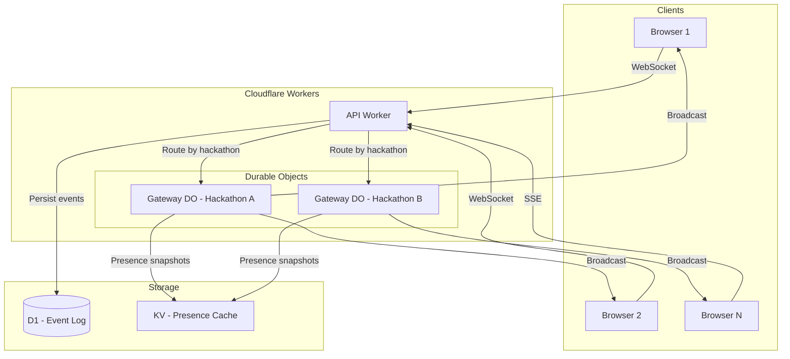

### Request Flow

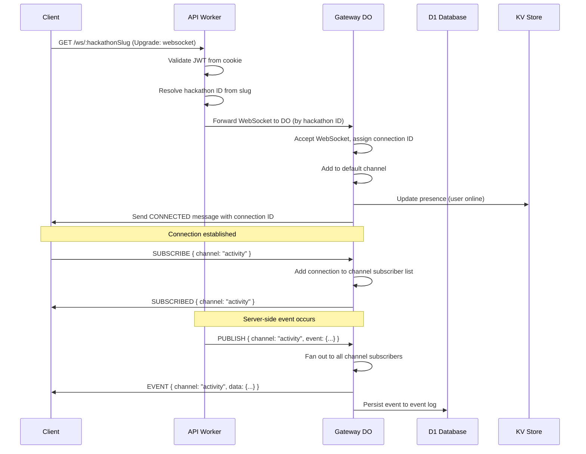

---

## WebSocket Gateway DO

Each hackathon gets its own Gateway Durable Object instance, identified by hackathon ID. This provides natural isolation and scaling — one DO per hackathon.

### DO State

```typescript
interface GatewayState {
  // Connection registry
  connections: Map<string, ConnectionInfo>;
  
  // Channel subscriptions (channel → set of connection IDs)
  channels: Map<string, Set<string>>;
  
  // Presence tracking (user ID → presence info)
  presence: Map<string, PresenceEntry>;
  
  // Message sequence counter (monotonically increasing per channel)
  sequences: Map<string, number>;
  
  // Pending acknowledgments
  pendingAcks: Map<string, PendingAck>;
}

interface ConnectionInfo {
  id: string;              // Unique connection ID (crypto.randomUUID())
  userId: string;          // Authenticated user ID
  username: string;        // Display name for presence
  avatarUrl: string;       // Avatar for presence UI
  role: string;            // User's role in this hackathon
  connectedAt: string;     // ISO-8601 timestamp
  lastPingAt: string;      // Last heartbeat received
  channels: Set<string>;   // Channels this connection is subscribed to
  socket: WebSocket;       // The WebSocket object
}

interface PresenceEntry {
  userId: string;
  username: string;
  avatarUrl: string;
  status: 'online' | 'idle' | 'away';
  activeChannel: string | null;  // Currently viewing channel
  connectionCount: number;       // Number of tabs/devices
  lastSeenAt: string;
  connectedAt: string;
}
```

### DO Lifecycle

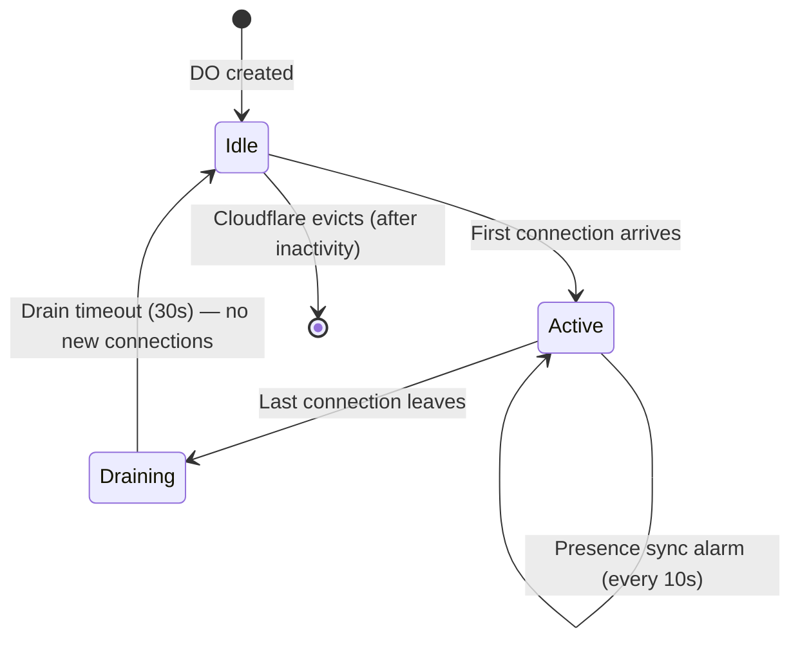

### Alarm Schedule

| Alarm | Interval | Purpose |
|-------|----------|---------|
| Heartbeat check | 30 seconds | Detect dead connections (no ping in 60s → close) |
| Presence sync | 10 seconds | Write presence snapshot to KV for REST API reads |
| Idle cleanup | 5 minutes | Clear empty channels, compact state |
| Metrics flush | 60 seconds | Write connection count + message throughput to Analytics Engine |

---

## Channel System

### Channel Types

| Channel Pattern | Purpose | Auto-subscribe | Auth Required |
|----------------|---------|----------------|---------------|
| `hackathon:{slug}` | Global hackathon events (phase changes, announcements) | Yes (on connect) | Authenticated |
| `hackathon:{slug}:activity` | Activity feed (commits, PRs, submissions) | No | Authenticated |
| `hackathon:{slug}:leaderboard` | Score updates, ranking changes | No | Authenticated |
| `hackathon:{slug}:announcements` | Organizer announcements | No | Authenticated |
| `hackathon:{slug}:team:{teamId}` | Team-specific events (members, chat) | No | Team member |
| `hackathon:{slug}:judging` | Judging progress, assignment updates | No | Judge+ role |
| `hackathon:{slug}:admin` | Admin events (audit, system alerts) | No | Admin+ role |
| `user:{userId}:notifications` | Personal notifications | Yes (on connect) | Self only |

### Channel Authorization

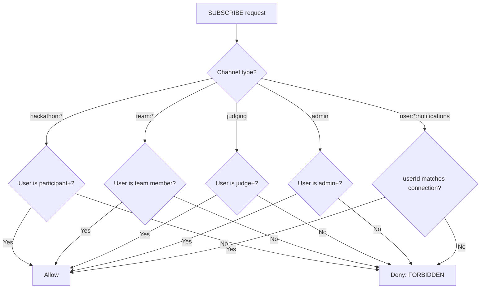

### Channel Lifecycle

```typescript
interface ChannelOperations {
  // Subscribe to a channel
  subscribe(connectionId: string, channel: string): SubscribeResult;
  
  // Unsubscribe from a channel
  unsubscribe(connectionId: string, channel: string): void;
  
  // Publish to a channel (server-side only)
  publish(channel: string, event: ChannelEvent): PublishResult;
  
  // Get subscriber count for a channel
  subscriberCount(channel: string): number;
  
  // Get all channels a connection is subscribed to
  connectionChannels(connectionId: string): string[];
}

interface SubscribeResult {
  success: boolean;
  channel: string;
  subscriberCount: number;
  // Last N events for catch-up (sent immediately after subscribe)
  recentEvents: ChannelEvent[];
  // Sequence number of latest event (for gap detection)
  lastSequence: number;
}

interface PublishResult {
  channel: string;
  sequence: number;      // Assigned sequence number
  recipientCount: number; // How many connections received it
  timestamp: string;
}
```

### Channel Catch-up

When a client subscribes to a channel (or reconnects), it receives the last N events to catch up:

| Channel Type | Catch-up Events | Max Age |
|-------------|----------------|---------|
| `hackathon:*` | Last 10 | 1 hour |
| `activity` | Last 25 | 30 minutes |
| `leaderboard` | Last 5 | 15 minutes |
| `announcements` | Last 5 | 24 hours |
| `team:*` | Last 20 | 1 hour |
| `judging` | Last 10 | 30 minutes |
| `notifications` | Last 20 | 24 hours |

---

## Presence Tracking

### Presence States

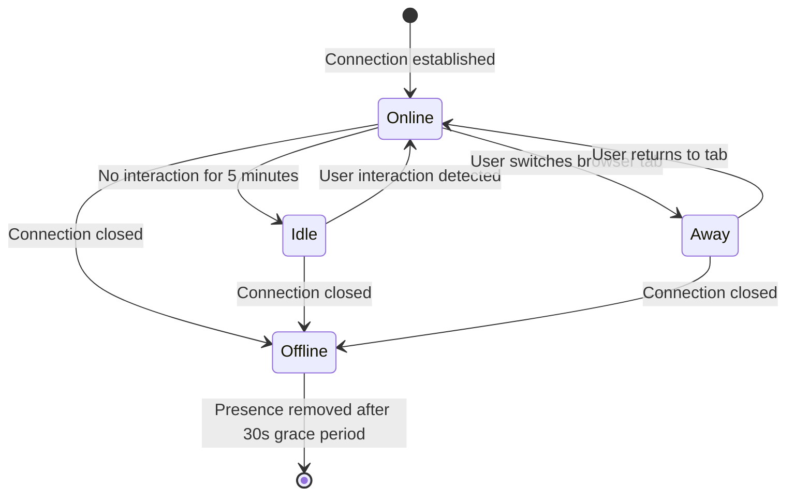

### Presence Protocol

```typescript
// Client sends presence updates
interface PresenceUpdate {
  type: 'PRESENCE';
  status: 'online' | 'idle' | 'away';
  activeChannel?: string;  // Which channel the user is currently viewing
}

// Server broadcasts presence changes
interface PresenceBroadcast {
  type: 'PRESENCE_CHANGE';
  channel: string;
  users: PresenceUser[];  // Full presence list for the channel
  changed: {
    userId: string;
    action: 'joined' | 'left' | 'updated';
    status: 'online' | 'idle' | 'away' | 'offline';
  };
}

interface PresenceUser {
  userId: string;
  username: string;
  avatarUrl: string;
  status: 'online' | 'idle' | 'away';
  role: string;
  activeChannel: string | null;
}
```

### Multi-Tab Presence

A user may have multiple tabs/devices connected. Presence rules:

| Scenario | Displayed Status |
|----------|-----------------|
| Tab 1: online, Tab 2: idle | `online` (highest wins) |
| Tab 1: away, Tab 2: away | `away` |
| Tab 1: online, Tab 2: closed | `online` |
| All tabs closed | `offline` (after 30s grace period) |

The 30-second grace period prevents flicker when a user closes one tab and opens another, or when refreshing the page.

### Presence KV Snapshots

The Gateway DO writes a presence snapshot to KV every 10 seconds:

```typescript
// KV key: presence:{hackathonId}
// KV value: JSON array of PresenceUser
// TTL: 30 seconds (auto-expire if DO stops writing)

interface PresenceSnapshot {
  hackathonId: string;
  timestamp: string;
  onlineCount: number;
  users: PresenceUser[];
}
```

This allows the REST API to serve presence data without hitting the DO:

```
GET /api/v1/hackathons/:slug/presence
→ Read from KV (fast, globally replicated)
```

---

## Message Protocol

All WebSocket messages use JSON with a consistent envelope:

### Client → Server Messages

```typescript
type ClientMessage =
  | { type: 'PING' }
  | { type: 'SUBSCRIBE'; channel: string; lastSequence?: number }
  | { type: 'UNSUBSCRIBE'; channel: string }
  | { type: 'PRESENCE'; status: 'online' | 'idle' | 'away'; activeChannel?: string }
  | { type: 'ACK'; messageId: string };
```

### Server → Client Messages

```typescript
type ServerMessage =
  | { type: 'CONNECTED'; connectionId: string; serverTime: string }
  | { type: 'PONG'; serverTime: string }
  | { type: 'SUBSCRIBED'; channel: string; subscriberCount: number; catchup: ChannelEvent[] }
  | { type: 'UNSUBSCRIBED'; channel: string }
  | { type: 'EVENT'; id: string; channel: string; sequence: number; event: ChannelEvent; timestamp: string }
  | { type: 'PRESENCE_CHANGE'; channel: string; users: PresenceUser[]; changed: PresenceChange }
  | { type: 'ERROR'; code: string; message: string; details?: Record<string, unknown> }
  | { type: 'RECONNECT'; reason: string };
```

### Channel Event Types

```typescript
type ChannelEvent =
  // Hackathon lifecycle
  | { kind: 'hackathon.phase_changed'; fromPhase: string; toPhase: string; triggeredBy: string }
  | { kind: 'hackathon.settings_updated'; fields: string[] }
  | { kind: 'hackathon.deadline_warning'; deadline: string; minutesRemaining: number }
  
  // Activity feed
  | { kind: 'activity.commit'; teamId: string; teamName: string; repo: string; branch: string; message: string; author: string }
  | { kind: 'activity.pull_request'; teamId: string; teamName: string; repo: string; action: 'opened' | 'merged' | 'closed'; title: string }
  | { kind: 'activity.submission'; teamId: string; teamName: string; tag: string; status: 'submitted' | 'validated' | 'rejected' }
  | { kind: 'activity.team_formed'; teamId: string; teamName: string; memberCount: number }
  
  // Announcements
  | { kind: 'announcement.created'; id: string; title: string; priority: 'info' | 'warning' | 'urgent'; authorName: string }
  | { kind: 'announcement.updated'; id: string; title: string }
  | { kind: 'announcement.pinned'; id: string; title: string }
  
  // Judging
  | { kind: 'judging.round_started'; round: number; totalRounds: number }
  | { kind: 'judging.round_completed'; round: number }
  | { kind: 'judging.score_submitted'; submissionId: string; judgeCount: number; totalJudges: number }
  | { kind: 'judging.leaderboard_updated'; topN: Array<{ teamName: string; score: number; rank: number }> }
  | { kind: 'judging.audience_vote_updated'; submissionId: string; voteCount: number }
  
  // Team events
  | { kind: 'team.member_joined'; userId: string; username: string }
  | { kind: 'team.member_left'; userId: string; username: string }
  | { kind: 'team.chat_message'; userId: string; username: string; message: string; timestamp: string }
  | { kind: 'team.repo_linked'; repo: string; provider: 'github' | 'gitlab' }
  
  // Notifications (personal channel only)
  | { kind: 'notification.new'; id: string; type: string; title: string; body: string }
  | { kind: 'notification.badge_update'; unreadCount: number };
```

### Message Sequencing

Each channel maintains a monotonically increasing sequence counter. Clients track the last received sequence per channel. On reconnect, the client sends `lastSequence` in the `SUBSCRIBE` message, and the server replays any missed events.

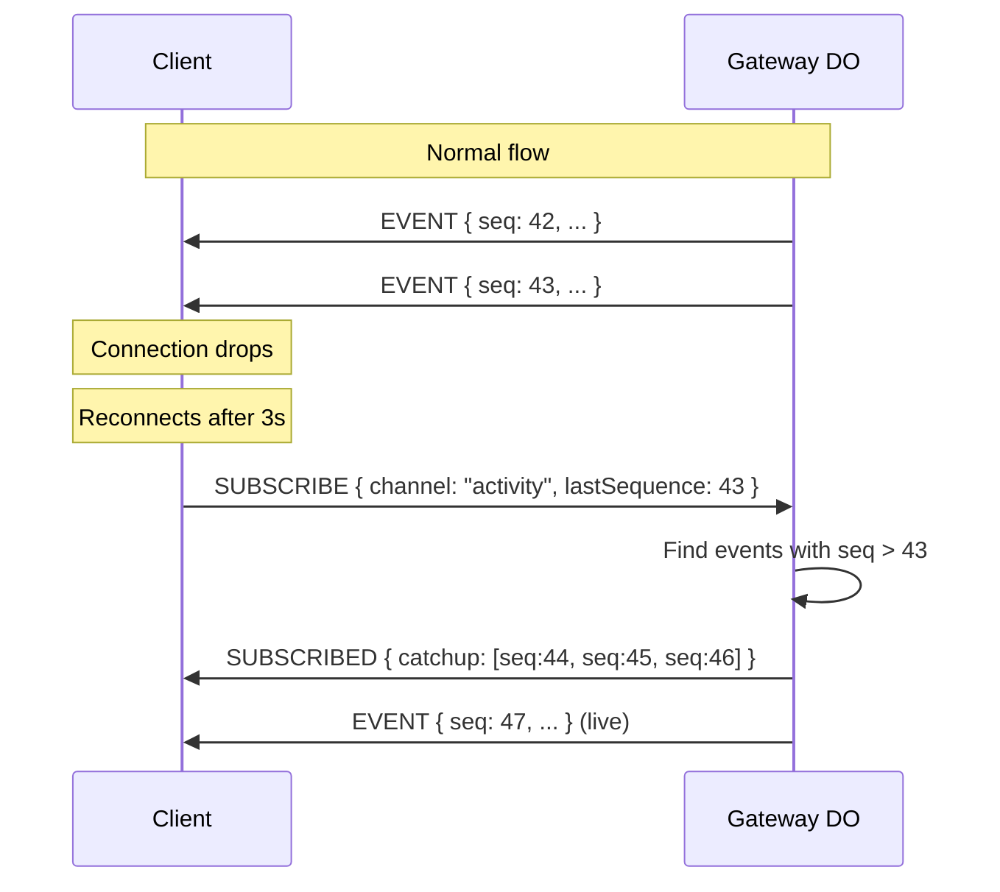

### Gap Detection

If the client detects a gap in sequence numbers (e.g., received 42, then 45):

1. Client sends `SUBSCRIBE` with `lastSequence: 42`
2. Server replays events 43, 44, 45 from the in-memory buffer
3. If events are no longer in buffer (too old), server sends `RECONNECT` with `reason: "gap_too_large"`
4. Client does a full page data refresh via REST API

---

## Server-Sent Events Fallback

For clients where WebSocket is blocked (corporate firewalls, some proxies):

### SSE Endpoint

```
GET /api/v1/hackathons/:slug/events/stream
Accept: text/event-stream
Cookie: (auth cookies)
Query params:
  channels=activity,leaderboard   (comma-separated)
  lastEventId=evt_abc123          (for reconnection)
```

### SSE vs WebSocket Feature Comparison

| Feature | WebSocket | SSE |
|---------|-----------|-----|
| Live events | ✅ | ✅ |
| Channel subscriptions | ✅ Dynamic | ⚠️ Fixed at connection time (via query params) |
| Presence tracking | ✅ Bidirectional | ❌ No presence (server cannot receive client status) |
| Team chat | ✅ | ❌ (use REST API for sending) |
| Reconnection | Custom with sequence | Built-in via `Last-Event-ID` header |
| Binary data | ✅ | ❌ Text only |
| Latency | Lower (persistent) | Slightly higher (HTTP overhead) |

### SSE Message Format

```
event: hackathon.phase_changed
id: evt_abc123
data: {"fromPhase":"ACTIVE","toPhase":"JUDGING","triggeredBy":"admin"}

event: activity.commit
id: evt_abc124
data: {"teamId":"t1","teamName":"Team Alpha","repo":"org/repo","message":"fix auth bug"}

event: heartbeat
data: {"serverTime":"2026-01-15T10:30:00Z"}
```

### Fallback Detection

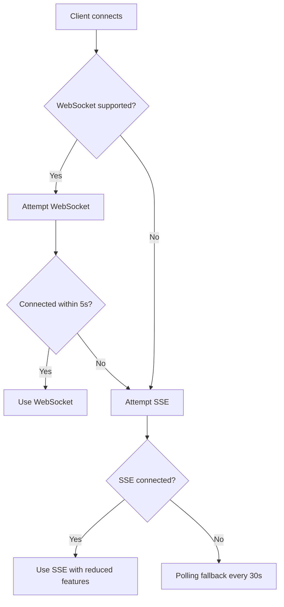

---

## Client SDK

### Installation & Usage

```typescript
import { DevsageRealtime } from '@devsage/realtime-client';

const realtime = new DevsageRealtime({
  hackathonSlug: 'summer-hack-2026',
  // Connection options
  reconnect: true,
  maxReconnectAttempts: 10,
  reconnectBackoff: 'exponential',  // 1s, 2s, 4s, 8s... max 30s
  heartbeatInterval: 30_000,        // 30s ping interval
  // Fallback
  enableSSEFallback: true,
  // Debug
  debug: false,
});
```

### SDK API

```typescript
interface DevsageRealtime {
  // Connection
  connect(): Promise<void>;
  disconnect(): void;
  getConnectionStatus(): ConnectionStatus;
  onStatusChange(handler: (status: ConnectionStatus) => void): () => void;

  // Channels
  subscribe(channel: string, handler: (event: ChannelEvent) => void): Subscription;
  unsubscribe(channel: string): void;

  // Presence
  setPresence(status: 'online' | 'idle' | 'away', activeChannel?: string): void;
  getPresence(channel: string): PresenceUser[];
  onPresenceChange(channel: string, handler: (users: PresenceUser[]) => void): () => void;

  // Lifecycle
  destroy(): void;  // Clean up all subscriptions and connections
}

interface Subscription {
  channel: string;
  unsubscribe: () => void;
  // Filter events within the subscription
  on(eventKind: string, handler: (event: ChannelEvent) => void): () => void;
}

type ConnectionStatus = 
  | { state: 'disconnected' }
  | { state: 'connecting'; attempt: number }
  | { state: 'connected'; connectionId: string; transport: 'websocket' | 'sse' }
  | { state: 'reconnecting'; attempt: number; nextAttemptIn: number };
```

### React Hooks

```typescript
// Connection status hook
function useRealtimeStatus(): ConnectionStatus;

// Subscribe to channel events
function useChannel(
  channel: string,
  handler: (event: ChannelEvent) => void,
  options?: { enabled?: boolean }
): void;

// Get presence for a channel
function usePresence(channel: string): {
  users: PresenceUser[];
  onlineCount: number;
  isLoading: boolean;
};

// Subscribe to specific event type
function useChannelEvent<K extends ChannelEvent['kind']>(
  channel: string,
  eventKind: K,
  handler: (event: Extract<ChannelEvent, { kind: K }>) => void,
): void;

// Auto-invalidate TanStack Query on real-time events
function useRealtimeQuery<T>(
  queryKey: readonly unknown[],
  queryFn: () => Promise<T>,
  options: {
    channel: string;
    eventKinds: string[];  // Which events invalidate this query
  }
): UseQueryResult<T>;
```

### Usage Examples

```typescript
// Activity feed with real-time updates
function ActivityFeed({ hackathonSlug }: { hackathonSlug: string }) {
  const channel = `hackathon:${hackathonSlug}:activity`;
  
  // Auto-refetch when new activity events arrive
  const { data: activities } = useRealtimeQuery(
    queryKeys.hackathons.activity(hackathonSlug),
    () => api.getActivity(hackathonSlug),
    { channel, eventKinds: ['activity.commit', 'activity.pull_request', 'activity.submission'] }
  );

  // Show presence
  const { users, onlineCount } = usePresence(channel);

  return (
    <div>
      <span>{onlineCount} online</span>
      <AvatarStack users={users} />
      <ActivityList activities={activities} />
    </div>
  );
}

// Leaderboard with live score updates
function Leaderboard({ hackathonSlug }: { hackathonSlug: string }) {
  const channel = `hackathon:${hackathonSlug}:leaderboard`;

  useChannelEvent(channel, 'judging.leaderboard_updated', (event) => {
    // Animate rank changes
    animateRankTransitions(event.topN);
  });

  const { data } = useRealtimeQuery(
    queryKeys.judging.leaderboard(hackathonSlug),
    () => api.getLeaderboard(hackathonSlug),
    { channel, eventKinds: ['judging.leaderboard_updated'] }
  );

  return <LeaderboardTable data={data} />;
}
```

---

## Event Routing

### Internal Event Flow

When a server-side action occurs (e.g., submission created), the event must be routed to the correct Gateway DO:

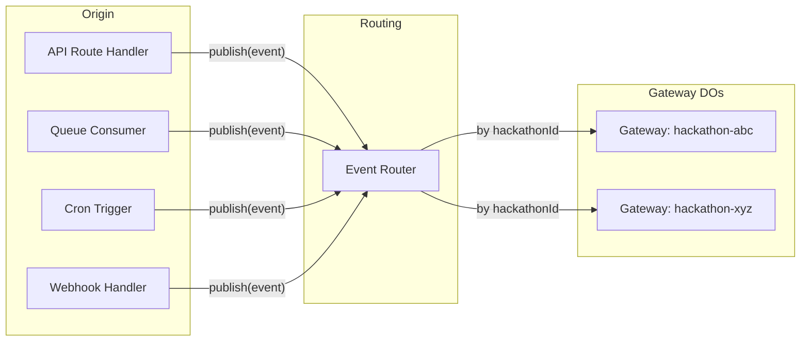

### Event Router

```typescript
interface EventRouter {
  // Publish an event to a specific hackathon's gateway
  publish(hackathonId: string, channel: string, event: ChannelEvent): Promise<PublishResult>;
  
  // Publish to multiple hackathons (e.g., platform-wide announcement)
  broadcast(hackathonIds: string[], channel: string, event: ChannelEvent): Promise<PublishResult[]>;
  
  // Publish to a user's personal notification channel
  notify(userId: string, event: ChannelEvent): Promise<PublishResult>;
}
```

### Event Sources

| Source | Events Generated | Target Channel |
|--------|-----------------|----------------|
| Webhook handler (GitHub push) | `activity.commit` | `hackathon:{slug}:activity` |
| Webhook handler (GitHub PR) | `activity.pull_request` | `hackathon:{slug}:activity` |
| Submission route | `activity.submission` | `hackathon:{slug}:activity` |
| Team route (join) | `team.member_joined` | `hackathon:{slug}:team:{teamId}` |
| Judging route (score) | `judging.score_submitted` | `hackathon:{slug}:judging` |
| Hackathon state machine | `hackathon.phase_changed` | `hackathon:{slug}` |
| Cron (deadline check) | `hackathon.deadline_warning` | `hackathon:{slug}` |
| Announcement route | `announcement.created` | `hackathon:{slug}:announcements` |
| Notification queue | `notification.new` | `user:{userId}:notifications` |

---

## Scaling & Topology

### Single-DO-per-Hackathon Model

Each hackathon gets exactly one Gateway DO. This is the simplest model and works for the target scale:

| Metric | Limit | Rationale |
|--------|-------|-----------|
| Connections per DO | ~10,000 | Durable Objects support up to ~100K concurrent WebSockets |
| Memory per DO | 128 MB | 10K connections × 2KB = 20MB (well within limit) |
| Messages per second | ~5,000 | Fan-out throughput of a single DO |
| Channels per DO | ~100 | One per team + global channels |

### When to Shard

If a hackathon exceeds 10,000 concurrent connections, shard by channel prefix:

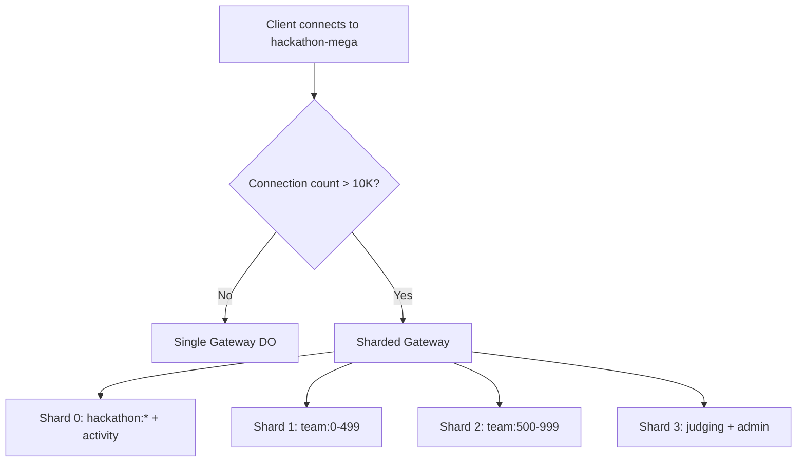

Sharding is a future optimization. The initial implementation uses single-DO-per-hackathon.

### Cross-DO Communication

For platform-wide events (e.g., maintenance notice), the API Worker iterates over active hackathon Gateway DOs:

```typescript
// Platform broadcast pattern
async function platformBroadcast(env: Env, event: ChannelEvent): Promise<void> {
  // Get active hackathon IDs from D1
  const activeHackathons = await getActiveHackathonIds(env.DB);
  
  // Fan out to each DO (parallel, fire-and-forget)
  await Promise.allSettled(
    activeHackathons.map(id => {
      const doId = env.GATEWAY.idFromName(id);
      const stub = env.GATEWAY.get(doId);
      return stub.fetch(new Request('http://internal/publish', {
        method: 'POST',
        body: JSON.stringify({ channel: `hackathon:${id}`, event }),
      }));
    })
  );
}
```

---

## Authentication & Authorization

### WebSocket Authentication

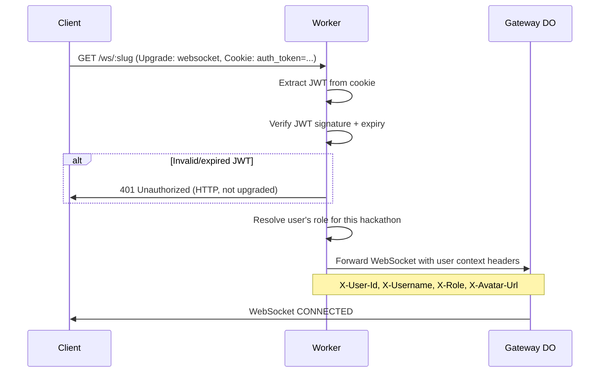

### Per-Channel Authorization

Authorization is checked on every `SUBSCRIBE` request:

| Channel Pattern | Required Role | Check Method |
|----------------|---------------|--------------|
| `hackathon:{slug}` | `participant+` | Role from connection context |
| `hackathon:{slug}:activity` | `participant+` | Role from connection context |
| `hackathon:{slug}:leaderboard` | `participant+` | Role from connection context |
| `hackathon:{slug}:announcements` | `participant+` | Role from connection context |
| `hackathon:{slug}:team:{teamId}` | Team member | Check team membership via D1 |
| `hackathon:{slug}:judging` | `judge+` | Role from connection context |
| `hackathon:{slug}:admin` | `admin+` | Role from connection context |
| `user:{userId}:notifications` | Self only | userId must match connection userId |

### Token Refresh During Long Connections

JWTs have a 7-day expiry. For connections lasting longer than the access token lifetime:

1. Gateway DO tracks token expiry per connection
2. 5 minutes before expiry, Gateway sends `RECONNECT` with `reason: "token_expiring"`
3. Client gracefully disconnects, refreshes token via REST API, reconnects
4. Catch-up mechanism ensures no events are missed during the brief reconnection

---

## Rate Limiting & Abuse Prevention

### Client Rate Limits

| Action | Limit | Window | Enforcement |
|--------|-------|--------|-------------|
| Messages sent (total) | 60 | Per minute | Per connection |
| Subscribe requests | 10 | Per minute | Per connection |
| Presence updates | 6 | Per minute | Per connection |
| Chat messages (team channel) | 30 | Per minute | Per user |

### Enforcement

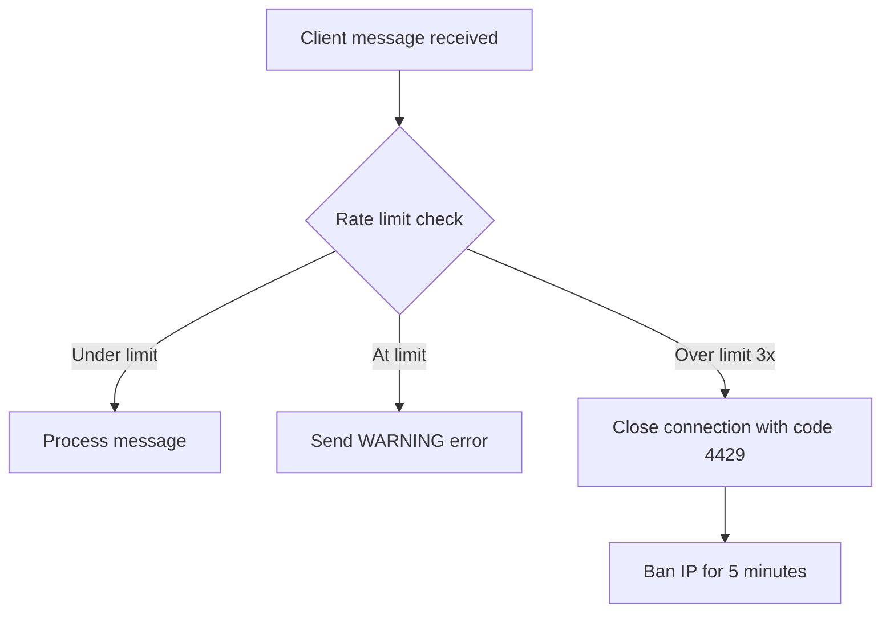

### Abuse Patterns

| Pattern | Detection | Response |
|---------|-----------|----------|
| Connection flooding | > 5 connections per user per hackathon | Reject with 429, keep oldest connections |
| Message flooding | > 60 messages/minute | Warning → disconnect → temporary ban |
| Subscribe spam | Rapid subscribe/unsubscribe cycling | After 10 cycles in 1 minute, disconnect |
| Oversized messages | Message > 4 KB | Reject message, send error |
| Invalid JSON | Unparseable message | 3 consecutive invalid → disconnect |

---

## Reconnection & Reliability

### Client Reconnection Strategy

```mermaid
flowchart TD
    A[Connection lost] --> B[Wait backoff period]
    B --> C{Attempt reconnect}
    C -->|Success| D[Send SUBSCRIBE with lastSequence for each channel]
    C -->|Failure| E{Attempts < 10?}
    E -->|Yes| F[Increase backoff: min(2^attempt × 1000, 30000)]
    F --> B
    E -->|No| G{SSE fallback enabled?}
    G -->|Yes| H[Switch to SSE]
    G -->|No| I[Give up, show "Disconnected" UI]
    
    D --> J[Receive catch-up events]
    J --> K[Resume normal operation]
```

### Backoff Schedule

| Attempt | Delay | Cumulative |
|---------|-------|------------|
| 1 | 1s | 1s |
| 2 | 2s | 3s |
| 3 | 4s | 7s |
| 4 | 8s | 15s |
| 5 | 16s | 31s |
| 6-10 | 30s (capped) | 31s + N×30s |

### Jitter

Each backoff delay includes ±20% random jitter to prevent thundering herd when many clients reconnect simultaneously (e.g., after a server restart).

### Message Delivery Guarantees

| Guarantee Level | Mechanism |
|----------------|-----------|
| At-least-once for critical events | Server assigns message ID, client ACKs. Unacked messages resent on reconnect |
| Ordered within channel | Monotonic sequence numbers per channel |
| Gap detection | Client compares received sequence vs expected. Gap → request catch-up |
| Catch-up on reconnect | Client sends `lastSequence`, server replays missed events from buffer |
| Buffer overflow | If missed events exceed buffer (1000 events), server sends `RECONNECT` → client does full REST refresh |

### Critical Events (require ACK)

Only a subset of events require explicit acknowledgment:

| Event | Why Critical |
|-------|-------------|
| `hackathon.phase_changed` | UI must reflect current phase |
| `hackathon.deadline_warning` | Users must see deadline approaching |
| `announcement.created` (urgent priority) | Organizer expects all participants to see it |
| `judging.round_started` | Judges must know to begin scoring |

Non-critical events (activity feed items, presence changes) are fire-and-forget.

---

## API Endpoints

### WebSocket Endpoint

| Method | Path | Auth | Description |
|--------|------|------|-------------|
| GET | `/ws/:hackathonSlug` | JWT cookie | Upgrade to WebSocket connection |

### SSE Endpoint

| Method | Path | Auth | Description |
|--------|------|------|-------------|
| GET | `/api/v1/hackathons/:slug/events/stream` | JWT cookie | SSE event stream |

### REST Endpoints (for SSE clients and initial data)

| Method | Path | Auth | Min Role | Description |
|--------|------|------|----------|-------------|
| GET | `/api/v1/hackathons/:slug/presence` | JWT | participant | Get current online users (from KV) |
| GET | `/api/v1/hackathons/:slug/presence/count` | JWT | participant | Get online user count only |
| GET | `/api/v1/hackathons/:slug/activity` | JWT | participant | Get recent activity events (paginated) |
| POST | `/api/v1/hackathons/:slug/teams/:teamId/chat` | JWT | team member | Send team chat message (for SSE clients) |
| GET | `/api/v1/hackathons/:slug/teams/:teamId/chat` | JWT | team member | Get team chat history (paginated) |

---

## Edge Cases

| Scenario | Behavior |
|----------|----------|
| User opens 10 tabs to same hackathon | All 10 get WebSocket connections. Presence deduplicates to 1 user. Connection limit: 5 per user per hackathon (oldest kept) |
| WebSocket blocked by corporate firewall | Client detects failure within 5s, falls back to SSE automatically |
| Gateway DO evicted during active connections | All connections close. Clients reconnect. DO re-initializes from clean state. Catch-up from D1 event log |
| 500 users subscribe to same channel simultaneously | Fan-out is sequential per DO but fast (~5000 msg/s). Max delay: ~100ms for last recipient |
| User's role changes while connected | Gateway DO receives role update event, updates connection context, checks channel authorization — may disconnect from restricted channels |
| Hackathon transitions to ARCHIVED | Gateway DO sends `hackathon.phase_changed`, waits 60s, then closes all connections with `RECONNECT: archived` |
| Client sends malformed JSON | Error response sent. After 3 consecutive parse failures, connection closed |
| Server deploys during active connections | Durable Object migration: existing connections maintained. New connections may briefly fail (< 5s) |
| Internet drops for 5 minutes then returns | Client reconnects with exponential backoff. On success, catches up via `lastSequence`. If gap too large, full REST refresh |
| Event buffer overflow (> 1000 events/channel) | Oldest events evicted. Late reconnectors who missed evicted events get `RECONNECT` instruction |
| User tries to subscribe to another user's notification channel | Authorization check fails → `FORBIDDEN` error response |
| Clock skew between client and server | All timestamps are server-generated. Client uses `serverTime` from `CONNECTED` message to calculate offset |
| DO hits 128MB memory limit | Unlikely at target scale (10K connections × 2KB = 20MB). If approached, emergency eviction of idle connections |

---

## Error Codes

| Code | HTTP/WS Status | Condition |
|------|---------------|-----------|
| `WS_AUTH_REQUIRED` | 401 (HTTP) | No valid JWT cookie on WebSocket upgrade |
| `WS_AUTH_EXPIRED` | 401 (HTTP) | JWT expired before WebSocket upgrade |
| `WS_HACKATHON_NOT_FOUND` | 404 (HTTP) | Hackathon slug doesn't exist |
| `WS_HACKATHON_ARCHIVED` | 410 (HTTP) | Hackathon is archived, no real-time available |
| `WS_CONNECTION_LIMIT` | 429 (HTTP) | User exceeded max connections per hackathon |
| `WS_RATE_LIMITED` | 4429 (WS close) | Client exceeded message rate limit |
| `CHANNEL_NOT_FOUND` | — (WS error msg) | Subscribe to non-existent channel pattern |
| `CHANNEL_FORBIDDEN` | — (WS error msg) | Insufficient role for channel |
| `MESSAGE_TOO_LARGE` | — (WS error msg) | Message exceeds 4 KB limit |
| `INVALID_MESSAGE` | — (WS error msg) | JSON parse failed or missing required fields |
| `SEQUENCE_GAP_TOO_LARGE` | — (WS error msg) | Requested catch-up exceeds buffer, full refresh needed |
| `SSE_AUTH_REQUIRED` | 401 | No valid JWT cookie on SSE request |
| `SSE_INVALID_CHANNELS` | 400 | Invalid channel names in query parameter |

---

## Database Tables

### realtime_events

Persistent log of all real-time events for catch-up and audit.

| Column | Type | Constraints | Description |
|--------|------|-------------|-------------|
| `id` | TEXT | PRIMARY KEY | Event ID (`evt_` prefix + UUID) |
| `hackathon_id` | TEXT | NOT NULL, FK → hackathons.id | Which hackathon this event belongs to |
| `channel` | TEXT | NOT NULL | Channel the event was published to |
| `sequence` | INTEGER | NOT NULL | Monotonic sequence within channel |
| `kind` | TEXT | NOT NULL | Event kind (e.g., `activity.commit`) |
| `payload` | TEXT | NOT NULL | JSON-encoded event data |
| `actor_id` | TEXT | NULL | User who triggered the event (null for system events) |
| `created_at` | TEXT | NOT NULL, DEFAULT CURRENT_TIMESTAMP | ISO-8601 timestamp |
| `expires_at` | TEXT | NOT NULL | When this event can be garbage collected |

**Indexes:**
- `idx_rt_events_channel_seq` → `(hackathon_id, channel, sequence)` — catch-up queries
- `idx_rt_events_created` → `(created_at)` — garbage collection
- `idx_rt_events_expires` → `(expires_at)` — TTL cleanup

**Retention:** Events older than 24 hours are deleted by the hourly cron job.

### realtime_connections (DO SQLite — not D1)

Stored in the Gateway DO's embedded SQLite for fast local access.

| Column | Type | Constraints | Description |
|--------|------|-------------|-------------|
| `connection_id` | TEXT | PRIMARY KEY | Unique connection identifier |
| `user_id` | TEXT | NOT NULL | Authenticated user ID |
| `username` | TEXT | NOT NULL | Display name |
| `avatar_url` | TEXT | NOT NULL | User avatar |
| `role` | TEXT | NOT NULL | User's hackathon role |
| `channels` | TEXT | NOT NULL | JSON array of subscribed channels |
| `connected_at` | TEXT | NOT NULL | Connection start time |
| `last_ping_at` | TEXT | NOT NULL | Last heartbeat timestamp |

### team_chat_messages

Persistent storage for team chat (messages also delivered in real-time but stored for history).

| Column | Type | Constraints | Description |
|--------|------|-------------|-------------|
| `id` | TEXT | PRIMARY KEY | Message ID (`msg_` prefix + UUID) |
| `hackathon_id` | TEXT | NOT NULL, FK → hackathons.id | Hackathon context |
| `team_id` | TEXT | NOT NULL, FK → teams.id | Team the message belongs to |
| `user_id` | TEXT | NOT NULL, FK → users.id | Message author |
| `content` | TEXT | NOT NULL | Message text (max 2000 chars) |
| `reply_to_id` | TEXT | NULL, FK → team_chat_messages.id | Thread reply reference |
| `edited_at` | TEXT | NULL | Last edit timestamp |
| `deleted_at` | TEXT | NULL | Soft delete timestamp |
| `created_at` | TEXT | NOT NULL, DEFAULT CURRENT_TIMESTAMP | Send time |

**Indexes:**
- `idx_chat_team_created` → `(hackathon_id, team_id, created_at)` — chat history pagination
- `idx_chat_user` → `(user_id)` — user's message history

---

## Decision Log

| Decision | Choice | Why | Alternatives Considered |
|----------|--------|-----|------------------------|
| One DO per hackathon | Single Gateway DO | Natural isolation, simple routing, well within DO limits for target scale (10K connections) | Shared DO pool (complex routing), One DO per channel (too many DOs) |
| WebSocket as primary transport | WebSocket over HTTP/1.1 Upgrade | Bidirectional (needed for presence + chat), low overhead, native browser support | SSE only (no bidirectional), WebTransport (too new, limited support) |
| SSE as fallback | Server-Sent Events | Built-in browser reconnection, works through HTTP proxies, covers all read-only use cases | Long polling (wasteful, complex), No fallback (bad UX for blocked users) |
| Presence in KV | KV snapshots every 10s | REST API can serve presence without hitting DO. KV is globally replicated. 10s staleness is acceptable | D1 (too slow for presence reads), DO-only (REST API can't access) |
| JSON message protocol | JSON over WebSocket text frames | Human-readable, easy to debug, matches REST API format, negligible size overhead for our message sizes | Protocol Buffers (over-engineered for hackathon scale), MessagePack (less debuggable) |
| Channel-based pub/sub | Named channels with subscribe/unsubscribe | Natural mapping to hackathon entities (teams, judging, activity). Clients subscribe only to what they need | Topic-based (same thing, different name), Room-based (less granular) |
| Sequence numbers per channel | Monotonic integer counter | Simple gap detection, efficient catch-up queries, ordered replay | Vector clocks (overkill), Timestamps (not monotonic, clock skew) |
| 1000-event buffer per channel | In-memory ring buffer | Covers most reconnection scenarios. Beyond buffer → full REST refresh. Memory: ~1000 × 500B = 500KB per channel | Unlimited buffer (memory risk), External store (latency) |
| ACK only for critical events | Selective acknowledgment | Most events are informational (activity feed). Only phase changes and urgent announcements need guaranteed delivery | ACK all (overhead), ACK none (risk missing critical) |
| Client SDK as separate package | `@devsage/realtime-client` | Reusable across web + potential mobile. Clean API surface. Testable in isolation | Inline in web app (not reusable), Third-party SDK (vendor lock) |
| Heartbeat every 30s | Client PING / Server PONG | Detect dead connections within 60s (2 missed heartbeats). Low overhead. Cloudflare doesn't kill idle WebSockets within 30s | 10s (too chatty), 60s (too slow to detect dead connections) |
| Max 5 connections per user | Per-hackathon limit | Prevent resource abuse while allowing multi-tab usage. Most users have 1-2 tabs | No limit (resource abuse), 1 per user (breaks multi-tab), 10 (too generous) |
