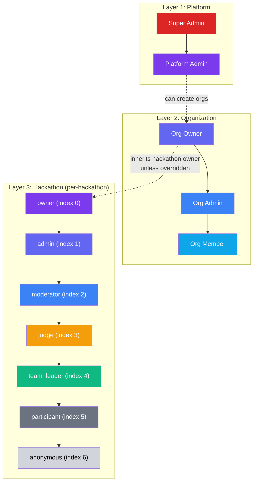
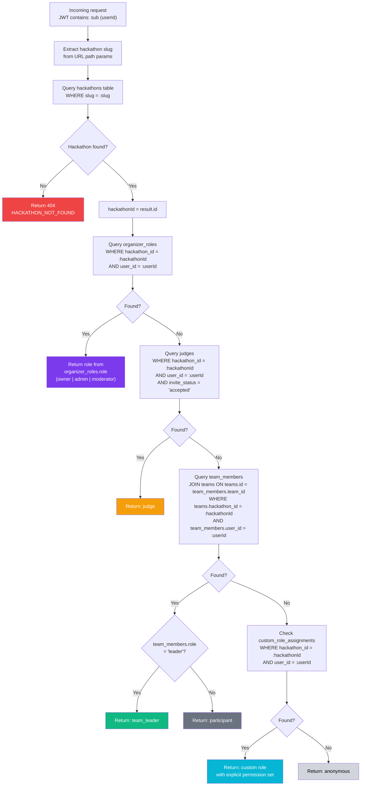
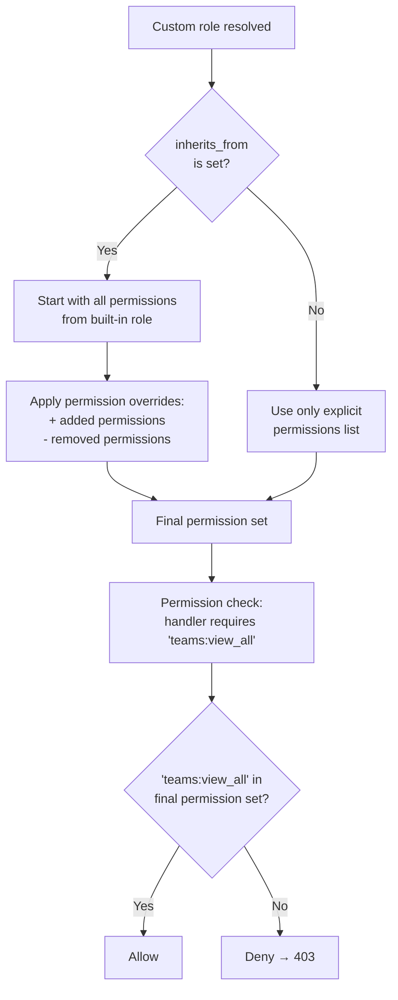
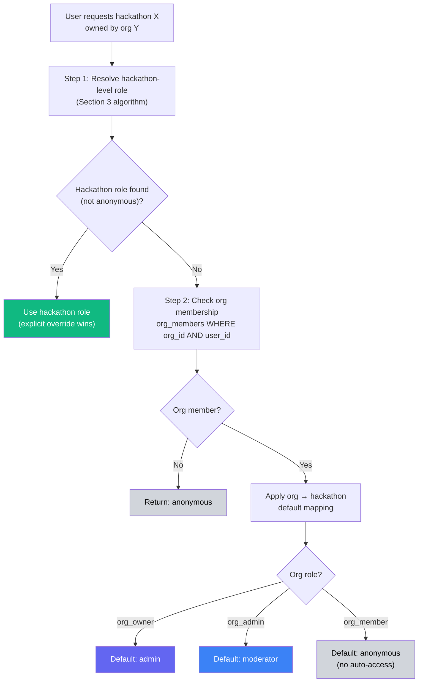
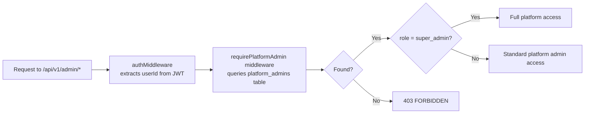
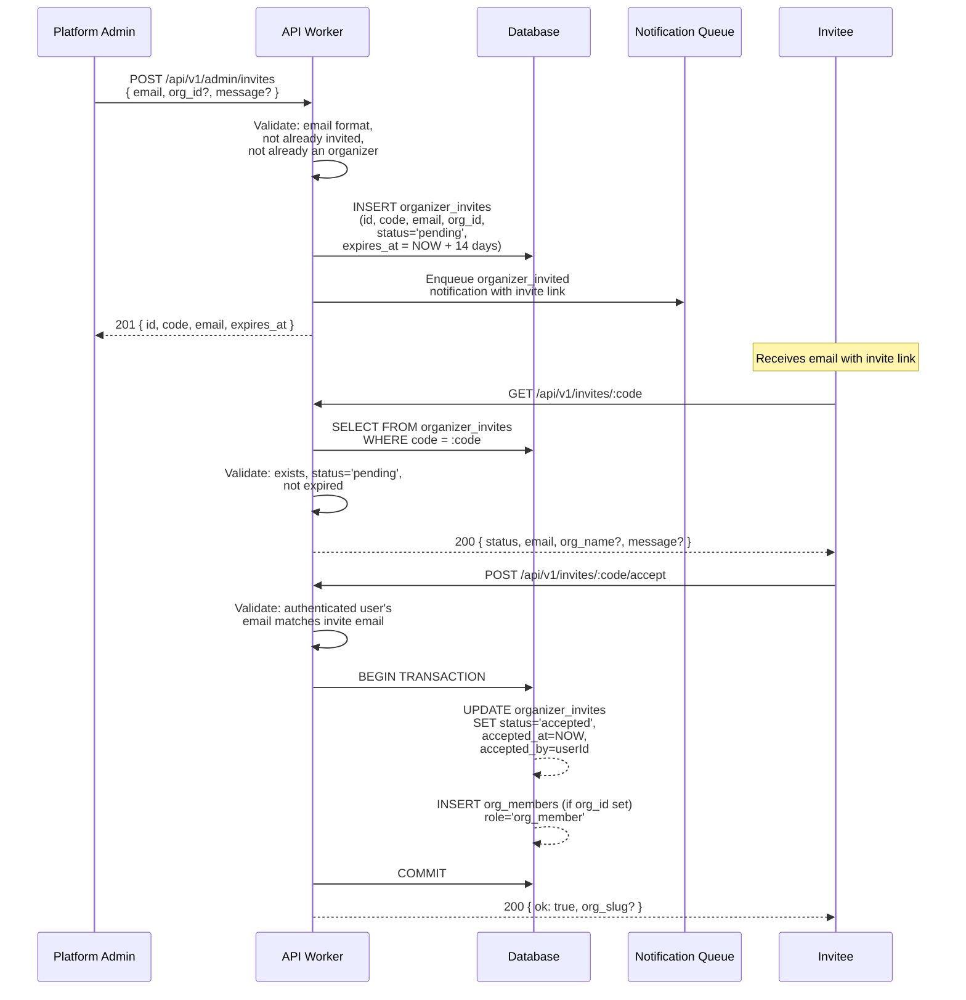
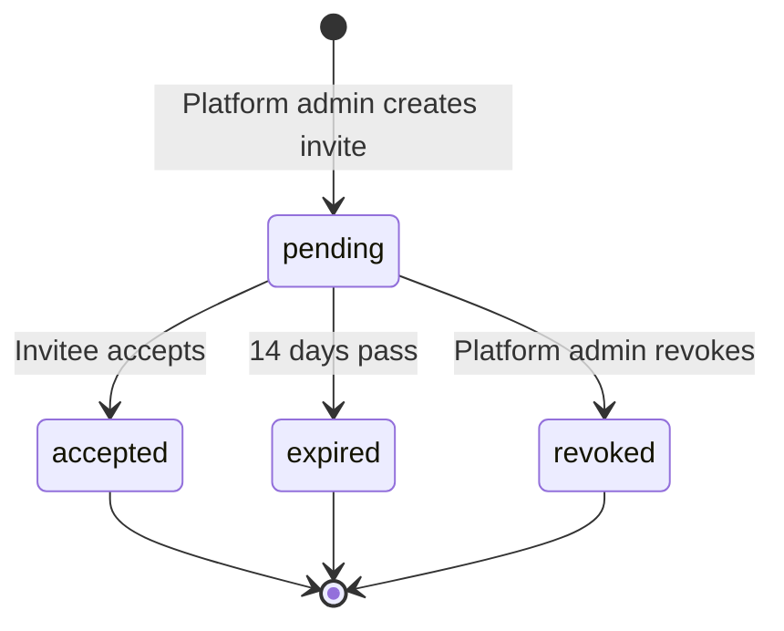
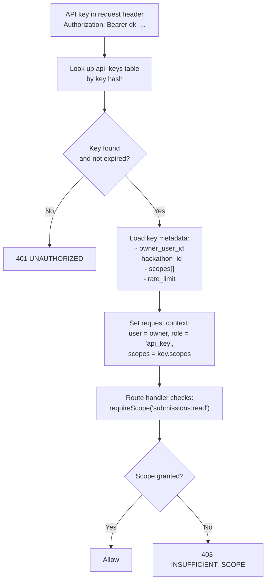
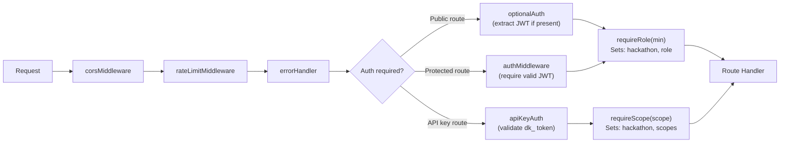
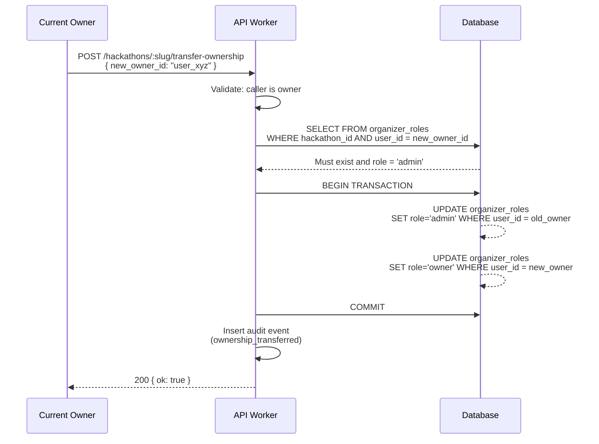

# Roles & Permissions

> Layered authorization system with per-hackathon role resolution, organization-level hierarchy, custom roles, fine-grained permission grants, and API key scoping — all resolved per-request from database state, never cached in tokens.

---

## Table of Contents

- [Design Goals](#design-goals)
- [1. Role Architecture](#1-role-architecture)
- [2. Built-in Hackathon Roles](#2-built-in-hackathon-roles)
- [3. Role Resolution Algorithm](#3-role-resolution-algorithm)
- [4. Custom Roles](#4-custom-roles)
- [5. Organization-Level Hierarchy](#5-organization-level-hierarchy)
- [6. Platform Administration](#6-platform-administration)
- [7. Organizer Invitations](#7-organizer-invitations)
- [8. Permission Matrix](#8-permission-matrix)
- [9. API Key Permissions](#9-api-key-permissions)
- [10. Middleware Architecture](#10-middleware-architecture)
- [11. Permission Checks in Route Handlers](#11-permission-checks-in-route-handlers)
- [12. API Endpoints](#12-api-endpoints)
- [13. Edge Cases](#13-edge-cases)
- [14. Error Codes](#14-error-codes)
- [15. Database Tables](#15-database-tables)
- [16. Decision Log](#16-decision-log)

---

## Design Goals

| Goal | Description |
|------|-------------|
| Per-request accuracy | Every request resolves the user's role from live database state — never stale, never cached in JWT |
| Per-hackathon scoping | A user can be an owner of one hackathon, a judge in another, and anonymous in a third — all simultaneously |
| Hierarchical inheritance | Higher roles inherit all permissions of lower roles. `requireRole('judge')` passes for judge, moderator, admin, and owner |
| Custom extensibility | Organizers can define custom roles with cherry-picked permissions beyond the 7 built-in tiers |
| Organization layer | Organizations own multiple hackathons. Org-level roles cascade down unless overridden per-hackathon |
| API key scoping | Programmatic access tokens carry explicit permission sets, never inherit full user privileges |
| Auditable | Every role assignment, revocation, and permission change produces an audit event |
| Zero trust in tokens | JWT contains only identity (`sub`, `ghid`). All authorization is server-side per-request |

---

## 1. Role Architecture

The system has three authorization layers that combine to produce a final permission set for every request:



**Key principle**: Layer 3 (hackathon roles) is always the final authority. Org-level roles provide defaults that can be overridden at the hackathon level. Platform-level roles are entirely separate and only govern platform administration.

---

## 2. Built-in Hackathon Roles

Seven built-in roles form a strict hierarchy. Each role inherits all permissions of every role below it.

| Index | Role | Source | Description |
|-------|------|--------|-------------|
| 0 | `owner` | `organizer_roles` table | Created the hackathon. Full control including deletion and ownership transfer |
| 1 | `admin` | `organizer_roles` table | Invited organizer with full management access except deletion |
| 2 | `moderator` | `organizer_roles` table | Can view all teams, moderate content, force push visibility, activity feeds |
| 3 | `judge` | `judges` table | Invited judge with `invite_status = 'accepted'`. Can score assigned submissions |
| 4 | `team_leader` | `team_members` table | Team creator or promoted leader. Can connect repos, finalize submissions, manage team |
| 5 | `participant` | `team_members` table | Team member. Can view own team, see own submissions |
| 6 | `anonymous` | (fallback) | Authenticated user with no relationship to this hackathon. Can only view public info |

**`anonymous` means authenticated but unrelated** — unauthenticated users are blocked by the auth middleware before role resolution ever runs.

### Role Hierarchy Invariant

```
owner > admin > moderator > judge > team_leader > participant > anonymous
```

A `requireRole('moderator')` check passes for `moderator`, `admin`, and `owner`. It rejects `judge`, `team_leader`, `participant`, and `anonymous`.

```typescript
interface RoleHierarchy {
  readonly ROLES: readonly ['owner', 'admin', 'moderator', 'judge', 'team_leader', 'participant', 'anonymous'];
  readonly ROLE_INDEX: Record<Role, number>;  // owner=0, admin=1, ..., anonymous=6

  isRoleAtLeast(userRole: Role, requiredRole: Role): boolean;
  // Returns true if ROLE_INDEX[userRole] <= ROLE_INDEX[requiredRole]
}
```

---

## 3. Role Resolution Algorithm

Role resolution runs on every request that requires authorization. It queries the database to determine the user's highest role for the specific hackathon in the request URL.



### Resolution Order (Strict Priority)

1. **`organizer_roles`** — Checked first. Returns `owner`, `admin`, or `moderator`.
2. **`judges`** — Only if `invite_status = 'accepted'`. Pending/declined judges are treated as anonymous.
3. **`team_members`** — Joined through `teams` table. Returns `team_leader` or `participant` based on `team_members.role`.
4. **`custom_role_assignments`** — For custom roles defined by organizers (see Section 4).
5. **Fallback** — `anonymous`.

### Conflict Resolution

A user can exist in multiple tables (e.g., both an `organizer_roles` admin and a `judges` entry). Resolution returns the **highest-priority match** (first match in resolution order wins). There is no merging of permissions across sources.

### Performance

Resolution requires 1–4 sequential queries (short-circuits on first match). For the common case (organizer or participant), it's 1–3 queries. Each query hits indexed columns (`hackathon_id + user_id` composite). Total resolution time target: < 5ms on D1.

---

## 4. Custom Roles

Organizers can define custom roles for their hackathon that sit outside the built-in 7-tier hierarchy. Custom roles use explicit permission grants rather than hierarchical inheritance.

### Use Cases

- **Mentor**: Can view all teams and submissions but cannot score. Not a judge, not a moderator.
- **Sponsor rep**: Can view team directory and submission gallery but cannot see commit logs or judge scores.
- **Workshop lead**: Can post announcements and view attendee list but has no team management access.
- **Observer**: Read-only access to everything including internal dashboards.

### Custom Role Definition

```typescript
interface CustomRoleDefinition {
  id: string;                        // UUID
  hackathon_id: string;              // Which hackathon this role belongs to
  name: string;                      // Display name (e.g., "Mentor")
  slug: string;                      // URL-safe identifier (e.g., "mentor")
  description: string;               // Human-readable purpose
  color: string;                     // Hex color for UI badges
  permissions: Permission[];         // Explicit list of granted permissions
  inherits_from: BuiltinRole | null; // Optionally inherit from a built-in role and add/remove
  created_by: string;                // User ID of the organizer who created it
  created_at: string;                // ISO-8601
  updated_at: string;                // ISO-8601
}

type Permission =
  | 'hackathon:view'
  | 'hackathon:edit'
  | 'hackathon:delete'
  | 'hackathon:transition_phase'
  | 'teams:view_own'
  | 'teams:view_all'
  | 'teams:create'
  | 'teams:join'
  | 'teams:manage_own'
  | 'teams:manage_all'
  | 'submissions:view_own'
  | 'submissions:view_all'
  | 'submissions:finalize'
  | 'submissions:score'
  | 'commits:view_own'
  | 'commits:view_all'
  | 'force_pushes:view'
  | 'judges:manage'
  | 'rubric:manage'
  | 'leaderboard:view'
  | 'leaderboard:manage'
  | 'announcements:create'
  | 'announcements:manage'
  | 'participants:view'
  | 'participants:manage'
  | 'audit:view'
  | 'roles:manage'
  | 'settings:manage'
  | 'webhooks:manage'
  | 'analytics:view';
```

### Custom Role Resolution

When a user has a custom role assignment, the middleware resolves permissions differently:



### Custom Role API

```
POST   /api/v1/hackathons/:slug/roles              # Create custom role (admin+)
GET    /api/v1/hackathons/:slug/roles              # List all roles (admin+)
GET    /api/v1/hackathons/:slug/roles/:roleSlug    # Get role details (admin+)
PUT    /api/v1/hackathons/:slug/roles/:roleSlug    # Update role (admin+)
DELETE /api/v1/hackathons/:slug/roles/:roleSlug    # Delete role (admin+)

POST   /api/v1/hackathons/:slug/roles/:roleSlug/assign    # Assign user to role (admin+)
DELETE /api/v1/hackathons/:slug/roles/:roleSlug/assign/:userId  # Remove user from role (admin+)
GET    /api/v1/hackathons/:slug/roles/:roleSlug/members    # List role members (admin+)
```

### Constraints

- Custom role slugs must be unique within a hackathon.
- Cannot create a custom role with the same slug as a built-in role (`owner`, `admin`, `moderator`, `judge`, `team_leader`, `participant`, `anonymous`).
- Maximum 20 custom roles per hackathon.
- A user can have at most ONE custom role per hackathon. If they also have a built-in role (via `organizer_roles`, `judges`, or `team_members`), the built-in role takes priority (resolution order in Section 3).
- Deleting a custom role automatically unassigns all users from it (they fall back to their next applicable role or `anonymous`).

---

## 5. Organization-Level Hierarchy

Organizations own hackathons. Org-level roles provide default hackathon roles across all hackathons within the organization.

### Org Roles

| Role | Description |
|------|-------------|
| `org_owner` | Created the organization. Can delete org, manage billing, transfer ownership |
| `org_admin` | Full management of org hackathons, members, and settings |
| `org_member` | Basic member. Can create hackathons under the org (if permitted by org settings) |

### Org → Hackathon Role Cascade



### Default Mapping Table

| Org Role | Default Hackathon Role | Override Allowed? |
|----------|----------------------|-------------------|
| `org_owner` | `admin` | Yes — can be set to `owner` per hackathon |
| `org_admin` | `moderator` | Yes — can be elevated to `admin` per hackathon |
| `org_member` | `anonymous` (no auto-access) | Yes — can be assigned any role per hackathon |

### Override Mechanism

Hackathon-level assignments always take priority over org defaults. If an org admin is explicitly assigned as a `judge` in a specific hackathon, they get `judge` (not the org-default `moderator`), because the hackathon role is discovered first in resolution order.

### Org API

```
POST   /api/v1/orgs                           # Create organization (platform admin or invited)
GET    /api/v1/orgs                           # List user's organizations
GET    /api/v1/orgs/:orgSlug                  # Get org details
PUT    /api/v1/orgs/:orgSlug                  # Update org settings (org_admin+)
DELETE /api/v1/orgs/:orgSlug                  # Delete org (org_owner only)

POST   /api/v1/orgs/:orgSlug/members          # Invite member (org_admin+)
GET    /api/v1/orgs/:orgSlug/members          # List members (org_member+)
PUT    /api/v1/orgs/:orgSlug/members/:userId  # Update member role (org_admin+)
DELETE /api/v1/orgs/:orgSlug/members/:userId  # Remove member (org_admin+)

POST   /api/v1/orgs/:orgSlug/transfer         # Transfer ownership (org_owner only)

GET    /api/v1/orgs/:orgSlug/hackathons       # List org hackathons (org_member+)
POST   /api/v1/orgs/:orgSlug/hackathons       # Create hackathon under org (org_admin+)
```

---

## 6. Platform Administration

Platform administration is a completely separate authorization system from hackathon roles. Platform admins govern the platform itself — user management, org approvals, system configuration.

### Platform Roles

| Role | Description |
|------|-------------|
| `super_admin` | Full platform control. Can create/remove platform admins. Bootstrap role — first user seed |
| `platform_admin` | Can create organizer invites, manage platform settings, view system health |

### Platform Admin Resolution



### Platform Admin Capabilities

| Capability | `platform_admin` | `super_admin` |
|-----------|:-:|:-:|
| Create organizer invites | ✓ | ✓ |
| List/revoke organizer invites | ✓ | ✓ |
| View all platform admins | ✓ | ✓ |
| View system health dashboard | ✓ | ✓ |
| View all users | ✓ | ✓ |
| Suspend/unsuspend users | ✓ | ✓ |
| Create organizations | ✓ | ✓ |
| Force-delete hackathons | – | ✓ |
| Add/remove platform admins | – | ✓ |
| Access secret rotation | – | ✓ |
| View audit trail (all) | – | ✓ |

### Platform Admin API

```
GET    /api/v1/admin/health                    # System health (platform_admin+)
GET    /api/v1/admin/admins                    # List platform admins (platform_admin+)
POST   /api/v1/admin/admins                    # Add platform admin (super_admin)
DELETE /api/v1/admin/admins/:userId            # Remove platform admin (super_admin)

GET    /api/v1/admin/users                     # List all users (platform_admin+)
PUT    /api/v1/admin/users/:userId/suspend     # Suspend user (platform_admin+)
PUT    /api/v1/admin/users/:userId/unsuspend   # Unsuspend user (platform_admin+)

GET    /api/v1/admin/invites                   # List organizer invites (platform_admin+)
POST   /api/v1/admin/invites                   # Create organizer invite (platform_admin+)
DELETE /api/v1/admin/invites/:inviteId         # Revoke invite (platform_admin+)

GET    /api/v1/admin/orgs                      # List all organizations (platform_admin+)
DELETE /api/v1/admin/hackathons/:id            # Force-delete hackathon (super_admin)

GET    /api/v1/admin/audit                     # Query audit trail (super_admin)
```

---

## 7. Organizer Invitations

New organizers are onboarded through an invitation system managed by platform admins.



### Invite Lifecycle



### Invite Rules

- Invite codes are 32-character URL-safe random strings (`crypto.randomUUID()` + base64url encoding).
- Default expiry: 14 days. Configurable 1–30 days.
- An email can have at most one pending invite at a time.
- Accepting an invite requires the authenticated user's email to match the invite email.
- If `org_id` is set, accepting the invite also adds the user as an `org_member` in that org.
- Expired invites can be re-sent (creates a new invite, marks old one expired).
- Revoking an accepted invite does NOT remove the organizer — it only prevents future use.

---

## 8. Permission Matrix

Complete permission matrix for all built-in hackathon roles. Custom roles cherry-pick from the `Permission` type in Section 4.

### Hackathon Management

| Action | anon | participant | team_leader | judge | mod | admin | owner |
|--------|:----:|:-----------:|:-----------:|:-----:|:---:|:-----:|:-----:|
| View public hackathon info | ✓ | ✓ | ✓ | ✓ | ✓ | ✓ | ✓ |
| View hackathon settings | – | – | – | – | – | ✓ | ✓ |
| Edit hackathon config | – | – | – | – | – | ✓ | ✓ |
| Transition phase | – | – | – | – | – | ✓ | ✓ |
| Delete hackathon | – | – | – | – | – | – | ✓ |
| Transfer ownership | – | – | – | – | – | – | ✓ |

### Teams

| Action | anon | participant | team_leader | judge | mod | admin | owner |
|--------|:----:|:-----------:|:-----------:|:-----:|:---:|:-----:|:-----:|
| Register team | – | ✓ | ✓ | – | – | ✓ | ✓ |
| Join team | – | ✓ | ✓ | – | – | ✓ | ✓ |
| View own team | – | ✓ | ✓ | – | – | ✓ | ✓ |
| View all teams | – | – | – | – | ✓ | ✓ | ✓ |
| Manage own team | – | – | ✓ | – | – | ✓ | ✓ |
| Manage all teams | – | – | – | – | – | ✓ | ✓ |
| Connect repo | – | – | ✓ | – | – | ✓ | ✓ |

### Submissions

| Action | anon | participant | team_leader | judge | mod | admin | owner |
|--------|:----:|:-----------:|:-----------:|:-----:|:---:|:-----:|:-----:|
| View own submissions | – | ✓ | ✓ | – | – | ✓ | ✓ |
| View all submissions | – | – | – | assigned | ✓ | ✓ | ✓ |
| Finalize submission | – | – | ✓ | – | – | ✓ | ✓ |
| View own commit log | – | ✓ | ✓ | – | – | ✓ | ✓ |
| View all commit logs | – | – | – | assigned | ✓ | ✓ | ✓ |
| View force pushes | – | – | – | – | ✓ | ✓ | ✓ |

### Judging

| Action | anon | participant | team_leader | judge | mod | admin | owner |
|--------|:----:|:-----------:|:-----------:|:-----:|:---:|:-----:|:-----:|
| Score submissions | – | – | – | ✓ | – | – | – |
| View own scores | – | – | – | ✓ | – | – | – |
| View all scores | – | – | – | – | – | ✓ | ✓ |
| Manage judges | – | – | – | – | – | ✓ | ✓ |
| Set rubric | – | – | – | – | – | ✓ | ✓ |
| View leaderboard | ★ | ★ | ★ | ★ | ✓ | ✓ | ✓ |
| Publish results | – | – | – | – | – | ✓ | ✓ |

★ Leaderboard visibility for non-moderator roles depends on hackathon phase and `leaderboard_public` setting.

### Roles & Settings

| Action | anon | participant | team_leader | judge | mod | admin | owner |
|--------|:----:|:-----------:|:-----------:|:-----:|:---:|:-----:|:-----:|
| View own role | – | ✓ | ✓ | ✓ | ✓ | ✓ | ✓ |
| Create custom roles | – | – | – | – | – | ✓ | ✓ |
| Assign custom roles | – | – | – | – | – | ✓ | ✓ |
| Manage organizer roles | – | – | – | – | – | – | ✓ |
| View audit trail | – | – | – | – | – | ✓ | ✓ |
| Manage webhooks | – | – | – | – | – | ✓ | ✓ |
| View analytics | – | – | – | – | ✓ | ✓ | ✓ |

### Content & Communication

| Action | anon | participant | team_leader | judge | mod | admin | owner |
|--------|:----:|:-----------:|:-----------:|:-----:|:---:|:-----:|:-----:|
| View announcements | ✓ | ✓ | ✓ | ✓ | ✓ | ✓ | ✓ |
| Create announcements | – | – | – | – | ✓ | ✓ | ✓ |
| Manage announcements | – | – | – | – | – | ✓ | ✓ |
| Send notifications | – | – | – | – | ✓ | ✓ | ✓ |

---

## 9. API Key Permissions

API keys provide programmatic access with explicitly scoped permissions. They never inherit the full permissions of the creating user.

### API Key Scoping



### API Key Structure

```typescript
interface APIKey {
  id: string;                     // UUID
  hackathon_id: string;           // Scoped to one hackathon
  owner_user_id: string;          // User who created the key
  name: string;                   // Human label (e.g., "CI Pipeline Key")
  key_prefix: string;             // First 8 chars for identification (e.g., "dk_a1b2c3")
  key_hash: string;               // SHA-256 of full key (stored, never the raw key)
  scopes: APIScope[];             // Explicit permission list
  rate_limit: number;             // Requests per minute (default: 60)
  expires_at: string | null;      // Optional expiry (ISO-8601)
  last_used_at: string | null;    // Timestamp of last use
  created_at: string;             // ISO-8601
  revoked_at: string | null;      // If revoked
}

type APIScope =
  | 'hackathon:read'
  | 'teams:read'
  | 'teams:write'
  | 'submissions:read'
  | 'submissions:write'
  | 'judges:read'
  | 'scores:read'
  | 'leaderboard:read'
  | 'webhooks:manage'
  | 'analytics:read';
```

### API Key Rules

- Keys are generated as `dk_` + 48 random bytes (base64url). Only shown once at creation.
- Only the SHA-256 hash is stored. The raw key cannot be recovered.
- Keys are scoped to exactly one hackathon. No cross-hackathon keys.
- Maximum 10 keys per user per hackathon.
- Key scopes cannot exceed the creating user's own permissions. An `admin` cannot create a key with `hackathon:delete` scope.
- Revoked keys return 401 immediately. No grace period.
- Key usage is logged in the audit trail.

### API Key Endpoints

```
POST   /api/v1/hackathons/:slug/api-keys           # Create key (admin+)
GET    /api/v1/hackathons/:slug/api-keys           # List keys (admin+)
GET    /api/v1/hackathons/:slug/api-keys/:keyId    # Get key metadata (admin+)
DELETE /api/v1/hackathons/:slug/api-keys/:keyId    # Revoke key (admin+)
```

---

## 10. Middleware Architecture

The middleware chain processes every request through a series of authorization gates.



### Middleware Descriptions

| Middleware | Purpose | Sets on Context |
|-----------|---------|----------------|
| `corsMiddleware` | CORS headers for SPA | – |
| `rateLimitMiddleware` | Per-IP / per-user rate limiting | – |
| `errorHandler` | Catches unhandled errors, returns standard envelope | – |
| `authMiddleware` | Extracts and validates JWT from HttpOnly cookie. Rejects if missing/invalid | `user: JWTPayload` |
| `optionalAuth` | Extracts JWT if present, sets user or null. Does NOT reject | `user: JWTPayload \| null` |
| `apiKeyAuth` | Validates `Authorization: Bearer dk_...` header | `user: JWTPayload, apiKey: APIKey` |
| `requireRole(minRole)` | Resolves hackathon slug → hackathon, runs role resolution, checks hierarchy | `hackathon: Hackathon, role: Role` |
| `requireScope(scope)` | For API key routes — checks key has required scope | `hackathon: Hackathon, scopes: APIScope[]` |
| `requirePlatformAdmin` | Checks `platform_admins` table | `platformRole: 'super_admin' \| 'platform_admin'` |
| `requireOrganizer` | Checks if user is platform admin OR has accepted organizer invite. For hackathon creation | – |

### Middleware Usage Patterns

```typescript
// Public route — no auth required, role optional
app.get('/hackathons/:slug', optionalAuth, requireRole('anonymous'), handler);

// Authenticated participant
app.post('/hackathons/:slug/teams', authMiddleware, requireRole('participant'), handler);

// Team leader only
app.post('/hackathons/:slug/submissions/finalize', authMiddleware, requireRole('team_leader'), handler);

// Admin only
app.put('/hackathons/:slug', authMiddleware, requireRole('admin'), handler);

// Owner only
app.delete('/hackathons/:slug', authMiddleware, requireRole('owner'), handler);

// Platform admin
app.get('/admin/users', authMiddleware, requirePlatformAdmin, handler);

// API key with specific scope
app.get('/hackathons/:slug/api/submissions', apiKeyAuth, requireScope('submissions:read'), handler);

// Custom role with specific permission
app.get('/hackathons/:slug/mentors/dashboard', authMiddleware, requirePermission('teams:view_all'), handler);
```

---

## 11. Permission Checks in Route Handlers

Some permissions require contextual checks beyond role hierarchy. These are implemented in route handlers, not middleware.

### Resource-Level Checks

```typescript
// Example: Viewing a specific team
async function getTeam(c: Context) {
  const role = c.get('role');
  const user = c.get('user');
  const team = await db.getTeam(teamId);

  // Moderators+ can view any team
  if (isRoleAtLeast(role, 'moderator')) {
    return successResponse(c, team);
  }

  // Participants can only view their own team
  if (team.members.some(m => m.user_id === user.sub)) {
    return successResponse(c, team);
  }

  // Judges can only view teams assigned to them
  if (role === 'judge') {
    const assignment = await db.getJudgeAssignment(user.sub, team.id);
    if (assignment) {
      return successResponse(c, team);
    }
  }

  return errorResponse(c, 403, 'FORBIDDEN', 'You do not have access to this team');
}
```

### Common Handler-Level Checks

| Check | Context | Logic |
|-------|---------|-------|
| Own team only | participant, team_leader | `team_members` contains `user.sub` |
| Assigned submissions only | judge | `judge_assignments` links judge to submission's team |
| Own profile only | any authenticated | `resource.user_id === user.sub` |
| Phase-dependent | varies | Some actions only allowed in certain hackathon phases |
| Rate-dependent | API key | Per-key rate limit tracked in KV |

---

## 12. API Endpoints

### Role Management (Hackathon-Level)

```
GET    /api/v1/hackathons/:slug/my-role                   # Get current user's role
GET    /api/v1/hackathons/:slug/organizers                 # List organizers (admin+)
POST   /api/v1/hackathons/:slug/organizers                 # Add organizer (owner)
PUT    /api/v1/hackathons/:slug/organizers/:userId         # Update organizer role (owner)
DELETE /api/v1/hackathons/:slug/organizers/:userId         # Remove organizer (owner)
POST   /api/v1/hackathons/:slug/transfer-ownership         # Transfer to another admin (owner)
```

### My Role Response

```
GET /api/v1/hackathons/:slug/my-role
```

```json
{
  "ok": true,
  "data": {
    "role": "team_leader",
    "source": "team_members",
    "permissions": [
      "hackathon:view",
      "teams:view_own",
      "teams:manage_own",
      "submissions:view_own",
      "submissions:finalize",
      "commits:view_own"
    ],
    "team_id": "t_abc123",
    "hackathon_id": "h_def456"
  }
}
```

### Ownership Transfer Flow



**Transfer Rules:**
- New owner must already be an `admin` of the hackathon.
- Old owner is demoted to `admin` (not removed).
- Exactly one owner per hackathon at all times (transactional swap).
- Transfer produces an audit event with both user IDs.

---

## 13. Edge Cases

| Scenario | Behavior |
|----------|----------|
| User is both organizer and judge | Resolution returns `organizer` role (higher priority in resolution order) |
| User is org_admin but explicitly assigned as judge in a hackathon | Returns `judge` — hackathon-level explicit assignment is found first in resolution, before org cascade |
| User's organizer role is removed mid-session | Next request resolves fresh — they immediately lose access |
| Custom role with zero permissions | User has the custom role but can't do anything. Equivalent to `anonymous` in practice |
| Custom role deleted while users assigned | Users are unassigned automatically (CASCADE). They fall back to next applicable role |
| API key used after creating user is demoted | Key continues working with its scoped permissions until revoked or expired |
| Two teams in same hackathon (should be impossible) | Resolution returns first match. Prevented at team join time by unique constraint |
| Hackathon slug changes | Role resolution uses `hackathon_id` (UUID) internally, not slug. Slug is only for lookup |
| Platform admin accesses hackathon | Gets their hackathon-level role (could be `anonymous`). Platform admin ≠ hackathon admin |
| Suspended user attempts role resolution | `authMiddleware` checks suspension status BEFORE role resolution. Suspended = 403 |
| Org owner leaves org | Cannot leave while owner. Must transfer ownership first |
| Org deleted with active hackathons | All hackathons under the org become "unowned org" — still functional but no org cascade |
| Concurrent role modification | Last write wins. `updated_at` timestamp tracks latest change. No optimistic locking needed (admin-only operation) |

---

## 14. Error Codes

| Code | HTTP | Condition |
|------|------|-----------|
| `HACKATHON_NOT_FOUND` | 404 | Hackathon slug does not exist |
| `FORBIDDEN` | 403 | User's role is below the required minimum |
| `INSUFFICIENT_SCOPE` | 403 | API key does not have the required scope |
| `NOT_PLATFORM_ADMIN` | 403 | User is not in `platform_admins` table |
| `NOT_ORGANIZER` | 403 | User is neither platform admin nor accepted organizer |
| `ROLE_NOT_FOUND` | 404 | Custom role slug does not exist in this hackathon |
| `ROLE_SLUG_CONFLICT` | 409 | Custom role slug already exists (or conflicts with built-in role name) |
| `MAX_CUSTOM_ROLES` | 400 | Hackathon has reached 20 custom roles limit |
| `USER_ALREADY_ASSIGNED` | 409 | User already has this custom role |
| `CANNOT_REMOVE_OWNER` | 400 | Cannot remove or demote the hackathon owner (must transfer first) |
| `TRANSFER_TARGET_NOT_ADMIN` | 400 | Ownership transfer target must be an existing admin |
| `INVITE_NOT_FOUND` | 404 | Invite code does not exist |
| `INVITE_EXPIRED` | 410 | Invite code has expired |
| `INVITE_ALREADY_ACCEPTED` | 409 | Invite has already been used |
| `INVITE_EMAIL_MISMATCH` | 403 | Authenticated user's email does not match invite email |
| `INVITE_ALREADY_PENDING` | 409 | A pending invite already exists for this email |
| `API_KEY_NOT_FOUND` | 404 | API key ID does not exist |
| `API_KEY_REVOKED` | 401 | API key has been revoked |
| `API_KEY_EXPIRED` | 401 | API key has expired |
| `MAX_API_KEYS` | 400 | User has reached 10 API keys limit for this hackathon |
| `SCOPE_EXCEEDS_ROLE` | 400 | Requested API key scope exceeds creating user's own permissions |
| `ORG_NOT_FOUND` | 404 | Organization slug does not exist |
| `NOT_ORG_MEMBER` | 403 | User is not a member of the organization |
| `CANNOT_LEAVE_AS_OWNER` | 400 | Org owner must transfer ownership before leaving |
| `USER_SUSPENDED` | 403 | User account is suspended |

---

## 15. Database Tables

### `organizer_roles`

Stores per-hackathon organizer assignments (owner, admin, moderator).

| Column | Type | Constraints | Description |
|--------|------|-------------|-------------|
| `id` | TEXT | PK, UUID | Unique row identifier |
| `hackathon_id` | TEXT | FK → hackathons.id, NOT NULL | Which hackathon |
| `user_id` | TEXT | FK → users.id, NOT NULL | Which user |
| `role` | TEXT | NOT NULL, CHECK IN ('owner','admin','moderator') | Organizer role |
| `assigned_by` | TEXT | FK → users.id, NULL | Who assigned this role (null for creator) |
| `created_at` | TEXT | NOT NULL, DEFAULT CURRENT_TIMESTAMP | ISO-8601 |
| `updated_at` | TEXT | NOT NULL, DEFAULT CURRENT_TIMESTAMP | ISO-8601 |

**Indexes:** UNIQUE(`hackathon_id`, `user_id`), INDEX(`user_id`)

---

### `custom_role_definitions`

Stores custom role definitions created by organizers.

| Column | Type | Constraints | Description |
|--------|------|-------------|-------------|
| `id` | TEXT | PK, UUID | Unique role definition ID |
| `hackathon_id` | TEXT | FK → hackathons.id, NOT NULL | Which hackathon |
| `name` | TEXT | NOT NULL | Display name (e.g., "Mentor") |
| `slug` | TEXT | NOT NULL | URL-safe identifier |
| `description` | TEXT | NOT NULL, DEFAULT '' | Human-readable purpose |
| `color` | TEXT | NOT NULL, DEFAULT '#6b7280' | Hex color for UI badge |
| `permissions` | TEXT | NOT NULL | JSON array of Permission strings |
| `inherits_from` | TEXT | NULL | Built-in role to inherit from (null = standalone) |
| `created_by` | TEXT | FK → users.id, NOT NULL | Organizer who created |
| `created_at` | TEXT | NOT NULL, DEFAULT CURRENT_TIMESTAMP | ISO-8601 |
| `updated_at` | TEXT | NOT NULL, DEFAULT CURRENT_TIMESTAMP | ISO-8601 |

**Indexes:** UNIQUE(`hackathon_id`, `slug`), INDEX(`hackathon_id`)

---

### `custom_role_assignments`

Maps users to custom roles.

| Column | Type | Constraints | Description |
|--------|------|-------------|-------------|
| `id` | TEXT | PK, UUID | Unique assignment ID |
| `hackathon_id` | TEXT | FK → hackathons.id, NOT NULL | Which hackathon |
| `user_id` | TEXT | FK → users.id, NOT NULL | Which user |
| `role_id` | TEXT | FK → custom_role_definitions.id, NOT NULL, ON DELETE CASCADE | Which custom role |
| `assigned_by` | TEXT | FK → users.id, NOT NULL | Who assigned |
| `created_at` | TEXT | NOT NULL, DEFAULT CURRENT_TIMESTAMP | ISO-8601 |

**Indexes:** UNIQUE(`hackathon_id`, `user_id`), INDEX(`role_id`), INDEX(`user_id`)

---

### `platform_admins`

Global platform administrators.

| Column | Type | Constraints | Description |
|--------|------|-------------|-------------|
| `id` | TEXT | PK, UUID | Unique row ID |
| `user_id` | TEXT | FK → users.id, UNIQUE, NOT NULL | Which user |
| `role` | TEXT | NOT NULL, CHECK IN ('super_admin','platform_admin') | Platform role |
| `created_by` | TEXT | FK → users.id, NULL | Who added (null for seed) |
| `created_at` | TEXT | NOT NULL, DEFAULT CURRENT_TIMESTAMP | ISO-8601 |

**Indexes:** UNIQUE(`user_id`)

---

### `organizer_invites`

Invitations for new organizers.

| Column | Type | Constraints | Description |
|--------|------|-------------|-------------|
| `id` | TEXT | PK, UUID | Unique invite ID |
| `code` | TEXT | UNIQUE, NOT NULL | 32-char URL-safe random code |
| `email` | TEXT | NOT NULL | Invitee's email |
| `org_id` | TEXT | FK → organizations.id, NULL | Optionally associate with org |
| `message` | TEXT | NULL | Optional personal message from admin |
| `status` | TEXT | NOT NULL, DEFAULT 'pending' | pending, accepted, expired, revoked |
| `expires_at` | TEXT | NOT NULL | ISO-8601 expiry timestamp |
| `created_by` | TEXT | FK → users.id, NOT NULL | Platform admin who created |
| `accepted_by` | TEXT | FK → users.id, NULL | User who accepted |
| `accepted_at` | TEXT | NULL | When accepted |
| `created_at` | TEXT | NOT NULL, DEFAULT CURRENT_TIMESTAMP | ISO-8601 |

**Indexes:** UNIQUE(`code`), INDEX(`email`, `status`), INDEX(`status`)

---

### `organizations`

Organization entities that own hackathons.

| Column | Type | Constraints | Description |
|--------|------|-------------|-------------|
| `id` | TEXT | PK, UUID | Unique org ID |
| `name` | TEXT | NOT NULL | Display name |
| `slug` | TEXT | UNIQUE, NOT NULL | URL-safe identifier |
| `description` | TEXT | NOT NULL, DEFAULT '' | Org description |
| `logo_url` | TEXT | NULL | R2 URL to org logo |
| `website` | TEXT | NULL | Org website URL |
| `settings` | TEXT | NOT NULL, DEFAULT '{}' | JSON org settings |
| `created_by` | TEXT | FK → users.id, NOT NULL | User who created |
| `created_at` | TEXT | NOT NULL, DEFAULT CURRENT_TIMESTAMP | ISO-8601 |
| `updated_at` | TEXT | NOT NULL, DEFAULT CURRENT_TIMESTAMP | ISO-8601 |

**Indexes:** UNIQUE(`slug`)

---

### `org_members`

Organization membership and roles.

| Column | Type | Constraints | Description |
|--------|------|-------------|-------------|
| `id` | TEXT | PK, UUID | Unique row ID |
| `org_id` | TEXT | FK → organizations.id, NOT NULL, ON DELETE CASCADE | Which org |
| `user_id` | TEXT | FK → users.id, NOT NULL | Which user |
| `role` | TEXT | NOT NULL, CHECK IN ('org_owner','org_admin','org_member') | Org-level role |
| `invited_by` | TEXT | FK → users.id, NULL | Who invited (null for creator) |
| `created_at` | TEXT | NOT NULL, DEFAULT CURRENT_TIMESTAMP | ISO-8601 |
| `updated_at` | TEXT | NOT NULL, DEFAULT CURRENT_TIMESTAMP | ISO-8601 |

**Indexes:** UNIQUE(`org_id`, `user_id`), INDEX(`user_id`)

---

### `api_keys`

Scoped API keys for programmatic access.

| Column | Type | Constraints | Description |
|--------|------|-------------|-------------|
| `id` | TEXT | PK, UUID | Unique key ID |
| `hackathon_id` | TEXT | FK → hackathons.id, NOT NULL | Scoped to one hackathon |
| `owner_user_id` | TEXT | FK → users.id, NOT NULL | User who created the key |
| `name` | TEXT | NOT NULL | Human label (e.g., "CI Pipeline Key") |
| `key_prefix` | TEXT | NOT NULL | First 8 chars for identification |
| `key_hash` | TEXT | NOT NULL | SHA-256 hash of full key |
| `scopes` | TEXT | NOT NULL | JSON array of APIScope strings |
| `rate_limit` | INTEGER | NOT NULL, DEFAULT 60 | Requests per minute |
| `expires_at` | TEXT | NULL | Optional expiry (ISO-8601) |
| `last_used_at` | TEXT | NULL | Last use timestamp |
| `revoked_at` | TEXT | NULL | If/when revoked |
| `created_at` | TEXT | NOT NULL, DEFAULT CURRENT_TIMESTAMP | ISO-8601 |

**Indexes:** UNIQUE(`key_hash`), INDEX(`hackathon_id`, `owner_user_id`), INDEX(`key_prefix`)

---

## 16. Decision Log

| Decision | Choice | Why | Alternatives Considered |
|----------|--------|-----|------------------------|
| Roles NOT in JWT | Per-request DB resolution | A user's role differs per hackathon. JWT-embedded roles would be stale instantly and require refresh on every role change | Role in JWT with refresh endpoint; role in JWT with short expiry |
| Highest-wins resolution | First match in priority order | User with multiple relationships (organizer + judge) gets deterministic, predictable role. Avoids permission merging complexity | Merge all permissions from all sources; let user choose active role |
| `anonymous` = authenticated | Separate concept from unauthenticated | Auth middleware blocks unauthenticated. Role system only deals with "what can this authenticated user do in this hackathon?" | anonymous = unauthenticated with public permissions |
| Platform admin ≠ hackathon admin | Separate table and middleware | Different trust domains. Platform admin manages infrastructure; hackathon admin manages one event. Conflating them creates privilege escalation risk | Single admin table with scope column; platform admin auto-gets hackathon owner |
| Custom roles use explicit permissions | Cherry-picked permission list | Hierarchical inheritance doesn't work for cross-cutting roles (mentor sees teams but can't judge). Explicit list is clear and auditable | Hierarchy only; bitmask permissions; RBAC with permission groups |
| Custom roles have lower priority than built-in | Built-in roles checked first | Prevents custom role from accidentally downgrading someone. If you're an admin, a custom "mentor" role doesn't reduce your access | Custom roles override built-in; custom roles merge with built-in |
| Org roles cascade as defaults only | Hackathon-level always wins | Organizers need per-hackathon control. An org admin might be a participant in a specific internal hackathon. Cascade provides convenience; override provides control | Org roles always apply; no cascade (manual assignment only) |
| API keys scoped to one hackathon | Per-hackathon keys only | Minimizes blast radius of key compromise. Cross-hackathon keys would require complex scope intersection | Global API keys; org-level API keys |
| API key stores hash only | SHA-256 of full key | Key shown once at creation. If the DB leaks, raw keys are not exposed. Standard API key security practice | Store encrypted key (recoverable); store plaintext |
| Max 20 custom roles per hackathon | Hard limit | Prevents role sprawl. 20 is generous for any hackathon. Keeps resolution queries bounded | Unlimited; 10; configurable per plan |
| Max 10 API keys per user per hackathon | Hard limit | Prevents key sprawl. 10 covers CI, monitoring, integrations. Easy to revoke and recreate | Unlimited; 5; org-level limit |
| Ownership transfer requires target = admin | Pre-validation | Prevents transferring to someone unfamiliar with the hackathon. Admin status proves involvement | Transfer to any authenticated user; transfer to any organizer |
| Org owner cannot leave | Must transfer first | Prevents orphaned orgs with no management. Same pattern as GitHub org ownership | Allow leaving (auto-promote next admin); allow leaving (org becomes unmanaged) |

