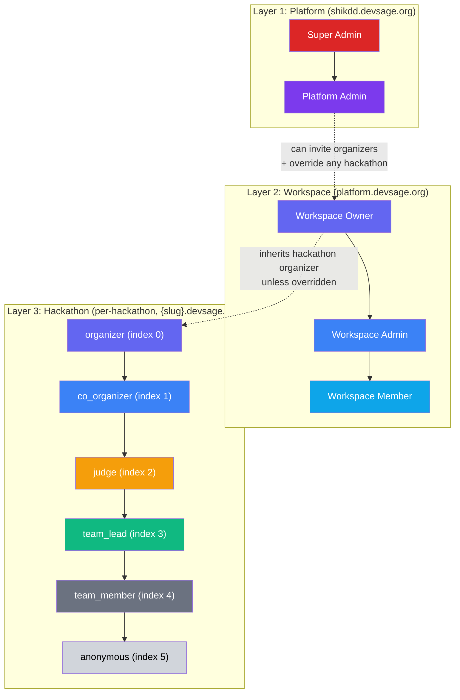
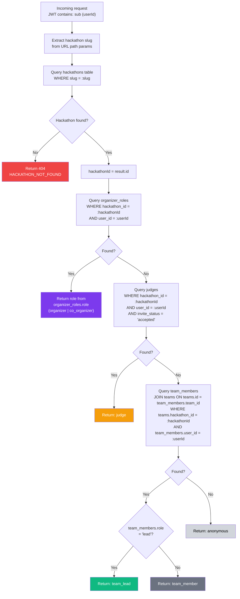
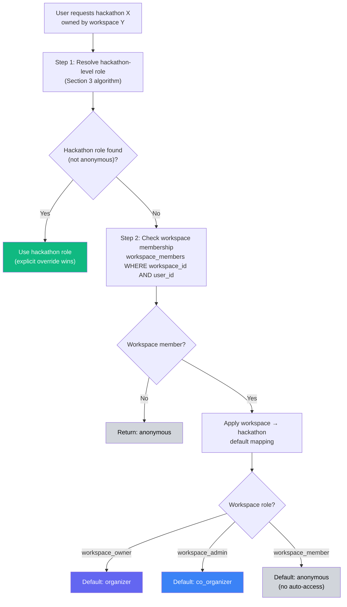
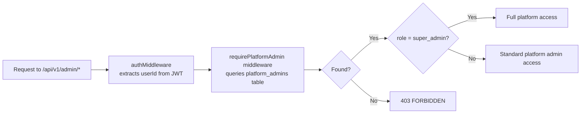
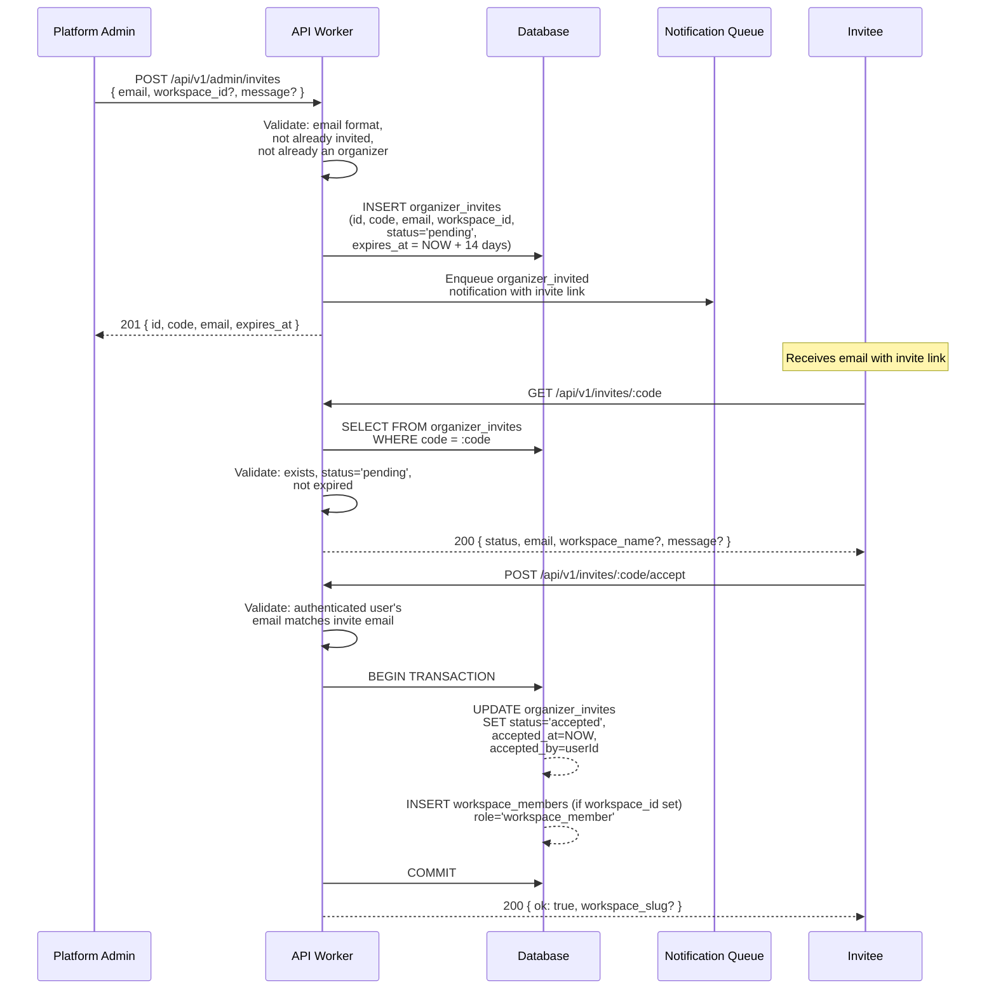
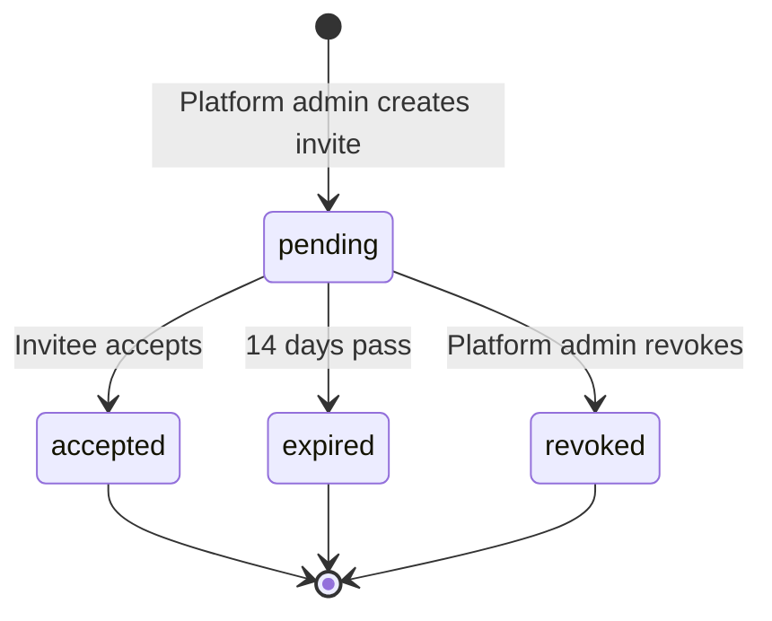
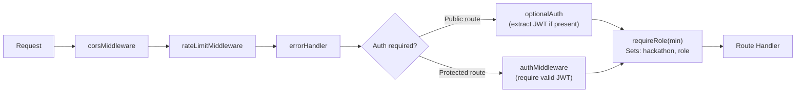
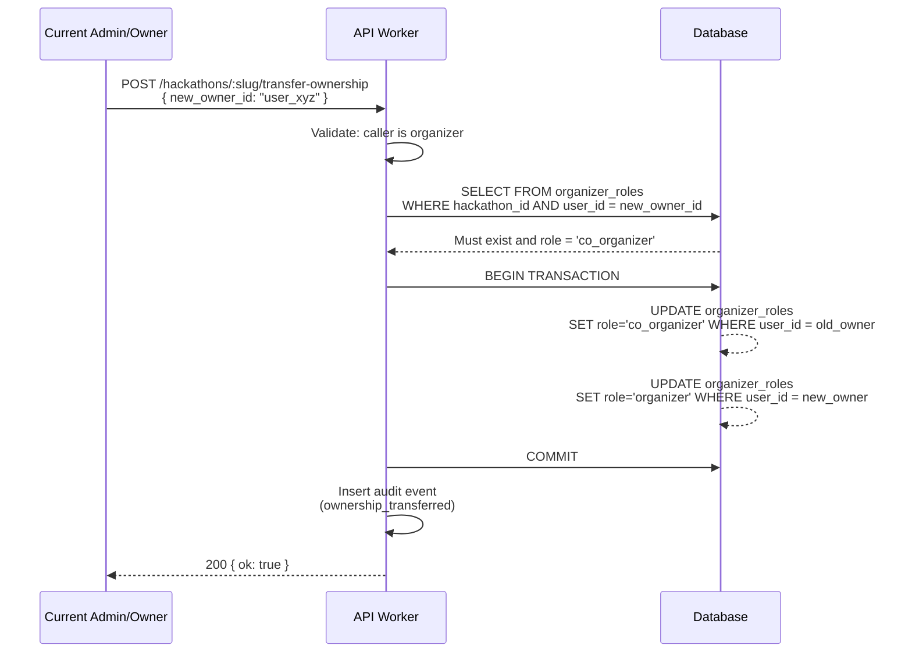

# Roles & Permissions

> Layered authorization system with per-hackathon role resolution, workspace-level hierarchy, and fine-grained permission grants — all resolved per-request from database state, never cached in tokens. Uses 7 built-in roles only (no custom roles). No API keys — all access through authenticated sessions.

---

## Table of Contents

- [Design Goals](#design-goals)
- [1. Role Architecture](#1-role-architecture)
- [2. Built-in Hackathon Roles](#2-built-in-hackathon-roles)
- [3. Role Resolution Algorithm](#3-role-resolution-algorithm)
- [4. Workspace-Level Hierarchy](#4-workspace-level-hierarchy)
- [5. Platform Administration](#5-platform-administration)
- [6. Organizer Invitations](#6-organizer-invitations)
- [7. Permission Matrix](#7-permission-matrix)
- [8. Middleware Architecture](#8-middleware-architecture)
- [9. Permission Checks in Route Handlers](#9-permission-checks-in-route-handlers)
- [10. API Endpoints](#10-api-endpoints)
- [11. Edge Cases](#11-edge-cases)
- [12. Error Codes](#12-error-codes)
- [13. Database Tables](#13-database-tables)
- [14. Decision Log](#14-decision-log)

---

## Design Goals

| Goal | Description |
|------|-------------|
| Per-request accuracy | Every request resolves the user's role from live database state — never stale, never cached in JWT |
| Per-hackathon scoping | A user can be an organizer of one hackathon, a judge in another, and anonymous in a third — all simultaneously |
| Hierarchical inheritance | Higher roles inherit all permissions of lower roles. `requireRole('judge')` passes for judge, co-organizer, organizer, and admin_owner |
| Workspace layer | Workspaces (clubs or individuals) own hackathons. Workspace-level roles cascade down unless overridden per-hackathon |
| Auditable | Every role assignment, revocation, and permission change produces an audit event |
| Zero trust in tokens | JWT contains only identity (`sub`, `ghid`). All authorization is server-side per-request |

---

## 1. Role Architecture

The system has three authorization layers that combine to produce a final permission set for every request:



**Key principle**: Layer 3 (hackathon roles) is always the final authority. Workspace-level roles provide defaults that can be overridden at the hackathon level. Platform-level roles are entirely separate and only govern platform administration (`shikdd.devsage.org`).

---

## 2. Built-in Hackathon Roles

Six built-in hackathon roles form a strict hierarchy. Each role inherits all permissions of every role below it. Platform admins (shikdd team) have a separate override mechanism — they are NOT a hackathon role.

| Index | Role | Source | Description |
|-------|------|--------|-------------|
| 0 | `organizer` | `organizer_roles` table | Workspace owner. Highest customer-facing role. Full hackathon control including deletion and ownership transfer. Can invite co-organizers, judges, and team leads. |
| 1 | `co_organizer` | `organizer_roles` table | Invited by organizer. Can create hackathons, edit config, view all teams, manage content, invite judges and team leads. |
| 2 | `judge` | `judges` table | Invited by organizer/co-organizer with `invite_status = 'accepted'`. Can score assigned submissions. Scoped to inviting workspace. |
| 3 | `team_lead` | `team_members` table | Designated by organizer/co-organizer (via Excel upload). Creates and names team, invites members, connects repo, finalizes submissions. |
| 4 | `team_member` | `team_members` table | Invited by team lead. Can view own team and submissions. |
| 5 | `anonymous` | (fallback) | Authenticated user with no relationship to this hackathon. Can only view public hackathon landing page. |

**`anonymous` means authenticated but unrelated** — unauthenticated users are blocked by the auth middleware before role resolution ever runs.

**Platform Admin Override:** Platform admins (shikdd team at `shikdd.devsage.org`) can access any hackathon with `organizer`-level permissions via the `requirePlatformAdmin` middleware. This is a platform-level override, NOT a hackathon role assignment. Platform admins do not appear in the `organizer_roles` table for hackathons.

### Role Hierarchy Invariant

```
organizer > co_organizer > judge > team_lead > team_member > anonymous
(Platform admins override: equivalent to organizer for any hackathon)
```

A `requireRole('co_organizer')` check passes for `co_organizer` and `organizer`. It rejects `judge`, `team_lead`, `team_member`, and `anonymous`.

```typescript
interface RoleHierarchy {
  readonly ROLES: readonly ['organizer', 'co_organizer', 'judge', 'team_lead', 'team_member', 'anonymous'];
  readonly ROLE_INDEX: Record<Role, number>;  // organizer=0, co_organizer=1, ..., anonymous=5

  isRoleAtLeast(userRole: Role, requiredRole: Role): boolean;
  // Returns true if ROLE_INDEX[userRole] <= ROLE_INDEX[requiredRole]
}
```

---

## 3. Role Resolution Algorithm

Role resolution runs on every request that requires authorization. It queries the database to determine the user's highest role for the specific hackathon in the request URL.



### Resolution Order (Strict Priority)

1. **`organizer_roles`** — Checked first. Returns `organizer` or `co_organizer`.
2. **`judges`** — Only if `invite_status = 'accepted'`. Pending/declined judges are treated as anonymous.
3. **`team_members`** — Joined through `teams` table. Returns `team_lead` or `team_member` based on `team_members.role`.
4. **Fallback** — `anonymous`.

### Conflict Resolution

A user can exist in multiple tables (e.g., both an `organizer_roles` organizer and a `judges` entry). Resolution returns the **highest-priority match** (first match in resolution order wins). There is no merging of permissions across sources.

### Performance

Resolution requires 1–3 sequential queries (short-circuits on first match). For the common case (organizer or team member), it's 1–3 queries. Each query hits indexed columns (`hackathon_id + user_id` composite). Total resolution time target: < 5ms on D1.

---

## 4. Workspace-Level Hierarchy

Workspaces own hackathons. There are two workspace types:
- **Clubs** (`platform.devsage.org/clubs/{slug}`) — subscription-based, can collaborate with other clubs
- **Individuals** (`platform.devsage.org/{slug}`) — one-time payment per hackathon

Workspace-level roles provide default hackathon roles across all hackathons within the workspace.

### Workspace Roles

| Role | Description |
|------|-------------|
| `workspace_owner` | Created the workspace. Can delete workspace, manage billing, transfer ownership |
| `workspace_admin` | Full management of workspace hackathons, members, and settings |
| `workspace_member` | Basic member. Can create hackathons under the workspace (if permitted by workspace settings) |

### Workspace → Hackathon Role Cascade



### Default Mapping Table

| Workspace Role | Default Hackathon Role | Override Allowed? |
|----------------|----------------------|-------------------|
| `workspace_owner` | `organizer` | No — workspace owner is always the organizer |
| `workspace_admin` | `co_organizer` | Yes — can be elevated to `organizer` per hackathon |
| `workspace_member` | `anonymous` (no auto-access) | Yes — can be assigned any role per hackathon |

### Override Mechanism

Hackathon-level assignments always take priority over workspace defaults. If a workspace admin is explicitly assigned as a `judge` in a specific hackathon, they get `judge` (not the workspace-default `co_organizer`), because the hackathon role is discovered first in resolution order.

### Workspace API

```
POST   /api/v1/workspaces                              # Create workspace (platform admin or invited)
GET    /api/v1/workspaces                              # List user's workspaces
GET    /api/v1/workspaces/:slug                        # Get workspace details
PUT    /api/v1/workspaces/:slug                        # Update workspace settings (workspace_admin+)
DELETE /api/v1/workspaces/:slug                        # Delete workspace (workspace_owner only)

POST   /api/v1/workspaces/:slug/members                # Invite member (workspace_admin+)
GET    /api/v1/workspaces/:slug/members                # List members (workspace_member+)
PUT    /api/v1/workspaces/:slug/members/:userId        # Update member role (workspace_admin+)
DELETE /api/v1/workspaces/:slug/members/:userId        # Remove member (workspace_admin+)

POST   /api/v1/workspaces/:slug/transfer               # Transfer ownership (workspace_owner only)

GET    /api/v1/workspaces/:slug/hackathons             # List workspace hackathons (workspace_member+)
POST   /api/v1/workspaces/:slug/hackathons             # Create hackathon under workspace (workspace_admin+)
```

---

## 5. Platform Administration

Platform administration is a completely separate authorization system from hackathon roles. Platform admins govern the platform itself — user management, org approvals, system configuration.

### Platform Roles

| Role | Description |
|------|-------------|
| `super_admin` | Full platform control. Can create/remove platform admins. Bootstrap role — first user seed |
| `platform_admin` | Can create organizer invites, manage platform settings, view system health |

### Platform Admin Resolution



### Platform Admin Capabilities

| Capability | `platform_admin` | `super_admin` |
|-----------|:-:|:-:|
| Create organizer invites | ✓ | ✓ |
| List/revoke organizer invites | ✓ | ✓ |
| View all platform admins | ✓ | ✓ |
| View system health dashboard | ✓ | ✓ |
| View all users | ✓ | ✓ |
| Suspend/unsuspend users | ✓ | ✓ |
| Create workspaces | ✓ | ✓ |
| Force-delete hackathons | – | ✓ |
| Add/remove platform admins | – | ✓ |
| Access secret rotation | – | ✓ |
| View audit trail (all) | – | ✓ |

### Platform Admin API

```
GET    /api/v1/admin/health                    # System health (platform_admin+)
GET    /api/v1/admin/admins                    # List platform admins (platform_admin+)
POST   /api/v1/admin/admins                    # Add platform admin (super_admin)
DELETE /api/v1/admin/admins/:userId            # Remove platform admin (super_admin)

GET    /api/v1/admin/users                     # List all users (platform_admin+)
PUT    /api/v1/admin/users/:userId/suspend     # Suspend user (platform_admin+)
PUT    /api/v1/admin/users/:userId/unsuspend   # Unsuspend user (platform_admin+)

GET    /api/v1/admin/invites                   # List organizer invites (platform_admin+)
POST   /api/v1/admin/invites                   # Create organizer invite (platform_admin+)
DELETE /api/v1/admin/invites/:inviteId         # Revoke invite (platform_admin+)

GET    /api/v1/admin/workspaces                 # List all workspaces (platform_admin+)
DELETE /api/v1/admin/hackathons/:id            # Force-delete hackathon (super_admin)

GET    /api/v1/admin/audit                     # Query audit trail (super_admin)
```

---

## 6. Organizer Invitations

New organizers are onboarded through an invitation system managed by platform admins.



### Invite Lifecycle



### Invite Rules

- Invite codes are 32-character URL-safe random strings (`crypto.randomUUID()` + base64url encoding).
- Default expiry: 14 days. Configurable 1–30 days.
- An email can have at most one pending invite at a time.
- Accepting an invite requires the authenticated user's email to match the invite email.
- If `workspace_id` is set, accepting the invite also adds the user as a `workspace_member` in that workspace.
- Expired invites can be re-sent (creates a new invite, marks old one expired).
- Revoking an accepted invite does NOT remove the organizer — it only prevents future use.

---

## 7. Permission Matrix

Complete permission matrix for all 7 built-in hackathon roles.

### Hackathon Management

| Action | anon | team_member | team_lead | judge | co_org | organizer |
|--------|:----:|:-----------:|:---------:|:-----:|:------:|:---------:|
| View public hackathon info | ✓ | ✓ | ✓ | ✓ | ✓ | ✓ |
| View hackathon settings | – | – | – | – | ✓ | ✓ |
| Edit hackathon config | – | – | – | – | ✓ | ✓ |
| Transition phase | – | – | – | – | ✓ | ✓ |
| Delete hackathon | – | – | – | – | – | ✓ |
| Transfer ownership | – | – | – | – | – | ✓ |

> **Platform admins (shikdd)** have organizer-level access to all hackathons via platform override. They can also force-delete hackathons and access the full audit trail via `shikdd.devsage.org`.

### Teams

| Action | anon | team_member | team_lead | judge | co_org | organizer |
|--------|:----:|:-----------:|:---------:|:-----:|:------:|:---------:|
| Accept team lead designation | – | – | ✓ | – | – | – |
| Create/name team (after designation) | – | – | ✓ | – | – | – |
| Invite team members | – | – | ✓ | – | – | – |
| Accept team member invite | – | ✓ | – | – | – | – |
| View own team | – | ✓ | ✓ | – | – | ✓ |
| View all teams | – | – | – | – | ✓ | ✓ |
| Manage own team | – | – | ✓ | – | – | ✓ |
| Manage all teams | – | – | – | – | ✓ | ✓ |
| Install GitHub bot | – | – | ✓ | – | – | – |
| Designate team leads (Excel upload) | – | – | – | – | ✓ | ✓ |

### Submissions

| Action | anon | team_member | team_lead | judge | co_org | organizer |
|--------|:----:|:-----------:|:---------:|:-----:|:------:|:---------:|
| View own submissions | – | ✓ | ✓ | – | – | ✓ |
| View all submissions | – | – | – | assigned | ✓ | ✓ |
| Finalize submission | – | – | ✓ | – | – | ✓ |
| Attach artifacts (demo URL) | – | – | ✓ | – | – | ✓ |
| View own commit log | – | ✓ | ✓ | – | – | ✓ |
| View all commit logs | – | – | – | assigned | ✓ | ✓ |
| View force pushes | – | – | – | – | ✓ | ✓ |

### Judging

| Action | anon | team_member | team_lead | judge | co_org | organizer |
|--------|:----:|:-----------:|:---------:|:-----:|:------:|:---------:|
| Score submissions | – | – | – | ✓ | – | – |
| View own scores | – | – | – | ✓ | – | – |
| View all scores | – | – | – | – | ✓ | ✓ |
| Invite judges | – | – | – | – | ✓ | ✓ |
| Manage judges | – | – | – | – | ✓ | ✓ |
| Set rubric | – | – | – | – | ✓ | ✓ |
| View leaderboard | ★ | ★ | ★ | ★ | ✓ | ✓ |
| Publish results | – | – | – | – | ✓ | ✓ |

★ Leaderboard visibility for non-co-organizer roles depends on hackathon phase (visible to all after `completed`).

### Roles & Settings

| Action | anon | team_member | team_lead | judge | co_org | organizer |
|--------|:----:|:-----------:|:---------:|:-----:|:------:|:---------:|
| View own role | – | ✓ | ✓ | ✓ | ✓ | ✓ |
| Manage organizer roles | – | – | – | – | – | ✓ |
| Invite co-organizers | – | – | – | – | – | ✓ |
| View audit trail | – | – | – | – | ✓ | ✓ |
| Manage webhooks | – | – | – | – | ✓ | ✓ |
| View analytics | – | – | – | – | ✓ | ✓ |

### Content & Communication

| Action | anon | team_member | team_lead | judge | co_org | organizer |
|--------|:----:|:-----------:|:---------:|:-----:|:------:|:---------:|
| View announcements | ✓ | ✓ | ✓ | ✓ | ✓ | ✓ |
| Create announcements | – | – | – | – | ✓ | ✓ |
| Manage announcements | – | – | – | – | ✓ | ✓ |
| Send notifications | – | – | – | – | ✓ | ✓ |

---

## 8. Middleware Architecture

The middleware chain processes every request through a series of authorization gates.



### Middleware Descriptions

| Middleware | Purpose | Sets on Context |
|-----------|---------|----------------|
| `corsMiddleware` | CORS headers for SPA (per-subdomain) | – |
| `rateLimitMiddleware` | Per-IP / per-user rate limiting | – |
| `errorHandler` | Catches unhandled errors, returns standard envelope | – |
| `authMiddleware` | Extracts and validates JWT from HttpOnly cookie (per-subdomain). Rejects if missing/invalid | `user: JWTPayload` |
| `optionalAuth` | Extracts JWT if present, sets user or null. Does NOT reject. Limited to invite landing pages. | `user: JWTPayload \| null` |
| `requireRole(minRole)` | Resolves hackathon slug → hackathon, runs role resolution, checks hierarchy | `hackathon: Hackathon, role: Role` |
| `requirePlatformAdmin` | Checks `platform_admins` table. Used on `shikdd.devsage.org` routes. | `platformRole: 'super_admin' \| 'platform_admin'` |
| `requireOrganizer` | Checks if user is platform admin OR has accepted organizer invite. For hackathon creation. Used on `platform.devsage.org`. | – |

### Middleware Usage Patterns

```typescript
// Public route — invite landing page (optionalAuth)
app.get('/invite/:code', optionalAuth, handler);

// Authenticated team member
app.get('/hackathons/:slug/team', authMiddleware, requireRole('team_member'), handler);

// Team lead only
app.post('/hackathons/:slug/submissions/finalize', authMiddleware, requireRole('team_lead'), handler);

// Co-organizer+
app.get('/hackathons/:slug/teams', authMiddleware, requireRole('co_organizer'), handler);

// Organizer+
app.put('/hackathons/:slug', authMiddleware, requireRole('organizer'), handler);

// Organizer only (highest hackathon role)
app.delete('/hackathons/:slug', authMiddleware, requireRole('organizer'), handler);

// Platform admin (shikdd.devsage.org)
app.get('/admin/users', authMiddleware, requirePlatformAdmin, handler);
```

---

## 9. Permission Checks in Route Handlers

Some permissions require contextual checks beyond role hierarchy. These are implemented in route handlers, not middleware.

### Resource-Level Checks

```typescript
// Example: Viewing a specific team
async function getTeam(c: Context) {
  const role = c.get('role');
  const user = c.get('user');
  const team = await db.getTeam(teamId);

  // Co-organizers+ can view any team
  if (isRoleAtLeast(role, 'co_organizer')) {
    return successResponse(c, team);
  }

  // Team members can only view their own team
  if (team.members.some(m => m.user_id === user.sub)) {
    return successResponse(c, team);
  }

  // Judges can only view teams assigned to them
  if (role === 'judge') {
    const assignment = await db.getJudgeAssignment(user.sub, team.id);
    if (assignment) {
      return successResponse(c, team);
    }
  }

  return errorResponse(c, 403, 'FORBIDDEN', 'You do not have access to this team');
}
```

### Common Handler-Level Checks

| Check | Context | Logic |
|-------|---------|-------|
| Own team only | team_member, team_lead | `team_members` contains `user.sub` |
| Assigned submissions only | judge | `judge_assignments` links judge to submission's team |
| Own profile only | any authenticated | `resource.user_id === user.sub` |
| Phase-dependent | varies | Some actions only allowed in certain hackathon phases |

---

## 10. API Endpoints

### Role Management (Hackathon-Level)

```
GET    /api/v1/hackathons/:slug/my-role                   # Get current user's role
GET    /api/v1/hackathons/:slug/organizers                 # List organizers (organizer+)
POST   /api/v1/hackathons/:slug/organizers                 # Add organizer/co-organizer (admin_owner)
PUT    /api/v1/hackathons/:slug/organizers/:userId         # Update organizer role (admin_owner)
DELETE /api/v1/hackathons/:slug/organizers/:userId         # Remove organizer (admin_owner)
POST   /api/v1/hackathons/:slug/transfer-ownership         # Transfer to another organizer (admin_owner)
```

### My Role Response

```
GET /api/v1/hackathons/:slug/my-role
```

```json
{
  "ok": true,
  "data": {
    "role": "team_lead",
    "source": "team_members",
    "permissions": [
      "hackathon:view",
      "teams:view_own",
      "teams:manage_own",
      "submissions:view_own",
      "submissions:finalize",
      "commits:view_own"
    ],
    "team_id": "t_abc123",
    "hackathon_id": "h_def456"
  }
}
```

### Ownership Transfer Flow



**Transfer Rules:**
- New owner must already be a `co_organizer` of the hackathon.
- Old owner is demoted to `co_organizer` (not removed).
- Exactly one `organizer` per hackathon at all times (transactional swap).
- Transfer produces an audit event with both user IDs.

---

## 11. Edge Cases

| Scenario | Behavior |
|----------|----------|
| User is both organizer and judge | Resolution returns `organizer` role (higher priority in resolution order) |
| User is workspace_admin but explicitly assigned as judge in a hackathon | Returns `judge` — hackathon-level explicit assignment is found first in resolution, before workspace cascade |
| User's organizer role is removed mid-session | Next request resolves fresh — they immediately lose access |
| Two teams in same hackathon (should be impossible) | Resolution returns first match. Prevented at team invite time by unique constraint |
| Hackathon slug changes | Role resolution uses `hackathon_id` (UUID) internally, not slug. Slug is only for lookup |
| Platform admin accesses hackathon | Gets organizer-level access via platform override. Platform admin access is separate from hackathon role assignments |
| Suspended user attempts role resolution | `authMiddleware` checks suspension status BEFORE role resolution. Suspended = 403 |
| Workspace owner leaves workspace | Cannot leave while owner. Must transfer ownership first |
| Workspace deleted with active hackathons | All hackathons under the workspace become "unowned workspace" — still functional but no workspace cascade |
| Concurrent role modification | Last write wins. `updated_at` timestamp tracks latest change. No optimistic locking needed (organizer-only operation) |
| Eliminated team member tries to submit | Role resolution returns `team_member`, but submission handler checks `round_results` for elimination status → rejects |

---

## 12. Error Codes

| Code | HTTP | Condition |
|------|------|-----------|
| `HACKATHON_NOT_FOUND` | 404 | Hackathon slug does not exist |
| `FORBIDDEN` | 403 | User's role is below the required minimum |
| `NOT_PLATFORM_ADMIN` | 403 | User is not in `platform_admins` table |
| `NOT_ORGANIZER` | 403 | User is neither platform admin nor accepted organizer |
| `CANNOT_REMOVE_OWNER` | 400 | Cannot remove or demote the hackathon organizer (must transfer first) |
| `TRANSFER_TARGET_NOT_CO_ORGANIZER` | 400 | Ownership transfer target must be an existing co_organizer |
| `INVITE_NOT_FOUND` | 404 | Invite code does not exist |
| `INVITE_EXPIRED` | 410 | Invite code has expired |
| `INVITE_ALREADY_ACCEPTED` | 409 | Invite has already been used |
| `INVITE_EMAIL_MISMATCH` | 403 | Authenticated user's email does not match invite email |
| `INVITE_ALREADY_PENDING` | 409 | A pending invite already exists for this email |
| `WORKSPACE_NOT_FOUND` | 404 | Workspace slug does not exist |
| `NOT_WORKSPACE_MEMBER` | 403 | User is not a member of the workspace |
| `CANNOT_LEAVE_AS_OWNER` | 400 | Workspace owner must transfer ownership before leaving |
| `USER_SUSPENDED` | 403 | User account is suspended |

---

## 13. Database Tables

### `organizer_roles`

Stores per-hackathon organizer assignments (owner, admin, moderator).

| Column | Type | Constraints | Description |
|--------|------|-------------|-------------|
| `id` | TEXT | PK, UUID | Unique row identifier |
| `hackathon_id` | TEXT | FK → hackathons.id, NOT NULL | Which hackathon |
| `user_id` | TEXT | FK → users.id, NOT NULL | Which user |
| `role` | TEXT | NOT NULL, CHECK IN ('organizer','co_organizer') | Organizer role |
| `assigned_by` | TEXT | FK → users.id, NULL | Who assigned this role (null for creator) |
| `created_at` | TEXT | NOT NULL, DEFAULT CURRENT_TIMESTAMP | ISO-8601 |
| `updated_at` | TEXT | NOT NULL, DEFAULT CURRENT_TIMESTAMP | ISO-8601 |

**Indexes:** UNIQUE(`hackathon_id`, `user_id`), INDEX(`user_id`)


---

### `platform_admins`

Global platform administrators.

| Column | Type | Constraints | Description |
|--------|------|-------------|-------------|
| `id` | TEXT | PK, UUID | Unique row ID |
| `user_id` | TEXT | FK → users.id, UNIQUE, NOT NULL | Which user |
| `role` | TEXT | NOT NULL, CHECK IN ('super_admin','platform_admin') | Platform role |
| `created_by` | TEXT | FK → users.id, NULL | Who added (null for seed) |
| `created_at` | TEXT | NOT NULL, DEFAULT CURRENT_TIMESTAMP | ISO-8601 |

**Indexes:** UNIQUE(`user_id`)

---

### `organizer_invites`

Invitations for new organizers.

| Column | Type | Constraints | Description |
|--------|------|-------------|-------------|
| `id` | TEXT | PK, UUID | Unique invite ID |
| `code` | TEXT | UNIQUE, NOT NULL | 32-char URL-safe random code |
| `email` | TEXT | NOT NULL | Invitee's email |
| `workspace_id` | TEXT | FK → workspaces.id, NULL | Optionally associate with workspace |
| `message` | TEXT | NULL | Optional personal message from admin |
| `status` | TEXT | NOT NULL, DEFAULT 'pending' | pending, accepted, expired, revoked |
| `expires_at` | TEXT | NOT NULL | ISO-8601 expiry timestamp |
| `created_by` | TEXT | FK → users.id, NOT NULL | Platform admin who created |
| `accepted_by` | TEXT | FK → users.id, NULL | User who accepted |
| `accepted_at` | TEXT | NULL | When accepted |
| `created_at` | TEXT | NOT NULL, DEFAULT CURRENT_TIMESTAMP | ISO-8601 |

**Indexes:** UNIQUE(`code`), INDEX(`email`, `status`), INDEX(`status`)

---

### `workspaces`

Workspace entities that own hackathons. Two types: clubs (subscription) and individuals (one-time).

| Column | Type | Constraints | Description |
|--------|------|-------------|-------------|
| `id` | TEXT | PK, UUID | Unique workspace ID |
| `name` | TEXT | NOT NULL | Display name |
| `slug` | TEXT | UNIQUE, NOT NULL | URL-safe identifier |
| `type` | TEXT | NOT NULL, CHECK IN ('club','individual') | Workspace type |
| `description` | TEXT | NOT NULL, DEFAULT '' | Workspace description |
| `logo_url` | TEXT | NULL | R2 URL to workspace logo |
| `website` | TEXT | NULL | Workspace website URL |
| `settings` | TEXT | NOT NULL, DEFAULT '{}' | JSON workspace settings |
| `created_by` | TEXT | FK → users.id, NOT NULL | User who created |
| `created_at` | TEXT | NOT NULL, DEFAULT CURRENT_TIMESTAMP | ISO-8601 |
| `updated_at` | TEXT | NOT NULL, DEFAULT CURRENT_TIMESTAMP | ISO-8601 |

**Indexes:** UNIQUE(`slug`)

---

### `workspace_members`

Workspace membership and roles.

| Column | Type | Constraints | Description |
|--------|------|-------------|-------------|
| `id` | TEXT | PK, UUID | Unique row ID |
| `workspace_id` | TEXT | FK → workspaces.id, NOT NULL, ON DELETE CASCADE | Which workspace |
| `user_id` | TEXT | FK → users.id, NOT NULL | Which user |
| `role` | TEXT | NOT NULL, CHECK IN ('workspace_owner','workspace_admin','workspace_member') | Workspace-level role |
| `invited_by` | TEXT | FK → users.id, NULL | Who invited (null for creator) |
| `created_at` | TEXT | NOT NULL, DEFAULT CURRENT_TIMESTAMP | ISO-8601 |
| `updated_at` | TEXT | NOT NULL, DEFAULT CURRENT_TIMESTAMP | ISO-8601 |

**Indexes:** UNIQUE(`workspace_id`, `user_id`), INDEX(`user_id`)


---

## 14. Decision Log

| Decision | Choice | Why | Alternatives Considered |
|----------|--------|-----|------------------------|
| Roles NOT in JWT | Per-request DB resolution | A user's role differs per hackathon. JWT-embedded roles would be stale instantly and require refresh on every role change | Role in JWT with refresh endpoint; role in JWT with short expiry |
| Highest-wins resolution | First match in priority order | User with multiple relationships (organizer + judge) gets deterministic, predictable role. Avoids permission merging complexity | Merge all permissions from all sources; let user choose active role |
| `anonymous` = authenticated | Separate concept from unauthenticated | Auth middleware blocks unauthenticated. Role system only deals with "what can this authenticated user do in this hackathon?" | anonymous = unauthenticated with public permissions |
| Platform admin ≠ hackathon admin_owner | Separate table and middleware | Different trust domains. Platform admin manages infrastructure (`shikdd.devsage.org`); hackathon admin_owner manages one event. Conflating them creates privilege escalation risk | Single admin table with scope column; platform admin auto-gets hackathon admin_owner |
| Built-in roles only (no custom roles) | 7 fixed tiers | Simplifies resolution, reduces complexity. 7 roles cover all use cases for hackathon management. Custom roles add significant complexity for rare edge cases. | Custom roles with cherry-picked permissions — over-engineered for v3 |
| No API keys | Session-based auth only | All access through authenticated sessions. API keys add complexity (key management, scoping, revocation) for a feature not needed at launch. | Per-hackathon API keys — premature, can add later if needed |
| Workspace roles cascade as defaults only | Hackathon-level always wins | Organizers need per-hackathon control. A workspace admin might be a judge in a specific hackathon. Cascade provides convenience; override provides control | Workspace roles always apply; no cascade (manual assignment only) |
| Ownership transfer requires target = organizer | Pre-validation | Prevents transferring to someone unfamiliar with the hackathon. Organizer status proves involvement | Transfer to any authenticated user; transfer to any role |
| Workspace owner cannot leave | Must transfer first | Prevents orphaned workspaces with no management. Same pattern as GitHub org ownership | Allow leaving (auto-promote next admin); allow leaving (workspace becomes unmanaged) |
| Invite-only team formation | No self-service registration | Organizers control participation. Team leads are invited, then they invite members. No public sign-up or team discovery. | Open registration — doesn't match invite-only model |

