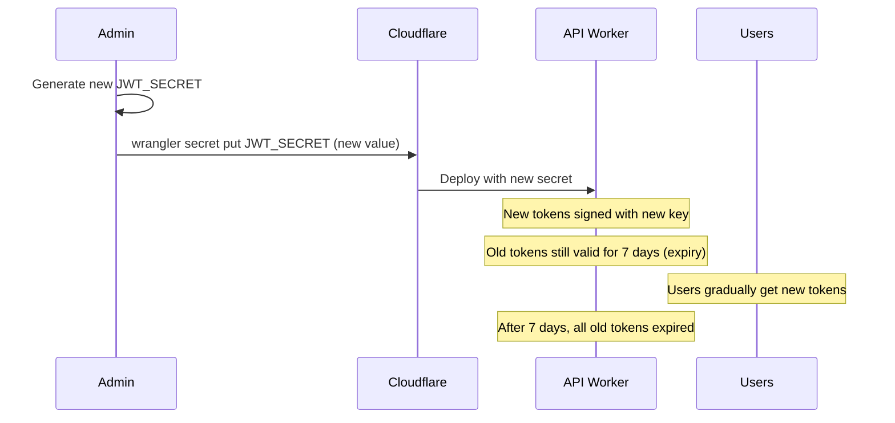
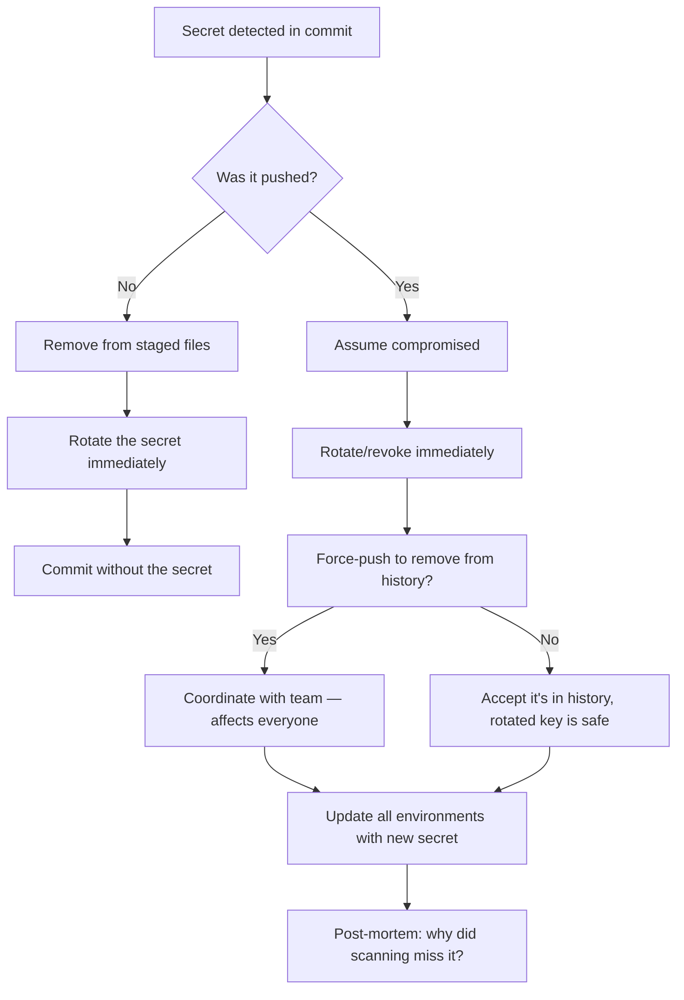

# Secrets Management

> Comprehensive secret handling with automated scanning at every stage, rotation automation, environment-specific credential management, and incident response procedures — ensuring zero secret exposure from development to production.

---

## Table of Contents

1. [Overview](#overview)
2. [Secret Inventory](#secret-inventory)
3. [Where Secrets Live](#where-secrets-live)
4. [Scanning & Prevention](#scanning--prevention)
5. [Rotation Automation](#rotation-automation)
6. [New v3 Secrets](#new-v3-secrets)
7. [Incident Response](#incident-response)

---

## Overview

DevSage enforces a multi-layered defense against secret exposure:

| Layer | Tool | Trigger | Behavior |
|-------|------|---------|----------|
| Development | `.gitignore` | Always | Excludes `.env*`, `.dev.vars`, `.wrangler/` |
| Pre-commit | `secretlint` | `git commit` | Scans staged files. Blocks commits with secrets |
| Pre-push | `secretlint` | `git push` | Full repo scan. Blocks pushes with secrets |
| CI | `gitleaks` | Every PR + push to `main` | GitHub Action fails if secrets detected |
| Runtime | Cloudflare Workers | Always | Secrets injected as encrypted environment bindings |

---

## Secret Inventory

### API Secrets (Required)

| Secret | Description | Format | Rotation |
|--------|-------------|--------|----------|
| `JWT_SECRET` | HMAC SHA-256 signing key for auth tokens | Min 32 chars, random string | Every 90 days |
| `GOOGLE_CLIENT_ID` | Google OAuth 2.0 client ID | `xxx.apps.googleusercontent.com` | On compromise |
| `GOOGLE_CLIENT_SECRET` | Google OAuth 2.0 client secret | Alphanumeric string | On compromise |
| `GITHUB_CLIENT_ID` | GitHub OAuth app client ID | `Iv1.xxxxxxxx` | On compromise |
| `GITHUB_CLIENT_SECRET` | GitHub OAuth app client secret | Hex string | On compromise |
| `GITHUB_WEBHOOK_SECRET` | HMAC secret for GitHub webhook verification | Min 20 chars, random string | Every 90 days |
| `FRONTEND_URL` | Production frontend origin | `https://devsage.org` | On domain change |
| `SMTP_URL` | SMTP server connection string | `smtp://host:port` or `smtps://host:port` | On provider change |
| `SMTP_USERNAME` | SMTP authentication username | Provider-specific | On provider change |
| `SMTP_PASSWORD` | SMTP authentication password | Provider-specific | On provider change |
| `SMTP_EMAIL_ADDR` | Sender email address for outbound mail | `noreply@devsage.org` | On domain change |

### API Secrets (Optional / v3 New)

| Secret | Description | Format | Rotation |
|--------|-------------|--------|----------|
| `AI_PROVIDER_API_KEY` | API key for AI-assisted code reviews | Provider-specific | Every 90 days |
| `AI_PROVIDER_MODEL` | Model identifier for AI reviews | e.g., `gpt-4o` | On model change |
| `SENTRY_DSN` | Error reporting endpoint | `https://...@sentry.io/...` | On project change |
| `POSTHOG_API_KEY` | Product analytics key | `phc_...` | On project change |
| `ENCRYPTION_KEY` | Symmetric key for encrypting plugin configs | 32-byte hex | Every 180 days |
| `WEBHOOK_SIGNING_KEY` | Base key for deriving per-plugin webhook secrets | Min 32 chars | Every 90 days |

### Web Secrets (None)

The web app uses only `VITE_*` environment variables, which are embedded in the JavaScript bundle at build time. **No secrets should ever be placed in `VITE_*` variables.**

| Variable | Value | Secret? |
|----------|-------|---------|
| `VITE_API_ORIGIN` | `https://api.devsage.org` | No — public URL |
| `VITE_WS_ORIGIN` | `wss://ws.devsage.org` | No — public URL |
| `VITE_APP_ENV` | `production` | No — environment name |
| `VITE_SENTRY_DSN` | DSN URL | No — Sentry DSNs are public by design |
| `VITE_POSTHOG_KEY` | `phc_...` | No — client-side analytics keys are public |

---

## Where Secrets Live

| Environment | Location | Encryption | Access |
|-------------|----------|------------|--------|
| Local dev | `apps/api/.dev.vars` | None (plaintext) | Developer machine only |
| Staging | Cloudflare Workers Secrets | Encrypted at rest | Wrangler CLI + dashboard |
| Production | Cloudflare Workers Secrets | Encrypted at rest | Wrangler CLI + dashboard |
| CI | GitHub Actions Secrets | Encrypted at rest | Workflow jobs only |

### Files That Are Gitignored

```
.env
.env.*
!apps/web/.env.production     # Exception: client-visible vars only
.dev.vars
.wrangler/
apps/api/.env.production      # Production secret file for bulk upload
```

### Secrets Upload

```bash
# Bulk upload from file (staging)
cd apps/api
wrangler secret bulk .env.staging --env staging

# Bulk upload from file (production)
pnpm deploy:api:secrets

# Individual secret
cd apps/api
wrangler secret put JWT_SECRET
wrangler secret put JWT_SECRET --env staging
```

---

## Scanning & Prevention

### Pre-commit Hook

```bash
# Runs automatically on `git commit`
# Configured via .husky/pre-commit
pnpm secrets:staged
```

Scans all staged files using `secretlint`. If any secrets are detected, the commit is blocked with a clear error message showing which file and line contains the secret.

### Pre-push Hook

```bash
# Runs automatically on `git push`
# Configured via .husky/pre-push
pnpm secrets:scan
```

Full repository scan before push. Catches secrets that might have been committed before hooks were installed.

### CI Scan

```yaml
# .github/workflows/secret-scan.yml
- uses: gitleaks/gitleaks-action@v2
  with:
    scan-mode: all
```

Runs on every PR and push to `main`. Results appear as GitHub check annotations.

### Manual Scan

```bash
pnpm secrets:scan     # Full repo scan
pnpm secrets:staged   # Staged files only
```

### secretlint Configuration

```json
{
  "rules": [
    { "id": "@secretlint/secretlint-rule-preset-recommend" },
    { "id": "@secretlint/secretlint-rule-pattern",
      "options": {
        "patterns": [
          { "name": "JWT_SECRET pattern", "pattern": "JWT_SECRET=[^\\s]+" },
          { "name": "Cloudflare API Token", "pattern": "cf_[a-zA-Z0-9_-]{40}" }
        ]
      }
    }
  ],
  "allowlist": {
    "patterns": [
      "dev-jwt-secret-change-in-prod",
      "your-.*-client-id",
      "your-.*-client-secret"
    ]
  }
}
```

---

## Rotation Automation

### Rotation Schedule

| Secret | Frequency | Automated? | Procedure |
|--------|-----------|-----------|-----------|
| `JWT_SECRET` | 90 days | Semi-auto | Generate → deploy → old tokens expire in 7 days |
| `GITHUB_WEBHOOK_SECRET` | 90 days | Manual | Update GitHub + Cloudflare simultaneously |
| `AI_PROVIDER_API_KEY` | 90 days | Manual | Rotate in provider dashboard → update Cloudflare |
| `ENCRYPTION_KEY` | 180 days | Semi-auto | New key → re-encrypt configs → deploy |
| `WEBHOOK_SIGNING_KEY` | 90 days | Semi-auto | New key → update all plugin installations |

### JWT Secret Rotation Procedure



No downtime. No forced logouts. Old tokens expire naturally.

### Webhook Secret Rotation

```bash
# 1. Generate new secret
NEW_SECRET=$(openssl rand -hex 32)

# 2. Update GitHub webhook (via GitHub UI or API)
gh api repos/SHIKDD-org/DevSage/hooks/{hook_id} \
  --method PATCH \
  --field config.secret="$NEW_SECRET"

# 3. Update Cloudflare secret
cd apps/api
echo "$NEW_SECRET" | wrangler secret put GITHUB_WEBHOOK_SECRET

# Both services must be updated within minutes to avoid
# webhook signature verification failures
```

---

## New v3 Secrets

These secrets are new in v3 and not present in v2:

| Secret | Purpose | When Needed |
|--------|---------|-------------|
| `AI_PROVIDER_API_KEY` | AI code review service (OpenAI, Anthropic, etc.) | When AI reviews feature is enabled |
| `ENCRYPTION_KEY` | Encrypting plugin configuration at rest | When plugin system is deployed |
| `WEBHOOK_SIGNING_KEY` | Base key for per-plugin HMAC secrets | When plugin system is deployed |
| `SENTRY_DSN` | Error reporting endpoint (API-side) | When error monitoring is configured |
| `POSTHOG_API_KEY` | Product analytics (API-side event tracking) | When analytics pipeline is enabled |

### Generating Strong Secrets

```bash
# JWT_SECRET (minimum 32 chars)
openssl rand -base64 48

# ENCRYPTION_KEY (32-byte hex)
openssl rand -hex 32

# WEBHOOK_SIGNING_KEY
openssl rand -base64 48

# Generic secret
openssl rand -hex 32
```

---

## Incident Response

### If a Secret is Committed



### Step-by-Step Incident Response

1. **Rotate immediately** — assume the secret is compromised the moment it was pushed. Do not wait.
2. **Revoke old credentials** — invalidate the exposed key in the provider's dashboard (GitHub, Google, SMTP provider).
3. **Generate new secret** — use strong random generation (see above).
4. **Update all environments** — local, staging, production. Use `wrangler secret put`.
5. **Verify deployment** — ensure the API Worker restarts with the new secret.
6. **Remove from history** (optional) — coordinate with the team if force-pushing. History rewrite affects all contributors.
7. **Post-mortem** — determine why pre-commit/pre-push scanning didn't catch it. Update scanning rules if needed.

### Contact for Security Issues

- **Internal**: Create a private GitHub issue tagged `security`
- **External**: Email `security@devsage.org`
- **Severity**: If production secrets are exposed, treat as P0 — immediate response required
