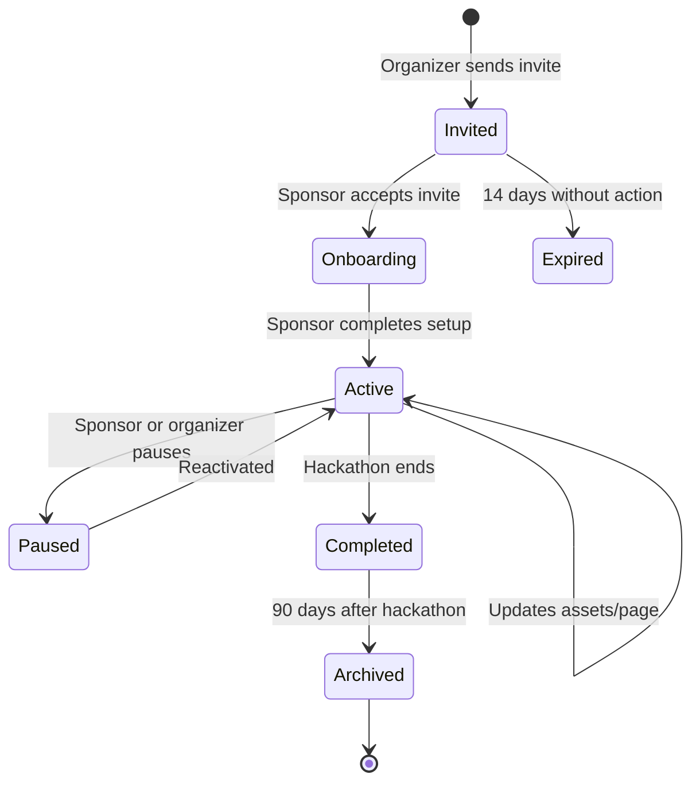
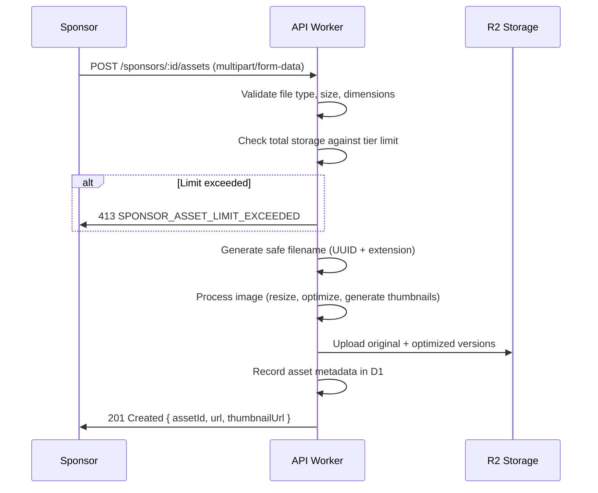
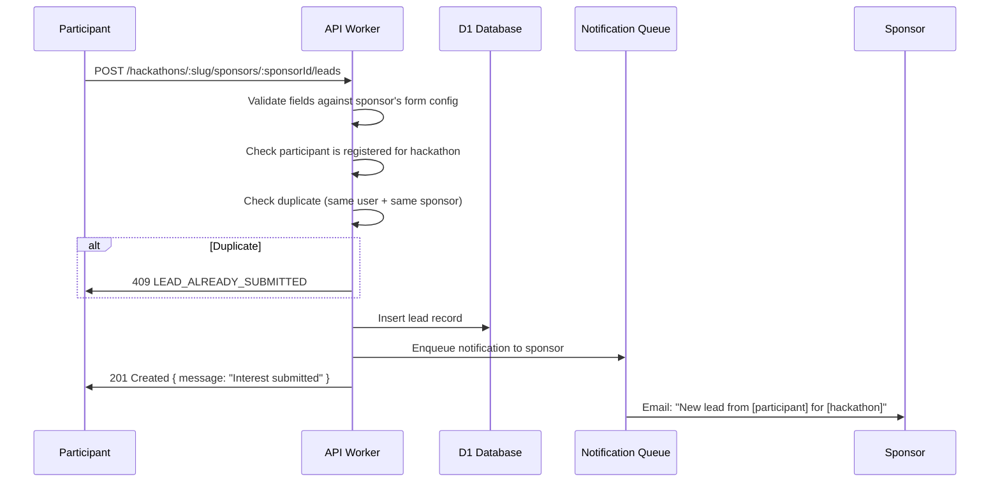
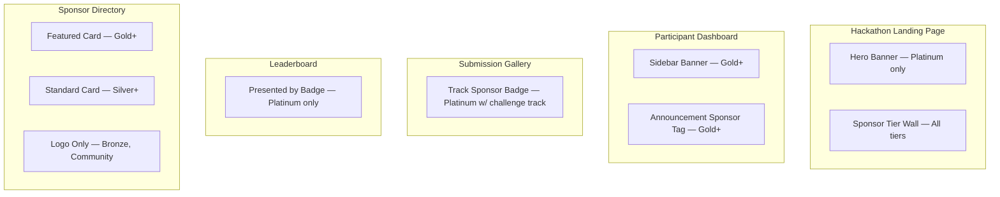
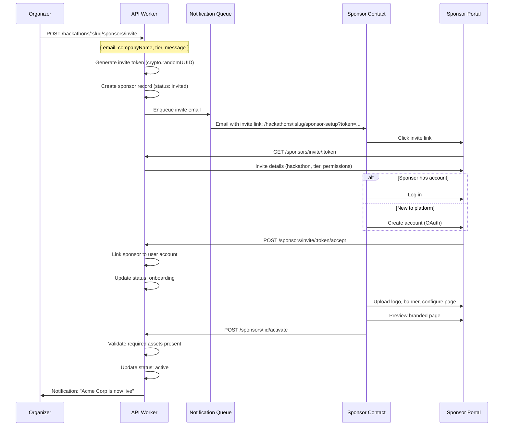
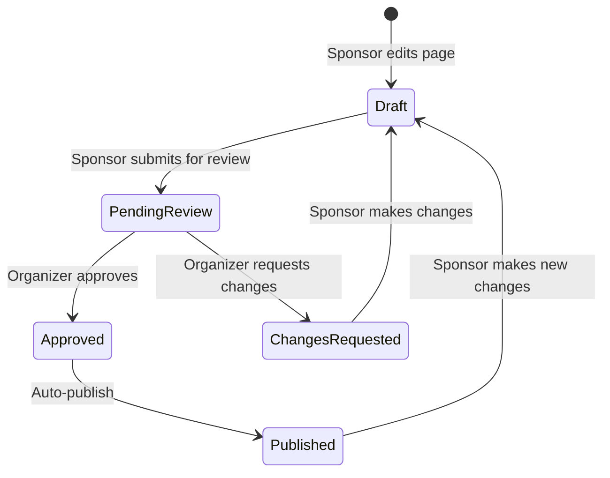

# 16 — Sponsor Portal

> Self-service sponsor management with tiered packages, R2-hosted branded assets, customizable showcase pages, lead capture forms, and ROI reporting — enabling organizers to monetize hackathons while giving sponsors measurable value.

---

## Table of Contents

1. [Design Goals](#design-goals)
2. [Sponsor Lifecycle](#sponsor-lifecycle)
3. [Tier System](#tier-system)
4. [Asset Management](#asset-management)
5. [Branded Pages](#branded-pages)
6. [Lead Capture](#lead-capture)
7. [Sponsor Placements](#sponsor-placements)
8. [ROI Reporting](#roi-reporting)
9. [Sponsor Onboarding Flow](#sponsor-onboarding-flow)
10. [Organizer Management Interface](#organizer-management-interface)
11. [API Endpoints](#api-endpoints)
12. [Edge Cases](#edge-cases)
13. [Error Codes](#error-codes)
14. [Database Tables](#database-tables)
15. [Decision Log](#decision-log)

---

## Design Goals

| Goal | Target | Rationale |
|------|--------|-----------|
| Sponsor onboarding time | < 15 minutes from invite to live page | Sponsors are busy; self-service must be frictionless |
| Asset upload limit | 50 MB per sponsor | Logos, banners, videos — generous but bounded |
| Page load with sponsor assets | < 2s LCP | Sponsor branding must not degrade participant experience |
| Lead capture response time | < 200ms | Form submissions must feel instant |
| ROI report generation | < 5s | Sponsors checking metrics during the event |
| Concurrent sponsors per hackathon | Up to 50 | Large hackathons may have many tier levels |
| Zero impact on non-sponsor pages | 0ms overhead | Sponsor assets lazy-loaded only on sponsor-relevant pages |

---

## Sponsor Lifecycle



### State Descriptions

| State | Description | Sponsor Access | Visibility |
|-------|-------------|---------------|------------|
| `invited` | Invite sent, awaiting acceptance | None | Hidden |
| `onboarding` | Accepted, uploading assets and configuring page | Portal (write) | Hidden |
| `active` | Fully configured, live on hackathon | Portal (write), Analytics (read) | Public |
| `paused` | Temporarily hidden (by sponsor or organizer) | Portal (read-only), Analytics (read) | Hidden |
| `completed` | Hackathon finished, final metrics available | Portal (read-only), Analytics (read), Export | Public (archive) |
| `archived` | Long-term storage, data retained for reporting | None | Hidden |

---

## Tier System

### Default Tiers

Organizers can use default tiers or define custom ones. Each tier controls placement visibility, asset limits, and features.

| Tier | Default Price | Placements | Assets | Features |
|------|--------------|------------|--------|----------|
| **Platinum** | Custom | All placements + exclusive banner | 50 MB, 20 files | Branded challenge track, keynote slot, dedicated page, lead capture, custom CTA, priority listing |
| **Gold** | Custom | Banner, sidebar, showcase page | 30 MB, 15 files | Dedicated page, lead capture, custom CTA, featured listing |
| **Silver** | Custom | Sidebar, showcase page | 20 MB, 10 files | Shared page, lead capture, standard listing |
| **Bronze** | Custom | Logo wall only | 10 MB, 5 files | Logo on sponsor wall, basic listing |
| **Community** | Free | Logo wall only | 5 MB, 3 files | Logo on sponsor wall, text-only listing |

### Custom Tier Configuration

```typescript
interface SponsorTier {
  id: string;
  hackathonId: string;
  name: string;                   // e.g., "Platinum", "Diamond", custom names
  displayOrder: number;           // Sort order (lower = more prominent)
  color: string;                  // Tier badge color (hex)
  
  // Limits
  maxAssetSizeMb: number;        // Total asset storage limit
  maxAssetCount: number;          // Maximum number of files
  maxPageSections: number;        // Content sections on branded page
  
  // Placement permissions
  placements: SponsorPlacement[]; // Which placements this tier gets
  
  // Feature flags
  features: {
    dedicatedPage: boolean;       // Own branded page
    leadCapture: boolean;         // Lead capture form
    customCta: boolean;           // Custom call-to-action button
    challengeTrack: boolean;      // Sponsor-branded challenge track
    featuredListing: boolean;     // Highlighted in sponsor list
    analyticsAccess: boolean;     // Self-service analytics
    exportAccess: boolean;        // Export their own data
  };
  
  createdAt: string;
  updatedAt: string;
}
```

---

## Asset Management

All sponsor assets are stored in Cloudflare R2, organized by hackathon and sponsor.

### R2 Storage Structure

```
sponsors/
├── {hackathonId}/
│   ├── {sponsorId}/
│   │   ├── logo.png              # Primary logo (required)
│   │   ├── logo-dark.png         # Dark mode variant (optional)
│   │   ├── banner.jpg            # Banner image (if tier allows)
│   │   ├── icon.svg              # Favicon-sized icon
│   │   ├── video-intro.mp4       # Intro video (if tier allows)
│   │   └── assets/
│   │       ├── screenshot-1.png  # Additional images for branded page
│   │       ├── screenshot-2.png
│   │       └── brochure.pdf      # Downloadable materials
│   └── {sponsorId2}/
│       └── ...
```

### Asset Upload Flow



### Accepted File Types

| Category | Extensions | Max Size | Processing |
|----------|-----------|----------|------------|
| Logo | `.png`, `.svg`, `.webp` | 2 MB | Resize to 400×400 max, generate 64×64 thumbnail |
| Banner | `.jpg`, `.png`, `.webp` | 5 MB | Resize to 1200×300 max, generate responsive variants |
| Image | `.jpg`, `.png`, `.webp`, `.gif` | 10 MB | Resize to 1920×1080 max, generate thumbnails |
| Video | `.mp4`, `.webm` | 50 MB | No server-side processing (client-side playback) |
| Document | `.pdf` | 10 MB | No processing |
| Icon | `.svg`, `.png` | 500 KB | Resize to 32×32 and 64×64 |

### Image Optimization

All uploaded images are processed into multiple variants:

| Variant | Max Dimensions | Format | Purpose |
|---------|---------------|--------|---------|
| `original` | As uploaded | Original | Archive, high-res display |
| `optimized` | 1200×1200 | WebP | Primary display |
| `thumbnail` | 200×200 | WebP | Grid views, lists |
| `icon` | 64×64 | WebP | Inline mentions, tiny displays |

Images are served via R2 with Cloudflare CDN caching:
- Cache TTL: 30 days (immutable hashed URLs)
- `Cache-Control: public, max-age=2592000, immutable`
- WebP format with PNG fallback via `Accept` header negotiation

---

## Branded Pages

Each sponsor at Gold tier or above gets a dedicated branded page within the hackathon.

### Page Structure

```
┌─────────────────────────────────────────────────────────────┐
│  ┌─────────┐                                                │
│  │  Logo   │  Sponsor Name                                  │
│  └─────────┘  Tier Badge    Website Link                    │
│                                                              │
│  [Banner Image — full width]                                 │
│                                                              │
├──────────────────────────────────────────────────────────────┤
│                                                              │
│  About                                                       │
│  ─────                                                       │
│  Rich text description (Markdown rendered)                   │
│  up to 5,000 characters                                      │
│                                                              │
├──────────────────────────────────────────────────────────────┤
│                                                              │
│  Why Sponsor This Hackathon?                                 │
│  ────────────────────────────                                │
│  Custom section with images + text                           │
│                                                              │
├──────────────────────────────────────────────────────────────┤
│                                                              │
│  Open Positions / Challenge                                  │
│  ─────────────────────────                                   │
│  Job listings or challenge description                       │
│                                                              │
├──────────────────────────────────────────────────────────────┤
│                                                              │
│  [Custom CTA Button: "Apply Now" → external link]            │
│                                                              │
├──────────────────────────────────────────────────────────────┤
│                                                              │
│  📋 Lead Capture Form                                        │
│  Name, Email, Interest area, Resume upload                   │
│  [Submit Interest]                                           │
│                                                              │
├──────────────────────────────────────────────────────────────┤
│                                                              │
│  Gallery                                                     │
│  ───────                                                     │
│  [img1] [img2] [img3] [img4]                                 │
│                                                              │
└──────────────────────────────────────────────────────────────┘
```

### Page Configuration

```typescript
interface SponsorPage {
  sponsorId: string;
  hackathonId: string;
  
  // Header
  tagline?: string;           // Short tagline under name (max 100 chars)
  websiteUrl?: string;        // Link to sponsor's site
  socialLinks?: {
    twitter?: string;
    linkedin?: string;
    github?: string;
  };
  
  // Content sections (ordered)
  sections: PageSection[];
  
  // Call to action
  cta?: {
    label: string;            // Button text (max 30 chars)
    url: string;              // Target URL
    style: 'primary' | 'secondary' | 'outline';
  };
  
  // Lead capture
  leadCaptureEnabled: boolean;
  leadCaptureFields: LeadField[];
  
  // Theme override
  primaryColor?: string;      // Override hackathon primary color on this page
  
  // SEO
  metaDescription?: string;   // Max 160 chars
}

interface PageSection {
  id: string;
  type: 'text' | 'image_text' | 'gallery' | 'jobs' | 'challenge' | 'video';
  title: string;
  content: string;            // Markdown for text sections
  images?: string[];          // Asset IDs for gallery/image_text
  videoUrl?: string;          // For video sections
  order: number;
}

interface LeadField {
  name: string;
  label: string;
  type: 'text' | 'email' | 'textarea' | 'select' | 'file';
  required: boolean;
  options?: string[];         // For select type
  placeholder?: string;
}
```

### Default Lead Capture Fields

| Field | Type | Required | Description |
|-------|------|----------|-------------|
| `name` | text | Yes | Full name |
| `email` | email | Yes | Contact email |
| `interest` | select | No | Area of interest (options set by sponsor) |
| `message` | textarea | No | Free-form message |
| `resume` | file | No | Resume/CV upload (PDF only, max 5 MB) |

---

## Lead Capture

### Lead Submission Flow



### Lead Data Model

```typescript
interface SponsorLead {
  id: string;                 // Lead ID
  hackathonId: string;
  sponsorId: string;
  userId: string;             // Participant who submitted
  
  // Form data
  fields: Record<string, string>;  // Key-value from form submission
  resumeAssetId?: string;    // R2 reference for uploaded resume
  
  // Status
  status: 'new' | 'reviewed' | 'contacted' | 'converted' | 'rejected';
  notes?: string;             // Sponsor's internal notes
  
  // Metadata
  source: 'page' | 'banner' | 'challenge';  // Where the form was accessed
  createdAt: string;
  updatedAt: string;
}
```

### Lead Management (Sponsor View)

Sponsors can manage their leads through the portal:

| Action | Description |
|--------|-------------|
| View leads | Paginated list with search, filter by status |
| Update status | Move leads through `new → reviewed → contacted → converted/rejected` |
| Add notes | Internal notes visible only to sponsor team |
| Export leads | CSV export of all leads with form data |
| Bulk actions | Mark multiple leads as reviewed/contacted |

---

## Sponsor Placements

Sponsor content appears in various locations throughout the hackathon UI. Placements are controlled by tier level.

### Placement Locations



### Placement Configuration

```typescript
type SponsorPlacement =
  | 'hero_banner'        // Full-width banner on hackathon landing (1 slot)
  | 'sidebar_banner'     // Rotating sidebar banner on dashboard (3 slots)
  | 'tier_wall'          // Logo grid on landing page (unlimited)
  | 'announcement_tag'   // "Sponsored by X" on announcements (1 per announcement)
  | 'track_badge'        // Badge on challenge track submissions (1 per track)
  | 'leaderboard_badge'  // "Presented by X" on leaderboard (1 slot)
  | 'featured_card'      // Highlighted card in sponsor directory
  | 'standard_card'      // Standard card in sponsor directory
  | 'logo_only';         // Logo in sponsor wall/directory

interface PlacementConfig {
  placement: SponsorPlacement;
  sponsorId: string;
  hackathonId: string;
  
  // Placement-specific content
  imageAssetId?: string;     // Banner/logo asset reference
  linkUrl?: string;          // Click-through URL
  altText: string;           // Accessibility alt text
  
  // Scheduling
  startAt?: string;          // When to start showing (null = immediately)
  endAt?: string;            // When to stop showing (null = hackathon end)
  
  // Rotation (for shared slots like sidebar)
  weight: number;            // Rotation weight (higher = more frequent)
  
  // Tracking
  impressionCount: number;
  clickCount: number;
}
```

### Placement Rules

| Rule | Enforcement |
|------|-------------|
| One `hero_banner` per hackathon | API rejects second assignment |
| One `leaderboard_badge` per hackathon | API rejects second assignment |
| One `track_badge` per track | API rejects second assignment to same track |
| Max 3 `sidebar_banner` sponsors | Rotate based on weight, 10s intervals |
| `tier_wall` ordered by tier then alphabetical | Automatic sorting |
| `featured_card` before `standard_card` | Automatic sorting in directory |

### Impression & Click Tracking

Every sponsor placement renders as a trackable component:

```typescript
interface SponsorPlacementComponent {
  // On render (viewport intersection)
  onImpression: () => void;  // Fires analytics event: engagement.sponsor_impression

  // On click
  onClick: () => void;       // Fires analytics event: engagement.sponsor_clicked
  
  // Deduplication
  // Impressions: max 1 per user per placement per page load
  // Clicks: all tracked (no dedup)
}
```

---

## ROI Reporting

### Sponsor ROI Dashboard

Available to sponsors for their own data, and to organizers for all sponsors.

```
┌─────────────────────────────────────────────────────────────┐
│  Sponsor ROI — Acme Corp (Gold Tier)                         │
│  Summer Hack 2026                                            │
├──────────┬──────────┬──────────┬──────────┬─────────────────┤
│ Impress- │ Clicks   │ CTR      │ Leads    │ Conversion      │
│ ions     │          │          │          │                 │
│ 12,450   │ 342      │ 2.7%     │ 28       │ 8.2%            │
├──────────┴──────────┴──────────┴──────────┴─────────────────┤
│                                                              │
│  Impressions Over Time           Clicks by Placement         │
│  ┌──────────────────┐           ┌──────────────────┐        │
│  │  ~~^~~~~^~~       │           │ Sidebar:  180    │        │
│  │                   │           │ Directory: 95    │        │
│  │  [daily chart]    │           │ Track badge: 67  │        │
│  └──────────────────┘           └──────────────────┘        │
│                                                              │
│  Lead Funnel                     Lead Sources                │
│  ┌──────────────────┐           ┌──────────────────┐        │
│  │ Page visits: 450  │           │ Page: 18         │        │
│  │ Form started: 52  │           │ Banner: 7        │        │
│  │ Submitted: 28     │           │ Challenge: 3     │        │
│  │ Conv rate: 6.2%   │           │                  │        │
│  └──────────────────┘           └──────────────────┘        │
│                                                              │
│  [Export Report PDF]  [Export Leads CSV]                      │
└──────────────────────────────────────────────────────────────┘
```

### ROI Metrics

| Metric | Calculation | Source |
|--------|------------|--------|
| Total impressions | Count of `engagement.sponsor_impression` events | Analytics Engine |
| Unique impressions | Unique sessions with impression events | Analytics Engine |
| Total clicks | Count of `engagement.sponsor_clicked` events | Analytics Engine |
| Click-through rate (CTR) | clicks / impressions × 100 | Calculated |
| Total leads | Count of lead records | D1 |
| Lead conversion rate | leads / unique_impressions × 100 | Calculated |
| Leads by status | Group by lead status | D1 |
| Top performing placement | Placement with highest CTR | Analytics Engine |
| Page views | Views of sponsor's branded page | Analytics Engine |
| Time on page | Average session duration on sponsor page | Analytics Engine |
| CTA clicks | Clicks on custom call-to-action button | Analytics Engine |
| Resume downloads | Times sponsor downloaded a lead's resume | D1 audit log |

---

## Sponsor Onboarding Flow

### Invite-Based Onboarding



### Minimum Requirements for Activation

| Tier | Required Before Going Live |
|------|---------------------------|
| All tiers | Company name, primary logo |
| Bronze+ | Company description (min 50 chars) |
| Silver+ | + At least one page section |
| Gold+ | + Banner image, CTA configured |
| Platinum | + All Gold requirements, challenge track defined (if applicable) |

---

## Organizer Management Interface

### Sponsor Management Dashboard

Available to `admin+` roles on the hackathon.

| Feature | Description |
|---------|-------------|
| Invite sponsors | Send invite emails with tier assignment |
| Manage tiers | Create/edit custom tiers, set limits and features |
| Assign placements | Drag-and-drop placement assignment |
| Review sponsor pages | Preview and approve sponsor pages before they go live |
| Pause/unpause | Temporarily hide a sponsor (e.g., during disputes) |
| Override assets | Replace sponsor assets if they violate guidelines |
| View all leads | Cross-sponsor lead overview |
| Bulk export | Export all sponsor data for post-event reporting |

### Approval Workflow (Optional)

Organizers can enable approval mode where sponsor pages require review:



---

## API Endpoints

### Sponsor Management (Organizer)

| Method | Path | Auth | Min Role | Description |
|--------|------|------|----------|-------------|
| POST | `/api/v1/hackathons/:slug/sponsors/invite` | JWT | admin | Send sponsor invite |
| GET | `/api/v1/hackathons/:slug/sponsors` | JWT | admin | List all sponsors |
| GET | `/api/v1/hackathons/:slug/sponsors/:sponsorId` | JWT | admin | Get sponsor details |
| PATCH | `/api/v1/hackathons/:slug/sponsors/:sponsorId` | JWT | admin | Update sponsor (tier, status) |
| DELETE | `/api/v1/hackathons/:slug/sponsors/:sponsorId` | JWT | owner | Remove sponsor entirely |

### Tier Management (Organizer)

| Method | Path | Auth | Min Role | Description |
|--------|------|------|----------|-------------|
| GET | `/api/v1/hackathons/:slug/sponsor-tiers` | JWT | admin | List all tiers |
| POST | `/api/v1/hackathons/:slug/sponsor-tiers` | JWT | admin | Create custom tier |
| PATCH | `/api/v1/hackathons/:slug/sponsor-tiers/:tierId` | JWT | admin | Update tier config |
| DELETE | `/api/v1/hackathons/:slug/sponsor-tiers/:tierId` | JWT | admin | Delete tier (no sponsors assigned) |

### Placement Management (Organizer)

| Method | Path | Auth | Min Role | Description |
|--------|------|------|----------|-------------|
| GET | `/api/v1/hackathons/:slug/sponsor-placements` | JWT | admin | List all placements |
| POST | `/api/v1/hackathons/:slug/sponsor-placements` | JWT | admin | Assign sponsor to placement |
| PATCH | `/api/v1/hackathons/:slug/sponsor-placements/:id` | JWT | admin | Update placement config |
| DELETE | `/api/v1/hackathons/:slug/sponsor-placements/:id` | JWT | admin | Remove placement |

### Sponsor Self-Service (Sponsor Portal)

| Method | Path | Auth | Min Role | Description |
|--------|------|------|----------|-------------|
| GET | `/api/v1/sponsors/invite/:token` | None | — | Get invite details |
| POST | `/api/v1/sponsors/invite/:token/accept` | JWT | — | Accept invite, link to account |
| GET | `/api/v1/sponsors/:sponsorId/portal` | JWT | sponsor | Get sponsor portal data |
| PATCH | `/api/v1/sponsors/:sponsorId/page` | JWT | sponsor | Update branded page content |
| POST | `/api/v1/sponsors/:sponsorId/assets` | JWT | sponsor | Upload asset (multipart) |
| DELETE | `/api/v1/sponsors/:sponsorId/assets/:assetId` | JWT | sponsor | Delete asset |
| POST | `/api/v1/sponsors/:sponsorId/activate` | JWT | sponsor | Request activation |
| GET | `/api/v1/sponsors/:sponsorId/leads` | JWT | sponsor | List leads |
| PATCH | `/api/v1/sponsors/:sponsorId/leads/:leadId` | JWT | sponsor | Update lead status/notes |
| POST | `/api/v1/sponsors/:sponsorId/leads/export` | JWT | sponsor | Export leads as CSV |
| GET | `/api/v1/sponsors/:sponsorId/analytics` | JWT | sponsor | Sponsor ROI metrics |

### Public Endpoints (Participant-Facing)

| Method | Path | Auth | Min Role | Description |
|--------|------|------|----------|-------------|
| GET | `/api/v1/hackathons/:slug/sponsors/public` | Optional | — | List active sponsors (public info) |
| GET | `/api/v1/hackathons/:slug/sponsors/:sponsorId/page` | Optional | — | Get sponsor's branded page content |
| POST | `/api/v1/hackathons/:slug/sponsors/:sponsorId/leads` | JWT | participant | Submit lead capture form |
| GET | `/api/v1/hackathons/:slug/sponsor-placements/active` | Optional | — | Get active placements for rendering |

---

## Edge Cases

| Scenario | Behavior |
|----------|----------|
| Sponsor invite sent to existing user | Link sponsor to existing account, skip signup flow |
| Sponsor invite token used twice | Second use returns 409 INVITE_ALREADY_ACCEPTED |
| Sponsor invite expires (14 days) | Token invalidated. Organizer can re-send invite |
| Sponsor uploads oversized file | 413 response with remaining storage budget |
| Sponsor uploads unsupported file type | 400 response with list of accepted types |
| Image fails processing (corrupt file) | Asset marked as `failed`. Error shown. Sponsor can re-upload |
| Sponsor page submitted for review, organizer never reviews | Reminder email to organizer after 48 hours |
| Sponsor tier downgraded while active | Placements that exceed new tier are deactivated. Assets over new limit are preserved but cannot add more |
| Lead submitted from user not registered for hackathon | 403 — must be a hackathon participant |
| Same participant submits lead to same sponsor twice | 409 LEAD_ALREADY_SUBMITTED — idempotent |
| Resume upload fails | Lead still created without resume. Participant can retry upload separately |
| Sponsor deletes their logo (required asset) | Page automatically moves to `draft` status until new logo uploaded |
| Hackathon archived with active sponsors | All sponsors move to `completed` → `archived`. Branded pages preserved in read-only mode |
| Organizer removes sponsor during active hackathon | All placements deactivated immediately. Branded page shows "This sponsor is no longer participating" |
| 50 sponsors assigned, all want hero banner | Hero banner is 1 slot. API rejects duplicates. Organizer assigns via management UI |
| Sponsor clicks "activate" but missing required assets | 400 with list of missing requirements |

---

## Error Codes

| Code | HTTP Status | Condition |
|------|-------------|-----------|
| `SPONSOR_NOT_FOUND` | 404 | Sponsor ID doesn't exist |
| `SPONSOR_INVITE_NOT_FOUND` | 404 | Invite token doesn't exist or expired |
| `SPONSOR_INVITE_EXPIRED` | 410 | Invite token past 14-day expiry |
| `SPONSOR_INVITE_ALREADY_ACCEPTED` | 409 | Invite already accepted by someone |
| `SPONSOR_NOT_ACTIVE` | 403 | Attempted action on non-active sponsor |
| `SPONSOR_TIER_NOT_FOUND` | 404 | Tier ID doesn't exist |
| `SPONSOR_TIER_IN_USE` | 409 | Cannot delete tier with assigned sponsors |
| `SPONSOR_ASSET_LIMIT_EXCEEDED` | 413 | Total asset storage exceeds tier limit |
| `SPONSOR_ASSET_COUNT_EXCEEDED` | 413 | Number of assets exceeds tier limit |
| `SPONSOR_ASSET_TYPE_INVALID` | 400 | Unsupported file type |
| `SPONSOR_ASSET_TOO_LARGE` | 413 | Single file exceeds max size for its type |
| `SPONSOR_ASSET_PROCESSING_FAILED` | 500 | Image optimization failed |
| `SPONSOR_PAGE_VALIDATION_FAILED` | 400 | Page content fails validation (too long, invalid markdown) |
| `SPONSOR_ACTIVATION_INCOMPLETE` | 400 | Missing required assets/content for activation |
| `SPONSOR_PLACEMENT_SLOT_TAKEN` | 409 | Exclusive placement already assigned |
| `SPONSOR_PLACEMENT_TIER_INSUFFICIENT` | 403 | Sponsor's tier doesn't include this placement |
| `LEAD_ALREADY_SUBMITTED` | 409 | User already submitted lead to this sponsor |
| `LEAD_NOT_PARTICIPANT` | 403 | User is not a registered hackathon participant |
| `LEAD_NOT_FOUND` | 404 | Lead ID doesn't exist |
| `LEAD_EXPORT_LIMIT` | 429 | Too many export requests |

---

## Database Tables

### sponsor_tiers

Tier configuration for each hackathon.

| Column | Type | Constraints | Description |
|--------|------|-------------|-------------|
| `id` | TEXT | PRIMARY KEY | Tier ID (`tier_` prefix + UUID) |
| `hackathon_id` | TEXT | NOT NULL, FK → hackathons.id | Hackathon this tier belongs to |
| `name` | TEXT | NOT NULL | Display name (e.g., "Platinum") |
| `display_order` | INTEGER | NOT NULL | Sort order (lower = more prominent) |
| `color` | TEXT | NOT NULL | Badge color (hex) |
| `max_asset_size_mb` | INTEGER | NOT NULL | Storage limit in MB |
| `max_asset_count` | INTEGER | NOT NULL | Max number of files |
| `max_page_sections` | INTEGER | NOT NULL | Max content sections |
| `placements` | TEXT | NOT NULL | JSON array of allowed placement types |
| `features` | TEXT | NOT NULL | JSON object of feature flags |
| `created_at` | TEXT | NOT NULL, DEFAULT CURRENT_TIMESTAMP | Creation time |
| `updated_at` | TEXT | NOT NULL, DEFAULT CURRENT_TIMESTAMP | Last update |

**Indexes:**
- `idx_tiers_hackathon` → `(hackathon_id, display_order)` — ordered tier listing

### sponsors

Sponsor records with status and configuration.

| Column | Type | Constraints | Description |
|--------|------|-------------|-------------|
| `id` | TEXT | PRIMARY KEY | Sponsor ID (`spon_` prefix + UUID) |
| `hackathon_id` | TEXT | NOT NULL, FK → hackathons.id | Hackathon context |
| `tier_id` | TEXT | NOT NULL, FK → sponsor_tiers.id | Assigned tier |
| `company_name` | TEXT | NOT NULL | Company display name |
| `description` | TEXT | NULL | Company description (Markdown) |
| `website_url` | TEXT | NULL | Company website |
| `social_links` | TEXT | NULL | JSON object of social media URLs |
| `status` | TEXT | NOT NULL, DEFAULT 'invited' | Lifecycle status |
| `invite_token` | TEXT | NULL, UNIQUE | Invite acceptance token |
| `invite_email` | TEXT | NULL | Email the invite was sent to |
| `invite_expires_at` | TEXT | NULL | Invite expiry timestamp |
| `user_id` | TEXT | NULL, FK → users.id | Linked user account (after acceptance) |
| `primary_color` | TEXT | NULL | Brand color override |
| `approval_required` | INTEGER | NOT NULL, DEFAULT 0 | Whether page changes need organizer approval |
| `page_status` | TEXT | NOT NULL, DEFAULT 'draft' | `draft`, `pending_review`, `approved`, `published` |
| `activated_at` | TEXT | NULL | When sponsor went active |
| `created_at` | TEXT | NOT NULL, DEFAULT CURRENT_TIMESTAMP | Record creation |
| `updated_at` | TEXT | NOT NULL, DEFAULT CURRENT_TIMESTAMP | Last update |

**Indexes:**
- `idx_sponsors_hackathon_status` → `(hackathon_id, status)` — list sponsors by status
- `idx_sponsors_invite_token` → `(invite_token)` — invite lookup
- `idx_sponsors_user` → `(user_id)` — find sponsors by user account
- UNIQUE `(hackathon_id, company_name)` — no duplicate company names per hackathon

### sponsor_page_sections

Content sections for sponsor branded pages.

| Column | Type | Constraints | Description |
|--------|------|-------------|-------------|
| `id` | TEXT | PRIMARY KEY | Section ID (`sec_` prefix + UUID) |
| `sponsor_id` | TEXT | NOT NULL, FK → sponsors.id | Parent sponsor |
| `type` | TEXT | NOT NULL | Section type (`text`, `image_text`, `gallery`, `jobs`, `challenge`, `video`) |
| `title` | TEXT | NOT NULL | Section heading |
| `content` | TEXT | NULL | Markdown content |
| `images` | TEXT | NULL | JSON array of asset IDs |
| `video_url` | TEXT | NULL | Video URL for video sections |
| `display_order` | INTEGER | NOT NULL | Sort order |
| `created_at` | TEXT | NOT NULL, DEFAULT CURRENT_TIMESTAMP | Creation time |
| `updated_at` | TEXT | NOT NULL, DEFAULT CURRENT_TIMESTAMP | Last update |

**Indexes:**
- `idx_sections_sponsor` → `(sponsor_id, display_order)` — ordered section listing

### sponsor_assets

Metadata for uploaded files (actual files in R2).

| Column | Type | Constraints | Description |
|--------|------|-------------|-------------|
| `id` | TEXT | PRIMARY KEY | Asset ID (`ast_` prefix + UUID) |
| `sponsor_id` | TEXT | NOT NULL, FK → sponsors.id | Owning sponsor |
| `filename` | TEXT | NOT NULL | Original filename |
| `content_type` | TEXT | NOT NULL | MIME type |
| `size_bytes` | INTEGER | NOT NULL | File size |
| `r2_key` | TEXT | NOT NULL, UNIQUE | R2 object key |
| `r2_key_optimized` | TEXT | NULL | R2 key for optimized variant |
| `r2_key_thumbnail` | TEXT | NULL | R2 key for thumbnail |
| `purpose` | TEXT | NOT NULL | `logo`, `logo_dark`, `banner`, `icon`, `gallery`, `document`, `video` |
| `width` | INTEGER | NULL | Image width (if image) |
| `height` | INTEGER | NULL | Image height (if image) |
| `alt_text` | TEXT | NULL | Accessibility alt text |
| `processing_status` | TEXT | NOT NULL, DEFAULT 'pending' | `pending`, `processing`, `ready`, `failed` |
| `created_at` | TEXT | NOT NULL, DEFAULT CURRENT_TIMESTAMP | Upload time |

**Indexes:**
- `idx_assets_sponsor` → `(sponsor_id)` — list assets for a sponsor
- `idx_assets_purpose` → `(sponsor_id, purpose)` — find specific asset types

### sponsor_placements

Active placement assignments.

| Column | Type | Constraints | Description |
|--------|------|-------------|-------------|
| `id` | TEXT | PRIMARY KEY | Placement ID (`plc_` prefix + UUID) |
| `hackathon_id` | TEXT | NOT NULL, FK → hackathons.id | Hackathon context |
| `sponsor_id` | TEXT | NOT NULL, FK → sponsors.id | Assigned sponsor |
| `placement` | TEXT | NOT NULL | Placement type (e.g., `hero_banner`) |
| `image_asset_id` | TEXT | NULL, FK → sponsor_assets.id | Image for this placement |
| `link_url` | TEXT | NULL | Click-through URL |
| `alt_text` | TEXT | NOT NULL | Accessibility text |
| `weight` | INTEGER | NOT NULL, DEFAULT 1 | Rotation weight for shared slots |
| `start_at` | TEXT | NULL | Schedule start |
| `end_at` | TEXT | NULL | Schedule end |
| `impression_count` | INTEGER | NOT NULL, DEFAULT 0 | Cached impression counter |
| `click_count` | INTEGER | NOT NULL, DEFAULT 0 | Cached click counter |
| `active` | INTEGER | NOT NULL, DEFAULT 1 | 1 = showing, 0 = hidden |
| `created_at` | TEXT | NOT NULL, DEFAULT CURRENT_TIMESTAMP | Assignment time |

**Indexes:**
- `idx_placements_hackathon_active` → `(hackathon_id, active, placement)` — fetch active placements
- UNIQUE `(hackathon_id, placement)` WHERE `placement IN ('hero_banner', 'leaderboard_badge')` — exclusive slots

### sponsor_leads

Lead capture submissions.

| Column | Type | Constraints | Description |
|--------|------|-------------|-------------|
| `id` | TEXT | PRIMARY KEY | Lead ID (`lead_` prefix + UUID) |
| `hackathon_id` | TEXT | NOT NULL, FK → hackathons.id | Hackathon context |
| `sponsor_id` | TEXT | NOT NULL, FK → sponsors.id | Target sponsor |
| `user_id` | TEXT | NOT NULL, FK → users.id | Submitting participant |
| `fields` | TEXT | NOT NULL | JSON object of form field values |
| `resume_asset_id` | TEXT | NULL | R2 reference for uploaded resume |
| `source` | TEXT | NOT NULL | `page`, `banner`, `challenge` |
| `status` | TEXT | NOT NULL, DEFAULT 'new' | `new`, `reviewed`, `contacted`, `converted`, `rejected` |
| `sponsor_notes` | TEXT | NULL | Internal notes from sponsor |
| `created_at` | TEXT | NOT NULL, DEFAULT CURRENT_TIMESTAMP | Submission time |
| `updated_at` | TEXT | NOT NULL, DEFAULT CURRENT_TIMESTAMP | Last status change |

**Indexes:**
- `idx_leads_sponsor_status` → `(sponsor_id, status)` — lead management view
- `idx_leads_hackathon_sponsor` → `(hackathon_id, sponsor_id)` — per-hackathon lead count
- UNIQUE `(sponsor_id, user_id)` — one lead per user per sponsor

### sponsor_cta

Custom call-to-action buttons.

| Column | Type | Constraints | Description |
|--------|------|-------------|-------------|
| `id` | TEXT | PRIMARY KEY | CTA ID (`cta_` prefix + UUID) |
| `sponsor_id` | TEXT | NOT NULL, UNIQUE, FK → sponsors.id | One CTA per sponsor |
| `label` | TEXT | NOT NULL | Button text (max 30 chars) |
| `url` | TEXT | NOT NULL | Target URL |
| `style` | TEXT | NOT NULL, DEFAULT 'primary' | `primary`, `secondary`, `outline` |
| `click_count` | INTEGER | NOT NULL, DEFAULT 0 | Cached click counter |
| `created_at` | TEXT | NOT NULL, DEFAULT CURRENT_TIMESTAMP | Creation time |
| `updated_at` | TEXT | NOT NULL, DEFAULT CURRENT_TIMESTAMP | Last update |

---

## Decision Log

| Decision | Choice | Why | Alternatives Considered |
|----------|--------|-----|------------------------|
| Asset storage | Cloudflare R2 | Same platform as API/CDN, no egress fees, global distribution, lifecycle policies for cleanup | S3 (egress costs), Cloudinary (external dependency, cost at scale), D1 blobs (wrong tool) |
| Image processing | Worker-based resize + WebP conversion | R2-native processing avoids external services. Workers support image transformation APIs | Cloudinary (external), Sharp (not available in Workers), Client-side only (inconsistent quality) |
| Sponsor invite model | Token-based email invites | Controlled onboarding — organizer decides who sponsors. Token avoids need for pre-existing account | Self-signup (quality control issues), OAuth only (friction), Manual creation (no self-service) |
| Lead deduplication | One lead per user per sponsor | Prevents spam submissions. Participants can't accidentally submit twice. Sponsors get clean lists | Allow multiple (data quality issues), Time-window dedup (complex), No dedup (noisy) |
| Tier system | Configurable per hackathon | Different hackathons have different sponsor tiers. Default tiers provide quick start | Fixed global tiers (inflexible), No tiers (no differentiation), Custom fields only (too unstructured) |
| Placement model | Pre-defined slot types with rules | Consistent sponsor visibility. Exclusive slots (hero banner) prevent cluttered UI. Rules enforce fairness | Free-form placement (inconsistent UX), Code-level customization (not self-service) |
| ROI analytics | Reuse Analytics Engine + D1 aggregates | Same infrastructure as hackathon analytics (doc 15). Sponsor events are just another category. No new systems | Separate analytics service (duplication), Third-party analytics (privacy, cost), Spreadsheet reports (manual) |
| Page approval workflow | Optional per hackathon | Some organizers want brand control, others trust sponsors. Optional flag respects both styles | Always require approval (friction), Never require (risk), Always auto-publish (no control) |
| Sponsor portal auth | Same JWT + role system | Sponsors get a `sponsor` permission flag on their user account. Reuses existing auth (doc 01). No separate auth system | Separate sponsor login (duplication), API keys only (no UI), Magic links (inconsistent with platform) |
| Lead export | CSV via same export system as analytics | Reuses export queue + R2 pipeline (doc 15). Consistent UX. Sponsors already expect CSV | Direct download (timeout on large sets), Email attachment (size limits), API pagination only (not user-friendly) |
