# Submissions & Locking

> Complete specification for the DevSage v3 submission system. Covers tag-based submission capture, exactly-once locking via Durable Objects, rounds-based submission versioning, automated validation, force push detection, late handling, and the full pipeline from git tag to scored submission. Multi-artifact uploads (deck, screenshots) are deferred to Phase 2. Any developer should be able to implement the entire submission system from this document alone.

---

## Table of Contents

- [Design Goals](#design-goals)
- [How Submissions Work](#how-submissions-work)
- [Submission Pipeline (End-to-End)](#submission-pipeline-end-to-end)
- [Exactly-Once Locking](#exactly-once-locking)
- [Tag Pattern Matching](#tag-pattern-matching)
- [Rounds System](#rounds-system)
- [Multi-Artifact Submissions](#multi-artifact-submissions)
- [Automated Validation](#automated-validation)
- [Submission States](#submission-states)
- [Force Push Detection](#force-push-detection)
- [Late Submission Handling](#late-submission-handling)
- [Deadline Enforcement](#deadline-enforcement)
- [Commit Status Posting](#commit-status-posting)
- [Version Comparison](#version-comparison)
- [Submission Finalization](#submission-finalization)
- [Idempotency](#idempotency)
- [Submission Queries](#submission-queries)
- [Edge Cases](#edge-cases)
- [Error Codes](#error-codes)
- [Database Tables](#database-tables)
- [Decision Log](#decision-log)

---

## Design Goals

| Goal | Description |
|------|-------------|
| **Git-native workflow** | Teams submit by pushing a git tag. No forms, no file uploads, no manual intervention. The repo IS the submission. |
| **Exactly-once acceptance** | A Durable Object guarantees that concurrent webhook deliveries for the same tag result in exactly one accepted submission. No duplicates, no races. |
| **Rounds-based versioning** | Organizers choose the number of rounds and type of each round (normal or elimination). A simple hackathon has just 1 round. Each round is a submission window. Whether teams can re-submit within a round is configurable. |
| **Multi-artifact (Phase 2)** | Beyond the tagged code, teams can attach a demo URL, a presentation deck (uploaded to R2), and screenshots. Demo URL is available in Phase 1; deck/screenshot uploads are deferred to Phase 2. |
| **Automated validation** | Each submission runs through configurable validation checks: README exists, demo URL reachable, repo not empty, tag points to a real commit. |
| **Force push detection** | If a team force-pushes to rewrite history after submitting, the system detects it and flags the submission for organizer review. |
| **Immutable snapshots** | A submission pins the exact commit SHA at the moment the tag was pushed. Even if the team deletes the tag or force-pushes, the recorded SHA is preserved. |

---

## How Submissions Work

A submission in DevSage is a git tag pushed to the team's linked GitHub repository. The platform's GitHub App receives a webhook when the tag is created, validates it against the hackathon's tag pattern, and locks it through the Durable Object.

**The flow at a glance:**

1. Developer pushes a tag: `git tag submission_v1 && git push --tags`
2. GitHub fires a `create` webhook (ref_type = tag)
3. DevSage webhook handler validates the signature and enqueues the event
4. Queue consumer finds the team by `repo_full_name`, checks if the tag matches the pattern
5. If it matches, the consumer determines the current active round and calls the hackathon's Durable Object to lock the submission
6. The DO validates: correct phase, round is active, team not eliminated, before round deadline, not already submitted this round, not a duplicate
7. If accepted, the submission is written to D1 (with `round_id`) and a commit status is posted back to GitHub
8. Automated validation runs asynchronously (README check, demo URL, etc.)
9. When the round transitions to `judging`, finalized submissions enter the judging pipeline

---

## Submission Pipeline (End-to-End)

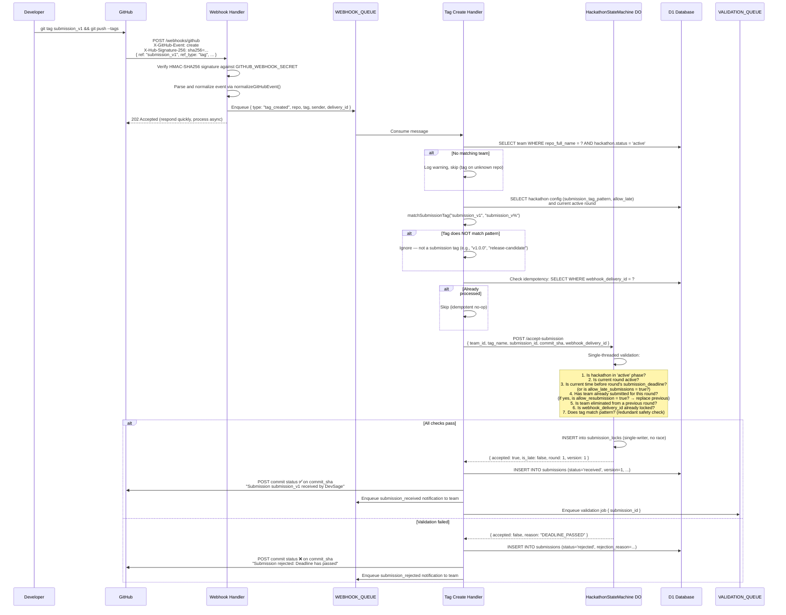

---

## Exactly-Once Locking

The Durable Object is the critical component that prevents race conditions. GitHub may deliver the same webhook multiple times (at-least-once delivery), and multiple team members could push the same tag simultaneously. The DO serializes all submission attempts through a single-threaded execution context.

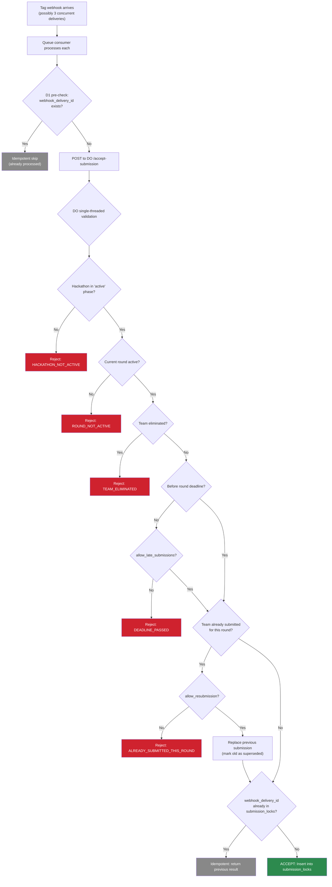

**Why a Durable Object and not a database lock?** D1 (SQLite) does not support row-level locking. Even with a UNIQUE constraint, concurrent INSERTs could create a tiny window where two processes both pass the "already submitted this round" check and both insert. The DO eliminates this entirely — all requests are serialized through one JavaScript execution context. There is zero concurrency inside the DO.

---

## Tag Pattern Matching

Each hackathon has a configurable `submission_tag_pattern` that determines which git tags are treated as submissions. Tags that don't match are silently ignored.

### Pattern Syntax

The pattern uses SQL LIKE-style matching where `%` matches any sequence of characters:

| Pattern | Matches | Does Not Match |
|---------|---------|---------------|
| `submission_v%` | `submission_v1`, `submission_v2`, `submission_v10` | `release_v1`, `submission_`, `v1` |
| `final_%` | `final_v1`, `final_submission`, `final_draft` | `v_final`, `final` |
| `submit-%` | `submit-1`, `submit-draft`, `submit-final` | `submission-1`, `submit` |
| `%` | Any tag (catch-all — not recommended) | Nothing |

### Version Extraction

The version number is extracted from the tag by removing the fixed prefix:

```
Pattern: submission_v%
Tag: submission_v3
→ version_string = "3"
→ version_number = 3

Pattern: final_%
Tag: final_v2
→ version_string = "v2"
→ version_number = 2 (strip leading 'v')
```

If the extracted portion is not numeric, versions are ordered by submission timestamp instead.

---

## Rounds System

Organizers define **rounds** when configuring a hackathon. Each round is a submission window — teams push one git tag per round. Rounds can be **normal** (all teams continue) or **elimination** (some teams are cut after judging).

### Round Configuration

The organizer sets rounds at hackathon creation (or updates them before the hackathon goes `active`):

```typescript
interface HackathonRound {
  id: string;
  hackathon_id: string;
  round_number: number;           // 1, 2, 3...
  name: string;                   // "Round 1", "Semi-Finals", "Finals"
  type: 'normal' | 'elimination';
  advancement_method: 'score_threshold' | 'manual' | null; // null for normal rounds and final round
  score_threshold: number | null; // Only if advancement_method = 'score_threshold'
  submission_deadline: string;    // ISO-8601. Each round has its own deadline.
  status: 'pending' | 'active' | 'judging' | 'completed';
  created_at: string;
  updated_at: string;
}
```

**Shared configuration:** All rounds share the same tag pattern, judge pool, and validation rules. Rounds only differ in deadline, type, and advancement method.

### Round Flow

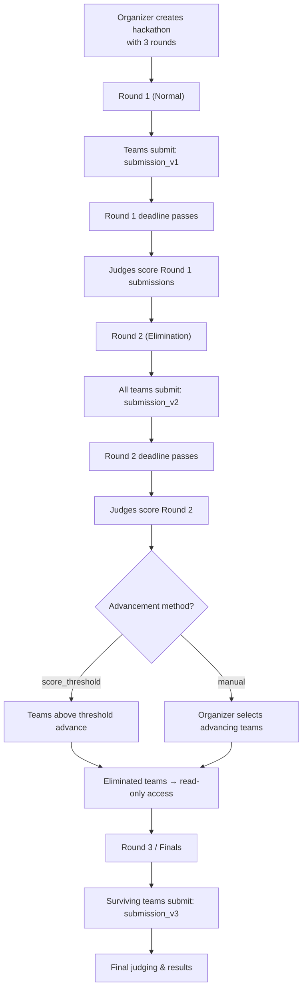

### Elimination Rules

| Advancement Method | How It Works |
|-------------------|--------------|
| `score_threshold` | Teams with an average score ≥ threshold auto-advance. Below = eliminated. |
| `manual` | Organizer reviews scores and manually selects which teams advance to the next round. |

**Eliminated team access:** Eliminated teams retain **read-only access** to the hackathon site. They can view their own submissions, scores, and feedback. They cannot submit new tags or modify artifacts.

### Version = Round

Each submission's `version` number corresponds to the round number. A team pushes one tag per round:

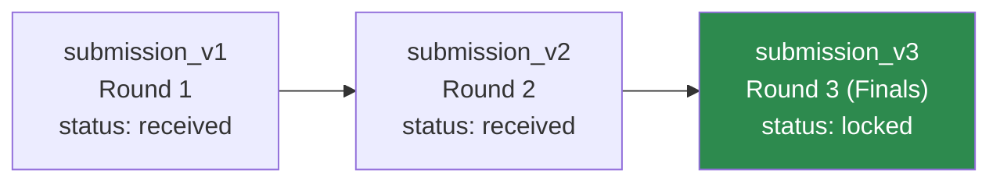

**Rules:**
- Each matching tag creates a new submission record with `round_id` set
- Version numbers correspond to round numbers (version 1 = Round 1, etc.)
- Whether teams can re-submit within a round is configurable via `allow_resubmission` (default: false). If enabled, the latest accepted tag replaces the previous submission for that round. If disabled, only the first accepted tag counts — subsequent tags are rejected with `ALREADY_SUBMITTED_THIS_ROUND`.
- The submission for the current active round is auto-finalized when the round transitions to `judging`
- Only finalized submissions enter the judging pipeline for that round
- Teams eliminated in a previous round cannot submit in subsequent rounds

---

## Multi-Artifact Submissions

Beyond the tagged code, a submission can include additional artifacts that give judges more context.

### Artifacts

| Artifact | Source | Required | Storage | Phase |
|----------|--------|----------|---------|-------|
| **Tagged code** | Git tag on linked repo | Yes (this IS the submission) | Referenced by `commit_sha` — lives in GitHub | Phase 1 |
| **README** | `README.md` at repo root at the tagged commit | Configurable (`require_readme`) | Fetched from GitHub API at validation time, cached in D1 | Phase 1 |
| **Demo URL** | Submitted by team leader via API | Configurable (`require_demo_url`) | Stored in `submissions.demo_url` | Phase 1 |
| **Presentation deck** | Uploaded by team leader (PDF/PPTX, max 50MB) | No | Uploaded to R2: `submissions/{submission_id}/deck.{ext}` | **Phase 2** |
| **Screenshots** | Uploaded by team leader (PNG/JPG, max 5MB each, max 5) | No | Uploaded to R2: `submissions/{submission_id}/screenshots/` | **Phase 2** |

> **Phase 2 Note:** Presentation deck and screenshot uploads are deferred to Phase 2. Phase 1 supports tagged code, README (auto-fetched), and demo URL only. The DB schema includes the columns for forward compatibility, but the upload endpoints are not implemented in Phase 1.

### Attaching Artifacts (Phase 1)

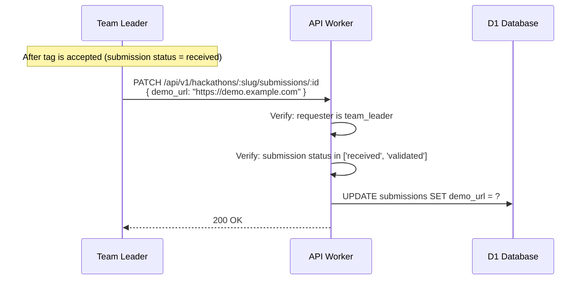

### Attaching Artifacts (Phase 2 — Deferred)

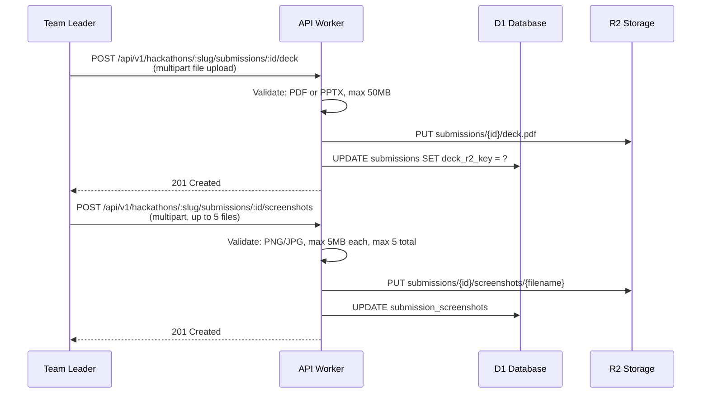

**Artifacts are editable until the submission is finalized (status = `locked`).** After finalization, all artifacts are frozen.

---

## Automated Validation

After a submission is accepted by the DO and written to D1, an asynchronous validation job runs. Validation checks are configurable per hackathon.

### Validation Pipeline

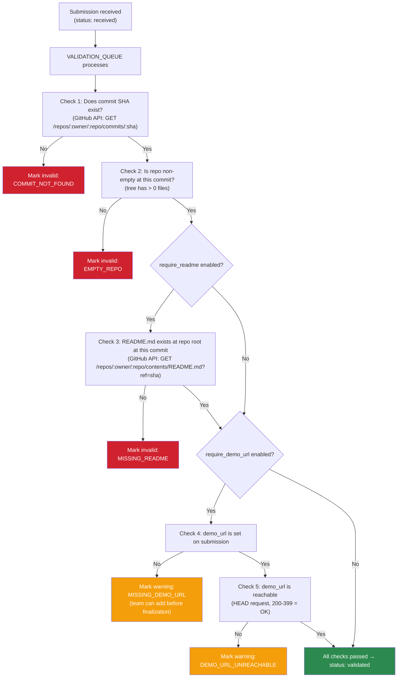

### Validation Result Storage

```typescript
interface ValidationResult {
  submission_id: string;
  checks: {
    name: string;           // "commit_exists", "readme_exists", "demo_url_reachable"
    status: 'passed' | 'failed' | 'warning' | 'skipped';
    message: string | null; // Human-readable detail
  }[];
  overall_status: 'passed' | 'failed' | 'warnings';
  validated_at: string;     // ISO-8601
}
```

Validation results are stored as a JSON column on the submission record (`validation_result`). The frontend displays a checklist showing which checks passed, failed, or have warnings.

**Validation does not block submission acceptance.** The DO locks the submission immediately. Validation runs asynchronously and updates the status from `received` to `validated` or `invalid`. This means a submission is never lost due to a slow GitHub API call.

---

## Submission States

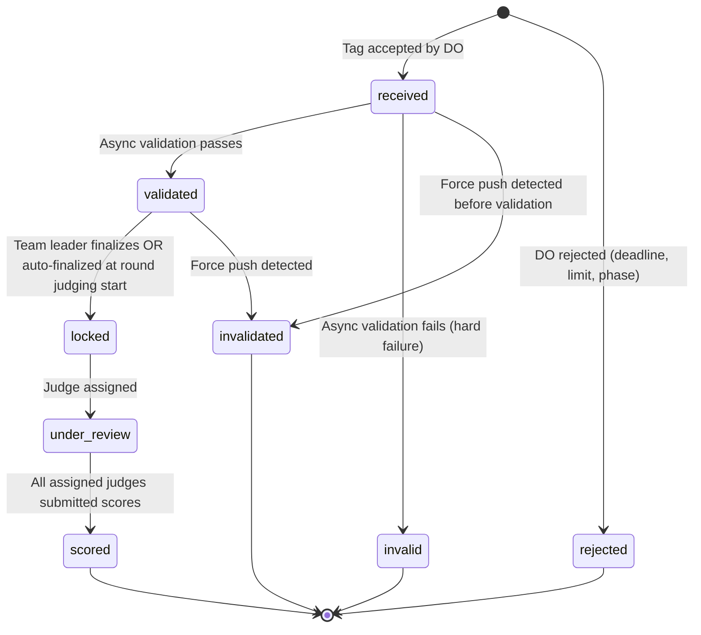

| Status | Description | Mutable? |
|--------|-------------|----------|
| `received` | Tag accepted by DO, written to D1. Validation pending. | Yes — team can add artifacts |
| `validated` | Async validation passed all checks. | Yes — team can add/update artifacts |
| `invalid` | Async validation failed (commit not found, empty repo, missing README). | No — terminal |
| `rejected` | DO rejected the submission (wrong phase, deadline, limit). | No — terminal |
| `locked` | Finalized as the team's submission for judging. All artifacts frozen. | No — immutable |
| `under_review` | At least one judge has been assigned. | No |
| `scored` | All assigned judges have submitted scores. | No |
| `invalidated` | Force push detected after acceptance — submission integrity compromised. | No — terminal |
| `superseded` | Replaced by a newer submission in the same round (when `allow_resubmission` is enabled). | No — terminal |

---

## Force Push Detection

If a team force-pushes to the branch that their submission tag points to, the commit SHA may no longer exist or may point to different code than what was originally tagged. DevSage detects this and flags the submission.

### Detection Flow

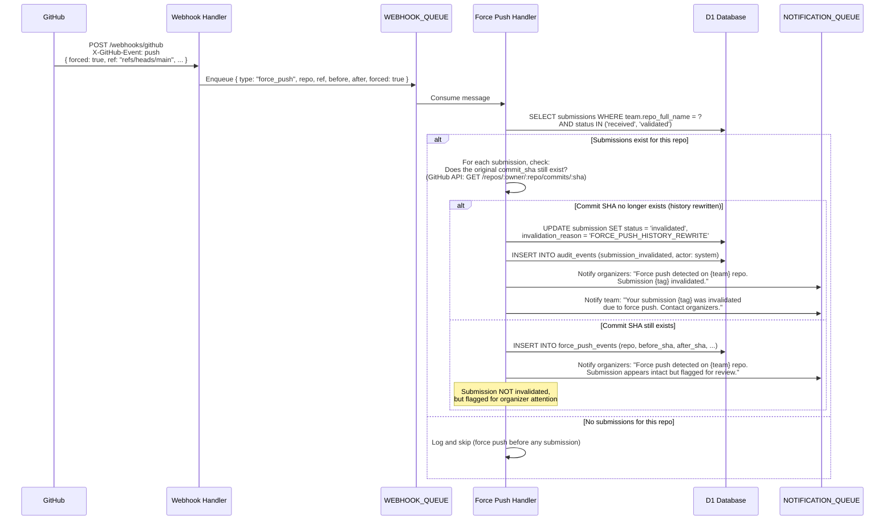

### Force Push Severity

| Scenario | Action | Severity |
|----------|--------|----------|
| Force push, submission commit SHA is gone | Auto-invalidate submission | Critical — submission integrity lost |
| Force push, submission commit SHA still exists | Flag for organizer review, do not invalidate | Warning — commit exists but history changed |
| Force push before any submission | Log event, no action | Informational |
| Force push after hackathon enters `judging` | Flag for organizer review, submission already locked | Warning — cannot affect locked submission |

---

## Late Submission Handling

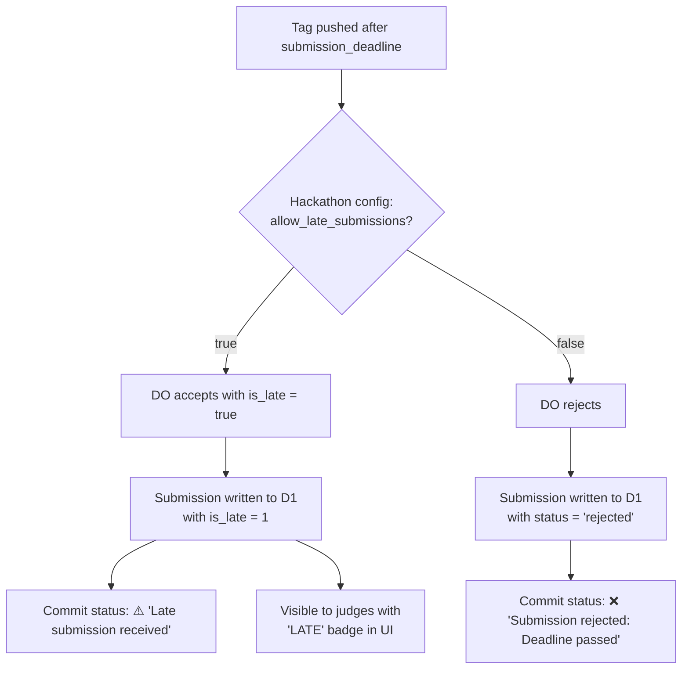

**Late submission timestamp:** The `submitted_at` field uses the timestamp from the GitHub webhook event (`created_at` on the tag create event), NOT the server receive time. This prevents clock skew between GitHub and Cloudflare from causing unfair rejections. If the GitHub timestamp is before the deadline but the server receives it after, the submission is treated as on-time.

**How judges see late submissions:** Late submissions appear in the judging UI with a "LATE" badge. The organizer decides whether to include them in scoring or exclude them. The platform does not automatically penalize late submissions — that's an organizer policy decision.

---

## Deadline Enforcement

Two layers enforce the submission deadline:

### Layer 1: Durable Object (Real-Time)

Every submission attempt goes through the DO, which checks the current time against the **current round's** `submission_deadline`. The DO has access to the hackathon config and round definitions, and performs the check atomically with the locking operation.

### Layer 2: Round Transition (State Change)

When a round transitions from `active` to `judging`, the DO stops accepting submissions for that round. Any tag webhook that arrives after the transition gets `ROUND_NOT_ACTIVE`.

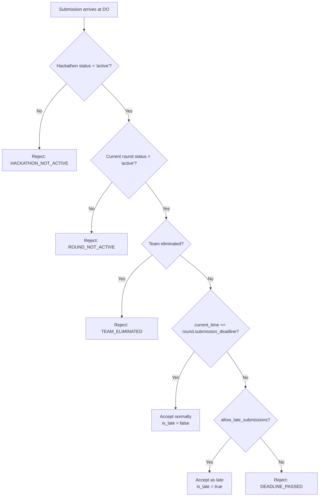

**Why two layers?** The deadline check (layer 1) handles the common case during the round's `active` period. The round transition (layer 2) is the hard stop — once the round moves to `judging`, no submissions are accepted regardless of `allow_late_submissions`. This prevents edge cases where a late-allowing round keeps accepting submissions indefinitely.

---

## Commit Status Posting

After processing a submission, the Worker posts a commit status back to GitHub via the GitHub API. This appears as a check on the tagged commit in GitHub's UI.

| Outcome | GitHub Status | Description Text |
|---------|-------------|-----------------|
| Accepted (on time) | `success` | "Submission {tag_name} received by DevSage" |
| Accepted (late) | `success` | "Late submission {tag_name} received by DevSage (after deadline)" |
| Rejected (deadline) | `failure` | "Submission rejected: Deadline has passed" |
| Rejected (limit) | `failure` | "Submission rejected: Maximum submissions reached" |
| Rejected (phase) | `failure` | "Submission rejected: Hackathon is not in active phase" |
| Validation failed | `failure` | "Submission validation failed: {reason}" |
| Processing | `pending` | "Submission being processed by DevSage..." |

**Commit status posting is fail-open.** If the GitHub API call fails (rate limit, network error, token expired), the submission is still recorded in D1. The commit status is a convenience notification, not a critical operation. Failures are logged as warnings.

### GitHub API Call

```
POST /repos/{owner}/{repo}/statuses/{sha}
Authorization: Bearer {team_elevated_token}
{
  "state": "success" | "failure" | "pending",
  "description": "...",
  "context": "DevSage Submission",
  "target_url": "https://{slug}.devsage.org/submissions/{id}"
}
```

---

## Version Comparison

Judges and team members can compare submission versions across rounds. Instead of building a custom diff viewer, the platform links directly to GitHub's compare view.

### How It Works

1. Each submission pins a `commit_sha` at acceptance time
2. To compare Round 1 vs Round 2 submissions, the UI generates a GitHub compare URL:
   ```
   https://github.com/{owner}/{repo}/compare/{base_sha}...{head_sha}
   ```
3. The link opens in a new tab — GitHub provides syntax-highlighted diffs natively

### API

```
GET /api/v1/hackathons/:slug/submissions/:id/compare?base_round=1
→ 200 { ok: true, data: { compare_url: "https://github.com/..." } }
```

**Access control:** Team members can compare their own submissions in any phase. Judges can compare during `judging` and `completed` phases. Organizers can compare in any phase.

---

## Submission Finalization

Before each round's judging begins, the team's submission for that round must be finalized.

### Auto-Finalization (Per Round)

When a round transitions from `active` to `judging`, the team's submission for that round is auto-finalized:

1. For each team with a validated submission in this round:
2. Mark it as `is_final = true`, status = `locked`
3. Audit event: `submission_auto_finalized` (actor: system, round: N)

Since each team submits only one tag per round, there is no need for manual version selection — the submission for the round is the one that gets finalized.

Teams with only `invalid` or `rejected` submissions for a round have no finalized submission and are excluded from that round's judging.

### Manual Finalization (Edge Case)

In rare cases, the team leader can finalize their submission before the round deadline (e.g., to signal they're done and lock artifacts):

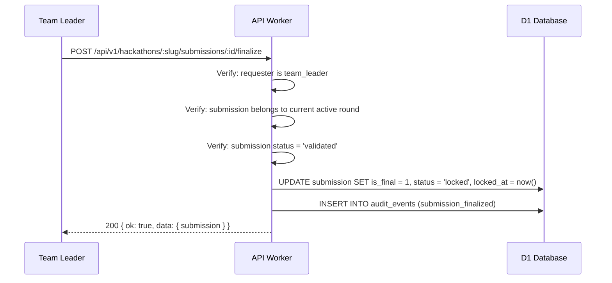

---

## Idempotency

Multiple layers prevent duplicate submission processing. GitHub uses at-least-once delivery, so the same webhook may arrive multiple times.

| Layer | Mechanism | Deduplication Key |
|-------|-----------|-------------------|
| Webhook handler | Checks `X-GitHub-Delivery` header against recent deliveries | `webhook_delivery_id` |
| Queue consumer (D1 pre-check) | `SELECT WHERE webhook_delivery_id = ?` before calling DO | `webhook_delivery_id` |
| Durable Object | `UNIQUE(webhook_delivery_id)` in `submission_locks` SQLite table | `webhook_delivery_id` |
| D1 submissions table | `UNIQUE(webhook_delivery_id)` constraint | `webhook_delivery_id` |
| D1 submissions table | `UNIQUE(team_id, hackathon_id, tag_name)` constraint | Team + tag combo |
| D1 submissions table | `UNIQUE(team_id, round_id)` constraint (when `allow_resubmission = false`) | One submission per team per round. When resubmission is enabled, old submission is marked `superseded` and constraint is on active submissions only. |

If any layer detects a duplicate, the operation is a no-op — no error is returned, no new record is created.

---

## Submission Queries

### List Submissions for a Hackathon

```
GET /api/v1/hackathons/:slug/submissions
  ?team_id=...           (filter by team)
  &round_id=...          (filter by round)
  &round_number=1        (filter by round number)
  &status=validated      (filter by status)
  &is_final=true         (only finalized submissions)
  &is_late=false         (exclude late submissions)
  &track_id=...          (filter by team's track)
  &limit=20&offset=0
```

**Access control:**
- Organizers: see all submissions across all rounds
- Judges: see finalized submissions for rounds they're assigned to judge
- Team members: see only their own team's submissions (all rounds, including after elimination — read-only)
- Public (during `completed`/`archived`): see finalized submissions from all rounds on the public hackathon site (`{slug}.devsage.org`)

### Get Single Submission

```
GET /api/v1/hackathons/:slug/submissions/:id
→ 200 { ok: true, data: { submission, artifacts, validation_result } }
```

### Submission Response Shape

```typescript
interface Submission {
  id: string;
  team_id: string;
  team_name: string;
  hackathon_id: string;
  round: { id: string; round_number: number; name: string };
  track: { id: string; name: string };
  tag_name: string;
  commit_sha: string;
  commit_message: string;
  commit_author: string;
  branch: string;
  version: number;
  status: SubmissionStatus;
  is_final: boolean;
  is_late: boolean;
  demo_url: string | null;
  deck_r2_key: string | null;
  screenshots: { r2_key: string; filename: string }[];
  validation_result: ValidationResult | null;
  rejection_reason: string | null;
  invalidation_reason: string | null;
  submitted_at: string;     // from GitHub event timestamp
  received_at: string;      // server receive time
  locked_at: string | null;
  webhook_delivery_id: string;
}
```

---

## Edge Cases

### Tag Deleted After Submission

A team pushes `submission_v1`, it's accepted, then they delete the tag in GitHub. DevSage does not care — the submission record pins `commit_sha`. The code at that SHA still exists in GitHub's object store (Git does not garbage-collect referenced objects immediately). The submission remains valid.

### Tag Pushed to Wrong Branch

Tags in Git are not branch-specific — they point to commits, not branches. DevSage records the `branch` field as the repository's default branch at the time of the webhook, but the tag's validity is determined solely by the commit SHA, not the branch.

### Team Pushes Same Tag Name Twice

GitHub does not allow pushing the same tag name twice without deleting it first. If a team deletes `submission_v1` and re-pushes it (pointing to a different commit), GitHub sends a new `create` webhook with a new `delivery_id`. The DO checks the `UNIQUE(team_id, tag_name)` constraint in `submission_locks` and rejects the duplicate tag name. The team should push `submission_v2` instead.

### Submission During Round Transition

A tag webhook arrives at the exact moment a round transitions from `active` to `judging`. The DO handles this atomically — the transition and the submission attempt are serialized. Either:
- The transition happens first → submission rejected (`ROUND_NOT_ACTIVE`)
- The submission is locked first → transition happens after (submission is valid)

There is no in-between state because the DO is single-threaded.

### GitHub API Down During Validation

If the GitHub API is unreachable during async validation (README check, commit verification), the validation job retries up to 3 times with exponential backoff (5s, 15s, 45s). If all retries fail, the submission stays in `received` status with a validation note: "Validation pending — GitHub API unavailable. Will retry." The cron job retries stale validations hourly.

### Very Large Repository

The diff viewer and README fetcher use GitHub's API, which handles large repos natively. However, diffs between commits with >300 changed files are truncated by GitHub's Compare API. In this case, the diff viewer shows a truncated view with a link to the full diff on GitHub.

### Submission Invalidated After Round Closes

If a team's submission for a round is later invalidated (force push) after the round has already moved to `judging`, the team has no valid submission for that round. The organizer can either:
- Revert the round to `active` temporarily to allow a resubmission (if the force push was accidental)
- Exclude the team from that round's judging

---

## Error Codes

| Code | HTTP Status | When |
|------|-------------|------|
| `HACKATHON_NOT_ACTIVE` | 400 | Submission attempt when hackathon is not in `active` phase |
| `ROUND_NOT_ACTIVE` | 400 | Current round is not accepting submissions |
| `TEAM_ELIMINATED` | 403 | Team was eliminated in a previous round |
| `ALREADY_SUBMITTED_THIS_ROUND` | 400 | Team has already submitted for the current round |
| `DEADLINE_PASSED` | 400 | Submission after round deadline with `allow_late_submissions = false` |
| `SUBMISSION_NOT_FOUND` | 404 | Submission ID does not exist |
| `SUBMISSION_LOCKED` | 400 | Attempting to modify a finalized submission |
| `SUBMISSION_ALREADY_FINALIZED` | 400 | Team already has a finalized submission (must un-finalize first) |
| `INVALID_TAG_PATTERN` | 400 | Tag does not match `submission_tag_pattern` |
| `COMMIT_NOT_FOUND` | 400 | Validation: commit SHA does not exist in the repo |
| `EMPTY_REPO` | 400 | Validation: repo has no files at the tagged commit |
| `MISSING_README` | 400 | Validation: `require_readme` enabled but README.md not found |
| `MISSING_DEMO_URL` | 400 | Validation: `require_demo_url` enabled but no demo URL set |
| `DEMO_URL_UNREACHABLE` | 400 | Validation: demo URL returned non-2xx/3xx status |
| `FORCE_PUSH_DETECTED` | 400 | Submission invalidated due to force push |
| `ARTIFACT_TOO_LARGE` | 413 | Uploaded file exceeds size limit |
| `INVALID_ARTIFACT_TYPE` | 400 | Uploaded file is not an accepted format |
| `NOT_TEAM_LEADER` | 403 | Non-leader attempting leader-only action (finalize, attach artifact) |
| `DUPLICATE_WEBHOOK` | 200 | Webhook delivery ID already processed (idempotent, not an error) |

---

## Database Tables

### `submissions` (modified from v2)

| Column | Type | Notes |
|--------|------|-------|
| `id` | TEXT PK | UUID |
| `team_id` | TEXT FK | → teams.id |
| `hackathon_id` | TEXT FK | → hackathons.id |
| `round_id` | TEXT FK | → hackathon_rounds.id |
| `tag_name` | TEXT | e.g., `submission_v1` |
| `commit_sha` | TEXT | Pinned at acceptance. 40-char hex. |
| `commit_message` | TEXT | First line of commit message |
| `commit_author` | TEXT | Git author name |
| `branch` | TEXT | Default branch at submission time |
| `version` | INTEGER | Auto-incrementing per team per hackathon |
| `status` | TEXT | `received`, `validated`, `invalid`, `rejected`, `locked`, `under_review`, `scored`, `invalidated` |
| `is_final` | INTEGER | 0 or 1 |
| `is_late` | INTEGER | 0 or 1 |
| `demo_url` | TEXT | Nullable. Team-provided demo link. |
| `deck_r2_key` | TEXT | Nullable. R2 key for presentation deck. |
| `readme_content` | TEXT | Nullable. Cached README.md content at the tagged commit. |
| `validation_result` | TEXT | JSON. Result of async validation checks. |
| `rejection_reason` | TEXT | Nullable. Why the DO rejected this submission. |
| `invalidation_reason` | TEXT | Nullable. Why this submission was invalidated post-acceptance. |
| `submitted_at` | TEXT | ISO-8601. From GitHub event timestamp. |
| `received_at` | TEXT | ISO-8601. Server receive time. |
| `locked_at` | TEXT | ISO-8601. Nullable. When finalized. |
| `webhook_delivery_id` | TEXT UNIQUE | GitHub webhook delivery ID. Idempotency key. |
| `created_at` | TEXT | ISO-8601 |
| `updated_at` | TEXT | ISO-8601 |

**Indexes:** `team_id`, `hackathon_id`, `round_id`, unique(`team_id`, `round_id`), unique(`team_id`, `hackathon_id`, `tag_name`), unique(`webhook_delivery_id`), `status`, `is_final`.

### `submission_screenshots` (new)

| Column | Type | Notes |
|--------|------|-------|
| `id` | TEXT PK | UUID |
| `submission_id` | TEXT FK | → submissions.id |
| `r2_key` | TEXT | R2 object key |
| `filename` | TEXT | Original filename |
| `size_bytes` | INTEGER | File size |
| `created_at` | TEXT | ISO-8601 |

**Indexes:** `submission_id`.

### `hackathon_rounds` (new)

| Column | Type | Notes |
|--------|------|-------|
| `id` | TEXT PK | UUID |
| `hackathon_id` | TEXT FK | → hackathons.id |
| `round_number` | INTEGER | 1, 2, 3... |
| `name` | TEXT | "Round 1", "Semi-Finals", "Finals" |
| `type` | TEXT | `normal` or `elimination` |
| `advancement_method` | TEXT | `score_threshold`, `manual`, or NULL |
| `score_threshold` | REAL | NULL unless advancement_method = 'score_threshold' |
| `submission_deadline` | TEXT | ISO-8601. Round-specific deadline. |
| `status` | TEXT | `pending`, `active`, `judging`, `completed` |
| `created_at` | TEXT | ISO-8601 |
| `updated_at` | TEXT | ISO-8601 |

**Indexes:** `hackathon_id`, unique(`hackathon_id`, `round_number`).

### `round_results` (new)

| Column | Type | Notes |
|--------|------|-------|
| `id` | TEXT PK | UUID |
| `round_id` | TEXT FK | → hackathon_rounds.id |
| `team_id` | TEXT FK | → teams.id |
| `status` | TEXT | `advanced`, `eliminated` |
| `average_score` | REAL | Average judge score for this round |
| `decided_by` | TEXT | `system` (threshold) or user ID (manual) |
| `decided_at` | TEXT | ISO-8601 |
| `created_at` | TEXT | ISO-8601 |

**Indexes:** `round_id`, `team_id`, unique(`round_id`, `team_id`).

### `force_push_events` (new)

| Column | Type | Notes |
|--------|------|-------|
| `id` | TEXT PK | UUID |
| `hackathon_id` | TEXT FK | → hackathons.id |
| `team_id` | TEXT FK | → teams.id |
| `repo_full_name` | TEXT | `owner/repo` |
| `ref` | TEXT | Branch ref that was force-pushed |
| `before_sha` | TEXT | Previous HEAD |
| `after_sha` | TEXT | New HEAD |
| `affected_submissions` | TEXT | JSON array of submission IDs that may be affected |
| `severity` | TEXT | `critical` (commit gone), `warning` (commit exists), `info` (no submissions) |
| `webhook_delivery_id` | TEXT UNIQUE | Idempotency |
| `created_at` | TEXT | ISO-8601 |

**Indexes:** `hackathon_id`, `team_id`.

---

## Decision Log

| Decision | Choice | Why | Alternatives Considered |
|----------|--------|-----|------------------------|
| Git tags as submission mechanism | No forms, no uploads | Aligns with developer workflow. The repo IS the artifact. Tags are immutable references to commits. No context switching away from git. | Form upload — disconnected from code. API call — requires custom tooling. PR-based — too coupled to branch workflow. |
| Durable Object for locking | Single-writer, zero races | D1/SQLite has no row-level locks. The DO's single-threaded model is the simplest correct solution for exactly-once acceptance. | Database UNIQUE constraints alone — race window between check and insert. Redis-based locks — external dependency, not available on Workers. |
| Async validation (not blocking) | Accept first, validate later | The DO should lock quickly (sub-millisecond). GitHub API calls for README/commit verification take 100ms-2s. Blocking the DO on external API calls would serialize all submissions behind slow network calls. | Synchronous validation — too slow, blocks the DO. Skip validation — miss important checks. |
| Immutable commit SHA | Pinned at acceptance | Even if the team deletes the tag or force-pushes, the recorded SHA preserves what was submitted. Git objects are content-addressed — the SHA is the proof. | Store tag name only — tags can be moved. Store branch — branches are mutable. |
| Force push flags, not auto-rejects | Organizer decides | Force pushes are sometimes legitimate (rebasing before submission). Auto-invalidation only triggers when the commit SHA is provably gone. Ambiguous cases are flagged for human review. | Auto-reject all force pushes — too aggressive, penalizes legitimate rebases. Ignore force pushes — misses tampering. |
| `submitted_at` from GitHub, not server time | Fairness | GitHub's event timestamp reflects when the tag was actually created. Server receive time includes webhook delivery delay (seconds to minutes). Using server time could unfairly reject a submission that was pushed before the deadline. | Server time only — unfair to slow webhooks. Both timestamps — confusing, which one is authoritative? |
| Rounds-based versioning | One submission per round | Organizers define rounds (elimination/normal). Each round has its own submission window and deadline. Version number = round number. Simpler than free-form versioning — teams get one shot per round. | Free-form versioning — confusing, no clear judging boundary. Single submission — too restrictive for multi-round hackathons. |
| GitHub compare links (not custom diff viewer) | Lower complexity | GitHub already provides excellent diff views with syntax highlighting. Building a custom diff viewer adds significant frontend complexity for little benefit. | Custom diff viewer — expensive to build, GitHub does it better. No comparison — judges can't see evolution between rounds. |
| Multi-artifact uploads deferred to Phase 2 | Ship faster | Phase 1 supports tagged code, README (auto-fetched), and demo URL. Deck/screenshot uploads add R2 upload complexity. Schema includes columns for forward compatibility. | Build everything at once — delays Phase 1 launch. |
| Fail-open commit status posting | Non-critical | Commit statuses are a UX convenience (green/red check on GitHub). If the API call fails, the submission is still in D1. Blocking on this would make submissions fragile to GitHub outages. | Fail-closed — submission fails if GitHub API is down. Retry queue — complexity for a non-critical feature. |
