# Team Management

> Complete specification for the DevSage v3 team management system. Covers team creation, invite codes, membership, GitHub repo linking, bot activation, team discovery, skill-based matching, team chat, leader transfer, and dissolution. Any developer should be able to implement the entire team system from this document alone.

---

## Table of Contents

- [Design Goals](#design-goals)
- [Team Lifecycle](#team-lifecycle)
- [Creating a Team](#creating-a-team)
- [Joining a Team](#joining-a-team)
- [Invite Code System](#invite-code-system)
- [Team Discovery](#team-discovery)
- [Skill-Based Matching](#skill-based-matching)
- [Connecting a GitHub Repo](#connecting-a-github-repo)
- [Bot Activation](#bot-activation)
- [Team Member Roles](#team-member-roles)
- [Leader Transfer](#leader-transfer)
- [Removing Members](#removing-members)
- [Leaving a Team](#leaving-a-team)
- [Team Dissolution](#team-dissolution)
- [Team Chat](#team-chat)
- [Team Status and Readiness](#team-status-and-readiness)
- [Validation Rules](#validation-rules)
- [Edge Cases](#edge-cases)
- [Error Codes](#error-codes)
- [Database Tables](#database-tables)
- [Decision Log](#decision-log)

---

## Design Goals

| Goal | Description |
|------|-------------|
| **One team per user per hackathon** | A participant cannot be on multiple teams in the same hackathon. Prevents gaming and simplifies submission attribution. |
| **Invite-code-based joining** | Teams are joined via short alphanumeric codes shared out-of-band (Discord, Slack, in-person). No "request to join" flow — the code is the authorization. |
| **Team discovery** | Solo participants can browse open teams looking for members. Teams can opt into a directory with a pitch, required skills, and open slots. |
| **Skill-based matching** | Participants list their skills in their profile. The platform suggests teams that need those skills, and suggests participants to teams that have gaps. |
| **Repo = identity** | Each team links exactly one GitHub repo. The repo is the team's submission artifact. One repo per team per hackathon — no sharing. |
| **Graceful leadership** | If a leader leaves or is removed, leadership transfers automatically. Teams are never leaderless. |
| **Phase-aware operations** | Team mutations are gated by hackathon phase. No joining after registration closes. No leaving after submissions lock. |

---

## Team Lifecycle

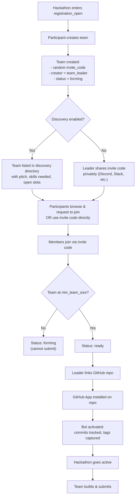

---

## Creating a Team

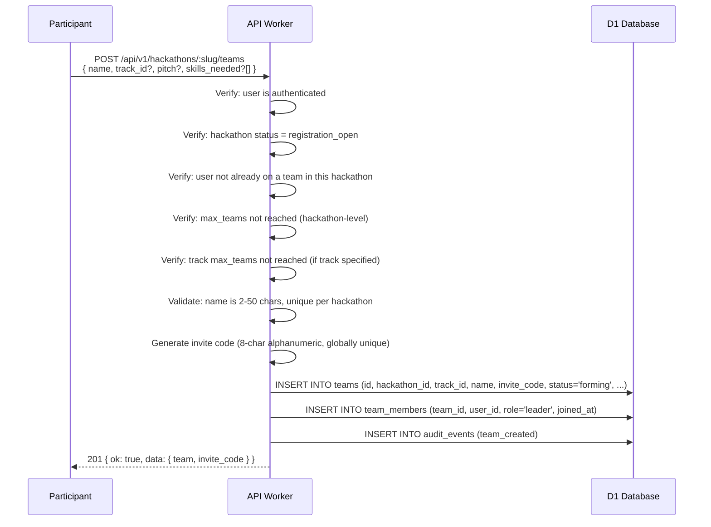

**Request body:**

| Field | Type | Required | Description |
|-------|------|----------|-------------|
| `name` | string | Yes | Team display name. 2-50 chars. Unique per hackathon. |
| `track_id` | string | No | Which track this team competes in. If hackathon has only one track, auto-assigned. If multiple tracks and not specified, returns `TRACK_REQUIRED`. |
| `pitch` | string | No | Short team pitch for the discovery directory. Max 280 chars. |
| `skills_needed` | string[] | No | Skills the team is looking for. Free-text tags, max 10. E.g., `["React", "ML", "UI/UX"]` |
| `discovery_enabled` | boolean | No | Default `true`. Whether the team appears in the discovery directory. |

---

## Joining a Team

### Via Invite Code (Primary)

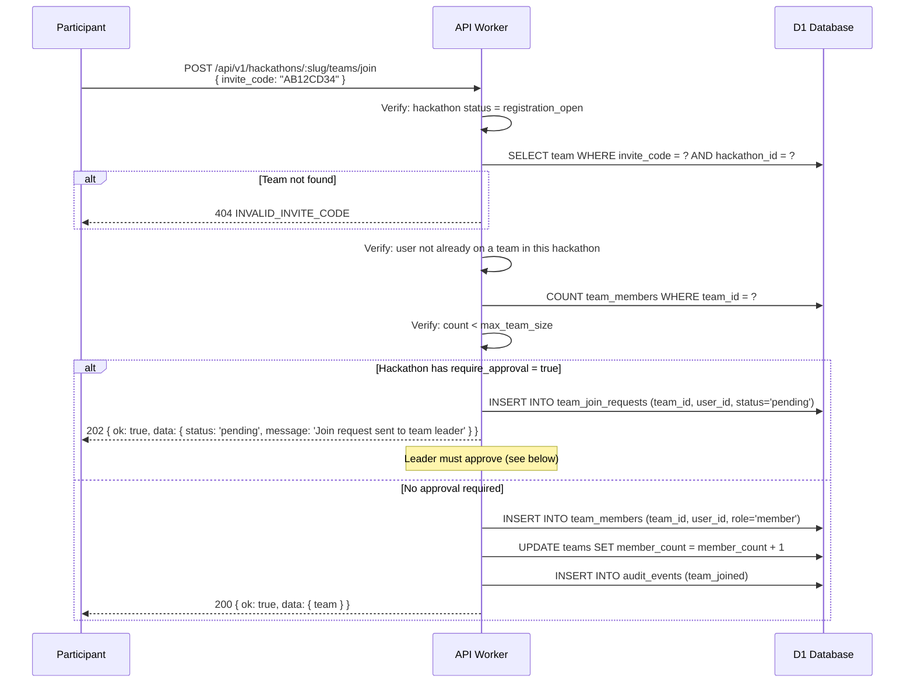

### Via Discovery (Request to Join)

When a team has `discovery_enabled = true`, participants can request to join without an invite code.

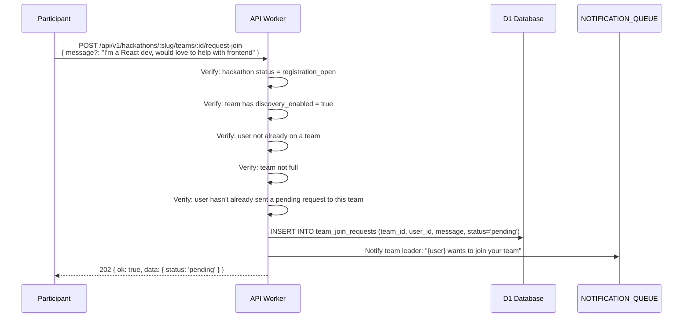

### Approving / Rejecting Join Requests

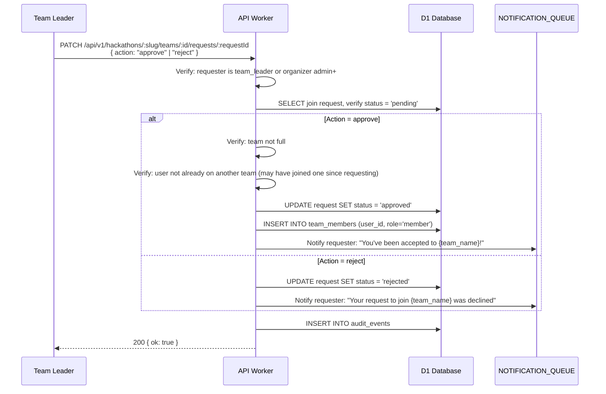

---

## Invite Code System

| Property | Value |
|----------|-------|
| Length | 8 characters |
| Character set | Alphanumeric (A-Z, 0-9) — uppercase only for readability |
| Generation | `crypto.getRandomValues()` mapped to charset |
| Uniqueness | Globally unique across all teams (DB UNIQUE constraint) |
| Expiration | None — valid for the duration of `registration_open` phase |
| Regeneration | Leader can regenerate code (invalidates the old one) |
| Visibility | Only shown to team leader and organizers. Members see "Share your invite code" but not the code itself (leader distributes it). |

### Regenerating an Invite Code

If a code is leaked or compromised, the leader can regenerate:

```
POST /api/v1/hackathons/:slug/teams/:id/regenerate-invite
→ { ok: true, data: { invite_code: "XY98ZW76" } }
```

The old code immediately stops working. Pending requests (if any) are unaffected since they are tied to the team ID, not the code.

---

## Team Discovery

When discovery is enabled for a hackathon, participants without a team can browse a directory of teams looking for members.

### Discovery Directory

```
GET /api/v1/hackathons/:slug/teams/discover
  ?track_id=...          (filter by track)
  &skills=React,Python   (filter by skills needed — comma-separated)
  &has_openings=true     (only teams with open slots)
  &limit=20&offset=0
```

**Response:**

```typescript
interface DiscoverableTeam {
  id: string;
  name: string;
  track: { id: string; name: string };
  pitch: string | null;
  skills_needed: string[];
  member_count: number;
  max_team_size: number;
  open_slots: number;          // max_team_size - member_count
  members: {                   // public member info only
    display_name: string;
    avatar_url: string;
    skills: string[];          // from member's profile
  }[];
  created_at: string;
}
```

**Visibility rules:**
- Only teams with `discovery_enabled = true` appear
- Only during `registration_open` phase
- Teams that are full (`open_slots = 0`) are hidden unless `has_openings=false` is passed
- Team invite codes are NEVER included in discovery responses

### Opting Out

Teams can disable discovery at any time:

```
PATCH /api/v1/hackathons/:slug/teams/:id
{ discovery_enabled: false }
```

---

## Skill-Based Matching

### Participant Skills

Users set their skills on their profile (not per-hackathon):

```
PATCH /api/v1/users/me/profile
{ skills: ["React", "TypeScript", "Machine Learning", "UI/UX Design"] }
```

Skills are free-text tags — no predefined taxonomy. Max 20 per user. Stored lowercase and trimmed for matching.

### Matching Algorithm

The matching is simple and deterministic — no ML, no complex scoring. Just set intersection.

**For a participant looking for a team:**
1. Fetch all discoverable teams in this hackathon with open slots
2. For each team, compute `match_score = |team.skills_needed ∩ user.skills| / |team.skills_needed|`
3. Sort by `match_score` descending, then by `open_slots` descending
4. Return top N results

**For a team leader looking for members:**
1. Fetch all participants in this hackathon who are not on a team
2. For each participant, compute `match_score = |team.skills_needed ∩ user.skills| / |team.skills_needed|`
3. Sort by `match_score` descending
4. Return top N results

```
GET /api/v1/hackathons/:slug/teams/:id/suggested-members?limit=20
GET /api/v1/hackathons/:slug/teams/suggested-for-me?limit=20
```

**Why no complex matching?** Hackathon team formation is social. Algorithmic matching is a suggestion, not a decision. Simple set intersection is transparent, explainable ("matched because you know React and they need React"), and has zero infrastructure cost.

---

## Connecting a GitHub Repo

Only the team leader can link a repository. The repo must be accessible to the user's GitHub account.

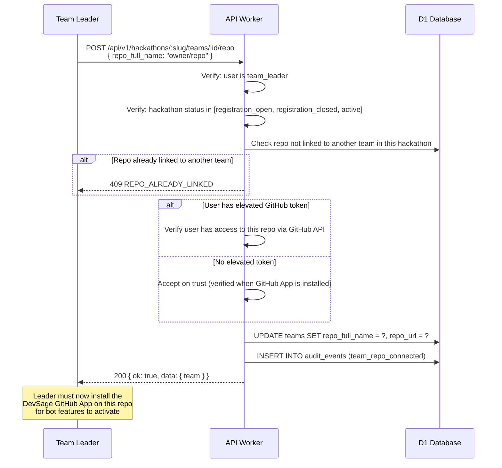

### Unlinking a Repo

The leader can unlink and re-link a different repo, but only before the hackathon enters `active` phase. Once active, the repo is locked.

```
DELETE /api/v1/hackathons/:slug/teams/:id/repo
- Requires: team_leader, hackathon status in [registration_open, registration_closed]
- Effect: Clears repo_full_name, repo_url, sets bot_active = 0
```

**Why lock after active?** Submissions are tied to the repo. Changing repos mid-hackathon would orphan commit history and break submission verification.

---

## Bot Activation

Linking a repo in DevSage is not enough — the team leader must also install the DevSage GitHub App on the repository. The bot activates only when the installation webhook arrives.

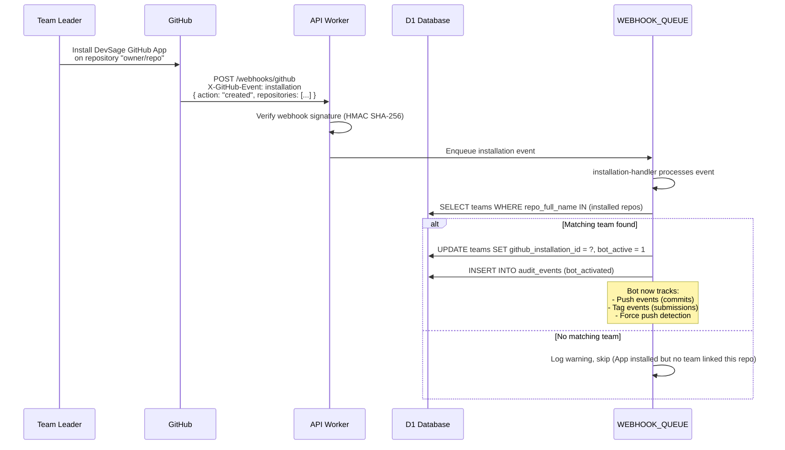

### Bot Deactivation

If the GitHub App is uninstalled from the repo:

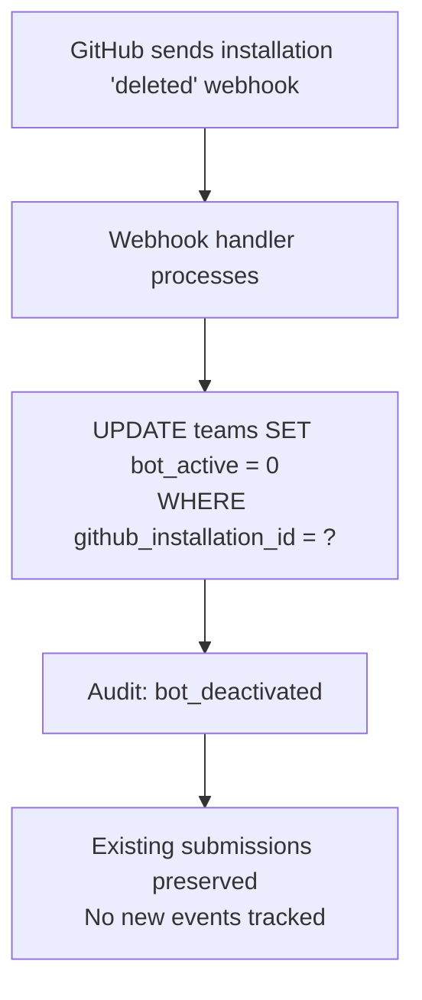

Submissions already captured are NOT deleted. The bot simply stops tracking new events.

---

## Team Member Roles

| Role | In Team | In Hackathon Hierarchy | Permissions |
|------|---------|----------------------|-------------|
| `leader` | One per team | Maps to `team_leader` (index 4) | Create team, link/unlink repo, manage members, approve join requests, regenerate invite code, dissolve team, submit |
| `member` | 0 to (max_team_size - 1) | Maps to `participant` (index 5) | View team, push code to linked repo, see invite code status, leave team |

Only one leader per team at any time. Leadership can be transferred (see below).

---

## Leader Transfer

A team leader can transfer leadership to another member. This is also triggered automatically if the leader leaves or is removed.

### Voluntary Transfer

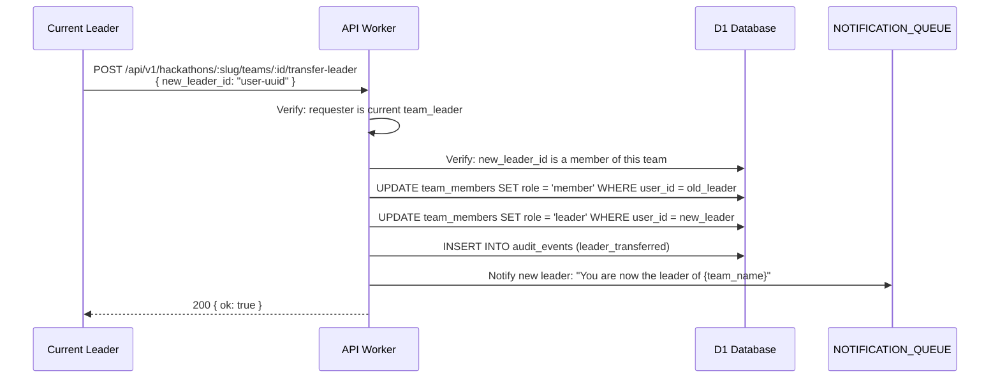

### Automatic Transfer (Leader Leaves)

When the leader leaves or is removed, leadership auto-transfers to the longest-tenured remaining member:

1. Query team members ordered by `joined_at ASC` (earliest first)
2. First non-leader member becomes the new leader
3. If no members remain, the team is dissolved (see [Team Dissolution](#team-dissolution))
4. Audit event: `leader_auto_transferred`

---

## Removing Members

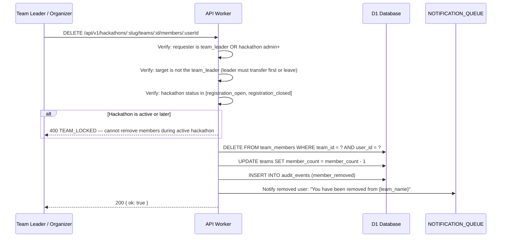

**Why no removal during active phase?** Removing a member during an active hackathon punishes the removed member (they lose their work) and creates attribution confusion (their commits are still in the repo). If there's a genuine issue, the organizer can use moderation tools instead.

---

## Leaving a Team

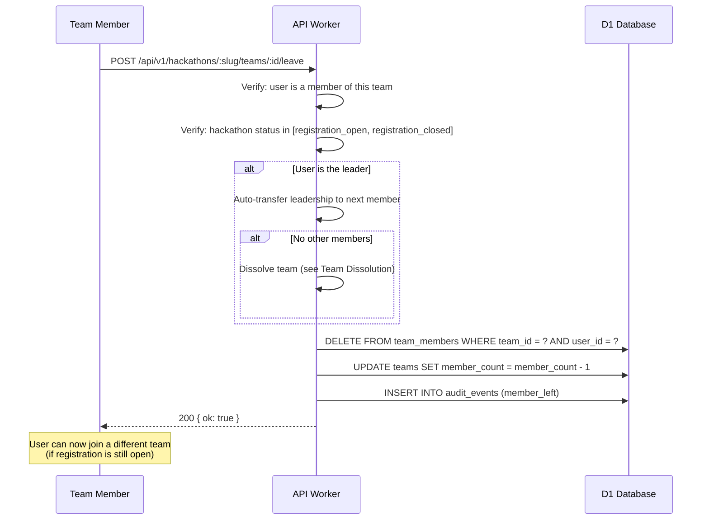

**Phase restrictions:**
- `registration_open`: Can leave freely. Can join another team.
- `registration_closed`: Can leave, but cannot join another team (registration is closed).
- `active` or later: Cannot leave. Team is locked for the duration.

---

## Team Dissolution

A team can be dissolved (deleted) by the leader or an organizer, but only before the hackathon enters `active`.

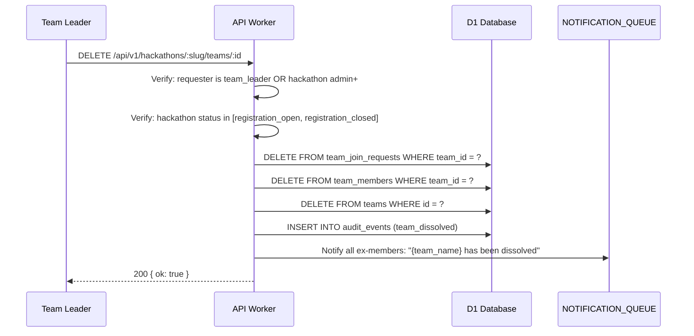

All ex-members are now free to create or join another team (if registration is still open).

**Why not after active?** Teams in `active` or later may have submissions, commits, and audit history. Deleting the team would orphan all that data. Teams in `active`+ can only be archived by an organizer (soft delete — data preserved).

---

## Team Chat

Each team has a built-in chat channel for coordination. This is a lightweight messaging feature — not a full chat platform.

### Design

- Messages are stored in D1, not in a Durable Object (chat history is queryable and persistent)
- Real-time delivery via the WebSocket Gateway DO (see real-time system doc)
- Only team members and hackathon organizers can read/write
- No threading, no reactions, no file uploads — just text messages
- Messages are Markdown-supported, max 2000 characters
- Chat is available from `registration_open` through `completed` (read-only in `archived`)

### API

```
POST /api/v1/hackathons/:slug/teams/:id/messages
{ content: "Hey team, I pushed the auth module. Can someone review?" }
→ 201 { ok: true, data: { message } }

GET /api/v1/hackathons/:slug/teams/:id/messages
  ?limit=50&before=<message_id>    (cursor-based, newest first)
→ 200 { ok: true, data: [messages], meta: { has_more } }
```

### Message Schema

```typescript
interface TeamMessage {
  id: string;           // UUID
  team_id: string;      // FK
  user_id: string;      // FK — who sent it
  content: string;      // Markdown text, max 2000 chars
  created_at: string;   // ISO-8601
}
```

### Real-Time Delivery

When a message is posted:
1. Worker inserts into D1
2. Worker sends to WebSocket Gateway DO for the team's channel (`team:{team_id}`)
3. Connected team members receive the message instantly
4. Disconnected members see it on next page load (standard REST fetch)

**Why not a full chat platform?** DevSage is a hackathon platform, not Slack. Teams already have Discord/Slack for rich communication. Team chat exists for quick in-context coordination ("I pushed", "review this", "demo at 3pm"). Keeping it minimal avoids building and maintaining a chat product.

---

## Team Status and Readiness

Teams have a `status` field that indicates their readiness for the hackathon.

| Status | Meaning | Conditions |
|--------|---------|------------|
| `forming` | Team exists but is not ready | Member count < `min_team_size` OR no repo linked |
| `ready` | Team meets all requirements to participate | Member count >= `min_team_size` AND repo linked AND bot active |
| `incomplete` | Registration closed but team doesn't meet requirements | Team was `forming` when `registration_closed` hit |
| `active` | Team is participating in the active hackathon | Hackathon status = `active` AND team status was `ready` |
| `submitted` | Team has at least one accepted submission | At least one tag captured by the DO |
| `archived` | Hackathon is archived | Hackathon status = `archived` |

**Status transitions are computed, not stored.** The team's status is derived from the hackathon phase + team data (member count, repo, bot, submissions). There is no `status` column in the teams table — it's calculated at query time.

### Readiness Checklist (Frontend)

The frontend shows a readiness checklist to the team:

```typescript
interface TeamReadiness {
  has_minimum_members: boolean;
  has_repo: boolean;
  has_bot: boolean;
  has_track: boolean;
  all_ready: boolean;       // AND of all above
  blockers: string[];       // human-readable: ["Need 1 more member", "Link a GitHub repo"]
}
```

```
GET /api/v1/hackathons/:slug/teams/:id/readiness
→ 200 { ok: true, data: { readiness } }
```

---

## Validation Rules

| Rule | When Enforced | How |
|------|--------------|-----|
| Team name: 2-50 characters | Creation, rename | Zod schema validation |
| Team name: unique per hackathon | Creation, rename | DB UNIQUE constraint on `(hackathon_id, name)` |
| One team per user per hackathon | Create, join | DB query check before insert |
| Team creation only during `registration_open` | Create | Hackathon status check |
| Team join only during `registration_open` | Join | Hackathon status check |
| Team size <= `max_team_size` | Join | Count check before insert |
| `max_teams` not exceeded | Create | Count check before insert |
| Track `max_teams` not exceeded | Create (if track specified) | Count check before insert |
| Repo unique per hackathon | Link repo | DB UNIQUE constraint on `(hackathon_id, repo_full_name)` |
| Repo cannot change after `active` | Unlink/relink | Hackathon status check |
| Members cannot be removed after `active` | Remove | Hackathon status check |
| Members cannot leave after `active` | Leave | Hackathon status check |
| Team cannot be dissolved after `active` | Dissolve | Hackathon status check |
| Invite code: 8 chars, alphanumeric, globally unique | Generation | `crypto.getRandomValues()` + DB UNIQUE constraint |
| Pitch: max 280 characters | Create, update | Zod schema validation |
| Skills needed: max 10 tags | Create, update | Zod schema validation |
| Skills per user: max 20 | Profile update | Zod schema validation |
| Chat message: max 2000 chars, Markdown | Send message | Zod schema validation |

---

## Edge Cases

### User Joins Team, Then Team Reaches Max — Concurrent Requests

Two users submit join requests simultaneously when only one slot remains. Both pass the count check (`count < max_team_size`) because neither insert has committed yet.

**Mitigation:** The `team_members` table has no built-in concurrency control for this (D1/SQLite doesn't support row-level locks). Instead:
1. After inserting the new member, re-count team members
2. If count > `max_team_size`, the latest insert (by `joined_at`) is rolled back
3. Return `TEAM_FULL` to the second joiner

This is a rare race condition (two people joining the exact same millisecond), and the rollback approach is simple and correct.

### Leader Leaves Team with Pending Join Requests

When a leader leaves and leadership auto-transfers:
1. Pending join requests remain pending — they are tied to the team, not the leader
2. The new leader inherits the ability to approve/reject them
3. Requesters are NOT notified of the leadership change

### Team Created in Wrong Track

The team's track cannot be changed after `registration_closed`. During `registration_open`, the leader can change tracks:

```
PATCH /api/v1/hackathons/:slug/teams/:id
{ track_id: "new-track-id" }
```

This is allowed because no submissions exist yet and track-specific judging hasn't started.

### GitHub App Installed Before Repo Linked

If the DevSage GitHub App is installed on a repo but no team has linked that repo yet, the installation webhook is processed but no team is updated. When a team later links the repo, the Worker checks if the GitHub App is already installed (via GitHub API or cached installation records) and sets `bot_active = 1` immediately.

### Team Name Collision After Rename

A team leader renames their team to a name already taken by another team in the same hackathon. The DB UNIQUE constraint on `(hackathon_id, name)` rejects the update → `TEAM_NAME_TAKEN`.

### User Account Deleted While on a Team

When a user's account is deleted (see authentication doc), the account deletion cascade:
1. Removes them from all teams via `DELETE FROM team_members WHERE user_id = ?`
2. If they were a leader, auto-transfers leadership to the next member
3. If they were the only member, the team is dissolved (if pre-active) or archived (if active+)

---

## Error Codes

| Code | HTTP Status | When |
|------|-------------|------|
| `TEAM_NOT_FOUND` | 404 | No team with this ID in this hackathon |
| `TEAM_NAME_TAKEN` | 409 | Team name already exists in this hackathon |
| `TEAM_FULL` | 400 | Team has reached `max_team_size` |
| `MAX_TEAMS_REACHED` | 400 | Hackathon or track has reached its team cap |
| `ALREADY_ON_TEAM` | 400 | User is already a member of a team in this hackathon |
| `NOT_ON_TEAM` | 400 | User is not a member of this team (for leave/transfer) |
| `INVALID_INVITE_CODE` | 404 | Invite code does not match any team in this hackathon |
| `REGISTRATION_CLOSED` | 400 | Attempting team mutation when hackathon is not in `registration_open` |
| `TEAM_LOCKED` | 400 | Attempting to remove member, leave, or dissolve during `active` or later |
| `REPO_ALREADY_LINKED` | 409 | Repo is already linked to another team in this hackathon |
| `REPO_LOCKED` | 400 | Attempting to change repo after hackathon entered `active` |
| `TRACK_REQUIRED` | 400 | Multi-track hackathon requires a track selection |
| `TRACK_NOT_FOUND` | 404 | Specified track does not exist in this hackathon |
| `LEADER_CANNOT_BE_REMOVED` | 400 | Attempting to remove the leader (must transfer leadership first) |
| `JOIN_REQUEST_NOT_FOUND` | 404 | Join request ID does not exist |
| `DUPLICATE_JOIN_REQUEST` | 409 | User already has a pending request to this team |
| `DISCOVERY_DISABLED` | 400 | Attempting to request-join a team that has discovery disabled |
| `NOT_LEADER` | 403 | Action requires team_leader role |
| `TEAM_DISSOLUTION_BLOCKED` | 400 | Cannot dissolve team after `active` phase |

---

## Database Tables

### `teams` (modified from v2)

| Column | Type | Notes |
|--------|------|-------|
| `id` | TEXT PK | UUID |
| `hackathon_id` | TEXT FK | → hackathons.id |
| `track_id` | TEXT FK | → hackathon_tracks.id. Nullable only if single-track hackathon. |
| `name` | TEXT | Display name |
| `pitch` | TEXT | Nullable. Max 280 chars. For discovery directory. |
| `skills_needed` | TEXT | JSON array of skill tags. Nullable. |
| `discovery_enabled` | INTEGER | 0 or 1. Default 1. |
| `repo_full_name` | TEXT | `owner/repo`. Nullable until linked. |
| `repo_url` | TEXT | `https://github.com/owner/repo`. Nullable. |
| `github_installation_id` | INTEGER | Nullable. Set when GitHub App is installed. |
| `bot_active` | INTEGER | 0 or 1. Default 0. |
| `member_count` | INTEGER | Denormalized count. Updated on join/leave. |
| `invite_code` | TEXT UNIQUE | 8-char alphanumeric. Globally unique. |
| `created_by` | TEXT FK | → users.id (the original leader) |
| `created_at` | TEXT | ISO-8601 |
| `updated_at` | TEXT | ISO-8601 |

**Indexes:** `hackathon_id`, unique(`hackathon_id`, `name`), unique(`hackathon_id`, `repo_full_name`), `invite_code` (unique), `track_id`.

### `team_members` (modified from v2)

| Column | Type | Notes |
|--------|------|-------|
| `id` | TEXT PK | UUID |
| `team_id` | TEXT FK | → teams.id |
| `user_id` | TEXT FK | → users.id |
| `role` | TEXT | `leader` or `member` |
| `joined_at` | TEXT | ISO-8601. Used for auto-leadership transfer ordering. |

**Indexes:** unique(`team_id`, `user_id`), `user_id`.

### `team_join_requests` (new)

| Column | Type | Notes |
|--------|------|-------|
| `id` | TEXT PK | UUID |
| `team_id` | TEXT FK | → teams.id |
| `user_id` | TEXT FK | → users.id |
| `message` | TEXT | Nullable. Max 280 chars. Requester's pitch. |
| `status` | TEXT | `pending`, `approved`, `rejected` |
| `reviewed_by` | TEXT FK | → users.id. Nullable. Who approved/rejected. |
| `created_at` | TEXT | ISO-8601 |
| `updated_at` | TEXT | ISO-8601 |

**Indexes:** `team_id`, `user_id`, unique(`team_id`, `user_id`, `status='pending'`) — one pending request per user per team.

### `team_messages` (new)

| Column | Type | Notes |
|--------|------|-------|
| `id` | TEXT PK | UUID |
| `team_id` | TEXT FK | → teams.id |
| `user_id` | TEXT FK | → users.id |
| `content` | TEXT | Markdown. Max 2000 chars. |
| `created_at` | TEXT | ISO-8601 |

**Indexes:** `team_id` + `created_at` (for paginated fetch, newest first).

### `user_skills` (new — on user profile, not per-hackathon)

| Column | Type | Notes |
|--------|------|-------|
| `id` | TEXT PK | UUID |
| `user_id` | TEXT FK | → users.id |
| `skill` | TEXT | Lowercase, trimmed. E.g., `react`, `machine learning` |
| `created_at` | TEXT | ISO-8601 |

**Indexes:** `user_id`, `skill` (for matching queries).

---

## Decision Log

| Decision | Choice | Why | Alternatives Considered |
|----------|--------|-----|------------------------|
| Invite codes, not "request to join" as primary | Invite code is the authorization | Faster team formation. No approval bottleneck. Leader shares code via their existing channels (Discord, Slack). Discovery + request-join is additive for solo participants. | Request-only — slower, leader must be online to approve. Open join (no code) — no access control. |
| One team per user per hackathon | Hard constraint | Prevents gaming (submitting via multiple teams), simplifies submission attribution, and matches real-world hackathon rules. | Multi-team — creates scoring conflicts, unfair advantage. |
| No member removal during active phase | Phase-gated | Removing a member mid-hackathon is punitive and creates attribution confusion (their commits are in the repo). Organizer moderation tools handle bad actors. | Allow removal anytime — too disruptive. Allow with confirmation — still punitive. |
| Repo locked after active | Immutable once hacking starts | Submissions are tied to the repo (tags, commits). Changing repos would orphan submission history and break verification. | Allow repo change — breaks submission integrity. |
| Computed team status, not stored | Derived at query time | Status depends on hackathon phase + team data, which change independently. Storing it would require complex sync logic. Computing it is cheap (one query). | Stored status with triggers — complex, drift-prone. |
| Lightweight chat, not full messaging | Text-only, no threads, no files | DevSage is a hackathon platform, not Slack. Teams already have external communication tools. In-app chat is for quick coordination only. | Full chat — massive scope increase, maintenance burden. No chat — missing useful feature for quick updates. |
| Free-text skills, no taxonomy | User-entered tags | Hackathon skills are too diverse for a predefined taxonomy. Free text is flexible. Lowercase normalization handles basic deduplication ("React" = "react"). | Predefined skill list — too restrictive, always incomplete. Skill ontology — overkill for a matching hint. |
| 8-char uppercase alphanumeric invite codes | Readable, short, unique enough | 36^8 = ~2.8 trillion possible codes. Collision is effectively impossible. Uppercase-only avoids ambiguity (no `l` vs `1`, `O` vs `0` confusion with the restricted charset). | Longer codes — harder to type. UUID — not human-friendly. Short numeric — too few combinations. |
| Auto-leadership transfer | Longest-tenured member | Deterministic, fair, requires no configuration. The person who has been on the team longest is most likely to be invested. | Random — arbitrary. Voting — requires quorum, slow. No transfer — team becomes leaderless, stuck. |
| Discovery is opt-in by default | `discovery_enabled = true` | Most teams benefit from visibility. Teams that want privacy can opt out. Starting with opt-in maximizes the discovery pool. | Opt-out by default — empty discovery directory. Mandatory — no privacy option. |
