# Webhooks & Integrations

> GitHub App integration with asynchronous webhook pipeline, internal event bus, and normalized event model — enabling GitHub repositories to drive submission capture, commit tracking, force push detection, and bot lifecycle management through a structured processing layer.

---

## Table of Contents

- [Design Goals](#design-goals)
- [1. Integration Architecture](#1-integration-architecture)
- [2. Inbound Webhook Pipeline](#2-inbound-webhook-pipeline)
- [3. GitHub Integration](#3-github-integration)
- [4. Event Normalization](#4-event-normalization)
- [5. Queue Processing](#5-queue-processing)
- [6. Push Handler](#6-push-handler)
- [7. Tag Handler](#7-tag-handler)
- [8. Installation Handler](#8-installation-handler)
- [9. Force Push Detection](#9-force-push-detection)
- [10. Commit Status Posting](#10-commit-status-posting)
- [11. Internal Event Bus](#11-internal-event-bus)
- [12. Idempotency & Reliability](#12-idempotency--reliability)
- [13. API Endpoints](#13-api-endpoints)
- [14. Edge Cases](#14-edge-cases)
- [15. Error Codes](#15-error-codes)
- [16. Database Tables](#16-database-tables)
- [17. Decision Log](#17-decision-log)

---

## Design Goals

| Goal | Description |
|------|-------------|
| GitHub-first VCS | GitHub App integration as the sole VCS provider. Provider abstraction exists for future extensibility |
| Sub-50ms ingestion | Webhook endpoint does only verify → normalize → enqueue. Zero D1 writes, zero external API calls in the synchronous path |
| Exactly-once processing | Idempotency at every layer — webhook delivery ID, DB constraints, DO locks — so redelivered webhooks are safe |
| Internal event bus | All system events (not just VCS) flow through a single bus for notifications, audit, and analytics |
| Rounds-aware submissions | Tag handler maps submission tags to hackathon rounds, associating each submission with the correct round |
| Fail-open external calls | GitHub API calls (commit statuses, etc.) use 10-second timeouts and never block submission processing |
| Observable | Every webhook received, processed, failed, or dead-lettered is logged for debugging and audit |

---

## 1. Integration Architecture

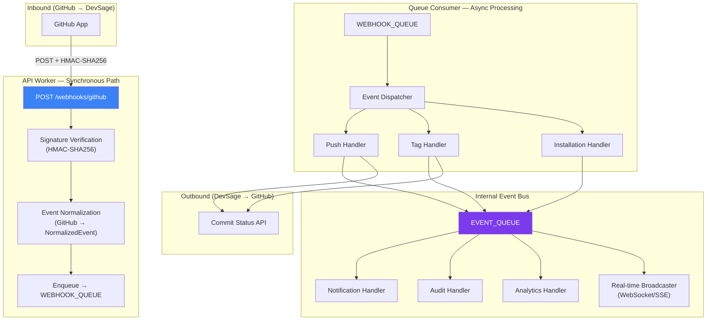

---

## 2. Inbound Webhook Pipeline

The synchronous webhook handler is deliberately minimal. Its only job is to authenticate, normalize, and enqueue. This keeps response times under 50ms and prevents webhook timeouts.

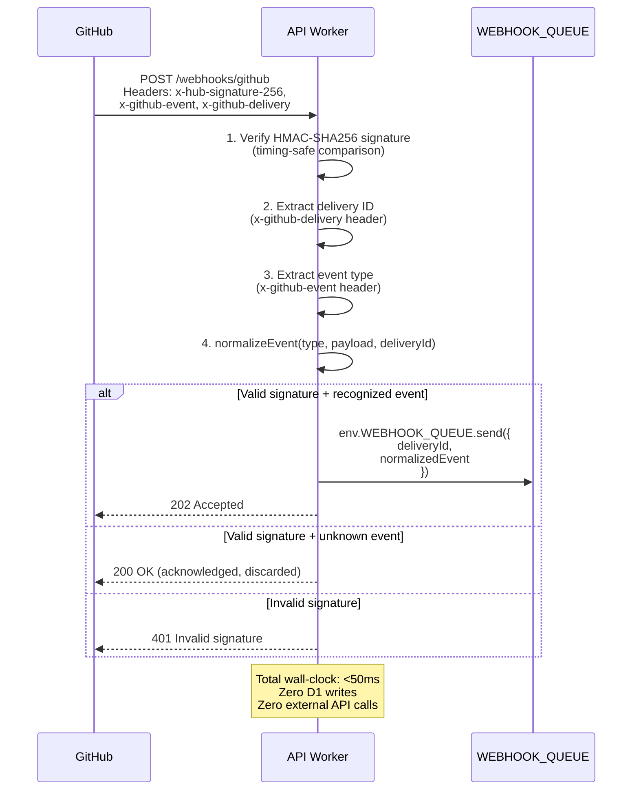

### Signature Verification

| Header | Algorithm | Secret Binding |
|--------|-----------|---------------|
| `x-hub-signature-256` | HMAC-SHA256 | `GITHUB_WEBHOOK_SECRET` |

HMAC verification uses `crypto.subtle` with timing-safe comparison to prevent timing attacks.

---

## 3. GitHub Integration

### GitHub App Configuration

| Property | Value |
|----------|-------|
| Type | GitHub App (not OAuth App) |
| Webhook URL | `https://api.devsage.org/webhooks/github` |
| Permissions | Contents (Read), Metadata (Read), Commit statuses (Write) |
| Subscribed Events | `push`, `create`, `delete`, `installation`, `installation_repositories` |
| Authentication | HMAC-SHA256 (`x-hub-signature-256`) |
| Installation scope | Per-repository (team lead selects repos during install) |

### GitHub Event Mapping

| GitHub Event | Condition | Normalized Type |
|-------------|-----------|----------------|
| `push` | Any push | `push` |
| `create` | `ref_type = 'tag'` | `tag_created` |
| `create` | `ref_type = 'branch'` | Discarded |
| `delete` | `ref_type = 'tag'` | `tag_deleted` |
| `delete` | `ref_type = 'branch'` | Discarded |
| `installation` | `action = 'created'` | `app_installed` |
| `installation` | `action = 'deleted'` | `app_uninstalled` |
| `installation_repositories` | `action = 'added'` | `repos_added` |
| `installation_repositories` | `action = 'removed'` | `repos_removed` |

### GitHub App Authentication for API Calls

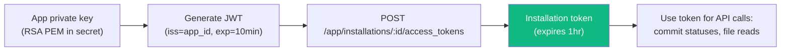

Token caching: Installation tokens are cached in KV with 55-minute TTL (5-minute safety margin before the 1-hour expiry).

---

## 4. Event Normalization

All GitHub-specific payloads are normalized into a unified event model before enqueuing. The normalized model uses a provider-agnostic interface to allow future VCS provider support without changing downstream handlers.

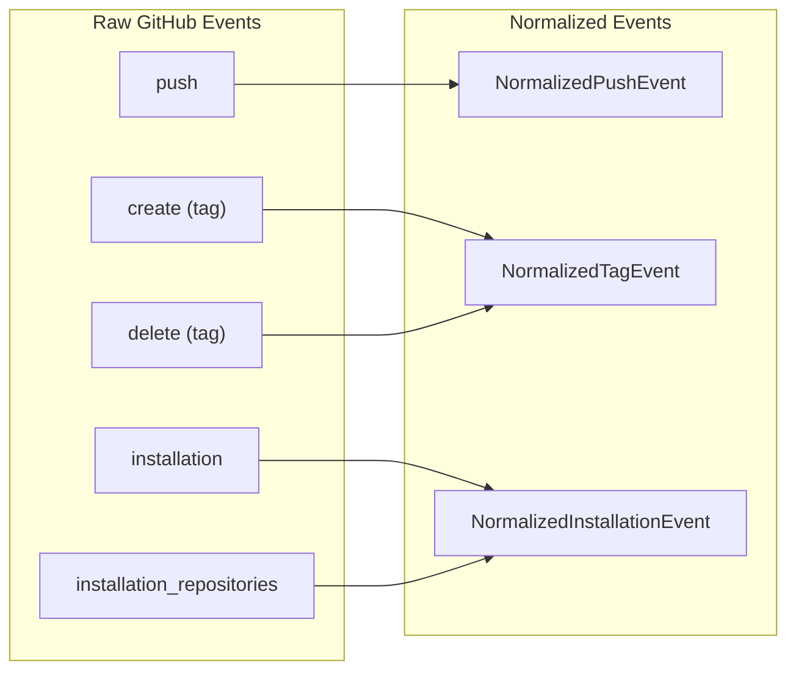

### Normalized Event Types

```typescript
// Base for all normalized events
interface NormalizedEventBase {
  deliveryId: string;          // GitHub's x-github-delivery header (idempotency key)
  provider: 'github';          // Currently GitHub-only. Field exists for future extensibility
  receivedAt: string;          // ISO-8601 when DevSage received the webhook
}

interface NormalizedPushEvent extends NormalizedEventBase {
  type: 'push';
  repoFullName: string;        // "owner/repo"
  branch: string;              // "main", "develop", etc.
  forced: boolean;             // Force push flag
  headSha: string;             // New HEAD after push
  beforeSha: string;           // Previous HEAD before push
  commits: NormalizedCommit[]; // Up to 20 most recent
  pusherLogin: string;         // GitHub username of the pusher
  pusherEmail: string | null;  // Email if available
  compareUrl: string | null;   // GitHub compare URL (before...after)
}

interface NormalizedCommit {
  sha: string;
  message: string;
  authorName: string;
  authorEmail: string;
  timestamp: string;           // ISO-8601
  url: string;                 // Link to commit on GitHub
  added: string[];             // Files added
  modified: string[];          // Files modified
  removed: string[];           // Files removed
}

interface NormalizedTagEvent extends NormalizedEventBase {
  type: 'tag_created' | 'tag_deleted';
  repoFullName: string;
  tagName: string;
  sha: string;                 // Commit the tag points to (empty string for deletes)
  senderLogin: string;
  senderEmail: string | null;
}

interface NormalizedInstallationEvent extends NormalizedEventBase {
  type: 'app_installed' | 'app_uninstalled' | 'repos_added' | 'repos_removed';
  installationId: number;
  repositories: Array<{
    fullName: string;
    private: boolean;
  }>;
  senderLogin: string;
}

type NormalizedEvent =
  | NormalizedPushEvent
  | NormalizedTagEvent
  | NormalizedInstallationEvent;
```

---

## 5. Queue Processing

### Queue Configuration

| Queue | Binding | Purpose | Max Batch | Max Retries | Retry Delay |
|-------|---------|---------|-----------|-------------|-------------|
| `webhook-inbound` | `WEBHOOK_QUEUE` | GitHub webhook processing | 10 | 3 | Exponential (30s, 2min, 10min) |
| `event-bus` | `EVENT_QUEUE` | Internal event distribution | 10 | 3 | Exponential (30s, 2min, 10min) |

### Dispatcher

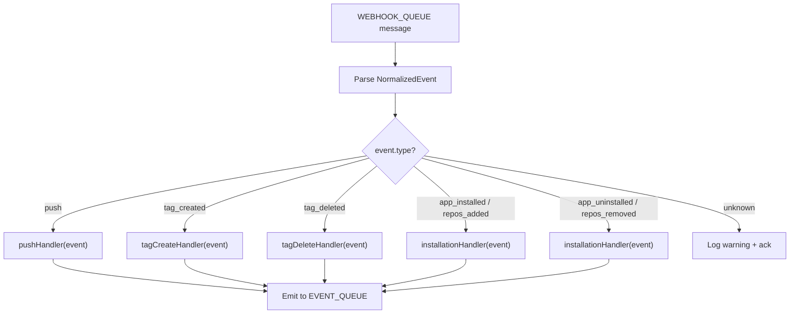

### Dead Letter Handling

After `max_retries` failures:

1. Message is acknowledged (removed from queue to prevent infinite retry).
2. `webhook_deliveries` row updated: `status = 'dead_lettered'`, `error_message` captured.
3. Audit event logged: `webhook.dead_lettered` with delivery ID and error context.
4. Internal event emitted: `system.webhook_dead_lettered` — triggers organizer notification.
5. Dead-lettered webhooks are queryable via API by organisers/co-organisers for debugging.

---

## 6. Push Handler

Processes push events: logs commits to the commit log and detects force pushes.

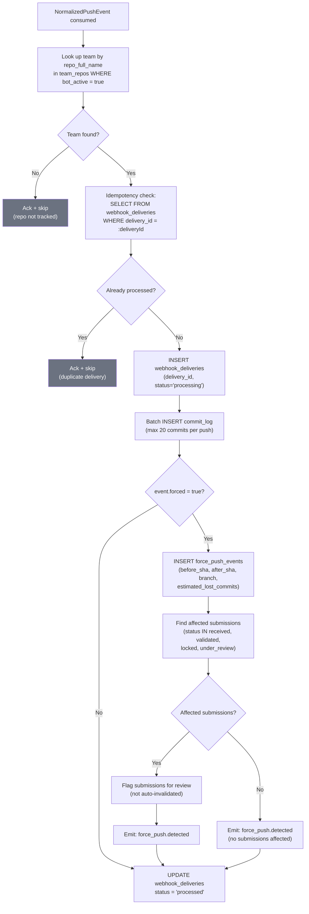

### Commit Log Limits

- Maximum 20 commits stored per push event. If a push contains more (e.g., a large merge), only the 20 most recent are stored.
- Each commit stores: SHA, message, author name, author email, timestamp, files changed counts.
- Commits are linked to the team, hackathon, and webhook delivery for traceability.

---

## 7. Tag Handler

Processes tag creation and deletion events. Tag creation drives the submission pipeline. The handler is **rounds-aware** — it maps each submission tag to the currently active round.

### Tag Create Flow

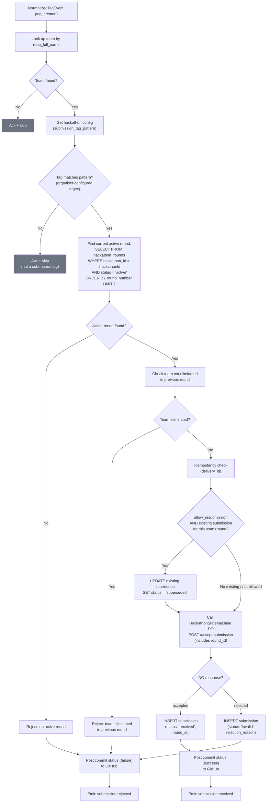

### Round Resolution

1. **Match tag** against the hackathon's organiser-configured `submission_tag_pattern` regex.
2. **Find current active round**: Query `hackathon_rounds` for the round with `status = 'active'` (ordered by `round_number`, limit 1). If no active round exists, reject.
3. **Check elimination**: If the team was eliminated in a prior round (via `round_results` table), reject the submission.
4. **Check resubmission**: If `allow_resubmission` is enabled and the team already has a submission for this round, the existing submission is marked `superseded` and a new one is created. If `allow_resubmission` is disabled and a submission already exists, reject with "already submitted for this round".

### Tag Delete Flow

Tag deletion is logged for audit but does not affect submissions (submissions are immutable once received).

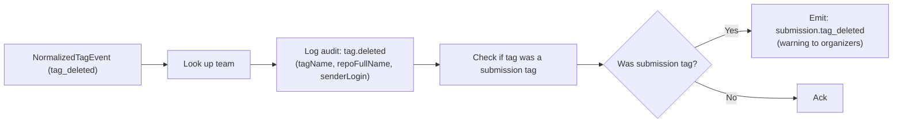

---

## 8. Installation Handler

Manages bot activation when the GitHub App is installed, uninstalled, or repos are added/removed. Only **team leads** install the GitHub App.

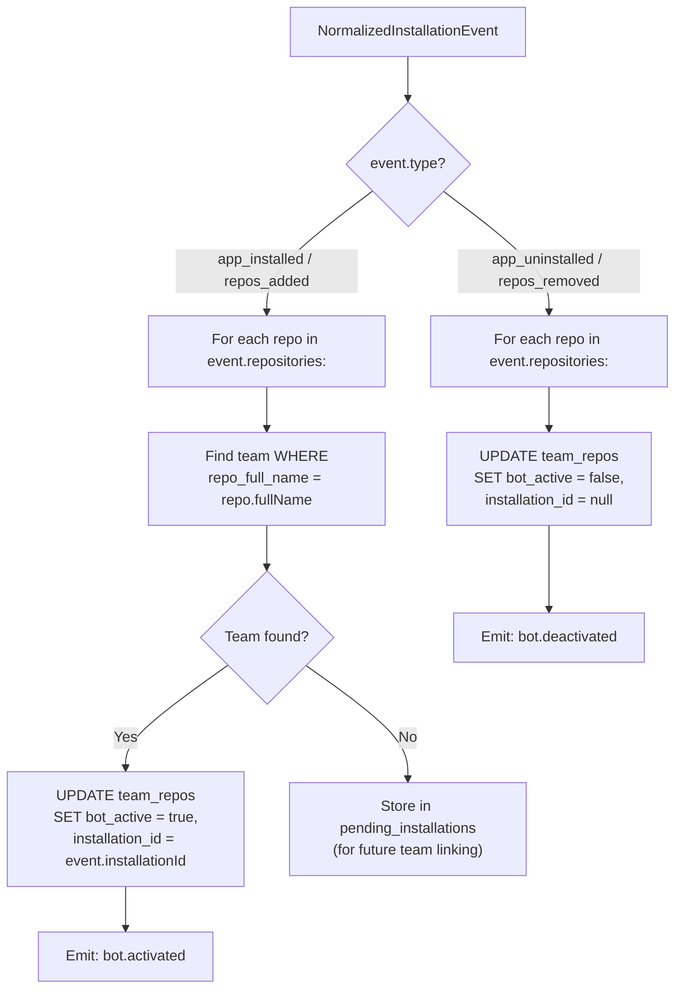

### Pending Installations

When a GitHub App is installed on a repo that hasn't been linked to a team yet, the installation is stored in `pending_installations`. When a team later links that repo, the system checks pending installations and auto-activates the bot.

---

## 9. Force Push Detection

Force pushes are flagged for organizer review, never auto-invalidated. This prevents false positives from legitimate rebases.

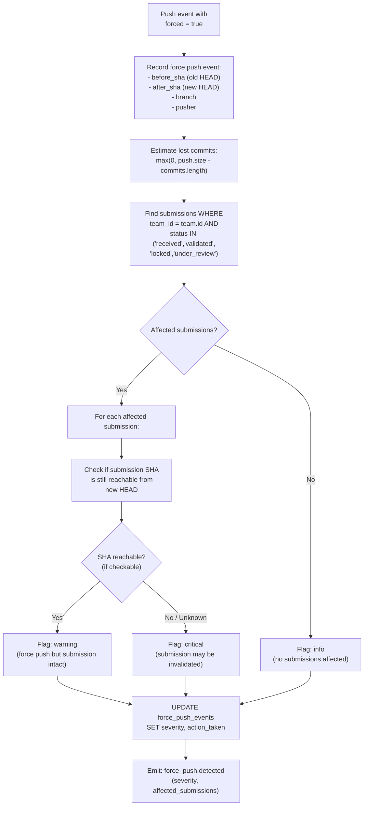

### Why Not Auto-Invalidate

1. **Reachability checks require GitHub API** — which may be rate-limited or unavailable.
2. **Legitimate rebases** are common (squash before submission, cleanup branches).
3. **False positives** would unfairly penalize teams.
4. **Organizers know context** — they can decide whether the force push is suspicious.

### Severity Levels

| Severity | Condition | Organizer Action |
|----------|-----------|-----------------|
| `info` | Force push on branch with no active submissions | No action needed |
| `warning` | Force push but submission SHA still reachable | Review recommended |
| `critical` | Force push and submission SHA may be unreachable | Investigation required |

---

## 10. Commit Status Posting

After processing submissions or running validation, DevSage posts status checks back to GitHub.

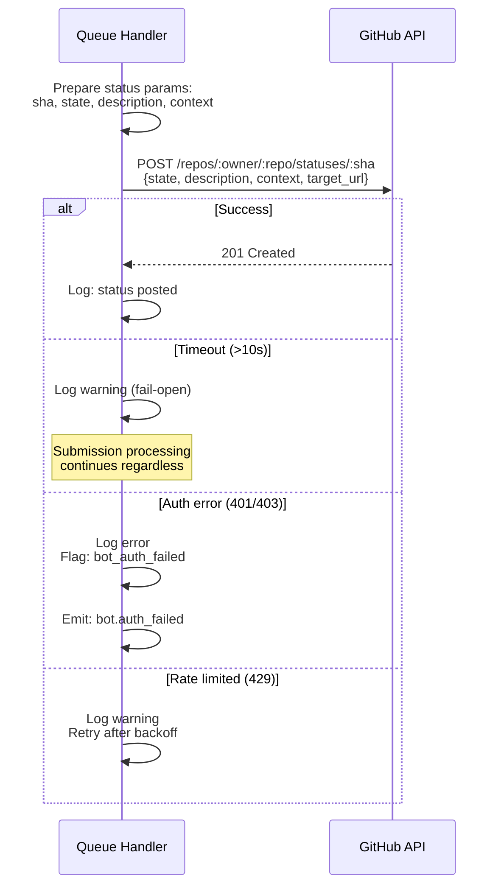

### Status Contexts

| Context | State | When |
|---------|-------|------|
| `devsage/submission` | `success` | Submission tag accepted and recorded |
| `devsage/submission` | `failure` | Submission rejected (deadline, round not active, team eliminated, invalid tag) |
| `devsage/submission` | `pending` | Submission received, validation in progress |
| `devsage/validation` | `success` | Automated validation checks passed |
| `devsage/validation` | `failure` | Automated validation checks failed |

### Commit Status Target URL

The `target_url` in commit statuses points to the submission page on the hackathon's subdomain:

```
https://{slug}.devsage.org/submissions/{submission_id}
```

### Fail-Open Policy

All outbound GitHub API calls follow the fail-open pattern:
- 10-second timeout via `AbortController`.
- Timeouts and 5xx errors are logged but do NOT fail the submission.
- 401/403 errors trigger a `bot.auth_failed` event (installation token may have been revoked).
- 429 rate limits are retried with exponential backoff (up to 3 retries).

---

## 11. Internal Event Bus

All system events — not just VCS webhooks — flow through a unified internal event bus. This decouples event producers from consumers.

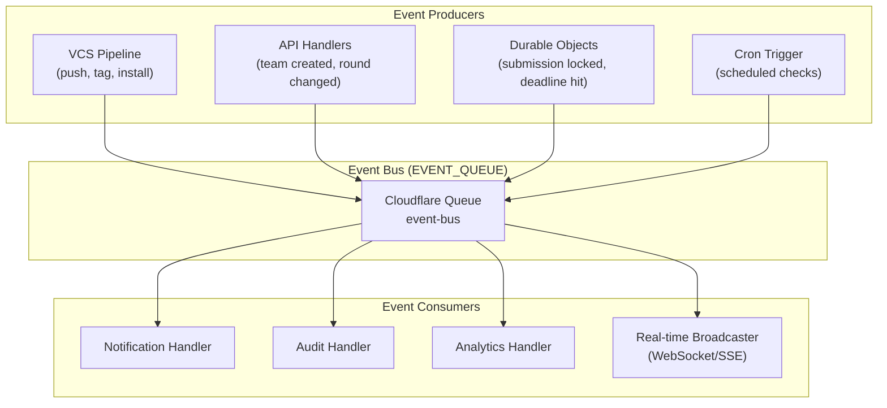

### Internal Event Schema

```typescript
interface InternalEvent {
  id: string;                // UUID
  type: string;              // Dot-notation: "submission.received", "team.created"
  hackathon_id: string;      // Which hackathon (for routing and filtering)
  actor: {
    type: 'user' | 'system' | 'bot' | 'cron';
    id: string;              // User ID or 'system'
    display_name: string;
  };
  payload: Record<string, unknown>;  // Event-specific data
  metadata: {
    source: string;          // "vcs_pipeline", "api", "durable_object", "cron"
    correlation_id: string;  // Links related events (e.g., webhook → submission → notification)
    timestamp: string;       // ISO-8601
  };
}
```

### Event Catalog

| Event Type | Source | Payload (Key Fields) |
|-----------|--------|---------------------|
| `submission.received` | VCS pipeline | team_id, tag_name, sha, round_id |
| `submission.rejected` | VCS pipeline | team_id, tag_name, reason, round_id |
| `submission.finalized` | API | team_id, submission_id, round_id |
| `submission.tag_deleted` | VCS pipeline | team_id, tag_name |
| `force_push.detected` | VCS pipeline | team_id, severity, affected_submissions |
| `bot.activated` | VCS pipeline | team_id, repo_full_name |
| `bot.deactivated` | VCS pipeline | team_id, repo_full_name |
| `bot.auth_failed` | VCS pipeline | team_id, error |
| `team.created` | API | team_id, hackathon_id, team_name |
| `team.member_joined` | API | team_id, user_id |
| `team.repo_linked` | API | team_id, repo_full_name |
| `hackathon.state_changed` | DO / API | hackathon_id, from_state, to_state |
| `hackathon.deadline_warning` | Cron | hackathon_id, deadline_type, minutes_remaining |
| `round.started` | API | hackathon_id, round_id, round_number |
| `round.completed` | API | hackathon_id, round_id, teams_advanced, teams_eliminated |
| `judging.score_submitted` | API | judge_id, submission_id, total_score, round_id |
| `judging.results_published` | API | hackathon_id, round_id, winner_team_ids |
| `system.webhook_dead_lettered` | Queue | delivery_id, error |

---

## 12. Idempotency & Reliability

### Idempotency Keys at Every Layer

| Layer | Key | Mechanism |
|-------|-----|-----------|
| Webhook ingestion | `x-github-delivery` header | Passed through to queue message |
| Queue consumer | `delivery_id` in `webhook_deliveries` | Pre-check query before processing |
| Submission creation | `UNIQUE(webhook_delivery_id)` on submissions | DB constraint prevents duplicates |
| DO submission lock | `UNIQUE(webhook_delivery_id)` in DO SQLite | DO-level constraint |
| Tag + round uniqueness | Conditional: if `allow_resubmission` is off, reject duplicate `(team_id, round_id)` at application level. If on, existing submission marked `superseded` before insert | One active submission per team per round (old ones superseded if resubmission allowed) |

### Delivery Tracking

Every inbound webhook is tracked in `webhook_deliveries`:

```typescript
interface WebhookDelivery {
  id: string;                    // UUID
  delivery_id: string;           // GitHub's x-github-delivery header (idempotency key)
  provider: 'github';            // Currently GitHub-only
  event_type: string;            // Normalized event type
  status: 'received' | 'processing' | 'processed' | 'failed' | 'dead_lettered';
  repo_full_name: string;        // Which repo triggered it
  hackathon_id: string | null;   // Resolved hackathon (null if repo not linked)
  team_id: string | null;        // Resolved team (null if repo not linked)
  payload_hash: string;          // SHA-256 of raw payload (for debugging, not stored raw)
  error_message: string | null;  // Error details if failed
  processing_ms: number | null;  // Processing duration
  attempts: number;              // Number of processing attempts
  received_at: string;           // When the webhook arrived
  processed_at: string | null;   // When processing completed
}
```

### Retry Behavior

- GitHub may redeliver webhooks up to 3 times on its own.
- Cloudflare Queues retry failed messages according to the queue configuration.
- All handlers are safe for redelivery — idempotency checks run before any writes.
- After `max_retries`, messages are dead-lettered (not lost — tracked and queryable).

---

## 13. API Endpoints

### Webhook Ingestion (Public)

```
POST /webhooks/github              # GitHub App webhook receiver
```

### Webhook Delivery History (organiser / co-organiser)

```
GET  /api/v1/hackathons/:slug/webhook-deliveries                  # List deliveries (organiser/co-organiser)
GET  /api/v1/hackathons/:slug/webhook-deliveries/:deliveryId      # Get delivery details (organiser/co-organiser)
POST /api/v1/hackathons/:slug/webhook-deliveries/:deliveryId/retry  # Retry dead-lettered (organiser/co-organiser)
```

### Commit Log

```
GET  /api/v1/hackathons/:slug/teams/:teamId/commits     # List team's commit log (own team members, or organiser/co-organiser)
GET  /api/v1/hackathons/:slug/commits                   # List all commits across teams (organiser/co-organiser)
```

### Force Push Events (organiser / co-organiser)

```
GET  /api/v1/hackathons/:slug/force-pushes              # List force push events (organiser/co-organiser)
PUT  /api/v1/hackathons/:slug/force-pushes/:id/resolve  # Mark as reviewed (organiser/co-organiser)
```

### Bot Status

```
GET  /api/v1/hackathons/:slug/teams/:teamId/bot-status  # Check bot activation (team_lead for own team, organiser/co-organiser)
POST /api/v1/hackathons/:slug/teams/:teamId/bot/check   # Trigger bot health check (team_lead for own team, organiser/co-organiser)
```

---

## 14. Edge Cases

| Scenario | Behavior |
|----------|----------|
| Webhook arrives for repo not linked to any team | Logged in `webhook_deliveries` with `team_id = null`, processing skipped |
| Same tag pushed to two repos linked to the same team | Each produces a separate submission attempt. If `allow_resubmission` is off, second is rejected. If on, first is superseded |
| GitHub App uninstalled after submission received | Submission is preserved. Commit status posting will fail (logged, fail-open). Bot marked inactive |
| Force push on a branch that had a submission tag | Submission is preserved (tags are separate refs). Flagged as `warning` severity for review |
| Tag deleted after submission | Submission is NOT deleted (immutable). Audit event logged. Organizer warned |
| Webhook payload too large (>1MB) | Rejected at Cloudflare level (Workers request size limit). GitHub receives 413 |
| Duplicate delivery ID from GitHub | Idempotency check catches it. Second delivery is acked and skipped |
| Queue consumer crashes mid-processing | Message returned to queue for retry. Idempotency check prevents duplicate writes |
| Team changes linked repo | Old repo's bot_active set to false. New repo checked for pending installations |
| Webhook secret rotated | Old secret continues to work for 24 hours (dual-accept window). New secret takes priority |
| GitHub rate limit (5000 req/hr) hit during status posting | Queued for retry with exponential backoff. Submission processing is unaffected |
| Submission tag when no round is active | Rejected with "no active round" reason. Commit status posted as failure |
| All rounds completed or pending | Rejected with "no active round" reason. Only rounds with `status = 'active'` accept submissions |
| Team resubmits when `allow_resubmission` is off | Rejected with "already submitted for this round" reason |
| Team resubmits when `allow_resubmission` is on | Old submission marked `superseded`, new submission created |
| Tag submitted by eliminated team | Rejected with "team eliminated" reason. Team was eliminated in a previous round |
| Team lead installs GitHub App before team is linked to repo | Installation stored in `pending_installations`. Auto-linked when team links that repo |

---

## 15. Error Codes

| Code | HTTP | Condition |
|------|------|-----------|
| `WEBHOOK_INVALID_SIGNATURE` | 401 | HMAC signature verification failed |
| `WEBHOOK_PAYLOAD_TOO_LARGE` | 413 | Payload exceeds 1MB limit |
| `WEBHOOK_PARSE_ERROR` | 400 | Payload could not be parsed as JSON |
| `DELIVERY_NOT_FOUND` | 404 | Webhook delivery ID does not exist |
| `DELIVERY_NOT_RETRYABLE` | 400 | Only dead-lettered deliveries can be retried |
| `BOT_NOT_INSTALLED` | 400 | GitHub App not installed on the linked repository |
| `BOT_AUTH_FAILED` | 502 | GitHub returned auth error when posting status |
| `REPO_NOT_LINKED` | 400 | Repository is not linked to any team in this hackathon |
| `COMMIT_LOG_NOT_FOUND` | 404 | No commit log entries for this team |
| `FORCE_PUSH_NOT_FOUND` | 404 | Force push event ID does not exist |
| `FORCE_PUSH_ALREADY_RESOLVED` | 409 | Force push event already marked as reviewed |

---

## 16. Database Tables

### `webhook_deliveries`

Tracks every inbound webhook from GitHub.

| Column | Type | Constraints | Description |
|--------|------|-------------|-------------|
| `id` | TEXT | PK, UUID | Internal delivery record ID |
| `delivery_id` | TEXT | UNIQUE, NOT NULL | GitHub's `x-github-delivery` header (idempotency key) |
| `provider` | TEXT | NOT NULL, DEFAULT 'github' | VCS provider (currently always 'github') |
| `event_type` | TEXT | NOT NULL | Normalized event type |
| `status` | TEXT | NOT NULL, DEFAULT 'received' | received, processing, processed, failed, dead_lettered |
| `repo_full_name` | TEXT | NOT NULL | Repository identifier (owner/repo) |
| `hackathon_id` | TEXT | FK → hackathons.id, NULL | Resolved hackathon (null if unlinked repo) |
| `team_id` | TEXT | FK → teams.id, NULL | Resolved team (null if unlinked repo) |
| `payload_hash` | TEXT | NOT NULL | SHA-256 of raw payload |
| `error_message` | TEXT | NULL | Error details if failed |
| `processing_ms` | INTEGER | NULL | Processing duration in milliseconds |
| `attempts` | INTEGER | NOT NULL, DEFAULT 0 | Number of processing attempts |
| `received_at` | TEXT | NOT NULL | ISO-8601 |
| `processed_at` | TEXT | NULL | ISO-8601 |

**Indexes:** UNIQUE(`delivery_id`), INDEX(`hackathon_id`, `received_at`), INDEX(`status`), INDEX(`repo_full_name`)

---

### `commit_log`

Stores individual commits from push events.

| Column | Type | Constraints | Description |
|--------|------|-------------|-------------|
| `id` | TEXT | PK, UUID | Unique commit record ID |
| `hackathon_id` | TEXT | FK → hackathons.id, NOT NULL | Which hackathon |
| `team_id` | TEXT | FK → teams.id, NOT NULL | Which team |
| `delivery_id` | TEXT | FK → webhook_deliveries.id, NOT NULL | Which webhook delivery |
| `sha` | TEXT | NOT NULL | Full commit SHA |
| `message` | TEXT | NOT NULL | Commit message |
| `author_name` | TEXT | NOT NULL | Git author name |
| `author_email` | TEXT | NOT NULL | Git author email |
| `committed_at` | TEXT | NOT NULL | Commit timestamp (ISO-8601) |
| `url` | TEXT | NOT NULL | Link to commit on GitHub |
| `files_added` | INTEGER | NOT NULL, DEFAULT 0 | Number of files added |
| `files_modified` | INTEGER | NOT NULL, DEFAULT 0 | Number of files modified |
| `files_removed` | INTEGER | NOT NULL, DEFAULT 0 | Number of files removed |
| `branch` | TEXT | NOT NULL | Branch name |
| `created_at` | TEXT | NOT NULL, DEFAULT CURRENT_TIMESTAMP | ISO-8601 |

**Indexes:** INDEX(`hackathon_id`, `team_id`, `committed_at`), INDEX(`sha`), INDEX(`delivery_id`)

---

### `force_push_events`

Records force push detections and organizer resolution.

| Column | Type | Constraints | Description |
|--------|------|-------------|-------------|
| `id` | TEXT | PK, UUID | Unique event ID |
| `hackathon_id` | TEXT | FK → hackathons.id, NOT NULL | Which hackathon |
| `team_id` | TEXT | FK → teams.id, NOT NULL | Which team |
| `delivery_id` | TEXT | FK → webhook_deliveries.id, NOT NULL | Source webhook delivery |
| `repo_full_name` | TEXT | NOT NULL | Repository |
| `branch` | TEXT | NOT NULL | Branch that was force pushed |
| `before_sha` | TEXT | NOT NULL | Previous HEAD |
| `after_sha` | TEXT | NOT NULL | New HEAD after force push |
| `estimated_lost_commits` | INTEGER | NOT NULL, DEFAULT 0 | Estimated commits lost |
| `severity` | TEXT | NOT NULL, DEFAULT 'info' | info, warning, critical |
| `affected_submission_ids` | TEXT | NOT NULL, DEFAULT '[]' | JSON array of affected submission IDs |
| `resolved` | INTEGER | NOT NULL, DEFAULT 0 | 0 = unresolved, 1 = reviewed |
| `resolved_by` | TEXT | FK → users.id, NULL | Organizer who reviewed |
| `resolved_at` | TEXT | NULL | When reviewed |
| `resolution_note` | TEXT | NULL | Organizer's notes |
| `pusher_login` | TEXT | NOT NULL | GitHub username of force pusher |
| `created_at` | TEXT | NOT NULL, DEFAULT CURRENT_TIMESTAMP | ISO-8601 |

**Indexes:** INDEX(`hackathon_id`, `created_at`), INDEX(`team_id`), INDEX(`resolved`)

---

### `pending_installations`

Stores GitHub App installations for repos not yet linked to teams.

| Column | Type | Constraints | Description |
|--------|------|-------------|-------------|
| `id` | TEXT | PK, UUID | Unique record ID |
| `repo_full_name` | TEXT | UNIQUE, NOT NULL | Repository identifier (owner/repo) |
| `installation_id` | TEXT | NOT NULL | GitHub installation ID |
| `installed_by` | TEXT | NOT NULL | GitHub username who installed |
| `created_at` | TEXT | NOT NULL, DEFAULT CURRENT_TIMESTAMP | ISO-8601 |

**Indexes:** UNIQUE(`repo_full_name`)

---

## 17. Decision Log

| Decision | Choice | Why | Alternatives Considered |
|----------|--------|-----|------------------------|
| GitHub-only for Phase 1 | Single VCS provider, provider abstraction for future extensibility | GitHub is the dominant VCS for hackathons. Multi-provider adds complexity without immediate value. Provider interface allows adding GitLab/Bitbucket later without changing downstream handlers | Multi-provider from day one (complexity); no abstraction (harder to extend later) |
| Synchronous handler does zero D1 writes | Verify → normalize → enqueue only | GitHub times out webhooks at 10 seconds. Any D1 write risks exceeding that. Queue processing is unbounded in time | Write delivery record synchronously (too slow); accept and process inline (timeout risk) |
| Normalized event model despite single provider | Events normalized into provider-agnostic types | Downstream handlers (push, tag, install) remain unchanged if a new provider is added. Clean separation of concerns | GitHub-specific types everywhere (tight coupling); skip normalization for single provider (refactor later) |
| Force pushes flagged, not auto-invalidated | Organizer review with severity levels | Reachability checks require GitHub API (rate limits, downtime). Legitimate rebases are common. False positives would punish teams unfairly | Auto-invalidate all affected submissions; require reachability proof before flagging |
| Fail-open for all outbound API calls | 10-second timeout, log warning, proceed | Submission processing must never depend on GitHub API availability. A GitHub outage should not block hackathon operations | Fail-closed (block until success); retry indefinitely (resource waste) |
| Idempotency at every layer | Delivery ID + DB constraints + DO locks | GitHub redelivers webhooks. Queues retry on failure. Multiple layers ensure no duplicates even under concurrent processing | Single idempotency check at ingestion (not sufficient for queue retries); optimistic locking only (race conditions) |
| Internal event bus via Cloudflare Queue | Single `EVENT_QUEUE` with fan-out consumers | Decouples producers from consumers. Adding a new consumer (e.g., analytics) requires zero changes to producers. Queue provides durability and retry | Direct function calls (coupling); separate queues per consumer (operational overhead) |
| Pending installations table | Store installs for unlinked repos | Team leads may install the GitHub App before linking their repo to a team. Without this, they'd have to reinstall. Matches natural user flow: install app → create team → link repo | Require linking before install (poor UX); check GitHub API on link (rate limits, latency) |
| No outbound webhooks for Phase 1 | Internal event bus only. No organizer-configured external endpoints | Adds significant complexity (delivery tracking, retry, auto-disable). Organizer demand is unproven. Can be added in Phase 2 if needed | Outbound webhooks from day one (complexity); Slack/Discord built-in integrations (scope creep) |
| No integration marketplace | GitHub is the sole integration. No plugin/marketplace system | Plugin/marketplace adds operational complexity and security surface. GitHub covers the core VCS need. Keep scope tight for Phase 1 | Marketplace with manifests (over-engineering); built-in Slack/Discord (scope creep) |
| Webhook secret dual-accept on rotation | Old secret valid for 24 hours after rotation | Prevents webhook delivery failures during rotation. GitHub may have in-flight deliveries signed with the old secret | Immediate cutover (missed webhooks); no rotation support (security risk) |
| Max 20 commits stored per push | Truncate to most recent 20 | Large merges can contain hundreds of commits. Storing all would blow up D1 storage. 20 covers typical development velocity per push | Store all (storage concern); store only count (lose commit detail) |
| Rounds-aware tag handler | Auto-assign submission to current active round (no version encoding in tag) | Simpler UX: participants just tag to submit, system figures out the round. Avoids confusion about version→round mapping. Only one round can be `active` at a time anyway | Encode round number in tag name (rigid, error-prone); round-agnostic handler (doesn't support multi-round hackathons) |
| Configurable resubmission | `allow_resubmission` hackathon flag controls whether teams can submit again within a round | Some hackathons want iterative submissions (hackathon-style), others want a single final submission (competition-style). Organiser decides | Always allow (some hackathons need finality); never allow (some want iteration) |
