# Webhooks & Integrations

> Multi-provider VCS integration platform with asynchronous webhook pipeline, internal event bus, normalized event model, provider marketplace, and outbound webhook delivery — enabling GitHub, GitLab, and Bitbucket repositories to drive submission capture, commit tracking, force push detection, and bot lifecycle management through a unified processing layer.

---

## Table of Contents

- [Design Goals](#design-goals)
- [1. Integration Architecture](#1-integration-architecture)
- [2. Inbound Webhook Pipeline](#2-inbound-webhook-pipeline)
- [3. Provider Abstraction](#3-provider-abstraction)
- [4. GitHub Integration](#4-github-integration)
- [5. GitLab Integration](#5-gitlab-integration)
- [6. Bitbucket Integration](#6-bitbucket-integration)
- [7. Event Normalization](#7-event-normalization)
- [8. Queue Processing](#8-queue-processing)
- [9. Push Handler](#9-push-handler)
- [10. Tag Handler](#10-tag-handler)
- [11. Installation Handler](#11-installation-handler)
- [12. Force Push Detection](#12-force-push-detection)
- [13. Commit Status Posting](#13-commit-status-posting)
- [14. Internal Event Bus](#14-internal-event-bus)
- [15. Outbound Webhooks](#15-outbound-webhooks)
- [16. Integration Marketplace](#16-integration-marketplace)
- [17. Idempotency & Reliability](#17-idempotency--reliability)
- [18. API Endpoints](#18-api-endpoints)
- [19. Edge Cases](#19-edge-cases)
- [20. Error Codes](#20-error-codes)
- [21. Database Tables](#21-database-tables)
- [22. Decision Log](#22-decision-log)

---

## Design Goals

| Goal | Description |
|------|-------------|
| Multi-provider VCS | Support GitHub, GitLab, and Bitbucket through a unified normalized event model |
| Sub-50ms ingestion | Webhook endpoint does only verify → normalize → enqueue. Zero D1 writes, zero external API calls in the synchronous path |
| Exactly-once processing | Idempotency at every layer — webhook delivery ID, DB constraints, DO locks — so redelivered webhooks are safe |
| Internal event bus | All system events (not just VCS) flow through a single bus for notifications, audit, analytics, and outbound webhooks |
| Outbound webhooks | Organizers can register webhook endpoints to receive hackathon events in real time |
| Provider marketplace | Pluggable integration model so new VCS providers or third-party tools can be added without core changes |
| Fail-open external calls | GitHub/GitLab/Bitbucket API calls (commit statuses, etc.) use 10-second timeouts and never block submission processing |
| Observable | Every webhook received, processed, failed, or dead-lettered is logged for debugging and audit |

---

## 1. Integration Architecture

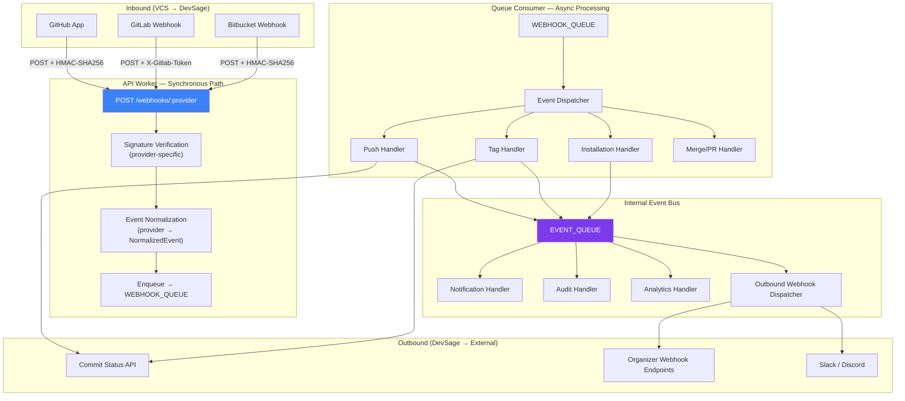

---

## 2. Inbound Webhook Pipeline

The synchronous webhook handler is deliberately minimal. Its only job is to authenticate, normalize, and enqueue. This keeps response times under 50ms and prevents webhook timeouts.

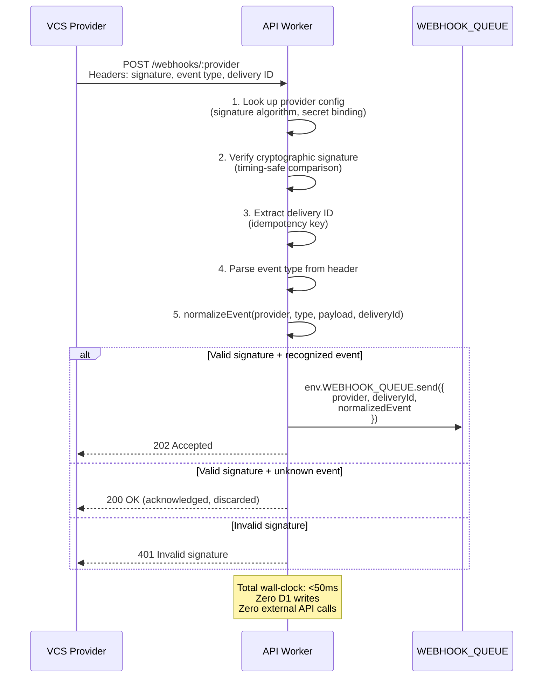

### Signature Verification by Provider

| Provider | Header | Algorithm | Secret Binding |
|----------|--------|-----------|---------------|
| GitHub | `x-hub-signature-256` | HMAC-SHA256 | `GITHUB_WEBHOOK_SECRET` |
| GitLab | `x-gitlab-token` | Direct token comparison | `GITLAB_WEBHOOK_TOKEN` |
| Bitbucket | `x-hub-signature` | HMAC-SHA256 | `BITBUCKET_WEBHOOK_SECRET` |

All HMAC verifications use `crypto.subtle` with timing-safe comparison to prevent timing attacks.

---

## 3. Provider Abstraction

Each VCS provider implements a `WebhookProvider` interface that handles the differences in payload format, authentication, and API capabilities.

```typescript
interface WebhookProvider {
  readonly name: 'github' | 'gitlab' | 'bitbucket';

  // Signature verification
  verifySignature(request: Request, secret: string): Promise<boolean>;

  // Extract provider-specific metadata
  extractDeliveryId(request: Request): string;
  extractEventType(request: Request): string;

  // Normalize raw payload into unified event
  normalizeEvent(
    eventType: string,
    payload: unknown,
    deliveryId: string
  ): NormalizedEvent | null;  // null = unrecognized, discard

  // Outbound API calls (fail-open)
  postCommitStatus(params: CommitStatusParams): Promise<void>;
  getFileContent(params: FileContentParams): Promise<string | null>;
  listBranches(params: ListBranchesParams): Promise<string[]>;
}

interface CommitStatusParams {
  repoFullName: string;
  sha: string;
  state: 'success' | 'failure' | 'pending';
  description: string;
  context: string;        // e.g., "devsage/submission"
  targetUrl?: string;     // Link back to DevSage
  accessToken: string;
}
```

### Provider Registration

```typescript
interface ProviderRegistry {
  providers: Map<string, WebhookProvider>;

  register(provider: WebhookProvider): void;
  get(name: string): WebhookProvider | null;
  list(): WebhookProvider[];
}

// Built-in providers registered at startup
registry.register(new GitHubProvider());
registry.register(new GitLabProvider());
registry.register(new BitbucketProvider());
```

---

## 4. GitHub Integration

### GitHub App Configuration

| Property | Value |
|----------|-------|
| Type | GitHub App (not OAuth App) |
| Webhook URL | `https://api.devsage.org/webhooks/github` |
| Permissions | Contents (Read), Metadata (Read), Commit statuses (Write) |
| Subscribed Events | `push`, `create`, `delete`, `installation`, `installation_repositories`, `pull_request` |
| Authentication | HMAC-SHA256 (`x-hub-signature-256`) |
| Installation scope | Per-repository (user selects repos during install) |

### GitHub Event Mapping

| GitHub Event | Condition | Normalized Type |
|-------------|-----------|----------------|
| `push` | Any push | `push` |
| `create` | `ref_type = 'tag'` | `tag_created` |
| `create` | `ref_type = 'branch'` | Discarded |
| `delete` | `ref_type = 'tag'` | `tag_deleted` |
| `delete` | `ref_type = 'branch'` | Discarded |
| `installation` | `action = 'created'` | `app_installed` |
| `installation` | `action = 'deleted'` | `app_uninstalled` |
| `installation_repositories` | `action = 'added'` | `repos_added` |
| `installation_repositories` | `action = 'removed'` | `repos_removed` |
| `pull_request` | `action = 'opened' \| 'synchronize'` | `pull_request` |

### GitHub App Authentication for API Calls

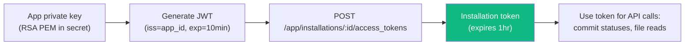

Token caching: Installation tokens are cached in KV with 55-minute TTL (5-minute safety margin before the 1-hour expiry).

---

## 5. GitLab Integration

### GitLab Webhook Configuration

| Property | Value |
|----------|-------|
| Type | Project webhook (configured per-repo in GitLab) |
| Webhook URL | `https://api.devsage.org/webhooks/gitlab` |
| Secret Token | `GITLAB_WEBHOOK_TOKEN` (shared per DevSage instance) |
| Events | Push events, Tag push events, Merge request events |
| Authentication | `X-Gitlab-Token` header (direct comparison) |

### GitLab Event Mapping

| GitLab Event | Condition | Normalized Type |
|-------------|-----------|----------------|
| Push Hook | `ref` starts with `refs/heads/` | `push` |
| Tag Push Hook | `ref` starts with `refs/tags/` + `after ≠ 000...` | `tag_created` |
| Tag Push Hook | `ref` starts with `refs/tags/` + `after = 000...` | `tag_deleted` |
| Merge Request Hook | `action = 'open' \| 'update'` | `pull_request` |

### GitLab API Authentication

GitLab uses project-level access tokens. Each linked GitLab repo stores a `project_access_token` (encrypted at rest) used for commit status posting and file reads.

---

## 6. Bitbucket Integration

### Bitbucket Webhook Configuration

| Property | Value |
|----------|-------|
| Type | Repository webhook (configured per-repo in Bitbucket) |
| Webhook URL | `https://api.devsage.org/webhooks/bitbucket` |
| Events | `repo:push`, `pullrequest:created`, `pullrequest:updated` |
| Authentication | HMAC-SHA256 (`X-Hub-Signature` header) |

### Bitbucket Event Mapping

| Bitbucket Event | Condition | Normalized Type |
|----------------|-----------|----------------|
| `repo:push` | Change includes tag ref | `tag_created` or `tag_deleted` |
| `repo:push` | Change includes branch ref | `push` |
| `pullrequest:created` | – | `pull_request` |
| `pullrequest:updated` | – | `pull_request` |

### Bitbucket Limitations

- Bitbucket doesn't separate tag creates from pushes — both arrive as `repo:push`. The handler inspects the `changes[]` array to detect tag operations.
- Force push detection uses the `changes[].forced` flag (available since Bitbucket API v2.0).
- Commit status posting uses app passwords (stored encrypted per-linked-repo).

---

## 7. Event Normalization

All provider-specific payloads are normalized into a unified event model before enqueuing.

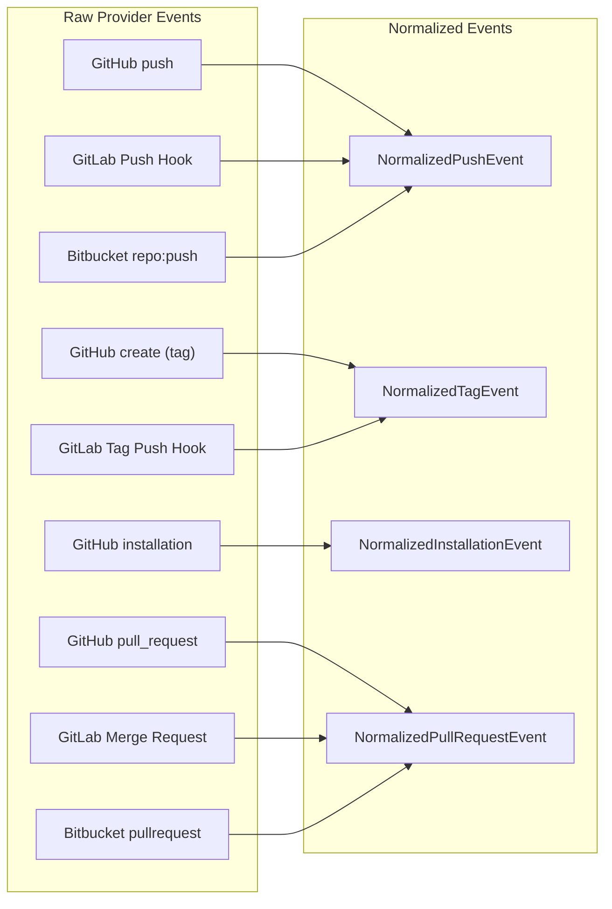

### Normalized Event Types

```typescript
// Base for all normalized events
interface NormalizedEventBase {
  deliveryId: string;          // Provider's delivery/request ID (idempotency key)
  provider: 'github' | 'gitlab' | 'bitbucket';
  receivedAt: string;          // ISO-8601 when DevSage received the webhook
}

interface NormalizedPushEvent extends NormalizedEventBase {
  type: 'push';
  repoFullName: string;        // "owner/repo" (GitHub/BB) or "namespace/project" (GitLab)
  branch: string;              // "main", "develop", etc.
  forced: boolean;             // Force push flag
  headSha: string;             // New HEAD after push
  beforeSha: string;           // Previous HEAD before push
  commits: NormalizedCommit[]; // Up to 20 most recent
  pusherLogin: string;         // Username of the pusher
  pusherEmail: string | null;  // Email if available
  compareUrl: string | null;   // Provider's compare URL (before...after)
}

interface NormalizedCommit {
  sha: string;
  message: string;
  authorName: string;
  authorEmail: string;
  timestamp: string;           // ISO-8601
  url: string;                 // Link to commit on provider
  added: string[];             // Files added
  modified: string[];          // Files modified
  removed: string[];           // Files removed
}

interface NormalizedTagEvent extends NormalizedEventBase {
  type: 'tag_created' | 'tag_deleted';
  repoFullName: string;
  tagName: string;
  sha: string;                 // Commit the tag points to (empty string for deletes)
  senderLogin: string;
  senderEmail: string | null;
}

interface NormalizedInstallationEvent extends NormalizedEventBase {
  type: 'app_installed' | 'app_uninstalled' | 'repos_added' | 'repos_removed';
  installationId: number;
  repositories: Array<{
    fullName: string;
    private: boolean;
  }>;
  senderLogin: string;
}

interface NormalizedPullRequestEvent extends NormalizedEventBase {
  type: 'pull_request';
  action: 'opened' | 'updated';
  repoFullName: string;
  prNumber: number;
  prTitle: string;
  prBody: string;
  sourceBranch: string;
  targetBranch: string;
  headSha: string;
  authorLogin: string;
  url: string;                 // Link to PR on provider
}

type NormalizedEvent =
  | NormalizedPushEvent
  | NormalizedTagEvent
  | NormalizedInstallationEvent
  | NormalizedPullRequestEvent;
```

---

## 8. Queue Processing

### Queue Configuration

| Queue | Binding | Purpose | Max Batch | Max Retries | Retry Delay |
|-------|---------|---------|-----------|-------------|-------------|
| `webhook-inbound` | `WEBHOOK_QUEUE` | VCS webhook processing | 10 | 3 | Exponential (30s, 2min, 10min) |
| `event-bus` | `EVENT_QUEUE` | Internal event distribution | 10 | 3 | Exponential (30s, 2min, 10min) |
| `outbound-webhooks` | `OUTBOUND_WEBHOOK_QUEUE` | Organizer webhook delivery | 5 | 5 | Exponential (1min, 5min, 15min, 30min, 1hr) |

### Dispatcher

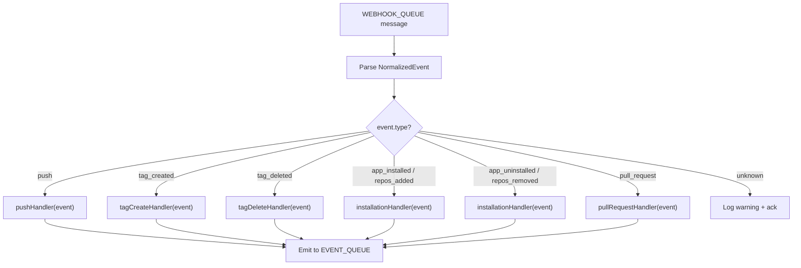

### Dead Letter Handling

After `max_retries` failures:

1. Message is acknowledged (removed from queue to prevent infinite retry).
2. `webhook_deliveries` row updated: `status = 'dead_lettered'`, `error_message` captured.
3. Audit event logged: `webhook.dead_lettered` with delivery ID and error context.
4. Internal event emitted: `system.webhook_dead_lettered` — triggers organizer notification.
5. Dead-lettered webhooks are queryable via API for debugging.

---

## 9. Push Handler

Processes push events: logs commits to the commit log and detects force pushes.

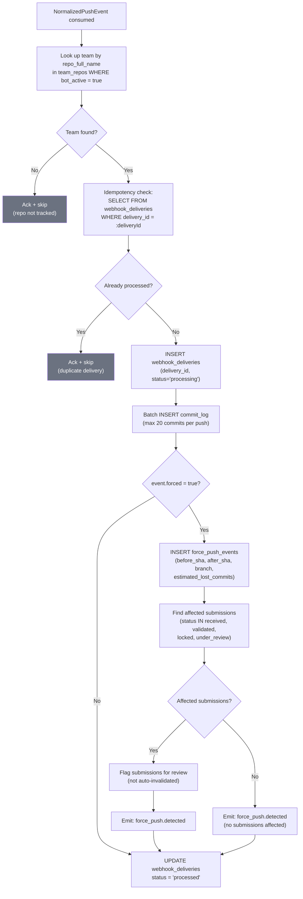

### Commit Log Limits

- Maximum 20 commits stored per push event. If a push contains more (e.g., a large merge), only the 20 most recent are stored.
- Each commit stores: SHA, message, author name, author email, timestamp, files changed counts.
- Commits are linked to the team, hackathon, and webhook delivery for traceability.

---

## 10. Tag Handler

Processes tag creation and deletion events. Tag creation drives the submission pipeline.

### Tag Create Flow

```mermaid
flowchart TD
    A["NormalizedTagEvent (tag_created)"] --> B["Look up team by repo_full_name"]
    B --> C{"Team found?"}
    C -->|No| D["Ack + skip"]
    C -->|Yes| E["Get hackathon config<br/>(submission_tag_pattern)"]
    E --> F{"Tag matches pattern?<br/>(regex: e.g., ^submission_v\\d+$)"}
    F -->|No| G["Ack + skip<br/>(not a submission tag)"]
    F -->|Yes| H["Idempotency check<br/>(delivery_id)"]
    H --> I["Call HackathonStateMachine DO<br/>POST /accept-submission"]
    I --> J{"DO response?"}
    J -->|accepted| K["INSERT submission<br/>(status: 'received')"]
    K --> L["Post commit status (success)<br/>via provider.postCommitStatus()"]
    L --> M["Emit: submission.received"]
    J -->|rejected (deadline, locked, etc.)| N["INSERT submission<br/>(status: 'invalid',<br/>rejection_reason)"]
    N --> O["Post commit status (failure)<br/>via provider.postCommitStatus()"]
    O --> P["Emit: submission.rejected"]

    style D fill:#6b7280,color:#fff
    style G fill:#6b7280,color:#fff
```

### Tag Delete Flow

Tag deletion is logged for audit but does not affect submissions (submissions are immutable once received).

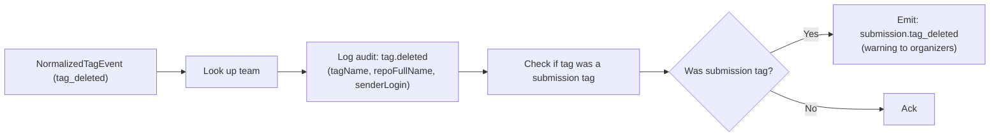

---

## 11. Installation Handler

Manages bot activation when the VCS app is installed, uninstalled, or repos are added/removed.

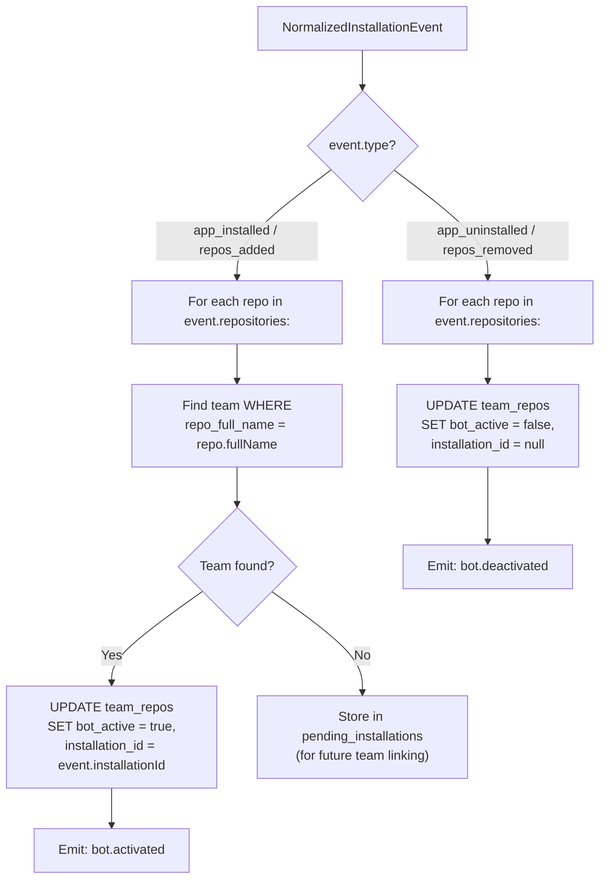

### Pending Installations

When a GitHub App is installed on a repo that hasn't been linked to a team yet, the installation is stored in `pending_installations`. When a team later links that repo, the system checks pending installations and auto-activates the bot.

---

## 12. Force Push Detection

Force pushes are flagged for organizer review, never auto-invalidated. This prevents false positives from legitimate rebases.

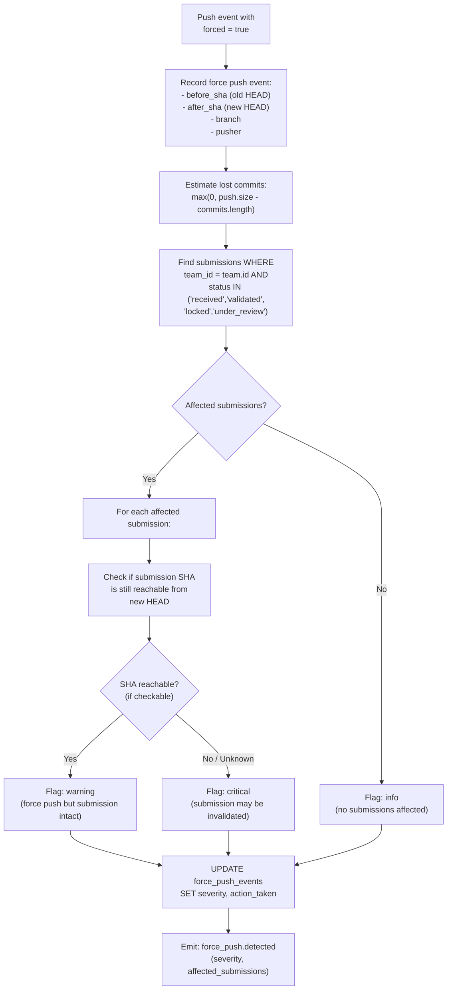

### Why Not Auto-Invalidate

1. **Reachability checks require GitHub API** — which may be rate-limited or unavailable.
2. **Legitimate rebases** are common (squash before submission, cleanup branches).
3. **False positives** would unfairly penalize teams.
4. **Organizers know context** — they can decide whether the force push is suspicious.

### Severity Levels

| Severity | Condition | Organizer Action |
|----------|-----------|-----------------|
| `info` | Force push on branch with no active submissions | No action needed |
| `warning` | Force push but submission SHA still reachable | Review recommended |
| `critical` | Force push and submission SHA may be unreachable | Investigation required |

---

## 13. Commit Status Posting

After processing submissions or running validation, DevSage posts status checks back to the VCS provider.

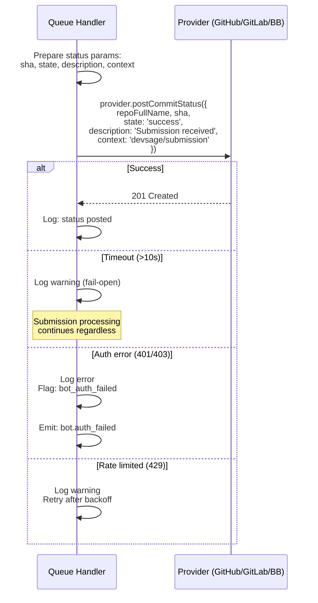

### Status Contexts

| Context | State | When |
|---------|-------|------|
| `devsage/submission` | `success` | Submission tag accepted and recorded |
| `devsage/submission` | `failure` | Submission rejected (deadline, locked, invalid tag) |
| `devsage/submission` | `pending` | Submission received, validation in progress |
| `devsage/validation` | `success` | Automated validation checks passed |
| `devsage/validation` | `failure` | Automated validation checks failed |

### Fail-Open Policy

All outbound VCS API calls follow the fail-open pattern:
- 10-second timeout via `AbortController`.
- Timeouts and 5xx errors are logged but do NOT fail the submission.
- 401/403 errors trigger a `bot.auth_failed` event (installation token may have been revoked).
- 429 rate limits are retried with exponential backoff (up to 3 retries).

---

## 14. Internal Event Bus

All system events — not just VCS webhooks — flow through a unified internal event bus. This decouples event producers from consumers.

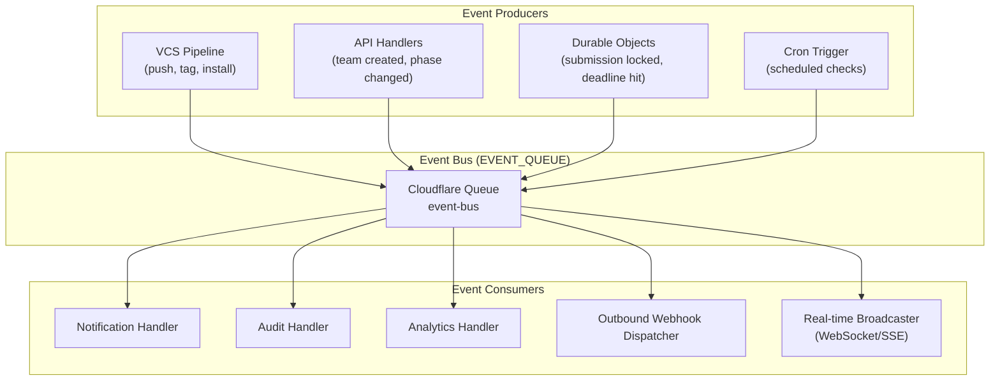

### Internal Event Schema

```typescript
interface InternalEvent {
  id: string;                // UUID
  type: string;              // Dot-notation: "submission.received", "team.created"
  hackathon_id: string;      // Which hackathon (for routing and filtering)
  actor: {
    type: 'user' | 'system' | 'bot' | 'cron';
    id: string;              // User ID or 'system'
    display_name: string;
  };
  payload: Record<string, unknown>;  // Event-specific data
  metadata: {
    source: string;          // "vcs_pipeline", "api", "durable_object", "cron"
    correlation_id: string;  // Links related events (e.g., webhook → submission → notification)
    timestamp: string;       // ISO-8601
  };
}
```

### Event Catalog (Selected)

| Event Type | Source | Payload (Key Fields) |
|-----------|--------|---------------------|
| `submission.received` | VCS pipeline | team_id, tag_name, sha, provider |
| `submission.rejected` | VCS pipeline | team_id, tag_name, reason |
| `submission.finalized` | API | team_id, submission_id |
| `submission.tag_deleted` | VCS pipeline | team_id, tag_name |
| `force_push.detected` | VCS pipeline | team_id, severity, affected_submissions |
| `bot.activated` | VCS pipeline | team_id, repo_full_name, provider |
| `bot.deactivated` | VCS pipeline | team_id, repo_full_name |
| `bot.auth_failed` | VCS pipeline | team_id, provider, error |
| `team.created` | API | team_id, hackathon_id, team_name |
| `team.member_joined` | API | team_id, user_id |
| `team.repo_linked` | API | team_id, repo_full_name, provider |
| `hackathon.phase_changed` | DO / API | hackathon_id, from_phase, to_phase |
| `hackathon.deadline_warning` | Cron | hackathon_id, deadline_type, minutes_remaining |
| `judging.score_submitted` | API | judge_id, submission_id, total_score |
| `judging.results_published` | API | hackathon_id, winner_team_ids |
| `system.webhook_dead_lettered` | Queue | delivery_id, provider, error |

---

## 15. Outbound Webhooks

Organizers can register webhook endpoints to receive hackathon events in real time. This enables custom integrations — Slack bots, dashboards, CI pipelines, etc.

### Outbound Webhook Configuration

```typescript
interface OutboundWebhookConfig {
  id: string;                        // UUID
  hackathon_id: string;              // Which hackathon
  url: string;                       // HTTPS endpoint to deliver to
  secret: string;                    // Shared secret for HMAC signing (generated, shown once)
  events: string[];                  // Event types to subscribe to (e.g., ["submission.*", "team.created"])
  active: boolean;                   // Enable/disable without deleting
  description: string;               // Human label
  created_by: string;                // User who created
  created_at: string;
  updated_at: string;
}
```

### Outbound Delivery Flow

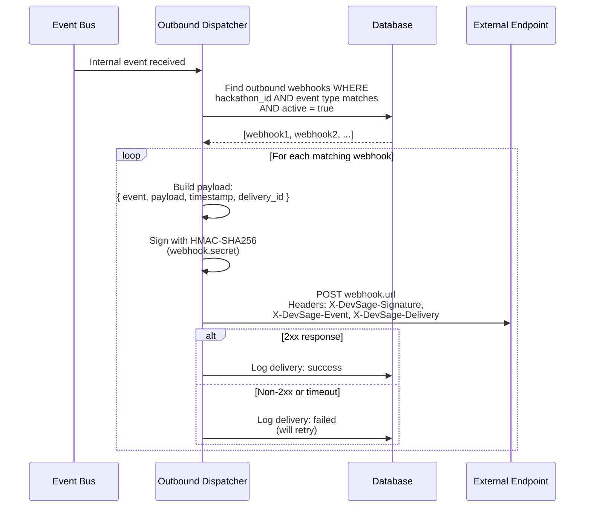

### Outbound Delivery Payload

```json
{
  "event": "submission.received",
  "delivery_id": "del_abc123",
  "timestamp": "2026-03-15T14:30:00Z",
  "hackathon": {
    "id": "h_xyz",
    "slug": "spring-hack-2026",
    "name": "Spring Hack 2026"
  },
  "payload": {
    "team_id": "t_abc",
    "team_name": "Team Alpha",
    "tag_name": "submission_v1",
    "sha": "abc123def456",
    "provider": "github",
    "repo_full_name": "teamalpha/project"
  }
}
```

### Outbound Security

- Endpoints must be HTTPS (HTTP rejected at configuration time).
- Every delivery is signed with HMAC-SHA256 using the webhook's secret.
- Signature is sent in `X-DevSage-Signature-256` header.
- 10-second timeout per delivery attempt.
- Maximum 5 retries with exponential backoff (1min → 5min → 15min → 30min → 1hr).
- After all retries exhausted: webhook auto-disabled, organizer notified.
- Maximum 10 outbound webhooks per hackathon.

### Outbound Webhook API

```
POST   /api/v1/hackathons/:slug/webhooks           # Create outbound webhook (admin+)
GET    /api/v1/hackathons/:slug/webhooks           # List webhooks (admin+)
GET    /api/v1/hackathons/:slug/webhooks/:id       # Get webhook details (admin+)
PUT    /api/v1/hackathons/:slug/webhooks/:id       # Update webhook (admin+)
DELETE /api/v1/hackathons/:slug/webhooks/:id       # Delete webhook (admin+)
POST   /api/v1/hackathons/:slug/webhooks/:id/test  # Send test event (admin+)
GET    /api/v1/hackathons/:slug/webhooks/:id/deliveries  # List delivery history (admin+)
```

---

## 16. Integration Marketplace

A pluggable integration model for third-party tools beyond VCS providers.

### Built-in Integrations

| Integration | Type | Description |
|------------|------|-------------|
| GitHub | VCS | Full app integration (commits, tags, PRs, bot) |
| GitLab | VCS | Webhook-based (commits, tags, MRs) |
| Bitbucket | VCS | Webhook-based (commits, tags, PRs) |
| Slack | Notification | Post events to Slack channels via incoming webhooks |
| Discord | Notification | Post events to Discord channels via webhooks |

### Integration Manifest

Each integration (built-in or third-party) is described by a manifest:

```typescript
interface IntegrationManifest {
  id: string;                        // Unique identifier (e.g., "github", "slack")
  name: string;                      // Display name
  description: string;               // What it does
  version: string;                   // Semver
  category: 'vcs' | 'notification' | 'ci' | 'analytics' | 'other';
  icon_url: string;                  // Icon for marketplace UI

  // What the integration needs from the organizer
  config_schema: JSONSchema;         // JSON Schema for configuration fields

  // What events the integration can receive
  supported_events: string[];        // Event type patterns (e.g., "submission.*")

  // Capabilities
  capabilities: {
    inbound_webhooks: boolean;       // Can receive VCS webhooks
    outbound_notifications: boolean; // Can send notifications
    commit_status: boolean;          // Can post commit statuses
    file_read: boolean;              // Can read repo files
  };
}
```

### Marketplace API

```
GET    /api/v1/integrations                              # List available integrations
GET    /api/v1/integrations/:integrationId               # Get integration details

POST   /api/v1/hackathons/:slug/integrations             # Enable integration for hackathon (admin+)
GET    /api/v1/hackathons/:slug/integrations             # List enabled integrations (admin+)
PUT    /api/v1/hackathons/:slug/integrations/:id         # Update integration config (admin+)
DELETE /api/v1/hackathons/:slug/integrations/:id         # Disable integration (admin+)
```

---

## 17. Idempotency & Reliability

### Idempotency Keys at Every Layer

| Layer | Key | Mechanism |
|-------|-----|-----------|
| Webhook ingestion | Provider delivery ID header | Passed through to queue message |
| Queue consumer | `delivery_id` in `webhook_deliveries` | Pre-check query before processing |
| Submission creation | `UNIQUE(webhook_delivery_id)` on submissions | DB constraint prevents duplicates |
| DO submission lock | `UNIQUE(webhook_delivery_id)` in DO SQLite | DO-level constraint |
| Tag uniqueness | `UNIQUE(team_id, tag_name)` on submissions | One submission per tag per team |
| Outbound delivery | `UNIQUE(webhook_id, event_id)` | One delivery per webhook per event |

### Delivery Tracking

Every inbound webhook is tracked in `webhook_deliveries`:

```typescript
interface WebhookDelivery {
  id: string;                    // UUID
  delivery_id: string;           // Provider's delivery ID (idempotency key)
  provider: 'github' | 'gitlab' | 'bitbucket';
  event_type: string;            // Normalized event type
  status: 'received' | 'processing' | 'processed' | 'failed' | 'dead_lettered';
  repo_full_name: string;        // Which repo triggered it
  hackathon_id: string | null;   // Resolved hackathon (null if repo not linked)
  team_id: string | null;        // Resolved team (null if repo not linked)
  payload_hash: string;          // SHA-256 of raw payload (for debugging, not stored raw)
  error_message: string | null;  // Error details if failed
  processing_ms: number | null;  // Processing duration
  attempts: number;              // Number of processing attempts
  received_at: string;           // When the webhook arrived
  processed_at: string | null;   // When processing completed
}
```

### Retry Behavior

- VCS providers (GitHub, GitLab) may redeliver webhooks up to 3 times on their own.
- Cloudflare Queues retry failed messages according to the queue configuration.
- All handlers are safe for redelivery — idempotency checks run before any writes.
- After `max_retries`, messages are dead-lettered (not lost — tracked and queryable).

---

## 18. API Endpoints

### Webhook Ingestion (Public)

```
POST /webhooks/github              # GitHub App webhook receiver
POST /webhooks/gitlab              # GitLab webhook receiver
POST /webhooks/bitbucket           # Bitbucket webhook receiver
```

### Webhook Delivery History (Admin)

```
GET  /api/v1/hackathons/:slug/webhook-deliveries                  # List deliveries (admin+)
GET  /api/v1/hackathons/:slug/webhook-deliveries/:deliveryId      # Get delivery details (admin+)
POST /api/v1/hackathons/:slug/webhook-deliveries/:deliveryId/retry  # Retry dead-lettered (admin+)
```

### Commit Log (Participant+)

```
GET  /api/v1/hackathons/:slug/teams/:teamId/commits     # List team's commit log (own team or mod+)
GET  /api/v1/hackathons/:slug/commits                   # List all commits (mod+)
```

### Force Push Events (Moderator+)

```
GET  /api/v1/hackathons/:slug/force-pushes              # List force push events (mod+)
PUT  /api/v1/hackathons/:slug/force-pushes/:id/resolve  # Mark as reviewed (admin+)
```

### Bot Status

```
GET  /api/v1/hackathons/:slug/teams/:teamId/bot-status  # Check bot activation (team_leader+)
POST /api/v1/hackathons/:slug/teams/:teamId/bot/check   # Trigger bot health check (team_leader+)
```

---

## 19. Edge Cases

| Scenario | Behavior |
|----------|----------|
| Webhook arrives for repo not linked to any team | Logged in `webhook_deliveries` with `team_id = null`, processing skipped |
| Same tag pushed to two repos linked to the same team | Each produces a separate submission attempt. Second is rejected by `UNIQUE(team_id, tag_name)` |
| GitHub App uninstalled after submission received | Submission is preserved. Commit status posting will fail (logged, fail-open). Bot marked inactive |
| GitLab project access token revoked | Commit status posting fails. `bot.auth_failed` event emitted. Organizer notified |
| Force push on a branch that had a submission tag | Submission is preserved (tags are separate refs). Flagged as `warning` severity for review |
| Tag deleted after submission | Submission is NOT deleted (immutable). Audit event logged. Organizer warned |
| Webhook payload too large (>1MB) | Rejected at Cloudflare level (Workers request size limit). Provider receives 413 |
| Duplicate delivery ID from provider | Idempotency check catches it. Second delivery is acked and skipped |
| Queue consumer crashes mid-processing | Message returned to queue for retry. Idempotency check prevents duplicate writes |
| Outbound webhook endpoint returns 3xx redirect | NOT followed. Treated as failure. Organizers must configure the final URL |
| Outbound webhook endpoint is unreachable for 24+ hours | Auto-disabled after 5 consecutive total failures across all events. Organizer notified |
| Team changes linked repo | Old repo's bot_active set to false. New repo checked for pending installations |
| Multiple VCS providers linked to same team | Supported. Each repo has its own `team_repos` entry with provider-specific config |
| Webhook secret rotated | Old secret continues to work for 24 hours (dual-accept window). New secret takes priority |
| GitHub rate limit (5000 req/hr) hit during status posting | Queued for retry with exponential backoff. Submission processing is unaffected |

---

## 20. Error Codes

| Code | HTTP | Condition |
|------|------|-----------|
| `WEBHOOK_INVALID_SIGNATURE` | 401 | HMAC signature verification failed |
| `WEBHOOK_UNKNOWN_PROVIDER` | 400 | Unrecognized provider in URL path |
| `WEBHOOK_PAYLOAD_TOO_LARGE` | 413 | Payload exceeds 1MB limit |
| `WEBHOOK_PARSE_ERROR` | 400 | Payload could not be parsed as JSON |
| `DELIVERY_NOT_FOUND` | 404 | Webhook delivery ID does not exist |
| `DELIVERY_NOT_RETRYABLE` | 400 | Only dead-lettered deliveries can be retried |
| `OUTBOUND_WEBHOOK_NOT_FOUND` | 404 | Outbound webhook ID does not exist |
| `OUTBOUND_URL_NOT_HTTPS` | 400 | Outbound webhook URL must be HTTPS |
| `OUTBOUND_MAX_WEBHOOKS` | 400 | Hackathon has reached 10 outbound webhooks limit |
| `OUTBOUND_INVALID_EVENTS` | 400 | One or more event types are not recognized |
| `INTEGRATION_NOT_FOUND` | 404 | Integration ID does not exist in marketplace |
| `INTEGRATION_ALREADY_ENABLED` | 409 | Integration is already enabled for this hackathon |
| `INTEGRATION_CONFIG_INVALID` | 400 | Integration configuration does not match schema |
| `BOT_NOT_INSTALLED` | 400 | VCS app not installed on the linked repository |
| `BOT_AUTH_FAILED` | 502 | VCS provider returned auth error when posting status |
| `REPO_NOT_LINKED` | 400 | Repository is not linked to any team in this hackathon |
| `COMMIT_LOG_NOT_FOUND` | 404 | No commit log entries for this team |
| `FORCE_PUSH_NOT_FOUND` | 404 | Force push event ID does not exist |
| `FORCE_PUSH_ALREADY_RESOLVED` | 409 | Force push event already marked as reviewed |

---

## 21. Database Tables

### `webhook_deliveries`

Tracks every inbound webhook from VCS providers.

| Column | Type | Constraints | Description |
|--------|------|-------------|-------------|
| `id` | TEXT | PK, UUID | Internal delivery record ID |
| `delivery_id` | TEXT | UNIQUE, NOT NULL | Provider's delivery ID (idempotency key) |
| `provider` | TEXT | NOT NULL, CHECK IN ('github','gitlab','bitbucket') | VCS provider |
| `event_type` | TEXT | NOT NULL | Normalized event type |
| `status` | TEXT | NOT NULL, DEFAULT 'received' | received, processing, processed, failed, dead_lettered |
| `repo_full_name` | TEXT | NOT NULL | Repository identifier |
| `hackathon_id` | TEXT | FK → hackathons.id, NULL | Resolved hackathon (null if unlinked repo) |
| `team_id` | TEXT | FK → teams.id, NULL | Resolved team (null if unlinked repo) |
| `payload_hash` | TEXT | NOT NULL | SHA-256 of raw payload |
| `error_message` | TEXT | NULL | Error details if failed |
| `processing_ms` | INTEGER | NULL | Processing duration in milliseconds |
| `attempts` | INTEGER | NOT NULL, DEFAULT 0 | Number of processing attempts |
| `received_at` | TEXT | NOT NULL | ISO-8601 |
| `processed_at` | TEXT | NULL | ISO-8601 |

**Indexes:** UNIQUE(`delivery_id`), INDEX(`hackathon_id`, `received_at`), INDEX(`status`), INDEX(`repo_full_name`)

---

### `commit_log`

Stores individual commits from push events.

| Column | Type | Constraints | Description |
|--------|------|-------------|-------------|
| `id` | TEXT | PK, UUID | Unique commit record ID |
| `hackathon_id` | TEXT | FK → hackathons.id, NOT NULL | Which hackathon |
| `team_id` | TEXT | FK → teams.id, NOT NULL | Which team |
| `delivery_id` | TEXT | FK → webhook_deliveries.id, NOT NULL | Which webhook delivery |
| `sha` | TEXT | NOT NULL | Full commit SHA |
| `message` | TEXT | NOT NULL | Commit message |
| `author_name` | TEXT | NOT NULL | Git author name |
| `author_email` | TEXT | NOT NULL | Git author email |
| `committed_at` | TEXT | NOT NULL | Commit timestamp (ISO-8601) |
| `url` | TEXT | NOT NULL | Link to commit on VCS provider |
| `files_added` | INTEGER | NOT NULL, DEFAULT 0 | Number of files added |
| `files_modified` | INTEGER | NOT NULL, DEFAULT 0 | Number of files modified |
| `files_removed` | INTEGER | NOT NULL, DEFAULT 0 | Number of files removed |
| `branch` | TEXT | NOT NULL | Branch name |
| `provider` | TEXT | NOT NULL | VCS provider |
| `created_at` | TEXT | NOT NULL, DEFAULT CURRENT_TIMESTAMP | ISO-8601 |

**Indexes:** INDEX(`hackathon_id`, `team_id`, `committed_at`), INDEX(`sha`), INDEX(`delivery_id`)

---

### `force_push_events`

Records force push detections and organizer resolution.

| Column | Type | Constraints | Description |
|--------|------|-------------|-------------|
| `id` | TEXT | PK, UUID | Unique event ID |
| `hackathon_id` | TEXT | FK → hackathons.id, NOT NULL | Which hackathon |
| `team_id` | TEXT | FK → teams.id, NOT NULL | Which team |
| `delivery_id` | TEXT | FK → webhook_deliveries.id, NOT NULL | Source webhook delivery |
| `repo_full_name` | TEXT | NOT NULL | Repository |
| `branch` | TEXT | NOT NULL | Branch that was force pushed |
| `before_sha` | TEXT | NOT NULL | Previous HEAD |
| `after_sha` | TEXT | NOT NULL | New HEAD after force push |
| `estimated_lost_commits` | INTEGER | NOT NULL, DEFAULT 0 | Estimated commits lost |
| `severity` | TEXT | NOT NULL, DEFAULT 'info' | info, warning, critical |
| `affected_submission_ids` | TEXT | NOT NULL, DEFAULT '[]' | JSON array of affected submission IDs |
| `resolved` | INTEGER | NOT NULL, DEFAULT 0 | 0 = unresolved, 1 = reviewed |
| `resolved_by` | TEXT | FK → users.id, NULL | Organizer who reviewed |
| `resolved_at` | TEXT | NULL | When reviewed |
| `resolution_note` | TEXT | NULL | Organizer's notes |
| `provider` | TEXT | NOT NULL | VCS provider |
| `pusher_login` | TEXT | NOT NULL | Username of force pusher |
| `created_at` | TEXT | NOT NULL, DEFAULT CURRENT_TIMESTAMP | ISO-8601 |

**Indexes:** INDEX(`hackathon_id`, `created_at`), INDEX(`team_id`), INDEX(`resolved`)

---

### `outbound_webhooks`

Organizer-configured webhook endpoints for receiving events.

| Column | Type | Constraints | Description |
|--------|------|-------------|-------------|
| `id` | TEXT | PK, UUID | Unique webhook ID |
| `hackathon_id` | TEXT | FK → hackathons.id, NOT NULL | Which hackathon |
| `url` | TEXT | NOT NULL | HTTPS endpoint URL |
| `secret_hash` | TEXT | NOT NULL | SHA-256 of the signing secret |
| `events` | TEXT | NOT NULL | JSON array of event type patterns |
| `active` | INTEGER | NOT NULL, DEFAULT 1 | 1 = enabled, 0 = disabled |
| `description` | TEXT | NOT NULL, DEFAULT '' | Human label |
| `consecutive_failures` | INTEGER | NOT NULL, DEFAULT 0 | Failure counter (resets on success) |
| `created_by` | TEXT | FK → users.id, NOT NULL | Who created |
| `created_at` | TEXT | NOT NULL, DEFAULT CURRENT_TIMESTAMP | ISO-8601 |
| `updated_at` | TEXT | NOT NULL, DEFAULT CURRENT_TIMESTAMP | ISO-8601 |
| `disabled_at` | TEXT | NULL | When auto-disabled due to failures |

**Indexes:** INDEX(`hackathon_id`, `active`), INDEX(`hackathon_id`)

---

### `outbound_webhook_deliveries`

Tracks every outbound webhook delivery attempt.

| Column | Type | Constraints | Description |
|--------|------|-------------|-------------|
| `id` | TEXT | PK, UUID | Unique delivery ID |
| `webhook_id` | TEXT | FK → outbound_webhooks.id, NOT NULL, ON DELETE CASCADE | Which webhook |
| `event_id` | TEXT | NOT NULL | Internal event ID that triggered delivery |
| `event_type` | TEXT | NOT NULL | Event type (e.g., "submission.received") |
| `status` | TEXT | NOT NULL, DEFAULT 'pending' | pending, delivered, failed, dead_lettered |
| `http_status` | INTEGER | NULL | Response status code from endpoint |
| `response_ms` | INTEGER | NULL | Response time in milliseconds |
| `error_message` | TEXT | NULL | Error details if failed |
| `attempts` | INTEGER | NOT NULL, DEFAULT 0 | Number of delivery attempts |
| `next_retry_at` | TEXT | NULL | When next retry is scheduled |
| `created_at` | TEXT | NOT NULL, DEFAULT CURRENT_TIMESTAMP | ISO-8601 |
| `delivered_at` | TEXT | NULL | When successfully delivered |

**Indexes:** UNIQUE(`webhook_id`, `event_id`), INDEX(`webhook_id`, `status`), INDEX(`next_retry_at`)

---

### `pending_installations`

Stores VCS app installations for repos not yet linked to teams.

| Column | Type | Constraints | Description |
|--------|------|-------------|-------------|
| `id` | TEXT | PK, UUID | Unique record ID |
| `provider` | TEXT | NOT NULL | VCS provider |
| `repo_full_name` | TEXT | NOT NULL | Repository identifier |
| `installation_id` | TEXT | NOT NULL | Provider's installation ID |
| `installed_by` | TEXT | NOT NULL | Username who installed |
| `created_at` | TEXT | NOT NULL, DEFAULT CURRENT_TIMESTAMP | ISO-8601 |

**Indexes:** UNIQUE(`provider`, `repo_full_name`), INDEX(`repo_full_name`)

---

### `hackathon_integrations`

Tracks which integrations are enabled per hackathon.

| Column | Type | Constraints | Description |
|--------|------|-------------|-------------|
| `id` | TEXT | PK, UUID | Unique record ID |
| `hackathon_id` | TEXT | FK → hackathons.id, NOT NULL | Which hackathon |
| `integration_id` | TEXT | NOT NULL | Integration manifest ID |
| `config` | TEXT | NOT NULL, DEFAULT '{}' | JSON config matching integration's config_schema |
| `active` | INTEGER | NOT NULL, DEFAULT 1 | 1 = enabled, 0 = disabled |
| `enabled_by` | TEXT | FK → users.id, NOT NULL | Who enabled |
| `created_at` | TEXT | NOT NULL, DEFAULT CURRENT_TIMESTAMP | ISO-8601 |
| `updated_at` | TEXT | NOT NULL, DEFAULT CURRENT_TIMESTAMP | ISO-8601 |

**Indexes:** UNIQUE(`hackathon_id`, `integration_id`), INDEX(`hackathon_id`)

---

## 22. Decision Log

| Decision | Choice | Why | Alternatives Considered |
|----------|--------|-----|------------------------|
| Synchronous handler does zero D1 writes | Verify → normalize → enqueue only | GitHub times out webhooks at 10 seconds. Any D1 write risks exceeding that. Queue processing is unbounded in time | Write delivery record synchronously (too slow); accept and process inline (timeout risk) |
| Multi-provider via normalized events | Single `NormalizedEvent` union type | Adding a provider means implementing one interface. All downstream handlers (push, tag, install) work unchanged | Provider-specific handlers everywhere (duplication); adapter pattern per handler (complex) |
| Force pushes flagged, not auto-invalidated | Organizer review with severity levels | Reachability checks require provider API (rate limits, downtime). Legitimate rebases are common. False positives would punish teams unfairly | Auto-invalidate all affected submissions; require reachability proof before flagging |
| Fail-open for all outbound API calls | 10-second timeout, log warning, proceed | Submission processing must never depend on external API availability. A GitHub outage should not block hackathon operations | Fail-closed (block until success); retry indefinitely (resource waste) |
| Idempotency at every layer | Delivery ID + DB constraints + DO locks | VCS providers redeliver webhooks. Queues retry on failure. Multiple layers ensure no duplicates even under concurrent processing | Single idempotency check at ingestion (not sufficient for queue retries); optimistic locking only (race conditions) |
| Internal event bus via Cloudflare Queue | Single `EVENT_QUEUE` with fan-out consumers | Decouples producers from consumers. Adding a new consumer (e.g., analytics) requires zero changes to producers. Queue provides durability and retry | Direct function calls (coupling); separate queues per consumer (operational overhead); external event bus like Kafka (overkill for scale) |
| Outbound webhooks auto-disable after failures | 5 consecutive failures across all events | Prevents wasting resources on unreachable endpoints. Organizer is notified and can re-enable manually. Better than silently dropping events forever | Never disable (resource waste); disable after time-based window (less precise); require manual monitoring (poor UX) |
| Pending installations table | Store installs for unlinked repos | Teams may link repos after the GitHub App is installed. Without this, they'd have to reinstall. Matches natural user flow: install app → create team → link repo | Require linking before install (poor UX); check GitHub API on link (rate limits, latency) |
| GitLab uses project tokens, not app-level auth | Per-repo project access tokens | GitLab doesn't have the same App model as GitHub. Project tokens are scoped and revocable per-repo. Simpler than group-level tokens | GitLab group tokens (broader scope than needed); OAuth app tokens (complex setup for users); personal tokens (security risk) |
| Webhook secret dual-accept on rotation | Old secret valid for 24 hours after rotation | Prevents webhook delivery failures during rotation. VCS providers may have in-flight deliveries signed with the old secret | Immediate cutover (missed webhooks); queue-based replay (complex); no rotation support (security risk) |
| Max 20 commits stored per push | Truncate to most recent 20 | Large merges can contain hundreds of commits. Storing all would blow up D1 storage. 20 covers typical development velocity per push | Store all (storage concern); store only count (lose commit detail); configurable per hackathon (complexity) |
| Pull request events normalized | `NormalizedPullRequestEvent` type | Enables future features: PR-based submissions, automated code review triggers, PR activity in team feeds | Ignore PRs entirely (limits future features); PR-only submissions (too different from tag model) |
